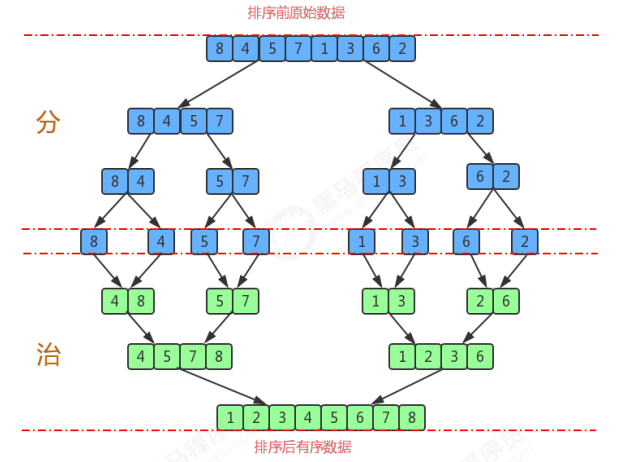
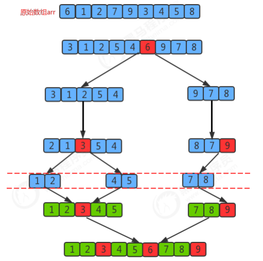
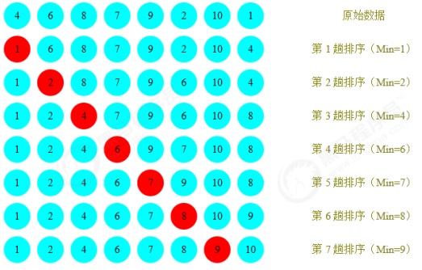
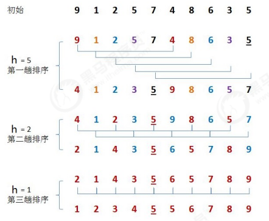
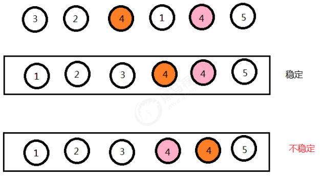
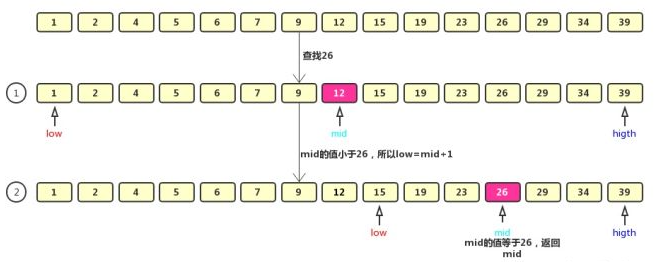

# 算法基础

## 一、排序算法

###  冒泡排序

冒泡排序（Bubble Sort），是一种计算机科学领域的较简单的排序算法。

> 排序前：{4,5,6,3,2,1}
>
> 排序后：{1,2,3,4,5,6}

排序原理： 

1. 比较相邻的元素。如果前一个元素比后一个元素大，就交换这两个元素的位置。 
2. 对每一对相邻元素做同样的工作，从开始第一对元素到结尾的最后一对元素。最终最后位置的元素就是最大 值。

~~~java
public class Bubble {
    /*
    对数组a中的元素进行排序
    */
    public static void sort(Comparable[] a) {
        for (int i = a.length - 1; i > 0; i--) {
            for (int j = 0; j < i; j++) {
                if (greater(a[j], a[j + 1])) {
                    exch(a, j, j + 1);
                }
            }
        }
    }

    /*
    比较v元素是否大于w元素
    */
    private static boolean greater(Comparable v, Comparable w) {
        return v.compareTo(w) > 0;
    }

    /*
    数组元素i和j交换位置
    */
    private static void exch(Comparable[] a, int i, int j) {
        Comparable t = a[i];
        a[i] = a[j];
        a[j] = t;
    }
}
~~~

### 插入排序

插入排序（Insertion sort）是一种简单直观且稳定的排序算法。

> 排序前：{4,3,2,10,12,1,5,6} 
>
> 排序后：{1,2,3,4,5,6,10,12}

**排序原理：** 

1.把所有的元素分为两组，已经排序的和未排序的； 

2.找到未排序的组中的第一个元素，向已经排序的组中进行插入； 

3.倒叙遍历已经排序的元素，依次和待插入的元素进行比较，直到找到一个元素小于等于待插入元素，那么就把待 插入元素放到这个位置，其他的元素向后移动一位；

~~~java
public class Insertion {
    /*
    对数组a中的元素进行排序
    */
    public static void sort(Comparable[] a) {
        for (int i = 1; i < a.length; i++) {
			//当前元素为a[i],依次和i前面的元素比较，找到一个小于等于a[i]的元素
            for (int j = i; j > 0; j--) {
                if (greater(a[j - 1], a[j])) {
					//交换元素
                    exch(a, j - 1, j);
                } else {
					//找到了该元素，结束
                    break;
                }
            }
        }
    }

    /*
    比较v元素是否大于w元素
    */
    private static boolean greater(Comparable v, Comparable w) {
        return v.compareTo(w) > 0;
    }

    /*
    数组元素i和j交换位置
    */
    private static void exch(Comparable[] a, int i, int j) {
        Comparable t = a[i];
        a[i] = a[j];
        a[j] = t;
    }
}
~~~

### 归并排序

归并排序（Merge Sort）是建立在归并操作上的一种有效的排序算法，该算法是采用分治法的一个非常典型的应用。将已有序的子 序列合并，得到完全有序的序列；即先使每个子序列有序，再使子序列段间有序。若将两个有序表合并成一个有序 表，称为二路归并。

> 排序前：{8,4,5,7,1,3,6,2} 
>
> 排序后：{1,2,3,4,5,6,7,8}

**排序原理：** 

1.尽可能的一组数据拆分成两个元素相等的子组，并对每一个子组继续拆分，直到拆分后的每个子组的元素个数是 1为止。 

2.将相邻的两个子组进行合并成一个有序的大组； 

3.不断的重复步骤2，直到最终只有一个组为止。

~~~java
public class Merge {
    private static Comparable[] assist;//归并所需要的辅助数组

    /*
    对数组a中的元素进行排序
    */
    public static void sort(Comparable[] a) {
        assist = new Comparable[a.length];
        int lo = 0;
        int hi = a.length - 1;
        sort(a, lo, hi);
    }

    /*
    对数组a中从lo到hi的元素进行排序
    */
    private static void sort(Comparable[] a, int lo, int hi) {
        if (hi <= lo) {
            return;
        }
        int mid = lo + (hi - lo) / 2;
//对lo到mid之间的元素进行排序；
        sort(a, lo, mid);
//对mid+1到hi之间的元素进行排序；
        sort(a, mid + 1, hi);
//对lo到mid这组数据和mid到hi这组数据进行归并
        merge(a, lo, mid, hi);
    }

    /*
    对数组中，从lo到mid为一组，从mid+1到hi为一组，对这两组数据进行归并
    */
    private static void merge(Comparable[] a, int lo, int mid, int hi) {
//lo到mid这组数据和mid+1到hi这组数据归并到辅助数组assist对应的索引处
        int i = lo;//定义一个指针，指向assist数组中开始填充数据的索引
        int p1 = lo;//定义一个指针，指向第一组数据的第一个元素
        int p2 = mid + 1;//定义一个指针，指向第二组数据的第一个元素
        //比较左边小组和右边小组中的元素大小，哪个小，就把哪个数据填充到assist数组中
        while (p1 <= mid && p2 <= hi) {
            if (less(a[p1], a[p2])) {
                assist[i++] = a[p1++];
            } else {
                assist[i++] = a[p2++];
            }
        }
//上面的循环结束后，如果退出循环的条件是p1<=mid，则证明左边小组中的数据已经归并完毕，如果退
        出循环的条件是p2 <= hi, 则证明右边小组的数据已经填充完毕；
//所以需要把未填充完毕的数据继续填充到assist中,//下面两个循环，只会执行其中的一个
        while (p1 <= mid) {
            assist[i++] = a[p1++];
        }
        while (p2 <= hi) {
            assist[i++] = a[p2++];
        }
//到现在为止，assist数组中，从lo到hi的元素是有序的，再把数据拷贝到a数组中对应的索引处
        for (int index = lo; index <= hi; index++) {
            a[index] = assist[index];
        }
    }

    /*
    比较v元素是否小于w元素
    */
    private static boolean less(Comparable v, Comparable w) {
        return v.compareTo(w) < 0;
    }

    /*
    数组元素i和j交换位置
    */
    private static void exch(Comparable[] a, int i, int j) {
        Comparable t = a[i];
        a[i] = a[j];
        a[j] = t;
    }
}
~~~

### 快速排序

快速排序（Quick Sort）是对冒泡排序的一种改进。

它的基本思想是：通过一趟排序将要排序的数据分割成独立的两部分，其中一 部分的所有数据都比另外一部分的所有数据都要小，然后再按此方法对这两部分数据分别进行快速排序，整个排序 过程可以递归进行，以此达到整个数据变成有序序列。

> 排序前:{6, 1, 2, 7, 9, 3, 4, 5, 8} 
>
> 排序后:{1, 2, 3, 4, 5, 6, 7, 8, 9}

**排序原理：** 

1.首先设定一个分界值，通过该分界值将数组分成左右两部分； 

2.将大于或等于分界值的数据放到到数组右边，小于分界值的数据放到数组的左边。此时左边部分中各元素都小于 或等于分界值，而右边部分中各元素都大于或等于分界值；

3.然后，左边和右边的数据可以独立排序。对于左侧的数组数据，又可以取一个分界值，将该部分数据分成左右两 部分，同样在左边放置较小值，右边放置较大值。右侧的数组数据也可以做类似处理。 

4.重复上述过程，可以看出，这是一个递归定义。通过递归将左侧部分排好序后，再递归排好右侧部分的顺序。当 左侧和右侧两个部分的数据排完序后，整个数组的排序也就完成了。

**切分原理：** 把一个数组切分成两个子数组的基本思想： 

1.找一个基准值，用两个指针分别指向数组的头部和尾部； 

2.先从尾部向头部开始搜索一个比基准值小的元素，搜索到即停止，并记录指针的位置； 

3.再从头部向尾部开始搜索一个比基准值大的元素，搜索到即停止，并记录指针的位置； 

4.交换当前左边指针位置和右边指针位置的元素； 

5.重复2,3,4步骤，直到左边指针的值大于右边指针的值停止。

~~~java
public class Quick {
    public static void sort(Comparable[] a) {
        int lo = 0;
        int hi = a.length - 1;
        sort(a, lo, hi);
    }

    private static void sort(Comparable[] a, int lo, int hi) {
        if (hi <= lo) {
            return;
        }
//对a数组中，从lo到hi的元素进行切分
        int partition = partition(a, lo, hi);
//对左边分组中的元素进行排序
//对右边分组中的元素进行排序
        sort(a, lo, partition - 1);
        sort(a, partition + 1, hi);
    }

    public static int partition(Comparable[] a, int lo, int hi) {
        Comparable key = a[lo];//把最左边的元素当做基准值
        int left = lo;//定义一个左侧指针，初始指向最左边的元素
        int right = hi + 1;//定义一个右侧指针，初始指向左右侧的元素下一个位置
//进行切分
        while (true) {
//先从右往左扫描，找到一个比基准值小的元素
            while (less(key, a[--right])) {//循环停止，证明找到了一个比基准值小的元素
                if (right == lo) {
                    break;//已经扫描到最左边了，无需继续扫描
                }
            }
//再从左往右扫描，找一个比基准值大的元素
            while (less(a[++left], key)) {//循环停止，证明找到了一个比基准值大的元素
                if (left == hi) {
                    break;//已经扫描到了最右边了，无需继续扫描
                }
            }
            if (left >= right) {
//扫描完了所有元素，结束循环
                break;
            } else {
//交换left和right索引处的元素
                exch(a, left, right);
            }
        }
//交换最后rigth索引处和基准值所在的索引处的值
        exch(a, lo, right);
        return right;//right就是切分的界限
    }

    /*
    数组元素i和j交换位置
    */
    private static void exch(Comparable[] a, int i, int j) {
        Comparable t = a[i];
        a[i] = a[j];
        a[j] = t;
    }

    /*
    比较v元素是否小于w元素
    */
    private static boolean less(Comparable v, Comparable w) {
        return v.compareTo(w) < 0;
    }
}
~~~

### 选择排序

选择排序（Selection Sort）是一种更加简单直观的排序方法。

> 排序前：{4,6,8,7,9,2,10,1} 
>
> 排序后：{1,2,4,5,7,8,9,10}

**排序原理：**

1.每一次遍历的过程中，都假定第一个索引处的元素是最小值，和其他索引处的值依次进行比较，如果当前索引处 的值大于其他某个索引处的值，则假定其他某个索引出的值为最小值，最后可以找到最小值所在的索引 

2.交换第一个索引处和最小值所在的索引处的值

~~~java
public class Selection {
    /*
    对数组a中的元素进行排序
    */
    public static void sort(Comparable[] a) {
        for (int i = 0; i <= a.length - 2; i++) {
			//假定本次遍历，最小值所在的索引是i
            int minIndex = i;
            for (int j = i + 1; j < a.length; j++) {
                if (greater(a[minIndex], a[j])) {
					//跟换最小值所在的索引
                    minIndex = j;
                }
            }
			//交换i索引处和minIndex索引处的值
            exch(a, i, minIndex);
        }
    }

    /*
    比较v元素是否大于w元素
    */
    private static boolean greater(Comparable v, Comparable w) {
        return v.compareTo(w) > 0;
    }

    /*
    数组元素i和j交换位置
    */
    private static void exch(Comparable[] a, int i, int j) {
        Comparable t = a[i];
        a[i] = a[j];
        a[j] = t;
    }
}
~~~

### 希尔排序

希尔排序（Shell Sort）是插入排序的一种，又称“缩小增量排序”，是插入排序算法的一种更高效的改进版本。

> 排序前：{9,1,2,5,7,4,8,6,3,5} 
>
> 排序后：{1,2,3,4,5,5,6,7,8,9}

**排序原理**： 

1.选定一个增长量h，按照增长量h作为数据分组的依据，对数据进行分组； 

2.对分好组的每一组数据完成插入排序； 

3.减小增长量，最小减为1，重复第二步操作。

~~~java
public class Shell {
    /*
    对数组a中的元素进行排序
    */
    public static void sort(Comparable[] a) {
        int N = a.length;
		//确定增长量h的最大值
        int h = 1;
        while (h < N / 2) {
            h = h * 2 + 1;
        }
		//当增长量h小于1，排序结束
        while (h >= 1) {
			//找到待插入的元素
            for (int i = h; i < N; i++) {
				//a[i]就是待插入的元素
				//把a[i]插入到a[i-h],a[i-2h],a[i-3h]...序列中
                for (int j = i; j >= h; j -= h) {
					//a[j]就是待插入元素，依次和a[j-h],a[j-2h],a[j-3h]进行比较，如果a[j]小，那么
                    //交换位置，如果不小于，a[j] 大，则插入完成。
                    if (greater(a[j - h], a[j])) {
                        exch(a, j, j - h);
                    } else {
                        break;
                    }
                }
            }
            h /= 2;
        }
    }

    /*
    比较v元素是否大于w元素
    */
    private static boolean greater(Comparable v, Comparable w) {
        return v.compareTo(w) > 0;
    }

    /*
    数组元素i和j交换位置
    */
    private static void exch(Comparable[] a, int i, int j) {
        Comparable t = a[i];
        a[i] = a[j];
        a[j] = t;
    }
}
~~~

## 二、排序的稳定性

### **稳定性的定义**

数组arr中有若干元素，其中A元素和B元素相等，并且A元素在B元素前面，如果使用某种排序算法排序后，能够保 证A元素依然在B元素的前面，可以说这个该算法是稳定的。

如果一组数据只需要一次排序，则稳定性一般是没有意义的，如果一组数据需要多次排序，稳定性是有意义的。例 如要排序的内容是一组商品对象，第一次排序按照价格由低到高排序，第二次排序按照销量由高到低排序，如果第 二次排序使用稳定性算法，就可以使得相同销量的对象依旧保持着价格高低的顺序展现，只有销量不同的对象才需 要重新排序。这样既可以保持第一次排序的原有意义，而且可以减少系统开销。

### 常见排序算法的稳定性

#### 冒泡排序

只有当arr[i]>arr[i+1]的时候，才会交换元素的位置，而相等的时候并不交换位置，所以冒泡排序是一种**稳定排序算法**。 

#### 选择排序

选择排序是给每个位置选择当前元素最小的,例如有数据{5(1)，8 ，5(2)， 2， 9 },第一遍选择到的最小元素为2， 所以5(1)会和2进行交换位置，此时5(1)到了5(2)后面，破坏了稳定性，所以选择排序是一种**不稳定的排序算法**。 

#### 插入排序

比较是从有序序列的末尾开始，也就是想要插入的元素和已经有序的最大者开始比起，如果比它大则直接插入在其 后面，否则一直往前找直到找到它该插入的位置。如果碰见一个和插入元素相等的，那么把要插入的元素放在相等 元素的后面。所以，相等元素的前后顺序没有改变，从原无序序列出去的顺序就是排好序后的顺序，所以插入排序是**稳定的**。 

#### 希尔排序

希尔排序是按照不同步长对元素进行插入排序 ,虽然一次插入排序是稳定的，不会改变相同元素的相对顺序，但在 不同的插入排序过程中，相同的元素可能在各自的插入排序中移动，最后其稳定性就会被打乱，所以希尔排序是**不稳定的**。 

#### 归并排序

归并排序在归并的过程中，只有arr[i]<arr[i+1]的时候才会交换位置，如果两个元素相等则不会交换位置，所以它并不会破坏稳定性，归并排序是**稳定的**。

#### 快速排序

快速排序需要一个基准值，在基准值的右侧找一个比基准值小的元素，在基准值的左侧找一个比基准值大的元素，
然后交换这两个元素，此时会破坏稳定性，所以快速排序是一种**不稳定的算法**。

## 三、查找算法

### 二分查找

二分查找（Binary Search）算法，也叫折半查找算法

使用二分查找的前提，必须是一个有序的数据集合

**查找原理**：每次都通过跟区间的中间元素对比，将待查找的区间缩小为之前的一半，直到找到要查找的元素，或者区间被缩小为 0

> 若要查找的元素比中间元素大，则丢弃左侧元素，对右侧元素重复该步骤，反之亦然。

> 数组：1, 2, 4, 5, 6, 7, 9, 12, 15, 19, 23, 26, 29, 34, 39
>
> 查找：26

如果中间值大于查找值，则往数组的左边继续查找，如果小于查找值这往右边继续查找

~~~java
/**
     *
     * @param nums  数组
     * @param n     数组长度
     * @param value 要查找的值
     * @return
     */
private static int bserach(int[] nums, int n, int value) {
        int low = 0;
        int high = n - 1;
        while (low <= high) {
            // 找出中间下标 
            int mid = low + ((high - low) >> 1);
            if (nums[mid] > value) {
                high = mid - 1;
            } else if (nums[mid] < value) {
                low = mid + 1;
            } else {
                return mid;
            }
        }

        return -1;
    }
~~~

