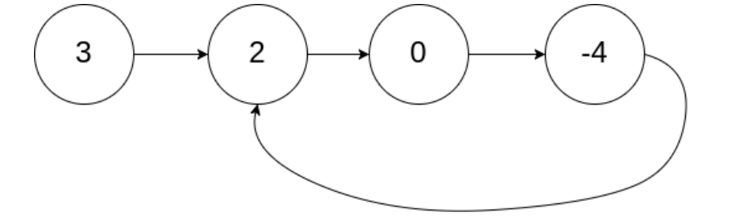

# 目录
[[toc]]
## 1、第1题：两数之和
给定一个整数数组 nums 和一个整数目标值 target，请你在该数组中找出 和为目标值 target  的那 两个 整数，并返回它们的数组下标。

你可以假设每种输入只会对应一个答案。但是，数组中同一个元素在答案里不能重复出现。

你可以按任意顺序返回答案

> **输入**：nums = [2,7,11,15], target = 9
> **输出**：[0,1]
> **解释**：因为 nums[0] + nums[1] == 9 ，返回 [0, 1] 。

**思路**： 对数组进行遍历，遍历时将target-nums[i]得到需要的值needValue，判断hashMap中是 否存在这个needValue，存在就直接返回了，不存在就将nums[i]添加到hashMap，继续遍历。  

```java
class Solution {
    public int[] twoSum(int[] nums, int target) {
        if (nums == null || nums.length == 0) { return null; }
        Map<Integer,Integer> map = new HashMap<>();
        for (int i = 0; i< nums.length; i++) {
            int needValue = target - nums[i];
            if (map.containsKey(needValue)) {
                int[] arr = new int[2];
                arr[0] = i;
                arr[1] = map.get(needValue);
                return arr;
            }
            map.put(nums[i], i);
        }
        return null;
    }
}
```
## 2、第2题：两数相加

给出两个非空 的链表用来表示两个非负的整数。其中，它们各自的位数是按照逆序的方式存储的，并且它们的每 个节点只能存储 一位 数字。

如果，我们将这两个数相加起来，则会返回一个新的链表来表示它们的和。 

您可以假设除了数字 0 之外，这两个数都不会以 0 开头。

> 输入：(2 -> 4 -> 3) + (5 -> 6 -> 4) 
>
> 输出：7 -> 0 -> 8 原因：342 + 465 = 807

**思路：**有点像是合并链表，不过合并时是将两个原链表的节点值相加，得到一个新节点的值，主要需要考虑相加时的进位 问题。如果链表还没有遍历完，进位只需要将carryFlag设置为1，下次循环时，计算sum时加1就好了，主要是当 存在一个链表遍历完了时，这里采取的策略是： 

- 1.如果carryFlag为0，不需要考虑进位，将另外一个链表添加到新链表后面，结束循环。 

- 2.如果carryFlag为1，需要考虑进位

  - 2.1两个链表都为空，那么建一个值为1的节点添加到新链表最后面，结束循环。 

  - 2.2链表l1为空，那么一个值为1的节点到链表l1的末尾，继续循环。 

  - 2.3链表l2为空，那么一个值为1的节点到链表l2的末尾，继续循环。

  ~~~java
  public ListNode addTwoNumbers(ListNode l1, ListNode l2) {
          ListNode head = new ListNode(-1);
          ListNode currentNode = head;
          int carryFlag = 0;
          while (l1 != null && l2 != null) {
              int sum = l1.val + l2.val;
              if (carryFlag == 1) {
                  sum++;
                  carryFlag = 0;
              }
              if (sum >= 10) {
                  sum = sum % 10;
                  carryFlag = 1;
              }
              ListNode node = new ListNode(sum);
              currentNode.next = node;
              currentNode = node;
              if (l1.next == null || l2.next == null) {//将后面的拼过来
                  if (carryFlag == 0) {//没有进位，直接将剩余链表接过来
                      currentNode.next = l1.next == null ? l2.next : l1.next;
                      break;
                  } else {
  					//两个链表都到末尾了，并且有进位就建新节点
                      if (l1.next == null && l2.next == null) {
                          currentNode.next = new ListNode(1);
                          break;
                      } else if (l1.next == null) {//只是链表1后面没有节点了，添加一个新节点到链表1后面
                          l1.next = new ListNode(1);
                          carryFlag = 0;
                      } else {//只是链表2后面没有节点了，添加一个新节点到链表1后面
                          l2.next = new ListNode(1);
                          carryFlag = 0;
                      }
                  }
              }
              l1 = l1.next;
              l2 = l2.next;
          }
          return head.next;
      }
  ~~~

  

## 3、第3题：无重复字符的最长字串

给定一个字符串 s ，请你找出其中不含有重复字符的 **最长子串 **的长度。
> 输入: s = "abcabcbb" 
> 输出: 3  
> 解释: 因为无重复字符的最长子串是 "abc"，所以其长度为 3。

 思路：初始left指针指向第一个元素，right指针指向第二个元素，然后在while循环中判断，set中是否包含right指针当前的字符（set会包含left到right之间所有的字符） 1.包含，说明之前已经出现了right指针当前的字符，那么从set中移除left指针对应的字符，然后left指针右移。 2.不包含，说明之前没有出现right指针当前的字符，那么更新最大值max，并且right指针右移。  
```java
class Solution {
    public int lengthOfLongestSubstring(String s) {
        if (s == null || s.length() == 0) { return 0; }
        int left = 0;
        int right = 1;
        int max = 1;
        char[] arr = s.toCharArray();
        HashSet<Character> set = new HashSet<>();
        set.add(arr[0]);
        while (right < arr.length) {
            if (set.contains(arr[right])) {
                set.remove(arr[left]);
                left++;
            } else {
                set.add(arr[right]);
                max = right -left + 1 > max ? right - left + 1 : max;
                right++; 
            }
        }
        return max;
    }
}
```
## 5、第5题：最长回文子串
给你一个字符串 s，找到 s 中最长的回文子串。如果字符串的反序与原始字符串相同，则该字符串称为回文字符串。
> 输入：s = "babad" 输出："bab" 解释："aba" 同样是符合题意的答案。
> 输入：s = "cbbd" 输出："bb"

思路：就是遍历字符串1.判断每个字符 i，是否与上一个字符 i-1 回文，是的话从 i-1 向左，i 向右，双指针判断，找出最长回文字符串。 2.判断每个字符 i，它的前一个字符 i-1 与后一个字符 i+1 是否回文，是的话，i-1 向左，i+1 向右，双指针判断，找出最长回文字符串。  
```java
class Solution {
    public String longestPalindrome(String s) {
        char[] c = s.toCharArray();
        String maxString = String.valueOf(c[0]);
        for (int i = 1;i < c.length; i++) {
            if (c[i] == c[i - 1]) {
                String value = findMaxString(s, i -1, i);
                maxString = maxString.length() > value.length() ? maxString : value;
            }
            if (i + 1 < c.length && c[i - 1] == c[i + 1]) {
                String value = findMaxString(s, i -1, i + 1);
                maxString = maxString.length() > value.length() ? maxString : value;
            }
        }
        return maxString;
    }

    public String findMaxString(String s, int left, int right) {
        char[] c = s.toCharArray();
        while (left >= 0 && right < c.length && c[left] == c[right]) {
            left--;
            right++;
        } 
        // substring 为左闭右开区间，即包含左，不包含右
        return s.substring(left + 1, right);
    }
}
```
## 11、第11题盛最多水的容器

给你 n 个非负整数 a1，a2，...，an，每个数代表坐标中的一个点 (i, ai) 。在坐标内画 n 条垂直线，垂直线 i 的两个 端点分别为 (i, ai) 和 (i, 0) 。找出其中的两条线，使得它们与 x 轴共同构成的容器可以容纳最多的水。 

说明：你不能倾斜容器。 

示例 1：


> 输入：[1,8,6,2,5,4,8,3,7] 
>
> 输出：49 
>
> 解释：图中垂直线代表输入数组 [1,8,6,2,5,4,8,3,7]。在此情况下，容器能够容 纳水（表示为蓝色部分）的最大值为 49。

**思路**：我们取两个指针从数组的两端往内遍历，i从数组头部出发，j从数组尾部出发。每次计算最大面积，并且移动高度 较小的那个端点。 

对于两个端点i和j来说，容纳水的面积是是等于(j-i)min(height[i],height[j])，假设height[i]是两者之间较小的那一个， 那么面积等于(j-i)height[i],假设i不移动，j向左移动，这样宽度j-i会减少，而height[j]即便变大也不会使得面积变 大，因为面积是由宽度乘以两者中较小的高度决定的，所以此时的面积对于i这个端点来说，已经是最大的面积，我 们可以右移高度较小的端点i。

~~~java
public int maxArea(int[] height) {
        if (height == null || height.length == 0) {
            return 0;
        }
        int left = 0;
        int right = height.length - 1;
        int maxArea = 0;
        while (left < right) {
//每次都是移动height[i]较小的那个端点
            if (height[left] < height[right]) {
                int area = height[left] * (right - left);
                maxArea = maxArea > area ? maxArea : area;
                left++;
            } else {
                int area = height[right] * (right - left);
                maxArea = maxArea > area ? maxArea : area;
                right--;
            }
        }
        return maxArea;
    }
~~~

## 15、第15题：三数之和

给你一个包含 n 个整数的数组 nums ，判断 nums 中是否存在三个元素 *a，b，c ，\*使得 a + b + c = 0 ？请你找 出所有满足条件且不重复的三元组。

**注意**：答案中不可以包含重复的三元组。

> 给定数组 nums = [-1, 0, 1, 2, -1, -4]， 
>
> 满足要求的三元组集合为： 
>
> [ 
>
> ​	[-1, 0, 1], 
>
> ​	[-1, -1, 2] 
>
> ]

**思路**：两数之和的是通过两个指针从首尾两端向中间移动来解决的，三数之和相当于是基于两数之和来解答的，相当于对 数组进行遍历，对于每个数调用两数之和的函数获得结果，大致思路如下：

~~~java
for(int i=0;i<nums.length;i++) {
	//target即为三数之和i+1到nums.length-1是计算三数之和的取值范围
    twoSum(nums,i+1,target - nums[i]);
}
~~~

主要难点其实是在于如何避免提交重复的三元组到数组中去，本题是通过只对不同的元素调用twoSum方法，并且 调用范围为i+1到nums.length-1。

~~~java
List<List<Integer>> totalList = new ArrayList<>();
    public List<List<Integer>> threeSum(int[] nums) {
		//先对数组进行排序
        Arrays.sort(nums);
        for (int i = 0; i < nums.length; i++) {
			//说明上次循环已经添加了
            if(i>=1 && nums[i] == nums[i-1]) {
                continue;
            }
            int target = 0 - nums[i];
			//这里不是从0开始遍历，而是只是对后面的元素遍历，防止三元组重复
            twoSum(nums, i+1, target);
        }
        return totalList;
    }
    public void twoSum(int[] nums,int start, int target) {
        int i = start,j=nums.length-1;
        while (i<j) {
            int sum = nums[i]+nums[j];
			//有可能是存在一个数组是 1，1，1，1，2，2，3，3，3 要求sum为4，
			// 这样会存在多组一样的，在添加时需要判断是否重复,
			// 所以非第一次循环，并且跟上次循环的数一样，那么就跳过
            if (i>start && nums[i] == nums[i-1]){
                i++;
                continue;
            } else if (sum == target) {
                List<Integer> list = new ArrayList<>();
                list.add(0-target);
                list.add(nums[i]);
                list.add(nums[j]);
                totalList.add(list);
                i++;
                j--;
            } else if (sum > target) {
                j--;
            } else if(sum<target){
                i++;
            }
        }
    }
~~~


## 17、第17题：电话号码的字母组合

给定一个仅包含数字 2-9 的字符串，返回所有它能表示的字母组合。 给出数字到字母的映射如下（与电话按键相 同）。

注意 1 不对应任何字母。

> 输入："23" 
>
> 输出：["ad", "ae", "af", "bd", "be", "bf", "cd", "ce", "cf"].

**思路：**


其实可以认为这是一个多叉树，根节点到叶子节点的路径就是每一种字符的组合，然后我们可以通过宽度遍历的方 式来得到根节点到叶子节点路径。

~~~java
public List<String> letterCombinations(String digits) {
        List<String> list = new ArrayList<String>();
        if (digits == null || digits.length() == 0) {
            return list;
        }
        LinkedList<String> queue = new LinkedList<>();
		// 空字符串是作为多叉树的根节点
        queue.add("");
		//下面是多叉树的宽度遍历的过程
        for (int i = 0; i < digits.length(); i++) {
            String[] array = convert(digits.charAt(i));
			//当queue.getFirst().length() == i+1是说明是本次循环添加的值，那么不应该加进来
            while (queue.size() > 0 && queue.getFirst().length() <= i) {
                String firstValue = queue.removeFirst();
				//拼接后添加到最后面j
                for (int j = 0; j < array.length; j++) {
                    String temp = firstValue + array[j];
                    queue.add(temp);
                }
            }
        }
        return queue;
    }

    String[] convert(Character character) {
        String[] list = new String[4];
        if (character == '2') {
            list = new String[]{"a", "b", "c"};
        }
        if (character == '3') {
            list = new String[]{"d", "e", "f"};
        }
        if (character == '4') {
            list = new String[]{"g", "h", "i"};
        }
        if (character == '5') {
            list = new String[]{"j", "k", "l"};
        }
        if (character == '6') {
            list = new String[]{"m", "n", "o"};
        }
        if (character == '7') {
            list = new String[]{"p", "q", "r", "s"};
        }
        if (character == '8') {
            list = new String[]{"t", "u", "v"};
        }
        if (character == '9') {
            list = new String[]{"w", "x", "y", "z"};
        }
        return list;
    }
~~~


## 19、第19题：删除链表的倒数第N个节点

给定一个链表，删除链表的倒数第 n 个节点，并且返回链表的头结点。

> 给定一个链表: 1->2->3->4->5, 和 n = 2. 
>
> 当删除了倒数第二个节点后，链表变为 1->2->3->5.

**说明**： 给定的 n 保证是有效的。

**思路**：就是用快慢指针，快指针quickNode先走n步，然后慢指针slowNode从链表头部出发，每次quickNode和 slowNode都只走一步，直到快指针quickNode走到最后一步，此时slowNode与quickNode之间相差n步，其实是 此时slowNode是倒数第n+1个节点，也就是要删除的节点的前一个节点，直接将slowNode.next = slowNode.next.next;，就可以将节点删除。 

但是需要考虑到如果删除的是头结点，此时会比较麻烦，严格意义上，m个节点，头结点与最后一个节点之间只存 在m-1个节点的间隔，也就是只能走m-1步，所以解决方案就是先建一个临时节点加在头结点前面，这样就可以走 出m步了，也就是可以删除倒数第m个节点，也就是头结点了。

~~~java
class Solution {
        public ListNode removeNthFromEnd(ListNode head, int n) {
			//因为head有可能是要被删除的节点，所以需要建一个preHead方便操作
            ListNode preHead = new ListNode();
            preHead.next = head;
            ListNode quickNode = preHead;
            while (n > 0) {
                quickNode = quickNode.next;
                n--;
            }
            ListNode slowNode = preHead;//preDeleteNode就是要删除的节点的前一个节点
            while (quickNode.next != null) {//这个循环遍历完可以保证quickNode是最后一个节点
                quickNode = quickNode.next;
                slowNode = slowNode.next;
            }
            slowNode.next = slowNode.next.next;
            return preHead.next;
        }
    }
~~~


## 20、第20题：有效的括号

给定一个只包括 '('，')'，'{'，'}'，'['，']' 的字符串 s ，判断字符串是否有效。有效字符串需满足：左括号必须用相同类型的右括号闭合。左括号必须以正确的顺序闭合。每个右括号都有一个对应的相同类型的左括号。
> 输入：s = "()" 输出：true
> 输入：s = "()[]{}" 输出：true
> 输入：s = "(]" 输出：false

思路：遍历字符串，字符属于左括号就添加到栈中， 字符属于右括号就判断是否属于与栈顶元素对应，是的话可以将栈顶出栈，不是的话就说明不匹配，返回 false。 遍历完成需要判断栈的长度是否为0，不为0代表还存在没有匹配上的左括号，不满足要求。  
```java
class Solution {
    public boolean isValid(String s) {
        if (s == null || s.length() == 0) { return false; }
        char[] arr = s.toCharArray();
        HashMap<Character, Character> map = new HashMap<>();
        map.put('(', ')');
        map.put('{', '}');
        map.put('[', ']');
        Stack<Character> st = new Stack<>();
        for (int i = 0; i < arr.length; i++) {
            if (map.containsKey(arr[i])) {
                st.push(map.get(arr[i]));
            } else {
                if (st.size() > 0 && arr[i] == st.peek()) {
                    st.pop();
                } else {
                    return false;
                }
            }
        }
        return st.size() == 0;
    }
}
```
## 21、第21题：合并两个有序链表

将两个升序链表合并为一个新的 升序 链表并返回。新链表是通过拼接给定的两个链表的所有节点组成的。

> 输入：1->2->4, 1->3->4 
>
> 输出：1->1->2->3->4->4

**思路**：就是创建一个preNode，作为头结点前面的节点，再创建一个currentNode作为实际遍历时的节点，每次从链表l1 和l2各取出节点，进行比较，val较小的节点赋值给currentNode的next指针，然后再将currentNode后移，链表中 的节点进行后移。直到某个链表遍历完毕了，然后将另外一个链表后续的节点接到currentNode的next指针上。

~~~java
public ListNode mergeTwoLists(ListNode l1, ListNode l2) {
        if (l1 == null) {
            return l2;
        }
        if (l2 == null) {
            return l1;
        }
        ListNode preHead = new ListNode();
        ListNode currentNode = preHead;
        while (l1 != null && l2 != null) {
            if (l1.val < l2.val) {
                currentNode.next = l1;
                currentNode = currentNode.next;
                l1 = l1.next;
            } else {
                currentNode.next = l2;
                currentNode = currentNode.next;
                l2 = l2.next;
            }
        }
        if (l1 != null) {
            currentNode.next = l1;
        }
        if (l2 != null) {
            currentNode.next = l2;
        }
        return preHead.next;
    }
~~~

## 22、第22题：括号生成

数字 n 代表生成括号的对数，请你设计一个函数，用于能够生成所有可能的并且 有效的 括号组合。

> 输入：n = 3 
>
> 输出：[ "((()))", 000111 "(()())", 001011 "(())()", 001101 "()(())", 010011 "()()()" 010101 ]

**思路**：其实这一题也是一个回朔的解法，就是可以把每个"("和")"看成是一个二叉树的节点，从根节点到叶子节点的路径组 成了每种括号组合。例如n=3时，二叉树如下：

二叉树第1层 "" 

第2层 ( ) 

（ ） （ ） 

（ ） （ ） （ ） （ ） 

每次就使用回朔的方法进行深度遍历，每当发现当前的路径不符合要求时，进行剪枝，回退到上一层，遍历其他路 径。(本题中剪枝的要求是左括号数量>n，或者右括号数量>n，或者右括号数量>左括号。)

~~~java
public List<String> generateParenthesis(int n) {
        List<String> totalList = new ArrayList<String>();
        if (n <= 0) {
            return totalList;
        }
        LinkedList<Character> stack = new LinkedList<Character>();
		//使用回朔算法进行遍历
        generateParenthesis(n, 0, 0, stack, totalList);
        return totalList;
    }

    public void generateParenthesis(int n, int left, int right, LinkedList<Character>
            stack, List<String> totalList) {
		//不满足要求，进行剪枝，回退去遍历其他节点
        if (left > n || right > n || right > left) {
            return;
        }
        if (left == n && right == n) {//正好匹配上了，将栈中所有值转换为
            StringBuffer str = new StringBuffer();
            for (int i = 0; i < stack.size(); i++) {
                str.append(stack.get(i));
            }
            totalList.add(str.toString());
        }
		//往左边遍历
        stack.add('(');
        generateParenthesis(n, left + 1, right, stack, totalList);
		//回朔
        stack.removeLast();
		//往右边遍历
        stack.add(')');
        generateParenthesis(n, left, right + 1, stack, totalList);
		//回朔
        stack.removeLast();
    }
~~~

PS:回朔算法的框架

~~~java
List result = new ArrayList<>();
    void backtrack(路径, 选择列表stack):
            if 超出范围 return
            if 满足结束条件:
            result.add(路径)
            return
            for 选择 in 选择列表:
    做选择 stack.add(当前元素);
    backtrack(路径, 选择列表)
    撤销选择 stack.remove(当前元素);
~~~

## 23、第23题：合并K个升序链表

给你一个链表数组，每个链表都已经按升序排列。 请你将所有链表合并到一个升序链表中，返回合并后的链表。

> 输入： lists = [[1,4,5],[1,3,4],[2,6]] 
>
> 输出： [1,1,2,3,4,4,5,6] 
>
> 解释：链表数组如下： [ 1->4->5, 1->3- >4, 2->6 ] 将它们合并到一个有序链表中得到。 1->1->2->3->4->4->5->6

**思路**：就是对K个链表的头结点建立一个小顶堆，每次取堆顶元素出来，放到新链表的末尾。然后对堆进行调整，每次调 整复杂度为 logK ，总时间复杂度是 N*LogK 。

~~~java
public ListNode mergeKLists(ListNode[] lists) {
        if (lists == null || lists.length == 0) {
            return null;
        }
        ListNode preHead = new ListNode(-1);
        ListNode currentNode = preHead;
        ArrayList<ListNode> arrayList = new ArrayList<>();
//过滤lists中为null的元素，然后将不为null的元素添加到arrayList中去
// （测试用例中有很多为null的用例)
        for (int i = 0; i < lists.length; i++) {
            if (lists[i] != null) {
                arrayList.add(lists[i]);
            }
        }
        if (arrayList.size() == 0) {
            return null;
        }
//建立小顶堆
        for (int i = arrayList.size() / 2 - 1; i >= 0; i--) {
            adjustHeap(arrayList, i, arrayList.size());
        }
        while (arrayList.size() > 0) {
            if (arrayList.get(0) == null) {//这个链表到最后一个节点了，从小顶堆中移除
                swap(arrayList, 0, arrayList.size() - 1);
                arrayList.remove(arrayList.size() - 1);
                continue;
            }
            adjustHeap(arrayList, 0, arrayList.size());
            ListNode node = arrayList.get(0);
            currentNode.next = node;
            currentNode = currentNode.next;
            arrayList.set(0, node.next);
        }
        return preHead.next;
    }

    void adjustHeap(ArrayList<ListNode> lists, int i, int length) {
        while (2 * i + 1 < length) {
            int left = 2 * i + 1;
            int right = 2 * i + 2;
            int min = lists.get(i).val < lists.get(left).val ? i : left;
            if (right < length) {
                min = lists.get(min).val < lists.get(right).val ? min : right;
            }
            if (min == i) {
                break;
            } else {
                swap(lists, min, i);
                i = min;
            }
        }
    }

    void swap(ArrayList<ListNode> lists, int a, int b) {
        ListNode temp = lists.get(a);
        lists.set(a, lists.get(b));
        lists.set(b, temp);
    }
~~~


## 33、第33题：搜索旋转排序数组

升序排列的整数数组 nums 在预先未知的某个点上进行了旋转（例如， [0,1,2,4,5,6,7] 经旋转后可能变为 [4,5,6,7,0,1,2] ）。 

请你在数组中搜索 target ，如果数组中存在这个目标值，则返回它的索引，否则返回 -1 。 

> 输入：nums = [4,5,6,7,0,1,2], target = 0 
>
> 输出：4

**思路**：还是按照二分搜索来进行搜索，只是多一步判断，如果 nums[mid]

~~~java
 public int search(int[] nums, int target) {
        int left = 0;
        int right = nums.length - 1;
        while (left <= right) {
            int mid = (left + right) / 2;
            if (nums[mid] == target) {//说明是正好是目标值
                return mid;
            } else if (nums[mid] < nums[right]) {//说明旋转点不在右边，这边是有序的
                if (target > nums[mid] && target <= nums[right]) {
                    left = mid + 1;
                } else {
                    right = mid - 1;
                }
            } else {//说明旋转点在右边，这是我们根据左边来判断
                if (target >= nums[left] && target < nums[mid]) {
                    right = mid - 1;
                } else {
                    left = mid + 1;
                }
            }
        }
        return -1;
    }
~~~


## 34、第34题：在排序数组中查找元素的第一个和最后一个位置

给定一个按照升序排列的整数数组 nums，和一个目标值 target。找出给定目标值在数组中的开始位置和结束位 置。

如果数组中不存在目标值 target，返回 [-1, -1]。

你必须设计并实现时间复杂度为 `O(log n)` 的算法解决此问题。

**思路**： 其实可以用普通的二分查找，查到这个target值，然后向两边遍历，获得起始和结束位置，复杂度是log(N)+rightleft,但是如果目标值的的开始位置left接近于0，结束位置right接近于 length-1 ， right-left 就会接近于N，此时 复杂度为O(N)。 这里的解题思路是 O(LogN) 的一种解法，就是通过先找出一种查找左边界的二分查找算法（可以 理解为可以从数组中查找出第一个>=输入值的元素下标)，所以本题可以通过找出 target-0.5 查找左边界，得到 target的最左边的值，同时通过找出 target+0.5 查找出第一个大于目标值的元素下标，然后-1得到taget最右边的 值。（当然也需要考虑taget不存在的情况）。

~~~java
public int[] searchRange(int[] nums, int target) {
        int[] array = new int[2];
        array[0] = -1;
        array[1] = -1;
        if (nums == null || nums.length == 0) {
            return array;
        }
        int left = findLeftBound(nums, target - 0.5);
        int right = findLeftBound(nums, target + 0.5);
        if (left == -1) {//nums不存在这个target值
            return array;
        }
        if (right == -1) {//taget值可能是数组最后一个元素
            right = nums.length - 1;
        } else {//right是第一个大于target的值，减一得到target的右边界
            right = right - 1;
        }
//如果相等，那么返回下标
        if (nums[left] == target && nums[right] == target) {
            array[0] = left;
            array[1] = right;
            return array;
        }
        return array;
    }

    //查找target值的左边界（也就是第一个>=target的元素下标）
    int findLeftBound(int[] nums, double target) {
        int left = 0;
        int right = nums.length - 1;
        while (left <= right) {
            int mid = left + (right - left) / 2;
            if (nums[mid] == target) {
                right = mid - 1;
            } else if (nums[mid] > target) {
                right = mid - 1;
            } else if (nums[mid] < target) {
                left = mid + 1;
            }
        }
        if (left >= nums.length) {
            return -1;
        } else {
            return left;
        }
    }
~~~

## 42、第42题：接雨水

给定 n 个非负整数表示每个宽度为 1 的柱子的高度图，计算按此排列的柱子，下雨之后能接多少雨水。


> 输入：height = [0,1,0,2,1,0,1,3,2,1,2,1] 
>
> 输出：6
>
> 解释：上面是由数组 [0,1,0,2,1,0,1,3,2,1,2,1] 表示的高度图，在这种情况下，可以接 6 个单位的雨水（蓝色部分表示雨水）。

**思路**：就是对于每个柱子来说，它这个位置顶上可以容纳的水，其实是等于柱子左边柱子的最大值leftMax，右边柱子的 最大值rightMax，两者中的较小值min，水容量=min-height[i]。所以先统计出每个柱子左边的最大值和右边的最 大值，然后就可以计算水容量了。

~~~java
public int trap(int[] height) {
        if (height == null || height.length == 0) {
            return 0;
        }
        int[][] dp = new int[height.length][2];
        int leftMax = height[0];
//统计每个柱子左边的最大值
        for (int i = 1; i < height.length; i++) {
            leftMax = leftMax > height[i] ? leftMax : height[i];
            dp[i][0] = leftMax;
        }
        int rightMax = height[height.length - 1];
//统计每个柱子右边的最大值
        for (int i = height.length - 2; i >= 0; i--) {
            rightMax = rightMax > height[i] ? rightMax : height[i];
            dp[i][1] = rightMax;
        }
        int area = 0;
//统计每个柱子可以存的水
        for (int i = 1; i <= height.length - 2; i++) {
            int min = dp[i][0] < dp[i][1] ? dp[i][0] : dp[i][1];
            area += min - height[i];
        }
        return area;
    }
~~~

## 46、第46题：全排列

给定一个 没有重复 数字的序列，返回其所有可能的全排列

> 输入: [1,2,3] 
>
> 输出: [ 
>
> ​	[1,2,3], 
>
> ​	[1,3,2], 
>
> ​	[2,1,3], 
>
> ​	[2,3,1], 
>
> ​	[3,1,2], 
>
> ​	[3,2,1] 
>
> ]

**思路**：假设你需要计算[1,2,3]的全排列结果，其实等于 

1为首元素，[2,3]的全排列结果， 

2为首元素，[1,3]的全排列结果， 

3首元素，[1,2]的全排列结果

~~~java
public List<List<Integer>> permute(int[] nums) {
        List<List<Integer>> totalList = new ArrayList<List<Integer>>();
        if (nums == null || nums.length == 0) {
            return totalList;
        }
        tranverse(nums, 0, totalList);
        return totalList;
    }

    //遍历
    public void tranverse(int[] nums, int start, List<List<Integer>> totalList) {
        if (start >= nums.length) {//说明递归到最后了，将所有元素添加到list
            List<Integer> list = new ArrayList<Integer>();
            for (int i = 0; i < nums.length; i++) {
                list.add(nums[i]);
            }
            totalList.add(list);
            return;
        }
//遍历将后面的元素取出，与首元素交换，然后对子串递归，因为对于[1,2,3]而言，所有排序结果是等于1为
        首元素，后面子数组的结果 + 2 为首元素，后面子数组的结果 + 3 为首元素，后面子数组的结果
        for (int i = start; i < nums.length; i++) {
            swap(nums, start, i);
            tranverse(nums, start + 1, totalList);
            swap(nums, i, start);
        }
    }

    void swap(int[] nums, int a, int b) {
        int temp = nums[a];
        nums[a] = nums[b];
        nums[b] = temp;
    }
~~~


## 53、第53题：最大子序和

给定一个整数数组 nums ，找到一个具有最大和的连续子数组（子数组最少包含一个元素），返回其最大和。

> 输入: [-2,1,-3,4,-1,2,1,-5,4] 
>
> 输出: 6 
>
> 解释: 连续子数组 [4,-1,2,1] 的和最大，为 6。

**思路**：就是遍历一遍，判断包含从0到当前遍历值i的最大子序列和， 

如果sum<0，那么就丢掉之前的子序列，直接让sum=nums[i]， 

如果sum>0否则sum=sum+nums[i] 

计算后的sum如果大于maxSum，那么就进行替换。

~~~java
class Solution {
        public int maxSubArray(int[] nums) {
            if (nums == null || nums.length == 0) {
                return 0;
            }
            if (nums.length == 1) {
                return nums[0];
            }
            int maxSum = nums[0];
            int sum = nums[0];
            for (int i = 1; i < nums.length; i++) {
                sum = sum < 0 ? nums[i] : sum + nums[i];
                maxSum = sum > maxSum ? sum : maxSum;
            }
            return maxSum;
        }
    }
~~~

## 55、第55题：跳跃游戏

给定一个非负整数数组，你最初位于数组的第一个位置。 

数组中的每个元素代表你在该位置可以跳跃的最大长度。 

判断你是否能够到达最后一个位置。

> 输入: [2,3,1,1,4] 
>
> 输出: true 
>
> 解释: 我们可以先跳 1 步，从位置 0 到达 位置 1, 然后再从位置 1 跳 3 步到达最后一个位置。

**思路**：这个其实也是通过回朔法去判断每个下标能否到达最后一步

~~~java
//这个数组主要用于记录那些不能到达最后一个元素的数组下标，减少冗余计算
    Boolean[] recordArray;

    public boolean canJump(int[] nums) {
        if (nums == null || nums.length == 0) {
            return false;
        }
        recordArray = new Boolean[nums.length];
        return canJump(nums, 0);
    }

    public boolean canJump(int[] nums, int start) {
//当前start已经处于最后一步了，或者是当前数组下标加上数字超过最后一个元素了
        if (start >= nums.length - 1 || start + nums[start] >= nums.length - 1) {
            return true;
        }
//已经对于改已经有记录结果，不用重复计算
        if (recordArray[start] != null) {
            return recordArray[start];
        }
        int end = start + nums[start];
//计算[start+1,end]之间的元素，是否有可以到达最后一步的
        for (int i = start + 1; i <= end; i++) {
            if (canJump(nums, i)) {
                return true;
            }
        }
        recordArray[start] = false;
        return false;
    }
~~~

## 56、第56题：合并区间

给出一个区间的集合，请合并所有重叠的区间。

> 输入: intervals = [[1,3],[2,6],[8,10],[15,18]] 
>
> 输出: [[1,6],[8,10],[15,18]] 
>
> 解释: 区间 [1,3] 和 [2,6] 重叠, 将它们合并为 [1,6]。

**思路**：就是先根据左边界进行排序，排序完之后进行进行区间合并，合并的判断规则就是当前区间的左边界是否在上一个区间内

~~~java
public int[][] merge(int[][] intervals) {
        if (intervals == null || intervals.length <= 1) {
            return intervals;
        }
		//先进行排序
        quickSort(intervals, 0, intervals.length - 1);
        int lastIndex = 0;
        for (int i = 1; i < intervals.length; i++) {
            if (intervals[i][0] >= intervals[lastIndex][0]
                    && intervals[i][0] <= intervals[lastIndex][1]) {
				//如果当前区间的左边界处于上一个区间中间，说明可以被合并
                intervals[lastIndex][1] = intervals[lastIndex][1] > intervals[i][1]
                        ? intervals[lastIndex][1] : intervals[i][1];
            } else {//不能被合并
                lastIndex++;
                intervals[lastIndex][0] = intervals[i][0];
                intervals[lastIndex][1] = intervals[i][1];
            }
        }
		//对数组进拷贝
        int[][] result = new int[lastIndex + 1][2];
        for (int i = 0; i <= lastIndex; i++) {
            result[i][0] = intervals[i][0];
            result[i][1] = intervals[i][1];
        }
        return result;
    }

    //快排，按照每个区间的左边界进行排序
    void quickSort(int[][] array, int start, int end) {
        if (start >= end) {
            return;
        }
        int i = start;
        int j = end;
        int base = array[start][0];
        while (i < j) {
            while (array[j][0] > base && j > i) {
                j--;
            }
            while (array[i][0] <= base && j > i) {
                i++;
            }
            swap(array, i, j);
        }
        swap(array, start, i);
        quickSort(array, start, i - 1);
        quickSort(array, i + 1, end);
    }

    //交换元素
    void swap(int[][] array, int i, int j) {
        int temp_0 = array[j][0];
        int temp_1 = array[j][1];
        array[j][0] = array[i][0];
        array[j][1] = array[i][1];
        array[i][0] = temp_0;
        array[i][1] = temp_1;
    }
~~~


## 62、第62题：不同路径

一个机器人位于一个 m x n 网格的左上角 （起始点在下图中标记为 “Start” ）。 

机器人每次只能向下或者向右移动一步。机器人试图达到网格的右下角（在下图中标记为 “Finish” ）。 

问总共有多少条不同的路径？ 


> 输入：m = 3, n = 2 
>
> 输出：3 
>
> 解释： 从左上角开始，总共有 3 条路径可以到达右下角。 
>
> 1. 向右 -> 向右 -> 向下 
> 2. 向右 -> 向下 -> 向右 
> 3. 向下 -> 向右 -> 向右

**思路**：经典动态规划问题

~~~java
class Solution {
    public int uniquePaths(int m, int n) {
        if (m <= 0 || n <= 0) {
            return 0;
        }
        int[][] dp = new int[m][n];
        for (int i = 0; i < m; i++) {
            dp[i][0] = 1;
        }
        for (int i = 0; i < n; i++) {
            dp[0][i] = 1;
        }

        for (int i = 1; i < m; i++) {
            for (int j = 1; j < n; j++) {
                dp[i][j] = dp[i-1][j] + dp[i][j-1];
            }
        }
        return dp[m-1][n-1];

    }
}
~~~

## 64、第64题：最小路径和

给定一个包含非负整数的 m x n 网格 grid ，请找出一条从左上角到右下角的路径，使得路径上的数字总和为最 小。 

说明：每次只能向下或者向右移动一步。


> 输入：grid = [[1,3,1],[1,5,1],[4,2,1]] 
>
> 输出：7 
>
> 解释：因为路径 1→3→1→1→1 的总和最小。

**思路：**其实跟斐波拉契数列的题很相似

~~~java
 class Solution {
        public int minPathSum(int[][] grid) {
            int m = grid.length;
            int n = grid[0].length;
            if (m <= 0 || n <= 0) {
                return 0;
            }
            int[][] dp = new int[m][n];
            dp[0][0] = grid[0][0];
            for (int i = 1; i < m; i++) {
                dp[i][0] = grid[i][0] + dp[i - 1][0];
            }
            for (int i = 1; i < n; i++) {
                dp[0][i] = grid[0][i] + dp[0][i - 1];
            }

            for (int i = 1; i < m; i++) {
                for (int j = 1; j < n; j++) {
                    dp[i][j] = Math.min(dp[i - 1][j], dp[i][j - 1]) + grid[i][j];
                }
            }
            return dp[m - 1][n - 1];
        }
    }
~~~


## 70、第70题：爬楼梯

假设你正在爬楼梯。需要 n 阶你才能到达楼顶。 

每次你可以爬 1 或 2 个台阶。你有多少种不同的方法可以爬到楼顶呢？

**注意**：给定 n 是一个正整数。

> 输入： 2 
>
> 输出： 2 
>
> 解释： 有两种方法可以爬到楼顶。 
>
> 1. 1 阶 + 1 阶 
> 2. 2. 2 阶

> 输入： 3 
>
> 输出： 3 
>
> 解释： 有三种方法可以爬到楼顶。 
>
> 1. 1 阶 + 1 阶 + 1 阶 
> 2. 1 阶 + 2 阶  
> 3. 2 阶 + 1 阶

**思路**：这个就是斐波拉契数列，就是f(n) = f(n-1)+f(n-2),需要注意的是，如果使用递归来实现，会有重复计算重叠子问题的问题。

比如f(5)=f(4)+f(3)=(f(3)+f(2))+(f(2)+f(1)) 其实是计算了两遍f(3)，所以可以使用hashMap来缓存f(3)的结 果，这样避免重复递归计算。

~~~java
class Solution {
        HashMap<Integer, Integer> map = new HashMap<Integer, Integer>();

        public int climbStairs(int n) {
            if (n <= 0) {
                return 0;
            } else if (n == 1 || n == 2) {
                return n;
            } else if (map.containsKey(n)) {
                return map.get(n);
            } else {
                int value = climbStairs(n - 1) + climbStairs(n - 2);
                map.put(n, value);
                return value;
            }
        }
    }
~~~

## 94、第94题：二叉树的中序遍历

给定一个二叉树的根节点 root ，返回它的 中序 遍历。


> 输入：root = [1,null,2,3] 
>
> 输出：[1,3,2]

~~~java
List<Integer> list = new ArrayList<Integer>();

    public List<Integer> inorderTraversal(TreeNode root) {
        if (root == null) {
            return list;
        }
        inorderTraversal(root.left);
        list.add(root.val);
        inorderTraversal(root.right);
        return list;
    }
~~~


## 102、第102题：二叉树的层序遍历

给你一个二叉树，请你返回其按 层序遍历 得到的节点值。 （即逐层地，从左到右访问所有节点）。

> 二叉树：[3,9,20,null,null,15,7], 
>
> ​		3 
>
> ​	   / \ 
>
> ​    9    20 
>
> ​          / \ 
>
> ​      15    7 
>
> 返回其层次遍历结果： 
>
> [ 
>
> ​	[3],
>
> ​	[9,20], 
>
> ​	[15,7] 
>
> ]

**思路**：其实就是二叉树的宽度优先遍历，只不过返回结果，是每一层的节点存在同一个数组中

~~~java
public List<List<Integer>> levelOrder(TreeNode root) {
        List totalList = new ArrayList<>();
        if (root == null) {
            return totalList;
        }
        LinkedList<TreeNode> currentQueue = new LinkedList<TreeNode>();
        LinkedList<TreeNode> nextQueue = new LinkedList<TreeNode>();
        currentQueue.add(root);
        while (currentQueue.size() > 0) {
            List<Integer> list = new ArrayList<Integer>();
            while (currentQueue.size() > 0) {
                TreeNode node = currentQueue.removeFirst();
                if (node != null) {
                    list.add(node.val);
                    if (node.left != null) {
                        nextQueue.add(node.left);
                    }
                    if (node.right != null) {
                        nextQueue.add(node.right);
                    }
                }
            }
            totalList.add(list);
            currentQueue = nextQueue;
            nextQueue = new LinkedList<TreeNode>();
        }
        return totalList;
    }
~~~


## 104、第104题：二叉树的最大深度

给定一个二叉树，找出其最大深度。 二叉树的深度为根节点到最远叶子节点的最长路径上的节点数。

~~~java
public int maxDepth(TreeNode root) {
        if (root == null) {
            return 0;
        }
        int leftDepth = maxDepth(root.left);
        int rightDepth = maxDepth(root.right);
        return leftDepth > rightDepth ? leftDepth + 1 : rightDepth + 1;
    }
}
~~~


## 121、第121题：买股票的最佳时机

给定一个数组 prices ，它的第 i 个元素 prices[i] 表示一支给定股票第 i 天的价格。你只能选择 某一天 买入这只股票，并选择在 未来的某一个不同的日子 卖出该股票。设计一个算法来计算你所能获取的最大利润。返回你可以从这笔交易中获取的最大利润。如果你不能获取任何利润，返回 0 。
> 输入：[7,1,5,3,6,4]	输出：5
> 解释：在第 2 天（股票价格 = 1）的时候买入，在第 5 天（股票价格 = 6）的时候卖出，最大利润 = 6-1 = 5。
> 注意利润不能是 7-1 = 6, 因为卖出价格需要大于买入价格；同时，你不能在买入前卖出股票。
> 
> 输入：prices = [7,6,4,3,1] 	输出：0 	解释：在这种情况下, 没有交易完成, 所以最大利润为 0。

思路：使用min变量记录之前出现的值，使用maxValue保存之前的最大差值，对数组遍历，将当前股票价格 prices[i]-min得到利润，如果比maxValue大那么就进行替换，并且如果prices[i]比min变量小，那么也替换出现过 的最小值。  
```java
class Solution {
    public int maxProfit(int[] prices) {
        if (prices == null || prices.length == 0) { return 0;}
        int min = prices[0];
        int maxValue = 0;
        for (int i = 1; i < prices.length; i++) {
            maxValue = prices[i] - min > maxValue ? prices[i] - min : maxValue;
            min = min > prices[i] ? prices[i] : min;
        }
        return maxValue;
    }
}
```

## 136、第136题：只出现一次的数字

给定一个非空整数数组，除了某个元素只出现一次以外，其余每个元素均出现两次。找出那个只出现了一次的元 素。 

说明： 你的算法应该具有线性时间复杂度。 你可以不使用额外空间来实现吗？

> 输入: [2,2,1] 
>
> 输出: 1

~~~java
public int singleNumber(int[] nums) {
        int value = 0;
        for (int i = 0; i < nums.length; i++) {
            value = value ^ nums[i];
        }
        return value;
    }
~~~


## 141、第141题：环形链表

给定一个链表，判断链表中是否有环。



**思路**：就是使用快慢指针来解决这个问题，如果相遇，代表有环，不相遇代表没有环。

~~~java
public boolean hasCycle(ListNode head) {
        ListNode slow = head;
        ListNode quick = head;
        while (quick != null) {
            if (quick.next == null) {
                return false;
            }
            quick = quick.next.next;
            slow = slow.next;
            if (quick == slow) {
                return true;
            }
        }
        return false;
    }
~~~

## 169、第169题：多数元素

给定一个大小为 n 的数组，找到其中的多数元素。多数元素是指在数组中出现次数大于n/2 的元素。 你可以假设数组是非空的，并且给定的数组总是存在多数元素。

> 输入: [3,2,3] 
>
> 输出: 3

**思路**：这个多数元素一定是数组的中位数，所以可以转换为寻找数组的中位数，也就是寻找第nums.length/2小的元素， 也就转换为Top K问题了，所以使用快排解决。

~~~java
public int majorityElement(int[] nums) {
        if (nums == null || nums.length == 0) {
            return 0;
        }
        return quickSort(nums, nums.length / 2, 0, nums.length - 1);
    }

    int quickSort(int[] nums, int k, int start, int end) {
        if (start >= end) {
            return nums[start];
        }
        int base = nums[start];
        int i = start;
        int j = end;
        while (i < j) {
            while (nums[j] > base && i < j) {
                j--;
            }
            while (nums[i] <= base && i < j) {
                i++;
            }
            int temp = nums[i];
            nums[i] = nums[j];
            nums[j] = temp;
        }
        nums[start] = nums[i];
        nums[i] = base;
        if (i == k) {
            return nums[i];
        } else if (i > k) {
            return quickSort(nums, k, start, i - 1);
        } else {
            return quickSort(nums, k, i + 1, end);
        }
    }
~~~

## 101、第101题：对称二叉树

给定一个二叉树，检查它是否是镜像对称的。 

例如，二叉树 [1,2,2,3,4,4,3] 是对称的。

> ​		1 
>
> ​	   / \ 
>
> ​    2     2 
>
>    / \     / \ 
>
> 3    4  4    3

~~~java
 public boolean isSymmetric(TreeNode root) {
        if (root == null) {
            return true;
        }
        return isSymmetric(root.left, root.right);
    }

    public boolean isSymmetric(TreeNode left, TreeNode right) {
        if (left == null && right == null) {//都为null
            return true;
        }
        if ((left == null && right != null) || (left != null && right == null)) {//其中一个为null
            return false;
        }
        if (left.val != right.val) {//都不为null但是值不相等
            return false;
        }
		//判断子节点是否相等
        return isSymmetric(left.left, right.right) && isSymmetric(left.right, right.left);
    }
~~~


## 198、第198题：打家劫舍

你是一个专业的小偷，计划偷窃沿街的房屋。每间房内都藏有一定的现金，影响你偷窃的唯一制约因素就是相邻的 房屋装有相互连通的防盗系统，如果两间相邻的房屋在同一晚上被小偷闯入，系统会自动报警。 

给定一个代表每个房屋存放金额的非负整数数组，计算你 不触动警报装置的情况下 ，一夜之内能够偷窃到的最高 金额。 

> 输入：[1,2,3,1] 
>
> 输出：4 
>
> 解释：偷窃 1 号房屋 (金额 = 1) ，然后偷窃 3 号房屋 (金额 = 3)。 偷窃到的最高金额 = 1 + 3 = 4 。

**思路**：其实跟斐波拉契数列很像，这道题中其实如果要计算nums数组的前n个元素的最高金额的话，使用f(n)来代替。 

f(0)=nums[0]; 

f(1)=nums[1]>nums[0]?nums[1]:nums[0];//也就是num[0]和nums[1]之间的最大值。 

状态转移方程如下： f(n) = f(n-1) > f(n-2)+nums[n] ? f(n-1) :f(n-2)+nums[n]

~~~java
Integer[] saveTable;

    public int rob(int[] nums) {
        if (nums == null || nums.length == 0) {
            return 0;
        }
        if (nums.length == 1) {
            return nums[0];
        }
        saveTable = new Integer[nums.length];
        int value1 = maxRob(nums, nums.length - 1);
        int value2 = maxRob(nums, nums.length - 2);
        return value1 > value2 ? value1 : value2;
    }

    public int maxRob(int[] nums, int n) {
        if (saveTable[n] != null) {
            return saveTable[n];
        }
        int max = 0;
        if (n == 0) {
            max = nums[0];
        } else if (n == 1) {
            max = nums[1] > nums[0] ? nums[1] : nums[0];
        } else if (n - 2 >= 0) {
            int value1 = maxRob(nums, n - 1);
            int value2 = maxRob(nums, n - 2) + nums[n];
            max = value1 > value2 ? value1 : value2;
        }
        saveTable[n] = max;
        return max;
    }
~~~


## 206、第206题：反转链表

反转一个单链表。 

> 输入: 1->2->3->4->5->NULL 
>
> 输出: 5->4->3->2->1->NULL

思路：

循环的思路就是遍历节点，保存每个节点的下一个节点，然后将当前节点的next指针指向上一个节点，一直反转到 最后。需要注意的地方就是需要将原链表头结点head的next指针置为null，否则会形成环。

~~~java
class Solution {
	public ListNode reverseList(ListNode head) {
		if(head==null||head.next==null){return head;}
		ListNode preNode = head;
		ListNode currentNode = head.next;
		//将原来头结点的next指针设置为null
		head.next = null;
		while(currentNode!=null) {
			//保存指向下一个节点的指针
			ListNode saveNode = currentNode.next;
			//将当前节点的next指向前一个节点
			currentNode.next = preNode;
			preNode = currentNode;
			currentNode = saveNode;
		}
		return preNode;
	}
}
~~~

## 283、第283题：移动零

给定一个数组 nums ，编写一个函数将所有 0 移动到数组的末尾，同时保持非零元素的相对顺序。

> 输入: [0,1,0,3,12] 
>
> 输出: [1,3,12,0,0]

**思路**： 对数组进行遍历，就是找到一个为0的数，然后继续往后找，找到一个不为0的数，与它进行交换，这样就可以把0 全部移动到后面去了。

~~~java
public void moveZeroes(int[] nums) {
        if (nums == null || nums.length <= 1) {
            return;
        }
        int slow = 0, quick = 0;
        while (slow < nums.length && quick < nums.length) {
			//找到第一个为0的数nums[slow]
            while (slow < nums.length && nums[slow] != 0) {
                slow++;
            }
            quick = slow;
			//从这个为0的数往后找到第一个不为0的数nums[quick]
            while (quick < nums.length && nums[quick] == 0) {
                quick++;
            }
			//将nums[slow]与nums[quick]进行交换
            if (slow < nums.length && quick < nums.length) {
                nums[slow] = nums[quick];
                nums[quick] = 0;
            }
        }
    }
~~~

