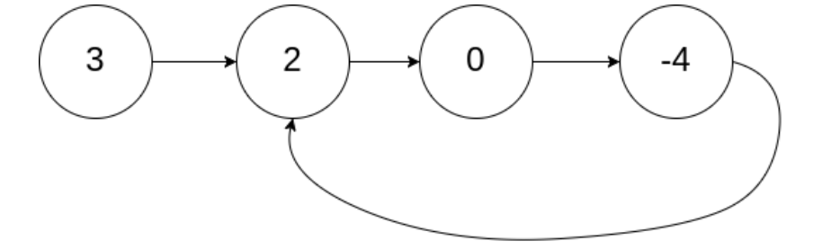
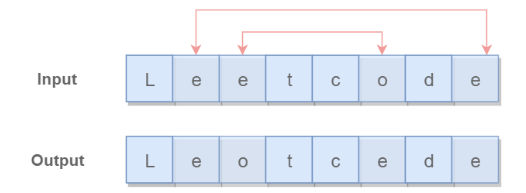

# LeetCode 题解

持续更新
- [双指针](./LeetCodeAnswer.md#双指针)
- [二分查找](./LeetCodeAnswer.md#二分查找)
## 双指针

双指针主要用于遍历数组，两个指针指向不同的元素，从而协同完成任务

### 88、合并两个有序数组

原题链接：[LeetCode](https://leetcode.cn/problems/merge-sorted-array/)

题目描述：给你两个按 非递减顺序 排列的整数数组 nums1 和 nums2，另有两个整数 m 和 n ，分别表示 nums1 和 nums2 中的元素数目。

请你 合并 nums2 到 nums1 中，使合并后的数组同样按 非递减顺序 排列。

~~~
输入：nums1 = [1,2,3,0,0,0], m = 3, nums2 = [2,5,6], n = 3
输出：[1,2,2,3,5,6]
解释：需要合并 [1,2,3] 和 [2,5,6] 。
合并结果是 [1,2,2,3,5,6] ，其中斜体加粗标注的为 nums1 中的元素
~~~

非递减顺序那就说明是递增的，只需从尾部开始遍历，谁大就存谁

::: tip

因为是递增的，所以最大的肯定在后面

:::

~~~java
    public void merge(int[] nums1, int m, int[] nums2, int n) {
        int mergeIndex = m + n - 1;
        int n1 = m - 1;
        int n2 = n - 1;
        while (n2 >= 0) {
            if (n1 < 0) {
                nums1[mergeIndex] = nums2[n2];
                mergeIndex--;
                n2--;
            } else if (nums1[n1] < nums2[n2]) {
                nums1[mergeIndex] = nums2[n2];
                mergeIndex--;
                n2--;
            } else {
                nums1[mergeIndex] = nums1[n1];
                mergeIndex--;
                n1--;
            }
        }
    }
~~~


### 141、环形链表

原题链接：[LeetCode](https://leetcode.cn/problems/linked-list-cycle/)

题目描述：给你一个链表的头节点 `head` ，判断链表中是否有环。



~~~
输入：head = [3,2,0,-4], pos = 1
输出：true
解释：链表中有一个环，其尾部连接到第二个节点。
~~~

使用双指针，一个指针每次移动一个节点，一个指针每次移动两个节点，如果存在环，那么这两个指针一定会相遇。

~~~java
    public boolean hasCycle(ListNode head) {
        if (head == null) {
            return false;
        }
        ListNode l1 = head, l2 = head.next;
        while (l1 != null && l2 != null && l2.next != null) {
            if (l1 == l2) {
                return true;
            }
            l1 = l1.next;
            l2 = l2.next.next;
        }
        return false;
    }
~~~

### 167、两数之和Ⅱ

原题链接：[LeetCode](https://leetcode.cn/problems/two-sum-ii-input-array-is-sorted/)

题目描述：在有序数组中找出两个数，使它们的和为 target。

```html
Input: numbers={2, 7, 11, 15}, target=9
Output: index1=1, index2=2
```

使用双指针，一个指针指向值较小的元素，一个指针指向值较大的元素。指向较小元素的指针从头向尾遍历，指向较大元素的指针从尾向头遍历。

- 如果两个指针指向元素的和 `sum == target`，那么得到要求的结果；
- 如果 `sum > target`，移动较大的元素，使 sum 变小一些；
- 如果 `sum < target`，移动较小的元素，使 sum 变大一些。

数组中的元素最多遍历一次，时间复杂度为 O(N)。只使用了两个额外变量，空间复杂度为 O(1)。

```java
public int[] twoSum(int[] numbers, int target) {
    if (numbers == null) return null;
    int i = 0, j = numbers.length - 1;
    while (i < j) {
        int sum = numbers[i] + numbers[j];
        if (sum == target) {
            return new int[]{i + 1, j + 1};
        } else if (sum < target) {
            i++;
        } else {
            j--;
        }
    }
    return null;
}
```

### 345、反转字符串中的元音字母

原题链接：[LeetCode](https://leetcode.cn/problems/reverse-vowels-of-a-string/)

题目描述：给你一个字符串 s ，仅反转字符串中的所有元音字母，并返回结果字符串。

元音字母包括 'a'、'e'、'i'、'o'、'u'，且可能以大小写两种形式出现不止一次。



使用双指针，一个指针从头向尾遍历，一个指针从尾到头遍历，当两个指针都遍历到元音字符时，交换这两个元音字符。

::: tip

这里用的是 switch 判断是否是元音字母（好久没用 switch 了，看看还会写不哈哈哈~）

也可以使用 HashSet、String   ... 很多种方法

:::

~~~java
public String reverseVowels(String s) {
        char[] arr = s.toCharArray();
        int left = 0;
        int right = arr.length - 1;
        while (left < right) {
            if (isAEIOU(arr[left])) {
                if (isAEIOU(arr[right])) {
                    change(arr,left,right);
                    left++;
                    right--;
                } else {
                    right--;
                }
            } else {
                left++;
            }
        }
        return new String(arr);
    }
	// 交换
    public void change (char[] arr, int left, int right) {
        char temp = arr[left];
        arr[left] = arr[right];
        arr[right] = temp;
    }
	// 判断是否是元音字母
    public boolean isAEIOU(char c) {
        boolean flag = false;
        switch (c) {
            case 'a': flag = true;break;
            case 'e': flag = true;break;
            case 'i': flag = true;break;
            case 'o': flag = true;break;
            case 'u': flag = true;break;
            case 'A': flag = true;break;
            case 'E': flag = true;break;
            case 'I': flag = true;break;
            case 'O': flag = true;break;
            case 'U': flag = true;break;
        }
        return flag;
    }
~~~

### 524、通过删除字母匹配到字典里最长单词

原题链接：[LeetCode](https://leetcode.cn/problems/longest-word-in-dictionary-through-deleting/)

题目描述：给你一个字符串 s 和一个字符串数组 dictionary ，找出并返回 dictionary 中最长的字符串，该字符串可以通过删除 s 中的某些字符得到。

如果答案不止一个，返回长度最长且字母序最小的字符串。如果答案不存在，则返回空字符串。

~~~
输入：s = "abpcplea", dictionary = ["ale","apple","monkey","plea"]
输出："apple"

输入：s = "abpcplea", dictionary = ["a","b","c"]
输出："a"
~~~

使用 longStr 记录最长子串，得到数组中的每一个字符串 target，跟 s 进行比较，如果 target 包含于 s，则是 s 的子串，与 longStr 进行比较

- longStr 的长度 == target 的长度
  - 判断谁的字典序小就保留谁
- longStr 的长度 `<` target 的长度，则更新 longStr = target
- longStr 的长度 `>` target 的长度，保持不变

~~~java
    public String findLongestWord(String s, List<String> dictionary) {
        String longStr = "";
        for (String target : dictionary) {
            if (longStr.length() > target.length()) {
                continue;
            }
            if (isSunStr(s, target)) {
                if (longStr.length() == target.length()) {
                    // 看谁的字典序小
                    if (longStr.compareTo(target) > 0) {
                        longStr = target;
                    }
                } else {
                    longStr = longStr.length() > target.length() ? longStr :target;
                }
                
            }
        }
        return longStr;
    }
	// 判断是否是子串
    public boolean isSunStr(String s, String target) {
        int i = 0, j = 0;
        while (i < s.length() && j < target.length()) {
            if (s.charAt(i) == target.charAt(j)) {
                j++;
            }
            i++;
        }
        return j == target.length();
    }
~~~


### 633、平方数之和

原题链接：[LeetCode](https://leetcode.cn/problems/sum-of-square-numbers/)

题目描述：给定一个非负整数 `c` ，你要判断是否存在两个整数 `a` 和 `b`，使得 `a2 + b2 = c` 。

跟167题两数之和几乎一样，范围可以看作 0 ~ c ，可以进步以缩小范围 0 ~ sqrt(c)（sqrt 求平方根）

~~~java
public boolean judgeSquareSum(int c) {
        long i = 0;
        long j = (long) Math.sqrt(c);
        while (i <= j){
            long sum = i*i + j*j;
            if (sum == c) {
                return true;
            } else if (sum > c){
                j--;
            } else {
                i++;
            }
        }
        return false;
    }
~~~

### 680、验证回文串Ⅱ

原题链接：[LeetCode](https://leetcode.cn/problems/valid-palindrome-ii/)

题目描述：给你一个字符串 `s`，**最多** 可以从中删除一个字符。

请你判断 `s` 是否能成为回文字符串：如果能，返回 `true` ；否则，返回 `false` 。

~~~
输入：s = "aba"
输出：true
~~~

~~~
输入：s = "abca"
输出：true
解释：你可以删除字符 'c' 。
~~~

本题的关键是处理删除一个字符。在使用双指针遍历字符串时，如果出现两个指针指向的字符不相等的情况，我们就试着删除一个字符，再判断删除完之后的字符串是否是回文字符串。

在试着删除字符时，我们既可以删除左指针指向的字符，也可以删除右指针指向的字符。有一个满足即可。

::: tip

删除左边就相当于跳过左边一个元素，即 left++

删除右边就相当于跳过右边一个元素，即 right--

:::

~~~java
    public boolean validPalindrome(String s) {
        for (int left = 0, right = s.length() - 1; left < right; left++, right--) {
            if (s.charAt(left) != s.charAt(right)) {
                return delOneChar(s, left, right-1) || delOneChar(s, left+1, right);
            }
        }
        return true;
    }
    public boolean delOneChar(String s, int left, int right) {
        while (left < right) {
            if (s.charAt(left) != s.charAt(right)) {
                return false;
            }
            left++;
            right--;
        }
        return true;
    }
~~~

## 二分查找

计算中值 m 的方式

- m = (l + h) / 2（可能出现加法溢出）
- m = l + (h - l) / 2

循环退出时如果仍然没有查找到 key，那么表示查找失败。可以有两种返回值

- -1：以一个错误码表示没有查找到 key
- l：将 key 插入到 nums 中的正确位置


### 34、在排序数字中查找元素的第一个和最后一个位置

原题链接：[LeetCode](https://leetcode.cn/problems/find-first-and-last-position-of-element-in-sorted-array/)

题目描述：给你一个按照非递减顺序排列的整数数组 nums，和一个目标值 target。请你找出给定目标值在数组中的开始位置和结束位置。

如果数组中不存在目标值 target，返回 [-1, -1]。

你必须设计并实现时间复杂度为 O(log n) 的算法解决此问题。

~~~
输入：nums = [5,7,7,8,8,10], target = 8
输出：[3,4]

输入：nums = [5,7,7,8,8,10], target = 6
输出：[-1,-1]

输入：nums = [], target = 0
输出：[-1,-1]
~~~

因为他是有序的**整数**数组，所以我们只需要通过二分查找分别找到 target 的位置，再找到 target + 0.5 的位置 -1 即可

~~~java
    public int[] searchRange(int[] nums, int target) {
        int first = findTarget(nums, target);
        int last = findTarget(nums, target + 0.5) - 1;

        if (first == nums.length || nums[first] != target) {
            return new int[]{-1, -1};
        } else {
            return new int[]{first,last};
        }
    }
    public int findTarget (int[] nums, double target) {
        int l = 0, h = nums.length; // 注意 h 的初始值
        while (l < h) {
            int m = l + (h - l) / 2;
            if (nums[m] >= target) {
                h = m;
            } else {
                l = m + 1;
            }
        }
        return l;
    }
~~~

::: tip

~~~java
nums = [2,2], target = 2
~~~

如果 h 的取值为 `nums.length - 1`，那么 `last = findFirst(nums, target + 1) - 1` = 1 - 1 = 0。这是因为 `findLeft` 只会返回 `[0, nums.length - 1]` 范围的值，对于 `findFirst([2,2], 3)` ，我们希望返回 3 插入 `nums` 中的位置，也就是数组最后一个位置再往后一个位置，即 `nums.length`。所以我们需要将 h 取值为 `nums.length`，从而使得 `findFirst`返回的区间更大，能够覆盖 `target` 大于 `nums` 最后一个元素的情况。

:::

### 69、x 的平方根

原题链接：[LeetCode](https://leetcode.cn/problems/sqrtx/)

题目描述：给你一个非负整数 `x` ，计算并返回 `x` 的 **算术平方根** 。

由于返回类型是整数，结果只保留 **整数部分** ，小数部分将被 **舍去 。**

~~~
输入：x = 4
输出：2

输入：x = 8
输出：2
解释：8 的算术平方根是 2.82842..., 由于返回类型是整数，小数部分将被舍去。
~~~

一个数 x 的开方 sqrt 一定在 0 ~ x 之间，并且一个数的平方根满足 sqrt == x / sqrt。不满足就说明不是他的平方根

如果一个数的平方根是小数，那么直接舍弃小数

~~~java
    public int mySqrt(int x) {
        if (x <= 1) {
            return x;
        }
        int l = 1;
        int h = x;
        while (l <= h) {
            int mid = l + (h - l) / 2;
            int sqrt = x / mid;
            if (sqrt == mid) {
                return mid;
            } else if (mid > sqrt) {
                h = mid - 1;
            } else {
                l = mid + 1;
            }
        }
        return h;
    }
~~~

::: tip

如果题目要求小数向上取整，如：输入8 输出3，那么返回 l 即可

:::

### 153、寻找旋转排序数组中的最小值

原题链接：[LeetCode](https://leetcode.cn/problems/find-minimum-in-rotated-sorted-array/description/)

题目描述：已知一个长度为 n 的数组，预先按照升序排列，经由 1 到 n 次 旋转 后，得到输入数组。例如，原数组 nums = [0,1,2,4,5,6,7] 在变化后可能得到：

- 若旋转 4 次，则可以得到 [4,5,6,7,0,1,2]
- 若旋转 7 次，则可以得到 [0,1,2,4,5,6,7]

注意，数组 [a[0], a[1], a[2], ..., a[n-1]] 旋转一次 的结果为数组 [a[n-1], a[0], a[1], a[2], ..., a[n-2]] 。

给你一个元素值 互不相同 的数组 nums ，它原来是一个升序排列的数组，并按上述情形进行了多次旋转。请你找出并返回数组中的 最小元素 。

你必须设计一个时间复杂度为 O(log n) 的算法解决此问题。

~~~
输入：nums = [3,4,5,1,2]
输出：1
解释：原数组为 [1,2,3,4,5] ，旋转 3 次得到输入数组。

输入：nums = [4,5,6,7,0,1,2]
输出：0
解释：原数组为 [0,1,2,4,5,6,7] ，旋转 4 次得到输入数组。

输入：nums = [11,13,15,17]
输出：11
解释：原数组为 [11,13,15,17] ，旋转 4 次得到输入数组。
~~~

大数的后面会有小数，小数的后面会有大数，直接按照递增序列来做就可以了

~~~java
    public int findMin(int[] nums) {
        int l = 0, h = nums.length - 1;
        while (l < h) {
            int m = l + (h - l) / 2;
            if (nums[m] <= nums[h]) {
                h = m;
            } else {
                l = m + 1;
            }
        }
        // 返回 h 或 l 均可
        return nums[h];
        // return nums[l];
    }
~~~

### 278、第一个错误的版本

原题链接：[LeetCode](https://leetcode.cn/problems/first-bad-version/description/)

题目描述：你是产品经理，目前正在带领一个团队开发新的产品。不幸的是，你的产品的最新版本没有通过质量检测。由于每个版本都是基于之前的版本开发的，所以错误的版本之后的所有版本都是错的。

假设你有 n 个版本 [1, 2, ..., n]，你想找出导致之后所有版本出错的第一个错误的版本。

你可以通过调用 `bool isBadVersion(version)` 接口来判断版本号 version 是否在单元测试中出错。实现一个函数来查找第一个错误的版本。你应该尽量减少对调用 API 的次数。

~~~
输入：n = 5, bad = 4
输出：4
解释：
调用 isBadVersion(3) -> false 
调用 isBadVersion(5) -> true 
调用 isBadVersion(4) -> true
所以，4 是第一个错误的版本。

输入：n = 1, bad = 1
输出：1
~~~

如果 `isBadVersion(m)` 返回 true 说明第一个错误版本位于 [l，m]，此时令 h = m;

如果 `isBadVersion(m)` 返回 false 说明第一个错误版本位于 [m+1，h]，此时令 l = m + 1;

~~~java
    public int firstBadVersion(int n) {
        int l = 1, h = n;
        while (l < h) {
            int m = l + (h - l) / 2;
            if (isBadVersion(m)) {
                h = m;
            } else {
                l = m + 1;
            }
        }
        // 返回 l 或 h 均可
        return l;
        // return h;
    }
~~~


### 540、有序数列中的单一元素

原题链接：[LeetCode](https://leetcode.cn/problems/single-element-in-a-sorted-array/)

题目描述：给你一个仅由整数组成的有序数组，其中每个元素都会出现两次，唯有一个数只会出现一次。

请你找出并返回只出现一次的那个数。

你设计的解决方案必须满足 O(log n) 时间复杂度和 O(1) 空间复杂度。

~~~
输入: nums = [1,1,2,3,3,4,4,8,8]
输出: 2

输入: nums =  [3,3,7,7,10,11,11]
输出: 10
~~~

假设 index 为单一元素在数组中的下标，那么 index 后面的对称序列从 **偶数奇数对称** 变为 **奇数偶数对称**（因为数组下标是从0开始的）

那么此时，当 m 为偶数时

- 若 nums[m] == nums[m+1] 说明 index 在 [m+2，h] 区间，此时让 l = m+2;
- 若 nums[m] != nums[m+1] 说明 index 在 [l，m] 区间，此时让 h = m;

~~~java
	public int singleNonDuplicate(int[] nums) {
        int l = 0, h = nums.length - 1;
        while (l < h) {
            int m = l + (h - l) / 2;
            if (m % 2 == 1) {
                m--;
            }
            if (nums[m] == nums[m+1]) {
                l = m + 2;
            } else {
                h = m;
            }
        }
        // 返回 h 或 l 均可
        return nums[h];
        // return nums[l];
    }
~~~

### 744、寻找比目标字母大的最小字母

原题链接：[LeetCode](https://leetcode.cn/problems/find-smallest-letter-greater-than-target/)

题目描述：给你一个字符数组 letters，该数组按非递减顺序排序，以及一个字符 target。letters 里至少有两个不同的字符。

返回 letters 中大于 target 的最小的字符。如果不存在这样的字符，则返回 letters 的第一个字符。

~~~
输入: letters = ["c", "f", "j"]，target = "a"
输出: "c"
解释：letters 中字典上比 'a' 大的最小字符是 'c'。

输入: letters = ["c","f","j"], target = "c"
输出: "f"
解释：letters 中字典顺序上大于 'c' 的最小字符是 'f'。

输入: letters = ["x","x","y","y"], target = "z"
输出: "x"
解释：letters 中没有一个字符在字典上大于 'z'，所以我们返回 letters[0]。
~~~

~~~java
   public char nextGreatestLetter(char[] letters, char target) {
        int l = 0;
        int h = letters.length - 1;
        while (l <= h) {
            int mid = l + (h - l) / 2;
            char c = letters[mid];
            if (c <= target) {
                l = mid + 1;
            } else {
                h = mid - 1;
            }

        }
        return l >= letters.length ? letters[0] : letters[l];
    }
~~~


