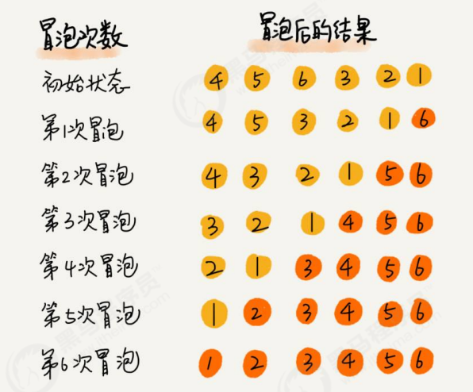

#  冒泡排序

冒泡排序（Bubble Sort），是一种计算机科学领域的较简单的排序算法。

> 排序前：{4,5,6,3,2,1}
>
> 排序后：{1,2,3,4,5,6}

排序原理： 

1. 比较相邻的元素。如果前一个元素比后一个元素大，就交换这两个元素的位置。 
2. 对每一对相邻元素做同样的工作，从开始第一对元素到结尾的最后一对元素。最终最后位置的元素就是最大 值。

~~~java
public class Bubble {
    /*
    对数组a中的元素进行排序
    */
    public static void sort(Comparable[] a) {
        for (int i = a.length - 1; i > 0; i--) {
            for (int j = 0; j < i; j++) {
                if (greater(a[j], a[j + 1])) {
                    exch(a, j, j + 1);
                }
            }
        }
    }

    /*
    比较v元素是否大于w元素
    */
    private static boolean greater(Comparable v, Comparable w) {
        return v.compareTo(w) > 0;
    }

    /*
    数组元素i和j交换位置
    */
    private static void exch(Comparable[] a, int i, int j) {
        Comparable t = a[i];
        a[i] = a[j];
        a[j] = t;
    }
}
~~~

