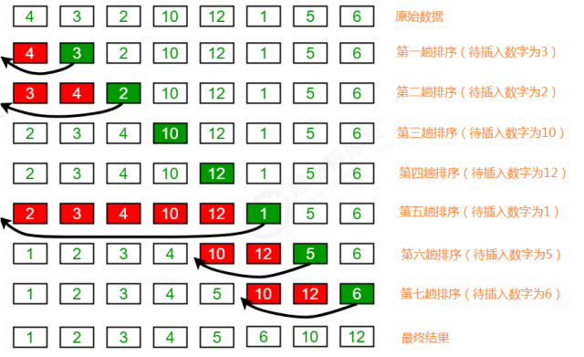

# 插入排序

插入排序（Insertion sort）是一种简单直观且稳定的排序算法。

> 排序前：{4,3,2,10,12,1,5,6} 
>
> 排序后：{1,2,3,4,5,6,10,12}

**排序原理：** 

1.把所有的元素分为两组，已经排序的和未排序的； 

2.找到未排序的组中的第一个元素，向已经排序的组中进行插入； 

3.倒叙遍历已经排序的元素，依次和待插入的元素进行比较，直到找到一个元素小于等于待插入元素，那么就把待 插入元素放到这个位置，其他的元素向后移动一位；

~~~java
public class Insertion {
    /*
    对数组a中的元素进行排序
    */
    public static void sort(Comparable[] a) {
        for (int i = 1; i < a.length; i++) {
			//当前元素为a[i],依次和i前面的元素比较，找到一个小于等于a[i]的元素
            for (int j = i; j > 0; j--) {
                if (greater(a[j - 1], a[j])) {
					//交换元素
                    exch(a, j - 1, j);
                } else {
					//找到了该元素，结束
                    break;
                }
            }
        }
    }

    /*
    比较v元素是否大于w元素
    */
    private static boolean greater(Comparable v, Comparable w) {
        return v.compareTo(w) > 0;
    }

    /*
    数组元素i和j交换位置
    */
    private static void exch(Comparable[] a, int i, int j) {
        Comparable t = a[i];
        a[i] = a[j];
        a[j] = t;
    }
}
~~~

