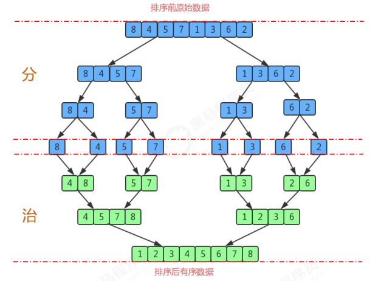

# 归并排序

归并排序（Merge Sort）是建立在归并操作上的一种有效的排序算法，该算法是采用分治法的一个非常典型的应用。将已有序的子 序列合并，得到完全有序的序列；即先使每个子序列有序，再使子序列段间有序。若将两个有序表合并成一个有序 表，称为二路归并。

> 排序前：{8,4,5,7,1,3,6,2} 
>
> 排序后：{1,2,3,4,5,6,7,8}

**排序原理：** 

1.尽可能的一组数据拆分成两个元素相等的子组，并对每一个子组继续拆分，直到拆分后的每个子组的元素个数是 1为止。 

2.将相邻的两个子组进行合并成一个有序的大组； 

3.不断的重复步骤2，直到最终只有一个组为止。

~~~java
public class Merge {
    private static Comparable[] assist;//归并所需要的辅助数组

    /*
    对数组a中的元素进行排序
    */
    public static void sort(Comparable[] a) {
        assist = new Comparable[a.length];
        int lo = 0;
        int hi = a.length - 1;
        sort(a, lo, hi);
    }

    /*
    对数组a中从lo到hi的元素进行排序
    */
    private static void sort(Comparable[] a, int lo, int hi) {
        if (hi <= lo) {
            return;
        }
        int mid = lo + (hi - lo) / 2;
//对lo到mid之间的元素进行排序；
        sort(a, lo, mid);
//对mid+1到hi之间的元素进行排序；
        sort(a, mid + 1, hi);
//对lo到mid这组数据和mid到hi这组数据进行归并
        merge(a, lo, mid, hi);
    }

    /*
    对数组中，从lo到mid为一组，从mid+1到hi为一组，对这两组数据进行归并
    */
    private static void merge(Comparable[] a, int lo, int mid, int hi) {
//lo到mid这组数据和mid+1到hi这组数据归并到辅助数组assist对应的索引处
        int i = lo;//定义一个指针，指向assist数组中开始填充数据的索引
        int p1 = lo;//定义一个指针，指向第一组数据的第一个元素
        int p2 = mid + 1;//定义一个指针，指向第二组数据的第一个元素
        //比较左边小组和右边小组中的元素大小，哪个小，就把哪个数据填充到assist数组中
        while (p1 <= mid && p2 <= hi) {
            if (less(a[p1], a[p2])) {
                assist[i++] = a[p1++];
            } else {
                assist[i++] = a[p2++];
            }
        }
//上面的循环结束后，如果退出循环的条件是p1<=mid，则证明左边小组中的数据已经归并完毕，如果退
        出循环的条件是p2 <= hi, 则证明右边小组的数据已经填充完毕；
//所以需要把未填充完毕的数据继续填充到assist中,//下面两个循环，只会执行其中的一个
        while (p1 <= mid) {
            assist[i++] = a[p1++];
        }
        while (p2 <= hi) {
            assist[i++] = a[p2++];
        }
//到现在为止，assist数组中，从lo到hi的元素是有序的，再把数据拷贝到a数组中对应的索引处
        for (int index = lo; index <= hi; index++) {
            a[index] = assist[index];
        }
    }

    /*
    比较v元素是否小于w元素
    */
    private static boolean less(Comparable v, Comparable w) {
        return v.compareTo(w) < 0;
    }

    /*
    数组元素i和j交换位置
    */
    private static void exch(Comparable[] a, int i, int j) {
        Comparable t = a[i];
        a[i] = a[j];
        a[j] = t;
    }
}
~~~

