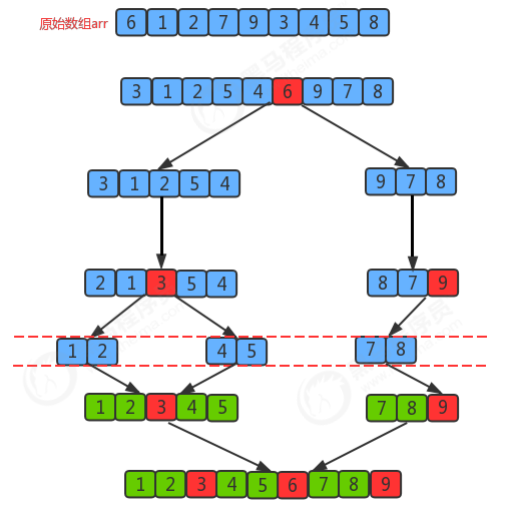

# 快速排序

快速排序（Quick Sort）是对冒泡排序的一种改进。

它的基本思想是：通过一趟排序将要排序的数据分割成独立的两部分，其中一 部分的所有数据都比另外一部分的所有数据都要小，然后再按此方法对这两部分数据分别进行快速排序，整个排序 过程可以递归进行，以此达到整个数据变成有序序列。

> 排序前:{6, 1, 2, 7, 9, 3, 4, 5, 8} 
>
> 排序后:{1, 2, 3, 4, 5, 6, 7, 8, 9}

**排序原理：** 

1.首先设定一个分界值，通过该分界值将数组分成左右两部分； 

2.将大于或等于分界值的数据放到到数组右边，小于分界值的数据放到数组的左边。此时左边部分中各元素都小于 或等于分界值，而右边部分中各元素都大于或等于分界值；

3.然后，左边和右边的数据可以独立排序。对于左侧的数组数据，又可以取一个分界值，将该部分数据分成左右两 部分，同样在左边放置较小值，右边放置较大值。右侧的数组数据也可以做类似处理。 

4.重复上述过程，可以看出，这是一个递归定义。通过递归将左侧部分排好序后，再递归排好右侧部分的顺序。当 左侧和右侧两个部分的数据排完序后，整个数组的排序也就完成了。

**切分原理：** 把一个数组切分成两个子数组的基本思想： 

1.找一个基准值，用两个指针分别指向数组的头部和尾部； 

2.先从尾部向头部开始搜索一个比基准值小的元素，搜索到即停止，并记录指针的位置； 

3.再从头部向尾部开始搜索一个比基准值大的元素，搜索到即停止，并记录指针的位置； 

4.交换当前左边指针位置和右边指针位置的元素； 

5.重复2,3,4步骤，直到左边指针的值大于右边指针的值停止。

~~~java
public class Quick {
    public static void sort(Comparable[] a) {
        int lo = 0;
        int hi = a.length - 1;
        sort(a, lo, hi);
    }

    private static void sort(Comparable[] a, int lo, int hi) {
        if (hi <= lo) {
            return;
        }
//对a数组中，从lo到hi的元素进行切分
        int partition = partition(a, lo, hi);
//对左边分组中的元素进行排序
//对右边分组中的元素进行排序
        sort(a, lo, partition - 1);
        sort(a, partition + 1, hi);
    }

    public static int partition(Comparable[] a, int lo, int hi) {
        Comparable key = a[lo];//把最左边的元素当做基准值
        int left = lo;//定义一个左侧指针，初始指向最左边的元素
        int right = hi + 1;//定义一个右侧指针，初始指向左右侧的元素下一个位置
//进行切分
        while (true) {
//先从右往左扫描，找到一个比基准值小的元素
            while (less(key, a[--right])) {//循环停止，证明找到了一个比基准值小的元素
                if (right == lo) {
                    break;//已经扫描到最左边了，无需继续扫描
                }
            }
//再从左往右扫描，找一个比基准值大的元素
            while (less(a[++left], key)) {//循环停止，证明找到了一个比基准值大的元素
                if (left == hi) {
                    break;//已经扫描到了最右边了，无需继续扫描
                }
            }
            if (left >= right) {
//扫描完了所有元素，结束循环
                break;
            } else {
//交换left和right索引处的元素
                exch(a, left, right);
            }
        }
//交换最后rigth索引处和基准值所在的索引处的值
        exch(a, lo, right);
        return right;//right就是切分的界限
    }

    /*
    数组元素i和j交换位置
    */
    private static void exch(Comparable[] a, int i, int j) {
        Comparable t = a[i];
        a[i] = a[j];
        a[j] = t;
    }

    /*
    比较v元素是否小于w元素
    */
    private static boolean less(Comparable v, Comparable w) {
        return v.compareTo(w) < 0;
    }
}
~~~

