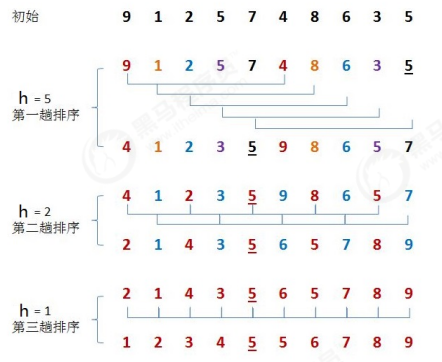

# 希尔排序

希尔排序（Shell Sort）是插入排序的一种，又称“缩小增量排序”，是插入排序算法的一种更高效的改进版本。

> 排序前：{9,1,2,5,7,4,8,6,3,5} 
>
> 排序后：{1,2,3,4,5,5,6,7,8,9}

**排序原理**： 

1.选定一个增长量h，按照增长量h作为数据分组的依据，对数据进行分组； 

2.对分好组的每一组数据完成插入排序； 

3.减小增长量，最小减为1，重复第二步操作。

~~~java
public class Shell {
    /*
    对数组a中的元素进行排序
    */
    public static void sort(Comparable[] a) {
        int N = a.length;
		//确定增长量h的最大值
        int h = 1;
        while (h < N / 2) {
            h = h * 2 + 1;
        }
		//当增长量h小于1，排序结束
        while (h >= 1) {
			//找到待插入的元素
            for (int i = h; i < N; i++) {
				//a[i]就是待插入的元素
				//把a[i]插入到a[i-h],a[i-2h],a[i-3h]...序列中
                for (int j = i; j >= h; j -= h) {
					//a[j]就是待插入元素，依次和a[j-h],a[j-2h],a[j-3h]进行比较，如果a[j]小，那么
                    //交换位置，如果不小于，a[j] 大，则插入完成。
                    if (greater(a[j - h], a[j])) {
                        exch(a, j, j - h);
                    } else {
                        break;
                    }
                }
            }
            h /= 2;
        }
    }

    /*
    比较v元素是否大于w元素
    */
    private static boolean greater(Comparable v, Comparable w) {
        return v.compareTo(w) > 0;
    }

    /*
    数组元素i和j交换位置
    */
    private static void exch(Comparable[] a, int i, int j) {
        Comparable t = a[i];
        a[i] = a[j];
        a[j] = t;
    }
}
~~~

