# 小程序

## 一、生命周期

生命周期（Life Cycle）是指一个对象从创建 -> 运行 -> 销毁的整个阶段，强调的是一个时间段

在小程序中，生命周期分为两类

- 应用生命周期 
  - 特指小程序从启动 -> 运行 -> 销毁的过程 
- 页面生命周期 
  - 特指小程序中，每个页面的加载 -> 渲染 -> 销毁的过程 

其中，页面的生命周期范围较小，应用程序的生命周期范围较大

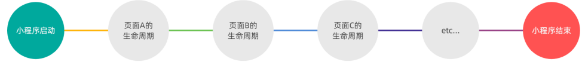

### 生命周期函数

是由小程序框架提供的内置函数，会伴随着生命周期，自动按次序执行

小程序中的生命周期函数分为两类，分别是： 

- 应用的生命周期函数 
  - 特指小程序从启动 -> 运行 -> 销毁期间依次调用的那些函数 
- 页面的生命周期函数 
  - 特指小程序中，每个页面从加载 -> 渲染 -> 销毁期间依次调用的那些函数

### 应用的生命周期函数

小程序的应用生命周期函数需要在 `app.js` 中进行声明

~~~js
// App.js 文件
App({
    // 小程序初始化完成时，执行此函数，全局只触发一次
    onLaunch: function(options){ },
    // 小程序启动，或从后台进入前台显示时触发
    onShow: function(options){ },
    // 小程序从前台进入后台时触发
    onHide: function() { }
})
~~~

### 页面的生命周期函数

小程序的页面生命周期函数需要在页面的 `.js` 文件中进行声明

~~~js
// 页面的 .js 文件
Page({
    onLoad: function(options) { }, // 监听页面加载，一个页面只调用一次
    onShow: function() { },		   // 监听页面显示
    onReady: function() { },	   // 监听页面初次渲染完成，一个页面只调用一次
    onHide: function() { },		   // 监听页面隐藏
    onUnload: function() { }	   // 监听页面卸载，一个页面只调用一次
})
~~~

## 二、小程序组件

### 常用组件

常用的视图容器类组件

① `view` 

- 普通视图区域 
- 类似于 HTML 中的 div，是一个块级元素 
- 常用来实现页面的布局效果 

② `scroll-view` 

- 可滚动的视图区域 
- 常用来实现滚动列表效果 

③ `swiper` 和 `swiper-item` 

- 轮播图容器组件 和 轮播图 item 组件

④ `text` 

- 文本组件 
- 类似于 HTML 中的 span 标签，是一个行内元素 

⑤ `rich-text` 

- 富文本组件 
- 支持把 HTML 字符串渲染为 WXML 结构

⑥ button 

- 按钮组件 
- 功能比 HTML 中的 button 按钮丰富 
- 通过 `open-type` 属性可以调用微信提供的各种功能（客服、转发、获取用户授权、获取用户信息等） 

⑦ image 

- 图片组件 
- image 组件默认宽度约 300px、高度约 240px 

⑧ navigator

- 页面导航组件 
- 类似于 HTML 中的 a 链接

#### view

**效果**

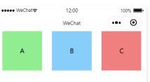

**代码**

~~~wxml
<!--pages/view/view.wxml-->
<view class="container1">
  <view>A</view>
  <view>B</view>
  <view>C</view>
</view>
~~~

~~~wxss
/* pages/view/view.wxss */
.container1 view {
  width: 100px;
  height: 100px;
  text-align: center;
  line-height: 100px;
}

.container1 view:nth-child(1){
  background-color: lightgreen;
}
.container1 view:nth-child(2){
  background-color: lightskyblue;
}
.container1 view:nth-child(3){
  background-color: lightpink;
}

.container1 {
  display: flex;
  justify-content: space-around;
}
~~~

#### scroll-view

**效果**

可滚动

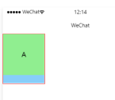

**代码**

~~~wxml
<!--pages/scroll-view/scroll-view.wxml-->
<!-- scroll-y 纵向滚动
     scroll-x 横向滚动 -->
<scroll-view class="container1" scroll-y>
  <view>A</view>
  <view>B</view>
  <view>C</view>
</scroll-view>
~~~

~~~wxss
/* pages/scroll-view/scroll-view.wxss */
/* pages/list/list.wxss */
.container1 view {
  width: 100px;
  height: 100px;
  text-align: center;
  line-height: 100px;
}

.container1 view:nth-child(1){
  background-color: lightgreen;
}
.container1 view:nth-child(2){
  background-color: lightskyblue;
}
.container1 view:nth-child(3){
  background-color: lightpink;
}

.container1 {
  display: flex;
  justify-content: space-around;
}
.container1 {
  border: 1px solid red;
  width: 100px;
  /*指定高度*/
  height:120px
}
~~~

#### swiper 和 swiper-item

**效果**

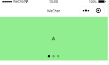

**代码**

~~~wxml
<!--轮播图-->
<swiper class="swiper-container" indicator-dots indi-color="green" indicator-active-color="gray">
  <!-- 第一张轮播图 -->
  <swiper-item>
    <view class="item">A</view>
  </swiper-item>
  <swiper-item>
    <view class="item">B</view>
  </swiper-item>
  <swiper-item>
    <view class="item">C</view>
  </swiper-item>
</swiper>
~~~

~~~wxss
/* pages/swiper/swiper.wxss */
.swiper-container {
  height: 150px;
}
.item {
  height: 100%;
  line-height: 150px;
  text-align: center;
}
swiper-item:nth-child(1) .item{
  background-color: lightpink;
}
swiper-item:nth-child(2) .item{
  background-color: fuchsia;
}
swiper-item:nth-child(3) .item{
  background-color: red;
}
~~~

**swiper 常用属性**

|          属性          |  类型   |      默认值       |         说明         |
| :--------------------: | :-----: | :---------------: | :------------------: |
|     indicator-dots     | boolean |       false       |  是否显示面板指示点  |
|    indicator-color     |  color  | rgba(0, 0, 0, .3) |      指示点颜色      |
| indicator-active-color |  color  |     `#000000`     | 当前选中的指示点颜色 |
|        autoplay        | boolean |       false       |     是否自动切换     |
|        interval        | number  |       5000        |   自动切换时间间隔   |
|        circular        | boolean |       false       |   是否采用衔接滑动   |

#### text

通过 `text` 组件的 `selectable` 属性，实现长按选中文本内容的效果

~~~wxml
<!-- 长按选中 -->
<text selectable>1234556</text>
~~~

::: warning 注意

只能选中 text 标签内的文本

:::

#### rich-text

通过 `rich-text` 组件的 `nodes` 属性节点，把 HTML 字符串渲染为对应的 UI 结构

**效果**

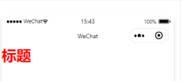

**代码**

~~~wxml
<rich-text nodes="<h1 style='color:red;'>biaoti</h1>"></rich-text>
~~~

#### button

**效果**

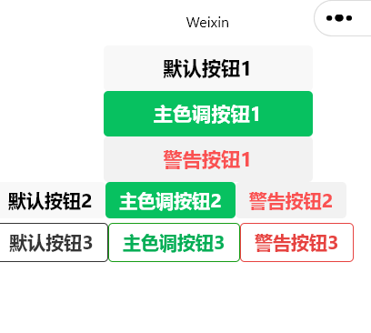

**代码**

~~~wxml
<!--pages/button/button.wxml-->
<button>默认按钮1</button>
<button type="primary">主色调按钮1</button>
<button type="warn">警告按钮1</button>

<button size="mini">默认按钮2</button>
<button size="mini" type="primary">主色调按钮2</button>
<button size="mini" type="warn">警告按钮2</button>

<button size="mini" plain>默认按钮3</button>
<button size="mini" type="primary" plain>主色调按钮3</button>
<button size="mini" type="warn" plain>警告按钮3</button>
~~~

#### image

**效果**

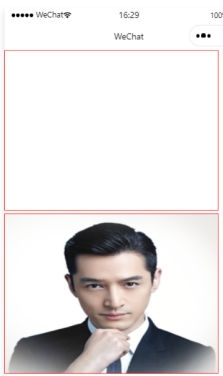

**代码**

~~~wxml
<image></image>
<image src="/image/1.png"></image>
~~~

**mode属性**

| mode 值     | 说明                                                         |
| ----------- | ------------------------------------------------------------ |
| scaleToFill | （默认值）缩放模式，不保持纵横比缩放图片，使图片的宽高完全拉伸至填满 image 元素 |
| aspectFit   | 缩放模式，保持纵横比缩放图片，使图片的长边能完全显示出来。也就是说，可以完整地将图片显示出来。 |
| aspectFill  | 缩放模式，保持纵横比缩放图片，只保证图片的短边能完全显示出来。也就是说，图片通常只在水平或垂直方 向是完整的，另一个方向将会发生截取。 |
| widthFix    | 缩放模式，宽度不变，高度自动变化，保持原图宽高比不变         |
| heightFix   | 缩放模式，高度不变，宽度自动变化，保持原图宽高比不变         |

### 创建组件

- 在项目的根目录中，鼠标右键，创建 components -> test 文件夹 
- 在新建的 components -> test 文件夹上，鼠标右键，点击“新建 Component” 
- 键入组件的名称之后回车，会自动生成组件对应的 4 个文件，后缀名分别为 `.js`，`.json`， `.wxml` 和 `.wxss`

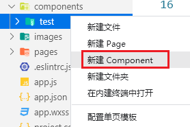

::: tip

为了保证目录结构的清晰，建议把不同的组件，存放到单独目录中

:::

### 引用组件

组件的引用方式分为“**局部引用**”和“**全局引用**”

- 局部引用：组件只能在当前被引用的页面内使用 
- 全局引用：组件可以在每个小程序页面中使用

#### 局部引用组件

在页面的 `.json` 配置文件中引用组件的方式，叫做“**局部引用**”

~~~json
// 页面的 .json 文件
{
    "usingComponents": {
        "my-test1": "/components/test1/test1"
    }
}

// 页面的 .wxml 文件中，使用组件
<my-test1></my-test1>
~~~

#### 全局引用组件

在 `app.json` 全局配置文件中引用组件的方式，叫做“**全局引用**”

~~~json
// app.json
{
    "pages": [/* 略 */],
    "window": {/* 略 */},
    "usingComponents": {
        "my-test2": "/components/test2/test2"
    }
}

// 页面的 .wxml 文件中，使用组件
<my-test2></my-test2>
~~~

::: tip 组件和页面的区别

组件和页面都是由 `.js`、`.json`、`.wxml` 和 `.wxss` 这四个文件组成的

- 组件的 `.json` 文件中需要声明 `"component": true` 属性 
- 组件的 `.js` 文件中调用的是 `Component()` 函数 
- 组件的事件处理函数需要定义到 `methods` 节点中

:::

### 数据、方法和属性

#### data 数据

在小程序组件中，用于组件模板渲染的私有数据，需要定义到 data 节点中

~~~js
Component({
    data: {
        count: 0
    }
})
~~~

#### methods 方法

在小程序组件中，事件处理函数和自定义方法需要定义到 methods 节点中

~~~js
Component({
    
  methods: {	// 组件的方法列表【包含事件处理函数和自定义方法】
	addCount() {	// 事件处理函数
        this.setData({
            count: this.data.count + 1,
            this._showCount()	// 通过 this 直接调用自定义方法
        })
    },
    _showCount(){	// 自定义方法建议以 _开头
        wx.showToast({
            title: 'count值为：' + this.data.count,
            icon: 'none'
        })
    }  
  }
    
})
~~~

#### properties 属性

在小程序组件中，properties 是组件的对外属性，用来接收外界传递到组件中的数据

~~~js
Component({
  // 属性定义  
  properties: {
  	max: {	// 完整的定义属性的方式【当需要指定属性默认值时，建议使用此方式】
        type: Number,	// 属性的数据类型
        value: 10	// 属性默认值
    },
    max: Number  // 简化定义属性的方式【不需指定属性默认值时，可以使用简化方式】
  },
    
})

// 页面
<my-test1 max="90"></my-test1>
~~~

::: tip  data 和 properties 的区别

本质上是一样的，都是可读可写的

- data 更倾向于存储组件的私有数据

- properties 更倾向于存储外界传递到组件中的数据

:::

~~~js
// 组件的 .wxml 文件中使用
<view>max的值为：{{ max }}</view>

Component({
  
  properties: {
    max: Number  
  },
  methods: {
      addCount() {
          this.setData({ max: this.properties.max + 1})
      }
  }  
    
})
~~~

### 数据监听器

数据监听器用于监听和响应任何属性和数据字段的变化，从而执行特定的操作

::: warning 注意

数据监听器，只能作用于组件

:::

~~~js
Component({
    observers: {
        '字段A, 字段B': function (字段A的新值, 字段B的新值) {
            // do something
        }
    }
})
~~~

#### 基本用法

~~~js
// 组件 UI 结构
<view>{{ n1 }} + {{ n2 }} = {{ sum }}</view>
<button size="mini" bindtap="addN1">n1自增</button>
<button size="mini" bindtap="addN2">n2自增</button>

// 组件的 .js
Component({
    data: { n1: 0, n2: 0, sum: 0},	// 数据节点
    methods: {	// 方法列表
        addN1(){ this.setData({ n1: this.data.n1 + 1 })},
        addN2(){ this.setData({ n2: this.data.n2 + 1 })},
    }
    observers: {	// 数据监听节点
        'n1, n2': function (newN1, newN2) {	// 监听 n1 和 n2 数据的变化
            this.setData({ sum: newN1 + newN2 })
        }
    }
})
~~~

#### 监听对象属性

数据监听器支持监听对象中单个或多个属性的变化

~~~js
Component({
    observers: {
        '对象.属性A, 对象.属性B': function (属性A的新值, 属性B的新值) {
            // 触发此监听器的 3 种情况：
            // 【为属性 A 赋值】使用 setData 设置 this.data.对象.属性A 时触发
            // 【为属性 B 赋值】使用 setData 设置 this.data.对象.属性B 时触发
            // 【直接为对象赋值】使用 setData 设置 this.data.对象 时触发
            // do something
        }
    }
})
~~~

::: tip

可以使用通配符 `**` 来监听对象中所有属性的变化

~~~js
observers: {
        'student.**': function (obj) {
            this.setData({
                // 赋值
            })
        }
    }
~~~

:::

### 纯数据字段

纯数据字段指的是那些不用于界面渲染的 data 字段。

既不会展示在界面上，也不会传递给其他组件，仅仅在当前 组件内部使用

::: tip

纯数据字段有助于提升页面更新的性能

:::

#### 使用规则

在 Component 构造器的 options 节点中，指定 pureDataPattern 为一个正则表达式，字段名符合这个正则表达式的字段将成为纯数据字段

~~~js
Component({
    options: {
        // 指定所有 _ 开头的数据字段为纯数据字段
        pureDataPattern: /^_/
    },
    data: {
        a:true,		// 普通字段
        _a: true	// 纯数据字段
    }
})
~~~

### 组件的生命周期

| 生命周期函数 | 参数         | 描述说明                                 |
| ------------ | ------------ | ---------------------------------------- |
| created      | 无           | 在组件实例刚刚被创建时执行               |
| attached     | 无           | 在组件实例进入页面节点树时执行           |
| ready        | 无           | 在组件在视图层布局完成后执行             |
| moved        | 无           | 在组件实例被移动到节点树另一个位置时执行 |
| detached     | 无           | 在组件实例被从页面节点树移除时执行       |
| error        | Object Error | 每当组件方法抛出错误时执行               |

最重要的生命周期函数有 3 个，分别是 created、attached、detached

- 组件实例刚被创建好的时候，created 生命周期函数会被触发 
  - 此时还不能调用 setData 
  - 通常在这个生命周期函数中，只应该用于给组件的 this 添加一些自定义的属性字段 
- 在组件完全初始化完毕、进入页面节点树后， attached 生命周期函数会被触发 
  - 此时， this.data 已被初始化完毕 
  - 这个生命周期很有用，绝大多数初始化的工作可以在这个时机进行（例如发请求获取初始数据） 
- 在组件离开页面节点树后， detached 生命周期函数会被触发 
  - 退出一个页面时，会触发页面内每个自定义组件的 detached 生命周期函数 
  - 此时适合做一些清理性质的工作

####  lifetimes 节点

在小程序组件中，生命周期函数可以直接定义在 Component 构造器的第一级参数中，可以在 lifetimes 字段内进行声明

~~~js
Component({
    lifetimes: {
        attached(){},
        detached(){}
    }
})
~~~

#### 组件所在页面的生命周期

有时，自定义组件的行为依赖于页面状态的变化，此时就需要用到组件所在页面的生命周期

例如：每当触发页面的 show 生命周期函数的时候，我们希望能够重新生成一个随机的 RGB 颜色值。 

在自定义组件中，组件所在页面的生命周期函数有如下 3 个

| 生命周期函数 | 参数        | 描述                         |
| ------------ | ----------- | ---------------------------- |
| show         | 无          | 组件所在的页面被展示时执行   |
| hide         | 无          | 组件所在的页面被隐藏时执行   |
| resize       | Object Size | 组件所在的页面尺寸变化时执行 |

#### pageLifetimes 节点

组件所在页面的生命周期函数，需要定义在 pageLifetimes 节点中

~~~js
Component({
    pageLifetimes : {
        show: function(){},
        hide: function(){},
        resize: function(size){},
    }
})
~~~

### 插槽

在自定义组件的 wxml 结构中，可以提供一个`<slot>`节点（插槽），用于承载组件使用者提供的 wxml 结构

#### 单个插槽

在小程序中，默认每个自定义组件中只允许使用一个`<slot>`进行占位，这种个数上的限制叫做单个插槽

~~~js
// 组件的封装者
<view>
    <view>这是组件的内部节点</view>
	// 对于不确定的内容，可以使用 slot 进行占位，具体内容由组件的使用者决定
	<slot></slot>
</view>

// 组件的使用者
<my-test1>
    // 这部分内容将被放置在组件 slot 位置上
    <view>这里是插入到组件 slot 中的内容</view>
</my-test1>
~~~

#### 启用多个插槽

在小程序的自定义组件中，需要使用多`<slot>`插槽时，可以在**组件的 `.js` 文件**中，通过如下方式进行启用

~~~js
Component({
    options : {
        multipleSlots: true // 启用多 slot
    }
})
~~~

#### 定义多个插槽

可以在组件的 `.wxml` 中使用多个`<slot>`标签，以不同的 name 来区分不同的插槽

~~~wxml
// 组件模板
<view>
	// name 为 before 的第一个 slot 插槽
	<slot name="before"></slot>
	<view>这是一段固定的文本内容<view>
	// name 为 after 的第二个 slot 插槽
	<slot name="after"></slot>
</view>
~~~

#### 使用多个插槽

在使用带有多个插槽的自定义组件时，需要用 slot 属性来将节点插入到不同的`<slot>`中

~~~wxml
// 使用组件的页面模板
<my-test1>
	// 这部分内容将被放置在组件 <slot name="before"> 的位置上
	<view slot="before">这里是插入到组件 slot name="before" 中的内容</view>
	// 这部分内容将被放置在组件 <slot name="after"> 的位置上
	<view slot="after">这里是插入到组件 slot name="after" 中的内容</view>
</my-test1>
~~~

### 父子组件之间的通信

- 属性绑定 
  - 用于父组件向子组件的指定属性设置数据，仅能设置 JSON 兼容的数据 
- 事件绑定 
  - 用于子组件向父组件传递数据，可以传递任意数据 
- 获取组件实例 
  - 父组件还可以通过 `this.selectComponent()` 获取子组件实例对象 
  - 这样就可以直接访问子组件的任意数据和方法

#### 属性绑定

属性绑定用于实现**父向子**传值，而且**只能传递普通类型的数据**，无法将方法传递给子组件

**父组件代码**

~~~wxml
// 父组件的 data 节点
data: {
	count: 0
}

// 父组件的 wxml
<my-test2 count="{{ count }}"></my-test2>
<view>父组件中 count 值为：{{ count }} </view>
~~~

**子组件代码**

子组件在 properties 节点中声明对应的属性并使用

~~~wxml
// 子组件的 properties 节点
properties: {
	count: Number
}

// 子组件的 wxml
<text>子组件中，count 值为：{{ count }} </text>
~~~

#### 事件绑定

事件绑定用于实现子向父传值，可以传递**任何类型的数据**

① 在父组件的 js 中，定义一个函数，这个函数即将通过自定义事件的形式，传递给子组件 

② 在父组件的 wxml 中，通过自定义事件的形式，将步骤 1 中定义的函数引用，传递给子组件 

③ 在子组件的 js 中，通过调用 `this.triggerEvent('自定义事件名称', { /* 参数对象 */ })` ，将数据发送到父组件 

④ 在父组件的 js 中，通过 `e.detail` 获取到子组件传递过来的数据

**父组件代码**

~~~js
// 父组件的 .js
// 在父组件中定义 syncCount 方法
// 将来这个方法会被传递给子组件。供子组件进行调用
syncCount(){
    console.log('syncCount')
    this.setData({
        // 通过 e.detail 获取到子组件传递过来的数据
        count: e.detail.value
    })
}

// 在父组件的 wxml
// 使用 bind:自定义事件名称
<my-test3 count="{{ count }}" bind:sync="syncCount"></my-test3>
// 或者 bind 后面接上自定义事件名称
<my-test3 count="{{ count }}" bindsync="syncCount"></my-test3>
~~~

**子组件代码**

~~~js
// 在子组件的 wxml
<text>子组件中，count值为: {{ count }} </text>
<button type="primary" bindtap="addCount"> +1 </button>

// 子组件的 .js
methods: {
    addCount () {
        this.setData({
            count: this.properties.count + 1
        })
        this.triggerEvent('sync', {value: this.properties.count})
    }
}
~~~

#### 获取组件实例

可在父组件里调用 `this.selectComponent("id或class选择器")` ，获取子组件的实例对象，从而直接访问子组 件的任意数据和方法。

调用时需要传入一个选择器，例如 `this.selectComponent(".my-component")`。

**父组件代码**

~~~js
// 父组件 wxml
<my-test3 count="{{ count }}" bind:sync="syncCount" class="customA" id="cA"></my-test3>
<button bindtap="getChild">获取子组件实例</button>

// 父组件 js
getChild(){
    // 切记下面参数不能传递标签选择器 'my-test3'，不然返回的时 null
    const child = this.selectComponent('.customA') //也可传递 id 选择器 #cA
    child.setData({ count: child.properties.count + 1 }) // 调用子组件的 setData 方法
    child.addCount() // 调用子组件的 addCount 方法
}
~~~

### behaviors

behaviors 是小程序中，用于实现组件间代码共享的特性，类似于 `Vue.js` 中的 “mixins”

每个 behavior 可以包含一组属性、数据、生命周期函数和方法。

组件引用它时，它的属性、数据和方法会被 合并到组件中。 

每个组件可以引用多个 behavior，behavior 也可以引用其它 behavior

#### 创建 behavior

调用 `Behavior(Object object)` 方法即可创建一个共享的 behavior 实例对象，供所有的组件使用

~~~js
module.exports = Behavior({
    // 属性节点
    properties: {},
    // 私有数据节点
    data: { username: 'zlw'},
    // 事件处理函数和自定义方法节点
    methods: {},
    // 其它节点 . . .
})
~~~

#### 导入并使用 behavior

在组件中，使用 `require()` 方法导入需要的 behavior，挂载后即可访问 behavior 中的数据或方法

~~~js
// 使用 require() 导入需要的自定义 behavior 模块
const myBehavior = require("../../behavior/my-behavior")

Component({
    // 挂载
    behavior: [myBehavior],
    // 组件其它节点 . . .
})
~~~

#### behavior 中所有可用的节点

| 可用的节点 | 类型         | 是否必填 | 描述                |
| ---------- | ------------ | -------- | ------------------- |
| properties | Object Map   | 否       | 同组件的属性        |
| data       | Object       | 否       | 同组件的数据        |
| methods    | Object       | 否       | 同自定义组件的方法  |
| behaviors  | String Array | 否       | 引入其它的 behavior |
| created    | Function     | 否       | 生命周期函数        |
| attached   | Function     | 否       | 生命周期函数        |
| ready      | Function     | 否       | 生命周期函数        |
| moved      | Function     | 否       | 生命周期函数        |
| detached   | Function     | 否       | 生命周期函数        |

#### 同名字段的覆盖和组合规则

组件和它引用的 behavior 中可以包含同名的字段，此时可以参考如下 3 种同名时的处理规则： 

① 同名的数据字段 (data) 

② 同名的属性 (properties) 或方法 (methods) 

③ 同名的生命周期函数

详细的覆盖和组合规则，参考微信小程序官方文档给出的说明

[https://developers.weixin.qq.com/miniprogram/dev/framework/custom-component/behaviors.html](https://developers.weixin.qq.com/miniprogram/dev/framework/custom-component/behaviors.html)

### 组件样式

::: warning 注意

默认情况下，自定义组件的样式只对当前组件生效，不会影响到组件之外的

`app.wxss` 中的全局样式对组件无效

只有 class 选择器会有样式隔离效果，id 选择器、属性选择器、标签选择器不受样式隔离的影响

:::

#### 修改组件的样式隔离选项

可以通过 styleIsolation 修改组件的样式隔离选项

~~~json
// 在组件的 .js 文件中新增如下配置
Component({
    options: {
        styleIsolation: 'isolated'
    }
})

// 或在组件的 .json 文件中新增如下配置
{
    "styleIsolation": "isolated"
}
~~~

#### styleIsolation 的可选值

| 可选值       | 默认值 | 描述                                                         |
| ------------ | ------ | ------------------------------------------------------------ |
| isolated     | 是     | 表示启用样式隔离，在自定义组件内外，使用 class 指定的样式将不会相互影响 |
| apply-shared | 否     | 表示页面 wxss 样式将影响到自定义组件，但自定义组件 wxss 中指定的样式不会影响页面 |
| shared       | 否     | 表示页面 wxss 样式将影响到自定义组件，自定义组件 wxss 中指定的样式也会影响页面和其 他设置了 apply-shared 或 shared 的自定义组件 |

## 三、小程序API

小程序官方把 API 分为了如下 3 大类： 

① 事件监听 API 

- 特点：以 on 开头，用来监听某些事件的触发 
- 举例：`wx.onWindowResize(function callback)` 监听窗口尺寸变化的事件 

② 同步 API 

- 特点1：以 Sync 结尾的 API 都是同步 API 
- 特点2：同步 API 的执行结果，可以通过函数返回值直接获取，如果执行出错会抛出异常 
- 举例：`wx.setStorageSync('key', 'value')` 向本地存储中写入内容 

③ 异步 API 

- 特点：类似于 jQuery 中的 `$.ajax(options)` 函数，需要通过 success、fail、complete 接收调用的结果 
- 举例：`wx.request()` 发起网络数据请求，通过 success 回调函数接收数据

## 四、WXML模板语法

数据绑定的基本原则：

- 在 data 中定义数据 
- 在 WXML 中使用数据

### 定义数据

在页面对应的 `.js` 文件中，把数据定义到 data 对象中即可

~~~js
Page({

  /**
   * 页面的初始数据
   */
  data: {
    info: 'hello 小程序',
    msgList: [{msg: 'hello'},{msg: '姑娘们'}]
  }
})
~~~

### {{}}

使用 data 中的数据

~~~wxml
<view>{{info}}</view>
<view>{{msgList[0].msg}}</view>
~~~

**效果**

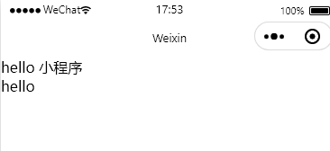

::: tip

跟 vue 的语法差不多

:::

#### **绑定属性**

~~~js
Page({

  /**
   * 页面的初始数据
   */
  data: {
    info: 'http://www.baidu.com/meinvtupian.png'
  }
})
~~~

~~~wxml
<image src="{{info}}"></image>
~~~

#### **三元运算**

~~~js
Page({

  /**
   * 页面的初始数据
   */
  data: {
    num: 5
  }
})
~~~

~~~wxml
<view> {{ num >= 5 ? 'num大于或等于5' : 'num小于5'}} </view>
~~~

#### 算数运算

~~~js
Page({

  /**
   * 页面的初始数据
   */
  data: {
    num: 5 * 10
  }
})
~~~

~~~wxml
<view> num的100倍为：{{ num * 100}} </view>
~~~

### 事件绑定

**小程序中常用的事件**

|  类型  |         绑定方式          |                    事件描述                    |
| :----: | :-----------------------: | :--------------------------------------------: |
|  tap   |    bindtap 或 bind:tap    | 手指触摸后马上离开，类似于 vue 中的 click 事件 |
| input  |  bindinput 或 bind:input  |                文本框的输入事件                |
| change | bindchange 或 bind:change |                 状态改变时触发                 |

当事件回调触发的时候，会收到一个事件对象 **`event`**，它的详细属性如下

|      属性      |    类型    |                     说明                     |
| :------------: | :--------: | :------------------------------------------: |
|      type      |   String   |                   事件类型                   |
|   timeStamp    |  Integer   |       页面打开到触发事件所经过的毫秒数       |
|   **target**   | **Object** |      **触发事件的组件的一些属性值集合**      |
| currentTarget  |   Object   |           当前组件的一些属性值集合           |
|   **detail**   | **Object** |                **额外的信息**                |
|    touches     |   Array    | 触摸事件，当前停留在屏幕中的触摸点信息的数组 |
| changedTouches |   Array    |     触摸事件，当前变化的触摸点信息的数组     |

**target 和 currentTarget 的区别**

target 是触发该事件的源头组件，而 currentTarget 则是当前事件所绑定的组件

例

~~~wxml
<view bindtap="login">
  <button>登录</button>
</view>
~~~

点击内部的按钮时，点击事件以冒泡的方式向外扩散，也会触发外层 view 的 tap 事件处理函数。 此时，对于外层的 view 来说： 

- `e.target` 指向的是触发事件的源头组件，因此，**e.target 是内部的按钮组件** 
- `e.currentTarget` 指向的是当前正在触发事件的那个组件，因此，**e.currentTarget 是当前的 view 组件**

#### bindtap

通过 bindtap，可以为组件绑定 tap 触摸事件，语法如下

~~~wxml
<button type="primary" bindtap="login">登录</button>
~~~

在页面的 `.js` 文件中定义对应的事件处理函数，事件参数通过形参 event（一般简写成 e） 来接收

~~~js
Page({

  login(e) {
    console.log(e)
  }
    
})
~~~

#### 在事件处理函数中为 data 中的数据赋值

通过调用 `this.setData(dataObject)` 方法，可以给页面 data 中的数据重新赋值

~~~js
// pages/button/button.js
Page({
    
  data: {
    count: 0
  },
  login(e) {
    this.setData({
      count: this.data.count + 1
    })
  }
    
})
~~~

#### 事件传参

小程序中的事件传参比较特殊，不能在绑定事件的同时为事件处理函数传递参数

~~~js
// 下面的代码将不能正常工作
<button type="primary" bindtap="login(123)">登录</button>
~~~

因为小程序会把 bindtap 的属性值，统一当作事件名称来处理，相当于要调用一个名称为 btnHandler(123)  的事件处理函数。

可以为组件提供 `data-*` 自定义属性传参，其中 `*` 代表的是参数的名字

~~~js
<button type="primary" bindtap="login" data-count="{{2}}">登录</button>
~~~

- info 会被解析为参数的名字 
- 数值 2 会被解析为参数的值

在事件处理函数中，通过 `event.target.dataset.参数名` 即可获取到具体参数的值

~~~js
login(e) {
    console.log(e.target.dataset)
    console.log(e.target.dataset.count)
  }
~~~

#### bindinput

在小程序中，通过 input 事件来响应文本框的输入事件，语法格式如下

~~~wxml
<input bindinput="inputHandler"></input>
~~~

在页面的 `.js` 文件中定义事件处理函数

~~~js
inputHandler(e) {
    // e.detail.value 是变化过后，文本框最新的值
    console.log(e.detail.value)
}
~~~

**实现文本框和 data 之间的数据同步**

① 定义数据

~~~js
data: {
    msg: '你好'
  },
~~~

② 渲染页面

~~~wxml
<input bindinput="inputHandler"></input>
~~~

③ 编写 input 事件处理函数

~~~js
inputHandler(e) {
    this.setData({
        msg: e.detail.value
    })
    console.log(e.detail.value)
},
~~~

###  wx:if

在小程序中，使用 `wx:if="{{condition}}"` 来判断是否需要渲染该代码块

~~~wxml
<view wx:if="{{ condition }}"> 姑娘你好 </view>
~~~

也可以用 `wx:elif` 和 `wx:else` 来添加 else 判断

~~~wxml
<view wx:if="{{ type === 1 }}"> 姑娘一个人吗 </view>
<view wx:elif="{{ type === 2 }}"> 加个wx </view>
<view wx:else="{{ condition }}"> 再见 </view>
~~~

#### 结合`<block>`使用 wx:if

如果要一次性控制多个组件的展示与隐藏，可以使用一个`<block></block>`标签将多个组件包装起来，并在`<block>`标签上使用 `wx:if` 控制属性

~~~wxml
<block wx:if="{{ condition }}">
	<view> 你好 </view>
	<view> 帅哥 </view>
</block>	
~~~

::: warning 注意

`<block>`并不是一个组件，它只是一个包裹性质的容器，不会在页面中做任何渲染

:::

#### hidden

在小程序中，直接使用 `hidden="{{ condition }}"` 也能控制元素的显示与隐藏

~~~wxml
<view hidden="{{ condition }}"> 姑娘你好 </view>
~~~

::: warning 注意

hidden 条件为 true 隐藏，false 显示

而 `wx:if` 条件为 true 显示，false 隐藏

:::

::: tip

wx:if 与 hidden

- `wx:if` 以动态创建和移除元素的方式，控制元素的展示与隐藏
- hidden 以切换样式的方式（display: none/block;），控制元素的显示与隐藏
- 频繁切换时，建议使用 hidden
- 控制条件复杂时，建议使用 `wx:if` 搭配 `wx:elif`、`wx:else` 进行展示与隐藏的切换

相当于 vue 的 v-if 和 v-show

:::

### wx:for

通过 `wx:for` 可以根据指定的**数组**，循环渲染重复的组件结构

~~~wxml
<view wx:for="{{ array }}"> 
	索引是：{{index}} 当前项是：{{item}} 
</view>
~~~

默认情况下，当前循环项的索引用 index 表示；当前循环项用 item 表示

**手动指定索引和当前项的变量名**

- 使用 `wx:for-index` 可以指定当前循环项的索引的变量名 
- 使用 `wx:for-item` 可以指定当前项的变量名

~~~wxml
<view wx:for="{{ array }}" wx:for-index="idx" wx:for-item="itemName"> 
	索引是：{{idx}} 当前项是：{{itemName}} 
</view>
~~~

### wx:key

类似于 Vue 列表渲染中的 `:key`，小程序在实现列表渲染时，也建议为渲染出来的列表项指定唯一的 key 值， 从而提高渲染的效率

~~~wx
// data 数据
data: {
	userList: [
		{id:1, name: '小红'},
		{id:2, name: '小黑'},
		{id:3, name: '小花'}
	]
}

// wxml
<view wx:for="{{ userList }}"> 
	{{item.name}} 
</view>
~~~

### wxss 模板样式

类似于网页开发中的 CSS

WXSS 具有 CSS 大部分特性，同时，WXSS 还对 CSS 进行了扩充以及修改，以适应微信小程序的开发。

- rpx 尺寸单位 
- `@import` 样式导入

#### rpx

rpx（responsive pixel）是微信小程序独有的，用来解决屏适配的尺寸单位

rpx 的实现原理非常简单：鉴于不同设备屏幕的大小不同，为了实现屏幕的自动适配，rpx 把所有设备的屏幕， 在宽度上等分为 750 份（即：当前屏幕的总宽度为 750rpx）。 

- 在较小的设备上，1rpx 所代表的宽度较小 
- 在较大的设备上，1rpx 所代表的宽度较大

小程序在不同设备上运行的时候，会自动把 rpx 的样式单位换算成对应的像素单位来渲染，从而实现屏幕适配

#####  rpx 与 px 之间的单位换算

在 iPhone6 上，屏幕宽度为375px，共有 750 个物理像素，等分为 750rpx。

则： 750rpx = 375px = 750 物理像素 1rpx = 0.5px = 1物理像素

::: tip

官方建议：开发微信小程序时，设计师可以用 iPhone6 作为视觉稿的标准。 

开发举例：在 iPhone6 上如果要绘制宽100px，高20px的盒子，换算成rpx单位，宽高分别为 200rpx 和 40rpx。

:::

#### @import 样式导入

使用 WXSS 提供的 `@import` 语法，可以导入外联的样式表

##### @import 的语法格式

`@import` 后跟需要导入的外联样式表的相对路径，用 `;` 表示语句结束

~~~wxss
/** common.wxss **/
.small-p {
	padding: 5px;
}
~~~

~~~wxss
/** app.wxss **/
@import "common.wxss";
.middle-p {
	padding: 15px;
}
~~~

#### 全局样式和局部样式

定义在 `app.wxss` 中的样式为全局样式，作用于每一个页面

在页面的 `.wxss` 文件中定义的样式为局部样式，只作用于当前页面。

::: warning 注意

- 当局部样式和全局样式冲突时，根据就近原则，局部样式会覆盖全局样式 
- 当局部样式的权重大于或等于全局样式的权重时，才会覆盖全局的样式

:::

## 五、配置

### 全局配置

**全局配置文件及常用的配置项**

小程序根目录下的 app.json 文件是小程序的全局配置文件。常用的配置项如下： 

① pages ：记录当前小程序所有页面的存放路径 

② **window** ：全局设置小程序窗口的外观 

③ **tabBar** ：设置小程序底部的 tabBar 效果 

④ style ：是否启用新版的组件样式

#### window

小程序窗口的组成部分

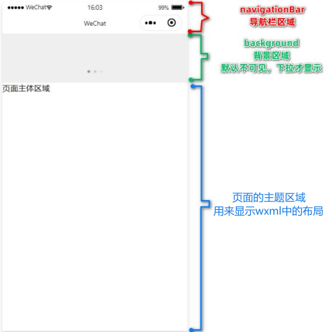

window 节点常用的配置项

| 属性名                       | 类型     | 默认值    | 说明                                           |
| ---------------------------- | -------- | --------- | ---------------------------------------------- |
| navigationBarTitleText       | String   | 字符串    | 导航栏标题文字内容                             |
| navigationBarBackgroundColor | HexColor | `#000000` | 导航栏背景颜色，如 `#000000`                   |
| navigationBarTextStyle       | String   | white     | 导航栏标题颜色，仅支持 black / white           |
| backgroundColor              | HexColor | `#ffffff` | 窗口的背景色                                   |
| backgroundTextStyle          | String   | dark      | 下拉 loading 的样式，仅支持 dark / light       |
| enablePullDownRefresh        | Boolean  | false     | 是否全局开启下拉刷新                           |
| onReachBottomDistance        | Number   | 50        | 页面上拉触底事件触发时距页面底部距离，单位为px |

::: warning 注意

在 `app.json` 中启用下拉刷新功能，会作用于每个小程序页面！

:::

#### tabBar

tabBar 是移动端应用常见的页面效果，用于实现多页面 的快速切换。

小程序中通常将其分为： 

- 底部 tabBar 
- 顶部 tabBar

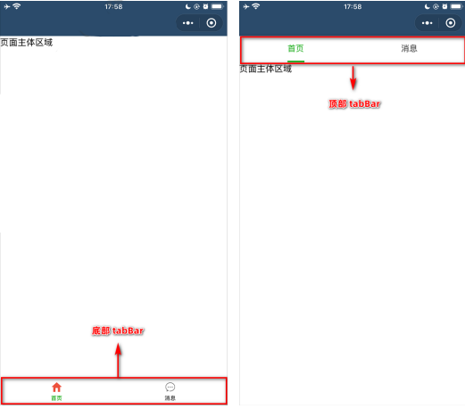

::: warning 注意

- tabBar中只能配置最少 2 个、最多 5 个 tab 页签 
- 当渲染顶部 tabBar 时，不显示 icon，只显示文本

:::

 tabBar 的 6 个组成部分

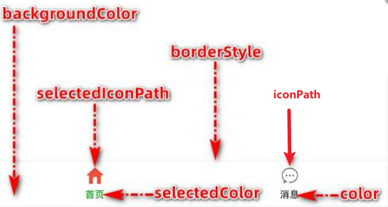

① `backgroundColor`：tabBar 的背景色 

② `selectedIconPath`：选中时的图片路径 

③ `borderStyle`：tabBar 上边框的颜色 

④ `iconPath`：未选中时的图片路径 

⑤ `selectedColor`：tab 上的文字选中时的颜色 

⑥ `color`：tab 上文字的默认（未选中）颜色

 tabBar 节点的配置项

| 属性            | 类型     | 必填 | 默认值 | 描述                                      |
| --------------- | -------- | ---- | ------ | ----------------------------------------- |
| position        | String   | 否   | bottom | tabBar 的位置，仅支持 bottom/top          |
| borderStyle     | String   | 否   | black  | tabBar 上边框的颜色，仅支持 black/white   |
| color           | HexColor | 否   |        | tab 上文字的默认（未选中）颜色            |
| selectedColor   | HexColor | 否   |        | tab 上的文字选中时的颜色                  |
| backgroundColor | HexColor | 否   |        | tabBar 的背景色                           |
| list            | Array    | 是   |        | tab 页签的列表， 最少 2 个、最多 5 个 tab |

每个 tab 项的配置选项

| 属性             | 类型   | 必填 | 描述                                                  |
| ---------------- | ------ | ---- | ----------------------------------------------------- |
| pagePath         | String | 是   | 页面路径，页面必须在 pages 中预先定义                 |
| text             | String | 是   | tab 上显示的文字                                      |
| iconPath         | String | 否   | 未选中时的图标路径；当 postion 为 top 时，不显示 icon |
| selectedIconPath | String | 否   | 选中时的图标路径；当 postion 为 top 时，不显示 icon   |

示例代码

~~~json
// app.json
{
    "tabBar": {
        "list": [
            {
            "pagePath": "pages/home/home",
            "text": "首页",
            "iconPath": "/images/tabs/home.png",
            "selectedIconPath": "/images/tabs/home-active.png" // 选中后显示的图片
        	},
            {
            "pagePath": "pages/message/message",
            "text": "消息",
            "iconPath": "/images/tabs/message.png",
            "selectedIconPath": "/images/tabs/message-active.png" // 选中后显示的图片
        	},
            {
            "pagePath": "pages/contact/contact",
            "text": "联系我们",
            "iconPath": "/images/tabs/contact.png",
            "selectedIconPath": "/images/tabs/contact-active.png" // 选中后显示的图片
        	},
        ]
    }
}
~~~

### 页面配置

小程序中，每个页面都有自己的 .json 配置文件，用来对当前页面的窗口外观、页面效果等进行配置

小程序中，`app.json` 中的 window 节点，可以全局配置小程序中每个页面的窗口表现。 

如果某些小程序页面想要拥有特殊的窗口表现，此时，“页面级别的 `.json` 配置文件”就可以实现这种需求。 

::: warning 注意

当页面配置与全局配置冲突时，根据就近原则，最终的效果以页面配置为准。

:::

页面配置中常用的配置项

| 属性                         | 类型     | 默认值    | 描述                                             |
| ---------------------------- | -------- | --------- | ------------------------------------------------ |
| navigationBarBackgroundColor | HexColor | `#000000` | 当前页面导航栏背景颜色，如 #000000               |
| navigationBarTextStyle       | String   | white     | 当前页面导航栏标题颜色，仅支持 black / white     |
| navigationBarTitleText       | String   |           | 当前页面导航栏标题文字内容                       |
| backgroundColor              | HexColor | `#ffffff` | 当前页面窗口的背景色                             |
| backgroundTextStyle          | String   | dark      | 当前页面下拉 loading 的样式，仅支持 dark / light |
| enablePullDownRefresh        | Boolean  | false     | 是否为当前页面开启下拉刷新的效果                 |
| onReachBottomDistance        | Number   | 50        | 页面上拉触底事件触发时距页面底部距离，单位为 px  |

### 自定义编译模式

每次保存都会默认跳转到首页，这样在开发调试其它页面时很不方便，这时我们可以配置编译模式来指定跳转的页面

1、点击添加编译模式

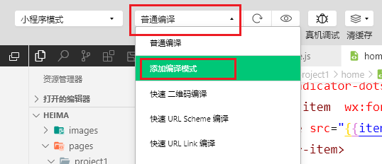

2、填写编译信息

指定启动页面、模板注释信息、也可以指定启动参数等

配置好后保存就会自动跳转到配置的页面

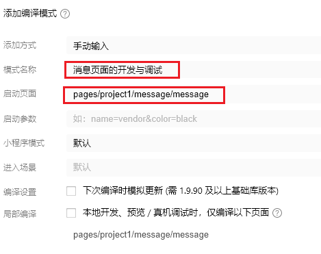

3、删除编译模式

点击要删除的编译模式后面的修改图标

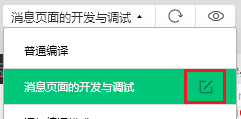

左下角删除

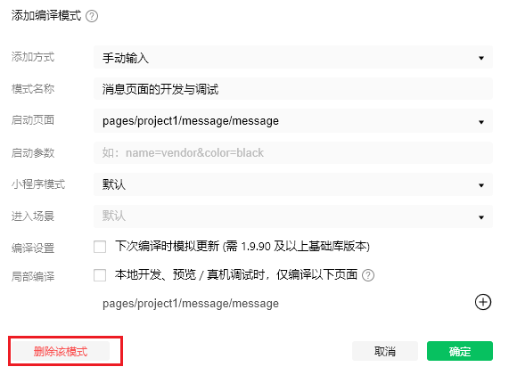

## 六、网络数据请求

**小程序中网络数据请求的限制**

出于安全性方面的考虑，小程序官方对数据接口的请求做出了如下 两个限制： 

① 只能请求 HTTPS 类型的接口 

② 必须将接口的域名添加到信任列表中

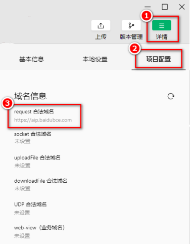

### 配置 request 合法域名

假设在自己的微信小程序中，希望请求 https://www.baidu.com/ 域名下的接口

配置步骤：登录微信小程序管理后台 -> 开发 -> 开发设置 -> 服务器域名 -> 修改 request 合法域名

配置完重启项目即可生效

注意事项： 

① 域名只支持 https 协议 

② 域名不能使用 IP 地址或 localhost 

③ 域名必须经过 ICP 备案 

④ 服务器域名一个月内最多可申请 5 次修改

### 跳过 request 合法域名校验

我们可以在微信开发者工具中，临时 开启`「开发环境不校验请求域名、TLS 版本及 HTTPS 证书」`选项， 跳过 request 合法域名的校验。

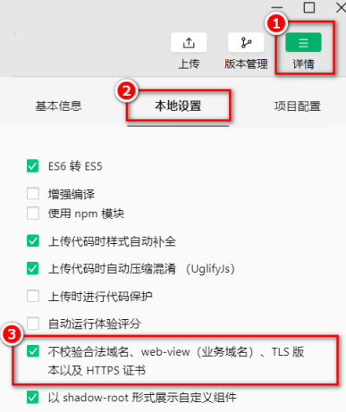

::: warning 注意

跳过 request 合法域名校验的选项，仅限在开发与调试阶段使用

:::

### 发起 GET 请求

调用微信小程序提供的 `wx.request()` 方法，可以发起 GET 数据请求

~~~js
wx.request({
    url: 'https://www.baidu.com/api/get', // 请求接口地址
    method: 'GET', // 请求方式
    data: {		   // 发送到服务器的数据
        name: 'zlw',
        age: 22
    },
    success: (res) => {	// 请求成功之后的回调函数
        console.log(res)
    }
})
~~~

### 发起 POST 请求

调用微信小程序提供的 `wx.request()` 方法，可以发起 POST 数据请求

~~~js
wx.request({
    url: 'https://www.baidu.com/api/get', // 请求接口地址
    method: 'POST', // 请求方式
    data: {		   // 发送到服务器的数据
        name: 'zlw',
        age: 22
    },
    success: (res) => {	// 请求成功之后的回调函数
        console.log(res)
    }
})
~~~

### 在页面刚加载时请求数据

在很多情况下，我们需要在页面刚加载的时候，自动请求一些初始化的数据。

此时需要在页面的 onLoad 事件 中调用获取数据的函数

~~~js
onLoad: function (options) {
    this.getSwiperList()
    this.getGridList()
}
~~~

### 关于跨域和 Ajax 的说明

跨域问题只存在于基于浏览器的 Web 开发中。由于小程序的宿主环境不是浏览器，而是微信客户端，所以**小程序中不存在跨域的问题。**

Ajax 技术的核心是依赖于浏览器中的 XMLHttpRequest 这个对象，由于小程序的宿主环境是微信客户端，所 以小程序中不能叫做“发起 Ajax 请求”，而是叫做“发起网络数据请求”。

## 七、页面导航

页面导航指的是页面之间的相互跳转。

小程序中实现页面导航的两种方式：

- 声明式导航 

  - 在页面上声明一个  导航组件 

  - 通过点击  组件实现页面跳转 

- 编程式导航 
  - 调用小程序的导航 API，实现页面的跳转

### 声明式导航

#### 导航到 tabBar 页面

tabBar 页面指的是被配置为 tabBar 的页面。 

在使用  组件跳转到指定的 tabBar 页面时，需要指定 url 属性和 open-type 属性，其中：

- url 表示要跳转的页面的地址，必须以 `/` 开头 
- open-type 表示跳转的方式，必须为 switchTab

~~~wxml
<navigator url="/pages/message/message" open-type="switchTab">导航到消息页</navigator>
~~~

#### 导航到非 tabBar 页面

非 tabBar 页面指的是没有被配置为 tabBar 的页面。 

在使用  组件跳转到普通的非 tabBar 页面时，则需要指定 url 属性和 open-type 属性，其中： 

- url 表示要跳转的页面的地址，必须以 / 开头 
- open-type 表示跳转的方式，必须为 navigate

~~~wxml
<navigator url="/pages/info/info" open-type="navigate">导航到info页</navigator>
~~~

::: tip

为了简便，在导航到非 tabBar 页面时，`open-type="navigate"` 属性可以省略

:::

#### 后退导航

如果要后退到上一页面或多级页面，则需要指定 open-type 属性和 delta 属性，其中： 

- open-type 的值必须是 navigateBack，表示要进行后退导航 
- delta 的值必须是数字，表示要后退的层级

~~~wxml
<navigator open-type="navigateBack" delta="1">返回上一页</navigator>
~~~

::: tip

为了简便，如果只是后退到上一页面，则可以省略 delta 属性，因为其默认值就是 1

:::

### 编程式导航

#### 导航到 tabBar 页面

调用 `wx.switchTab(Object object)` 方法，可以跳转到 tabBar 页面。

其中 Object 参数对象的属性列表如下

| 属性     | 类型     | 是否必选 | 说明                                             |
| -------- | -------- | -------- | ------------------------------------------------ |
| url      | string   | 是       | 需要跳转的 tabBar 页面的路径，路径后不能带参数   |
| success  | function | 否       | 接口调用成功的回调函数                           |
| fail     | function | 否       | 接口调用失败的回调函数                           |
| complete | function | 否       | 接口调用结束的回调函数（调用成功、失败都会执行） |

~~~wxml
// 页面结构
<button bindtap="gotoMessage">跳转到消息页面</button>

// 通过编程式导航，跳转到 message 页面
gotoMessage() {
	wx.switchTab({
		url: '/pages/message/message'
	})
}
~~~

#### 导航到非 tabBar 页面

调用 `wx.navigateTo(Object object)` 方法，可以跳转到非 tabBar 的页面。

其中 Object 参数对象的属性列表如下

| 属性     | 类型     | 是否必选 | 说明                                               |
| -------- | -------- | -------- | -------------------------------------------------- |
| url      | string   | 是       | 需要跳转到的非 tabBar 页面的路径，路径后可以带参数 |
| success  | function | 否       | 接口调用成功的回调函数                             |
| fail     | function | 否       | 接口调用失败的回调函数                             |
| complete | function | 否       | 接口调用结束的回调函数（调用成功、失败都会执行）   |

~~~wxml
// 页面结构
<button bindtap="gotoInfo">跳转到info页面</button>

// 通过编程式导航，跳转到 info 页面
gotoInfo() {
	wx.navigateTo({
		url: '/pages/info/info'
	})
}
~~~

#### 后退导航

调用 `wx.navigateBack(Object object)` 方法，可以返回上一页面或多级页面。

其中 Object 参数对象可选的 属性列表如下

| 属性     | 类型     | 默认值 | 是否必选 | 说明                                                  |
| -------- | -------- | ------ | -------- | ----------------------------------------------------- |
| delta    | number   | 1      | 否       | 返回的页面数，如果 delta 大于现有页面数，则返回到首页 |
| success  | function |        | 否       | 接口调用成功的回调函数                                |
| fail     | function |        | 否       | 接口调用失败的回调函数                                |
| complete | function |        | 否       | 接口调用结束的回调函数（调用成功、失败都会执行）      |

~~~wxml
// 页面结构
<button bindtap="gotoBack">返回上一页</button>

// 通过编程式导航，返回上一页
gotoBack() {
	wx.navigateBack()
}
~~~

### 导航传参

#### 声明式导航传参

navigator 组件的 url 属性用来指定将要跳转到的页面的路径。同时，路径的后面还可以携带参数

- 参数与路径之间使用 `?` 分隔 
- 参数键与参数值用 `=` 相连 
- 不同参数用 `&` 分隔

~~~wxml
<navigator url="/pages/info/info?name=zlw&age=24">导航到info页</navigator>
~~~

#### 编程式导航传参

调用 `wx.navigateTo(Object object)` 方法跳转页面时，也可以携带参数

~~~wxml
// 页面结构
<button bindtap="gotoInfo">跳转到info页面</button>

// 通过编程式导航，跳转到 info 页面，并携带参数
gotoInfo() {
	wx.navigateTo({
		url: '/pages/info/info?name=zlw&age=24'
	})
}
~~~

#### 在 onLoad 中接收导航参数

通过声明式导航传参或编程式导航传参所携带的参数，可以直接在 onLoad 事件中直接获取到

~~~js
onLoad: function(options){
    // options 就是导航传递过来的参数对象
    console.log(options)
}
~~~

## 八、页面事件

### 下拉刷新事件

下拉刷新是移动端的专有名词，指的是通过手指在屏幕上的下拉滑动操作，从而重新加载页面数据的行为

#### 启用下拉刷新

启用下拉刷新有两种方式： 

- 全局开启下拉刷新 
  - 在 app.json 的 window 节点中，将 enablePullDownRefresh 设置为 true 
- 局部开启下拉刷新 
  - 在页面的 .json 配置文件中，将 enablePullDownRefresh 设置为 true

::: tip

在实际开发中，推荐使用第 2 种方式，为需要的页面单独开启下拉刷新的效果

:::

#### 监听页面的下拉刷新事件

在页面的 `.js` 文件中，通过 `onPullDownRefresh()` 函数即可监听当前页面的下拉刷新事件

~~~js
// 页面结构
<view>count 值为：{{count}}</view>
<button bindtap="countAdd"> +1</button>

// +1 按钮的点击事件处理函数
countAdd() {
	this.setData({
        count: this.data.count + 1
    })
}

// 页面相关事件处理函数--监听用户下拉动作
onPullDownRefresh: function (){
    this.setData({
        count: 0
    })
}
~~~

#### 停止下拉刷新的效果

当处理完下拉刷新后，下拉刷新的 loading 效果会一直显示，不会主动消失，所以需要手动隐藏下拉刷新的 loading 效果。

此时，调用 `wx.stopPullDownRefresh()` 可以停止当前页面的下拉刷新

~~~js
// 页面相关事件处理函数--监听用户下拉动作
onPullDownRefresh: function (){
    this.setData({
        count: 0
    })
    // 当数据重置成功之后，调用此函数，关闭下路刷新效果
    wx.stopPullDownRefresh()
}
~~~

### 上拉触底事件

上拉触底是移动端的专有名词，通过手指在屏幕上的上拉滑动操作，从而加载更多数据的行为

####  监听页面的上拉触底事件

在页面的 `.js` 文件中，通过 `onReachBottom()` 函数即可监听当前页面的上拉触底事件

~~~js
// 页面上拉触底事件的处理函数
onReachBottom: function(){
    console.log('触发了上拉触底事件')
}
~~~

#### 配置上拉触底距离

上拉触底距离指的是触发上拉触底事件时，滚动条距离页面底部的距离。 

可以在全局或页面的 `.json` 配置文件中，通过 onReachBottomDistance 属性来配置上拉触底的距离。 

小程序默认的触底距离是 50px，在实际开发中，可以根据自己的需求修改这个默认值

::: tip

wx.showLoading({ title: '数据加载中. . .'})，展示 loading 效果

:::

## 九、WXS脚本

WXS（WeiXin Script）是小程序独有的一套脚本语言，结合 WXML，可以构建出页面的结构

wxml 中无法调用在页面的 `.js` 中定义的函数，但是，wxml 中可以调用 wxs 中定义的函数。

::: tip

小程序中 wxs 的典型应用场景就是“**过滤器**”

:::

-  wxs 的数据类型 
  - number 数值类型、string 字符串类型、boolean 布尔类型、object 对象类型、 
  - function 函数类型、array 数组类型、 date 日期类型、 regexp 正则 
-  wxs 不支持类似于 ES6 及以上的语法形式 
  - 不支持：let、const、解构赋值、展开运算符、箭头函数、对象属性简写、etc... 
  - 支持：var 定义变量、普通 function 函数等类似于 ES5 的语法 
- wxs 遵循 CommonJS 规范 
  - module 对象 
  - require() 函数 
  - module.exports 对象

### 基础语法

#### 内嵌 wxs 脚本

wxs 代码可以编写在 wxml 文件中的`<wxs>`标签内

wxml 文件中的每个`<wxs></wsx>`标签，必须提供 module 属性，用来指定当前 wxs 的模块名称，方便在 wxml 中访问模块中的成员

~~~wxml
<view>{{ m1.toUpper(username) }}</view>

<wxs module="m1">
	// 将文本转为大写形式 zlw -> ZLW
	module.exports.toUpper = function(str) {
		return str.toUpperCase()
	}
</wxs>
~~~

#### 外联的 wxs 脚本

wxs 代码还可以编写在以 `.wxs` 为后缀名的文件内

~~~wxs
// tools.wxs 文件
function toLower(str) {
	return str.toLowerCase()
}

module.exports = {
	toLower: toLower
}
~~~

在 wxml 中引入外联的 wxs 脚本时，必须为`<wxs>`标签添加 module 和 src 属性 

- module 用来指定模块的名称 
- src 用来指定要引入的脚本的路径，且**必须是相对路径**

~~~wxml
// 调用 m2 模块中的方法
<view> {{ m2.toLower(country)}} </view>

// 引用外联的 tools.wxs 脚本，命名为 m2
<wxs src="../../utils/tools.wxs" module="m2"></wxs>
~~~

::: warning 注意

1、在 wxs 中定义的函数不能作为组件的事件回调函数，下面的用法是错误的

~~~wxml
<button bindtap="m2.toLower"> 按钮 </button>
~~~

2、wxs 不能调用 js 中定义的函数

3、wxs 不能调用小程序提供的 API

:::

## 十、使用npm包

::: warning 注意

每次使用 npm 安装完新的依赖时，为了避免不必要得错误

建议删除 miniprogram_npm 文件夹，然后重新 工具 -> 构建npm

:::

在小程序中使用 npm 包有如下 3 个限制： 

① 不支持依赖于 `Node.js` 内置库的包 

② 不支持依赖于浏览器内置对象的包 

③ 不支持依赖于 C++ 插件的包

### Vant Weapp

Vant Weapp 是有赞前端团队开源的一套小程序 UI 组件库，助力开发者快速搭建小程序应用。它所使用的是 MIT 开源许可协议，对商业使用比较友好。 

官方文档地址: [https://youzan.github.io/vant-weapp](https://youzan.github.io/vant-weapp)

国内地址：[https://vant-contrib.gitee.io/vant-weapp/#/quickstart](https://vant-contrib.gitee.io/vant-weapp/#/quickstart)

#### 安装 Vant 组件库

在小程序项目中，安装 Vant 组件库主要分为如下 3 步： 

① 通过 npm 安装（建议指定版本为@1.3.3） 

② 构建 npm 包 

③ 修改 `app.json` 

详细的操作步骤，可以参考 Vant 官方提供的快速上手教程： [https://youzan.github.io/vant-weapp/#/quickstart#an-zhuang]( https://youzan.github.io/vant-weapp/#/quickstart#an-zhuang)

#### 使用 Vant 组件

可以在 `app.json` 的 usingComponents 节点中引入需要的组件，即可在 wxml 中 直接使用组件

~~~json
// app.json
"usingComponents": {
    "van-button": "@vant/weapp/button/index"
}

// 页面
<van-button type="primary">按钮</van-button>
~~~

#### 定制全局主题样式

Vant Weapp 使用 CSS 变量来实现定制主题。 

关于 CSS 变量的基本用法，请参考 MDN 文档：[https://developer.mozilla.org/zh-CN/docs/Web/CSS/Using_CSS_custom_properties](https://developer.mozilla.org/zh-CN/docs/Web/CSS/Using_CSS_custom_properties)

在 `app.wxss` 中，写入 CSS 变量，即可对全局生效

~~~wxss
// app.wxss
page {
	// 定制警告按钮的背景颜色和边框颜色
	--button-danger-background-color: #C00000;
	--button-danger-border-color: #D60000;
}
~~~

所有可用的颜色变量，请参考 Vant 官方提供的配置文件： [https://github.com/youzan/vant-weapp/blob/dev/packages/common/style/var.less](https://github.com/youzan/vant-weapp/blob/dev/packages/common/style/var.less)

### API Promise化

默认情况下，小程序官方提供的异步 API 都是基于回调函数实现的

API Promise化，指的是通过额外的配置，将官方提供的、基于回调函数的异步 API，升级改造为基于 Promise 的异步 API，从而提高代码的可读性、维护性，避免回调地狱的问题。

在小程序中，实现 API Promise 化主要依赖于 `miniprogram-api-promise` 这个第三方的 npm 包

#### 安装

~~~bash
npm install --save miniprogram-api-promise@1.0.4
~~~

#### 使用

在小程序入口文件中的 `app.js` 只需调用一次 `promisifyAll()` 方法，即可实现异步 API 的 Promise 化

~~~js
// app.js
import { promisifyAll } from 'miniprogram-api-promise'

const wxp = wx.p = {}
// promisify all wx's api   Promise 化所有的微信api
promisifyAll(wx, wxp)
~~~

#### 调用 Promise 化之后的异步 API

~~~js
// 页面 .wxml
<van-button type="danger" bindtap="getInfo">按钮</van-button>

// 页面 .js
async getInfo(){
    const { data: res } = await wx.p.request({
        method: 'GET',
        url:'https://www.baidu.com/api/get',
        data: { name: 'zlw', age: 24}
    })
    
    console.log(res)
}
~~~

## 十一、全局数据共享

在小程序中，可使用 mobx-miniprogram 配合 mobx-miniprogram-bindings 实现全局数据共享。

- mobx-miniprogram 用来创建 Store 实例对象 
- mobx-miniprogram-bindings 用来把 Store 中的共享数据或方法，绑定到组件或页面中使用

### MobX

#### 安装

~~~bash
npm install --save mobx-miniprogram@4.13.2 mobx-miniprogram-bindings@1.2.1
~~~

::: warning 注意

MobX 相关的包安装完毕之后，记得删除 miniprogram_npm 目录后，重新构建 npm。

:::

#### 创建 MobX 的 Store 实例

在根目录创建 `store/store.js` 文件

~~~js
// store.js
import { observable, action } from 'mobx-miniprogram'

export const store = observable({
    // 数据字段
    numA: 1,
    numB: 2,
    // 计算属性
    get sum() {
        return this.numA + this.numB
    },
    // actions 方法，用来修改 store 中的数据
    updateNum1: action(function (step) {
        this.numA += step
    }),
    updateNum2: action(function (step) {
        this.numB += step
    }),
})
~~~

#### 将 Store 中的成员绑定到页面中

~~~js
// 页面的 .js 
import { createStoreBindings } from 'mobx-miniprogram-bindings'
import { store } from '../../store/store'

Page({
    onLoad: function () { // 生命周期函数--监听页面加载
        this.storeBindings = createStoreBindings(this, {
            store,
            fields: ['numA', 'numB', 'sum'],
            actions: ['updateNum1']
        })
    },
    onUnload: function () { // 生命周期函数--监听页面卸载
        this.storeBindings.destroyStoreBindings()
    },
})
~~~

#### 在页面上使用 Store 中的成员

~~~js
// 页面 .wxml
<view>{{ numA }} + {{ numB }} = {{ sum }}</view>
<van-button type="primary" bindtap="btnHandler1" data-step="{{ 1 }}">
	numA + 1
</van-button>
<van-button type="danger" bindtap="btnHandler1" data-step="{{ -1 }}">
	numA - 1
</van-button>

// 页面 .js
btnHandler1(e) {
    this.updateNum1(e.target.dataset.step)
}
~~~

#### 将 Store 中的成员绑定到组件中

~~~js
// 组件的 .js
import { storeBindingsBehavior } from 'mobx-miniprogram-bindings'
import { store } from '../../store/store'

Component({
    behaviors: [storeBindingsBehavior], // 通过 storeBindingsBehavior 实现自动绑定
    
    storeBindings: {
        store, // 指定要绑定的 store
        fields: { // 指定要绑定的字段数据
            numA: () => store.numA,			// 绑定字段的第一种方式
            numB: (store) => store.numB,	// 绑定字段的第二种方式
            sum: 'sum'						// 绑定字段的第三种方式
        },
        action: { // 指定要绑定的方法
            updateNum2: 'updateNum2'
        }
    }
})
~~~

####  在组件中使用 Store 中的成员

~~~js
// 组件的 .wxml 
<view>{{ numA }} + {{ numB }} = {{ sum }}</view>
<van-button type="primary" bindtap="btnHandler2" data-step="{{ 1 }}">
	numB + 1
</van-button>
<van-button type="danger" bindtap="btnHandler2" data-step="{{ -1 }}">
	numB - 1
</van-button>

// 组件的方法列表
methods: {
    btnHandler2(e) {
        this.updateNum2(e.target.dataset.step)
    }
}
~~~

## 十二、分包

分包指的是把一个完整的小程序项目，按照需求划分为不同的子包，在构建时打包成不同的分包，用户在使用 时按需进行加载

对小程序进行分包的好处主要有以下两点： 

- 可以优化小程序首次启动的下载时间 
- 在多团队共同开发时可以更好的解耦协作

**分包前**

分包前，小程序项目中所有的页面和资源都被打包到了一起，导致整个项目体积过大，影响小程序首次启动的下载时间

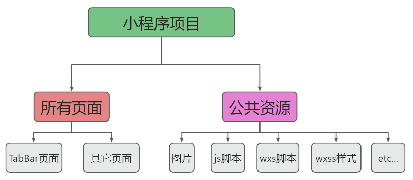

**分包后**

分包后，小程序项目由 1 个主包 + 多个分包组成： 

- 主包：一般只包含项目的启动页面或 TabBar 页面、以及所有分包都需要用到的一些公共资源 
- 分包：只包含和当前分包有关的页面和私有资源

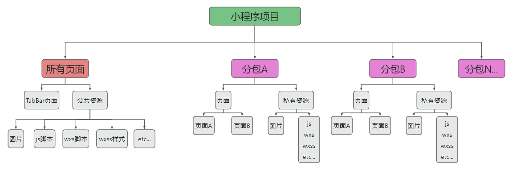

### 分包的加载规则

- 在小程序启动时，默认会下载主包并启动主包内页面 
  - tabBar 页面需要放到主包中 
- 当用户进入分包内某个页面时，客户端会把对应分包下载下来，下载完成后再进行展示 
  - 非 tabBar 页面可以按照功能的不同，划分为不同的分包之后，进行按需下载

### 分包的体积限制

目前，小程序分包的大小有以下两个限制： 

- 整个小程序所有分包大小不超过 16M（主包 + 所有分包） 
- 单个分包/主包大小不能超过 2M

**分包体积查看**

详情 --> 基本信息 --> 本地代码

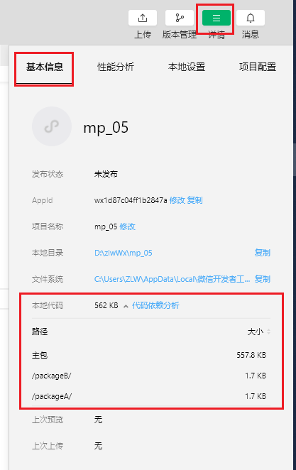

### 使用分包

#### 配置方法

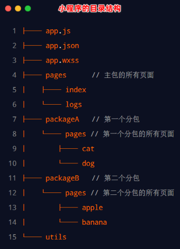

在 `app.json` 的 subpackages 节点中声明分包的结构

~~~json
// app.json
{
    "pages": [ // 主包的所有页面
        "pages/index",
        "pages/logs"
    ],
    "subpackages": [ // 通过 subpackages 节点，声明分包的结构
        {
            "root": "packageA", // 第一个分包的根目录
            "pages": [ // 当前分包下，所有页面的相对存放路径
                "pages/cat",
                "pages/dog"
            ]
        },
        {
            "root": "packageB", // 第二个分包的根目录
            "name": "pack2", // 分包的别名
            "pages": [ // 当前分包下，所有页面的相对存放路径
                "pages/apple",
                "pages/banana"
            ]
        }
    ]
}
~~~

#### 打包原则

① 小程序会按 subpackages 的配置进行分包，subpackages 之外的目录将被打包到主包中 

② 主包也可以有自己的 pages（即最外层的 pages 字段） 

③ tabBar 页面必须在主包内 

④ 分包之间不能互相嵌套

#### 引用原则

① 主包无法引用分包内的私有资源 

② 分包之间不能相互引用私有资源 

③ 分包可以引用主包内的公共资源

### 独立分包

独立分包本质上也是分包，只不过它比较特殊，可以独立于主包和其他分包而单独运行

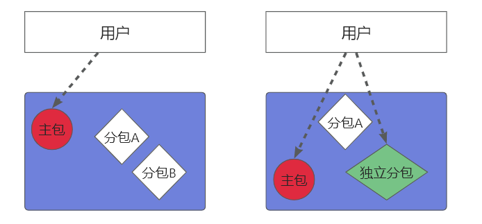

::: tip 独立分包和普通分包的区别

最主要的区别：是否依赖于主包才能运行 

- 普通分包必须依赖于主包才能运行 
- 独立分包可以在不下载主包的情况下，独立运行

:::

#### 独立分包的应用场景 

开发者可以按需，将某些具有一定功能独立性的页面配置到独立分包中。原因如下： 

- 当小程序从普通的分包页面启动时，需要首先下载主包 
- 而独立分包不依赖主包即可运行，可以很大程度上提升分包页面的启动速度 

::: warning 注意

一个小程序中可以有多个独立分包。

:::

#### 配置方法

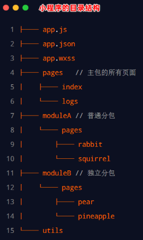

通过 independent 声明独立分包

~~~js
// app.json
{
    "pages": [ // 主包的所有页面
        "pages/index",
        "pages/logs"
    ],
    "subpackages": [ // 通过 subpackages 节点，声明分包的结构
        {
            "root": "packageA", // 第一个分包的根目录
            "pages": [ // 当前分包下，所有页面的相对存放路径
                "pages/cat",
                "pages/dog"
            ]
        },
        {
            "root": "packageB", // 第二个分包的根目录
            "name": "pack2", // 分包的别名
            "pages": [ // 当前分包下，所有页面的相对存放路径
                "pages/apple",
                "pages/banana"
            ],
            "independent": true // 通过此节点声明当前 packageB 分包为独立分包
        }
    ]
}
~~~

::: tip 

与 pages 一样，当我们配置好分包后，保存时，系统会自动为我们创建好分包结构

:::

#### 引用原则

独立分包和普通分包以及主包之间，是相互隔绝的，不能相互引用彼此的资源！例如： 

① 主包无法引用独立分包内的私有资源 

② 独立分包之间，不能相互引用私有资源 

③ 独立分包和普通分包之间，不能相互引用私有资源 

::: danger 特别注意

独立分包中不能引用主包内的公共资源

:::

### 分包预下载

在进入小程序的某个页面时，由框架自动预下载可能需要的分包，从而提升进入后续分包页面时的启动速度

#### 配置分包的预下载

预下载分包的行为，会在进入指定的页面时触发。

在 `app.json` 中，使用 preloadRule 节点定义分包的预下载规则

~~~json
// app.json
{
    "preloadRule": { // 分包预下载规则
        "pages/contact/contact": { // 触发分包预下载的页面路径
            // network 表示在指定的网络模式下，进行预下载
            // 可选值 all：不限网络，wifi：仅 wifi 模式进行预下载，默认 wifi
            "network": "all",
            // package 表示进入页面后，预下载哪些分包
            // 可以通过 root 或 name 指定预下载哪些分包
            "packages": ["packageA"]
        }
    }
}
~~~

配置预下载后，触发预下载条件，控制台会自动打印预下载信息

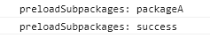

#### 分包预下载的限制

同一个分包中的页面享有共同的预下载大小限额 2M

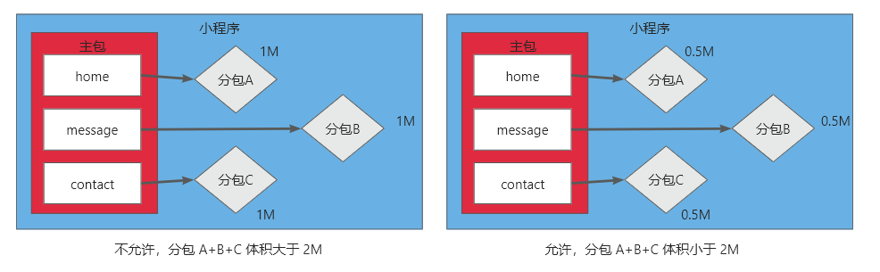

## 十三、发布上线

① 点击开发者工具顶部工具栏中的“上传” 按钮 

② 填写版本号以及项目备注

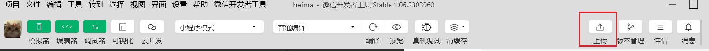

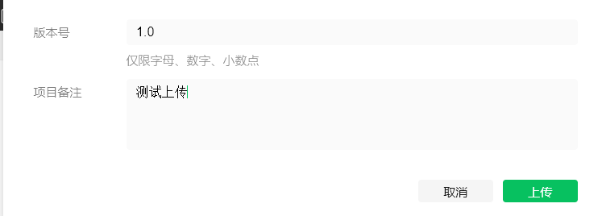

③ 登录小程序管理后台 -> 管理 -> 版本管理 -> 开发版本，即可查看刚才提交上传的版本

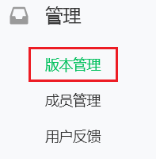

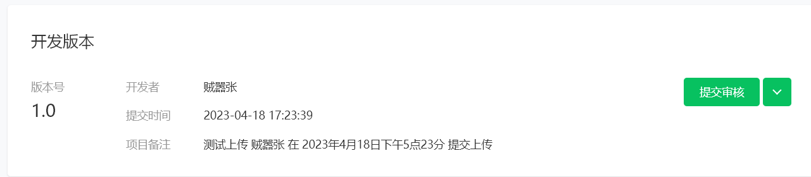

④ 点击“提交审核”按钮之后，按照页面提示填写相关的信息，就 能把小程序提交到腾讯官方进行审核。

⑤审核通过之后，管理员的微信中会收到小程序通过审核的通知，此时在审核版本的列表中，点击“**发布**”按钮 之后，即可把“审核通过”的版本发布为“线上版本”，供所有小程序用户访问和使用
