# 小程序前置知识

## 一、概述

小程序运行在微信环境中，所以小程序无法调用 DOM 和 BOM 的 API

但是，小程序中可以调用微信环境提供的各种 API。例如：1、地理定位 2、扫码 3、支付

小程序开发需要

- 自己申请小程序开发账号
- 安装小程序开发者工具
- 创建和配置小程序项目

### 项目结构

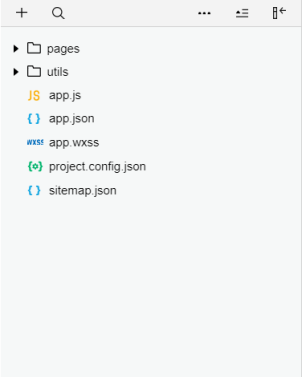

① `pages` 用来存放所有小程序的页面 

② `utils` 用来存放工具性质的模块（例如：格式化时间的自定义模块） 

③ `app.js` 小程序项目的入口文件 

④ `app.json` 小程序项目的全局配置文件 

⑤ `app.wxss` 小程序项目的全局样式文件 

⑥ `project.config.json` 项目的配置文件 

⑦ `sitemap.json` 用来配置小程序及其页面是否允许被微信索引

### 页面结构

小程序官方建议把所有小程序的页面，都存放在 **`pages`** 目录中，以单独的文件夹存在

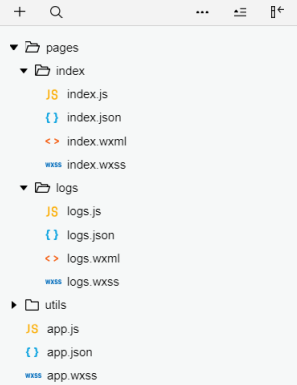

① `.js` 文件（页面的脚本文件，存放页面的数据、事件处理函数等） 

② `.json` 文件（当前页面的配置文件，配置窗口的外观、表现等） 

③ `.wxml` 文件（页面的模板结构文件） 

④ `.wxss` 文件（当前页面的样式表文件）

### JSON 配置文件

小程序项目中有 4 种 `json` 配置文件，分别是： 

① 项目根目录中的 `app.json` 配置文件 

② 项目根目录中的 `project.config.json` 配置文件 

③ 项目根目录中的 `sitemap.json` 配置文件 

④ 每个页面文件夹中的 `.json` 配置文件

####  app.json 文件

`app.json` 是当前小程序的全局配置，包括了小程序的所有页面路径、窗口外观、界面表现、底部 `tab` 等

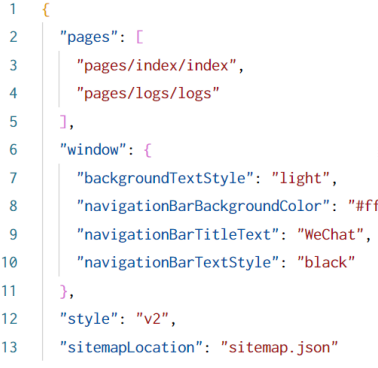

① `pages`：用来记录当前小程序所有页面的路径 

② `window`：全局定义小程序所有页面的背景色、文字颜色等 

③ `style`：全局定义小程序组件所使用的样式版本 

④ `sitemapLocation`：用来指明 `sitemap.json` 的位置

::: tip

在 pages 配置项中添加页面路径，即可自动生成对应的页面文件

调整页面路径的前后顺序，即可修改项目首页，小程序会把排在第一位的页 面，当作项目首页

:::

####  project.config.json 文件

`project.config.json` 是项目配置文件，用来记录我们对小程序开发工具所做的个性化配置，例如： 

①`setting` 中保存了编译相关的配置 

②`projectname` 中保存的是项目名称 

③`appid` 中保存的是小程序的账号 ID

#### sitemap.json 文件

微信现已开放小程序内搜索，效果类似于 PC 网页的 SEO。`sitemap.json` 文件用来配置小程序页面是否允许微信索引。

::: warning 注意

sitemap 的索引提示是默认开启的，如需要关闭 sitemap 的索引提示，可在小程序项目配置文件 `project.config.json` 的 `setting` 中配置字段 `checkSiteMap` 为 `false`

:::

#### 页面的 .json 配置文件

小程序中的每一个页面，可以使用 `.json` 文件来对本页面的窗口外观进行配置

::: warning 注意

页面中的配置项会覆盖 `app.json` 的 `window` 中相同的配置项。

:::

####  .js 文件

小程序中的 JS 文件分为三大类，分别是： 

① `app.js` 是整个小程序项目的入口文件，通过调用 `App()` 函数来启动整个小程序 

② 页面的 `.js` 文件 是页面的入口文件，通过调用 `Page()` 函数来创建并运行页面 

③ 普通的 `.js` 文件 是普通的功能模块文件，用来封装公共的函数或属性供页面使用

### 页面渲染的过程

① 加载解析页面的 `.json` 配置文件 

② 加载页面的 `.wxml` 模板和 `.wxss` 样式 

③ 执行页面的 `.js` 文件，调用 `Page()` 创建页面实例 

④ 页面渲染完成

## 二、开发前准备

### 注册小程序开发帐号

1、使用浏览器打开 [https://mp.weixin.qq.com/]( https://mp.weixin.qq.com/) 网址，点击右上角的“立即注册”

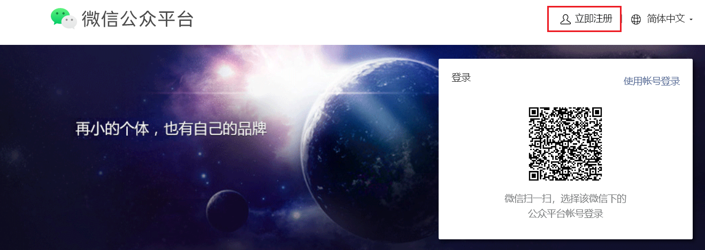

2、选择注册账号的类型

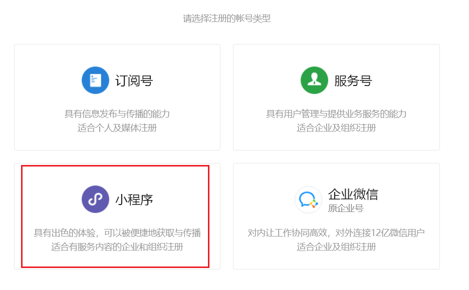

3、 填写账号信息

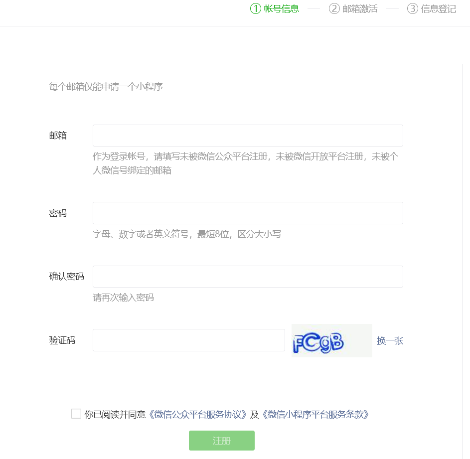

4、进入邮箱进行激活

5、选择主体类型

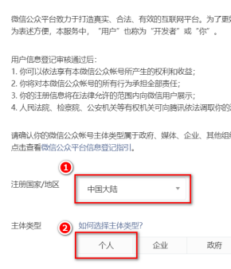

6、主体信息登记

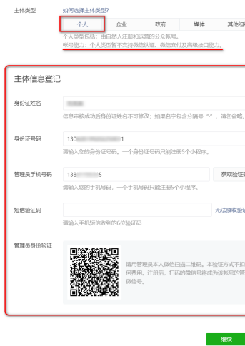

7、获得 AppID

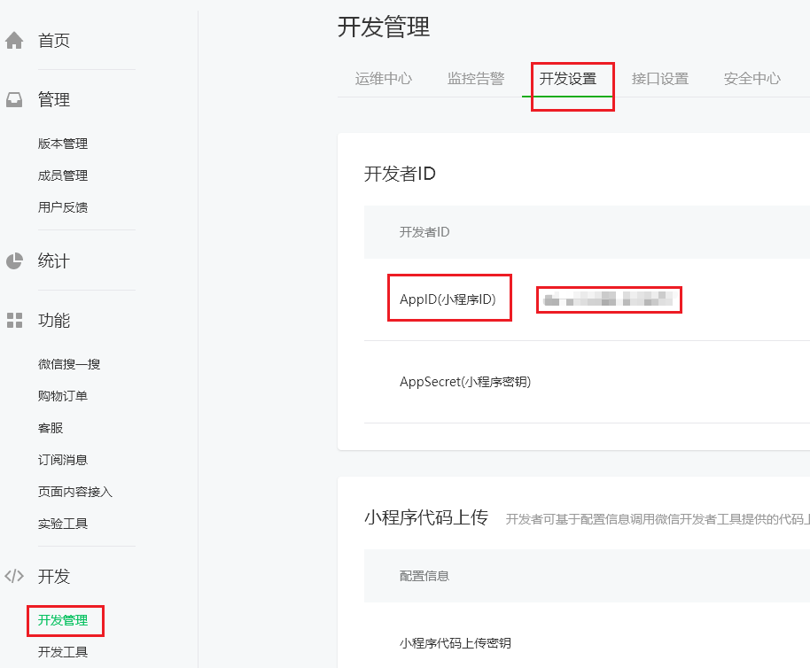

### 安装开发者工具

下载页面的链接如下： [https://developers.weixin.qq.com/miniprogram/dev/devtools/stable.html](https://developers.weixin.qq.com/miniprogram/dev/devtools/stable.html)

1、下载安装

下载最新的稳定版（Stable Build）的微信开发者工具

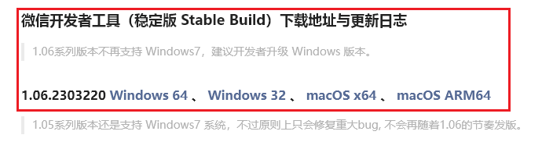

傻瓜式安装

::: tip

安装目录最好不要有中文和空格

:::

2、设置一下代理

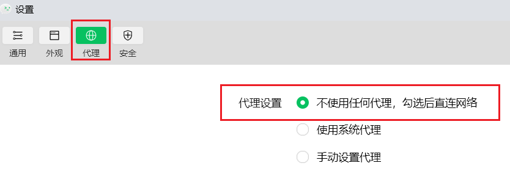

### 创建项目

1、点 + 号

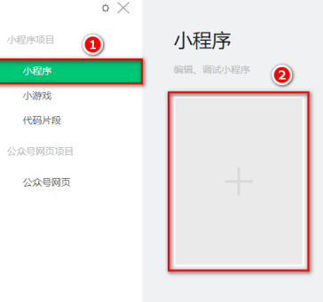

2、填写信息

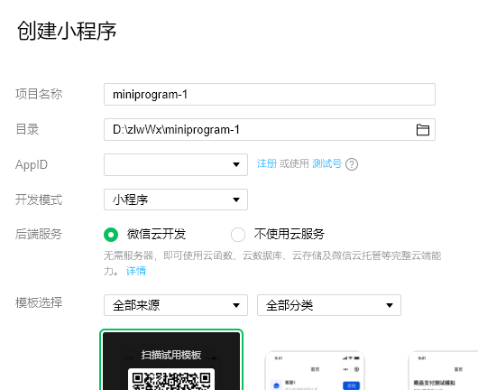

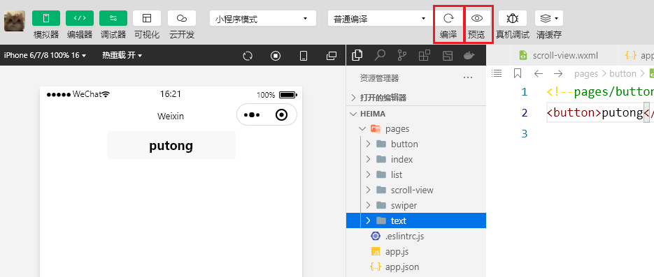

编译：可以在左侧实时看到效果

预览：会弹出二维码，用手机扫描可以在手机上查看效果
