# Docker

## 一、安装

### CentOS7安装Docker

Docker CE 支持 64 位版本 CentOS 7，并且要求内核版本不低于 3.10， CentOS 7 满足最低内核的要求，所以我们在CentOS 7安装Docker。

#### 卸载（可选）

如果之前安装过旧版本的Docker，可以使用下面命令卸载：

```bash
yum remove docker \
                  docker-client \
                  docker-client-latest \
                  docker-common \
                  docker-latest \
                  docker-latest-logrotate \
                  docker-logrotate \
                  docker-selinux \
                  docker-engine-selinux \
                  docker-engine \
                  docker-ce
```

#### 安装Docker

首先需要大家虚拟机联网，安装yum工具

```bash
yum install -y yum-utils \
           device-mapper-persistent-data \
           lvm2 --skip-broken
```

然后更新本地镜像源

```bash
# 设置docker镜像源
yum-config-manager \
    --add-repo \
    https://mirrors.aliyun.com/docker-ce/linux/centos/docker-ce.repo
    
sed -i 's/download.docker.com/mirrors.aliyun.com\/docker-ce/g' /etc/yum.repos.d/docker-ce.repo

yum makecache fast
```

安装Docker

```bash
yum install -y docker-ce
```

docker-ce为社区免费版本。稍等片刻，docker即可安装成功。

#### 启动Docker

Docker应用需要用到各种端口，逐一去修改防火墙设置。非常麻烦，因此建议大家直接关闭防火墙！

```bash
# 关闭
systemctl stop firewalld
# 禁止开机启动防火墙
systemctl disable firewalld

# 开端口  6379为例
firewall-cmd --zone=public --add-port=6379/tcp --permanent
# 重启防火墙使配置生效
systemctl restart firewalld
```

通过命令启动docker

```bash
systemctl start docker  # 启动docker服务

systemctl stop docker  # 停止docker服务

systemctl restart docker  # 重启docker服务
```

可以查看docker版本

```bash
docker -v
```

#### 配置镜像加速

docker官方镜像仓库网速较差，我们需要设置国内镜像服务：

参考阿里云的镜像加速文档：[https://cr.console.aliyun.com/cn-hangzhou/instances/mirrors](https://cr.console.aliyun.com/cn-hangzhou/instances/mirrors)


### CentOS安装DockerCompose

#### 下载

Linux下需要通过命令下载

```bash
# 安装
curl -L https://github.com/docker/compose/releases/download/1.23.1/docker-compose-`uname -s`-`uname -m` > /usr/local/bin/docker-compose
```

也可以手动上传到 /usr/local/bin/ 目录

#### 修改文件权限

```bash
# 修改权限
chmod +x /usr/local/bin/docker-compose
```

#### Base自动补全命令

```bash
# 补全命令
curl -L https://raw.githubusercontent.com/docker/compose/1.29.1/contrib/completion/bash/docker-compose > /etc/bash_completion.d/docker-compose

# 如果这里出现错误，需要修改自己的hosts文件
echo "199.232.68.133 raw.githubusercontent.com" >> /etc/hosts
```

## 二、Docker基本操作

### 镜像操作

####  镜像名称

首先来看下镜像的名称组成：

- 镜名称一般分两部分组成：[repository]:[tag]。
- 在没有指定tag时，默认是latest，代表最新版本的镜像

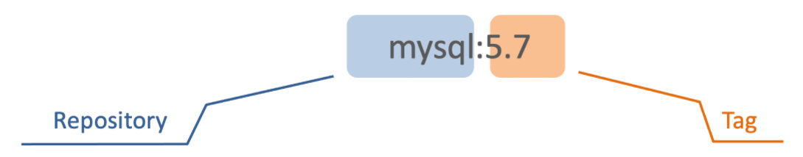

####  镜像命令

常见的镜像操作命令如图

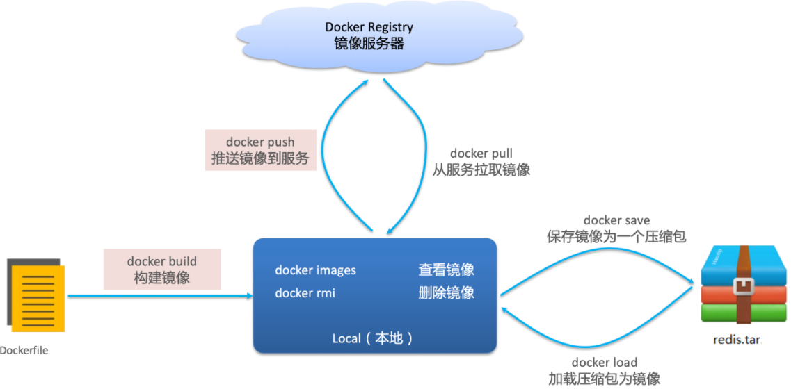

```bash
# 拉取镜像
docker pull nginx

# 查看拉取到的镜像
docker images

# 导出镜像到磁盘 docker save -o [保存的目标文件名称] [镜像名称]
docker save -o nginx.tar nginx:latest

# 删除本地的 nginx 镜像
docker rmi nginx:latest

# 加载本地压缩包为镜像
docker load -i nginx.tar

```

### 容器操作

#### 容器相关命令

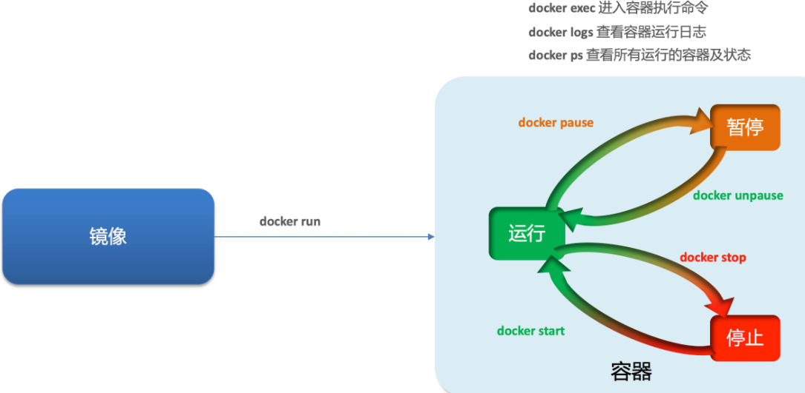

容器保护三个状态：

- 运行：进程正常运行
- 暂停：进程暂停，CPU不再运行，并不释放内存
- 停止：进程终止，回收进程占用的内存、CPU等资源

其中：

- docker run：创建并运行一个容器，处于运行状态
- docker pause：让一个运行的容器暂停
- docker unpause：让一个容器从暂停状态恢复运行
- docker stop：停止一个运行的容器
- docker start：让一个停止的容器再次运行
- docker rm：删除一个容器

```bash
# 创建并运行nginx容器的命令
# --name 给容器起个名 -p 端口映射 -d 后台运行 nginx 镜像名称
docker run --name mynginx -p 80:80 -d nginx

# 进入Nginx容器，修改HTML文件内容，添加“Nginx欢迎您”
# -it 给当前进入的容器创建一个标准输入、输出终端，允许我们与容器交互 bash linux终端交互命令
docker exec -it mynginx bash
cd /usr/share/nginx/html
# 容器内没有vi命令，无法直接修改，我们用下面的命令来修改
sed -i -e 's#Welcome to nginx#Nginx欢迎您#g' -e 's#<head>#<head><meta charset="utf-8">#g' index.html
```

容器内部会模拟一个独立的Linux文件系统，看起来如同一个linux服务器一样

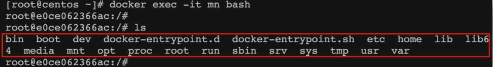

nginx的环境、配置、运行文件全部都在这个文件系统中，包括我们要修改的html文件。

查看DockerHub网站中的nginx页面，可以知道nginx的html目录位置在/usr/share/nginx/html

### 数据卷

**数据卷（volume）** 是一个虚拟目录，指向宿主机文件系统中的某个目录。

**作用**：将数据与容器解耦，这就要用到数据卷了。

在之前的nginx案例中，修改nginx的html页面时，需要进入nginx内部。并且因为没有编辑器，修改文件也很麻烦。

这就是因为容器与数据（容器内文件）耦合带来的后果。

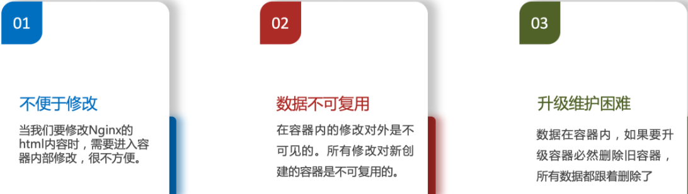

一旦完成数据卷挂载，对容器的一切操作都会作用在数据卷对应的宿主机目录了。

这样，我们操作宿主机的/var/lib/docker/volumes/html目录，就等于操作容器内的/usr/share/nginx/html目录了

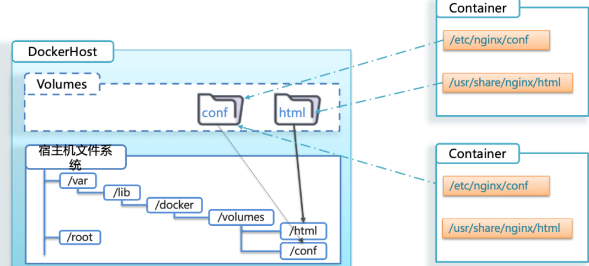

#### 数据卷命令

```bash
docker volume [COMMAND]
```

docker volume命令是数据卷操作，根据命令后跟随的command来确定下一步的操作：

- create 创建一个volume
- inspect 显示一个或多个volume的信息
- ls 列出所有的volume
- prune 删除未使用的volume
- rm 删除一个或多个指定的volume

#### 创建和查看数据卷

```bash
# 创建名为 html 的数据卷
docker volume create html

# 查看所有数据
docker volume ls

# 查看 html 数据卷详细信息卷
docker volume inspect html
```

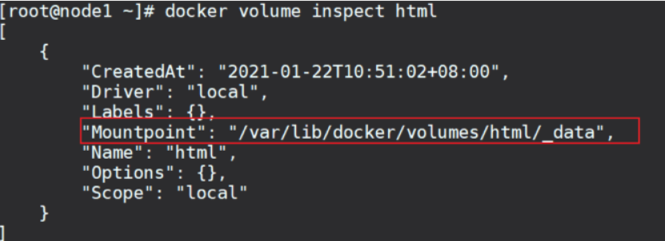可以看到，我们创建的html这个数据卷关联的宿主机目录为/var/lib/docker/volumes/html/_data目录

#### 挂载数据卷

我们在创建容器时，可以通过 -v 参数来挂载一个数据卷到某个容器内目录

```bash
docker run /
  --name mn /
  -v html:/root/html /
  -p 8080:80
  nginx /
```

这里的-v就是挂载数据卷的命令：

- -v html:/root/htm ：把html数据卷挂载到容器内的/root/html这个目录中

```bash
# 创建一个nginx容器，修改容器内的html目录内的index.html内容
# 上个案例中，我们进入nginx容器内部，已经知道nginx的html目录所在位置/usr/share/nginx/html ，我们需要把这个目录挂载到html这个数据卷上，方便操作其中的内容

# 创建容器并挂载数据卷到容器内的HTML目录
docker run --name mynginx -p 80:80 -v html:/usr/share/nginx/html -d nginx

# 进入html数据卷所在位置，并修改HTML内容
# 查看html数据卷的位置
docker volume inspect html
# 进入该目录
cd /var/lib/docker/volumes/html/_data
# 修改文件
vi index.html
```

容器不仅仅可以挂载数据卷，也可以直接挂载到宿主机目录上。关联关系如下：

- 带数据卷模式：宿主机目录 --> 数据卷 ---> 容器内目录
- 直接挂载模式：宿主机目录 ---> 容器内目录

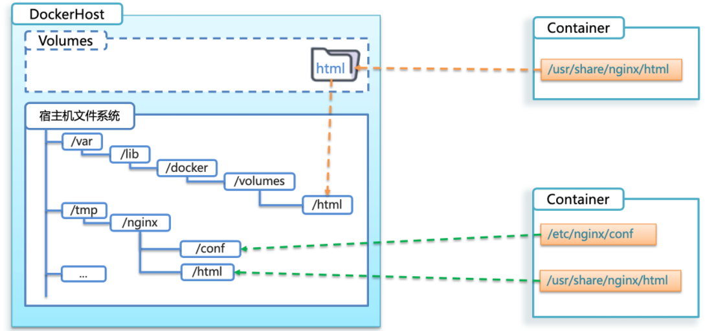

语法：

目录挂载与数据卷挂载的语法是类似的：

- -v [宿主机目录]:[容器内目录]
- -v [宿主机文件]:[容器内文件]

**命令比较多，建议使用 CTRL + F 搜索**

## 三、Docker命令汇总

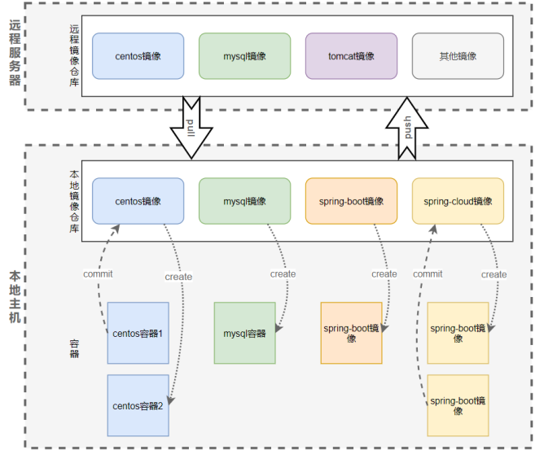

 镜像仓库用来保存镜像，可分为远程镜像仓库和本地镜像仓库。 

 通过`pull`命令可以把远程仓库的镜像下载到本地，通过`push`命令可以把本地仓库的镜像推送到远程 

 本地仓库中的镜像可以用来创建容器，一个镜像可以创建多个容器 

 容器也可以通过`commit`命令打包成镜像，提交到本地仓库。  

### 操作远程仓库的命令  

####  login：登录到远程仓库  

 login命令可以登录到远程仓库，登录到远程仓库后可可以拉取仓库的镜像了  

 **login语法**  

> **docker login [OPTIONS] [SERVER]**
> **SERVER**：远程仓库地址，默认为docker官方仓库
> **OPTIONS**： 
>
> - `-u` string：用户名 
> - `-p` string：密码  

```bash
docker login -u linwei -p 123456 192.168.10.10/docker-lib
docker login 192.168.10.10/docker-lib
docker login
```

####  search：从远程仓库搜索镜像  

**search语法**  

>  **docker search [OPTIONS] TERM  **
>  **OPTIONS** ：
>
>  -  `-f `参数表示根据条件过滤搜索出来的镜像    docker search -f KEY=VALUE TERM  
>  -  `KEY` 
>     - `stars` int: 根据热度过滤，如：stars=10表示过滤热度大于10的镜像 
>     - `is-automated` boolean: 根据是否自动构建过滤，如：is-automated=false表示过滤非自动构建的镜像 
>     - `is-official` boolean: 根据是否官方发布过滤，如：is-official=false表示过滤非官方发布的镜像  
>  -  ` --format` 参数用来指定搜索出来的镜像的显示的格式  
>     -  docker search --format "[table] `{{COLUMN}}`[`{{COLUMN}}`...]" TERM  
>  -  `COLUMN`   
>     - .Name ：显示镜像的名称列 
>     - .Description ：显示镜像的描述列 
>     - .StarCount ：显示镜像的热度一列 
>     - .IsOfficial ：显示镜像是否是官方发布一列 
>     - .IsAutomated ：显示镜像是否是自动构建一列  
>
>   **TERM** ：镜像的关键词  

```bash
# 搜索centos镜像
docker search centos
# 搜索centos镜像，只展示5个
docker search --limit 5 centos
# 搜索热度大于100并且不是自动构建的centos镜像
docker search -f stars=100 -f is-automated=true centos
# 搜索非官方发布的centos镜像，搜索结果只展示名称和热度，列之间用TAB键隔开
docker search -f is-official=false --format "table{{.Name}}\t{{.StarCount}}" centos
```

search命令可以从远程仓库搜索镜像  

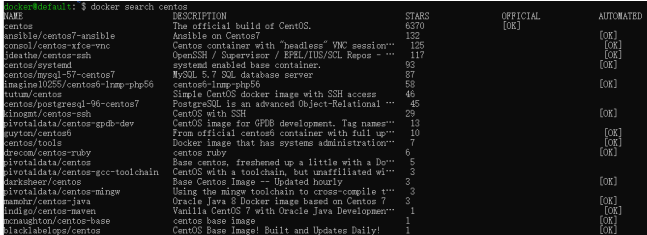

列含义：

| **NAME** | **DESCRIPTION** | **STARS**                       | **OFFICIAL**   | **AUTOMATED** |
| -------- | --------------- | ------------------------------- | -------------- | ------------- |
| 镜像名称 | 镜像描述        | 镜像热度，类似于github的 starts | 是否是官方发布 | 是否自动构建  |

####  push：把本地镜像推送到远程仓库  

 push可以把本地仓库中的镜像推送到远程仓库，不过需要先登录远程仓库  

 **push语法**

> **docker push [OPTIONS] NAME[:TAG]**
> **OPTIONS** ：可选参数 
>
> -  `--disable-content-trust` ：推送时远程仓库不校验签名，默认为true  
>
>  **NAME** ：镜像名称 
>  **TAG** ：镜像版本号，可省略，默认为latest  

```bash
docker push my-image:1.1.0
docker push my-image
```

####  pull：从远程仓库拉取或更新镜像  

 pull命令可以从远程仓库拉取镜像，如果本地仓库已经存在该镜像，则会更新

 **pull语法** 

> **docker pull [OPTIONS] NAME[:TAG|@DIGEST]**
> **OPTIONS** ：可选参数 
>
> -  `-a` : 拉取镜像的所有版本号 
> -  `--disable-content-trust` ：推送时远程仓库不校验签名，默认为 true 
> -  `-q` : 安静模式，推送过程中不展示详细信息  
>
> **NAME** ：镜像名称 
> **TAG** ：镜像版本号，可省略，默认为latest 
> **DIGEST** ： 镜像的摘要，每个镜像都有对应的名称、id、摘要信息，每个摘要信息能唯一代表一个镜像  

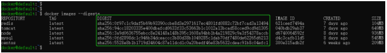

```bash
docker pull centos
docker pull -q centos:5.11
docker pull -a -q centos
```

###  操作本地镜像的命令  

####  images：显示所有镜像  

 images命令可以显示本地存在的所有镜像  

 **images语法**

> **docker images [OPTIONS] [REPOSITORY[:TAG]]** 
> **OPTIONS** ：可选参数 
>
> - `-a` : 显示所有镜像，包含中间映像（默认情况下中间映像是隐藏的） 
> - `-f` filter: 根据条件过滤镜像
>   -   docker images -f KEY=VALUE [REPOSITORY[:TAG]]  
>   -   KEY： 
>       - `dangling` boolean：过滤悬挂的镜像，如：dangling=true表示只显示悬挂的镜像 
>       - `label` string: 根据标签过滤，如：label=version表示显示有version标签的镜像，label=version=1.0 表示显示version=1.0的镜像 
>       - `before` image: 显示在某个镜像之前创建的镜像，如： before=centos:5.8表示显示在centos:5.8这个镜像之前创建的镜像 
>       - `since` image: 显示在某个 存在之后创建的镜像，如：since=centos:5.8表示显示在centos:5.8这个镜像存在之后的镜像 
>       - `reference` string：模糊匹配，如：reference=cent:5, 显示名称已cent开头版本号已5开头的 镜像  
> - `-q` : 只显示镜像id 
> - `no-trunc` ：显示完整的镜像id。默认情况下，镜 像的id只显示前12位，no-trunc参数会将镜像id完整的显示出来 
> - `--digests` ：显示镜像的摘要 信息 
> - `--format` string: 指定镜像显示的格式，格式详见下文  
>   -  docker images --format "[table] `{{COLUMN}}`[`{{COLUMN}}`...]" [REPOSITORY[:TAG]]  
>   -  `COLUMN`:
>      - ` .ID` ：显示镜像的名称列 
>      - `.Repository` ：显示镜像的描述列 
>      - `.Tag` ：显示镜像的热度一列 
>      - `.Digest` ：显示镜像是否是官方发布一列 
>      - `.CreatedSince` ：显示镜像是否是自动构建一列 
>      - `.CreatedAt` ：显示镜像是否是自动构建一列 
>      - `.Size` ：显示镜像是否是自动构建一列  
>
> **REPOSITORY** ：镜像路径 
> **TAG** ：镜像版本  

```bash
# 显示本地所有镜像
docker images
# 显示本地所有镜像，只显示id列并且不截断
docker images -q --no-trunc
# 显示centos镜像信息
docker images centos
# 显示列中包含cent关键字的所有镜像
docker images | grep cent
# 显示本地所有镜像，并显示摘要列
docker images --digests
# 显示在cengos:latest镜像之后创建的latest版本的所有镜像
docker images -f since=centos:latest -f reference=*:latest
# 显示所有镜像信息，只显示镜像id、摘要、创建时间3列，列之间用TAB键隔开
docker images --format "table {{.ID}}\t{{.Digest}}\t{{.CreatedAt}}"
# 显示在centos:5.11镜像之前创建的镜像，只显示镜像仓库路径、版本号、创建时间3列，列之间用TAB键隔开
docker images -f before=centos:5.11 --format "table {{.Repository}}\t{{.Tag}}\t{{.CreatedAt}}"
```

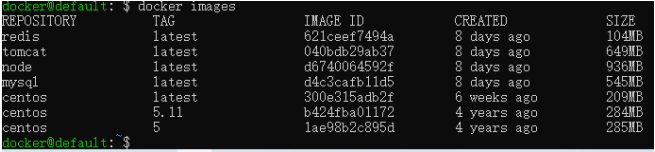

列含义：

| **REPOSITORY** | **TAG**  | **IMAGE ID** | **CREATED** | **SIZE** |
| -------------- | -------- | ------------ | ----------- | -------- |
| 仓库路径       | 镜像版本 | 镜像id       | 创建时间    | 镜像大小 |

####  rmi：删除本地镜像  

 rmi命令可以删除一个或多个本地镜像，通常情况应该用rm表示删除命令，但是在doker命令中rm 表示删除容     器，所以用rmi表示删除镜像，其中的 i 是image的首字母  

**rmi语法** 

> **docker rmi [OPTIONS] IMAGE [IMAGE...]**
> **OPTIONS** ：可选参数 
>
> -  `-f `: 强制删除，如果镜像有对应的容器正在运行，则不允许直接删除镜像，需要强制删除 
> -  `-- no-prune` ：不删除该镜像的过程镜像，默认是删除的  
>
> **IMAGE** ：镜像id或仓库路径名称  

```bash
# 删除centos镜像
docker rmi tomcat
# 删除centos:5.11镜像
docker rmi centos:5.11
# 删除id为621ceef7494a的镜像
docker rmi 621ceef7494a
# 同时删除tomcat、centos和redis镜像
docker rmi tomcat centos redis
# 强制删除tomcat镜像，就算此时有tomcat容器正在运行，镜像也会被删除
docker rmi -f tomcat
```

####  tag：标记镜像，将其归入仓库  

 `tag`命令可以基于一个镜像，创建一个新版本的镜像并归入本地仓库，此时该镜像在仓库中存在两个 版本，可以   根据这两个镜像创建不同的容器 

 **tag语法**

> **docker tag SOURCE_IMAGE[:TAG] TARGET_IMAGE[:TAG]**
> **SOURCE_IMAGE** : 原镜像 
> **TARGET_IMAGE** ：新镜像 
> **TAG** ：镜像的版本号  

```bash
# 基于redis:latest镜像创建my-redis1.0镜像，并把新镜像归入redis-lib仓库
docker tag redis:latest redis-lib/my-redis:1.0
# 基于621ceef7494a镜像创建my-redis:test-100m镜像，并把新镜像归入redis-lib仓库
docker tag 621ceef7494a redis-lib/my-redis:test-100m
```

####  history：查看镜像的创建历史  

 history命令用来查看某一个镜像的创建历史，也就是镜像的提交记录

 **history语法**

> **docker history [OPTIONS] IMAGE**
> **OPTIONS** ：可选参数
>
> -  `-H` boolean: 已可读的格式打印日期和大小，默认为true 
> -  `-q` : 只显示镜像id
> -  `no-trunc` ：输出 结果不截取，正常情况下查看到的结果如果某一列太长会被截取
> -  `--format` string: 指定镜像显示的格式
>    -    docker history --format "[table] `{{COLUMN}}`[`{{COLUMN}}`...]" IMAGE  
>    -    `COLUMN`
>         -  `.ID `：镜像的ID 
>         -  `.CreatedSince` ：镜像创建的时长 
>         -  `.CreatedAt` ：镜像创建的时间戳 
>         -  `.CreatedBy` ：镜像创建使用的命令
>         -  ` .Size` ：镜像的大小
>         -  ` .Comment` ：镜像的评论  
>
> **IMAGE** ：镜像  

```bash
# 显示centos镜像的创建历史
docker history centos
# 显示centos镜像的创建历史，时间和大小转换为人类可读的格式
docker history -H=true centos
# 显示centos镜像的创建历史，只显示ID、创建时间戳和创建时的命令3列，列之间使用TAB键隔开
docker history --format "table {{.ID}}\t{{.CreatedAt}}\t{{.CreatedBy}}" centos
```

####  save：将镜像打包成文件  

save命令可以把一个镜像或多个镜像打包到一个文件中，需要特别注意和export命令的区分 

- save命令打包的是镜像，包含镜像的所有信息 
- exprot命令打包的是容器，只是保存容器当时的快照，历史记录和元数据信息将会丢失  

**save语法** 

> **docker save [OPTIONS] IMAGE [IMAGE...]**
> **OPTIONS** ：可选参数
>
> -  `-o` string: 指定目标文件，和linux原生命令 > 有相同作用  
>
>  **IMAGE** ：镜像  

```bash
# 将centos镜像打包成my-images.tar
docker save centos > /home/my-images.tar
# 将centos镜像和redis镜像打包到my-images.tar
docker save centos redis > /home/my-images.tar
# 将centos镜像和redis镜像打包到my-images.tar
docker save -o /home/my-images.tar centos redis
```

####  load：从指定文件中加载镜像  

 load命令可以从指定文件中加载镜像，该文件需要是save命令保存的文件  

**load语法**

> **docker load [OPTIONS]**
> **OPTIONS** ：可选参数  
>
> -  `-i` string: 指定文件的路径 
> -  `-q` ：安静模式输出  

```bash
# 从my-images.tar文件中加载镜像
docker load < /home/my-images.tar
# 从my-images.tar文件中加载镜像
docker load -i /home/my-images.tar
# 使用安静模式从my-images.tar文件中加载镜像
docker load -i /home/my-images.tar -q
```

###  操作容器的命令  

####  run：创建一个容器并运行  

 run命令可以创建一个容器并运行，如果创建容器的镜像不存在则会从远程镜像仓库下载 

 运行容器的同时还能给容器发送一个命令  

 **run语法**

>  **docker run [OPTIONS] IMAGE [COMMAND] [ARG...]**
>  **OPTIONS** ：可选参数
>
>  -  `-i `: 以交互模式运行，通常与`-t`一起使用 
>  -  `-t` : 为容器分配一个伪终端，通常与`-i`一起使用
>  -  `-d` : 后台模式运行容器，并返回容器id
>  -  `-p` list: 指定端口映射，格式为 `宿主机端口:容器端口` 
>  -  `-P` : 随机分配端口映射 
>  -  `--name` string: 给容器指定一个名称
>  -  `-m` bytes: 限制容器可以使用的内存大 小，单位可选b、k、m、g
>  -  `-v` list: 把宿主机的磁盘路径挂载到容器的某个路径
>  -  `--volumes-from` list: 绑定别的容器某个路径到此容器的某个路径 
>  -  `-w` : 指定容器的工作目录，默认是根目录
>  -  `--rm` : 当容器停止运行时自动删除
>  -  `--hostname` string: 指定容器的主机名  
>
>   **IMAGE** ：镜像
>  **COMMAND** ：需要运行的命令
>  **ARG** ：命令的参数  

```bash
# 创建一个centos容器，并运行
docker run centos
# 创建一个centos容器，并以交互模式运行
docker run -it centos
# 创建一个centos容器，并后台模式运行
docker run -d centos
# 创建一个centos容器，重命名为my-centos，并以交互模式运行，并在容器中运行bash命令
docker run -it --name my-centos centos /bin/bash
# 创建一个spring-boot容器并以交互模式运行，容器重命名为my-boot，并把主机的80端口映射到容
# 器的8080端口，此时访问主机ip+80端口即可访问容器中的sping-boot项目
docker run -it --name my-boot -p 80:8080 spring-boot
# 创建一个spring-boot容器并以交互模式运行，容器重命名为my-boot，并把主机/logs/my-boot/的
# 目录绑定到容器的/logs目录，此时my-boot项目的日志可以在主机的/logs/my-boot目录中查看
docker run -it --name my-boot -v /logs/my-boot/:/logs/ spring-boot
# 创建一个spring-boot容器并以交互模式运行，容器重命名为my-boot；把主机的80端口映射到容器
# 的8080端口；把主机/logs/my-boot/的路径绑定到容器的/logs目录；给容器分配最大500M的内
# 存；指定spring-boot的配置文件为test
docker run -it --name my-boot -p 80:8080 -v /logs/my-boot/:/logs/ -m 500M spring-boot --spring.profiles.active=test
```

#### start：启动容器

start命令可以启动一个或多个已经停止的容器

**start语法**

> docker start [OPTIONS] CONTAINER [CONTAINER...]
>
> **OPTIONS** ：可选参数
>
> - -`a` : 将容器的标准输出或标准错误附加到终端 
> - `-i` : 为容器附加一个标准输入终端
>
> **CONTAINER** ：容器

~~~bash
# 启动已经停止的tomcat容器
docker start tomcat
# 启动已经停止的tomcat和centos容器
docker start tomcat centos
# 启动已经停止的my-spring-boot容器，并输出日志
docker start -a my-spring-boot
# 启动已经停止centos容器，并附加一个输入终端
docker start -i centos
~~~


#### restart：重启容器

restart可以对一个或多个容器进行重启。

如果容器是未启动的则会启动，如果是正在运行中的，则 会重启

**restart语法**

> docker restart [OPTIONS] CONTAINER [CONTAINER...]
>
> **OPTIONS** ：可选参数
>
> - `-t` int: 在重启之前等待几秒，默认10秒
>
> **CONTAINER** ：容器

~~~bash
# 重启centos容器
docker restart centos
# 20秒之后重启centos和tomcat容器，如果20秒内还未停止则直接杀死然后重启
docker restart -t 20 centos tomcat
~~~

#### stop：停止容器

`stop`命令可以停止一个或多个正在运行的容器 

`kill`命令也可以用来停止容器

不同的是：

- `stop`命令允许容器在停止之前有一定的时间来进行额外操作，如释放链接、关闭请求等 
- `kill`命令则会直接强制杀死容器

**stop语法**

> docker stop [OPTIONS] CONTAINER [CONTAINER...]
>
> **OPTIONS** ：可选参数
>
> - `-t` int: 等待n秒后如果还没停止，直接杀死，默认10秒
>
> **CONTAINER** ：容器

~~~bash
# 停止tomcat容器
docker stop tomcat
# 停止tomcat和centos容器
docker stop tomcat centos
# 停止tomcat容器，如果5秒内还未停止则直接杀死
docker stop -t 5 tomcat
~~~

#### kill：杀死容器

kill命令可以杀死一个或多个正在运行的容器

**kill语法**

> docker kill [OPTIONS] CONTAINER [CONTAINER...]
>
> **OPTIONS** ：可选参数
>
> - `-s` string: 给容器发送一个信号，信号编号和`linux`原生命令`kill`的信号编号一致，默认值9
>   - `1` ：杀死并重新加载，也可用 `HUP` 表示 
>   - `9` ：强制杀死，也可用 `KILL` 表示，默认值 
>   - `15` ：正 常停止，也可用 `TERM` 表示
>
> **CONTAINER** ：容器

~~~bash
# 杀死tomcat容器
docker kill tomcat
# 强制杀死tomcat容器
docker kill -s 9 tomcat
# 强制杀死tomcat容器
docker kill -s KILL tomcat
# 杀死tomcat和centos容器
docker kill tomcat centos
~~~

#### rm：删除容器

`rm`命令可以删除一个或多个容器 如果容器正在运行，则需要通过`-f`参数强制删除

**rm语法**

> docker rm [OPTIONS] CONTAINER [CONTAINER...]
>
> **OPTIONS** ：可选参数
>
> - `-f` ：强制删除，即使容器正在运行也可以删除 
> - `-l` ：删除容器之间的网络关系，而不是容器本 身
> - `-v` : 删除容器和它挂载的卷
>
> **CONTAINER** ：容器

~~~bash
# 删除centos容器
docker rm centos
# 强制删除centos容器，即使容器正在运行也会被删除
docker rm -f centos
# 删除centos容器，并删除它挂载的卷
docker rm -f centos
# 删除所有已经停止的容器
docker rm $(docker ps -a -q)
# 移除容器my-nginx对容器my-db的连接，连接名db
docker rm -l db 
~~~

#### pause：暂停容器

pause命令可以暂停一个或多个正在运行的容器

**pause语法**

> docker pause CONTAINER [CONTAINER...]
>
> **CONTAINER** ：容器

~~~bash
# 暂停正在运行的centos容器
docker pause centos
# 暂停正在运行的centos和tomcat容器
docker pause centos tomcat
~~~

#### unpause：取消暂停容器

`unpause`命令可以对一个或多个暂停的容器取消暂停 

**pause语法**

> docker unpause CONTAINER [CONTAINER...]
>
> **CONTAINER** ：容器

~~~bash
# 取消暂停的centos容器
docker unpause centos
# 取消暂停centos和tomcat容器
docker unpause centos tomcat
~~~


#### create：创建一个容器

`create`命令可以创建一个容器，但不运行它

在需要的时候可以使用`start`命令启动 和`run`命令的用法几乎一致，都会创建一个容器，如果容器依赖的镜像不存在都会从远程仓库拉取 

`run`命令创建容器后会运行容器 

`create`命令只是创建容器，不运行 

**create语法**

> docker create [OPTIONS] IMAGE [COMMAND] [ARG...]
>
> **OPTIONS** ：可选参数
>
> -  `create`命令和`run`命令的可选参数一样
>
> **IMAGE** ：镜像
>
> **COMMAND** ：需要运行的命令
>
> **ARG** ：命令的参数

~~~bash
# 创建一个centos容器
docker create centos
# 创建一个centos容器，start启动时以交互模式运行
docker create -it centos
# 创建一个centos容器，start启动时后台模式运行
docker create -d centos
# 创建一个centos容器，重命名为my-centos，start时以交互模式运行，并在容器中运行bash命令
docker create -it --name my-centos centos /bin/bash

# 创建一个spring-boot容器，重命名为my-boot，并把主机的80端口映射到容器的8080端口，start
# 时以交互模式运行，此时访问主机ip+80端口即可访问容器中的sping-boot项目
docker create -it --name my-boot -p 80:8080 spring-boot

# 创建一个spring-boot容器，容器重命名为my-boot，并把主机/logs/my-boot/的目录绑定到容器
# 的/logs目录，start时以交互模式运行，此时my-boot项目的日志可以在主机的/logs/my-boot目录
# 中查看
docker create -it --name my-boot -v /logs/my-boot/:/logs/ spring-boot

# 创建一个spring-boot容器，容器重命名为my-boot；把主机的80端口映射到容器的8080端口；把
# 主机/logs/my-boot/的路径绑定到容器的/logs目录；给容器分配最大500M的内存；指定spring-boot的配置文件为test；# start时以交互模式运行
docker create -it --name my-boot -p 80:8080 -v /logs/my-boot/:/logs/ -m 500M spring-boot --spring.profiles.active=test
~~~

#### exec：在容器中执行命令

exce命令可以在一个运行中的容器中执行一个命令 

**exec语法**

> docker exec [OPTIONS] CONTAINER COMMAND [ARG...]
>
> **OPTIONS** ：可选参数 
>
> - `-d` : 命令在后台运行 
> - -i ：保持标准输入，通常和 `-t` 一起使用 
> - `-t` : 分配一个伪终端，通常和 `- i` 一起使用 
> - `-w` string: 指定容器的路径
>
> **CONTAINER** ：容器 
>
> **COMMAND** ：要执行的命令 
>
> **ARG** ：命令的参数

~~~bash
# 在centos容器中运行pwd命令
docker exec centos pwd
# 为centos容器分配一个输入终端
docker exec -it centos /bin/bash
# 在centos镜像中的bin目录执行ls命令
docker exec -w /bin centos ls
~~~

#### ps：查看容器列表

ps命令可以列出所有容器的列表，查看容器的基本信息。

不加任何参数的情况下，默认只展示正在运行的容器

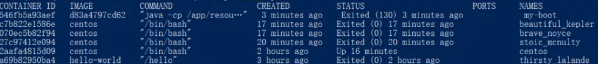

列含义如下

| CONTAINER ID | IMAGE       | COMMAND               | CREATED  | PORTS         | NAMES     |
| ------------ | ----------- | --------------------- | -------- | ------------- | --------- |
| 容器id       | 对应的镜 像 | 容器启动时运行的 命令 | 创建时间 | 绑定的的端 口 | 容器名 称 |

**ps语法**

> docker ps [OPTIONS]
>
> **OPTIONS** ：可选参数
>
> - `-a` : 显示所有容器，默认只显示正在运行的
> - `-f` filter: 根据条件过滤容器，语法如下
>   - docker ps -f KEY=VALUE
>   - KEY的可选值如下
>     - `id` : 根据容器id过滤 
>     - `name` : 查看容器名称中包含给定字段的容器 
>     - `exited` : 根据容器退出的错 误码进行过滤 
>     - `status` : 根据容器的状态进行过滤，状态可选值有：created、paused、 exited、dead、running、restarting、removing 
>     - `before` : 只显示在某个容器之前创建的容器 
>     - `since` : 只显示在某个容器之后创建的容器 
>     - `volume` : 过滤绑定了某个目录的容器，只针对运行 中的容器 
>     - `publish` : 根据宿主机端口过滤，只针对运行中的容器 
>     - `expose` : 根据容器端口过滤，只针对运行中的容器
> - `-n` int：显示最后创建的n个容器，包含所有状态 
> - `-l` : 显示最新创建的容器，包含所有状态 
>
> - `-q` : 只显示容器id 
> - `-s` : 显示容器大小，默认不显示该列 
> - `--no-trunc` ：显示内容不截断，默认情 况下显示的容器是截断后的信息

~~~bash
# 查看运行中的容器
docker ps
# 查看所有容器
docker ps -a
# 查看所有容器，并显示容器大小
docker ps -a -s
# 查看所有容器，显示内容不截断
docker ps -a --no-trunc
# 查看容器名称中包含cent的容器
docker ps -f name=cent
# 查看状态是created的容器
docker ps -f status=created
# 查看在centos之前创建的容器
docker ps -f before=centos
# 查看绑定了宿主机80端口并且正在运行的容器
docker ps -f publish=80
~~~

#### inspect：获取容器或镜像的元数据

`inspect`命令可以获取一个或多个容器或者镜像的元数据信息

元数据信息可以理解为容器或者镜像的详情，它比 `ps` 命令显示的内容要详细的多。

比如说端口映 射、挂载目录等，显示格式为`json`类型

**inspect语法**

> docker inspect [OPTIONS] CONTAINER|IMAGE [CONTAINER|IMAGE...]
>
> **OPTIONS** ：可选参数 
>
> `-f` string: 格式化输出结果，inspect默认显示整个文件的详情，-f参数可以指定只显示某些属 性 
>
> `--s` : 只对容器有效，显示容器的配置文件行数和大小，显示的结果中会多出`SizeRw`、 `SizeRootFs`两个参数 
>
> `--type` string: 指定要inspect的类型，container表示容器，image表示 镜像，默认是容器。
>
> 比如我有一个tomcat镜像，同时有一个名称为tomcat的容器，就可以用-- type参数来指定要inspect是tomcat容器还是tomcat镜像
>
> **CONTAINER** ：容器 
>
> **IMAGE** ：镜像

~~~bash
# 查看tomcat容器的元数据信息
docker inspect tomcat
# 查看tomcat镜像的元数据信息
docker inspect --type=image tomcat
# 查看tomcat容器的ip地址
docker inspect --format='{{range .NetworkSettings.Networks}}{{.IPAddress}}{{end}}'
tomcat
# 查看tomcat容器的ip地址
docker inspect tomcat | grep IPAddress
# 查看tomcat容器的端口映射
docker inspect -f "{{.HostConfig.PortBindings}}" tomcat
# 查看tomcat容器的挂载目录
docker inspect -f "{{.HostConfig.Binds}}" tomcat
~~~

#### stats：监控容器的资源使用情况

`stats`命令可以可以监控容器的资源使用情况，如`cpu`使用情况、内存使用情况等。

每秒刷新一次， 直到使用 `ctrl+c` 退出

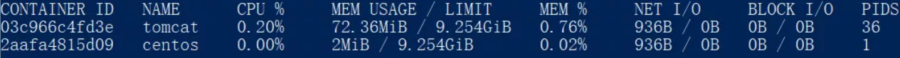

列含义如下

| CONTAINER ID | NAME      | CPU %         | MEM USAGE/LIMIT            | MEM %           | NET I/O | BLOCK I/O | PIDS                    |
| ------------ | --------- | ------------- | -------------------------- | --------------- | ------- | --------- | ----------------------- |
| 容器id       | 容器名 称 | cpu使用百分比 | 使用内存大小/ 最大可用内存 | 内存使用 百分比 | 网络 IO | 磁盘IO    | 容器内线程或 进程的数量 |

**stats语法**

> docker stats [OPTIONS] [CONTAINER...]
>
> **OPTIONS** ：可选参数
>
> - `-a` filter: 显示所有容器的资源使用情况，默认只显示正在运行的
> - `--format` string：格式化输 出结果 
> - `--no-stream` : 不间隔刷新，只显示第一次统计结果 
> - `--no-trunc` : 不截断显示信息，默认 情况下有些字段只显示简略信息，如容器id
>
>  **CONTAINER** ：容器

~~~bash
# 监控所有正在运行的容器的资源使用情况
docker stats
# 监控所有容器的资源使用情况，包含未启动的容器
docker stats -a
# 只监控centos容器的资源使用情况
docker stats centos
# 监控centos容器的资源使用情况，显示结果不刷新
docker stats --no-stream centos
~~~

#### top：查看容器中运行的进程信息

`top`可以查看容器的进程信息， `docker exec CONTAINER ps` 也可以查看容器的进程。 

不同的是：

- 前者查看的是容器运行在宿主机的进程id。
- 后者查看的是容器内的进程id

**top语法**

> docker top CONTAINER [ps OPTIONS]
>
> **CONTAINER** ：容器 
>
> **OPTIONS** ：ps命令的可选参数

~~~bash
# 查看centos镜像的宿主机进程id
docker top centos
~~~

#### rename：重命名容器

`rename`可以对容器进行重命名，在容器`run`时如果没有使用`--name`参数指定容器名称，可以使用 `rename`进行命名

**rename语法**

> docker rename CONTAINER NEW_NAME

~~~bash
# 将centos容器重命名为my-centos
docker rename centos my-centos
~~~

#### attach：连接到容器内

`attach`可以连接到容器内，这个容器必须是正在运行的容器，不是运行状态时，会报错 

当使用 `ctrl+c` 或 `exit` 等命令退出容器时，会导致容器停止运行。

所以，不建议在生产环境使用该命令。生产环境可以使用`exec`命令进入容器 

**attach语法**

> docker attach [OPTIONS] CONTAINER 
>
> **OPTIONS** ：可选参数
>
> `--sig-proxy=false` boolean: 默认`true`，为`false`时可以防止容器遇到 `ctrl+c` 退出信号时停止运行
>
> **CONTAINER** ：容器

~~~bash
# 进入正在运行的centos镜像内
docker attach centos
~~~

#### update：更新一个或多个容器的配置

update可以对容器的配置进行更新

**update语法**

> docker update [OPTIONS] CONTAINER [CONTAINER...]
>
> **OPTIONS** ：可选参数
>
> - `-m` bytes: 指定容器的内存大小，单位可选b、k、m、g 
> - `--memory-swap` bytes： 
> - -`-cpu demecial`：cpu资源，如1.5表示可以使用宿主机的1.5个cpu资源 
> - -`-cpuset-cpus` string：容器 可以使用宿主机的cpu内核编号， 0-3 表示4个内核都可以使用， 1,3 表示只能使用1和3号内 核 
> - `--restart` string: 指定容器的退出的重启策略。
>   - `no`：不重启；
>   - `on-failure`：容器非正常退出 时重启；
>   - `on-failure:3`：非正常退出时重启3次；
>   - `alaways`：总是重启；
>   - `unless-stopped`：在容 器退出时总是重启容器，但是不考虑在Docker守护进程启动时就已经停止了的容器 
> - `--pidslimit` int: 限制容器进程或线程的数量，默认-1表示不限制
>
>  **CONTAINER** ：容器

~~~bash
# 更新centos镜像的内存为2G
docker update --memory-swap -1 -m 2g centos
# 更新容器的重启策略
docker update --restart on-failure:3 centos
# 更新tomcat容器的最大线程数为2000
docker update --pids-limit 2000 tomcat
~~~

#### logs：查看容器的日志

**logs语法**

> docker logs [OPTIONS] CONTAINER
>
> **OPTIONS** ：可选参数
>
> - `-f` : 跟踪日志的实时输出 
> - `--until` string：查看某个时间点之前的日志，格式：2021-06- 03T19:30:20Z。或使用相对时间10m，表示10分钟之前 
> - `--since` string：查看某个时间点之 后的日志，格式：2021-06-03T19:30:20Z。使用相对时间10m，表示10分钟之内 
> - `-n` int: 查看 最后几行日志，默认显示全部 
> - `-t` : 日志中显示时间戳
>
> **CONTAINER** ：容器

~~~bash
# 查看tomcat最后10行日志
docker logs -n 10 tomcat
# 查看tomcat最后10行日志，并实时监控日志输出
docker logs -n 10 -f tomcat
# 查看最近10分钟的日志
docker logs --since 10m tomcat
# 查看6月3号9点到10点之间的日志
docker logs --since 2021-06-03T9:00:00 --until 2021-06-03T10:00:00 tomcat
~~~

#### wait：阻塞容器，直到容器退出并打印它的退出代码

wait命令可以阻塞一个或多个容器直到容器退出并打印出他们的退出代码

**wait语法**

> docker wait CONTAINER [CONTAINER...]
>
> **CONTAINER** ：容器

~~~bash
# 阻塞centos容器，直到它退出并打印退出状态码
docker wait centos
# 此时新打开一个终端，将centos容器stop掉，切换到wait的终端就可以看到打出一个状态码
~~~

#### port：列出端口的映射关系

**port语法**

> docker port CONTAINER [PRIVATE_PORT[/PROTO]]
>
> **CONTAINER** ：容器 
>
> **PRIVATE_PORT** ：容器端口 
>
> **PROTO** ：端口使用的协议

~~~bash
# 查看my-boot容器的端口映射
docker port my-boot
# 查看my-boot容器的8080端口映射的宿主机端口
docker port my-boot 8080
# 查看my-boot容器使用tcp协议的8080端口映射的宿主机端口
docker port my-boot 8080/tcp
~~~

#### export：将容器打包成一个文件

`export`命令可以将容器打包到一个文件中，它和`save`命令比较容易混淆 

`export`和`save`的不同之处在于：

- `save`打包的是镜像 
- `export`打包的是容器，是容器当时的快照，至于容器的历史记录和元数据信息都会丢失。还有，`export`的文件在被`import`成一个镜像时，可以重新指定镜像的名称和版本号

**export语法**

> docker export [OPTIONS] CONTAINER
>
> **OPTIONS** ：可选参数 
>
> - `-o` string: 指定打包文件
>
> **CONTAINER** ：容器

~~~bash
# 将my-boot容器打包到my-boot.tar文件
docker export -o /tmp/my-boot.tar my-boot
~~~

#### import：从本地文件或远程文件导入镜像到本地仓库 

`import`可以从本地文件或远程文件中导入镜像到本地仓库 

如果是从文件中导入，这个文件需要是`export`命令导出的文件 

**import语法**

> docker import [OPTIONS] file|URL|- [REPOSITORY[:TAG]] 
>
> **OPTIONS** ：可选参数 
>
> - `-m` string: 添加描述信息 
> - `-c` list: 对创建的容器使用dokerfile指令
>
> **file** ：文件地址 
>
> **URL** ：URL地址 
>
> **-**：从标准输入终端导入，通常和 linux中的cat命令一起使用 
>
> **REPOSITORY** ：本地镜像仓库地址 
>
> **TAG** ：镜像版本号

~~~bash
# 从my-boot.tar文件创建镜像
cat /tmp/my-boot.tar | docker import -
# 从my-boot.tar文件创建镜像
docker import /tmp/my-boot.tar
# 从my-boot.tar文件创建镜像，并指定镜像名称为my-boot-test、版本号为1.0
docker import /tmp/my-boot.tar my-boot-test:1.0
# 从my-boot.tar文件创建镜像，备注信息为测试，并指定镜像名称为my-boot-test、版本号为1.0
docker import --message '测试' /tmp/my-boot.tar my-boot-test:1.0
# 从远程服务器的my-boot.tar文件创建镜像
docker import http://192.168.100.1:8080/images/my-boot.tar
~~~


## 四、Dockerfile自定义镜像

常见的镜像在`DockerHub`就能找到，但是我们自己写的项目就必须自己构建镜像了。

而要自定义镜像，就必须先了解镜像的结构才行。

### 镜像结构

镜像是将应用程序及其需要的系统函数库、环境、配置、依赖打包而成。

我们以`MySQL`为例，来看看镜像的组成结构

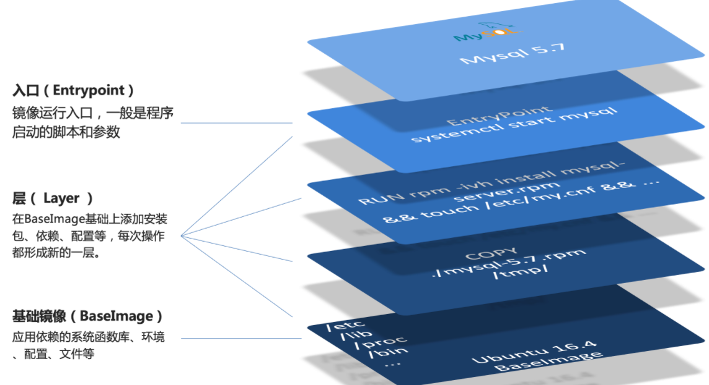

简单来说，镜像就是在系统函数库、运行环境基础上，添加应用程序文件、配置文件、依赖文件等组合，然后编写好启动脚本打包在一起形成的文件。

我们要构建镜像，其实就是实现上述打包的过程。

### Dockerfile语法

我们只需要告诉`Docker`，我们的镜像的组成，需要哪些`BaseImage`、需要拷贝什么文件、需要安装什么依赖、启动脚本是什么，将来`Docker`会帮助我们构建镜像。

**而描述上述信息的文件就是Dockerfile文件。**

**`Dockerfile`**就是一个文本文件，其中包含一个个的**指令(Instruction)**，用指令来说明要执行什么操作来构建镜像。每一个指令都会形成一层`Layer`。

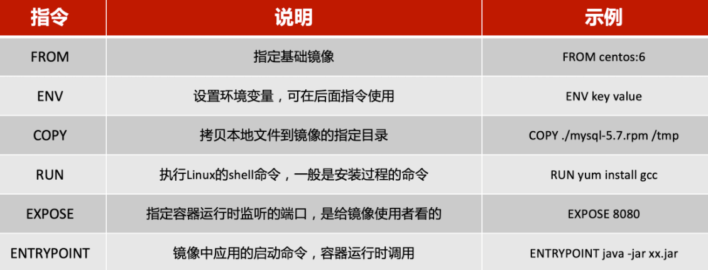

更新详细语法说明，请参考官网文档： [https://docs.docker.com/engine/reference/builder](https://docs.docker.com/engine/reference/builder)

### 构建Java项目

#### 基于Ubuntu构建Java项目

需求：基于Ubuntu镜像构建一个新镜像，运行一个java项目

- 步骤1：新建一个空文件夹 docker-demo
- 步骤2：拷贝Java的 `.jar`包文件到 docker-demo 这个目录
- 步骤3：拷贝jdk的压缩包 jdk8.tar.gz 文件到 docker-demo 这个目录
- 步骤4：编写`Dockerfile`文件到 docker-demo 这个目录

其中的内容如下：

```dockerfile
# 指定基础镜像
FROM ubuntu:16.04
# 配置环境变量，JDK的安装目录
ENV JAVA_DIR=/usr/local

# 拷贝jdk和java项目的包
COPY ./jdk8.tar.gz $JAVA_DIR/
COPY ./docker-demo.jar /tmp/app.jar

# 安装JDK
RUN cd $JAVA_DIR /
&& tar -xf ./jdk8.tar.gz / #解压
&& mv ./jdk1.8.0_144 ./java8 # 重命名

# 配置环境变量
ENV JAVA_HOME=$JAVA_DIR/java8
ENV PATH=$PATH:$JAVA_HOME/bin

# 暴露端口
EXPOSE 8090
# 入口，java项目的启动命令
ENTRYPOINT java -jar /tmp/app.jar
```

- 步骤5：进入 docker-demo 目录
- 步骤6：运行命令：

```bash
# . 表示 dockerfile 所在的目录 javaweb:1.0 构建完成的镜像名称
docker build -t javaweb:1.0 .

docker images

# 启动镜像
docker run --name web -p 8090:8090 -d javaweb:1.0
```

最后访问 [http://192.168.150.101:8090/hello/count](http://192.168.150.101:8090/hello/count)，其中的ip改成你的虚拟机ip

#### 基于Java8构建Java项目

大多数情况下，我们都可以在一些安装了部分软件的基础镜像上做改造。

例如，构建java项目的镜像，可以在已经准备了`JDK`的基础镜像基础上构建。

需求：基于java:8-alpine镜像，将一个Java项目构建为镜像

实现思路如下：

- ① 新建一个空的目录，然后在目录中新建一个文件，命名为 Dockerfile
- ② 拷贝`.jar`到这个目录中
- ③ 编写Dockerfile文件：
  - a ）基于java:8-alpine作为基础镜像
  - b ）将`app.jar`拷贝到镜像中
  - c ）暴露端口
  - d ）编写入口`ENTRYPOINT`

内容如下：

```dockerfile
FROM java:8-alpine
COPY ./app.jar /tmp/app.jar
EXPOSE 8090
ENTRYPOINT java -jar /tmp/app.jar
```

- ④ 使用docker build命令构建镜像

```dockerfile
docker build -t javaweb:2.0 .
```

- ⑤ 使用docker run创建容器并运行

小结：

1. Dockerfile的本质是一个文件，通过指令描述镜像的构建过程
2. Dockerfile的第一行必须是FROM，从一个基础镜像来构建
3. 基础镜像可以是基本操作系统，如Ubuntu。也可以是其他人制作好的镜像，例如：java:8-alpine


## 五、Docker-Compose

Docker Compose可以基于Compose文件帮我们快速的部署分布式应用，而无需手动一个个创建和运行容器！

### 初识DockerCompose

Compose文件是一个文本文件，通过指令定义集群中的每个容器如何运行。

将 `docker run` 中的所有参数转换为 `Compose` 形式

```json
version: "3.8"

services:
	mysql: // 对应 --name
		image: mysql:5.7.25 // 对应镜像名称
		environment: // 对应 -e
			MYSQL_ROOT_PASSWORD: 123 
		volumes: // 对应 -v
			- "/tmp/mysql/data:/var/lib/mysql"
			- "/tmp/mysql/conf/hmy.cnf:/etc/mysql/conf.d/hmy.cnf"
	web:
		build: .
		ports:
			- "8090:8090"

```

对应👇👇👇

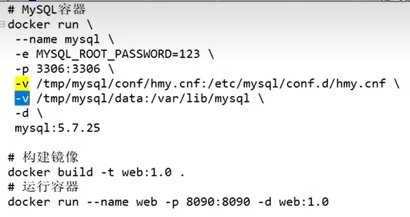

上面的Compose文件就描述一个项目，其中包含两个容器：

- mysql：一个基于mysql:5.7.25镜像构建的容器，并且挂载了两个目录
- web：一个基于docker build临时构建的镜像容器，映射端口时8090

> DockerCompose的详细语法参考官网：[https://docs.docker.com/compose/compose-file/](https://docs.docker.com/compose/compose-file/)

> 其实DockerCompose文件可以看做是将多个`docker run`命令写到一个文件，只是语法稍有差异。

### 部署微服务集群

**实现思路**：

①编写`compose`文件

②修改自己的微服务项目，将数据库、`nacos`地址都命名为`docker-compose`中的服务名

③使用maven打包工具，将项目中的每个微服务都打包为 `.jar`

④将打包好的`.jar`拷贝到自己微服务项目中的每一个对应的子目录中

⑤将自己的微服务项目上传至虚拟机，利用 `docker-compose up -d` 来部署

#### compose文件

假设现在有如下几个服务需要部署

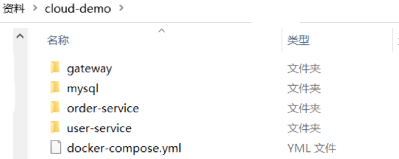

内容如下：

```yaml
version: "3.2"

services:
  nacos:
    image: nacos/nacos-server
    environment:
      MODE: standalone
    ports:
      - "8848:8848"
  mysql:
    image: mysql:5.7.25
    environment:
      MYSQL_ROOT_PASSWORD: 123
    volumes:
      - "$PWD/mysql/data:/var/lib/mysql"
      - "$PWD/mysql/conf:/etc/mysql/conf.d/"
  userservice:
    build: ./user-service
  orderservice:
    build: ./order-service
  gateway:
    build: ./gateway
    ports:
      - "10010:10010"
```

可以看到，其中包含5个service服务：

- nacos：作为注册中心和配置中心
  - image: nacos/nacos-server： 基于nacos/nacos-server镜像构建
  - environment：环境变量
    - MODE: standalone：单点模式启动
  - ports：端口映射，这里暴露了8848端口
- mysql：数据库
  - image: mysql:5.7.25：镜像版本是mysql:5.7.25
  - environment：环境变量
    - MYSQL_ROOT_PASSWORD: 123：设置数据库root账户的密码为123
  - volumes：数据卷挂载，这里挂载了mysql的data、conf目录，其中有我提前准备好的数据
- userservice、orderservice、gateway：都是基于Dockerfile临时构建的

#### 修改微服务配置

因为微服务将来要部署为`docker`容器，而容器之间互联不是通过`IP`地址，而是通过容器名。这里我们将order-service、user-service、gateway服务的mysql、nacos地址都修改为基于容器名的访问。如下所示：

```yaml
spring:
  datasource:
    url: jdbc:mysql://mysql:3306/cloud_order?useSSL=false
    username: root
    password: 123
    driver-class-name: com.mysql.jdbc.Driver
  application:
    name: orderservice
  cloud:
    nacos:
      server-addr: nacos:8848 # nacos服务地址
```

#### 打包

接下来需要将我们的每个微服务都打包。因为之前查看到`Dockerfile`中的`jar`包名称都是`app.jar`，因此我们的每个微服务都需要用这个名称。

可以通过修改`pom.xml`中的打包名称来实现，每个微服务都需要修改

```xml
<build>
  <!-- 服务打包的最终名称 -->
  <finalName>app</finalName>
  <plugins>
    <plugin>
      <groupId>org.springframework.boot</groupId>
      <artifactId>spring-boot-maven-plugin</artifactId>
    </plugin>
  </plugins>
</build>
```

打包后：

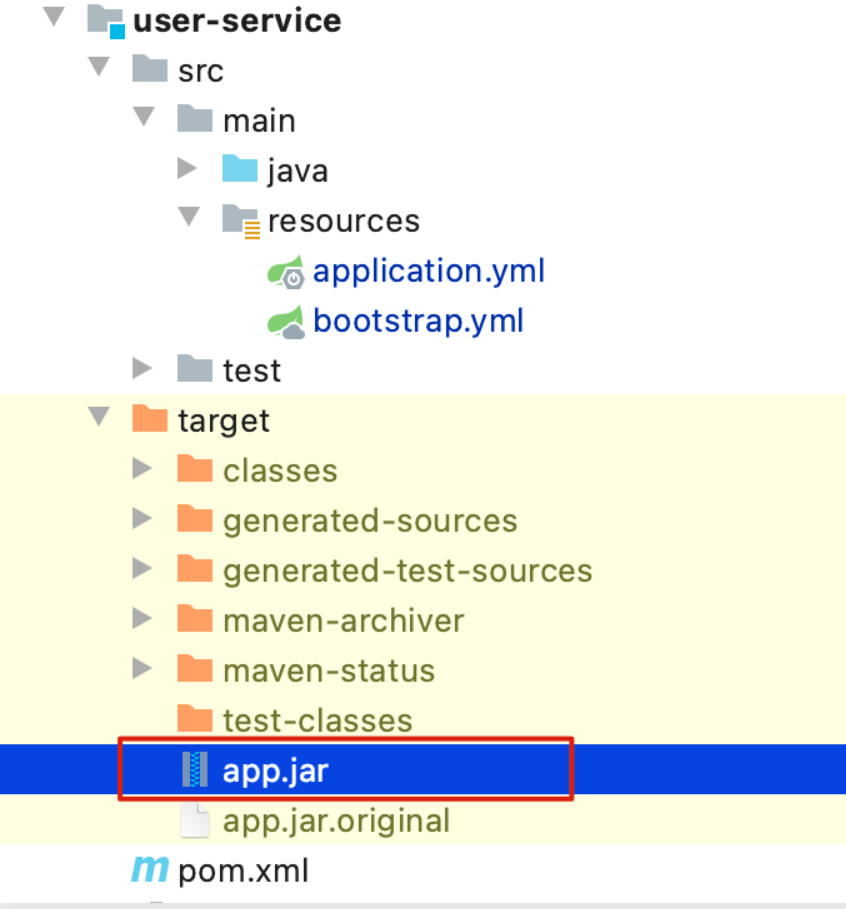

#### 拷贝jar包到部署目录

编译打包好的`app.jar`文件，需要放到`Dockerfile`的同级目录中。

> 注意：每个微服务的`app.jar`放到与服务名称对应的目录，别搞错了

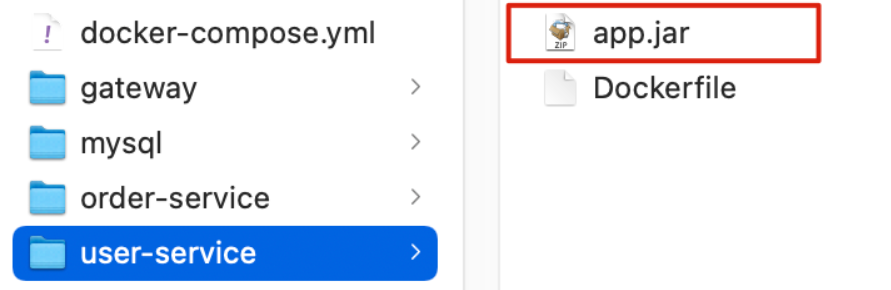

#### 部署

最后，我们需要将整个项目文件夹上传到虚拟机中，利用`DockerCompose`部署。

上传到任意目录：

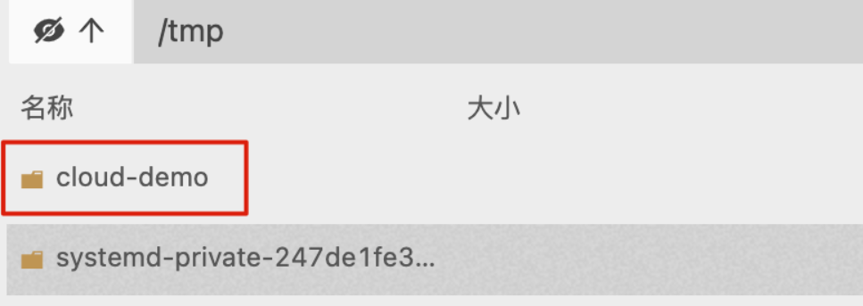

部署：

进入项目目录，然后运行下面的命令：

```bash
docker-compose up -d
```


## 六、Docker镜像仓库

搭建镜像仓库可以基于`Docker`官方提供的`DockerRegistry`来实现。

官网地址：[https://hub.docker.com/_/registry](https://hub.docker.com/_/registry)

### 搭建私有镜像仓库

#### 简化版镜像仓库

`Docker`官方的`Docker Registry`是一个基础版本的`Docker`镜像仓库，具备仓库管理的完整功能，但是没有图形化界面。

搭建方式比较简单，命令如下

```bash
docker run -d \
    --restart=always \
    --name registry	\
    -p 5000:5000 \
    -v registry-data:/var/lib/registry \
    registry
```

命令中挂载了一个数据卷`registry-data`到容器内的`/var/lib/registry` 目录，这是私有镜像库存放数据的目录。

访问[http://YourIp:5000/v2/_catalog](http://YourIp:5000/v2/_catalog) 可以查看当前私有镜像服务中包含的镜像

#### 带有图形化界面版本

使用`DockerCompose`部署带有图象界面的`DockerRegistry`

```bash
version: '3.0'
services:
  registry:
    image: registry
    volumes:
      - ./registry-data:/var/lib/registry
  ui:
    image: joxit/docker-registry-ui:static
    ports:
      - 8080:80
    environment:
      - REGISTRY_TITLE=我的私有仓库
      - REGISTRY_URL=http://registry:5000
    depends_on:
      - registry
```

#### 配置Docker信任地址

我们的私服采用的是`http`协议，默认不被`Docker`信任，所以需要做一个配置：

```bash
# 打开要修改的文件
vi /etc/docker/daemon.json
# 添加内容：
"insecure-registries":["http://192.168.150.101:8080"]
# 重加载
systemctl daemon-reload
# 重启docker
systemctl restart docker
```

#### 推送、拉取镜像

推送镜像到私有镜像服务必须先`tag`

① 重新`tag`本地镜像，名称前缀为私有仓库的地址：192.168.150.101:8080/

```bash
docker tag nginx:latest 192.168.150.101:8080/nginx:1.0 
```

② 推送镜像

```bash
docker push 192.168.150.101:8080/nginx:1.0 
```

③ 拉取镜像

```bash
docker pull 192.168.150.101:8080/nginx:1.0 
```


