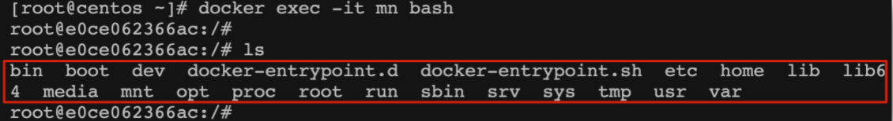
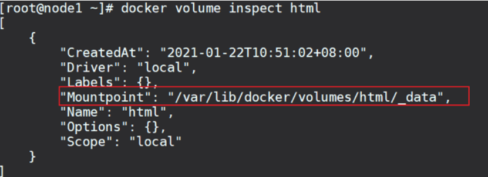
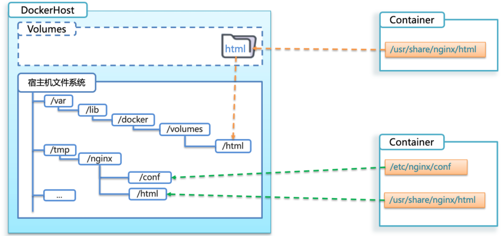

# 目录

[[toc]]

## Docker基本操作

### 镜像操作
####  镜像名称
首先来看下镜像的名称组成：

- 镜名称一般分两部分组成：[repository]:[tag]。
- 在没有指定tag时，默认是latest，代表最新版本的镜像


####  镜像命令
常见的镜像操作命令如图


```bash
# 拉取镜像
docker pull nginx

# 查看拉取到的镜像
docker images

# 导出镜像到磁盘 docker save -o [保存的目标文件名称] [镜像名称]
docker save -o nginx.tar nginx:latest

# 删除本地的 nginx 镜像
docker rmi nginx:latest

# 加载本地压缩包为镜像
docker load -i nginx.tar

```
### 容器操作
#### 容器相关命令


容器保护三个状态：

- 运行：进程正常运行
- 暂停：进程暂停，CPU不再运行，并不释放内存
- 停止：进程终止，回收进程占用的内存、CPU等资源

其中：

- docker run：创建并运行一个容器，处于运行状态
- docker pause：让一个运行的容器暂停
- docker unpause：让一个容器从暂停状态恢复运行
- docker stop：停止一个运行的容器
- docker start：让一个停止的容器再次运行
- docker rm：删除一个容器

```bash
# 创建并运行nginx容器的命令
# --name 给容器起个名 -p 端口映射 -d 后台运行 nginx 镜像名称
docker run --name mynginx -p 80:80 -d nginx

# 进入Nginx容器，修改HTML文件内容，添加“Nginx欢迎您”
# -it 给当前进入的容器创建一个标准输入、输出终端，允许我们与容器交互 bash linux终端交互命令
docker exec -it mynginx bash
cd /usr/share/nginx/html
# 容器内没有vi命令，无法直接修改，我们用下面的命令来修改
sed -i -e 's#Welcome to nginx#Nginx欢迎您#g' -e 's#<head>#<head><meta charset="utf-8">#g' index.html
```
容器内部会模拟一个独立的Linux文件系统，看起来如同一个linux服务器一样



nginx的环境、配置、运行文件全部都在这个文件系统中，包括我们要修改的html文件。

查看DockerHub网站中的nginx页面，可以知道nginx的html目录位置在/usr/share/nginx/html

### 数据卷
**数据卷（volume）** 是一个虚拟目录，指向宿主机文件系统中的某个目录。

**作用**：将数据与容器解耦，这就要用到数据卷了。

在之前的nginx案例中，修改nginx的html页面时，需要进入nginx内部。并且因为没有编辑器，修改文件也很麻烦。

这就是因为容器与数据（容器内文件）耦合带来的后果。


一旦完成数据卷挂载，对容器的一切操作都会作用在数据卷对应的宿主机目录了。

这样，我们操作宿主机的/var/lib/docker/volumes/html目录，就等于操作容器内的/usr/share/nginx/html目录了


#### 数据卷命令
```bash
docker volume [COMMAND]
```
docker volume命令是数据卷操作，根据命令后跟随的command来确定下一步的操作：

- create 创建一个volume
- inspect 显示一个或多个volume的信息
- ls 列出所有的volume
- prune 删除未使用的volume
- rm 删除一个或多个指定的volume
#### 创建和查看数据卷
```bash
# 创建名为 html 的数据卷
docker volume create html

# 查看所有数据
docker volume ls

# 查看 html 数据卷详细信息卷
docker volume inspect html
```
可以看到，我们创建的html这个数据卷关联的宿主机目录为/var/lib/docker/volumes/html/_data目录
#### 挂载数据卷
我们在创建容器时，可以通过 -v 参数来挂载一个数据卷到某个容器内目录
```bash
docker run /
  --name mn /
  -v html:/root/html /
  -p 8080:80
  nginx /
```
这里的-v就是挂载数据卷的命令：

- -v html:/root/htm ：把html数据卷挂载到容器内的/root/html这个目录中
```bash
# 创建一个nginx容器，修改容器内的html目录内的index.html内容
# 上个案例中，我们进入nginx容器内部，已经知道nginx的html目录所在位置/usr/share/nginx/html ，我们需要把这个目录挂载到html这个数据卷上，方便操作其中的内容

# 创建容器并挂载数据卷到容器内的HTML目录
docker run --name mynginx -p 80:80 -v html:/usr/share/nginx/html -d nginx

# 进入html数据卷所在位置，并修改HTML内容
# 查看html数据卷的位置
docker volume inspect html
# 进入该目录
cd /var/lib/docker/volumes/html/_data
# 修改文件
vi index.html
```

容器不仅仅可以挂载数据卷，也可以直接挂载到宿主机目录上。关联关系如下：

- 带数据卷模式：宿主机目录 --> 数据卷 ---> 容器内目录
- 直接挂载模式：宿主机目录 ---> 容器内目录



语法：

目录挂载与数据卷挂载的语法是类似的：

- -v [宿主机目录]:[容器内目录]
- -v [宿主机文件]:[容器内文件]
