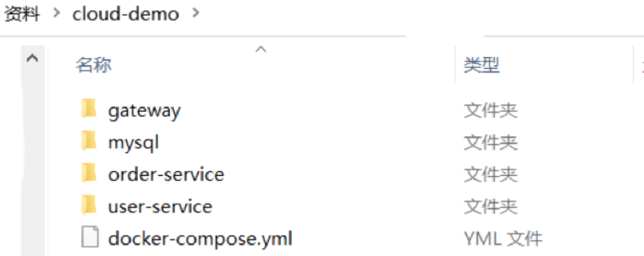
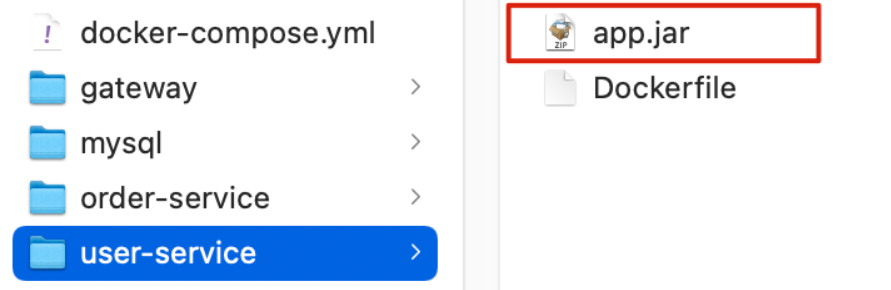

# 目录

[[toc]]

# Docker-Compose

Docker Compose可以基于Compose文件帮我们快速的部署分布式应用，而无需手动一个个创建和运行容器！
## 初识DockerCompose
Compose文件是一个文本文件，通过指令定义集群中的每个容器如何运行。

将 `docker run` 中的所有参数转换为 `Compose` 形式

```json
version: "3.8"

services:
	mysql: // 对应 --name
		image: mysql:5.7.25 // 对应镜像名称
		environment: // 对应 -e
			MYSQL_ROOT_PASSWORD: 123 
		volumes: // 对应 -v
			- "/tmp/mysql/data:/var/lib/mysql"
			- "/tmp/mysql/conf/hmy.cnf:/etc/mysql/conf.d/hmy.cnf"
	web:
		build: .
		ports:
			- "8090:8090"

```
对应👇👇👇


上面的Compose文件就描述一个项目，其中包含两个容器：

- mysql：一个基于mysql:5.7.25镜像构建的容器，并且挂载了两个目录
- web：一个基于docker build临时构建的镜像容器，映射端口时8090

> DockerCompose的详细语法参考官网：[https://docs.docker.com/compose/compose-file/](https://docs.docker.com/compose/compose-file/)

> 其实DockerCompose文件可以看做是将多个`docker run`命令写到一个文件，只是语法稍有差异。

## 部署微服务集群
**实现思路**：

①编写`compose`文件

②修改自己的微服务项目，将数据库、`nacos`地址都命名为`docker-compose`中的服务名

③使用maven打包工具，将项目中的每个微服务都打包为 `.jar`

④将打包好的`.jar`拷贝到自己微服务项目中的每一个对应的子目录中

⑤将自己的微服务项目上传至虚拟机，利用 `docker-compose up -d` 来部署

### compose文件

假设现在有如下几个服务需要部署



内容如下：

```yaml
version: "3.2"

services:
  nacos:
    image: nacos/nacos-server
    environment:
      MODE: standalone
    ports:
      - "8848:8848"
  mysql:
    image: mysql:5.7.25
    environment:
      MYSQL_ROOT_PASSWORD: 123
    volumes:
      - "$PWD/mysql/data:/var/lib/mysql"
      - "$PWD/mysql/conf:/etc/mysql/conf.d/"
  userservice:
    build: ./user-service
  orderservice:
    build: ./order-service
  gateway:
    build: ./gateway
    ports:
      - "10010:10010"
```
可以看到，其中包含5个service服务：

- nacos：作为注册中心和配置中心
   - image: nacos/nacos-server： 基于nacos/nacos-server镜像构建
   - environment：环境变量
      - MODE: standalone：单点模式启动
   - ports：端口映射，这里暴露了8848端口
- mysql：数据库
   - image: mysql:5.7.25：镜像版本是mysql:5.7.25
   - environment：环境变量
      - MYSQL_ROOT_PASSWORD: 123：设置数据库root账户的密码为123
   - volumes：数据卷挂载，这里挂载了mysql的data、conf目录，其中有我提前准备好的数据
- userservice、orderservice、gateway：都是基于Dockerfile临时构建的

### 修改微服务配置
因为微服务将来要部署为`docker`容器，而容器之间互联不是通过`IP`地址，而是通过容器名。这里我们将order-service、user-service、gateway服务的mysql、nacos地址都修改为基于容器名的访问。如下所示：
```yaml
spring:
  datasource:
    url: jdbc:mysql://mysql:3306/cloud_order?useSSL=false
    username: root
    password: 123
    driver-class-name: com.mysql.jdbc.Driver
  application:
    name: orderservice
  cloud:
    nacos:
      server-addr: nacos:8848 # nacos服务地址
```
### 打包
接下来需要将我们的每个微服务都打包。因为之前查看到`Dockerfile`中的`jar`包名称都是`app.jar`，因此我们的每个微服务都需要用这个名称。

可以通过修改`pom.xml`中的打包名称来实现，每个微服务都需要修改

```xml
<build>
  <!-- 服务打包的最终名称 -->
  <finalName>app</finalName>
  <plugins>
    <plugin>
      <groupId>org.springframework.boot</groupId>
      <artifactId>spring-boot-maven-plugin</artifactId>
    </plugin>
  </plugins>
</build>
```
打包后：


### 拷贝jar包到部署目录
编译打包好的`app.jar`文件，需要放到`Dockerfile`的同级目录中。

> 注意：每个微服务的`app.jar`放到与服务名称对应的目录，别搞错了



### 部署
最后，我们需要将整个项目文件夹上传到虚拟机中，利用`DockerCompose`部署。

上传到任意目录：


部署：

进入项目目录，然后运行下面的命令：

```bash
docker-compose up -d
```
