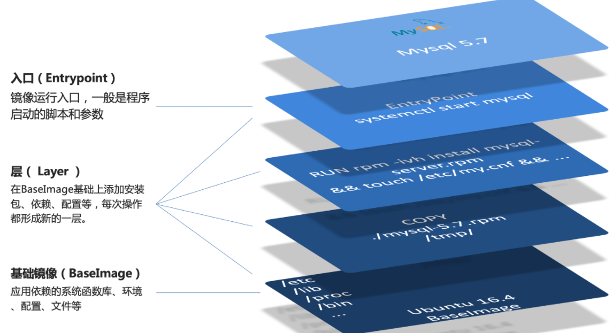

# 目录

[[toc]]

# Dockerfile自定义镜像

常见的镜像在`DockerHub`就能找到，但是我们自己写的项目就必须自己构建镜像了。

而要自定义镜像，就必须先了解镜像的结构才行。

## 镜像结构

镜像是将应用程序及其需要的系统函数库、环境、配置、依赖打包而成。

我们以`MySQL`为例，来看看镜像的组成结构



简单来说，镜像就是在系统函数库、运行环境基础上，添加应用程序文件、配置文件、依赖文件等组合，然后编写好启动脚本打包在一起形成的文件。

我们要构建镜像，其实就是实现上述打包的过程。

## Dockerfile语法
我们只需要告诉`Docker`，我们的镜像的组成，需要哪些`BaseImage`、需要拷贝什么文件、需要安装什么依赖、启动脚本是什么，将来`Docker`会帮助我们构建镜像。

**而描述上述信息的文件就是Dockerfile文件。**

**`Dockerfile`**就是一个文本文件，其中包含一个个的**指令(Instruction)**，用指令来说明要执行什么操作来构建镜像。每一个指令都会形成一层`Layer`。


更新详细语法说明，请参考官网文档： [https://docs.docker.com/engine/reference/builder](https://docs.docker.com/engine/reference/builder)

## 构建Java项目
### 基于Ubuntu构建Java项目
需求：基于Ubuntu镜像构建一个新镜像，运行一个java项目

- 步骤1：新建一个空文件夹 docker-demo
- 步骤2：拷贝Java的 `.jar`包文件到 docker-demo 这个目录
- 步骤3：拷贝jdk的压缩包 jdk8.tar.gz 文件到 docker-demo 这个目录
- 步骤4：编写`Dockerfile`文件到 docker-demo 这个目录

其中的内容如下：
```dockerfile
# 指定基础镜像
FROM ubuntu:16.04
# 配置环境变量，JDK的安装目录
ENV JAVA_DIR=/usr/local

# 拷贝jdk和java项目的包
COPY ./jdk8.tar.gz $JAVA_DIR/
COPY ./docker-demo.jar /tmp/app.jar

# 安装JDK
RUN cd $JAVA_DIR /
&& tar -xf ./jdk8.tar.gz / #解压
&& mv ./jdk1.8.0_144 ./java8 # 重命名

# 配置环境变量
ENV JAVA_HOME=$JAVA_DIR/java8
ENV PATH=$PATH:$JAVA_HOME/bin

# 暴露端口
EXPOSE 8090
# 入口，java项目的启动命令
ENTRYPOINT java -jar /tmp/app.jar
```

- 步骤5：进入 docker-demo 目录
- 步骤6：运行命令：
```bash
# . 表示 dockerfile 所在的目录 javaweb:1.0 构建完成的镜像名称
docker build -t javaweb:1.0 .

docker images

# 启动镜像
docker run --name web -p 8090:8090 -d javaweb:1.0
```
最后访问 [http://192.168.150.101:8090/hello/count](http://192.168.150.101:8090/hello/count)，其中的ip改成你的虚拟机ip
### 基于Java8构建Java项目
大多数情况下，我们都可以在一些安装了部分软件的基础镜像上做改造。

例如，构建java项目的镜像，可以在已经准备了`JDK`的基础镜像基础上构建。

需求：基于java:8-alpine镜像，将一个Java项目构建为镜像

实现思路如下：

- ① 新建一个空的目录，然后在目录中新建一个文件，命名为 Dockerfile
- ② 拷贝`.jar`到这个目录中
- ③ 编写Dockerfile文件：
   - a ）基于java:8-alpine作为基础镜像
   - b ）将`app.jar`拷贝到镜像中
   - c ）暴露端口
   - d ）编写入口`ENTRYPOINT`

内容如下：
```dockerfile
FROM java:8-alpine
COPY ./app.jar /tmp/app.jar
EXPOSE 8090
ENTRYPOINT java -jar /tmp/app.jar
```

- ④ 使用docker build命令构建镜像
```dockerfile
docker build -t javaweb:2.0 .
```

- ⑤ 使用docker run创建容器并运行

小结：

1. Dockerfile的本质是一个文件，通过指令描述镜像的构建过程
2. Dockerfile的第一行必须是FROM，从一个基础镜像来构建
3. 基础镜像可以是基本操作系统，如Ubuntu。也可以是其他人制作好的镜像，例如：java:8-alpine
