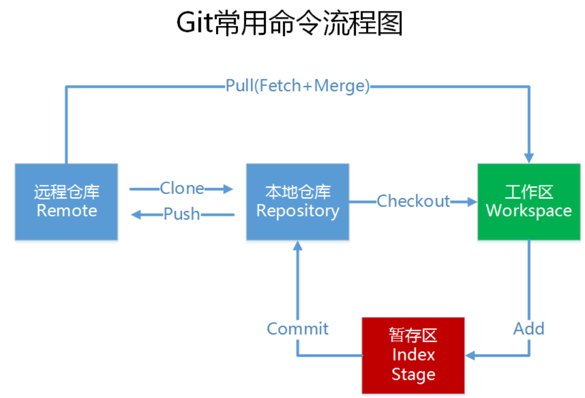

# 目录
**命令比较多，建议使用 CTRL + F 进行搜索**
[[toc]]

# Git常用命令



> 本地仓库：是在开发人员自己电脑上的Git仓库,存放我们的代码(.git 隐藏文件夹就是我们的本地仓库)		
>
> 远程仓库：是在远程服务器上的Git仓库,存放代码(可以是github.com或者gitee.com 上的仓库,或者自己该公司的服务器)
>
> 工作区: 我们自己写代码(文档)的地方
>
> 暂存区: 在 本地仓库中的一个特殊的文件(index) 叫做暂存区,临时存储我们即将要提交的文件
>
> ------------
>
> Clone：克隆，就是将远程仓库复制到本地仓库
>
> Push：推送，就是将本地仓库代码上传到远程仓库
>
> Pull：拉取，就是将远程仓库代码下载到本地仓库,并将代码 克隆到本地工作区

## 配置Git
```git
# 用户名
git config --global user.name "Your Name"

# 邮箱
git config --global user.email "email@example.com"

# 颜色
git config --global color.ui true
```
## 初始化
```git
# 创建项目文件夹
mkdir project

# 进入到文件夹里
cd project

# 初始化Git
git init
```
## 克隆代码
```git
git clone https://github.com/username/xxxx.git
或
git clone git@github.com:username/xxxx.git
```
## 克隆指定分支代码
```git
git clone -b 分支名 仓库地址
```
## 关联远程仓库
```git
git remote add origin 仓库地址
```
> origin 可以自己起名

## 查看远程仓库连接信息(fetch抓取，push推送)

```git
# 查看远程仓库连接信息(fetch抓取，push推送)
git remote -v
```
## 拉取代码
```git
git pull
```
## 工作空间操作
```git
git stash

# 查看保存的修改
git stash list

# 从保存的修改恢复（不会删除）
git stash apply 

# 若存在多个保存的工作空间(n为序号0开始，不会删除)
git stash apply stash@{n} 

# 删除保存的修改
git stash drop

# 若存在多个保存的工作空间(n为序号0开始)
git stash drop stash@{n} 

# 从保存的修改恢复并删除保存的修改
git stash pop

# 若存在多个保存的工作空间(n为序号0开始)
git stash pop stash@{n} 
```
## 分支操作
```git
# 创建分支
git branch 分支名

# 查看分支
git branch

# 查看所有分支 本地+远程，远程分支会以红色标出，当前分支前面会标一个`*`号
git branch -a

# 切换分支
# 老版本
git checkout 分支名
# 新版本
git switch 分支名

# 创建分支并切换
# 老版本
git checkout -b 分支名
# 新版本
git switch -c 分支名

# 删除分支
git branch -d 分支名

# 强行删除分支
git branch -D 分支名
```
## 撤销操作
```git
# 撤销到最近一次`git add`或`git commit`之前的状态
git checkout -- 文件名

# 撤销暂存区的修改(`git commit`之前)
git reset HEAD 文件名
```
## 标签操作
```git
# 打标签
git tag v1.0 commit的id(不加则为之后的commit添加标签)
git tag -a v1.0 -m "提交备注" commit的id(不加则为之后的commit添加标签)

# 查看所有标签
git tag

# 查看标签信息
git show v1.0

# 推送某个标签到远程
git push origin v1.0

# 推送全部尚未推送的标签
git push origin --tags

# 删除本地标签
git tag -d v0.1

# 删除远程标签
git push origin :refs/tags/v1.0
```
## 将其他分支上的提交应用到当前分支
```git
git cherry-pick commit的编号
```
## 将本地分支与远程分支关联
```git
git branch --set-upstream-to 分支名 origin/分支名
```
## 将修改添加到暂存区
```git
# 将修改添加到暂存区
git add 文件名

# -f 为强制添加，可提交.gitignore中配置的文件
git add -f 文件名

# 将所有文件添加到暂存区
git add .

# 提交暂存区内容
# -m 添加提交备注
# git commit 之前需先 git add .  , commit 只负责提交暂存区的内容
git commit -m "提交备注"

# 查看刚才提交了什么
git show		或		git log -n1 -p
```
## 提交暂存区内容
```git
# -m 添加提交备注
# git commit 之前需先 git add，commit 只负责提交暂存区的内容
git commit -m "提交备注"
```
## 查看当前仓库状态
```git
# 可以查看本地仓库与远程仓库内容不一样的文件
git status
```
## 对比文件改动内容
```git
git diff 文件名
```
## 查看Git日志
```git
# 如果想看到其它分支的提交记录需要先 git pull 一下
git log
```
## 推送到远程库
```git
# 默认推送到当前所在分支
git push origin 分支名
```
## 删除文件
```git
# 确定删除需要`git commit`，若误删可以使用`git checkout -- 文件名`
git rm 文件名
```
## 版本回退到第N个版本前
```git
git reset --hard HEAD~N
```
## 版本回退(切换)到指定版本
```git
# git每次提交的唯一十六进制的id，`git log`或者`git reflog`(记录每次一提交的信息)可以查看
git reset --hard e475afc93c209a690c39c13a46716e8fa000c366(版本号，
这只是个例子，此值不必写全，只要能让git知道是哪个把那本就行，一般写5-6位即可)
```
## 合并某分支到当前分支
```git
# 若存在冲突会提示手动修改后再提交，`git merge`默认为`fast forward`模式

# `fast forward`模式
git merge 其他分支名

# 禁用`Fast forward`模式(`--no-ff`) **推荐**
git merge --no-ff -m "提交备注" 其他分支名

# 用`git log --graph --pretty=oneline --abbrev-commit`命令可以看到分支合并图
```
## 把本地未push的分叉提交历史整理成直线
```git
git rebase
# rebase的目的是使得我们在查看历史提交的变化时更容易，因为分叉的提交需要三方对比
```
## 同一套代码关联多个远程库(同时关联github和gitee为例)
```git
# 关联GitHub的远程库
git remote add github git@github.com:username/xxxx.git

# 推送Github
git push github 分支名

# 关联Gitee的远程库
git remote add gitee git@gitee.com:username/xxxx.git

# 推送Gitee
git push gitee 分支名
```
## 查看.gitignore文件中哪条规则写错了
```git
git check-ignore -v 文件名
```
## 设置命令别名
```git
git status` => `git st
git config --global alias.st status

git reset HEAD file` => `git unstage
git config --global alias.unstage 'reset HEAD'

git log --color --graph --pretty=format:'%Cred%h%Creset -%C(yellow)%d%Creset %s %Cgreen(%cr) %C(bold blue)<%an>%Creset' --abbrev-commit` => `git lg
git config --global alias.lg "log --color --graph --pretty=format:'%Cred%h%Creset -%C(yellow)%d%Creset %s %Cgreen(%cr) %C(bold blue)<%an>%Creset' --abbrev-commit"
```
# 基本操作
```git
# 1、配置用户名和邮箱
# 用户名
git config --global user.name "Your Name"

# 邮箱
git config --global user.email "email@example.com"

# 2、克隆代码
git clone https://github.com/username/xxxx.git

# 3、拉取代码
git pull

# 4、切换分支
git checkout 分支名

# 5、开始编码

# = = = = = = = = = = = = = = = = = = = = = = = = = = = = = = = = = = = = = = = = = = = =
# 编码结束，提交代码
# 1、拉取代码
git pull

# 2、查看仓库状态
git status

# 3、添加改动到暂存区
git add 文件名

# 4、提交暂存区文件
git commit -m "提交备注"

# 5、推送到远程仓库
git push
```


