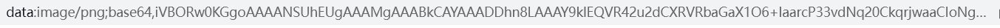

# Hutools

官网：[https://hutool.cn/docs/#/](https://hutool.cn/docs/#/)

API 文档：[https://apidoc.gitee.com/dromara/hutool/](https://apidoc.gitee.com/dromara/hutool/)

官方文档写的比较清楚，我这里只是用到了就记录一下

**依赖**

~~~xml
<dependency>
    <groupId>cn.hutool</groupId>
    <artifactId>hutool-all</artifactId>
    <version>5.8.16</version>
</dependency>
~~~

## captcha

### SpringBoot + vue 前后端分离实现图片验证码功能

**1、引入依赖**

~~~xml
<dependency>
    <groupId>cn.hutool</groupId>
    <artifactId>hutool-all</artifactId>
    <version>5.8.16</version>
</dependency>
~~~

**2、创建 Controller**

~~~java
@GetMapping("/captcha")
public R getCaptcha (HttpSession session, HttpServletResponse response) throws IOException {
	// 生成验证图片
    LineCaptcha captcha = CaptchaUtil.createLineCaptcha(200, 100);
    // 获得验证图片的值
    String code = captcha.getCode();
    System.out.println(code);
    // 存入 session 或 redis
    session.setAttribute("code", code);
    // 转换成图片 base64 编码形式
    String base64Data = captcha.getImageBase64Data();
    // data:image/png;base64,iVBORw0KGgoAAAANSUhEUgAAAMgAAABkCAYAAADDhn8LAA... 超级长
    // 返回给前端
    return R.ok(base64Data);
}
~~~

::: tip

LineCaptcha：线段干扰的验证码

CircleCaptcha：圆圈干扰验证码

ShearCaptcha：扭曲干扰验证码

GifCaptcha：gif 验证码

:::

**3、浏览器测试效果**




**4、前端代码**

~~~vue
<!-- 添加点击事件，实现点击更新验证图片 -->


<script>
data () {
    return {
        captcha: ''
    }
},
created() {
    // 页面加载时获取验证图片
    this.getCaptcha()
},
method: {
    getCaptcha () {
    	this.$http.get(`/user/captcha`).then((data) => {
        if (data.success) {
            this.captcha = data.data
        } else {
            console.log('获取验证码失败')
        }
      })
    }    
}
</script>    
~~~

### CaptchaUtil 工具类

```java
// 创建圆圈干扰的验证码，指定图片大小，默认5位验证码，15个干扰圈
createCircleCaptcha(int width, int height)	
// 指定图片大小，验证码位数，干扰圈数
createCircleCaptcha(int width, int height, int codeCount, int circleCount)

// 创建GIF验证码
createGifCaptcha(int width, int height)
createGifCaptcha(int width, int height, int codeCount)

// 创建线干扰的验证码，默认5位验证码，150条干扰线 
createLineCaptcha(int width, int height)
createLineCaptcha(int width, int height, int codeCount, int lineCount)
    
// 创建扭曲干扰的验证码，默认5位验证码
createShearCaptcha(int width, int height)
createShearCaptcha(int width, int height, int codeCount, int thickness)
```

- width：图片宽
- height：图片高
- codeCount：字符位数
- circleCount：干扰圈数
- lineCount：干扰线数
- thickness：干扰线宽度

### AbstractCaptcha 方法

所有的生成验证图片实现类均继承自 AbstractCaptcha

~~~java
String getCode()
// 获取验证码的文字内容
           
CodeGenerator getGenerator()
// 获取验证码生成器   
    
String getImageBase64()
// 获得图片的Base64形式
    
String getImageBase64Data()
// 获取图片带文件格式的 Base64
    
byte[] getImageBytes()
// 获取图形验证码图片bytes
    
void setBackground(Color background)
// 设置背景色
    
void setFont(Font font)
// 自定义字体
    
void setGenerator(CodeGenerator generator)
// 设置验证码生成器
    
void setTextAlpha(float textAlpha)
// 设置文字透明度
    
boolean verify(String userInputCode)
// 验证验证码是否正确，建议忽略大小写
    
void write(File file)
// 验证码写出到文件
    
void write(OutputStream out)
// 将验证码写出到目标流中
    
void write(String path)
// 验证码写出到文件
~~~

