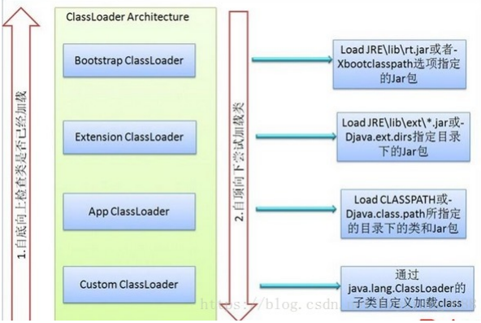
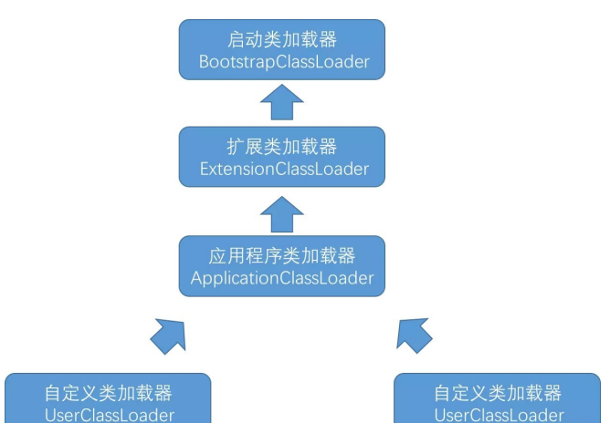

# 目录

[[toc]]

## 类加载机制

编写的 `Java` 代码需要经过编译器编译为 `class` 文件

代码编译为 `class` 文件后，需要通过类加载器把 `class` 文件加载到虚拟机中才能运行和使用

## 类加载步骤

类从被加载到内存到使用完成被卸载出内存，需要经历

**加载、验证、准备、解析、初始化、使用、卸载**

> 验证、准备、解析统称为连接

### （1）加载

在加载阶段，虚拟机主要完成三件事情

① 通过一个类的全限定名（比如 com.danny.framework.t）来获取定义该类的二进制流；

② 将这个字节流所代表的静态存储结构转化为方法区的运行时存储结构； 

③ 在内存中生成一个代表这个类的 `java.lang.Class` 对象，作为程序访问方法区中这个类的外部接口。

> **JVM在什么情况下会加载一个类？**  也就是说，啥时候会从“`.class`”字节码文件中加载这个类到`JVM`内存里来
>
> 在你的代码中用到这个类的时候 
>
> 1. 首先你的代码中包含“`main()`”方法的主类一定会在`JVM`进程启动之后被加载到内存，开始执行你的“`main()`”方法中的代码 
> 2. 接着遇到你使用了别的类，比如“`ReplicaManager`”，此时就会从对应的“`.class`”字节码文件加载对应的类到内存里来。

### （2）验证

验证的目的是为了确保 `class` 文件的字节流包含的内容符合虚拟机的要求，且不会危害虚拟机的安全

### （3）准备

正式为【类变量】分配内存并设置类变量【初始值】，这些变量所使用的内存都分配在方法区

> 注意：
>
> - 分配内存的对 象是“类变量”而不是实例变量
> - 是分配初始值，而不是赋值
> - 但是加上`final`关键字，比如`public static final int value=123;`在准备阶段会初始化`value`的值为`123`；

一般数值类型的初始值都为`0`

`char`类型的初始值 为'`\u0000`'（常量池中一个表示`Nul`的字符串）

`boolean`类型初始值为`false`

引用类型初始值为`null`。

### （4）解析

解析是将常量池中【符号引用】替换为【直接引用】的过程。

#### 符号引用

符号引用是以一组符号来描述所引用的目标

符号引用与虚拟机实现的内存布局无关，引用的目标不一定已经加载到内存中。

比如在 `com.danny.framework.LoggerFactory` 类引用了 `com.danny.framework.Logger` ，但在编译期 间是不知道 `Logger` 类的内存地址的，所以只能先用 `com.danny.framework.Logger` （假设是这个，实际上是由类似于 `CONSTANT_Class_info` 的常量来表示的）来表示 `Logger` 类的地址，这就是符号引用。

#### 直接引用

直接引用可以是直接指向目标的指针、相对偏移量或是一个能间接定位到目标的句柄。

直接引用和虚拟机实现的内存布局有关，如果有了直接引用，那引用的目标一定在内存中存在。 

> 解析的时候 `class` 已经被加载到方法区的内存中，因此要把符号引用转化为直接引用，也就是能直接找到该类实际内存地址的引用。

### （5）初始化

执行类的初始化代码  

比如：赋值、 static静态代码块  

> 如果初始化一个类的时候，发现他的父类还没初始化，那么必须先初始化他的父类

1. 初始化顺序
2. 父类静态变量
3. 父类静态代码块
4. 子类静态变量
5. 子类静态代码块
6. 父类非静态变量
7. 父类非静态代码块
8. 父类构造函数
9. 子类非静态变量
10. 子类非静态代码块
11. 子类构造函数

## 类加载器

### 类加载器的作用

- 加载 `class`
- 确定类的唯一性

#### 加载 class

类加载的加载阶段的第一个步骤，就是通过类加载器来完成的

类加载器的主要任务就是 “ 通过 一个类的全限定名来获取描述此类的二进制字节流 ”

> 在这里，类加载器加载的二进制流并不一定要从 `class` 文件中获取，还可以从其他格式如`zip`文件中读取、从网络或数据库中读取、运行时动态生成、由其他文件生 成（比如 `jsp` 生成 `class` 类文件）等。 

从程序员的角度来看，类加载器动态加载`class`文件到虚拟机中，并生成一个 `java.lang.Class` 实例，每个实例 都代表一个 `java` 类，可以根据该实例得到该类的信息，还可以通过`newInstance()`方法生成该类的一个对象。

#### 确定类的唯一性

对于每一个类，都需要由加载它的加载器和这个类本身共同确立这个类在 Java 虚拟机中的唯一性

两个相同的类，只有是在同 一个加载器加载的情况下才 “ 相等 ”

> 这里的 “ 相等 ” 是指代表类的 `Class` 对象的 `equals()` 方法、 `isAssignableFrom()` 方法、 `isInstance()` 方法的返回结果，也包括 `instanceof` 关键字对对象所属关系的 判定结果

### 类加载器的分类

- 启动类加载器（Bootstrap ClassLoader）
- 扩展类加载器 （Extension ClassLoader）
- 应用程序类加载器（Application ClassLoader）
- 自定义类加载器（User ClassLoader）

> 其中启动类加载器属于 `JVM` 的一部分
>
> 其他类加载器都用 `java` 实现，并且最终都继承自 `java.lang.ClassLoader` 

#### 启动类加载器

启动类加载器主要负责加载 `JAVA_HOME\lib` 目录或者被 `-Xbootclasspath` 参数指定目录中的部分类

具体加载哪些类可以通过 `System.getProperty("sun.boot.class.path")` 来查看。

#### 扩展类加载器

负责加载 `JAVA_HOME\lib\ext` 目录或者被 `java.ext.dirs` 系统变量指定的路径中的所有类库

可以通过 `System.getProperty("java.ext.dirs")` 来查看具体都加载哪些类

#### 应用程序类加载器

负责加载用户类路径（我们通常指定的 `classpath`）上的类

如果程序中没有自定义类加载器，应用程序类加载器就是程序**默认**的类加载器。

#### 自定义类加载器

`JVM` 提供的类加载器只能加载指定目录的类（`jar` 和 `class`），如果我们想从其他地方甚至网络上获取 `class` 文件，就需要自定义类加载器来实现

自定义类加载器主要都是通过继承 `ClassLoader` 或者它的子类来实现，但无论是通过继承 `ClassLoader` 还是它的子类，最终自定义类加载器的父加载器都是**应用程序类加载器**

因为不管调用哪个父类加载器，创建的对象都必须最终调用 `java.lang.ClassLoader.getSystemClassLoader()` 作为父加载器， `getSystemClassLoader()` 方法的返回值是 `sun.misc.Launcher.AppClassLoader` 即应用程序类加载器。

## 双亲委派机制

> 避免重复加载某一个类，保证类的唯一性

就是当一个类加载器加载类的时候，如果有父加载器就先尝试让父加载器加载

如果父加载器还有父加载器就一直往上抛，一直把类加载的任务交给启动类加载器

然后启动类加载器如果加载不到类就会抛出 `ClassNotFoundException` 异常，之后把类加载的任务往下抛

> 双亲委派模型要求除了顶层的启动类加载器之外，其他的类加载器都应该有一个父类加载器
>
> 但是这种父子关系并不是继承关系，而是像上面代码所示的组合关系

