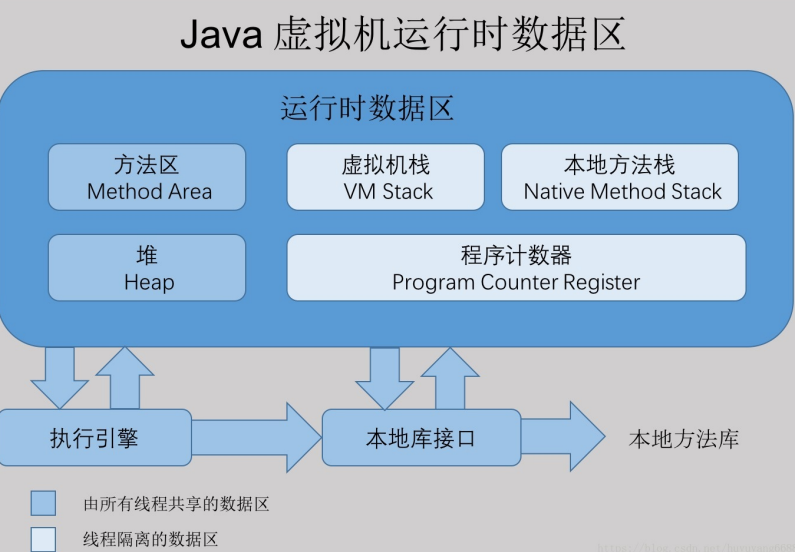
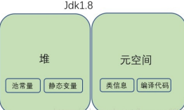

# 目录

[[toc]]

## JVM内存区域

`Java`虚拟机在运行时，会把内存空间分为若干个区域

Java虚拟机所管理的内存区域分为如下部分：

- 方法区
- 堆内存：存放对象和数组
  - 年轻代
  - 老年代
  - 永久代（方法区）
- 虚拟机栈
- 本地方法栈
- 程序计数器

## 方法区

用于存储虚拟机加载的类信息、常量、静态变量，以及编译器编译后的代码等数据

> `jdk1.8`中，方法区已经不存在，原方法区中存储的类信息、编译后的代码数据等已经移动到了元空间

元空间并没有处于堆内存上，而是直接占用的本地内存

### 去除永久代的原因

（1）字符串存在永久代中，容易出现性能问题和内存溢出。 

（2）类及方法的信息等比较难确定其大小，因此对 于永久代的大小指定比较困难，太小容易出现永久代溢出，太大则容易导致老年代溢出。 

（3）永久代会为 `GC` 带来不必要的复杂度，并且回收效率偏低

## 堆内存

存放我们在代码中创建的各种对象 

堆还可以分为

- 新生代（YoungGeneration）
- 老年代（OldGeneration）

## 虚拟机栈

调用执行任何方法时，都会给方法创建栈帧然后入栈, 方法执行完毕之后就出栈

每个线程都有自己的Java虚拟机栈  

## 本地方法栈

本地方法栈与虚拟机栈的区别是，虚拟机栈执行的是 `Java` 方法，本地方法栈执行的是本地方法（`Native Method`）

## 程序计数器

程序计数器就是用来记录当前执行的字节码指令的位置的，也就是记录目前执行到了哪一条字节码指令

每个线程都有一个独立的程序计数器

程序计数器是`Java`虚拟机规定的唯一不会发生内存溢出 的区域

## 元空间

`jdk1.8` 中，已经不存在永久代（方法区），替代它的一块空间叫做 “ 元空间 ”

和永久代类似，都是 `JVM` 规范对方法区的实现，但是元空间并不在虚拟机中，而是使用本地内存，元空间的大小仅受本地内存限制，但 可以通过 -`XX:MetaspaceSize` 和 `-XX:MaxMetaspaceSize` 来指定元空间的大小。