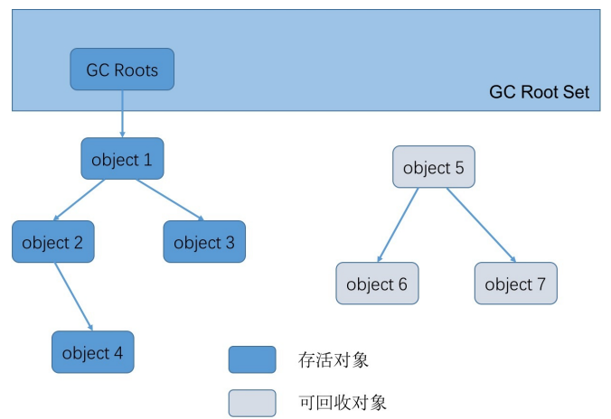

# 目录

[[toc]]

## JVM垃圾回收机制

垃圾回收，就是通过垃圾收集器把内存中没用的对象清理掉。

垃圾回收涉及到的内容有： 

1. 判断对象是否已死； 
2. 选择垃圾收集算法； 
3. 选择垃圾收集的时间； 
4. 选择适当的垃圾收集器清理垃圾 （已死的对象）;

## 判断对象是否已死

判断对象是否已死有引用计数算法和可达性分析算法。

### （1）引用计数算法

给每一个对象添加一个引用计数器，每当有一个地方引用它时，计数器值加 1；

每当有一个地方不再引用它时，计 数器值减 1；

这样只要计数器的值不为 0，就说明还有地方引用它，它就不是无用的对象。

> 这种方法看起来非常简单，但目前许多主流的虚拟机都没有选用这种算法来管理内存
>
> 原因就是当某些对象之间互 相引用时，无法判断出这些对象是否已死

### （2）可达性分析算法

了解可达性分析算法之前先了解一个概念——`GC Roots` 垃圾收集的起点

可以作为 `GC Roots` 的有

- 虚拟机栈中本地变量表中引用的对象
- 方法区中静态属性引用的对象
- 方法区中常量引用的对象
- 本地方法栈中 JNI（Native 方 法）引用的对象

 当一个对象到 `GC Roots` 没有任何引用链相连（`GC Roots` 到这个对象不可达）时，就说明此对象是不可用的，是死对象

上面被判了死刑的对象（object5、object6、object7）并不是必死无疑，还有挽救的余地。

进行可达性分析后对象和 `GC Roots` 之间没有引用链相连时，对象将会被进行一次标记，接着会判断如果对象没有覆盖 `Object`的 `finalize()` 方法或者 `finalize()` 方法已经被虚拟机调用过，那么它们就会被行刑（清除）；

如果对象覆盖了 `finalize()` 方法且还没有被调用，则会执行 `finalize()` 方法中的内容，所以在 `finalize()` 方法中如果重新与 `GC Roots` 引用链上的对象关联就可以拯救自己，但是一般不建议这么做

> 建议大家完全可以忘掉这个方法

### （3）方法区回收

上面说的都是对堆内存中对象的判断，方法区中主要回收的是废弃的常量和无用的类。 

判断常量是否废弃可以判断是否有地方引用这个常量，如果没有引用则为废弃的常量。 

判断类是否废弃需要同时满足如下条件： 

- 该类所有的实例已经被回收（堆中不存在任何该类的实例）。 
- 加载该类的 ClassLoader 已经被回收。 
- 该类对应的 `java.lang.Class` 对象在任何地方没有被引用（无法通过反射访问该类的方法）。