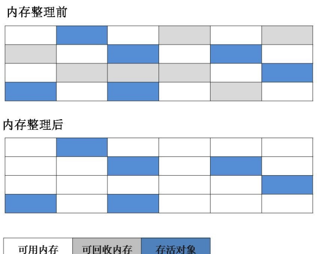
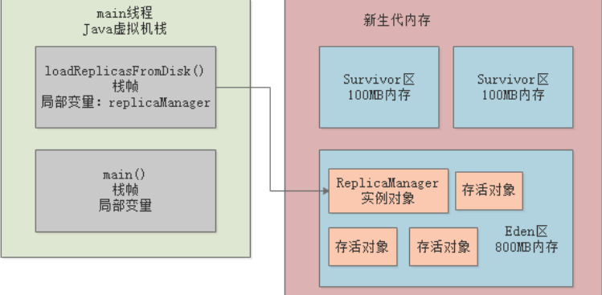

# 目录

[[toc]]

## 常用垃圾回收算法

常用的垃圾回收算法有三种

- 标记-清除算法
- 复制算法
- 标记-整理算法

### （1）标记-清除算法

分为标记和清除两个阶段

首先标记出所有需要回收的对象，标记完成后统一回收所有被标记的对象

缺点：

1. 标记和清除两个过程效率都不高；
2. 标记清除之后会产生大量不连续的内存碎片

### （2）复制算法

把内存分为大小相等的两块，每次存储只用其中一块，当这一块用完了，就把存活的对象全部复制到另一块上

同时把使用过的这块内存空间全部清理掉，往复循环

缺点：

实际可使用的内存空间缩小为原来的一半。

### 复制算法优化

实际上真正的复制算法会做出如下优化，把内存区域划分为三块

1个Eden区，2个Survivor区

其中Eden区占80%内存空间，每一块Survivor区各占10%内存空间

比如说Eden区有800MB内存，每 一块Survivor区就100MB内存  

平时可以使用的，就是Eden区和其中一块Survivor区，那么相当于就是有900MB的内存是可以使用的

- 刚开始对象都是分配在Eden区内的，如果Eden区快满了，此时就会触发垃圾回收 
- 此时就会把Eden区中的存活对象都一次性转移到一块空着的Survivor区。
- 接着Eden区就会被清空，然后再次分配新对象到Eden区里， 
- 然后就会如上图所示，Eden区和一块Survivor区里是有对象的，其中Survivor区里放的是上一次Minor GC后存活的对象。 
- 如果下次再次Eden区满，那么再次触发Minor GC，就会把Eden区和放着上一次Minor GC后存活对象的Survivor区内的存活对象，转移到另外一块Survivor区去  
-  **始终保持一块Survivor区是空着的**，就这样一直**循环使用这三 块内存区域。**

### （3）标记-整理算法

先对可用的对象进行标记，然后所有被标记的对象向一段移动，最后清除可用对象边界以外的内存

### （4）分代收集算法

把堆内存分为新生代和老年代，新生代又分为 Eden 区、From Survivor 和 To Survivor。

一 般新生代中的对象基本上都是朝生夕灭的，每次只有少量对象存活，因此采用复制算法，只需要复制那些少量存活的对象就可以完成垃圾收集；

老年代中的对象存活率较高，就采用标记-清除和标记-整理算法来进行回收。

## 垃圾回收的几种情况

大多数情况下，新的对象都分配在Eden区，当 Eden 区没有空间进行分配时，将进行一次 Minor GC，清理 Eden 区中的无用对象。

清理后，Eden 和 From Survivor 中的存活对象如果小于To Survivor 的可用空间则进 入To Survivor，否则直接进入老年代）；

Eden 和 From Survivor 中还存活且能够进入 To Survivor 的对象年 龄增加 1 岁

> （虚拟机为每个对象定义了一个年龄计数器，每执行一次 Minor GC 年龄加 1），当存活对象的年 龄到达一定程度（默认 15 岁）后进入老年代，可以通过 `-XX:MaxTenuringThreshold` 来设置年龄的值。 

当进行了 Minor GC 后，Eden 还不足以为新对象分配空间（那这个新对象肯定很大），新对象直接进入老年代。 

占 To Survivor 空间一半以上且年龄相等的对象，大于等于该年龄的对象直接进入老年代

比如 Survivor 空 间是 10M，有几个年龄为 4 的对象占用总空间已经超过 5M，则年龄大于等于 4 的对象都直接进入老年代， 不需要等到 `MaxTenuringThreshold` 指定的岁数。 

- 在进行 Minor GC 之前，会判断老年代最大连续可用空间是否大于新生代所有对象总空间

  - 如果大于，说明 Minor GC 是安全的

  - 否则会判断是否允许担保失败
    - 如果允许，判断老年代最大连续可用空间是否大于历次晋升到老年代的对象的平均大小
      - 如果大于，则执行 Minor GC，否则执行 Full GC。 
      - 如果经过 Full GC 还无法满足存放新数据的需求，就会抛出 内存溢出异常。

当在 java 代码里直接调用 `System.gc()` 时，会建议 `JVM` 进行 `Full GC`，但一般情况下都会触发 `Full GC`，一般 不建议使用，尽量让虚拟机自己管理 `GC` 的策略。 

大对象（需要大量连续内存的对象）例如很长的数组，会直接进入老年代，如果老年代没有足够的连续大空间来存放，则会进行 `Full GC`。