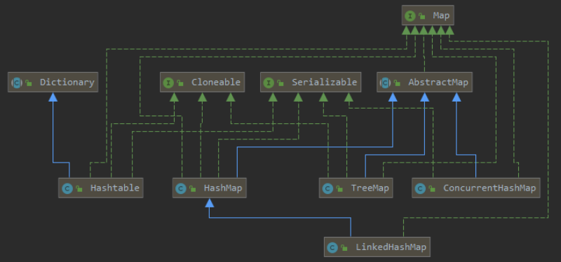
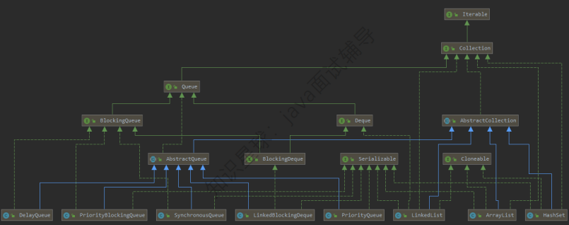
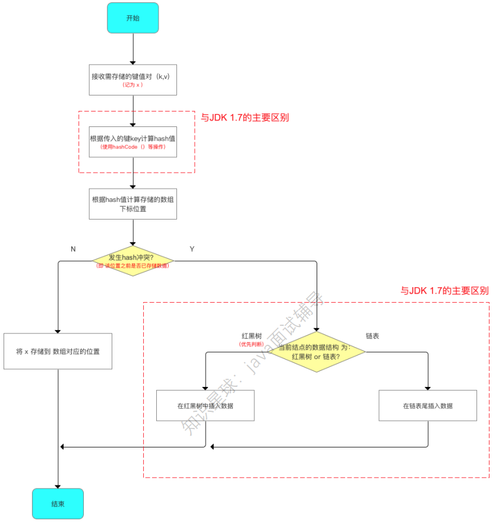
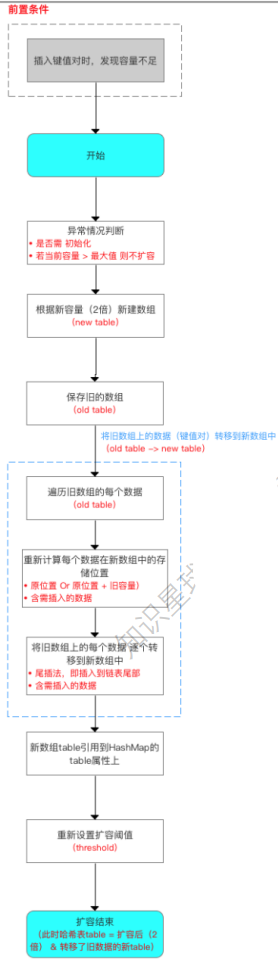

# 目录

[[toc]]

## Java集合篇

###  Java 中集合框架类关系图  
 整体分成两大体系： 
`key-value`体系`Map`
动态数组、链表、队列体系

**key-value体系Map**

**动态数组、链表、队列体系**


### 集合和数组有什么区别？  

- 数组是固定长度的；集合可变长度的。 
- 数组可以存储基本数据类型，也可以存储引用数据类型；集合只能存储引用数据类型。 
- 数组存储的元素必须是同一个数据类型；集合存储的对象可以是不同数据类型。  
### 怎么确保一个集合不能被修改？  
可以使用 `Collections. unmodifiableCollection(Collection c)` 方法来创建一个只读集合，这样改变集合的任 何操作都会抛出 `java. lang. UnsupportedOperationException` 异常  
```java
List<String> list = new ArrayList<>();
list.add("伟哥");
Collection<String> clist = Collections. unmodifiableCollection(list);
clist.add("伟哥天下第一"); // 运行时此行报错
System. out. println(list. size());
```
### Iterator 有什么特点？  
`Iterator` 的特点是只能单向遍历，但是更加安全，因为它可以确保，在当前遍历的集合元素被更改的时候，就会抛 出 `ConcurrentModificationException` 异常。  

> 比如，有时候我们需要遍历ArrayList，同时做修改的时候，用fo循环会出问题，此时，我们就可以用迭代器 来操作。  

### 如何边遍历边移除 Collection 中的元素？  
 唯一正确方式是使用	`Iterator.remove()`方法  
```java
Iterator<Integer> it = list.iterator();
while(it.hasNext()){
// do something*
it.remove();
}
```
### ArrayList底层数据结构是什么？  
数组
```java
transient Object[] elementData;
```
### 为什么 ArrayList 的 elementData 加上 transient 修饰？  
从`ArrayList` 的类定义可以看到	`ArrayList`	实现了 `Serializable`	接口，这意味着 `ArrayList`	支持序列化。`transient`	的作用是不希望  `elementData`	数组被序列化，重写了 `writeObject`	实现。
```java
//类定义
public class ArrayList<E> extends AbstractList<E>
	implements List<E>, RandomAccess, Cloneable, java.io.Serializable

//重写writeObject方法
private void writeObject(java.io.ObjectOutputStream s) throws java.io.IOException{
	*// Write out element count, and any hidden stuff*
	int expectedModCount = modCount;
	s.defaultWriteObject();
	*// Write out array length*
	s.writeInt(elementData.length);
	*// Write out all elements in the proper order.*
	for (int i=0; i<size; i++)
        s.writeObject(elementData[i]);
	if (modCount != expectedModCount) {
		throw new ConcurrentModificationException();
    }
```
> 每次序列化时，先调用 defaultWriteObject() 方法序列化	ArrayList	中的非	transient	元素，然后遍历 elementData，只序列化已存入的元素，这样既加快了序列化的速度，又减小了序列化之后的文件大小  

### 说说你对序列化的理解  
序列化（编码）是将对象序列化为二进制形式（字节数组），主要用于网络传输、数据持久化等；
而反序列化（解 码）则是将从网络、磁盘等读取的字节数组还原成原始对象，主要用于网络传输对象的解码，以便完成远程调用。  
### 既然有数组了，为什么还要有ArrayList？  
我们常说的数组是定死的数组，`ArrayList`	却是动态数组。  
`ArrayList`可以使用默认的大小，当元素个数到达一定程度后，会自动扩容  

### ArrayList有什么优缺点？  
优点：`ArrayList`是实现了基于动态数组的数据结构，因为地址连续，一旦数据存储好了，查询操作效率会比较高 		（在内存里是连着放的）。 
缺点：因为地址连续，`ArrayList`要移动数据，所以插入和删除操作效率比较低  

### LinkedList 底层数据结构是什么？  
`LinkedList`基于链表的数据结构，地址是任意的，所以在开辟内存空间的时候不需要等一个连续的地址。
对于新增 和删除操作，`LinkedList`比较占优势。
`LinkedList` 适用于要头尾操作或插入指定位置的场景。  

>  记得：双向链表  

```java
// 集合数量
transient int size = 0;
// 双向链表的表头
transient Node<E> first;
// 双向链表的表尾
transient Node<E> last;

private static class Node<E> {
	E item;
	//后继
	Node<E> next;
	//前驱
	Node<E> prev;
	Node(Node<E> prev, E element, Node<E> next) {
		this.item = element;
		this.next = next;
		this.prev = prev;
	}
}
```
### ArrayList 和 LinkedList 的区别是什么？  
**ArrayList **
优点：

- `ArrayList`是实现了基于动态数组的数据结构，因为地址连续，一旦数据存储好了，查询操作效率会比较 高（在内存里是连着放的）。 
- 缺点：因为地址连续，`ArrayList`要移动数据，所以插入和删除操作效率比较低。  

**LinkedList **
优点：

- `LinkedList`基于链表的数据结构，地址是任意的，所以在开辟内存空间的时候不需要等一个连续的地 址。对于新增和删除操作，`LinkedList`比较占优势。
- `LinkedList`适用于要头尾操作或插入指定位置的场景。 

缺点：

- 因为 `LinkedList` 要移动指针，所以查询操作性能比较低。  

**适用场景分析 **

- 当需要对数据进行对随机访问的时候，选用 `ArrayList`。 
- 当需要对数据进行多次增加删除修改时，采用 `LinkedList`。 

如果容量固定，并且只会添加到尾部，不会引起扩容，优先采用	`ArrayList`。
当然，绝大数业务的场景下，使用 `ArrayList` 就够了，但需要注意避免 `ArrayList` 的扩容，以及非顺序的插入。  

### ArrayList 线程安全吗？  
不是线程安全的  
### 多线程场景下如何使用 ArrayList？  
如果遇到多线程场景，可以通过 `Collections` 的 `synchronizedList` 方法将其转换成线程安全的容器后再使用  
```java
List<String> synchronizedList = Collections.synchronizedList(list);
synchronizedList.add("伟哥");
synchronizedList.add("伟哥天下第一");

for (int i = 0; i < synchronizedList.size(); i++) {
	System.out.println(synchronizedList.get(i));
}
```
### 说一下HashSet 的实现原理？  
`HashSet`	是基于 `HashMap` 实现的，`HashSet`的值存放于`HashMap`的`key`上，`HashMap`的`value`统一为`present`，因此 `HashSet`	的实现比较简单，相关	`HashSet`	的操作，基本上都是直接调用底层 `HashMap`	的相关方法来完成，`HashSet` 不允许重复的值。  

```java
//HashSet
private static final Object PRESENT = new Object();
private transient HashMap<E,Object> map;

public HashSet() {
	map = new HashMap<>();
}

public boolean add(E e) {
	return map.put(e, PRESENT)==null;
}
```
### 说一下HashMap底层数据结构？  
JDK7及之前，采用的是数组+链表。
JDK8开始采用的是数组+链表+红黑树。  
### 为什么要改成数组+链表+红黑树？  
主要是为了提升在 `hash` 冲突严重时（链表过长）的查找性能，使用链表的查找性能是 O(n)，而使用红黑树是 O(logn)。  
### 什么是哈希表？  
散列表 （Hash	table，也叫哈希表），是根据关键码值(Key	value)而直接进行访问的数据结构。也就是说，它通过 把关键码值映射到表中一个位置来访问记录，以加快查找的速度。这个映射函数叫做散列函数，存放记录的数组叫 做散列表。  
### 说一下HashMap的put过程？  

1. 接收要存储的键值对（K,V）
2. 根据key计算hash值
3. 根据hash值计算存储的数字的下标位置
4. 判断是否发送hash冲突
   1. 未发生则直接存入
5. 发生则判断当前节点数据结构是 红黑树 or 链表
6. 红黑树 则在红黑树中插入数据
7. 链表 则在链表尾部插入数据
8. 结束


### 使用HashMap时，当两个对象的 hashCode 相同怎么办？  
因为`HashCode`	相同，不一定就是相等的（`equals`方法比较），所以两个对象所在数组的下标相同，"碰撞"就此发 生。又因为	`HashMap`	使用链表存储对象，这个	`Node`	会存储到链表中。  
### HashMap的哈希函数怎么设计的吗？  
`hash` 函数是先拿到通过 `key` 的	`hashCode` ，是 32	位的	`int` 值，然后让	`hashCode` 的高 16 位和低 16 位进行异或操作。
两个好处： 

1. 一定要尽可能降低 `hash` 碰撞，越分散越好； 
2. 算法一定要尽可能高效，因为这是高频操作,因此采用位运算；  
### 为什么采用 hashcode 的高 16 位和低 16 位异或能降低 hash 碰撞？  
因为	key.hashCode()函数调用的是 key 键值类型自带的哈希函数，返回 int 型散列值。 int 值范围为 -2147483648~2147483647，前后加起来大概	40 亿的映射空间。
只要哈希函数映射得比较均匀松散，一般应用是很难出现碰撞的。
但问题是一个 40 亿长度的数组，内存是放不下的。 
HashMap	数组的初始大小才 16，用之前需要对数组的长度取模运算，得到的余数才能用来访问数组下标。  
### 解决hash冲突的有几种方法？  
**1、再哈希法：**如果hash出的index已经有值，就再hash，不行继续hash，直至找到空的index位置，要相信瞎猫总 能碰上死耗子。这个办法最容易想到。但有2个缺点： 比较浪费空间，消耗效率。根本原因还是数组的长度是固定不变的，不断hash找出空的index，可能越界，这 时就要创建新数组，而老数组的数据也需要迁移。随着数组越来越大，消耗不可小觑。 get不到，或者说get算法复杂。进是进去了，想出来就没那么容易了。 
**2、开放地址方法：**如果hash出的index已经有值，通过算法在它前面或后面的若干位置寻找空位，这个和再hash算法差别不大。 
**3、建立公共溢出区：** 把冲突的hash值放到另外一块溢出区。 
**4、链式地址法：** 把产生hash冲突的hash值以链表形式存储在index位置上。HashMap用的就是该方法。优点是不需 要另外开辟新空间，也不会丢失数据，寻址也比较简单。但是随着hash链越来越长，寻址也是更加耗时。好的hash 算法就是要让链尽量短，最好一个index上只有一个值。也就是尽可能地保证散列地址分布均匀，同时要计算简 单。

### 为什么 HashMap 采用拉链法而不是开放地址法？  
我认为 `Java` 给予 `HashMap` 的定位是一个相对通用的散列表容器，它应该在面对各种输入的时候都表现稳定。而开 发地址法相对来说容易出现数据堆积，在数据量较大时可能出现连续冲突的情况，性能不够稳定。  
### 为什么要用异或运算符？  
保证了对象的 `hashCode` 的 32 位值只要有一位发生改变，整个	`hash()` 返回值就会改变。尽可能的减少碰撞  
### 为什么要做那么多扰动处理？  
在`HashMap`中，有个`hash()`方法，也叫扰动函数。  
```java
static final int hash(Object key) {
	int h;
	return (key == null) ? 0 : (h = key.hashCode()) ^ (h >>> 16);
}
```
`key.hashCode()` ，获取`key`的`hashCode`值，如果不进行重写的话返回的是根据内存地址得到的一个`int`值。 `key.hashCode()` 获取到的`hashcode`无符号右移16位并和元`hashCode`进行 `^` ，这样做的目的是为了让高位与低进 行混合，让两者都参与运算，以便让`hash`值分布更加均匀。  

### HashMap的 table 的容量如何确定？  

- `table` 数组大小是由 `capacity` 这个参数确定的，默认是16，也可以构造时传入，最大限制是`1<<30；`
- `loadFactor` 是装载因子，主要目的是用来确认table 数组是否需要动态扩展，默认值是0.75，比如table 数组大 小为 16，装载因子为 0.75 时，`threshold` 就是12，当	`table` 的实际大小超过 12 时，`table`就需要动态扩容； 
- 扩容时，调用	`resize()` 方法，将 `table` 长度变为原来的两倍（注意是 `table` 长度，而不是	`threshold`）； 
- 如果数据很大的情况下，扩展时将会带来性能的损失，在性能要求很高的地方，这种损失很可能很致命。 
### 默认加载因子为什么是0.75？   
负载因子为`0.75f` 是空间与时间的均衡 

因为`HashMap`的容量一定是2的幂次，与0.25、0.5、0.75、1相乘刚好是一个整数，0.25太小了不考虑

如果负载因子小，意味着阈值变小。比如容量为16 的 HashMap ，负载因子为0.5f，也就是当阈值为8，那么存储8 个就会扩容到32，出现哈希冲突的可能性变小，但是空间利用率不高。适用于有足够内存并要求查询效率的场景。 

相反如果阈值为1，那么容量为16，就必须存储16个元素才进行扩容，出现冲突的概率变大，极端情况下可能会从 O(1)退化到O(n)。适用于内存敏感但不要求要求查询效率的场景。  

### HashMap 的长度为什么是 2 的 N 次方呢？  
为了能让 `HashMap` 存数据和取数据的效率高，尽可能地减少 hash 值的碰撞 
我们首先可能会想到 `%` 取模的操作来实现。
取余（`%`） 操作中如果除数是 2 的幂次，则等价于与其除数减一的与（&）操作（也就是说 `hash % length == hash &(length - 1 )` 的前提是 `length` 是 2 的 n 次方）。并且，采用二进制位操作 &，相对于 % 能够提高运算效 率。 

注意到 `HashMap` 初始化长度用的是 `1<<4`，而不是直接写 16。这是为啥呢？其实这样是为了位运算的方便，「位 与运算比算数计算的效率高太多了   

长度 16 或者其他 2 的幂，`length - 1` 的值是所有二进制位全为 1, 这种情况下，`index` 的结果等同于 `hashcode` 后几位的值，只要输入的 `hashcode` 本身分布均匀，`hash` 算法的结果就是均匀的  

### HashMap 最大容量是多少，为什么？  
`HashMap` 最大容量是 `1 << 30`  

```java
static final int MAXIMUM_CAPACITY = 1 << 30;
```
`int`占四个字节，一个字节占8位，所以是32位整型，也就是说最多32位。那按理说，最大数可以向左移 动31位即2的31次幂，在这里为什么不是2的31次方呢？实际上，二进制数的最左边那一位是符号位，用来表示正 负的，所以，`HashMap`最大容量是`1	<<	30`  

### HashMap为什么用数组而不用ArrayList？  
重点是使用数组可以自定义扩容机制，采用基本数组结构，扩容机制可以自己定义，`HashMap`中数组扩容刚好是2 的次幂，在做取模运算的效率高。	

`ArrayList`底层也是数组，但是扩容机制是1.5倍扩容  

### 当链表长度 >= 8时，为什么要将链表转换成红黑树？  
因为红黑树的平均查找长度是`log(n)`，链表的平均查找长度未`2\n`
长度为8的时候，红黑树平均查找长度为3，链表平均查找长度为4，所以，当链表长度 >= 8时 ，有必要将链表转换成红黑树  

### new	HashMap(12);此时HashMap初始容量为多少？  
容量为16。 
在 `HashMap` 中有个静态方法 `tableSizeFor()` ， `tableSizeFor()` 方法保证函数返回值是大于等于给定参数 `initi alCapacity` 最小的2的幂次方的数值 。  

```java
static final int tableSizeFor(int cap) {
	int n = cap - 1;
	n |= n >>> 1;
	n |= n >>> 2;
	n |= n >>> 4;
	n |= n >>> 8;
	n |= n >>> 16;
	return (n = MAXIMUM_CAPACITY) ? MAXIMUM_CAPACITY : n + 1;
}

```
### 说HashMap的resize()扩容过程  
创建一个新的数组，其容量为旧数组的两倍，并重新计算旧数组中结点的存储位置。

结点在新数组中的位置只有两 种，原下标位置或原下标+旧数组的大小。 



### 说说HashMap中get()方法是如何实现的？  
对`key`的`hashCode`进行`hash`值计算，与运算计算下标获取`bucket`位置，如果在桶的首位上就可以找到就直接返回， 否则在树中找或者链表中遍历找，如果有`hash`冲突，则利用`equals`方法去遍历链表查找节点。  
### 为什么 HashMap 用红黑树而不是平衡二叉树？  
红黑树和平衡二叉树的区别在于它们的平衡强弱不同： 

- 平衡二叉树追求的是一种完全平衡的状态，它的定义是任何结点的左右子树的高度差不会超过 1，这样的优势 是树的结点是很平均分配的； 
- 红黑树不追求这种完全平衡，而是追求一种弱平衡的状态，就是让整个树最长路径不会超过最短路径的 2 倍。 这样的话，红黑树虽然牺牲了一部分查找的性能效率，但是能够换取一部分维持树平衡状态的成本。 

而我们知道 HashMap 的设计定位应该是一个相对通用的散列表，那么它的设计者会希望这样一个数据结构应该具 备更强大的稳定性，因此它才选择了红黑树  
### 说说你对红黑树的了解  
红黑树是一种自平衡的二叉查找树，是一种高效的查找树。 
红黑树通过如下的性质定义实现自平衡： 

- 节点是红色或黑色。 
- 根是黑色。 
- 所有叶子都是黑色（叶子是NIL节点）。 
- 每个红色节点必须有两个黑色的子节点。（从每个叶子到根的所有路径上不能有两个连续的红色节点。） 
- 从任一节点到其每个叶子的所有简单路径都包含相同数目的黑色节点（简称黑高）。  
### JDK8中，相对JDK7对HashMap做了哪些改变？  
JDK1.7及之前：

数组+链表；创建一个链表数组，数组中每一格就是一个链表。若遇到哈希冲突，则将冲突的值加到 链表中即可。 

JDK1.8：

数组+链表+红黑树； jdk1.8在解决哈希冲突时，当链表长度大于阈值（默认为8）并且结点总数超过64时，将链表转化为红黑树，以减少搜索时间。 

`resize`扩容优化；引入了红黑树，目的是避免单条链表过长而影响查询效率；  

### 为什么Integer，String	适合作HashMap的key呢？  
`Integer`和	`String` 的好处在于`hash` 出来的值不会改变。如果是一个对象，那么他们可能会因为内部引用的改变而 `hashCode` 值的改变，会导致存储重复的数据或找不到数据的情况。  

### HashMap中的 key 我们可以使用任何类作为 key 吗？  
平时使用的最多的就是使用`String`作为`HashMap`的`key`，但是现在我们想使用某个自定 义类作为 `HashMap`	的	`key`，那就需要注意以下几点： 

- 如果类重写了`equals`	方法，它也应该重写	`hashCode`方法。 
- 类的所有实例需要遵循与`equals`和`hashCode`相关的规则。 
- 如果一个类没有使用	`equals`，你不应该在	`hashCode`中使用它。 
- 咱们自定义`key`	类的最佳实践是使之为不可变的，这样，`hashCode`	值可以被缓存起来，拥有 更好的性能。不可变的类也可以确保	`hashCode`和`equals`在未来不会改变，这样就会解决与可变相关的问题 了。  
### 为什么重写 equals	方法的时，需要重写 hashCode 方法呢？  
`hashCode`和`equals`两个方法是用来协同判断两个对象是否相等的，采用这种方式的原因是可以提高程序插入和查 询的速度，如果在重写	`equals`时，不重写`hashCode`，就会导致在某些场景下，例如将两个相等的自定义对象存储 在`Set`集合时，就会出现程序执行的异常，为了保证程序的正常执行，所以我们就需要在重写`equals`时，也一并重 写`hashCode`方法才行。  

### 说说什么是 fail-fast？  
`fail-fast`机制是`Java`集合（ Collection ）中的一种错误机制。

当多个线程对同一个集合的内容进行 操作时，就可 能会产生`fail-fast`事件。 

例如：当某一个线程	A通过iterator去遍历某集合的过程中，若该集合的内容被其他线程所改变 了，那么线程	A访 问集合时，就会抛出 `ConcurrentModificationException` 异常，产生	`fail-fast`事 件。

这里的操作主要是指	`add`、 `remove`	和`clear`，对集合元素个数进行修改。  

**解决办法**
建议使用 `java.util.concurrent` 包下的类”去取代“ `java.util` 包下的类”。 

可以这么理解：

在遍历之前，把 `modCount` 记下来 `expectModCount` ，后面 `expectModCount` 去 和 `modCount` 进 行比较，如果不相等了，证明已并发了，被修改了，于是抛出 `ConcurrentModificationException` 异常。  


