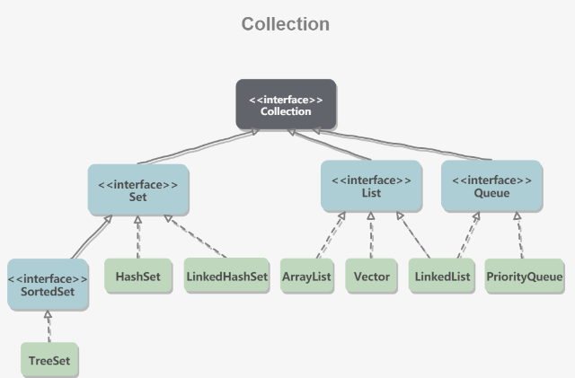
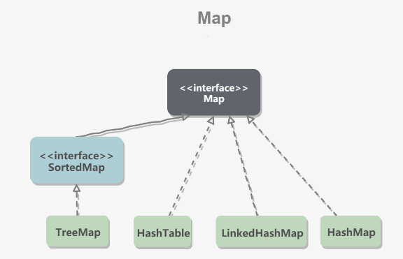
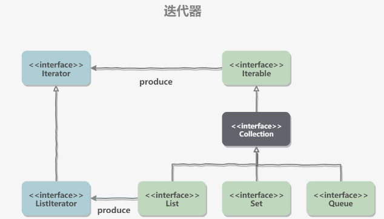
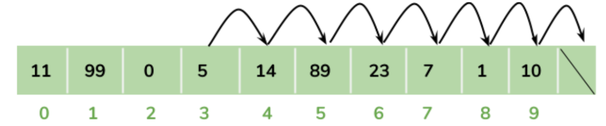
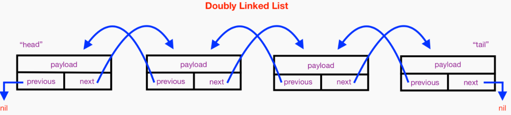
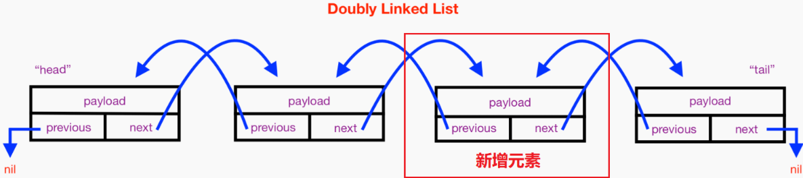
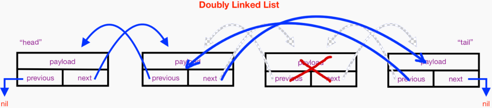
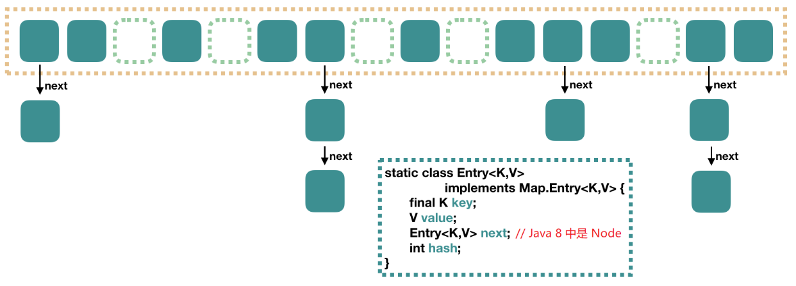
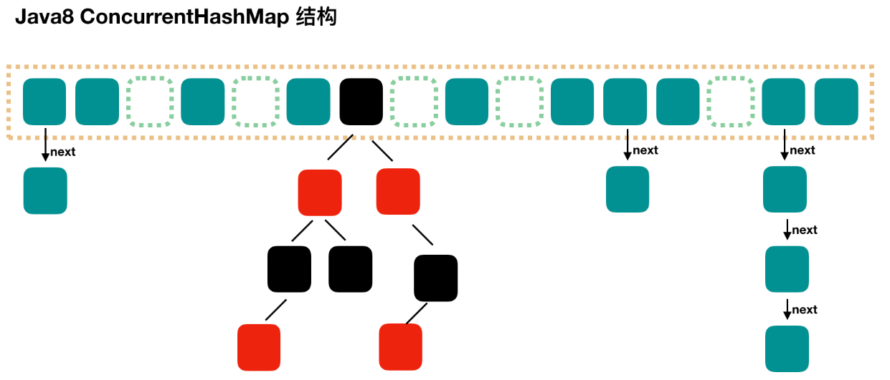

# Java集合篇

## 一、概览

集合主要包括 `Collection` 和 `Map` 两种

- `Collection` 存储着对象的集合
- 而 `Map` 存储着键值对（两个对象）的映射表

### Collection




#### 1. Set

- `TreeSet`：基于红黑树实现，支持有序性操作，例如根据一个范围查找元素的操作。但是查找效率不如 `HashSet`，`HashSet` 查找的时间复杂度为 `O(1)`，`TreeSet` 则为 `O(logN)`。
- `HashSet`：基于哈希表实现，支持快速查找，但不支持有序性操作。并且失去了元素的插入顺序信息，也就是说使用 `Iterator` 遍历 `HashSet` 得到的结果是不确定的。
- `LinkedHashSet`：具有 `HashSet` 的查找效率，并且内部使用双向链表维护元素的插入顺序。

#### 2. List

- `ArrayList`：基于动态数组实现，支持随机访问。
- `Vector`：和 `ArrayList` 类似，但它是线程安全的。
- `LinkedList`：基于双向链表实现，只能顺序访问，但是可以快速地在链表中间插入和删除元素。不仅如此，`LinkedList` 还可以用作栈、队列和双向队列。

#### 3. Queue

- `LinkedList`：可以用它来实现双向队列。
- `PriorityQueue`：基于堆结构实现，可以用它来实现优先队列

### Map



- `TreeMap`：基于红黑树实现。
- `HashMap`：基于哈希表实现。
- `HashTable`：和 `HashMap` 类似，但它是线程安全的，这意味着同一时刻多个线程同时写入 `HashTable` 不会导致数据不一致。它是遗留类，不应该去使用它，而是使用 `ConcurrentHashMap` 来支持线程安全，`ConcurrentHashMap` 的效率会更高，因为 `ConcurrentHashMap` 引入了分段锁。
- `LinkedHashMap`：使用双向链表来维护元素的顺序，顺序为插入顺序或者最近最少使用（LRU）顺序

## 二、集合中的设计模式

### 迭代器模式



`Collection` 继承了 `Iterable` 接口，其中的 `iterator()` 方法能够产生一个 `Iterator` 对象，通过这个对象就可以迭代遍历 `Collection` 中的元素。

```java
List<String> list = new ArrayList<>();
list.add("a");
list.add("b");
for (String item : list) {
    System.out.println(item);
}
```

### 适配器模式

`java.util.Arrays#asList()` 可以把数组类型转换为 `List` 类型。

```java
@SafeVarargs
public static <T> List<T> asList(T... a)
```

应该注意的是 `asList()` 的参数为泛型的可变参数，不能使用基本类型数组作为参数，只能使用相应的包装类型数组。

```java
Integer[] arr = {1, 2, 3};
List list = Arrays.asList(arr);
```

也可以使用以下方式调用 `asList()`

```java
List list = Arrays.asList(1, 2, 3);
```

## 三、源码分析

### ArrayList

在 Java 的集合类 ArrayList 里，实际上使用的就是数组存储结构，ArrayList 对 Array 进行了封装，并增加了方便的插入、获取、扩容等操作。

因为 ArrayList 的底层是数组，所以存取非常迅速，但是增删时，因为要移动后面的元素位置，所以增删效率相对较低。

#### 1. ArrayList 存储结构

可以看到它就是一个简单的数组，用来数据存储。

~~~java
/**
 * The array buffer into which the elements of the ArrayList are stored.
 * The capacity of the ArrayList is the length of this array buffer. Any
 * empty ArrayList with elementData == DEFAULTCAPACITY_EMPTY_ELEMENTDATA
 * will be expanded to DEFAULT_CAPACITY when the first element is added.
 */
transient Object[] elementData; // non-private to simplify nested class access

/**
 * Shared empty array instance used for default sized empty instances. We
 * distinguish this from EMPTY_ELEMENTDATA to know how much to inflate when
 * first element is added.
 */
private static final Object[] DEFAULTCAPACITY_EMPTY_ELEMENTDATA = {};

/**
 * Default initial capacity.
 */
private static final int DEFAULT_CAPACITY = 10;

~~~

::: tip

ArrayList 无参构造时是会共享一个长度为 0 的数组 DEFAULTCAPACITY_EMPTY_ELEMENTDATA. 只有当第一个元素添加时才会第一次扩容，这样也防止了创建对象时更多的内存浪费。

:::


#### 2. ArrayList 扩容机制

ArrayList 在初始化时，是共享一个长度为 0 的数组的，当第一个元素添加进来时会进行第一次扩容， ArrayList 每当空间不够使用时就会进行一次扩容

**add () 方法**

```java
/**
 * Appends the specified element to the end of this list.
 *
 * @param e element to be appended to this list
 * @return <tt>true</tt> (as specified by {@link Collection#add})
 */
public boolean add(E e) {
    ensureCapacityInternal(size + 1);  // Increments modCount!!
    elementData[size++] = e;
    return true;
}
// 开始检查当前插入位置时数组容量是否足够
private void ensureCapacityInternal(int minCapacity) {
    // ArrayList 是否未初始化，未初始化是则初始化 ArrayList ，容量给 10.
    if (elementData == DEFAULTCAPACITY_EMPTY_ELEMENTDATA) {
        minCapacity = Math.max(DEFAULT_CAPACITY, minCapacity);
    }
    ensureExplicitCapacity(minCapacity);
}
// 比较插入 index 是否大于当前数组长度，大于就 grow 进行扩容
private void ensureExplicitCapacity(int minCapacity) {
    modCount++;
    // overflow-conscious code
    if (minCapacity - elementData.length > 0)
        grow(minCapacity);
}

/**
 * Increases the capacity to ensure that it can hold at least the
 * number of elements specified by the minimum capacity argument.
 *
 * @param minCapacity the desired minimum capacity
 */
private void grow(int minCapacity) {
    // overflow-conscious code
    int oldCapacity = elementData.length;
    // 扩容规则是当前容量 + 当前容量右移1位。也就是1.5倍。
    int newCapacity = oldCapacity + (oldCapacity >> 1);
    if (newCapacity - minCapacity < 0)
        newCapacity = minCapacity;
    // 是否大于 Int 最大值，也就是容量最大值
    if (newCapacity - MAX_ARRAY_SIZE > 0)
        newCapacity = hugeCapacity(minCapacity);
    // minCapacity is usually close to size, so this is a win:
    // 拷贝元素到扩充后的新的 ArrayList
    elementData = Arrays.copyOf(elementData, newCapacity);
}
```

1. 开始检查当前插入位置时数组容量是否足够

2. ArrayList 是否未初始化，未初始化是则初始化 ArrayList ，容量给 10.

3. 判断当前要插入的下标是否大于容量

   1. 不大于，插入新增元素，新增流程完毕。

4. 如果所需的容量大于当前容量，开始扩充。

   1. 扩容规则是当前容量 + 当前容量右移 1 位。也就是 1.5 倍。

      `int newCapacity = oldCapacity + (oldCapacity >> 1);`

   2. 如果扩充之后还是小于需要的最小容量，则把所需最小容量作为容量。

   3. 如果容量大于默认最大容量，则使用 最大值 Integer 作为容量。

   4. 拷贝老数组元素到扩充后的新数组

5. 插入新增元素，新增流程完毕。

#### 3. ArrayList 数据新增

上面分析扩容时候已经看到了新增一个元素的具体逻辑，因为底层是数组，所以直接指定下标赋值即可，非常简单。

~~~java
public boolean add(E e) {
    ensureCapacityInternal(size + 1);  // Increments modCount!!
    elementData[size++] = e; // 直接赋值
    return true;
}
~~~

但是还有一种新增数据的情况，就是新增时指定了要加入的下标位置。

~~~java
/**
 * Inserts the specified element at the specified position in this
 * list. Shifts the element currently at that position (if any) and
 * any subsequent elements to the right (adds one to their indices).
 *
 * @param index index at which the specified element is to be inserted
 * @param element element to be inserted
 * @throws IndexOutOfBoundsException {@inheritDoc}
 */
public void add(int index, E element) {
    rangeCheckForAdd(index);
    ensureCapacityInternal(size + 1);  // Increments modCount!!
     // 指定下标开始所有元素后移一位
    System.arraycopy(elementData, index, elementData, index + 1,size - index);
    elementData[index] = element;
    size++;
}
~~~

可以发现这种新增多了关键的一行，它的作用是把从要插入的坐标开始的元素都向后移动一位，这样才能给指定下标腾出空间，才可以放入新增的元素。

比如你要在下标为 3 的位置新增数据 100，那么下标为 3 开始的所有元素都需要后移一位。



#### 4.ArrayList 数据获取

数据下标获取元素值，**一步到位，不必多言**。

~~~java
public E get(int index) {
    rangeCheck(index);
    return elementData(index);
}
E elementData(int index) {
    return (E) elementData[index];
}
~~~

### LinkedList

#### 1.概览

是一个典型的**双向链表**结构，item 用来存放元素值；next 指向下一个 node 节点，prev 指向上一个 node 节点。



LinkedList 无参构造里没有任何操作，不过我们通过查看变量 first、last 可以发现它们就是存储链表第一个和最后 一个的节点。

~~~java
transient int size = 0;
/**
 * Pointer to first node.
 * Invariant: (first == null && last == null) ||
 *            (first.prev == null && first.item != null)
 */
transient Node<E> first;

/**
 * Pointer to last node.
 * Invariant: (first == null && last == null) ||
 *            (last.next == null && last.item != null)
 */
transient Node<E> last;

/**
 * Constructs an empty list.
 */
public LinkedList() {
}
~~~

变量 first 和 last 都是 Node 类型，继而查看 Node 源码。

~~~java
private static class Node<E> {
    E item;
    Node<E> next;
    Node<E> prev;

    Node(Node<E> prev, E element, Node<E> next) {
        this.item = element;
        this.next = next;
        this.prev = prev;
    }
}
~~~

可以看到这就是一个典型的**双向链表**结构，item 用来存放元素值；next 指向下一个 node 节点，prev 指向上一个 node 节点。

#### 2.LinkedList 数据获取

链表不像数组是连续的内存地址，链表是通过 next 和 prev 指向记录链接路径的，所以查找指定位置的 node 只能遍历查找

~~~java
public E get(int index) {
    checkElementIndex(index);
    return node(index).item;
}
/**
 * Returns the (non-null) Node at the specified element index.
 */
// 遍历查找 index 位置的节点信息
Node<E> node(int index) {
    // assert isElementIndex(index);
    // 这里判断 index 是在当前链表的前半部分还是后半部分，然后决定是从
    // first 向后查找还是从 last 向前查找。
    if (index < (size >> 1)) {
        Node<E> x = first;
        for (int i = 0; i < index; i++)
            x = x.next;
        return x;
    } else {
        Node<E> x = last;
        for (int i = size - 1; i > index; i--)
            x = x.prev;
        return x;
    }
}
~~~

查找会首先判断 index 是在当前链表的前半部分还是后半部分，然后决定是从 first 向后查找还是从 last 向前查找。这样可以增加查找速度。

#### 3.LinkedList 数据新增

因为 LinkedList 是链表，所以 LinkedList 的新增也就是链表的数据新增了，这时候要根据要插入的位置的区分操作。

**尾部插入**

默认的 add 方式就是尾部新增了，尾部新增的逻辑很简单，只需要创建一个新的节点，新节点的 prev 设置现有的末尾节点，现有的末尾 Node 指向新节点 Node，新节点的 next 设为 null 即可。

~~~java
public boolean add(E e) {
    linkLast(e);
    return true;
}
void linkLast(E e) {
    final Node<E> l = last;
    // 新节点，prev 为当前尾部节点，e为元素值，next 为 null，
    final Node<E> newNode = new Node<>(l, e, null);
    last = newNode;
    if (l == null)
        first = newNode;
    else
         // 目前的尾部节点 next 指向新的节点
        l.next = newNode;
    size++;
    modCount++;
}
~~~

**中间新增**

指定位置插入元素主要分为两个部分，第一个部分是查找 node 节点部分，这部分就是上面介绍的 LinkedList 数据获取部分，

第二个部分是在查找到的 node 对象后插入元素。主要就是修改 node 的 next 指向为新节点，新节点的 prev 指向为查找到的 node 节点，新节点的 next 指向为查找到的 node 节点的 next 指向。查找到的 node 节点的 next 指向的 node 节点的 prev 修改为新节点。



~~~java
public void add(int index, E element) {
    checkPositionIndex(index);
    if (index == size)
        // 如果位置就是当前链表尾部，直接尾插
        linkLast(element);
    else
        // 获取 index 位置的节点，插入新的元素
        linkBefore(element, node(index));
}

/**
 * Inserts element e before non-null Node succ.
 */
// 在指定节点处新增元素，修改指定元素的下一个节点为新增元素，新增元素的下一个节点是查找到的 node 的next节点指向，
// 新增元素的上一个节点为查找到的 node 节点，查找到的 node 节点的 next 指向 node 的 prev 修改为新 Node
void linkBefore(E e, Node<E> succ) {
    // assert succ != null;
    final Node<E> pred = succ.prev;
    final Node<E> newNode = new Node<>(pred, e, succ);
    succ.prev = newNode;
    if (pred == null)
        first = newNode;
    else
        pred.next = newNode;
    size++;
    modCount++;
}
~~~

#### 4.LinkedList 数据删除

node (index) 方法依旧是二分查找目标位置，然后进行删除操作。比如要删除的节点叫做 X，删除操作主要是修改 X 节点的 prev 节点的 next 指向为 X 节点的 next 指向，修改 X 节点的 next 节点的 prev 指向为 X 节点的 prev 指向，最后把 X 节点的 prev 和 next 指向清空。



~~~java
public E remove(int index) {
    checkElementIndex(index);
    return unlink(node(index));
}
/**
 * Unlinks non-null node x.
 */
E unlink(Node<E> x) {
    // assert x != null;
    final E element = x.item;
    final Node<E> next = x.next;
    final Node<E> prev = x.prev;

    if (prev == null) {
        first = next;
    } else {
        prev.next = next;
        x.prev = null;
    }

    if (next == null) {
        last = prev;
    } else {
        next.prev = prev;
        x.next = null;
    }

    x.item = null;
    size--;
    modCount++;
    return element;
}
~~~

### HashMap

#### 1. 存储结构

存储结构主要是**数组加链表**

HashMap 的数据存储结构是一个 `Node<K,V>` 数组，在（Java 7 中是 `Entry<K,V>` 数组，但结构相同）

~~~java
public class HashMap<K,V> extends AbstractMap<K,V> implements Map<K,V>, Cloneable, Serializable {
    // 数组
    transient Node<K,V>[] table;    
	static class Node<K,V> implements Map.Entry<K,V> {
        final int hash;
        final K key;
        V value;
        // 链表
        Node<K,V> next;
        ....
	}
	.....
}
~~~



#### 2.HashMap 的 put

`HashMap` 允许插入键为 `null` 的键值对。但是因为无法调用 `null` 的 `hashCode()` 方法，也就无法确定该键值对的桶下标，只能通过强制指定一个桶下标来存放。`HashMap` 使用第 0 个桶存放键为 `null` 的键值对。

~~~java
public V put(K key, V value) {
    return putVal(hash(key), key, value, false, true);
}
// 计算哈希值 与（&）、非（~）、或（|）、异或（^）
static final int hash(Object key) {
    int h;
    return (key == null) ? 0 : (h = key.hashCode()) ^ (h >>> 16);
}
final V putVal(int hash, K key, V value, boolean onlyIfAbsent, boolean evict) {
   
    Node<K,V>[] tab; Node<K,V> p; int n, i;
    // 如果数组为空，进行 resize() 初始化
    if ((tab = table) == null || (n = tab.length) == 0)
        n = (tab = resize()).length;
    // 如果计算的位置上Node不存在，直接创建节点插入
    if ((p = tab[i = (n - 1) & hash]) == null)
        tab[i] = newNode(hash, key, value, null);
    else {
        // 如果计算的位置上Node 存在，链表处理
        Node<K,V> e; K k;
        // 如果 hash 值，k 值完全相同，直接覆盖
        if (p.hash == hash &&((k = p.key) == key || (key != null && key.equals(k))))
            e = p;
        // 如果 index 位置元素已经存在，且是红黑树
        else if (p instanceof TreeNode)
            e = ((TreeNode<K,V>)p).putTreeVal(this, tab, hash, key, value);
        else {
            // 如果这次要放入的值不存在
            for (int binCount = 0; ; ++binCount) {
                // 尾插法
                if ((e = p.next) == null) {
                    // 找到节点链表中next为空的节点，创建新的节点插入
                    p.next = newNode(hash, key, value, null);
                    // 如果节点链表中数量超过TREEIFY_THRESHOLD（8）个，转化为红黑树
                    if (binCount >= TREEIFY_THRESHOLD - 1) // -1 for 1st
                        treeifyBin(tab, hash);
                    break;
                }
                // 如果节点链表中有发现已有相同key
                if (e.hash == hash &&
                    ((k = e.key) == key || (key != null && key.equals(k))))
                    break;
                p = e;
            }
        }
        // 如果节点 e 有值，放入数组 table[]
        if (e != null) { // existing mapping for key
            V oldValue = e.value;
            if (!onlyIfAbsent || oldValue == null)
                e.value = value;
            afterNodeAccess(e);
            return oldValue;
        }
    }
 
    ++modCount;
    // 当前大小大于临界大小，扩容
    if (++size > threshold)
        resize();
    afterNodeInsertion(evict);
    return null;
}
~~~

举个例子，如果 put 的 key 为字母 a，当前 HashMap 容量是初始容量 16，计算出位置是 1。

~~~java
// int hash = key.hashCode()
// hash = hash ^ (hash >>> 16)
// 公式 index = (n - 1) & hash // n 是容量
    
hash HEX(97)  = 0110 0001‬
n-1  HEX(15)  = 0000 1111
--------------------------
         结果  = 0000 0001
// 计算得到位置是 1

~~~

**总结HashMap的put过程**

1. 计算 key 的 hash 值。

   计算方式是 `(key == null) ? 0 : (h = key.hashCode()) ^ (h >>> 16);`

2. 检查当前数组是否为空，为空需要进行初始化，初始化容量是 **16** ，负载因子默认 **0.75**。

3. 计算 key 在数组中的坐标。

   计算方式：`(容量 - 1) & hash`.

   因为容量总是 2 的次方，所以 - 1 的值的二进制**总是全1**。方便与 hash 值进行**与**运算。

4. 如果计算出的坐标元素为空，创建节点加入，put 结束。

   1. 如果当前数组容量大于负载因子设置的容量，**进行扩容**。

5. 如果计算出的坐标元素有值。

   1. 如果坐标上的元素值和要加入的值 key 完全一样，覆盖原有值。

   2. 如果坐标上的元素是**红黑树**，把要加入的值和 key 加入到红黑树。

   3. 如果坐标上的元素和要加入的元素不同（**尾插法**增加）。

      1. 如果 next 节点为空，把要加入的值和 key 加入 next 节点。

      2. 如果 next 节点不为空，循环查看 next 节点。

         如果发现有 next 节点的 key 和要加入的 key 一样，对应的值替换为新值。

      3. 如果循环 next 节点查找**超过8层**还不为空，把这个位置元素转换为**红黑树**。

#### 3.HashMap 的 get

~~~java
public V get(Object key) {
    Node<K,V> e;
    return (e = getNode(hash(key), key)) == null ? null : e.value;
}
final Node<K,V> getNode(int hash, Object key) {
    Node<K,V>[] tab; Node<K,V> first, e; int n; K k;
    // 只有在存储数组已经存在的情况下进入这个 if
    if ((tab = table) != null && (n = tab.length) > 0 &&
        (first = tab[(n - 1) & hash]) != null) {
        // first 是获取的坐标上元素
        if (first.hash == hash && // always check first node
            ((k = first.key) == key || (key != null && key.equals(k))))
            // key 相同，说明first是想要的元素，返回
            return first;
        if ((e = first.next) != null) {
            if (first instanceof TreeNode)
                // 如果是红黑树，从红黑树中查找结果
                return ((TreeNode<K,V>)first).getTreeNode(hash, key);
            do {
                // 循环遍历查找
                if (e.hash == hash &&
                    ((k = e.key) == key || (key != null && key.equals(k))))
                    return e;
            } while ((e = e.next) != null);
        }
    }
    return null;
 }
~~~

**get方法流程总结**

1. 计算 key 的 hash 值。
2. 如果存储数组不为空，且计算得到的位置上的元素不为空。继续，否则，返回 Null。
3. 如果获取到的元素的 key 值相等，说明查找到了，返回元素。
4. 如果获取到的元素的 key 值不相等，查找 next 节点的元素。
   1. 如果元素是红黑树，在红黑树中查找。
   2. 不是红黑树，遍历 next 节点查找，找到则返回。

#### 4. HashMap 的 Hash 规则

1. 计算 hash 值 int hash = key.hashCode ()。
2. **与或**上 hash 值无符号右移 16 位。 `hash = hash ^ (hash>>> 16)`。
3. 位置计算公式 `index = (n - 1) & hash` ，其中 `n` 是容量。

**例：**假设 hash 值是 `0001 0100 1100 0010 0110 0001‬ 0010 0000`，当前容量是 16

~~~java
hash        = 0001 0100 1100 0010 0110 0001‬ 0010 0000  ---
                                                         | 与或计算
hash >>> 16 = 0000 0000 0000 0000 0001 0100 1100 0010  ---
------------------------------------------------------ 
hash 结果    = 0001 0100 1100 0010 0111 0101 1110 0100 ---
                                                         | & 与运算
容量 -1      = 0000 0000 0000 0000 0000 0000 0000 1111 ---
------------------------------------------------------
# 得到位置    = 0000 0000 0000 0000 0000 0000 0000 0100 得到位置是 4
~~~

如果又新增一个数据，得到 hash 值是 `0100 0000 1110 0010 1010 0010‬ 0001 0000` ，容量还是 16

~~~java
hash        = 0100 0000 1110 0010 1010 0010‬ 0001 0000  ---
                                                         | 与或计算
hash >>> 16 = 0000 0000 0000 0000 0001 0100 1100 0010  ---
------------------------------------------------------ 
hash 结果    = 0100 0000 1110 0010 1011 0110 1101 0010 ---
                                                         | & 与运算
容量 -1      = 0000 0000 0000 0000 0000 0000 0000 1111 ---
------------------------------------------------------
# 得到位置    = 0000 0000 0000 0000 0000 0000 0000 0010 得到位置是 2
~~~

如果不经过 `hash ^ (hash >>> 16)` 运算，位置会有什么变化呢？

~~~java
hash        = 0001 0100 1100 0010 0110 0001‬ 0010 0000
容量 -1      = 0000 0000 0000 0000 0000 0000 0000 1111
------------------------------------------------------
        结果 = 0000 0000 0000 0000 0000 0000 0000 0000
# 得到位置是 0 
    
hash        = 0100 0000 1110 0010 1010 0010‬ 0001 0000
容量 -1      = 0000 0000 0000 0000 0000 0000 0000 1111
------------------------------------------------------
        结果 = 0000 0000 0000 0000 0000 0000 0000 0000
# 得到位置是 0 

~~~

可以发现位置都是 0 ，冲突概率提高了。可见 `hash ^ (hash >>> 16)` 让数据的 hash 值的高 16 位与低 16 位进行与或混合，可以减少低位相同时数据插入冲突的概率。

#### 5.HashMap的扩容方式

负载因子是 **0.75**

~~~java
  /**
     * Initializes or doubles table size.  If null, allocates in
     * accord with initial capacity target held in field threshold.
     * Otherwise, because we are using power-of-two expansion, the
     * elements from each bin must either stay at same index, or move
     * with a power of two offset in the new table.
     *
     * @return the table
     */
    final Node<K,V>[] resize() {
        Node<K,V>[] oldTab = table;
        // 现有容量
        int oldCap = (oldTab == null) ? 0 : oldTab.length;
        // 现有扩容阀值
        int oldThr = threshold;
        int newCap, newThr = 0;
        if (oldCap > 0) {
            // 如果当前长度已经大于最大容量。结束扩容
            if (oldCap >= MAXIMUM_CAPACITY) {
                threshold = Integer.MAX_VALUE;
                return oldTab;
            }
            // 如果扩大两倍之后小于最大容量，且现有容量大于等于初始容量，就扩大两倍
            else if ((newCap = oldCap << 1) < MAXIMUM_CAPACITY && oldCap >= DEFAULT_INITIAL_CAPACITY)
               // 扩容阀值扩大为两倍
                newThr = oldThr << 1; // double threshold
        }
        // 当前容量 = 0 ，但是当前记录容量 > 0 ，获取当前记录容量。
       else if (oldThr > 0) // initial capacity was placed in threshold
            // 进入这里，说明是通过指定容量和负载因子的构造函数
            newCap = oldThr;
        else {    	           // zero initial threshold signifies using defaults
            // 进入这里说明是通过无参构造
            // 新的容量
            newCap = DEFAULT_INITIAL_CAPACITY;
            // 新的阀值
            newThr = (int)(DEFAULT_LOAD_FACTOR * DEFAULT_INITIAL_CAPACITY);
        }
        if (newThr == 0) {
            float ft = (float)newCap * loadFactor;
            // 计算扩容阀值
            newThr = (newCap < MAXIMUM_CAPACITY && ft < (float)MAXIMUM_CAPACITY ?
                      (int)ft : Integer.MAX_VALUE);
        }
        threshold = newThr;
        @SuppressWarnings({"rawtypes","unchecked"})
            Node<K,V>[] newTab = (Node<K,V>[])new Node[newCap];
        table = newTab;
        // 如果 oldTab != null，说明是扩容，否则是初始化，直接返回
        if (oldTab != null) {
            for (int j = 0; j < oldCap; ++j) {
                Node<K,V> e;
                if ((e = oldTab[j]) != null) {
                    oldTab[j] = null;
                    // 如果当前元素 next节点没有元素，当前元素重新计算位置直接放入
                    if (e.next == null)
                        newTab[e.hash & (newCap - 1)] = e;
                    else if (e instanceof TreeNode)
                        // 如果当前节点是红黑树
                        ((TreeNode<K,V>)e).split(this, newTab, j, oldCap);
                    else { // preserve order
                        Node<K,V> loHead = null, loTail = null;
                        Node<K,V> hiHead = null, hiTail = null;
                        Node<K,V> next;
                        do {
                            next = e.next;
                            // == 0 ，位置不变
                            if ((e.hash & oldCap) == 0) {
                                if (loTail == null)
                                    loHead = e;
                                else
                                    loTail.next = e;
                                loTail = e;
                            }
                            // e.hash & oldCap != 0 ,位置变为：位置+扩容前容量
                            else {
                                if (hiTail == null)
                                    hiHead = e;
                                else
                                    hiTail.next = e;
                                hiTail = e;
                            }
                        } while ((e = next) != null);
                        if (loTail != null) {
                            loTail.next = null;
                            newTab[j] = loHead;
                        }
                        if (hiTail != null) {
                            hiTail.next = null;
                            newTab[j + oldCap] = hiHead;
                        }
                    }
                }
            }
        }
        return newTab;
    }
~~~

扩容时候怎么重新确定元素在数组中的位置，我们看到是由 `if ((e.hash & oldCap) == 0)` 确定的。

~~~java
hash HEX(97)  = 0110 0001‬
n    HEX(16)  = 0001 0000
--------------------------
         结果  = 0000 0000
# e.hash & oldCap = 0 计算得到位置还是扩容前位置
    
hash HEX(17)  = 0001 0001‬
n    HEX(16)  = 0001 0000
--------------------------
         结果  = 0001 0000
#  e.hash & oldCap != 0 计算得到位置是扩容前位置+扩容前容量

~~~

只有在每次容量都是 2 的次方的情况下才能使用 `if ((e.hash & oldCap) == 0)` 判断扩容后的位置

#### 6. HashMap 中的红黑树

HashMap 在 Java 8 中的实现增加了红黑树，当链表节点达到 8 个的时候，会把链表转换成红黑树，低于 6 个的时候，会退回链表。究其原因是因为当节点过多时，使用红黑树可以更高效的查找到节点。毕竟红黑树是一种二叉查找树。

1. 节点个数是多少的时候，链表会转变成红黑树。

   链表节点个数**大于等于 8 时**，链表会转换成树结构。

2. 节点个数是多少的时候，红黑树会退回链表。

   节点个数**小于等于 6 时**，树会转变成链表。

3. 为什么转变条件 8 和 6 有一个差值。

   如果没有差值，都是 8 ，那么如果频繁的插入删除元素，链表个数又刚好在 8 徘徊，那么就会频繁的发生链表转树，树转链表。

#### 7. 为啥容量都是 2 的幂？

容量是 2 的幂时，key 的 hash 值然后 `& (容量-1)` 确定位置时**碰撞概率会比较低**，因为容量为 2 的幂时，减 1 之后的二进制数为全 1，这样与运算的结果就等于 hasｈ值后面与 1 进行与运算的几位。

~~~java
hash HEX(97)  = 0110 0001‬
n-1  HEX(15)  = 0000 1111
--------------------------
         结果  = 0000 0001
# 计算得到位置是 1
hash HEX(99)  = 0110 0011‬
n-1  HEX(15)  = 0000 1111
--------------------------
         结果  = 0000 0011
# 计算得到位置是 3
hash HEX(101)  = 0110 0101‬
n-1  HEX(15)   = 0000 1111
--------------------------
         结果   = 0000 0101
# 计算得到位置是 5
~~~

如果是其他的容量值，假设是 9，进行与运算结果碰撞的概率就比较大。

~~~java
hash HEX(97)  = 0110 0001‬
n-1  HEX(09)  = 0000 1001
--------------------------
         结果  = 0000 0001
# 计算得到位置是 1
hash HEX(99)  = 0110 0011‬
n-1  HEX(09)  = 0000 1001
--------------------------
         结果  = 0000 0001
# 计算得到位置是 1
hash HEX(101)  = 0110 0101‬
n-1  HEX(09)   = 0000 1001
--------------------------
         结果   = 0000 0001
# 计算得到位置是 1
~~~

另外，每次都是 2 的幂也可以让 HashMap 扩容时可以方便的**重新计算位置**。

~~~java
hash HEX(97)  = 0110 0001‬
n-1  HEX(15)  = 0000 1111
--------------------------
         结果  = 0000 0001
# 计算得到位置是 1
    
hash HEX(97)  = 0110 0001‬
n-1  HEX(31)  = 0001 1111
--------------------------
         结果  = 0000 0001
# 计算得到位置是 1
~~~

#### 8. 快速失败（fail—fast）

HashMap 遍历使用的是一种快速失败机制，它是 Java 非安全集合中的一种普遍机制，这种机制可以让集合在遍历时，如果有线程对集合进行了修改、删除、增加操作，会触发并发修改异常。

它的实现机制是在遍历前保存一份 modCount ，在每次获取下一个要遍历的元素时会对比当前的 modCount 和保存的 modCount 是否相等。

快速失败也可以看作是一种**安全机制**，这样在多线程操作不安全的集合时，由于快速失败的机制，会抛出异常。

#### 9. 线程安全的 Map

1. 使用 Collections.synchronizedMap (Map) 创建线程安全的 Map.

   实现原理：有一个变量 `final Object mutex; `，操作方法都加了这个 `synchronized (mutex) `排它锁。

2. 使用 Hashtable

3. 使用 ConcurrentHashMap

### ConcurrentHashMap

#### 1. 存储结构

Java8 的 ConcurrentHashMap，不再是之前的 **Segment 数组 + HashEntry 数组 + 链表**，而是 **Node 数组 + 链表 / 红黑树**。当冲突链表达到一定长度时，链表会转换成红黑树。



#### 2. 初始化 initTable

~~~java
/**
 * Initializes table, using the size recorded in sizeCtl.
 */
private final Node<K,V>[] initTable() {
    Node<K,V>[] tab; int sc;
    while ((tab = table) == null || tab.length == 0) {
        ／／　如果 sizeCtl < 0 ,说明另外的线程执行CAS 成功，正在进行初始化。
        if ((sc = sizeCtl) < 0)
            // 让出 CPU 使用权
            Thread.yield(); // lost initialization race; just spin
        else if (U.compareAndSwapInt(this, SIZECTL, sc, -1)) {
            try {
                if ((tab = table) == null || tab.length == 0) {
                    int n = (sc > 0) ? sc : DEFAULT_CAPACITY;
                    @SuppressWarnings("unchecked")
                    Node<K,V>[] nt = (Node<K,V>[])new Node<?,?>[n];
                    table = tab = nt;
                    sc = n - (n >>> 2);
                }
            } finally {
                sizeCtl = sc;
            }
            break;
        }
    }
    return tab;
}
~~~

从源码中可以发现 ConcurrentHashMap 的初始化是通过**自旋和 CAS** 操作完成的。里面需要注意的是变量 `sizeCtl` ，它的值决定着当前的初始化状态。

1. -1 说明正在初始化
2. -N 说明有 N-1 个线程正在进行扩容
3. 表示 table 初始化大小，如果 table 没有初始化
4. 表示 table 容量，如果 table　已经初始化。

#### 3. put

~~~java
public V put(K key, V value) {
    return putVal(key, value, false);
}

/** Implementation for put and putIfAbsent */
final V putVal(K key, V value, boolean onlyIfAbsent) {
    // key 和 value 不能为空
    if (key == null || value == null) throw new NullPointerException();
    int hash = spread(key.hashCode());
    int binCount = 0;
    for (Node<K,V>[] tab = table;;) {
        // f = 目标位置元素
        Node<K,V> f; int n, i, fh;// fh 后面存放目标位置的元素 hash 值
        if (tab == null || (n = tab.length) == 0)
            // 数组桶为空，初始化数组桶（自旋+CAS)
            tab = initTable();
        else if ((f = tabAt(tab, i = (n - 1) & hash)) == null) {
            // 桶内为空，CAS 放入，不加锁，成功了就直接 break 跳出
            if (casTabAt(tab, i, null,new Node<K,V>(hash, key, value, null)))
                break;  // no lock when adding to empty bin
        }
        else if ((fh = f.hash) == MOVED)
            tab = helpTransfer(tab, f);
        else {
            V oldVal = null;
            // 使用 synchronized 加锁加入节点
            synchronized (f) {
                if (tabAt(tab, i) == f) {
                    // 说明是链表
                    if (fh >= 0) {
                        binCount = 1;
                        // 循环加入新的或者覆盖节点
                        for (Node<K,V> e = f;; ++binCount) {
                            K ek;
                            if (e.hash == hash &&
                                ((ek = e.key) == key ||
                                 (ek != null && key.equals(ek)))) {
                                oldVal = e.val;
                                if (!onlyIfAbsent)
                                    e.val = value;
                                break;
                            }
                            Node<K,V> pred = e;
                            if ((e = e.next) == null) {
                                pred.next = new Node<K,V>(hash, key,
                                                          value, null);
                                break;
                            }
                        }
                    }
                    else if (f instanceof TreeBin) {
                        // 红黑树
                        Node<K,V> p;
                        binCount = 2;
                        if ((p = ((TreeBin<K,V>)f).putTreeVal(hash, key,
                                                       value)) != null) {
                            oldVal = p.val;
                            if (!onlyIfAbsent)
                                p.val = value;
                        }
                    }
                }
            }
            if (binCount != 0) {
                if (binCount >= TREEIFY_THRESHOLD)
                    treeifyBin(tab, i);
                if (oldVal != null)
                    return oldVal;
                break;
            }
        }
    }
    addCount(1L, binCount);
    return null;
}
~~~

1. 根据 key 计算出 hashcode 。
2. 判断是否需要进行初始化。
3. 即为当前 key 定位出的 Node，如果为空表示当前位置可以写入数据，利用 CAS 尝试写入，失败则自旋保证成功。
4. 如果当前位置的 `hashcode == MOVED == -1`, 则需要进行扩容。
5. 如果都不满足，则利用 synchronized 锁写入数据。
6. 如果数量大于 `TREEIFY_THRESHOLD` 则要转换为红黑树。

#### 4. get

~~~java
public V get(Object key) {
    Node<K,V>[] tab; Node<K,V> e, p; int n, eh; K ek;
    // key 所在的 hash 位置
    int h = spread(key.hashCode());
    if ((tab = table) != null && (n = tab.length) > 0 &&
        (e = tabAt(tab, (n - 1) & h)) != null) {
        // 如果指定位置元素存在，头结点hash值相同
        if ((eh = e.hash) == h) {
            if ((ek = e.key) == key || (ek != null && key.equals(ek)))
                // key hash 值相等，key值相同，直接返回元素 value
                return e.val;
        }
        else if (eh < 0)
            // 头结点hash值小于0，说明正在扩容或者是红黑树，find查找
            return (p = e.find(h, key)) != null ? p.val : null;
        while ((e = e.next) != null) {
            // 是链表，遍历查找
            if (e.hash == h &&
                ((ek = e.key) == key || (ek != null && key.equals(ek))))
                return e.val;
        }
    }
    return null;
}
~~~

1. 根据 hash 值计算位置。
2. 查找到指定位置，如果头节点就是要找的，直接返回它的 value.
3. 如果头节点 hash 值小于 0 ，说明正在扩容或者是红黑树，查找之。
4. 如果是链表，遍历查找之。

#### 5.总结

Java7 中 ConcruuentHashMap 使用的分段锁，也就是每一个 Segment 上同时只有一个线程可以操作，每一个 Segment 都是一个类似 HashMap 数组的结构，它可以扩容，它的冲突会转化为链表。但是 Segment 的个数一旦初始化就不能改变。

Java8 中的 ConcruuentHashMap 使用的 Synchronized 锁加 CAS 的机制。结构也由 Java7 中的 **Segment 数组 + HashEntry 数组 + 链表** 进化成了 **Node 数组 + 链表 / 红黑树**，Node 是类似于一个 HashEntry 的结构。它的冲突再达到一定大小时会转化成红黑树，在冲突小于一定数量时又退回链表。

Synchronized 锁自从引入锁升级策略后，性能不再是问题

### LinkedHashMap

#### 存储结构

继承自 `HashMap`，因此具有和 `HashMap` 一样的快速查找特性。

```java
public class LinkedHashMap<K,V> extends HashMap<K,V> implements Map<K,V>
```

内部维护了一个双向链表，用来维护插入顺序或者 `LRU` 顺序。

```java
/**
 * The head (eldest) of the doubly linked list.
 */
transient LinkedHashMap.Entry<K,V> head;

/**
 * The tail (youngest) of the doubly linked list.
 */
transient LinkedHashMap.Entry<K,V> tail;
```

`accessOrder` 决定了顺序，默认为 `false`，此时维护的是插入顺序。

```java
final boolean accessOrder;
```

`LinkedHashMap` 最重要的是以下用于维护顺序的函数，它们会在 `put`、`get` 等方法中调用。

```java
void afterNodeAccess(Node<K,V> p) { }
void afterNodeInsertion(boolean evict) { }
```

#### afterNodeAccess()

当一个节点被访问时，如果 `accessOrder` 为 `true`，则会将该节点移到链表尾部。也就是说指定为 `LRU` 顺序之后，在每次访问一个节点时，会将这个节点移到链表尾部，保证链表尾部是最近访问的节点，那么链表首部就是最近最久未使用的节点。

```java
void afterNodeAccess(Node<K,V> e) { // move node to last
    LinkedHashMap.Entry<K,V> last;
    if (accessOrder && (last = tail) != e) {
        LinkedHashMap.Entry<K,V> p =
            (LinkedHashMap.Entry<K,V>)e, b = p.before, a = p.after;
        p.after = null;
        if (b == null)
            head = a;
        else
            b.after = a;
        if (a != null)
            a.before = b;
        else
            last = b;
        if (last == null)
            head = p;
        else {
            p.before = last;
            last.after = p;
        }
        tail = p;
        ++modCount;
    }
}
```

#### afterNodeInsertion()

在 `put` 等操作之后执行，当 `removeEldestEntry()` 方法返回 `true` 时会移除最晚的节点，也就是链表首部节点 `first`。

`evict` 只有在构建 `Map` 的时候才为 `false`，在这里为 `true`。

```java
void afterNodeInsertion(boolean evict) { // possibly remove eldest
    LinkedHashMap.Entry<K,V> first;
    if (evict && (first = head) != null && removeEldestEntry(first)) {
        K key = first.key;
        removeNode(hash(key), key, null, false, true);
    }
}
```

`removeEldestEntry()` 默认为 `false`，如果需要让它为 `true`，需要继承 `LinkedHashMap` 并且覆盖这个方法的实现，这在实现 `LRU` 的缓存中特别有用，通过移除最近最久未使用的节点，从而保证缓存空间足够，并且缓存的数据都是热点数据。

```java
protected boolean removeEldestEntry(Map.Entry<K,V> eldest) {
    return false;
}
```

#### LRU 缓存

以下是使用 `LinkedHashMap` 实现的一个 `LRU` 缓存：

- 设定最大缓存空间 `MAX_ENTRIES` 为 3；
- 使用 `LinkedHashMap` 的构造函数将 `accessOrder` 设置为 `true`，开启 `LRU` 顺序；
- 覆盖 `removeEldestEntry()` 方法实现，在节点多于 `MAX_ENTRIES` 就会将最近最久未使用的数据移除。

```java
class LRUCache<K, V> extends LinkedHashMap<K, V> {
    private static final int MAX_ENTRIES = 3;

    protected boolean removeEldestEntry(Map.Entry eldest) {
        return size() > MAX_ENTRIES;
    }

    LRUCache() {
        super(MAX_ENTRIES, 0.75f, true);
    }
}
public static void main(String[] args) {
    LRUCache<Integer, String> cache = new LRUCache<>();
    cache.put(1, "a");
    cache.put(2, "b");
    cache.put(3, "c");
    cache.get(1);
    cache.put(4, "d");
    System.out.println(cache.keySet());
}
[3, 1, 4]
```

## 其它

###  Java 中集合框架类关系图  
 整体分成两大体系： 
`key-value`体系`Map`
动态数组、链表、队列体系

**key-value体系Map**

**动态数组、链表、队列体系**


### 集合和数组有什么区别？  

- 数组是固定长度的；集合可变长度的。 
- 数组可以存储基本数据类型，也可以存储引用数据类型；集合只能存储引用数据类型。 
- 数组存储的元素必须是同一个数据类型；集合存储的对象可以是不同数据类型。  
### 怎么确保一个集合不能被修改？  
可以使用 `Collections. unmodifiableCollection(Collection c)` 方法来创建一个只读集合，这样改变集合的任 何操作都会抛出 `java. lang. UnsupportedOperationException` 异常  
```java
List<String> list = new ArrayList<>();
list.add("伟哥");
Collection<String> clist = Collections. unmodifiableCollection(list);
clist.add("伟哥天下第一"); // 运行时此行报错
System. out. println(list. size());
```
### Iterator 有什么特点？  
`Iterator` 的特点是只能单向遍历，但是更加安全，因为它可以确保，在当前遍历的集合元素被更改的时候，就会抛 出 `ConcurrentModificationException` 异常。  

> 比如，有时候我们需要遍历ArrayList，同时做修改的时候，用fo循环会出问题，此时，我们就可以用迭代器 来操作。  

### 如何边遍历边移除 Collection 中的元素？  
 唯一正确方式是使用	`Iterator.remove()`方法  
```java
Iterator<Integer> it = list.iterator();
while(it.hasNext()){
// do something*
it.remove();
}
```
### ArrayList底层数据结构是什么？  
数组
```java
transient Object[] elementData;
```
### 为什么 ArrayList 的 elementData 加上 transient 修饰？  
从`ArrayList` 的类定义可以看到	`ArrayList`	实现了 `Serializable`	接口，这意味着 `ArrayList`	支持序列化。`transient`	的作用是不希望  `elementData`	数组被序列化，重写了 `writeObject`	实现。
```java
//类定义
public class ArrayList<E> extends AbstractList<E>
	implements List<E>, RandomAccess, Cloneable, java.io.Serializable

//重写writeObject方法
private void writeObject(java.io.ObjectOutputStream s) throws java.io.IOException{
	*// Write out element count, and any hidden stuff*
	int expectedModCount = modCount;
	s.defaultWriteObject();
	*// Write out array length*
	s.writeInt(elementData.length);
	*// Write out all elements in the proper order.*
	for (int i=0; i<size; i++)
        s.writeObject(elementData[i]);
	if (modCount != expectedModCount) {
		throw new ConcurrentModificationException();
    }
```
> 每次序列化时，先调用 defaultWriteObject() 方法序列化	ArrayList	中的非	transient	元素，然后遍历 elementData，只序列化已存入的元素，这样既加快了序列化的速度，又减小了序列化之后的文件大小  

### 说说你对序列化的理解  
序列化（编码）是将对象序列化为二进制形式（字节数组），主要用于网络传输、数据持久化等；
而反序列化（解 码）则是将从网络、磁盘等读取的字节数组还原成原始对象，主要用于网络传输对象的解码，以便完成远程调用。  
### 既然有数组了，为什么还要有ArrayList？  
我们常说的数组是定死的数组，`ArrayList`	却是动态数组。  
`ArrayList`可以使用默认的大小，当元素个数到达一定程度后，会自动扩容  

### ArrayList有什么优缺点？  
优点：`ArrayList`是实现了基于动态数组的数据结构，因为地址连续，一旦数据存储好了，查询操作效率会比较高 		（在内存里是连着放的）。 
缺点：因为地址连续，`ArrayList`要移动数据，所以插入和删除操作效率比较低  

### LinkedList 底层数据结构是什么？  
`LinkedList`基于链表的数据结构，地址是任意的，所以在开辟内存空间的时候不需要等一个连续的地址。
对于新增 和删除操作，`LinkedList`比较占优势。
`LinkedList` 适用于要头尾操作或插入指定位置的场景。  

>  记得：双向链表  

```java
// 集合数量
transient int size = 0;
// 双向链表的表头
transient Node<E> first;
// 双向链表的表尾
transient Node<E> last;

private static class Node<E> {
	E item;
	//后继
	Node<E> next;
	//前驱
	Node<E> prev;
	Node(Node<E> prev, E element, Node<E> next) {
		this.item = element;
		this.next = next;
		this.prev = prev;
	}
}
```
### ArrayList 和 LinkedList 的区别是什么？  
**ArrayList **
优点：

- `ArrayList`是实现了基于动态数组的数据结构，因为地址连续，一旦数据存储好了，查询操作效率会比较 高（在内存里是连着放的）。 
- 缺点：因为地址连续，`ArrayList`要移动数据，所以插入和删除操作效率比较低。  

**LinkedList **
优点：

- `LinkedList`基于链表的数据结构，地址是任意的，所以在开辟内存空间的时候不需要等一个连续的地 址。对于新增和删除操作，`LinkedList`比较占优势。
- `LinkedList`适用于要头尾操作或插入指定位置的场景。 

缺点：

- 因为 `LinkedList` 要移动指针，所以查询操作性能比较低。  

**适用场景分析 **

- 当需要对数据进行对随机访问的时候，选用 `ArrayList`。 
- 当需要对数据进行多次增加删除修改时，采用 `LinkedList`。 

如果容量固定，并且只会添加到尾部，不会引起扩容，优先采用	`ArrayList`。
当然，绝大数业务的场景下，使用 `ArrayList` 就够了，但需要注意避免 `ArrayList` 的扩容，以及非顺序的插入。  

### ArrayList 线程安全吗？  
不是线程安全的  
### 多线程场景下如何使用 ArrayList？  
如果遇到多线程场景，可以通过 `Collections` 的 `synchronizedList` 方法将其转换成线程安全的容器后再使用  
```java
List<String> synchronizedList = Collections.synchronizedList(list);
synchronizedList.add("伟哥");
synchronizedList.add("伟哥天下第一");

for (int i = 0; i < synchronizedList.size(); i++) {
	System.out.println(synchronizedList.get(i));
}
```
### 说一下HashSet 的实现原理？  
`HashSet`	是基于 `HashMap` 实现的，`HashSet`的值存放于`HashMap`的`key`上，`HashMap`的`value`统一为`present`，因此 `HashSet`	的实现比较简单，相关	`HashSet`	的操作，基本上都是直接调用底层 `HashMap`	的相关方法来完成，`HashSet` 不允许重复的值。  

```java
//HashSet
private static final Object PRESENT = new Object();
private transient HashMap<E,Object> map;

public HashSet() {
	map = new HashMap<>();
}

public boolean add(E e) {
	return map.put(e, PRESENT)==null;
}
```
### 说一下HashMap底层数据结构？  
JDK7及之前，采用的是数组+链表。
JDK8开始采用的是数组+链表+红黑树。  
### 为什么要改成数组+链表+红黑树？  
主要是为了提升在 `hash` 冲突严重时（链表过长）的查找性能，使用链表的查找性能是 O(n)，而使用红黑树是 O(logn)。  
### 什么是哈希表？  
散列表 （Hash	table，也叫哈希表），是根据关键码值(Key	value)而直接进行访问的数据结构。也就是说，它通过 把关键码值映射到表中一个位置来访问记录，以加快查找的速度。这个映射函数叫做散列函数，存放记录的数组叫 做散列表。  
### 说一下HashMap的put过程？  

1. 接收要存储的键值对（K,V）
2. 根据key计算hash值
3. 根据hash值计算存储的数字的下标位置
4. 判断是否发送hash冲突
   1. 未发生则直接存入
5. 发生则判断当前节点数据结构是 红黑树 or 链表
6. 红黑树 则在红黑树中插入数据
7. 链表 则在链表尾部插入数据
8. 结束


### 使用HashMap时，当两个对象的 hashCode 相同怎么办？  
因为`HashCode`	相同，不一定就是相等的（`equals`方法比较），所以两个对象所在数组的下标相同，"碰撞"就此发 生。又因为	`HashMap`	使用链表存储对象，这个	`Node`	会存储到链表中。  
### HashMap的哈希函数怎么设计的吗？  
`hash` 函数是先拿到通过 `key` 的	`hashCode` ，是 32	位的	`int` 值，然后让	`hashCode` 的高 16 位和低 16 位进行异或操作。
两个好处： 

1. 一定要尽可能降低 `hash` 碰撞，越分散越好； 
2. 算法一定要尽可能高效，因为这是高频操作,因此采用位运算；  
### 为什么采用 hashcode 的高 16 位和低 16 位异或能降低 hash 碰撞？  
因为	key.hashCode()函数调用的是 key 键值类型自带的哈希函数，返回 int 型散列值。 int 值范围为 -2147483648~2147483647，前后加起来大概	40 亿的映射空间。
只要哈希函数映射得比较均匀松散，一般应用是很难出现碰撞的。
但问题是一个 40 亿长度的数组，内存是放不下的。 
HashMap	数组的初始大小才 16，用之前需要对数组的长度取模运算，得到的余数才能用来访问数组下标。  
### 解决hash冲突的有几种方法？  
**1、再哈希法：**如果hash出的index已经有值，就再hash，不行继续hash，直至找到空的index位置，要相信瞎猫总 能碰上死耗子。这个办法最容易想到。但有2个缺点： 比较浪费空间，消耗效率。根本原因还是数组的长度是固定不变的，不断hash找出空的index，可能越界，这 时就要创建新数组，而老数组的数据也需要迁移。随着数组越来越大，消耗不可小觑。 get不到，或者说get算法复杂。进是进去了，想出来就没那么容易了。 
**2、开放地址方法：**如果hash出的index已经有值，通过算法在它前面或后面的若干位置寻找空位，这个和再hash算法差别不大。 
**3、建立公共溢出区：** 把冲突的hash值放到另外一块溢出区。 
**4、链式地址法：** 把产生hash冲突的hash值以链表形式存储在index位置上。HashMap用的就是该方法。优点是不需 要另外开辟新空间，也不会丢失数据，寻址也比较简单。但是随着hash链越来越长，寻址也是更加耗时。好的hash 算法就是要让链尽量短，最好一个index上只有一个值。也就是尽可能地保证散列地址分布均匀，同时要计算简 单。

### 为什么 HashMap 采用拉链法而不是开放地址法？  
我认为 `Java` 给予 `HashMap` 的定位是一个相对通用的散列表容器，它应该在面对各种输入的时候都表现稳定。而开 发地址法相对来说容易出现数据堆积，在数据量较大时可能出现连续冲突的情况，性能不够稳定。  
### 为什么要用异或运算符？  
保证了对象的 `hashCode` 的 32 位值只要有一位发生改变，整个	`hash()` 返回值就会改变。尽可能的减少碰撞  
### 为什么要做那么多扰动处理？  
在`HashMap`中，有个`hash()`方法，也叫扰动函数。  
```java
static final int hash(Object key) {
	int h;
	return (key == null) ? 0 : (h = key.hashCode()) ^ (h >>> 16);
}
```
`key.hashCode()` ，获取`key`的`hashCode`值，如果不进行重写的话返回的是根据内存地址得到的一个`int`值。 `key.hashCode()` 获取到的`hashcode`无符号右移16位并和元`hashCode`进行 `^` ，这样做的目的是为了让高位与低进 行混合，让两者都参与运算，以便让`hash`值分布更加均匀。  

### HashMap的 table 的容量如何确定？  

- `table` 数组大小是由 `capacity` 这个参数确定的，默认是16，也可以构造时传入，最大限制是`1<<30；`
- `loadFactor` 是装载因子，主要目的是用来确认table 数组是否需要动态扩展，默认值是0.75，比如table 数组大 小为 16，装载因子为 0.75 时，`threshold` 就是12，当	`table` 的实际大小超过 12 时，`table`就需要动态扩容； 
- 扩容时，调用	`resize()` 方法，将 `table` 长度变为原来的两倍（注意是 `table` 长度，而不是	`threshold`）； 
- 如果数据很大的情况下，扩展时将会带来性能的损失，在性能要求很高的地方，这种损失很可能很致命。 
### 默认加载因子为什么是0.75？   
负载因子为`0.75f` 是空间与时间的均衡 

因为`HashMap`的容量一定是2的幂次，与0.25、0.5、0.75、1相乘刚好是一个整数，0.25太小了不考虑

如果负载因子小，意味着阈值变小。比如容量为16 的 HashMap ，负载因子为0.5f，也就是当阈值为8，那么存储8 个就会扩容到32，出现哈希冲突的可能性变小，但是空间利用率不高。适用于有足够内存并要求查询效率的场景。 

相反如果阈值为1，那么容量为16，就必须存储16个元素才进行扩容，出现冲突的概率变大，极端情况下可能会从 O(1)退化到O(n)。适用于内存敏感但不要求要求查询效率的场景。  

### HashMap 的长度为什么是 2 的 N 次方呢？  
为了能让 `HashMap` 存数据和取数据的效率高，尽可能地减少 hash 值的碰撞 
我们首先可能会想到 `%` 取模的操作来实现。
取余（`%`） 操作中如果除数是 2 的幂次，则等价于与其除数减一的与（&）操作（也就是说 `hash % length == hash &(length - 1 )` 的前提是 `length` 是 2 的 n 次方）。并且，采用二进制位操作 &，相对于 % 能够提高运算效 率。 

注意到 `HashMap` 初始化长度用的是 `1<<4`，而不是直接写 16。这是为啥呢？其实这样是为了位运算的方便，「位 与运算比算数计算的效率高太多了   

长度 16 或者其他 2 的幂，`length - 1` 的值是所有二进制位全为 1, 这种情况下，`index` 的结果等同于 `hashcode` 后几位的值，只要输入的 `hashcode` 本身分布均匀，`hash` 算法的结果就是均匀的  

### HashMap 最大容量是多少，为什么？  
`HashMap` 最大容量是 `1 << 30`  

```java
static final int MAXIMUM_CAPACITY = 1 << 30;
```
`int`占四个字节，一个字节占8位，所以是32位整型，也就是说最多32位。那按理说，最大数可以向左移 动31位即2的31次幂，在这里为什么不是2的31次方呢？实际上，二进制数的最左边那一位是符号位，用来表示正 负的，所以，`HashMap`最大容量是`1	<<	30`  

### HashMap为什么用数组而不用ArrayList？  
重点是使用数组可以自定义扩容机制，采用基本数组结构，扩容机制可以自己定义，`HashMap`中数组扩容刚好是2 的次幂，在做取模运算的效率高。	

`ArrayList`底层也是数组，但是扩容机制是1.5倍扩容  

### 当链表长度 >= 8时，为什么要将链表转换成红黑树？  
因为红黑树的平均查找长度是`log(n)`，链表的平均查找长度未`2\n`
长度为8的时候，红黑树平均查找长度为3，链表平均查找长度为4，所以，当链表长度 >= 8时 ，有必要将链表转换成红黑树  

### new	HashMap(12);此时HashMap初始容量为多少？  
容量为16。 
在 `HashMap` 中有个静态方法 `tableSizeFor()` ， `tableSizeFor()` 方法保证函数返回值是大于等于给定参数 `initi alCapacity` 最小的2的幂次方的数值 。  

```java
static final int tableSizeFor(int cap) {
	int n = cap - 1;
	n |= n >>> 1;
	n |= n >>> 2;
	n |= n >>> 4;
	n |= n >>> 8;
	n |= n >>> 16;
	return (n = MAXIMUM_CAPACITY) ? MAXIMUM_CAPACITY : n + 1;
}

```
### 说HashMap的resize()扩容过程  
创建一个新的数组，其容量为旧数组的两倍，并重新计算旧数组中结点的存储位置。

结点在新数组中的位置只有两 种，原下标位置或原下标+旧数组的大小。 


### 说说HashMap中get()方法是如何实现的？  
对`key`的`hashCode`进行`hash`值计算，与运算计算下标获取`bucket`位置，如果在桶的首位上就可以找到就直接返回， 否则在树中找或者链表中遍历找，如果有`hash`冲突，则利用`equals`方法去遍历链表查找节点。  
### 为什么 HashMap 用红黑树而不是平衡二叉树？  
红黑树和平衡二叉树的区别在于它们的平衡强弱不同： 

- 平衡二叉树追求的是一种完全平衡的状态，它的定义是任何结点的左右子树的高度差不会超过 1，这样的优势 是树的结点是很平均分配的； 
- 红黑树不追求这种完全平衡，而是追求一种弱平衡的状态，就是让整个树最长路径不会超过最短路径的 2 倍。 这样的话，红黑树虽然牺牲了一部分查找的性能效率，但是能够换取一部分维持树平衡状态的成本。 

而我们知道 HashMap 的设计定位应该是一个相对通用的散列表，那么它的设计者会希望这样一个数据结构应该具 备更强大的稳定性，因此它才选择了红黑树  
### 说说你对红黑树的了解  
红黑树是一种自平衡的二叉查找树，是一种高效的查找树。 
红黑树通过如下的性质定义实现自平衡： 

- 节点是红色或黑色。 
- 根是黑色。 
- 所有叶子都是黑色（叶子是NIL节点）。 
- 每个红色节点必须有两个黑色的子节点。（从每个叶子到根的所有路径上不能有两个连续的红色节点。） 
- 从任一节点到其每个叶子的所有简单路径都包含相同数目的黑色节点（简称黑高）。  
### JDK8中，相对JDK7对HashMap做了哪些改变？  
JDK1.7及之前：

数组+链表；创建一个链表数组，数组中每一格就是一个链表。若遇到哈希冲突，则将冲突的值加到 链表中即可。 

JDK1.8：

数组+链表+红黑树； jdk1.8在解决哈希冲突时，当链表长度大于阈值（默认为8）并且结点总数超过64时，将链表转化为红黑树，以减少搜索时间。 

`resize`扩容优化；引入了红黑树，目的是避免单条链表过长而影响查询效率；  

### 为什么Integer，String	适合作HashMap的key呢？  
`Integer`和	`String` 的好处在于`hash` 出来的值不会改变。如果是一个对象，那么他们可能会因为内部引用的改变而 `hashCode` 值的改变，会导致存储重复的数据或找不到数据的情况。  

### HashMap中的 key 我们可以使用任何类作为 key 吗？  
平时使用的最多的就是使用`String`作为`HashMap`的`key`，但是现在我们想使用某个自定 义类作为 `HashMap`	的	`key`，那就需要注意以下几点： 

- 如果类重写了`equals`	方法，它也应该重写	`hashCode`方法。 
- 类的所有实例需要遵循与`equals`和`hashCode`相关的规则。 
- 如果一个类没有使用	`equals`，你不应该在	`hashCode`中使用它。 
- 咱们自定义`key`	类的最佳实践是使之为不可变的，这样，`hashCode`	值可以被缓存起来，拥有 更好的性能。不可变的类也可以确保	`hashCode`和`equals`在未来不会改变，这样就会解决与可变相关的问题 了。  
### 为什么重写 equals	方法的时，需要重写 hashCode 方法呢？  
`hashCode`和`equals`两个方法是用来协同判断两个对象是否相等的，采用这种方式的原因是可以提高程序插入和查 询的速度，如果在重写	`equals`时，不重写`hashCode`，就会导致在某些场景下，例如将两个相等的自定义对象存储 在`Set`集合时，就会出现程序执行的异常，为了保证程序的正常执行，所以我们就需要在重写`equals`时，也一并重 写`hashCode`方法才行。  

### 说说什么是 fail-fast？  
`fail-fast`机制是`Java`集合（ Collection ）中的一种错误机制。

当多个线程对同一个集合的内容进行 操作时，就可 能会产生`fail-fast`事件。 

例如：当某一个线程	A通过iterator去遍历某集合的过程中，若该集合的内容被其他线程所改变 了，那么线程	A访 问集合时，就会抛出 `ConcurrentModificationException` 异常，产生	`fail-fast`事 件。

这里的操作主要是指	`add`、 `remove`	和`clear`，对集合元素个数进行修改。  

**解决办法**
建议使用 `java.util.concurrent` 包下的类”去取代“ `java.util` 包下的类”。 

可以这么理解：

在遍历之前，把 `modCount` 记下来 `expectModCount` ，后面 `expectModCount` 去 和 `modCount` 进 行比较，如果不相等了，证明已并发了，被修改了，于是抛出 `ConcurrentModificationException` 异常。  


