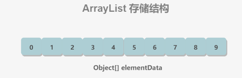
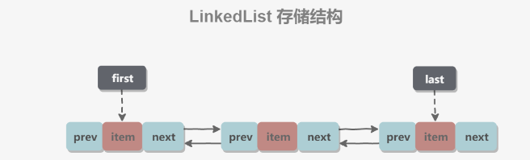
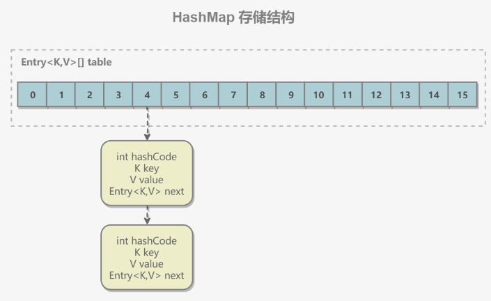
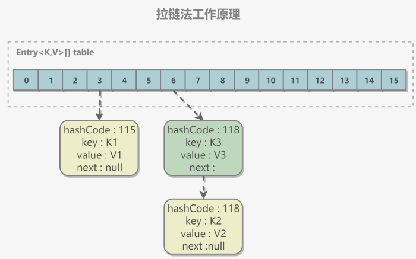
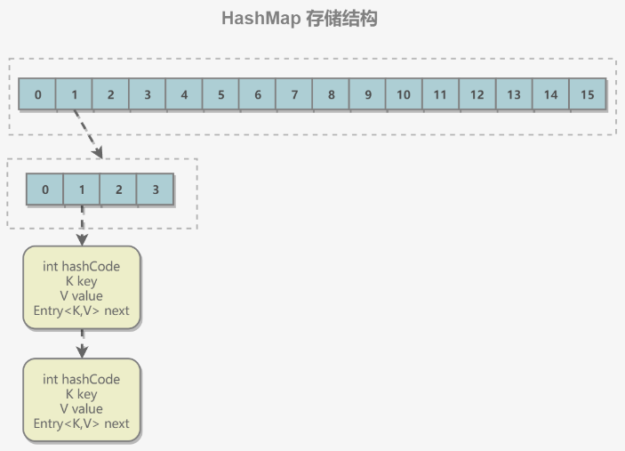

# Java集合篇

## 一、概览

集合主要包括 `Collection` 和 `Map` 两种

- `Collection` 存储着对象的集合
- 而 `Map` 存储着键值对（两个对象）的映射表

### Collection


#### 1. Set

- `TreeSet`：基于红黑树实现，支持有序性操作，例如根据一个范围查找元素的操作。但是查找效率不如 `HashSet`，`HashSet` 查找的时间复杂度为 `O(1)`，`TreeSet` 则为 `O(logN)`。
- `HashSet`：基于哈希表实现，支持快速查找，但不支持有序性操作。并且失去了元素的插入顺序信息，也就是说使用 `Iterator` 遍历 `HashSet` 得到的结果是不确定的。
- `LinkedHashSet`：具有 `HashSet` 的查找效率，并且内部使用双向链表维护元素的插入顺序。

#### 2. List

- `ArrayList`：基于动态数组实现，支持随机访问。
- `Vector`：和 `ArrayList` 类似，但它是线程安全的。
- `LinkedList`：基于双向链表实现，只能顺序访问，但是可以快速地在链表中间插入和删除元素。不仅如此，`LinkedList` 还可以用作栈、队列和双向队列。

#### 3. Queue

- `LinkedList`：可以用它来实现双向队列。
- `PriorityQueue`：基于堆结构实现，可以用它来实现优先队列

### Map


- `TreeMap`：基于红黑树实现。
- `HashMap`：基于哈希表实现。
- `HashTable`：和 `HashMap` 类似，但它是线程安全的，这意味着同一时刻多个线程同时写入 `HashTable` 不会导致数据不一致。它是遗留类，不应该去使用它，而是使用 `ConcurrentHashMap` 来支持线程安全，`ConcurrentHashMap` 的效率会更高，因为 `ConcurrentHashMap` 引入了分段锁。
- `LinkedHashMap`：使用双向链表来维护元素的顺序，顺序为插入顺序或者最近最少使用（LRU）顺序

## 二、集合中的设计模式

### 迭代器模式


`Collection` 继承了 `Iterable` 接口，其中的 `iterator()` 方法能够产生一个 `Iterator` 对象，通过这个对象就可以迭代遍历 `Collection` 中的元素。

```java
List<String> list = new ArrayList<>();
list.add("a");
list.add("b");
for (String item : list) {
    System.out.println(item);
}
```

### 适配器模式

`java.util.Arrays#asList()` 可以把数组类型转换为 `List` 类型。

```java
@SafeVarargs
public static <T> List<T> asList(T... a)
```

应该注意的是 `asList()` 的参数为泛型的可变参数，不能使用基本类型数组作为参数，只能使用相应的包装类型数组。

```java
Integer[] arr = {1, 2, 3};
List list = Arrays.asList(arr);
```

也可以使用以下方式调用 `asList()`

```java
List list = Arrays.asList(1, 2, 3);
```

## 三、源码分析

### ArrayList

#### 1. 概览

因为 `ArrayList` 是基于数组实现的，所以支持快速随机访问。`RandomAccess` 接口标识着该类支持快速随机访问。

```java
public class ArrayList<E> extends AbstractList<E>
        implements List<E>, RandomAccess, Cloneable, java.io.Serializable
```

数组的默认大小为 10。

```java
private static final int DEFAULT_CAPACITY = 10;
```



#### 2. 扩容

添加元素时使用 `ensureCapacityInternal()` 方法来保证容量足够，如果不够时，需要使用 `grow()` 方法进行扩容，新容量的大小为 `oldCapacity + (oldCapacity >> 1)`，即 `oldCapacity+oldCapacity/2`。其中 `oldCapacity >> 1` 需要取整，所以新容量大约是旧容量的 `1.5` 倍左右。（`oldCapacity` 为偶数就是 1.5 倍，为奇数就是 1.5 倍-0.5）

扩容操作需要调用 `Arrays.copyOf()` 把原数组整个复制到新数组中，这个操作代价很高，因此最好在创建 `ArrayList` 对象时就指定大概的容量大小，减少扩容操作的次数。

```java
public boolean add(E e) {
    ensureCapacityInternal(size + 1);  // 增加 mod 计数
    elementData[size++] = e;
    return true;
}

private void ensureCapacityInternal(int minCapacity) {
    if (elementData == DEFAULTCAPACITY_EMPTY_ELEMENTDATA) {
        minCapacity = Math.max(DEFAULT_CAPACITY, minCapacity);
    }
    ensureExplicitCapacity(minCapacity);
}

private void ensureExplicitCapacity(int minCapacity) {
    modCount++;
    // overflow-conscious code
    if (minCapacity - elementData.length > 0)
        grow(minCapacity);
}

private void grow(int minCapacity) {
    // overflow-conscious code
    int oldCapacity = elementData.length;
    int newCapacity = oldCapacity + (oldCapacity >> 1);
    if (newCapacity - minCapacity < 0)
        newCapacity = minCapacity;
    if (newCapacity - MAX_ARRAY_SIZE > 0)
        newCapacity = hugeCapacity(minCapacity);
    // minCapacity is usually close to size, so this is a win:
    elementData = Arrays.copyOf(elementData, newCapacity);
}
```

#### 3. 删除元素

需要调用 `System.arraycopy()` 将 `index+1` 后面的元素都复制到 `index` 位置上，该操作的时间复杂度为 `O(N)`，可以看到 `ArrayList` 删除元素的代价是非常高的。

```java
public E remove(int index) {
    rangeCheck(index);
    modCount++;
    E oldValue = elementData(index);
    int numMoved = size - index - 1;
    if (numMoved > 0)
        System.arraycopy(elementData, index+1, elementData, index, numMoved);
    elementData[--size] = null; // clear to let GC do its work
    return oldValue;
}
```

#### 4. 序列化

`ArrayList` 基于数组实现，并且具有动态扩容特性，因此保存元素的数组不一定都会被使用，那么就没必要全部进行序列化。

保存元素的数组 `elementData` 使用 `transient` 修饰，该关键字声明数组默认不会被序列化。

```java
transient Object[] elementData; // 非私有以简化嵌套类访问
```

`ArrayList` 实现了 `writeObject()` 和 `readObject()` 来控制只序列化数组中有元素填充那部分内容。

```java
private void readObject(java.io.ObjectInputStream s)
    throws java.io.IOException, ClassNotFoundException {
    elementData = EMPTY_ELEMENTDATA;

    // Read in size, and any hidden stuff
    s.defaultReadObject();

    // Read in capacity
    s.readInt(); // ignored

    if (size > 0) {
        // be like clone(), allocate array based upon size not capacity
        ensureCapacityInternal(size);

        Object[] a = elementData;
        // Read in all elements in the proper order.
        for (int i=0; i<size; i++) {
            a[i] = s.readObject();
        }
    }
}
private void writeObject(java.io.ObjectOutputStream s)
    throws java.io.IOException{
    // Write out element count, and any hidden stuff
    int expectedModCount = modCount;
    s.defaultWriteObject();

    // Write out size as capacity for behavioural compatibility with clone()
    s.writeInt(size);

    // Write out all elements in the proper order.
    for (int i=0; i<size; i++) {
        s.writeObject(elementData[i]);
    }

    if (modCount != expectedModCount) {
        throw new ConcurrentModificationException();
    }
}
```

序列化时需要使用 `ObjectOutputStream` 的 `writeObject()` 将对象转换为字节流并输出。而 `writeObject()` 方法在传入的对象存在 `writeObject()` 的时候会去反射调用该对象的 `writeObject()` 来实现序列化。反序列化使用的是 `ObjectInputStream` 的 `readObject()` 方法，原理类似。

```java
ArrayList list = new ArrayList();
ObjectOutputStream oos = new ObjectOutputStream(new FileOutputStream(file));
oos.writeObject(list);
```

#### 5. Fail-Fast

`modCount` 用来记录 `ArrayList` 结构发生变化的次数。结构发生变化是指添加或者删除至少一个元素的所有操作，或者是调整内部数组的大小，仅仅只是设置元素的值不算结构发生变化。

在进行序列化或者迭代等操作时，需要比较操作前后 `modCount` 是否改变，如果改变了需要抛出 `ConcurrentModificationException`。代码参考上面序列化中的 `writeObject()` 方法。

### CopyOnWriteArrayList

#### 1. 读写分离

写操作在一个复制的数组上进行，读操作还是在原始数组中进行，读写分离，互不影响。

写操作需要加锁，防止并发写入时导致写入数据丢失。

写操作结束之后需要把原始数组指向新的复制数组。

```java
public boolean add(E e) {
    final ReentrantLock lock = this.lock;
    lock.lock();
    try {
        Object[] elements = getArray();
        int len = elements.length;
        Object[] newElements = Arrays.copyOf(elements, len + 1);
        newElements[len] = e;
        setArray(newElements);
        return true;
    } finally {
        lock.unlock();
    }
}

final void setArray(Object[] a) {
    array = a;
}
@SuppressWarnings("unchecked")
private E get(Object[] a, int index) {
    return (E) a[index];
}
```

#### 2. 适用场景

`CopyOnWriteArrayList` 在写操作的同时允许读操作，大大提高了读操作的性能，因此很适合读多写少的应用场景。

但是 `CopyOnWriteArrayList` 有其缺陷：

- 内存占用：在写操作时需要复制一个新的数组，使得内存占用为原来的两倍左右；
- 数据不一致：读操作不能读取实时性的数据，因为部分写操作的数据还未同步到读数组中。

所以 `CopyOnWriteArrayList` 不适合内存敏感以及对实时性要求很高的场景。

### LinkedList

#### 1. 概览

基于双向链表实现，使用 `Node` 存储链表节点信息。

```java
private static class Node<E> {
    E item;
    Node<E> next;
    Node<E> prev;
}
```

每个链表存储了 `first` 和 `last` 指针：

```java
transient Node<E> first;
transient Node<E> last;
```



#### 2. 与 ArrayList 的比较

`ArrayList` 基于动态数组实现，`LinkedList` 基于双向链表实现。`ArrayList` 和 `LinkedList` 的区别可以归结为数组和链表的区别：

- 数组支持随机访问，但插入删除的代价很高，需要移动大量元素；
- 链表不支持随机访问，但插入删除只需要改变指针。

### HashMap

 JDK 1.7 为主

#### 1. 存储结构

内部包含了一个 `Entry` 类型的数组 `table`。`Entry` 存储着键值对。它包含了四个字段，从 `next` 字段我们可以看出 `Entry` 是一个链表。即数组中的每个位置被当成一个桶，一个桶存放一个链表。`HashMap` 使用拉链法来解决冲突，同一个链表中存放哈希值和散列桶取模运算结果相同的 `Entry`。



```java
transient Entry[] table;

static class Entry<K,V> implements Map.Entry<K,V> {
    final K key;
    V value;
    Entry<K,V> next;
    int hash;

    Entry(int h, K k, V v, Entry<K,V> n) {
        value = v;
        next = n;
        key = k;
        hash = h;
    }

    public final K getKey() {
        return key;
    }

    public final V getValue() {
        return value;
    }

    public final V setValue(V newValue) {
        V oldValue = value;
        value = newValue;
        return oldValue;
    }

    public final boolean equals(Object o) {
        if (!(o instanceof Map.Entry))
            return false;
        Map.Entry e = (Map.Entry)o;
        Object k1 = getKey();
        Object k2 = e.getKey();
        if (k1 == k2 || (k1 != null && k1.equals(k2))) {
            Object v1 = getValue();
            Object v2 = e.getValue();
            if (v1 == v2 || (v1 != null && v1.equals(v2)))
                return true;
        }
        return false;
    }

    public final int hashCode() {
        return Objects.hashCode(getKey()) ^ Objects.hashCode(getValue());
    }

    public final String toString() {
        return getKey() + "=" + getValue();
    }
}
```

#### 2. 拉链法的工作原理

```java
HashMap<String, String> map = new HashMap<>();
map.put("K1", "V1");
map.put("K2", "V2");
map.put("K3", "V3");
```

- 新建一个 `HashMap`，默认大小为 `16`；
- 插入 `<K1,V1>` 键值对，先计算 K1 的 hashCode 为 115，使用除留余数法得到所在的桶下标 115%16=3。
- 插入 `<K2,V2>` 键值对，先计算 K2 的 hashCode 为 118，使用除留余数法得到所在的桶下标 118%16=6。
- 插入 `<K3,V3>` 键值对，先计算 K3 的 hashCode 为 118，使用除留余数法得到所在的桶下标 118%16=6，插在 `<K2,V2>` 前面。

应该注意到链表的插入是以头插法方式进行的，例如上面的 `<K3,V3>` 不是插在 `<K2,V2>` 后面，而是插入在链表头部。

查找需要分成两步进行：

- 计算键值对所在的桶；
- 在链表上顺序查找，时间复杂度显然和链表的长度成正比



#### 3. put 操作

```java
public V put(K key, V value) {
    if (table == EMPTY_TABLE) {
        inflateTable(threshold);
    }
    // 键为 null 单独处理
    if (key == null)
        return putForNullKey(value);
    int hash = hash(key);
    // 确定桶下标
    int i = indexFor(hash, table.length);
    // 先找出是否已经存在键为 key 的键值对，如果存在的话就更新这个键值对的值为 value
    for (Entry<K,V> e = table[i]; e != null; e = e.next) {
        Object k;
        if (e.hash == hash && ((k = e.key) == key || key.equals(k))) {
            V oldValue = e.value;
            e.value = value;
            e.recordAccess(this);
            return oldValue;
        }
    }

    modCount++;
    // 插入新键值对
    addEntry(hash, key, value, i);
    return null;
}
```

`HashMap` 允许插入键为 `null` 的键值对。但是因为无法调用 `null` 的 `hashCode()` 方法，也就无法确定该键值对的桶下标，只能通过强制指定一个桶下标来存放。`HashMap` 使用第 0 个桶存放键为 `null` 的键值对。

```java
private V putForNullKey(V value) {
    for (Entry<K,V> e = table[0]; e != null; e = e.next) {
        if (e.key == null) {
            V oldValue = e.value;
            e.value = value;
            e.recordAccess(this);
            return oldValue;
        }
    }
    modCount++;
    addEntry(0, null, value, 0);
    return null;
}
```

使用链表的头插法，也就是新的键值对插在链表的头部，而不是链表的尾部。

```java
void addEntry(int hash, K key, V value, int bucketIndex) {
    if ((size >= threshold) && (null != table[bucketIndex])) {
        resize(2 * table.length);
        hash = (null != key) ? hash(key) : 0;
        bucketIndex = indexFor(hash, table.length);
    }

    createEntry(hash, key, value, bucketIndex);
}

void createEntry(int hash, K key, V value, int bucketIndex) {
    Entry<K,V> e = table[bucketIndex];
    // 头插法，链表头部指向新的键值对
    table[bucketIndex] = new Entry<>(hash, key, value, e);
    size++;
}
Entry(int h, K k, V v, Entry<K,V> n) {
    value = v;
    next = n;
    key = k;
    hash = h;
}
```

#### 4. 确定桶下标

很多操作都需要先确定一个键值对所在的桶下标。

```java
int hash = hash(key);
int i = indexFor(hash, table.length);
```

**4.1 计算 hash 值**

```java
final int hash(Object k) {
    int h = hashSeed;
    if (0 != h && k instanceof String) {
        return sun.misc.Hashing.stringHash32((String) k);
    }

    h ^= k.hashCode();

    // This function ensures that hashCodes that differ only by
    // constant multiples at each bit position have a bounded
    // number of collisions (approximately 8 at default load factor).
    h ^= (h >>> 20) ^ (h >>> 12);
    return h ^ (h >>> 7) ^ (h >>> 4);
}
public final int hashCode() {
    return Objects.hashCode(key) ^ Objects.hashCode(value);
}
```

**4.2 取模**

令 x = 1<<4，即 x 为 2 的 4 次方，它具有以下性质：

```text
x   : 00010000
x-1 : 00001111
```

令一个数 y 与 x-1 做与运算，可以去除 y 位级表示的第 4 位以上数：

```text
y       : 10110010
x-1     : 00001111
y&(x-1) : 00000010
```

这个性质和 y 对 x 取模效果是一样的：

```text
y   : 10110010
x   : 00010000
y%x : 00000010
```

我们知道，位运算的代价比求模运算小的多，因此在进行这种计算时用位运算的话能带来更高的性能。

确定桶下标的最后一步是将 `key` 的 `hash` 值对桶个数取模：`hash%capacity`，如果能保证 `capacity` 为 2 的 n 次方，那么就可以将这个操作转换为位运算。

```java
static int indexFor(int h, int length) {
    return h & (length-1);
}
```

#### 5. 扩容-基本原理

设 `HashMap` 的 `table` 长度为 M，需要存储的键值对数量为 N，如果哈希函数满足均匀性的要求，那么每条链表的长度大约为 `N/M`，因此查找的复杂度为 `O(N/M)`。

为了让查找的成本降低，应该使 `N/M` 尽可能小，因此需要保证 M 尽可能大，也就是说 `table` 要尽可能大。`HashMap` 采用动态扩容来根据当前的 N 值来调整 M 值，使得空间效率和时间效率都能得到保证。

和扩容相关的参数主要有：`capacity`、`size`、`threshold` 和 `load_factor`。

|    参数    | 含义                                                         |
| :--------: | :----------------------------------------------------------- |
|  capacity  | table 的容量大小，默认为 16。需要注意的是 capacity 必须保证为 2 的 n 次方。 |
|    size    | 键值对数量。                                                 |
| threshold  | size 的临界值，当 size 大于等于 threshold 就必须进行扩容操作。 |
| loadFactor | 装载因子，table 能够使用的比例，threshold = (int)(capacity* loadFactor)。 |

```java
static final int DEFAULT_INITIAL_CAPACITY = 16;

static final int MAXIMUM_CAPACITY = 1 << 30;

static final float DEFAULT_LOAD_FACTOR = 0.75f;

transient Entry[] table;

transient int size;

int threshold;

final float loadFactor;

transient int modCount;
```

从下面的添加元素代码中可以看出，当需要扩容时，令 `capacity` 为原来的两倍。

```java
void addEntry(int hash, K key, V value, int bucketIndex) {
    Entry<K,V> e = table[bucketIndex];
    table[bucketIndex] = new Entry<>(hash, key, value, e);
    if (size++ >= threshold)
        resize(2 * table.length);
}
```

扩容使用 `resize()` 实现，需要注意的是，扩容操作同样需要把 `oldTable` 的所有键值对重新插入 `newTable` 中，因此这一步是很费时的。

```java
void resize(int newCapacity) {
    Entry[] oldTable = table;
    int oldCapacity = oldTable.length;
    if (oldCapacity == MAXIMUM_CAPACITY) {
        threshold = Integer.MAX_VALUE;
        return;
    }
    Entry[] newTable = new Entry[newCapacity];
    transfer(newTable);
    table = newTable;
    threshold = (int)(newCapacity * loadFactor);
}

void transfer(Entry[] newTable) {
    Entry[] src = table;
    int newCapacity = newTable.length;
    for (int j = 0; j < src.length; j++) {
        Entry<K,V> e = src[j];
        if (e != null) {
            src[j] = null;
            do {
                Entry<K,V> next = e.next;
                int i = indexFor(e.hash, newCapacity);
                e.next = newTable[i];
                newTable[i] = e;
                e = next;
            } while (e != null);
        }
    }
}
```

#### 6. 扩容-重新计算桶下标

在进行扩容时，需要把键值对重新计算桶下标，从而放到对应的桶上。在前面提到，`HashMap` 使用 `hash%capacity` 来确定桶下标。`HashMap` `capacity` 为 2 的 n 次方这一特点能够极大降低重新计算桶下标操作的复杂度。

假设原数组长度 `capacity` 为 16，扩容之后 `new capacity` 为 32：

```html
capacity     : 00010000
new capacity : 00100000
```

对于一个 `Key`，它的哈希值 `hash` 在第 5 位：

- 为 0，那么 hash%00010000 = hash%00100000，桶位置和原来一致；
- 为 1，hash%00010000 = hash%00100000 + 16，桶位置是原位置 + 16。

#### 7. 计算数组容量

`HashMap` 构造函数允许用户传入的容量不是 2 的 n 次方，因为它可以自动地将传入的容量转换为 2 的 n 次方。

先考虑如何求一个数的掩码，对于 10010000，它的掩码为 11111111，可以使用以下方法得到：

```text
mask |= mask >> 1    11011000
mask |= mask >> 2    11111110
mask |= mask >> 4    11111111
```

`mask+1` 是大于原始数字的最小的 2 的 n 次方。

```text
num     10010000
mask+1 100000000
```

以下是 `HashMap` 中计算数组容量的代码：

```java
static final int tableSizeFor(int cap) {
    int n = cap - 1;
    n |= n >>> 1;
    n |= n >>> 2;
    n |= n >>> 4;
    n |= n >>> 8;
    n |= n >>> 16;
    return (n < 0) ? 1 : (n >= MAXIMUM_CAPACITY) ? MAXIMUM_CAPACITY : n + 1;
}
```

#### 8. 链表转红黑树

从 JDK 1.8 开始，一个桶存储的链表长度大于等于 8 时会将链表转换为红黑树。

#### 9. 与 Hashtable 的比较

- `Hashtable` 使用 `synchronized` 来进行同步。
- `HashMap` 可以插入键为 `null` 的 `Entry`。
- `HashMap` 的迭代器是 `fail-fast` 迭代器。
- `HashMap` 不能保证随着时间的推移 `Map` 中的元素次序是不变的。

### ConcurrentHashMap

#### 1. 存储结构



```java
static final class HashEntry<K,V> {
    final int hash;
    final K key;
    volatile V value;
    volatile HashEntry<K,V> next;
}
```

`ConcurrentHashMap` 和 `HashMap` 实现上类似，最主要的差别是 `ConcurrentHashMap` 采用了分段锁（Segment），每个分段锁维护着几个桶（HashEntry），多个线程可以同时访问不同分段锁上的桶，从而使其并发度更高（并发度就是 Segment 的个数）。

`Segment` 继承自 `ReentrantLock`。

```java
static final class Segment<K,V> extends ReentrantLock implements Serializable {

    private static final long serialVersionUID = 2249069246763182397L;

    static final int MAX_SCAN_RETRIES =
        Runtime.getRuntime().availableProcessors() > 1 ? 64 : 1;

    transient volatile HashEntry<K,V>[] table;

    transient int count;

    transient int modCount;

    transient int threshold;

    final float loadFactor;
}
final Segment<K,V>[] segments;
```

默认的并发级别为 16，也就是说默认创建 16 个 `Segment`。

```java
static final int DEFAULT_CONCURRENCY_LEVEL = 16;
```

#### 2. size 操作

每个 `Segment` 维护了一个 `count` 变量来统计该 `Segment` 中的键值对个数。

```java
/**
 * The number of elements. Accessed only either within locks
 * or among other volatile reads that maintain visibility.
 */
transient int count;
```

在执行 `size` 操作时，需要遍历所有 `Segment` 然后把 `count` 累计起来。

`ConcurrentHashMap` 在执行 `size` 操作时先尝试不加锁，如果连续两次不加锁操作得到的结果一致，那么可以认为这个结果是正确的。

尝试次数使用 `RETRIES_BEFORE_LOCK` 定义，该值为 2，`retries` 初始值为 -1，因此尝试次数为 3。

如果尝试的次数超过 3 次，就需要对每个 `Segment` 加锁。

```java
/**
 * Number of unsynchronized retries in size and containsValue
 * methods before resorting to locking. This is used to avoid
 * unbounded retries if tables undergo continuous modification
 * which would make it impossible to obtain an accurate result.
 */
static final int RETRIES_BEFORE_LOCK = 2;

public int size() {
    // Try a few times to get accurate count. On failure due to
    // continuous async changes in table, resort to locking.
    final Segment<K,V>[] segments = this.segments;
    int size;
    boolean overflow; // true if size overflows 32 bits
    long sum;         // sum of modCounts
    long last = 0L;   // previous sum
    int retries = -1; // first iteration isn't retry
    try {
        for (;;) {
            // 超过尝试次数，则对每个 Segment 加锁
            if (retries++ == RETRIES_BEFORE_LOCK) {
                for (int j = 0; j < segments.length; ++j)
                    ensureSegment(j).lock(); // force creation
            }
            sum = 0L;
            size = 0;
            overflow = false;
            for (int j = 0; j < segments.length; ++j) {
                Segment<K,V> seg = segmentAt(segments, j);
                if (seg != null) {
                    sum += seg.modCount;
                    int c = seg.count;
                    if (c < 0 || (size += c) < 0)
                        overflow = true;
                }
            }
            // 连续两次得到的结果一致，则认为这个结果是正确的
            if (sum == last)
                break;
            last = sum;
        }
    } finally {
        if (retries > RETRIES_BEFORE_LOCK) {
            for (int j = 0; j < segments.length; ++j)
                segmentAt(segments, j).unlock();
        }
    }
    return overflow ? Integer.MAX_VALUE : size;
}
```

#### 3. JDK 1.8 的改动

JDK 1.7 使用分段锁机制来实现并发更新操作，核心类为 `Segment`，它继承自重入锁 `ReentrantLock`，并发度与 `Segment` 数量相等。

JDK 1.8 使用了 `CAS` 操作来支持更高的并发度，在 `CAS` 操作失败时使用内置锁 `synchronized`。

并且 JDK 1.8 的实现也在链表过长时会转换为红黑树。

### LinkedHashMap

#### 存储结构

继承自 `HashMap`，因此具有和 `HashMap` 一样的快速查找特性。

```java
public class LinkedHashMap<K,V> extends HashMap<K,V> implements Map<K,V>
```

内部维护了一个双向链表，用来维护插入顺序或者 `LRU` 顺序。

```java
/**
 * The head (eldest) of the doubly linked list.
 */
transient LinkedHashMap.Entry<K,V> head;

/**
 * The tail (youngest) of the doubly linked list.
 */
transient LinkedHashMap.Entry<K,V> tail;
```

`accessOrder` 决定了顺序，默认为 `false`，此时维护的是插入顺序。

```java
final boolean accessOrder;
```

`LinkedHashMap` 最重要的是以下用于维护顺序的函数，它们会在 `put`、`get` 等方法中调用。

```java
void afterNodeAccess(Node<K,V> p) { }
void afterNodeInsertion(boolean evict) { }
```

#### afterNodeAccess()

当一个节点被访问时，如果 `accessOrder` 为 `true`，则会将该节点移到链表尾部。也就是说指定为 `LRU` 顺序之后，在每次访问一个节点时，会将这个节点移到链表尾部，保证链表尾部是最近访问的节点，那么链表首部就是最近最久未使用的节点。

```java
void afterNodeAccess(Node<K,V> e) { // move node to last
    LinkedHashMap.Entry<K,V> last;
    if (accessOrder && (last = tail) != e) {
        LinkedHashMap.Entry<K,V> p =
            (LinkedHashMap.Entry<K,V>)e, b = p.before, a = p.after;
        p.after = null;
        if (b == null)
            head = a;
        else
            b.after = a;
        if (a != null)
            a.before = b;
        else
            last = b;
        if (last == null)
            head = p;
        else {
            p.before = last;
            last.after = p;
        }
        tail = p;
        ++modCount;
    }
}
```

#### afterNodeInsertion()

在 `put` 等操作之后执行，当 `removeEldestEntry()` 方法返回 `true` 时会移除最晚的节点，也就是链表首部节点 `first`。

`evict` 只有在构建 `Map` 的时候才为 `false`，在这里为 `true`。

```java
void afterNodeInsertion(boolean evict) { // possibly remove eldest
    LinkedHashMap.Entry<K,V> first;
    if (evict && (first = head) != null && removeEldestEntry(first)) {
        K key = first.key;
        removeNode(hash(key), key, null, false, true);
    }
}
```

`removeEldestEntry()` 默认为 `false`，如果需要让它为 `true`，需要继承 `LinkedHashMap` 并且覆盖这个方法的实现，这在实现 `LRU` 的缓存中特别有用，通过移除最近最久未使用的节点，从而保证缓存空间足够，并且缓存的数据都是热点数据。

```java
protected boolean removeEldestEntry(Map.Entry<K,V> eldest) {
    return false;
}
```

#### LRU 缓存

以下是使用 `LinkedHashMap` 实现的一个 `LRU` 缓存：

- 设定最大缓存空间 `MAX_ENTRIES` 为 3；
- 使用 `LinkedHashMap` 的构造函数将 `accessOrder` 设置为 `true`，开启 `LRU` 顺序；
- 覆盖 `removeEldestEntry()` 方法实现，在节点多于 `MAX_ENTRIES` 就会将最近最久未使用的数据移除。

```java
class LRUCache<K, V> extends LinkedHashMap<K, V> {
    private static final int MAX_ENTRIES = 3;

    protected boolean removeEldestEntry(Map.Entry eldest) {
        return size() > MAX_ENTRIES;
    }

    LRUCache() {
        super(MAX_ENTRIES, 0.75f, true);
    }
}
public static void main(String[] args) {
    LRUCache<Integer, String> cache = new LRUCache<>();
    cache.put(1, "a");
    cache.put(2, "b");
    cache.put(3, "c");
    cache.get(1);
    cache.put(4, "d");
    System.out.println(cache.keySet());
}
[3, 1, 4]
```

## 其它

###  Java 中集合框架类关系图  
 整体分成两大体系： 
`key-value`体系`Map`
动态数组、链表、队列体系

**key-value体系Map**

**动态数组、链表、队列体系**


### 集合和数组有什么区别？  

- 数组是固定长度的；集合可变长度的。 
- 数组可以存储基本数据类型，也可以存储引用数据类型；集合只能存储引用数据类型。 
- 数组存储的元素必须是同一个数据类型；集合存储的对象可以是不同数据类型。  
### 怎么确保一个集合不能被修改？  
可以使用 `Collections. unmodifiableCollection(Collection c)` 方法来创建一个只读集合，这样改变集合的任 何操作都会抛出 `java. lang. UnsupportedOperationException` 异常  
```java
List<String> list = new ArrayList<>();
list.add("伟哥");
Collection<String> clist = Collections. unmodifiableCollection(list);
clist.add("伟哥天下第一"); // 运行时此行报错
System. out. println(list. size());
```
### Iterator 有什么特点？  
`Iterator` 的特点是只能单向遍历，但是更加安全，因为它可以确保，在当前遍历的集合元素被更改的时候，就会抛 出 `ConcurrentModificationException` 异常。  

> 比如，有时候我们需要遍历ArrayList，同时做修改的时候，用fo循环会出问题，此时，我们就可以用迭代器 来操作。  

### 如何边遍历边移除 Collection 中的元素？  
 唯一正确方式是使用	`Iterator.remove()`方法  
```java
Iterator<Integer> it = list.iterator();
while(it.hasNext()){
// do something*
it.remove();
}
```
### ArrayList底层数据结构是什么？  
数组
```java
transient Object[] elementData;
```
### 为什么 ArrayList 的 elementData 加上 transient 修饰？  
从`ArrayList` 的类定义可以看到	`ArrayList`	实现了 `Serializable`	接口，这意味着 `ArrayList`	支持序列化。`transient`	的作用是不希望  `elementData`	数组被序列化，重写了 `writeObject`	实现。
```java
//类定义
public class ArrayList<E> extends AbstractList<E>
	implements List<E>, RandomAccess, Cloneable, java.io.Serializable

//重写writeObject方法
private void writeObject(java.io.ObjectOutputStream s) throws java.io.IOException{
	*// Write out element count, and any hidden stuff*
	int expectedModCount = modCount;
	s.defaultWriteObject();
	*// Write out array length*
	s.writeInt(elementData.length);
	*// Write out all elements in the proper order.*
	for (int i=0; i<size; i++)
        s.writeObject(elementData[i]);
	if (modCount != expectedModCount) {
		throw new ConcurrentModificationException();
    }
```
> 每次序列化时，先调用 defaultWriteObject() 方法序列化	ArrayList	中的非	transient	元素，然后遍历 elementData，只序列化已存入的元素，这样既加快了序列化的速度，又减小了序列化之后的文件大小  

### 说说你对序列化的理解  
序列化（编码）是将对象序列化为二进制形式（字节数组），主要用于网络传输、数据持久化等；
而反序列化（解 码）则是将从网络、磁盘等读取的字节数组还原成原始对象，主要用于网络传输对象的解码，以便完成远程调用。  
### 既然有数组了，为什么还要有ArrayList？  
我们常说的数组是定死的数组，`ArrayList`	却是动态数组。  
`ArrayList`可以使用默认的大小，当元素个数到达一定程度后，会自动扩容  

### ArrayList有什么优缺点？  
优点：`ArrayList`是实现了基于动态数组的数据结构，因为地址连续，一旦数据存储好了，查询操作效率会比较高 		（在内存里是连着放的）。 
缺点：因为地址连续，`ArrayList`要移动数据，所以插入和删除操作效率比较低  

### LinkedList 底层数据结构是什么？  
`LinkedList`基于链表的数据结构，地址是任意的，所以在开辟内存空间的时候不需要等一个连续的地址。
对于新增 和删除操作，`LinkedList`比较占优势。
`LinkedList` 适用于要头尾操作或插入指定位置的场景。  

>  记得：双向链表  

```java
// 集合数量
transient int size = 0;
// 双向链表的表头
transient Node<E> first;
// 双向链表的表尾
transient Node<E> last;

private static class Node<E> {
	E item;
	//后继
	Node<E> next;
	//前驱
	Node<E> prev;
	Node(Node<E> prev, E element, Node<E> next) {
		this.item = element;
		this.next = next;
		this.prev = prev;
	}
}
```
### ArrayList 和 LinkedList 的区别是什么？  
**ArrayList **
优点：

- `ArrayList`是实现了基于动态数组的数据结构，因为地址连续，一旦数据存储好了，查询操作效率会比较 高（在内存里是连着放的）。 
- 缺点：因为地址连续，`ArrayList`要移动数据，所以插入和删除操作效率比较低。  

**LinkedList **
优点：

- `LinkedList`基于链表的数据结构，地址是任意的，所以在开辟内存空间的时候不需要等一个连续的地 址。对于新增和删除操作，`LinkedList`比较占优势。
- `LinkedList`适用于要头尾操作或插入指定位置的场景。 

缺点：

- 因为 `LinkedList` 要移动指针，所以查询操作性能比较低。  

**适用场景分析 **

- 当需要对数据进行对随机访问的时候，选用 `ArrayList`。 
- 当需要对数据进行多次增加删除修改时，采用 `LinkedList`。 

如果容量固定，并且只会添加到尾部，不会引起扩容，优先采用	`ArrayList`。
当然，绝大数业务的场景下，使用 `ArrayList` 就够了，但需要注意避免 `ArrayList` 的扩容，以及非顺序的插入。  

### ArrayList 线程安全吗？  
不是线程安全的  
### 多线程场景下如何使用 ArrayList？  
如果遇到多线程场景，可以通过 `Collections` 的 `synchronizedList` 方法将其转换成线程安全的容器后再使用  
```java
List<String> synchronizedList = Collections.synchronizedList(list);
synchronizedList.add("伟哥");
synchronizedList.add("伟哥天下第一");

for (int i = 0; i < synchronizedList.size(); i++) {
	System.out.println(synchronizedList.get(i));
}
```
### 说一下HashSet 的实现原理？  
`HashSet`	是基于 `HashMap` 实现的，`HashSet`的值存放于`HashMap`的`key`上，`HashMap`的`value`统一为`present`，因此 `HashSet`	的实现比较简单，相关	`HashSet`	的操作，基本上都是直接调用底层 `HashMap`	的相关方法来完成，`HashSet` 不允许重复的值。  

```java
//HashSet
private static final Object PRESENT = new Object();
private transient HashMap<E,Object> map;

public HashSet() {
	map = new HashMap<>();
}

public boolean add(E e) {
	return map.put(e, PRESENT)==null;
}
```
### 说一下HashMap底层数据结构？  
JDK7及之前，采用的是数组+链表。
JDK8开始采用的是数组+链表+红黑树。  
### 为什么要改成数组+链表+红黑树？  
主要是为了提升在 `hash` 冲突严重时（链表过长）的查找性能，使用链表的查找性能是 O(n)，而使用红黑树是 O(logn)。  
### 什么是哈希表？  
散列表 （Hash	table，也叫哈希表），是根据关键码值(Key	value)而直接进行访问的数据结构。也就是说，它通过 把关键码值映射到表中一个位置来访问记录，以加快查找的速度。这个映射函数叫做散列函数，存放记录的数组叫 做散列表。  
### 说一下HashMap的put过程？  

1. 接收要存储的键值对（K,V）
2. 根据key计算hash值
3. 根据hash值计算存储的数字的下标位置
4. 判断是否发送hash冲突
   1. 未发生则直接存入
5. 发生则判断当前节点数据结构是 红黑树 or 链表
6. 红黑树 则在红黑树中插入数据
7. 链表 则在链表尾部插入数据
8. 结束


### 使用HashMap时，当两个对象的 hashCode 相同怎么办？  
因为`HashCode`	相同，不一定就是相等的（`equals`方法比较），所以两个对象所在数组的下标相同，"碰撞"就此发 生。又因为	`HashMap`	使用链表存储对象，这个	`Node`	会存储到链表中。  
### HashMap的哈希函数怎么设计的吗？  
`hash` 函数是先拿到通过 `key` 的	`hashCode` ，是 32	位的	`int` 值，然后让	`hashCode` 的高 16 位和低 16 位进行异或操作。
两个好处： 

1. 一定要尽可能降低 `hash` 碰撞，越分散越好； 
2. 算法一定要尽可能高效，因为这是高频操作,因此采用位运算；  
### 为什么采用 hashcode 的高 16 位和低 16 位异或能降低 hash 碰撞？  
因为	key.hashCode()函数调用的是 key 键值类型自带的哈希函数，返回 int 型散列值。 int 值范围为 -2147483648~2147483647，前后加起来大概	40 亿的映射空间。
只要哈希函数映射得比较均匀松散，一般应用是很难出现碰撞的。
但问题是一个 40 亿长度的数组，内存是放不下的。 
HashMap	数组的初始大小才 16，用之前需要对数组的长度取模运算，得到的余数才能用来访问数组下标。  
### 解决hash冲突的有几种方法？  
**1、再哈希法：**如果hash出的index已经有值，就再hash，不行继续hash，直至找到空的index位置，要相信瞎猫总 能碰上死耗子。这个办法最容易想到。但有2个缺点： 比较浪费空间，消耗效率。根本原因还是数组的长度是固定不变的，不断hash找出空的index，可能越界，这 时就要创建新数组，而老数组的数据也需要迁移。随着数组越来越大，消耗不可小觑。 get不到，或者说get算法复杂。进是进去了，想出来就没那么容易了。 
**2、开放地址方法：**如果hash出的index已经有值，通过算法在它前面或后面的若干位置寻找空位，这个和再hash算法差别不大。 
**3、建立公共溢出区：** 把冲突的hash值放到另外一块溢出区。 
**4、链式地址法：** 把产生hash冲突的hash值以链表形式存储在index位置上。HashMap用的就是该方法。优点是不需 要另外开辟新空间，也不会丢失数据，寻址也比较简单。但是随着hash链越来越长，寻址也是更加耗时。好的hash 算法就是要让链尽量短，最好一个index上只有一个值。也就是尽可能地保证散列地址分布均匀，同时要计算简 单。

### 为什么 HashMap 采用拉链法而不是开放地址法？  
我认为 `Java` 给予 `HashMap` 的定位是一个相对通用的散列表容器，它应该在面对各种输入的时候都表现稳定。而开 发地址法相对来说容易出现数据堆积，在数据量较大时可能出现连续冲突的情况，性能不够稳定。  
### 为什么要用异或运算符？  
保证了对象的 `hashCode` 的 32 位值只要有一位发生改变，整个	`hash()` 返回值就会改变。尽可能的减少碰撞  
### 为什么要做那么多扰动处理？  
在`HashMap`中，有个`hash()`方法，也叫扰动函数。  
```java
static final int hash(Object key) {
	int h;
	return (key == null) ? 0 : (h = key.hashCode()) ^ (h >>> 16);
}
```
`key.hashCode()` ，获取`key`的`hashCode`值，如果不进行重写的话返回的是根据内存地址得到的一个`int`值。 `key.hashCode()` 获取到的`hashcode`无符号右移16位并和元`hashCode`进行 `^` ，这样做的目的是为了让高位与低进 行混合，让两者都参与运算，以便让`hash`值分布更加均匀。  

### HashMap的 table 的容量如何确定？  

- `table` 数组大小是由 `capacity` 这个参数确定的，默认是16，也可以构造时传入，最大限制是`1<<30；`
- `loadFactor` 是装载因子，主要目的是用来确认table 数组是否需要动态扩展，默认值是0.75，比如table 数组大 小为 16，装载因子为 0.75 时，`threshold` 就是12，当	`table` 的实际大小超过 12 时，`table`就需要动态扩容； 
- 扩容时，调用	`resize()` 方法，将 `table` 长度变为原来的两倍（注意是 `table` 长度，而不是	`threshold`）； 
- 如果数据很大的情况下，扩展时将会带来性能的损失，在性能要求很高的地方，这种损失很可能很致命。 
### 默认加载因子为什么是0.75？   
负载因子为`0.75f` 是空间与时间的均衡 

因为`HashMap`的容量一定是2的幂次，与0.25、0.5、0.75、1相乘刚好是一个整数，0.25太小了不考虑

如果负载因子小，意味着阈值变小。比如容量为16 的 HashMap ，负载因子为0.5f，也就是当阈值为8，那么存储8 个就会扩容到32，出现哈希冲突的可能性变小，但是空间利用率不高。适用于有足够内存并要求查询效率的场景。 

相反如果阈值为1，那么容量为16，就必须存储16个元素才进行扩容，出现冲突的概率变大，极端情况下可能会从 O(1)退化到O(n)。适用于内存敏感但不要求要求查询效率的场景。  

### HashMap 的长度为什么是 2 的 N 次方呢？  
为了能让 `HashMap` 存数据和取数据的效率高，尽可能地减少 hash 值的碰撞 
我们首先可能会想到 `%` 取模的操作来实现。
取余（`%`） 操作中如果除数是 2 的幂次，则等价于与其除数减一的与（&）操作（也就是说 `hash % length == hash &(length - 1 )` 的前提是 `length` 是 2 的 n 次方）。并且，采用二进制位操作 &，相对于 % 能够提高运算效 率。 

注意到 `HashMap` 初始化长度用的是 `1<<4`，而不是直接写 16。这是为啥呢？其实这样是为了位运算的方便，「位 与运算比算数计算的效率高太多了   

长度 16 或者其他 2 的幂，`length - 1` 的值是所有二进制位全为 1, 这种情况下，`index` 的结果等同于 `hashcode` 后几位的值，只要输入的 `hashcode` 本身分布均匀，`hash` 算法的结果就是均匀的  

### HashMap 最大容量是多少，为什么？  
`HashMap` 最大容量是 `1 << 30`  

```java
static final int MAXIMUM_CAPACITY = 1 << 30;
```
`int`占四个字节，一个字节占8位，所以是32位整型，也就是说最多32位。那按理说，最大数可以向左移 动31位即2的31次幂，在这里为什么不是2的31次方呢？实际上，二进制数的最左边那一位是符号位，用来表示正 负的，所以，`HashMap`最大容量是`1	<<	30`  

### HashMap为什么用数组而不用ArrayList？  
重点是使用数组可以自定义扩容机制，采用基本数组结构，扩容机制可以自己定义，`HashMap`中数组扩容刚好是2 的次幂，在做取模运算的效率高。	

`ArrayList`底层也是数组，但是扩容机制是1.5倍扩容  

### 当链表长度 >= 8时，为什么要将链表转换成红黑树？  
因为红黑树的平均查找长度是`log(n)`，链表的平均查找长度未`2\n`
长度为8的时候，红黑树平均查找长度为3，链表平均查找长度为4，所以，当链表长度 >= 8时 ，有必要将链表转换成红黑树  

### new	HashMap(12);此时HashMap初始容量为多少？  
容量为16。 
在 `HashMap` 中有个静态方法 `tableSizeFor()` ， `tableSizeFor()` 方法保证函数返回值是大于等于给定参数 `initi alCapacity` 最小的2的幂次方的数值 。  

```java
static final int tableSizeFor(int cap) {
	int n = cap - 1;
	n |= n >>> 1;
	n |= n >>> 2;
	n |= n >>> 4;
	n |= n >>> 8;
	n |= n >>> 16;
	return (n = MAXIMUM_CAPACITY) ? MAXIMUM_CAPACITY : n + 1;
}

```
### 说HashMap的resize()扩容过程  
创建一个新的数组，其容量为旧数组的两倍，并重新计算旧数组中结点的存储位置。

结点在新数组中的位置只有两 种，原下标位置或原下标+旧数组的大小。 


### 说说HashMap中get()方法是如何实现的？  
对`key`的`hashCode`进行`hash`值计算，与运算计算下标获取`bucket`位置，如果在桶的首位上就可以找到就直接返回， 否则在树中找或者链表中遍历找，如果有`hash`冲突，则利用`equals`方法去遍历链表查找节点。  
### 为什么 HashMap 用红黑树而不是平衡二叉树？  
红黑树和平衡二叉树的区别在于它们的平衡强弱不同： 

- 平衡二叉树追求的是一种完全平衡的状态，它的定义是任何结点的左右子树的高度差不会超过 1，这样的优势 是树的结点是很平均分配的； 
- 红黑树不追求这种完全平衡，而是追求一种弱平衡的状态，就是让整个树最长路径不会超过最短路径的 2 倍。 这样的话，红黑树虽然牺牲了一部分查找的性能效率，但是能够换取一部分维持树平衡状态的成本。 

而我们知道 HashMap 的设计定位应该是一个相对通用的散列表，那么它的设计者会希望这样一个数据结构应该具 备更强大的稳定性，因此它才选择了红黑树  
### 说说你对红黑树的了解  
红黑树是一种自平衡的二叉查找树，是一种高效的查找树。 
红黑树通过如下的性质定义实现自平衡： 

- 节点是红色或黑色。 
- 根是黑色。 
- 所有叶子都是黑色（叶子是NIL节点）。 
- 每个红色节点必须有两个黑色的子节点。（从每个叶子到根的所有路径上不能有两个连续的红色节点。） 
- 从任一节点到其每个叶子的所有简单路径都包含相同数目的黑色节点（简称黑高）。  
### JDK8中，相对JDK7对HashMap做了哪些改变？  
JDK1.7及之前：

数组+链表；创建一个链表数组，数组中每一格就是一个链表。若遇到哈希冲突，则将冲突的值加到 链表中即可。 

JDK1.8：

数组+链表+红黑树； jdk1.8在解决哈希冲突时，当链表长度大于阈值（默认为8）并且结点总数超过64时，将链表转化为红黑树，以减少搜索时间。 

`resize`扩容优化；引入了红黑树，目的是避免单条链表过长而影响查询效率；  

### 为什么Integer，String	适合作HashMap的key呢？  
`Integer`和	`String` 的好处在于`hash` 出来的值不会改变。如果是一个对象，那么他们可能会因为内部引用的改变而 `hashCode` 值的改变，会导致存储重复的数据或找不到数据的情况。  

### HashMap中的 key 我们可以使用任何类作为 key 吗？  
平时使用的最多的就是使用`String`作为`HashMap`的`key`，但是现在我们想使用某个自定 义类作为 `HashMap`	的	`key`，那就需要注意以下几点： 

- 如果类重写了`equals`	方法，它也应该重写	`hashCode`方法。 
- 类的所有实例需要遵循与`equals`和`hashCode`相关的规则。 
- 如果一个类没有使用	`equals`，你不应该在	`hashCode`中使用它。 
- 咱们自定义`key`	类的最佳实践是使之为不可变的，这样，`hashCode`	值可以被缓存起来，拥有 更好的性能。不可变的类也可以确保	`hashCode`和`equals`在未来不会改变，这样就会解决与可变相关的问题 了。  
### 为什么重写 equals	方法的时，需要重写 hashCode 方法呢？  
`hashCode`和`equals`两个方法是用来协同判断两个对象是否相等的，采用这种方式的原因是可以提高程序插入和查 询的速度，如果在重写	`equals`时，不重写`hashCode`，就会导致在某些场景下，例如将两个相等的自定义对象存储 在`Set`集合时，就会出现程序执行的异常，为了保证程序的正常执行，所以我们就需要在重写`equals`时，也一并重 写`hashCode`方法才行。  

### 说说什么是 fail-fast？  
`fail-fast`机制是`Java`集合（ Collection ）中的一种错误机制。

当多个线程对同一个集合的内容进行 操作时，就可 能会产生`fail-fast`事件。 

例如：当某一个线程	A通过iterator去遍历某集合的过程中，若该集合的内容被其他线程所改变 了，那么线程	A访 问集合时，就会抛出 `ConcurrentModificationException` 异常，产生	`fail-fast`事 件。

这里的操作主要是指	`add`、 `remove`	和`clear`，对集合元素个数进行修改。  

**解决办法**
建议使用 `java.util.concurrent` 包下的类”去取代“ `java.util` 包下的类”。 

可以这么理解：

在遍历之前，把 `modCount` 记下来 `expectModCount` ，后面 `expectModCount` 去 和 `modCount` 进 行比较，如果不相等了，证明已并发了，被修改了，于是抛出 `ConcurrentModificationException` 异常。  


