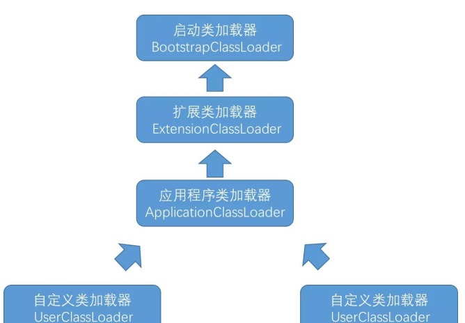
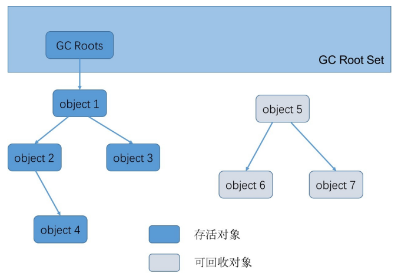

# JVM

## 一、类加载

### 类加载机制

编写的 `Java` 代码需要经过编译器编译为 `class` 文件

代码编译为 `class` 文件后，需要通过类加载器把 `class` 文件加载到虚拟机中才能运行和使用

### 类加载步骤

类从被加载到内存到使用完成被卸载出内存，需要经历

**加载、验证、准备、解析、初始化、使用、卸载**

> 验证、准备、解析统称为连接

#### （1）加载

在加载阶段，虚拟机主要完成三件事情

① 通过一个类的全限定名（比如 com.danny.framework.t）来获取定义该类的二进制流；

② 将这个字节流所代表的静态存储结构转化为方法区的运行时存储结构； 

③ 在内存中生成一个代表这个类的 `java.lang.Class` 对象，作为程序访问方法区中这个类的外部接口。

> **JVM在什么情况下会加载一个类？**  也就是说，啥时候会从“`.class`”字节码文件中加载这个类到`JVM`内存里来
>
> 在你的代码中用到这个类的时候 
>
> 1. 首先你的代码中包含“`main()`”方法的主类一定会在`JVM`进程启动之后被加载到内存，开始执行你的“`main()`”方法中的代码 
> 2. 接着遇到你使用了别的类，比如“`ReplicaManager`”，此时就会从对应的“`.class`”字节码文件加载对应的类到内存里来。

#### （2）验证

验证的目的是为了确保 `class` 文件的字节流包含的内容符合虚拟机的要求，且不会危害虚拟机的安全

#### （3）准备

正式为【类变量】分配内存并设置类变量【初始值】，这些变量所使用的内存都分配在方法区

> 注意：
>
> - 分配内存的对 象是“类变量”而不是实例变量
> - 是分配初始值，而不是赋值
> - 但是加上`final`关键字，比如`public static final int value=123;`在准备阶段会初始化`value`的值为`123`；

一般数值类型的初始值都为`0`

`char`类型的初始值 为'`\u0000`'（常量池中一个表示`Nul`的字符串）

`boolean`类型初始值为`false`

引用类型初始值为`null`。

#### （4）解析

解析是将常量池中【符号引用】替换为【直接引用】的过程。

##### 符号引用

符号引用是以一组符号来描述所引用的目标

符号引用与虚拟机实现的内存布局无关，引用的目标不一定已经加载到内存中。

比如在 `com.danny.framework.LoggerFactory` 类引用了 `com.danny.framework.Logger` ，但在编译期 间是不知道 `Logger` 类的内存地址的，所以只能先用 `com.danny.framework.Logger` （假设是这个，实际上是由类似于 `CONSTANT_Class_info` 的常量来表示的）来表示 `Logger` 类的地址，这就是符号引用。

##### 直接引用

直接引用可以是直接指向目标的指针、相对偏移量或是一个能间接定位到目标的句柄。

直接引用和虚拟机实现的内存布局有关，如果有了直接引用，那引用的目标一定在内存中存在。 

> 解析的时候 `class` 已经被加载到方法区的内存中，因此要把符号引用转化为直接引用，也就是能直接找到该类实际内存地址的引用。

#### （5）初始化

执行类的初始化代码  

比如：赋值、 static静态代码块  

> 如果初始化一个类的时候，发现他的父类还没初始化，那么必须先初始化他的父类

1. 初始化顺序
2. 父类静态变量
3. 父类静态代码块
4. 子类静态变量
5. 子类静态代码块
6. 父类非静态变量
7. 父类非静态代码块
8. 父类构造函数
9. 子类非静态变量
10. 子类非静态代码块
11. 子类构造函数

### 类加载器

#### 类加载器的作用

- 加载 `class`
- 确定类的唯一性

##### 加载 class

类加载的加载阶段的第一个步骤，就是通过类加载器来完成的

类加载器的主要任务就是 “ 通过 一个类的全限定名来获取描述此类的二进制字节流 ”

> 在这里，类加载器加载的二进制流并不一定要从 `class` 文件中获取，还可以从其他格式如`zip`文件中读取、从网络或数据库中读取、运行时动态生成、由其他文件生 成（比如 `jsp` 生成 `class` 类文件）等。 

从程序员的角度来看，类加载器动态加载`class`文件到虚拟机中，并生成一个 `java.lang.Class` 实例，每个实例 都代表一个 `java` 类，可以根据该实例得到该类的信息，还可以通过`newInstance()`方法生成该类的一个对象。

##### 确定类的唯一性

对于每一个类，都需要由加载它的加载器和这个类本身共同确立这个类在 Java 虚拟机中的唯一性

两个相同的类，只有是在同 一个加载器加载的情况下才 “ 相等 ”

> 这里的 “ 相等 ” 是指代表类的 `Class` 对象的 `equals()` 方法、 `isAssignableFrom()` 方法、 `isInstance()` 方法的返回结果，也包括 `instanceof` 关键字对对象所属关系的 判定结果

#### 类加载器的分类

- 启动类加载器（Bootstrap ClassLoader）
- 扩展类加载器 （Extension ClassLoader）
- 应用程序类加载器（Application ClassLoader）
- 自定义类加载器（User ClassLoader）

> 其中启动类加载器属于 `JVM` 的一部分
>
> 其他类加载器都用 `java` 实现，并且最终都继承自 `java.lang.ClassLoader` 

##### 启动类加载器

启动类加载器主要负责加载 `JAVA_HOME\lib` 目录或者被 `-Xbootclasspath` 参数指定目录中的部分类

具体加载哪些类可以通过 `System.getProperty("sun.boot.class.path")` 来查看。

##### 扩展类加载器

负责加载 `JAVA_HOME\lib\ext` 目录或者被 `java.ext.dirs` 系统变量指定的路径中的所有类库

可以通过 `System.getProperty("java.ext.dirs")` 来查看具体都加载哪些类

##### 应用程序类加载器

负责加载用户类路径（我们通常指定的 `classpath`）上的类

如果程序中没有自定义类加载器，应用程序类加载器就是程序**默认**的类加载器。

##### 自定义类加载器

`JVM` 提供的类加载器只能加载指定目录的类（`jar` 和 `class`），如果我们想从其他地方甚至网络上获取 `class` 文件，就需要自定义类加载器来实现

自定义类加载器主要都是通过继承 `ClassLoader` 或者它的子类来实现，但无论是通过继承 `ClassLoader` 还是它的子类，最终自定义类加载器的父加载器都是**应用程序类加载器**

因为不管调用哪个父类加载器，创建的对象都必须最终调用 `java.lang.ClassLoader.getSystemClassLoader()` 作为父加载器， `getSystemClassLoader()` 方法的返回值是 `sun.misc.Launcher.AppClassLoader` 即应用程序类加载器。

### 双亲委派机制

> 避免重复加载某一个类，保证类的唯一性

就是当一个类加载器加载类的时候，如果有父加载器就先尝试让父加载器加载

如果父加载器还有父加载器就一直往上抛，一直把类加载的任务交给启动类加载器

然后启动类加载器如果加载不到类就会抛出 `ClassNotFoundException` 异常，之后把类加载的任务往下抛

> 双亲委派模型要求除了顶层的启动类加载器之外，其他的类加载器都应该有一个父类加载器
>
> 但是这种父子关系并不是继承关系，而是像上面代码所示的组合关系

## 二、JVM内存区域

`Java`虚拟机在运行时，会把内存空间分为若干个区域

Java虚拟机所管理的内存区域分为如下部分：

- 方法区
- 堆内存：存放对象和数组
  - 年轻代
  - 老年代
  - 永久代（方法区）
- 虚拟机栈
- 本地方法栈
- 程序计数器

### 方法区

用于存储虚拟机加载的类信息、常量、静态变量，以及编译器编译后的代码等数据

> `jdk1.8`中，方法区已经不存在，原方法区中存储的类信息、编译后的代码数据等已经移动到了元空间

元空间并没有处于堆内存上，而是直接占用的本地内存

#### 去除永久代的原因

（1）字符串存在永久代中，容易出现性能问题和内存溢出。 

（2）类及方法的信息等比较难确定其大小，因此对 于永久代的大小指定比较困难，太小容易出现永久代溢出，太大则容易导致老年代溢出。 

（3）永久代会为 `GC` 带来不必要的复杂度，并且回收效率偏低

### 堆内存

存放我们在代码中创建的各种对象 

堆还可以分为

- 新生代（YoungGeneration）
- 老年代（OldGeneration）

### 虚拟机栈

调用执行任何方法时，都会给方法创建栈帧然后入栈, 方法执行完毕之后就出栈

每个线程都有自己的Java虚拟机栈  

### 本地方法栈

本地方法栈与虚拟机栈的区别是，虚拟机栈执行的是 `Java` 方法，本地方法栈执行的是本地方法（`Native Method`）

### 程序计数器

程序计数器就是用来记录当前执行的字节码指令的位置的，也就是记录目前执行到了哪一条字节码指令

每个线程都有一个独立的程序计数器

程序计数器是`Java`虚拟机规定的唯一不会发生内存溢出 的区域

### 元空间

`jdk1.8` 中，已经不存在永久代（方法区），替代它的一块空间叫做 “ 元空间 ”

和永久代类似，都是 `JVM` 规范对方法区的实现，但是元空间并不在虚拟机中，而是使用本地内存，元空间的大小仅受本地内存限制，但 可以通过 -`XX:MetaspaceSize` 和 `-XX:MaxMetaspaceSize` 来指定元空间的大小。

## 三、JVM垃圾回收机制

垃圾回收，就是通过垃圾收集器把内存中没用的对象清理掉。

垃圾回收涉及到的内容有： 

1. 判断对象是否已死； 
2. 选择垃圾收集算法； 
3. 选择垃圾收集的时间； 
4. 选择适当的垃圾收集器清理垃圾 （已死的对象）;

### 判断对象是否已死

判断对象是否已死有引用计数算法和可达性分析算法。

#### （1）引用计数算法

给每一个对象添加一个引用计数器，每当有一个地方引用它时，计数器值加 1；

每当有一个地方不再引用它时，计 数器值减 1；

这样只要计数器的值不为 0，就说明还有地方引用它，它就不是无用的对象。

> 这种方法看起来非常简单，但目前许多主流的虚拟机都没有选用这种算法来管理内存
>
> 原因就是当某些对象之间互 相引用时，无法判断出这些对象是否已死

#### （2）可达性分析算法

了解可达性分析算法之前先了解一个概念——`GC Roots` 垃圾收集的起点

可以作为 `GC Roots` 的有

- 虚拟机栈中本地变量表中引用的对象
- 方法区中静态属性引用的对象
- 方法区中常量引用的对象
- 本地方法栈中 JNI（Native 方 法）引用的对象

 当一个对象到 `GC Roots` 没有任何引用链相连（`GC Roots` 到这个对象不可达）时，就说明此对象是不可用的，是死对象

上面被判了死刑的对象（object5、object6、object7）并不是必死无疑，还有挽救的余地。

进行可达性分析后对象和 `GC Roots` 之间没有引用链相连时，对象将会被进行一次标记，接着会判断如果对象没有覆盖 `Object`的 `finalize()` 方法或者 `finalize()` 方法已经被虚拟机调用过，那么它们就会被行刑（清除）；

如果对象覆盖了 `finalize()` 方法且还没有被调用，则会执行 `finalize()` 方法中的内容，所以在 `finalize()` 方法中如果重新与 `GC Roots` 引用链上的对象关联就可以拯救自己，但是一般不建议这么做

> 建议大家完全可以忘掉这个方法

#### （3）方法区回收

上面说的都是对堆内存中对象的判断，方法区中主要回收的是废弃的常量和无用的类。 

判断常量是否废弃可以判断是否有地方引用这个常量，如果没有引用则为废弃的常量。 

判断类是否废弃需要同时满足如下条件： 

- 该类所有的实例已经被回收（堆中不存在任何该类的实例）。 
- 加载该类的 ClassLoader 已经被回收。 
- 该类对应的 `java.lang.Class` 对象在任何地方没有被引用（无法通过反射访问该类的方法）。

### 常用垃圾回收算法

常用的垃圾回收算法有三种

- 标记-清除算法
- 复制算法
- 标记-整理算法

#### （1）标记-清除算法

分为标记和清除两个阶段

首先标记出所有需要回收的对象，标记完成后统一回收所有被标记的对象

缺点：

1. 标记和清除两个过程效率都不高；
2. 标记清除之后会产生大量不连续的内存碎片

#### （2）复制算法

把内存分为大小相等的两块，每次存储只用其中一块，当这一块用完了，就把存活的对象全部复制到另一块上

同时把使用过的这块内存空间全部清理掉，往复循环

缺点：

实际可使用的内存空间缩小为原来的一半。

#### 复制算法优化

实际上真正的复制算法会做出如下优化，把内存区域划分为三块

1个Eden区，2个Survivor区

其中Eden区占80%内存空间，每一块Survivor区各占10%内存空间

比如说Eden区有800MB内存，每 一块Survivor区就100MB内存  

平时可以使用的，就是Eden区和其中一块Survivor区，那么相当于就是有900MB的内存是可以使用的

- 刚开始对象都是分配在Eden区内的，如果Eden区快满了，此时就会触发垃圾回收 
- 此时就会把Eden区中的存活对象都一次性转移到一块空着的Survivor区。
- 接着Eden区就会被清空，然后再次分配新对象到Eden区里， 
- 然后就会如上图所示，Eden区和一块Survivor区里是有对象的，其中Survivor区里放的是上一次Minor GC后存活的对象。 
- 如果下次再次Eden区满，那么再次触发Minor GC，就会把Eden区和放着上一次Minor GC后存活对象的Survivor区内的存活对象，转移到另外一块Survivor区去  
- **始终保持一块Survivor区是空着的**，就这样一直**循环使用这三 块内存区域。**

#### （3）标记-整理算法

先对可用的对象进行标记，然后所有被标记的对象向一段移动，最后清除可用对象边界以外的内存

#### （4）分代收集算法

把堆内存分为新生代和老年代，新生代又分为 Eden 区、From Survivor 和 To Survivor。

一 般新生代中的对象基本上都是朝生夕灭的，每次只有少量对象存活，因此采用复制算法，只需要复制那些少量存活的对象就可以完成垃圾收集；

老年代中的对象存活率较高，就采用标记-清除和标记-整理算法来进行回收。

## 垃圾回收的几种情况

大多数情况下，新的对象都分配在Eden区，当 Eden 区没有空间进行分配时，将进行一次 Minor GC，清理 Eden 区中的无用对象。

清理后，Eden 和 From Survivor 中的存活对象如果小于To Survivor 的可用空间则进 入To Survivor，否则直接进入老年代）；

Eden 和 From Survivor 中还存活且能够进入 To Survivor 的对象年 龄增加 1 岁

> （虚拟机为每个对象定义了一个年龄计数器，每执行一次 Minor GC 年龄加 1），当存活对象的年 龄到达一定程度（默认 15 岁）后进入老年代，可以通过 `-XX:MaxTenuringThreshold` 来设置年龄的值。 

当进行了 Minor GC 后，Eden 还不足以为新对象分配空间（那这个新对象肯定很大），新对象直接进入老年代。 

占 To Survivor 空间一半以上且年龄相等的对象，大于等于该年龄的对象直接进入老年代

比如 Survivor 空 间是 10M，有几个年龄为 4 的对象占用总空间已经超过 5M，则年龄大于等于 4 的对象都直接进入老年代， 不需要等到 `MaxTenuringThreshold` 指定的岁数。 

- 在进行 Minor GC 之前，会判断老年代最大连续可用空间是否大于新生代所有对象总空间

  - 如果大于，说明 Minor GC 是安全的

  - 否则会判断是否允许担保失败
    - 如果允许，判断老年代最大连续可用空间是否大于历次晋升到老年代的对象的平均大小
      - 如果大于，则执行 Minor GC，否则执行 Full GC。 
      - 如果经过 Full GC 还无法满足存放新数据的需求，就会抛出 内存溢出异常。

当在 java 代码里直接调用 `System.gc()` 时，会建议 `JVM` 进行 `Full GC`，但一般情况下都会触发 `Full GC`，一般 不建议使用，尽量让虚拟机自己管理 `GC` 的策略。 

大对象（需要大量连续内存的对象）例如很长的数组，会直接进入老年代，如果老年代没有足够的连续大空间来存放，则会进行 `Full GC`。
