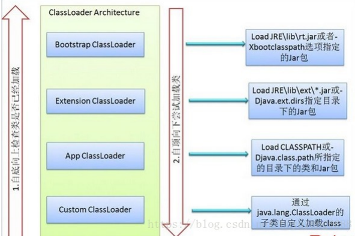
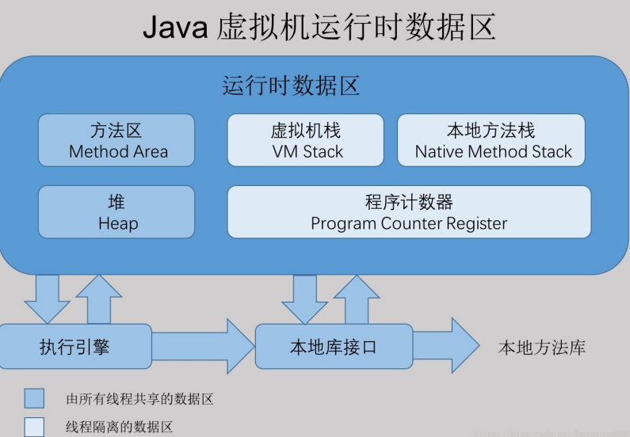
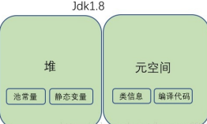
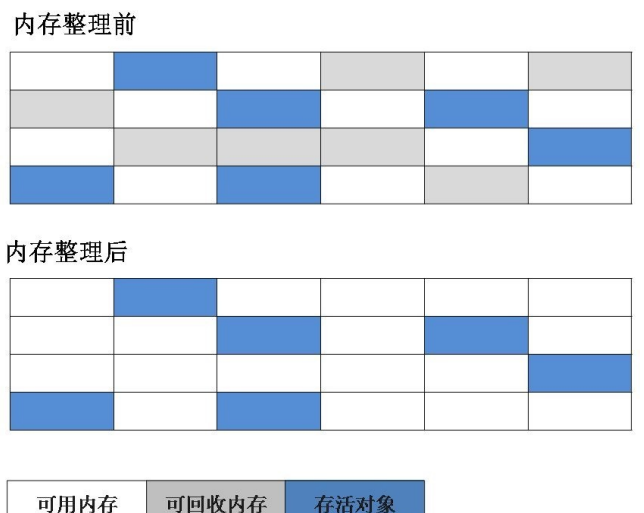
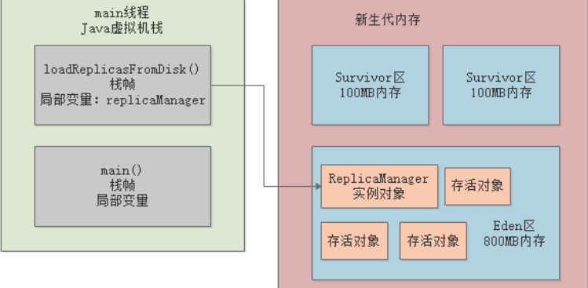

# JVM

## 一、类加载机制

类是在运行期间第一次使用时动态加载的，而不是一次性加载所有类。因为如果一次性加载，那么会占用很多的内存。

编写的 `Java` 代码需要经过编译器编译为 `class` 文件

代码编译为 `class` 文件后，需要通过类加载器把 `class` 文件加载到虚拟机中才能运行和使用

### 类加载步骤

类从被加载到内存到使用完成被卸载出内存，需要经历

**加载、验证、准备、解析、初始化、使用、卸载**

::: tip

验证、准备、解析统称为连接

:::


#### （1）加载

在加载阶段，虚拟机主要完成三件事情

- 通过一个类的全限定名来获取定义该类的二进制流；（比如 com.zhang.loadClass.test）

- 将这个字节流所代表的静态存储结构转化为方法区的运行时存储结构； 

- 在内存中生成一个代表这个类的 `java.lang.Class` 对象，作为程序访问方法区中这个类的外部接口。

其中二进制字节流可以从以下方式中获取：

- 从 `ZIP` 包读取，成为 `JAR`、`EAR`、`WAR` 格式的基础。
- 从网络中获取，最典型的应用是 `Applet`。
- 运行时计算生成，例如动态代理技术，在 `java.lang.reflect.Proxy` 使用 `ProxyGenerator.generateProxyClass` 的代理类的二进制字节流。
- 由其他文件生成，例如由 `JSP` 文件生成对应的 `Class` 类。

::: tip

**JVM在什么情况下会加载一个类？**  也就是说，啥时候会从“`.class`”字节码文件中加载这个类到`JVM`内存里来

在你的代码中用到这个类的时候 

1. 首先你的代码中包含“`main()`”方法的主类一定会在`JVM`进程启动之后被加载到内存，开始执行你的“`main()`”方法中的代码 
2. 接着遇到你使用了别的类，比如“`ReplicaManager`”，此时就会从对应的“`.class`”字节码文件加载对应的类到内存里来。

:::

#### （2）验证

验证的目的是为了确保 `class` 文件的字节流包含的内容符合虚拟机的要求，且不会危害虚拟机的安全

#### （3）准备

正式为【类变量】分配内存并设置类变量【初始值】，这些变量所使用的内存都分配在【方法区】

【实例变量】不会在这阶段分配内存，它会在对象实例化时随着对象一起被分配在【堆】中

::: warning 注意

实例化不是类加载的一个过程，类加载发生在所有实例化操作之前，并且类加载只进行一次，实例化可以进行多次。

:::

::: warning 注意

- 分配内存的对象是【类变量】而不是实例变量
- 是分配【初始值】，而不是赋值

:::

一般数值类型的初始值都为`0`

`char`类型的初始值 为'`\u0000`'（常量池中一个表示`Nul`的字符串）

`boolean`类型初始值为`false`

引用类型初始值为`null`。

::: warning 注意

但是加上`final`关键字，比如下面这行代码`在准备阶段会初始化`value`的值为`123`；

~~~java
public static final int value = 123;
~~~

下面的代码，类变量 `value` 被初始化为 0 而不是 123

~~~java
public static int value = 123;
~~~

:::

#### （4）解析

解析是将常量池中【符号引用】替换为【直接引用】的过程。

##### 符号引用

符号引用是以一组符号来描述所引用的目标

符号引用与虚拟机实现的内存布局无关，引用的目标不一定已经加载到内存中。

比如在 `com.danny.framework.LoggerFactory` 类引用了 `com.danny.framework.Logger` ，但在编译期 间是不知道 `Logger` 类的内存地址的，所以只能先用 `com.danny.framework.Logger` （假设是这个，实际上是由类似于 `CONSTANT_Class_info` 的常量来表示的）来表示 `Logger` 类的地址，这就是符号引用。

##### 直接引用

直接引用可以是直接指向目标的指针、相对偏移量或是一个能间接定位到目标的句柄。

直接引用和虚拟机实现的内存布局有关，如果有了直接引用，那引用的目标一定在内存中存在。 

::: tip

解析的时候 `class` 已经被加载到方法区的内存中，因此要把符号引用转化为直接引用，也就是能直接找到该类实际内存地址的引用。

:::

#### （5）初始化

执行类的初始化代码  

初始化阶段是虚拟机执行类构造器 `<clinit\>()` 方法的过程。

在准备阶段，类变量已经赋过一次系统要求的初始值，而在初始化阶段，根据程序员通过程序制定的主观计划去初始化类变量和其它资源；比如：赋值、 `static`静态代码块  

`<clinit>()` 是由编译器自动收集类中所有类变量的赋值动作和静态语句块中的语句合并产生的，编译器收集的顺序由语句在源文件中出现的顺序决定。特别注意的是，静态语句块只能访问到定义在它之前的类变量，定义在它之后的类变量只能赋值，不能访问。

例如以下代码：

~~~java
public class Test {
    static {
        i = 0;                // 给变量赋值可以正常编译通过
        System.out.print(i);  // 这句编译器会提示“非法向前引用”
    }
    static int i = 1;
}
~~~

由于父类的 `<clinit>()` 方法先执行，也就意味着父类中定义的静态语句块的执行要优先于子类

~~~java
static class Parent {
    public static int A = 1;
    static {
        A = 2;
    }
}

static class Sub extends Parent {
    public static int B = A;
}

public static void main(String[] args) {
     System.out.println(Sub.B);  // 2
}
~~~

接口中不可以使用静态语句块，但仍然有类变量初始化的赋值操作，因此接口与类一样都会生成 `<clinit>()` 方法。但接口与类不同的是，执行接口的 `<clinit>()` 方法不需要先执行父接口的 `<clinit>()` 方法。只有当父接口中定义的变量使用时，父接口才会初始化。另外，接口的实现类在初始化时也一样不会执行接口的 `<clinit>()` 方法。

虚拟机会保证一个类的 `<clinit>()` 方法在多线程环境下被正确的加锁和同步，如果多个线程同时初始化一个类，只会有一个线程执行这个类的 `<clinit>()` 方法，其它线程都会阻塞等待，直到活动线程执行 `<clinit>()` 方法完毕。如果在一个类的 `<clinit>()` 方法中有耗时的操作，就可能造成多个线程阻塞，在实际过程中此种阻塞很隐蔽。

::: tip

如果初始化一个类的时候，发现他的父类还没初始化，那么必须先初始化他的父类

:::

初始化顺序如下：

1. 父类静态变量
2. 父类静态代码块
3. 子类静态变量
4. 子类静态代码块
5. 父类非静态变量
6. 父类非静态代码块
7. 父类构造函数
8. 子类非静态变量
9. 子类非静态代码块
10. 子类构造函数

### 类初始化时机

**1、主动引用**

虚拟机规范中并没有强制约束何时进行加载，但是规范严格规定了有且只有下列五种情况必须对类进行初始化（加载、验证、准备都会随之发生）：

- 遇到 `new`、`getstatic`、`putstatic`、`invokestatic` 这四条字节码指令时，如果类没有进行过初始化，则必须先触发其初始化。最常见的生成这 4 条指令的场景是：使用 `new` 关键字实例化对象的时候；读取或设置一个类的静态字段的时候（被 `final` 修饰、已在编译期把结果放入常量池的静态字段除外）；以及调用一个类的静态方法的时候。
- 使用 `java.lang.reflect` 包的方法对类进行反射调用的时候，如果类没有进行初始化，则需要先触发其初始化。
- 当初始化一个类的时候，如果发现其父类还没有进行过初始化，则需要先触发其父类的初始化。
- 当虚拟机启动时，用户需要指定一个要执行的主类（包含 `main()` 方法的那个类），虚拟机会先初始化这个主类；

**2、被动引用**

以上 5 种场景中的行为称为对一个类进行主动引用。除此之外，所有引用类的方式都不会触发初始化，称为被动引用。被动引用的常见例子包括：

- 通过子类引用父类的静态字段，不会导致父类初始化。

```java
System.out.println(SubClass.value);  // value 字段在 SuperClass 中定义
```

- 通过数组定义来引用类，不会触发此类的初始化。该过程会对数组类进行初始化，数组类是一个由虚拟机自动生成的、直接继承自 `Object` 的子类，其中包含了数组的属性和方法。

```java
SuperClass[] sca = new SuperClass[10];
```

- 常量在编译阶段会存入调用类的常量池中，本质上并没有直接引用到定义常量的类，因此不会触发定义常量的类的初始化。

```java
System.out.println(ConstClass.HELLOWORLD);
```

### 类加载器

#### 类加载器的作用

- 加载 `class`
- 确定类的唯一性

##### 加载 class

类加载的加载阶段的第一个步骤，就是通过类加载器来完成的

类加载器的主要任务就是 “ 通过一个类的全限定名来获取描述此类的二进制字节流 ”

从程序员的角度来看，类加载器动态加载`class`文件到虚拟机中，并生成一个 `java.lang.Class` 实例，每个实例 都代表一个 `java` 类，可以根据该实例得到该类的信息，还可以通过`newInstance()`方法生成该类的一个对象。

##### 确定类的唯一性

对于每一个类，都需要由加载它的加载器和这个类本身共同确立这个类在 Java 虚拟机中的唯一性

两个相同的类，只有是在同一个加载器加载的情况下才 “ 相等 ”

::: tip

这里的 “ 相等 ” 是指代表类的 `Class` 对象的 `equals()` 方法、 `isAssignableFrom()` 方法、 `isInstance()` 方法的返回结果，也包括 `instanceof` 关键字对对象所属关系的 判定结果

:::

#### 类加载器的分类

- 启动类加载器（Bootstrap ClassLoader）
- 扩展类加载器 （Extension ClassLoader）
- 应用程序类加载器（Application ClassLoader）
- 自定义类加载器（User ClassLoader）

::: tip

其中启动类加载器属于 `JVM` 的一部分,使用 `C++` 实现

其他类加载器都用 `java` 实现，独立于虚拟机，并且最终都继承自 `java.lang.ClassLoader` 

:::

##### 启动类加载器

启动类加载器主要负责加载 `JAVA_HOME\lib` 目录或者被 `-Xbootclasspath` 参数指定目录中的部分类

具体加载哪些类可以通过 `System.getProperty("sun.boot.class.path")` 来查看。

##### 扩展类加载器

负责加载 `JAVA_HOME\lib\ext` 目录或者被 `java.ext.dirs` 系统变量指定的路径中的所有类库

可以通过 `System.getProperty("java.ext.dirs")` 来查看具体都加载哪些类

##### 应用程序类加载器

负责加载用户类路径（我们通常指定的 `classpath`）上的类

如果程序中没有自定义类加载器，应用程序类加载器就是程序**默认**的类加载器。

##### 自定义类加载器

`JVM` 提供的类加载器只能加载指定目录的类（`jar` 和 `class`），如果我们想从其他地方甚至网络上获取 `class` 文件，就需要自定义类加载器来实现

自定义类加载器主要都是通过继承 `ClassLoader` 或者它的子类来实现，但无论是通过继承 `ClassLoader` 还是它的子类，最终自定义类加载器的父加载器都是**应用程序类加载器**

因为不管调用哪个父类加载器，创建的对象都必须最终调用 `java.lang.ClassLoader.getSystemClassLoader()` 作为父加载器， `getSystemClassLoader()` 方法的返回值是 `sun.misc.Launcher.AppClassLoader` 即应用程序类加载器。

##### **自定义类加载器实现**

以下代码中的 `FileSystemClassLoader` 是自定义类加载器，继承自 `java.lang.ClassLoader`，用于加载文件系统上的类。它首先根据类的全名在文件系统上查找类的字节代码文件（`.class` 文件），然后读取该文件内容，最后通过 `defineClass()` 方法来把这些字节代码转换成 `java.lang.Class` 类的实例。

`java.lang.ClassLoader` 的 `loadClass()` 实现了双亲委派模型的逻辑，自定义类加载器一般不去重写它，但是需要重写 `findClass()` 方法。

~~~java
public class FileSystemClassLoader extends ClassLoader {

    private String rootDir;

    public FileSystemClassLoader(String rootDir) {
        this.rootDir = rootDir;
    }

    protected Class<?> findClass(String name) throws ClassNotFoundException {
        byte[] classData = getClassData(name);
        if (classData == null) {
            throw new ClassNotFoundException();
        } else {
            return defineClass(name, classData, 0, classData.length);
        }
    }

    private byte[] getClassData(String className) {
        String path = classNameToPath(className);
        try {
            InputStream ins = new FileInputStream(path);
            ByteArrayOutputStream baos = new ByteArrayOutputStream();
            int bufferSize = 4096;
            byte[] buffer = new byte[bufferSize];
            int bytesNumRead;
            while ((bytesNumRead = ins.read(buffer)) != -1) {
                baos.write(buffer, 0, bytesNumRead);
            }
            return baos.toByteArray();
        } catch (IOException e) {
            e.printStackTrace();
        }
        return null;
    }

    private String classNameToPath(String className) {
        return rootDir + File.separatorChar
                + className.replace('.', File.separatorChar) + ".class";
    }
}
~~~

### 双亲委派机制

::: tip

双亲委派模型要求除了顶层的启动类加载器之外，其他的类加载器都应该有一个父类加载器

但是这种父子关系并不是继承关系，而是组合关系

:::

就是当一个类加载器加载类的时候，如果有父加载器就先尝试让父加载器加载

如果父加载器还有父加载器就一直往上抛，一直把类加载的任务交给启动类加载器

然后启动类加载器如果加载不到类就会抛出 `ClassNotFoundException` 异常，之后把类加载的任务往下抛




::: tip

这样做的好处是，避免重复加载某一个类，保证类的唯一性

:::

**实现**

以下是抽象类 `java.lang.ClassLoader` 的代码片段，其中的 `loadClass()` 方法运行过程如下：先检查类是否已经加载过，如果没有则让父类加载器去加载。当父类加载器加载失败时抛出 `ClassNotFoundException`，此时尝试自己去加载。

```java
public abstract class ClassLoader {
    // The parent class loader for delegation
    private final ClassLoader parent;

    public Class<?> loadClass(String name) throws ClassNotFoundException {
        return loadClass(name, false);
    }

    protected Class<?> loadClass(String name, boolean resolve) throws ClassNotFoundException {
        synchronized (getClassLoadingLock(name)) {
            // First, check if the class has already been loaded
            Class<?> c = findLoadedClass(name);
            if (c == null) {
                try {
                    if (parent != null) {
                        c = parent.loadClass(name, false);
                    } else {
                        c = findBootstrapClassOrNull(name);
                    }
                } catch (ClassNotFoundException e) {
                    // ClassNotFoundException thrown if class not found
                    // from the non-null parent class loader
                }

                if (c == null) {
                    // If still not found, then invoke findClass in order
                    // to find the class.
                    c = findClass(name);
                }
            }
            if (resolve) {
                resolveClass(c);
            }
            return c;
        }
    }

    protected Class<?> findClass(String name) throws ClassNotFoundException {
        throw new ClassNotFoundException(name);
    }
}
```

## 二、JVM内存区域

`Java`虚拟机在运行时，会把内存空间分为若干个区域

Java虚拟机所管理的内存区域分为如下部分：

- 方法区
- 堆内存：存放对象和数组
  - 年轻代
  - 老年代
  - 永久代（方法区）
- 虚拟机栈
- 本地方法栈
- 程序计数器



### 方法区

用于存储虚拟机加载的类信息、常量、静态变量，以及编译器编译后的代码等数据

和堆一样不需要连续的内存，并且可以动态扩展，动态扩展失败一样会抛出 `OutOfMemoryError` 异常。

对这块区域进行垃圾回收的主要目标是对常量池的回收和对类的卸载

::: warning 注意

`jdk1.8`中，方法区已经不存在，原方法区中存储的类信息、编译后的代码数据等已经移动到了元空间

元空间并没有处于堆内存上，而是直接占用的本地内存

原来永久代的数据被分到了堆和元空间中。元空间存储类的元信息，静态变量和常量池等放入堆中。



：：：

#### 运行时常量池

运行时常量池是方法区的一部分。

`Class` 文件中的常量池（编译器生成的字面量和符号引用）会在类加载后被放入这个区域。

除了在编译期生成的常量，还允许动态生成，例如 `String` 类的 `intern()`。

#### 直接内存

在 `JDK 1.4` 中新引入了 `NIO` 类，它可以使用 `Native` 函数库直接分配堆外内存，然后通过 `Java` 堆里的 `DirectByteBuffer` 对象作为这块内存的引用进行操作。这样能在一些场景中显著提高性能，因为避免了在堆内存和堆外内存来回拷贝数据。

#### 去除永久代的原因

（1）字符串存在永久代中，容易出现性能问题和内存溢出。 

（2）类及方法的信息等比较难确定其大小，因此对 于永久代的大小指定比较困难，太小容易出现永久代溢出，太大则容易导致老年代溢出。 

（3）永久代会为 `GC` 带来不必要的复杂度，并且回收效率偏低

### 堆内存

存放我们在代码中创建的各种对象，是垃圾收集的主要区域（"GC 堆"）。

堆还可以分为

- 新生代（YoungGeneration）
- 老年代（OldGeneration）

堆不需要连续内存，并且可以动态增加其内存，增加失败会抛出 `OutOfMemoryError` 异常。

::: tip

可以通过 `-Xms` 和 `-Xmx` 这两个虚拟机参数来指定一个程序的堆内存大小，第一个参数设置初始值，第二个参数设置最大值。

~~~java
java -Xms1M -Xmx2M HackTheJava
~~~

:::

### 虚拟机栈

调用执行任何方法时，都会给方法创建栈帧然后入栈, 方法执行完毕之后就出栈

每个线程都有自己的`Java`虚拟机栈  

栈帧用于存储局部变量表、操作数栈、常量池引用等信息


::: tip

可以通过 `-Xss` 这个虚拟机参数来指定每个线程的 `Java` 虚拟机栈内存大小

~~~java
java -Xss2M HackTheJava
~~~

:::

该区域可能抛出以下异常：

- 当线程请求的栈深度超过最大值，会抛出 `StackOverflowError` 异常；
- 栈进行动态扩展时如果无法申请到足够内存，会抛出 `OutOfMemoryError` 异常。

### 本地方法栈

本地方法栈与虚拟机栈的区别是，虚拟机栈执行的是 `Java` 方法，本地方法栈执行的是本地方法（`Native Method`）


### 程序计数器

程序计数器就是用来记录当前执行的字节码指令的位置的，也就是记录目前执行到了哪一条字节码指令

每个线程都有一个独立的程序计数器

程序计数器是`Java`虚拟机规定的唯一不会发生内存溢出的区域

::: tip

如果正在执行的是本地方法则为空

:::

### 元空间

`jdk1.8` 中，已经不存在永久代（方法区），替代它的一块空间叫做 “ 元空间 ”

和永久代类似，都是 `JVM` 规范对方法区的实现，但是元空间并不在虚拟机中，而是使用本地内存，元空间的大小仅受本地内存限制，但 可以通过 -`XX:MetaspaceSize` 和 `-XX:MaxMetaspaceSize` 来指定元空间的大小。

## 三、JVM垃圾回收机制

垃圾回收，就是通过垃圾收集器把内存中没用的对象清理掉。主要是针对堆和方法区进行。程序计数器、虚拟机栈和本地方法栈这三个区域属于线程私有的，只存在于线程的生命周期内，线程结束之后就会消失，因此不需要对这三个区域进行垃圾回收

垃圾回收涉及到的内容有： 

1. 判断对象是否已死； 
2. 选择垃圾收集算法； 
3. 选择垃圾收集的时间； 
4. 选择适当的垃圾收集器清理垃圾 （已死的对象）;

### 判断对象是否已死

判断对象是否已死有引用计数算法和可达性分析算法。

#### （1）引用计数算法（不再使用）

给每一个对象添加一个引用计数器，每当有一个地方引用它时，计数器值加 1；每当有一个地方不再引用它时，计 数器值减 1；这样只要计数器的值不为 0，就说明还有地方引用它，它就不是无用的对象。


**不再使用原因**

在两个对象出现循环引用的情况下，此时引用计数器永远不为 0，导致无法对它们进行回收。正是因为循环引用的存在，因此 Java 虚拟机不使用引用计数算法。


#### （2）可达性分析算法

以 `GC Roots` 为起始点进行搜索，可达的对象都是存活的，不可达的对象可被回收。

了解可达性分析算法之前先了解一个概念——`GC Roots` 垃圾收集的起点

可以作为 `GC Roots` 的有

- 虚拟机栈中本地变量表中引用的对象
- 方法区中静态属性引用的对象
- 方法区中常量引用的对象
- 本地方法栈中 JNI（Native 方 法）引用的对象

 当一个对象到 `GC Roots` 没有任何引用链相连（`GC Roots` 到这个对象不可达）时，就说明此对象是不可用的，是死对象


上面被判了死刑的对象（object5、object6、object7）并不是必死无疑，还有挽救的余地。

进行可达性分析后对象和 `GC Roots` 之间没有引用链相连时，对象将会被进行一次标记，接着会判断如果对象没有覆盖 `Object`的 `finalize()` 方法或者 `finalize()` 方法已经被虚拟机调用过，那么它们就会被行刑（清除）；

如果对象覆盖了 `finalize()` 方法且还没有被调用，则会执行 `finalize()` 方法中的内容，所以在 `finalize()` 方法中如果重新与 `GC Roots` 引用链上的对象关联就可以拯救自己，但是一般不建议这么做

::: tip

建议大家完全可以忘掉这个方法

:::

#### （3）方法区回收

上面说的都是对堆内存中对象的判断，方法区中主要回收的是废弃的常量和无用的类。 

因为方法区主要存放永久代对象，而永久代对象的回收率比新生代低很多，所以在方法区上进行回收性价比不高。

为了避免内存溢出，在大量使用反射和动态代理的场景都需要虚拟机具备类卸载功能。

类的卸载条件很多，需要满足以下三个条件，并且满足了条件也不一定会被卸载： 

- 该类所有的实例已经被回收（堆中不存在任何该类的实例）。 
- 加载该类的 `ClassLoader` 已经被回收。 
- 该类对应的 `java.lang.Class` 对象在任何地方没有被引用（无法通过反射访问该类的方法）。

### 引用类型

无论是通过引用计数算法判断对象的引用数量，还是通过可达性分析算法判断对象是否可达，判定对象是否可被回收都与引用有关。

`Java` 提供了四种强度不同的引用类型。

#### 1、强引用

被强引用关联的对象不会被回收。

使用 new 一个新对象的方式来创建强引用。

```java
Object obj = new Object();
```

#### 2、软引用

被软引用关联的对象只有在内存不够的情况下才会被回收。

使用 SoftReference 类来创建软引用。

```java
Object obj = new Object();
SoftReference<Object> sf = new SoftReference<Object>(obj);
obj = null;  // 使对象只被软引用关联
```

#### 3、弱引用

被弱引用关联的对象一定会被回收，也就是说它只能存活到下一次垃圾回收发生之前。

使用 WeakReference 类来创建弱引用。

```java
Object obj = new Object();
WeakReference<Object> wf = new WeakReference<Object>(obj);
obj = null;
```

#### 4、虚引用

又称为幽灵引用或者幻影引用，一个对象是否有虚引用的存在，不会对其生存时间造成影响，也无法通过虚引用得到一个对象。

为一个对象设置虚引用的唯一目的是能在这个对象被回收时收到一个系统通知。

使用 PhantomReference 来创建虚引用。

```java
Object obj = new Object();
PhantomReference<Object> pf = new PhantomReference<Object>(obj, null);
obj = null;
```

### 常用垃圾回收算法

常用的垃圾回收算法有三种

- 标记-清除算法
- 复制算法
- 标记-整理算法

#### （1）标记-清除算法

分为标记和清除两个阶段

首先标记出所有需要回收的对象，标记完成后统一回收所有被标记的对象

缺点：

1. 标记和清除两个过程效率都不高；
2. 标记清除之后会产生大量不连续的内存碎片



#### （2）复制算法

把内存分为大小相等的两块，每次存储只用其中一块，当这一块用完了，就把存活的对象全部复制到另一块上

同时把使用过的这块内存空间全部清理掉，往复循环

缺点：

实际可使用的内存空间缩小为原来的一半。


#### 复制算法优化

实际上真正的复制算法会做出如下优化，把内存区域划分为三块

1个Eden区，2个Survivor区

其中Eden区占80%内存空间，每一块Survivor区各占10%内存空间

比如说Eden区有800MB内存，每 一块Survivor区就100MB内存  



平时可以使用的，就是Eden区和其中一块Survivor区，那么相当于就是有900MB的内存是可以使用的

- 刚开始对象都是分配在Eden区内的，如果Eden区快满了，此时就会触发垃圾回收 
- 此时就会把Eden区中的存活对象都一次性转移到一块空着的Survivor区。
- 接着Eden区就会被清空，然后再次分配新对象到Eden区里， 
- 然后就会如上图所示，Eden区和一块Survivor区里是有对象的，其中Survivor区里放的是上一次Minor GC后存活的对象。 
- 如果下次再次Eden区满，那么再次触发Minor GC，就会把Eden区和放着上一次Minor GC后存活对象的Survivor区内的存活对象，转移到另外一块Survivor区去  
- **始终保持一块Survivor区是空着的**，就这样一直**循环使用这三 块内存区域。**

#### （3）标记-整理算法

先对可用的对象进行标记，然后所有被标记的对象向一段移动，最后清除可用对象边界以外的内存


优点:

- 不会产生内存碎片

不足:

- 需要移动大量对象，处理效率比较低

#### （4）分代收集算法

把堆内存分为新生代和老年代

- 新生代使用：复制算法
- 老年代使用：标记 - 清除 或者 标记 - 整理 算法

一 般新生代中的对象基本上都是朝生夕灭的，每次只有少量对象存活，因此采用复制算法，只需要复制那些少量存活的对象就可以完成垃圾收集；

老年代中的对象存活率较高，就采用标记-清除和标记-整理算法来进行回收。


### 垃圾收集器


以上是虚拟机中的 7 个垃圾收集器，连线表示垃圾收集器可以配合使用。

- 单线程与多线程：单线程指的是垃圾收集器只使用一个线程，而多线程使用多个线程；
- 串行与并行：串行指的是垃圾收集器与用户程序交替执行，这意味着在执行垃圾收集的时候需要停顿用户程序；并行指的是垃圾收集器和用户程序同时执行。
- ::: tip

除了 `CMS` 和 `G1` 之外，其它垃圾收集器都是以串行的方式执行。

:::

#### 1、Serial 收集器


`Serial` 翻译为串行，也就是说它以串行的方式执行。

它是单线程的收集器，只会使用一个线程进行垃圾收集工作。

**优点：**简单高效，在单个 CPU 环境下，由于没有线程交互的开销，因此拥有最高的单线程收集效率。

它是 Client 场景下的**默认新生代收集器**，因为在该场景下内存一般来说不会很大。它收集一两百兆垃圾的停顿时间可以控制在一百多毫秒以内，只要不是太频繁，这点停顿时间是可以接受的

#### 2、ParNew 收集器


它是 `Serial` 收集器的多线程版本。

它是 `Server` 场景下默认的新生代收集器，除了性能原因外，主要是因为除了 `Serial` 收集器，只有它能与 `CMS` 收集器配合使用。

#### 3、Parallel Scavenge 收集器

与 `ParNew` 一样是多线程收集器。

其它收集器目标是尽可能缩短垃圾收集时用户线程的停顿时间，而它的目标是达到一个可控制的吞吐量，因此它被称为“吞吐量优先”收集器。这里的吞吐量指 CPU 用于运行用户程序的时间占总时间的比值。

停顿时间越短就越适合需要与用户交互的程序，良好的响应速度能提升用户体验。而高吞吐量则可以高效率地利用 CPU 时间，尽快完成程序的运算任务，适合在后台运算而不需要太多交互的任务。

缩短停顿时间是以牺牲吞吐量和新生代空间来换取的：新生代空间变小，垃圾回收变得频繁，导致吞吐量下降。

可以通过一个开关参数打开 GC 自适应的调节策略（GC Ergonomics），就不需要手工指定新生代的大小（-Xmn）、Eden 和 Survivor 区的比例、晋升老年代对象年龄等细节参数了。虚拟机会根据当前系统的运行情况收集性能监控信息，动态调整这些参数以提供最合适的停顿时间或者最大的吞吐量。

#### 4、Serial Old 收集器


是 `Serial` 收集器的老年代版本，也是给 `Client` 场景下的虚拟机使用。如果用在 `Server` 场景下，它有两大用途：

- 在 JDK 1.5 以及之前版本（Parallel Old 诞生以前）中与 `Parallel Scavenge` 收集器搭配使用。
- 作为 `CMS` 收集器的后备预案，在并发收集发生 `Concurrent Mode Failure` 时使用。

#### 5、Parallel Old 收集器


是 `Parallel Scavenge` 收集器的老年代版本。

在注重吞吐量以及 CPU 资源敏感的场合，都可以优先考虑 `Parallel Scavenge` 加 `Parallel Old` 收集器

#### 6、CMS 收集器


`CMS`（Concurrent Mark Sweep），`Mark Sweep` 指的是标记 - 清除算法。

分为以下四个流程：

- 初始标记：仅仅只是标记一下 `GC Roots` 能直接关联到的对象，速度很快，需要停顿。
- 并发标记：进行 `GC Roots Tracing` 的过程，它在整个回收过程中耗时最长，不需要停顿。
- 重新标记：为了修正并发标记期间因用户程序继续运作而导致标记产生变动的那一部分对象的标记记录，需要停顿。
- 并发清除：不需要停顿。

在整个过程中耗时最长的并发标记和并发清除过程中，收集器线程都可以与用户线程一起工作，不需要进行停顿。

具有以下缺点：

- 吞吐量低：低停顿时间是以牺牲吞吐量为代价的，导致 CPU 利用率不够高。
- 无法处理浮动垃圾，可能出现 `Concurrent Mode Failure`。浮动垃圾是指并发清除阶段由于用户线程继续运行而产生的垃圾，这部分垃圾只能到下一次 GC 时才能进行回收。由于浮动垃圾的存在，因此需要预留出一部分内存，意味着 CMS 收集不能像其它收集器那样等待老年代快满的时候再回收。如果预留的内存不够存放浮动垃圾，就会出现 `Concurrent Mode Failure`，这时虚拟机将临时启用 `Serial Old` 来替代 CMS。
- 标记 - 清除算法导致的空间碎片，往往出现老年代空间剩余，但无法找到足够大连续空间来分配当前对象，不得不提前触发一次 `Full GC`。

#### G1 收集器

G1（Garbage-First），它是一款面向服务端应用的垃圾收集器，在多 CPU 和大内存的场景下有很好的性能。它的使命是未来可以替换掉 CMS 收集器。

堆被分为新生代和老年代，其它收集器进行收集的范围都是整个新生代或者老年代，而 G1 可以直接对新生代和老年代一起回收。


G1 把堆划分成多个大小相等的独立区域（Region），新生代和老年代不再物理隔离。


通过引入 `Region` 的概念，从而将原来的一整块内存空间划分成多个的小空间，使得每个小空间可以单独进行垃圾回收。这种划分方法带来了很大的灵活性，使得可预测的停顿时间模型成为可能。通过记录每个 `Region` 垃圾回收时间以及回收所获得的空间（这两个值是通过过去回收的经验获得），并维护一个优先列表，每次根据允许的收集时间，优先回收价值最大的 `Region`。

每个 `Region` 都有一个 `Remembered Set`，用来记录该 `Region` 对象的引用对象所在的 `Region`。通过使用 `Remembered Set`，在做可达性分析的时候就可以避免全堆扫描。


如果不计算维护 `Remembered Set` 的操作，G1 收集器的运作大致可划分为以下几个步骤：

- 初始标记
- 并发标记
- 最终标记：为了修正在并发标记期间因用户程序继续运作而导致标记产生变动的那一部分标记记录，虚拟机将这段时间对象变化记录在线程的 `Remembered Set Logs` 里面，最终标记阶段需要把 `Remembered Set Logs` 的数据合并到 `Remembered Set` 中。这阶段需要停顿线程，但是可并行执行。
- 筛选回收：首先对各个 `Region` 中的回收价值和成本进行排序，根据用户所期望的 GC 停顿时间来制定回收计划。此阶段其实也可以做到与用户程序一起并发执行，但是因为只回收一部分 `Region`，时间是用户可控制的，而且停顿用户线程将大幅度提高收集效率。

具备如下特点：

- 空间整合：整体来看是基于“标记 - 整理”算法实现的收集器，从局部（两个 Region 之间）上来看是基于“复制”算法实现的，这意味着运行期间不会产生内存空间碎片。
- 可预测的停顿：能让使用者明确指定在一个长度为 M 毫秒的时间片段内，消耗在 GC 上的时间不得超过 N 毫秒。

## 四、内存分配与回收策略

### Minor GC 和 Full GC

- `Minor GC`：回收新生代，因为新生代对象存活时间很短，因此 `Minor GC` 会频繁执行，执行的速度一般也会比较快。
- `Full GC`：回收老年代和新生代，老年代对象其存活时间长，因此 `Full GC` 很少执行，执行速度会比 `Minor GC` 慢很多。

### 内存分配策略

#### 1、对象优先在 Eden 分配

大多数情况下，对象在新生代 `Eden` 上分配，当 `Eden` 空间不够时，发起 `Minor GC`。

#### 2、大对象直接进入老年代

大对象是指需要连续内存空间的对象，最典型的大对象是那种很长的字符串以及数组。

经常出现大对象会提前触发垃圾收集以获取足够的连续空间分配给大对象。

`-XX:PretenureSizeThreshold`，大于此值的对象直接在老年代分配，避免在 `Eden` 和 `Survivor` 之间的大量内存复制。

#### 3、长期存活的对象进入老年代

为对象定义年龄计数器，对象在 `Eden` 出生并经过 `Minor GC` 依然存活，将移动到 `Survivor` 中，年龄就增加 1 岁，增加到一定年龄则移动到老年代中。默认15岁进入老年代

::: tip

可以用`-XX:MaxTenuringThreshold` 来定义年龄的阈值

:::

#### 4、动态对象年龄判定

虚拟机并不是永远要求对象的年龄必须达到 `MaxTenuringThreshold` 才能晋升老年代，如果在 `Survivor` 中相同年龄所有对象大小的总和大于 `Survivor` 空间的一半，则年龄大于或等于该年龄的对象可以直接进入老年代，无需等到 `MaxTenuringThreshold` 中要求的年龄。

#### 5、空间分配担保

在发生 `Minor GC` 之前，虚拟机先检查老年代最大可用的连续空间是否大于新生代所有对象总空间，如果条件成立的话，那么 `Minor GC` 可以确认是安全的。

如果不成立的话虚拟机会查看 `HandlePromotionFailure` 的值是否允许担保失败，如果允许那么就会继续检查老年代最大可用的连续空间是否大于历次晋升到老年代对象的平均大小，如果大于，将尝试着进行一次 `Minor GC`；如果小于，或者 `HandlePromotionFailure` 的值不允许冒险，那么就要进行一次 `Full GC`。

如果经过 `Full GC` 后，空间仍然不够，那么虚拟机会抛出 `java.lang.OutOfMemoryError`。

### Full GC 的触发条件

对于 `Minor GC`，其触发条件非常简单，当 `Eden` 空间满时，就将触发一次 `Minor GC`。而 `Full GC` 则相对复杂，有以下条件：

#### 1、调用 System.gc()

只是建议虚拟机执行 `Full GC`，但是虚拟机不一定真正去执行。不建议使用这种方式，而是让虚拟机管理内存。

#### 2. 老年代空间不足

老年代空间不足的常见场景为上面所说的大对象直接进入老年代、长期存活的对象进入老年代等。

为了避免以上原因引起的 `Full GC`，应当尽量不要创建过大的对象以及数组。除此之外，可以通过 `-Xmn` 虚拟机参数调大新生代的大小，让对象尽量在新生代被回收掉，不进入老年代。还可以通过 `-XX:MaxTenuringThreshold` 调大对象进入老年代的年龄，让对象在新生代多存活一段时间。

#### 3. 空间分配担保失败

使用复制算法的 `Minor GC` 需要老年代的内存空间作担保，如果担保失败会执行一次 `Full GC`。参考上面所说内容。

#### 4. JDK 1.7 及以前的永久代空间不足

在 `JDK 1.7` 及以前，`HotSpot` 虚拟机中的方法区是用永久代实现的，永久代中存放的为一些 `Class` 的信息、常量、静态变量等数据。

当系统中要加载的类、反射的类和调用的方法较多时，永久代可能会被占满，在未配置为采用 `CMS GC` 的情况下也会执行 `Full GC`。如果经过 `Full GC` 仍然回收不了，那么虚拟机会抛出 `java.lang.OutOfMemoryError`。

为避免以上原因引起的 `Full GC`，可采用的方法为增大永久代空间或转为使用 `CMS GC`。

#### 5. Concurrent Mode Failure

执行 `CMS GC` 的过程中同时有对象要放入老年代，而此时老年代空间不足（可能是 `GC` 过程中浮动垃圾过多导致暂时性的空间不足），便会报 `Concurrent Mode Failure` 错误，并触发 `Full GC`。

