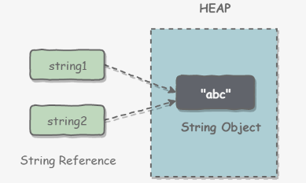
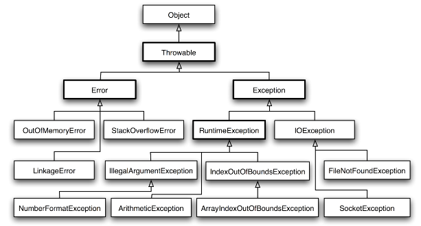

# Java基础

## 一、数据类型

### 基本类型

|  类型  |   类型名称   | 关键字  | 占用内存 |        取值范围        |  默认值  |
| :----: | :----------: | :-----: | :------: | :--------------------: | :------: |
|  整型  |    字节型    |  byte   |  1字节   |      -2^7 ~ 2^7-1      |    0     |
|  整型  |    短整型    |  short  |  2字节   |     -2^15 ~ 2^15-1     |    0     |
|  整型  |     整型     |   int   |  4字节   |     -2^31 ~ 2^31-1     |    0     |
|  整型  |    长整型    |  long   |  8字节   |     -2^63 ~ 2^63-1     |    0L    |
| 浮点型 | 单精度浮点型 |  float  |  4字节   |  -3.403E38 ~ 3.403E38  |   0.0F   |
| 浮点型 | 双精度浮点型 | double  |  8字节   | -1.798E308 ~ 1.798E308 |   0.0D   |
| 字符型 |    字符型    |  char   |  2字节   | 一个字符('a','A','我') | '\u0000' |
| 布尔型 |    布尔型    | boolean |  1字节   |     true 或 false      |  false   |

::: tip

boolean 只有两个值：true、false，可以使用 1 bit 来存储，但是具体大小没有明确规定。

JVM 会在编译时期将 boolean 类型的数据转换为 int，使用 1 来表示 true，0 表示 false。

JVM 支持 boolean 数组，但是是通过读写 byte 数组来实现的。

:::

### 包装类型

基本类型都有对应的包装类型，基本类型与其对应的包装类型之间的赋值使用自动装箱与拆箱完成

| 基本类型 | 包装类型  |
| :------: | :-------: |
|   byte   |   Byte    |
|  short   |   Short   |
|   int    |  Integer  |
|   long   |   Long    |
|  float   |   Float   |
|  double  |  Double   |
|   char   | Character |
| boolean  |  Boolean  |

~~~java
Integer x = 2;     // 装箱 调用了 Integer.valueOf(2)
int y = x;         // 拆箱 调用了 X.intValue()
~~~

::: tip

装箱调用 valueOf 方法

拆箱调用 xxValue 方法

:::

### 缓存池

::: tip

基本类型对应的缓冲池如下

- `boolean`：true 或 false
- `byte`：全部
- `short`：-128 ~ 127 之间
- `int`：-128 ~ 127 之间
- `char`：`\u0000` ~ `\u007F` 范围

:::

`new Integer(123)` 与 `Integer.valueOf(123)` 的区别在于：

- `new Integer(123)` 每次都会新建一个对象；
- `Integer.valueOf(123)` 会使用缓存池中的对象，多次调用会取得同一个对象的引用。

~~~java
Integer x = new Integer(123);
Integer y = new Integer(123);
System.out.println(x == y);    // false
Integer z = Integer.valueOf(123);
Integer k = Integer.valueOf(123);
System.out.println(z == k);   // true
~~~

`valueOf()` 方法的实现比较简单，就是先判断值是否在缓存池中，如果在的话就直接返回缓存池的内容

~~~java
public static Integer valueOf(int i) {
    if (i >= IntegerCache.low && i <= IntegerCache.high)
        return IntegerCache.cache[i + (-IntegerCache.low)];
    return new Integer(i);
}
~~~

在 `Java 8` 中，`Integer` 缓存池的大小默认为 `-128~127`

~~~java
static final int low = -128;
static final int high;
static final Integer cache[];

static {
    // high value may be configured by property
    int h = 127;
    String integerCacheHighPropValue =
        sun.misc.VM.getSavedProperty("java.lang.Integer.IntegerCache.high");
    if (integerCacheHighPropValue != null) {
        try {
            int i = parseInt(integerCacheHighPropValue);
            i = Math.max(i, 127);
            // Maximum array size is Integer.MAX_VALUE
            h = Math.min(i, Integer.MAX_VALUE - (-low) -1);
        } catch( NumberFormatException nfe) {
            // If the property cannot be parsed into an int, ignore it.
        }
    }
    high = h;

    cache = new Integer[(high - low) + 1];
    int j = low;
    for(int k = 0; k < cache.length; k++)
        cache[k] = new Integer(j++);

    // range [-128, 127] must be interned (JLS7 5.1.7)
    assert IntegerCache.high >= 127;
}
~~~

编译器会在自动装箱过程调用 `valueOf()` 方法，因此多个值相同且值在缓存池范围内的 `Integer` 实例使用自动装箱来创建，那么就会引用相同的对象。

~~~java
Integer m = 123;
Integer n = 123;
System.out.println(m == n); // true
~~~

::: tip

`Integer` 的缓冲池上界是可调的，在启动 `jvm` 的时候，通过 `-XX:AutoBoxCacheMax=<size>` 来指定这个缓冲池的大小，该选项在 `JVM` 初始化的时候会设定一个名为 `java.lang.IntegerCache.high` 系统属性，然后 I`ntegerCache` 初始化的时候就会读取该系统属性来决定上界。

:::

## 二、String

### 概览

`String` 被声明为 `final`，因此它不可被继承。(`Integer` 等包装类也不能被继承）

在 `Java 8` 中，`String` 内部使用 `char` 数组存储数据。

~~~java
public final class String
    implements java.io.Serializable, Comparable<String>, CharSequence {
    /** The value is used for character storage. */
    private final char value[];
}
~~~

在 `Java 9` 之后，`String` 类的实现改用 `byte` 数组存储字符串，同时使用 `coder` 来标识使用了哪种编码

~~~java
public final class String
    implements java.io.Serializable, Comparable<String>, CharSequence {
    /** The value is used for character storage. */
    private final byte[] value;

    /** The identifier of the encoding used to encode the bytes in {@code value}. */
    private final byte coder;
}
~~~

`value` 数组被声明为 `final`，这意味着 `value` 数组初始化之后就不能再引用其它数组。

并且 `String` 内部没有改变 `value` 数组的方法，因此可以保证 `String` 不可变。

### 不可变的好处

**1. 可以缓存 hash 值**

因为 `String` 的 `hash` 值经常被使用，例如 `String` 用做 `HashMap` 的 `key`。

不可变的特性可以使得 `hash` 值也不可变，因此只需要进行一次计算。

**2. String Pool 的需要**

如果一个 `String` 对象已经被创建过了，那么就会从 `String Pool` 中取得引用。

只有 `String` 是不可变的，才可能使用 `String Pool`。



**3. 安全性**

`String` 经常作为参数，`String` 不可变性可以保证参数不可变。

例如在作为网络连接参数的情况下如果 `String` 是可变的，那么在网络连接过程中，`String` 被改变，改变 `String` 的那一方以为现在连接的是其它主机，而实际情况却不一定是。

**4. 线程安全**

`String` 不可变性天生具备线程安全，可以在多个线程中安全地使用。

### String，StringBuffer，StringBuilder

**1. 可变性**

- `String` 不可变
- `StringBuffer` 和 `StringBuilder` 可变

**2. 线程安全**

- `String` 不可变，因此是线程安全的
- `StringBuilder` 不是线程安全的
- `StringBuffer` 是线程安全的，内部使用 `synchronized` 进行同步

每次`+`操作 ： 隐式在堆上`new`了一个跟原字符串相同的 `StringBuilder` 对象，再调用`append`方法 拼接`+`后面的字 符。

`StringBuffer` 和 `StringBuilder` 他们两都继承了 `AbstractStringBuilder` 抽象类，从 `AbstractStringBuilder` 抽 象类中我们可以看到

~~~java
/**
* The value is used for character storage.
*/
char[] value;
~~~

他们的底层都是可变的字符数组，所以在进行频繁的字符串操作时，建议使用 `StringBuffer` 和 `StringBuilder` 来 进行操作。 

### String Pool

字符串常量池（String Pool）保存着所有字符串字面量（literal strings），这些字面量在编译时期就确定。不仅如此，还可以使用 `String` 的 i`ntern()` 方法在运行过程将字符串添加到 `String Pool` 中。

当一个字符串调用 `intern()` 方法时，如果 `String Pool` 中已经存在一个字符串和该字符串值相等（使用 equals() 方法进行确定），那么就会返回 `String Pool` 中字符串的引用；否则，就会在 `String Pool` 中添加一个新的字符串，并返回这个新字符串的引用。

下面示例中，s1 和 s2 采用 `new String()` 的方式新建了两个不同字符串，而 s3 和 s4 是通过 `s1.intern()` 和 `s2.intern()` 方法取得同一个字符串引用。`intern()` 首先把 "aaa" 放到 `String Pool` 中，然后返回这个字符串引用，因此 s3 和 s4 引用的是同一个字符串。

```java
String s1 = new String("aaa");
String s2 = new String("aaa");
System.out.println(s1 == s2);           // false
String s3 = s1.intern();
String s4 = s2.intern();
System.out.println(s3 == s4);           // true
```

如果是采用 "bbb" 这种字面量的形式创建字符串，会自动地将字符串放入 `String Pool` 中。

```java
String s5 = "bbb";
String s6 = "bbb";
System.out.println(s5 == s6);  // true
```

::: tip

在 Java 7 之前，`String Pool` 被放在运行时常量池中，它属于永久代。而在 Java 7，`String Pool` 被移到堆中。

这是因为永久代的空间有限，在大量使用字符串的场景下会导致 `OutOfMemoryError` 错误

:::

### new String("abc")

使用这种方式一共会创建两个字符串对象（前提是 `String Pool` 中还没有 "`abc`" 字符串对象）。

- "`abc`" 属于字符串字面量，因此编译时期会在 `String Pool` 中创建一个字符串对象，指向这个 "`abc`" 字符串字面量；
- 而使用 `new` 的方式会在堆中创建一个字符串对象。

创建一个测试类，其 `main` 方法中使用这种方式来创建字符串对象。

```java
public class NewStringTest {
    public static void main(String[] args) {
        String s = new String("abc");
    }
}
```

使用 `javap -verbose` 进行反编译，得到以下内容：

```java
// ...
Constant pool:
// ...
   #2 = Class              #18            // java/lang/String
   #3 = String             #19            // abc
// ...
  #18 = Utf8               java/lang/String
  #19 = Utf8               abc
// ...

  public static void main(java.lang.String[]);
    descriptor: ([Ljava/lang/String;)V
    flags: ACC_PUBLIC, ACC_STATIC
    Code:
      stack=3, locals=2, args_size=1
         0: new           #2                  // class java/lang/String
         3: dup
         4: ldc           #3                  // String abc
         6: invokespecial #4                  // Method java/lang/String."<init>":(Ljava/lang/String;)V
         9: astore_1
// ...
```

在 `Constant Pool` 中，`#19` 存储这字符串字面量 "abc"，`#3` 是 `String Pool` 的字符串对象，它指向 `#19` 这个字符串字面量。在 main 方法中，0: 行使用 new `#2` 在堆中创建一个字符串对象，并且使用 `ldc` `#3` 将 `String Pool` 中的字符串对象作为 `String` 构造函数的参数。

以下是 `String` 构造函数的源码，可以看到，在将一个字符串对象作为另一个字符串对象的构造函数参数时，并不会完全复制 `value` 数组内容，而是都会指向同一个 `value` 数组。

```java
public String(String original) {
    this.value = original.value;
    this.hash = original.hash;
}
```

### String常用方法

`toString()`：返回字符串本身，返回值为 **String** 类型

`length()` ：返回字符串字符序列的长度（空格也算），返回值为 **int** 类型

`getBytes()` ：将当前字符串内容转换为 `byte` 数组并返回，返回值为 **byte[]**

~~~java
String str = new String("Hello World");
byte[] bytes = str.getBytes();
for (int i = 0; i < bytes.length; i++) {
	System.out.println("下标为" + i + "的元素为：" + bytes[i]);//打印的是每个字母对应的ASCII码
}
~~~

`toCharArray()` ：将当前字符串内容转换为 char 数组并返回，返回值为 **char[]**

~~~java
String str = new String("Hello World");
char[] cArr = str.toCharArray();
for (int i = 0; i < str.length(); i++) {
    System.out.println("下标为" + i + "的元素为：" + cArr[i]);//打印的是每个字母
}
~~~

`charAt(int index)` ：用于返回字符串指定位置的字符，返回值为 **char** 类型，参数为 **int** 类型

`compareTo(String anotherString)`：比较调用对象和参数对象的大小关系，返回值为 **int** 类型，`a=b`，返回 0；`a>b`，则返回正整数；`a<b`，则返回负整数。

`contains(CharSequence s)`：判断当前字符串是否包含参数指定的内容，返回值为 **boolean** 类型

`trim()`：去掉前导和尾随空白的字符串，返回值为 **String** 类型

`toUpperCase()` ：返回字符串的大写形式，返回值为 **String** 类型

`toLowerCase()` ：返回字符串的小写形式，返回值为 **String** 类型

`substring(int beginIndex, int endIndex)` ：返回字符串中从下标 beginIndex 开始到 endIndex 结束的子字符串，返回值为 **String** 类型，参数为 **int** 类型

`substring(int beginIndex)` ：返回字符串中从下标 beginIndex开始到字符串结尾的子字符串，返回值为 **String** 类型，参数为 **int** 类型

::: tip

substring 包左不包右

:::

`replace(char oldChar, char newChar)` ：使用参数newChar替换此字符串中出现的所有参数oldChar，返回值为 **String** 类型，参数为 `char` 类型

`replace(CharSequence target, CharSequence replacement)` ：用新字符串replacement替换所有的旧字符串target，返回值为 **String** 类型

`split(String regex)` ：参数regex为正则表达式，以regex所表示的字符串为分隔符，将字符串拆分成字符串数组，结尾的空字符串不包含在结果数组中，返回值为 **String[]** 类型，参数为 **String** 类型

`startsWith(String prefix)` ：判断字符串是否以参数字符串开头，返回值为 **boolean** 类型，参数为 **String** 类型

`startsWith(String prefix, int toffset)` ：从指定位置开始是否以参数字符串开头，返回值为 **boolean** 类型，参数 prefix 为 **String** 类型，toffset 为 **int** 类型

`endsWith(String suffix)` 方法：判断字符串是否以参数字符串结尾，返回值为 **boolean** 类型，参数为 **String** 类型

`indexOf(int ch)`：用于返回当前字符串中参数 ch 指定的字符第一次出现的下标

`indexOf(int ch, int fromIndex)`：用于从 fromIndex(包含) 位置开始查找ch指定的字符

`indexOf(String str)`：在字符串中检索 str 返回其第一次出现的位置，若找不到返回-1

`indexOf(String str, int fromIndex)`：表示从字符串的 fromIndex(包含) 位置开始检索str第一次出现的位置

`lastIndexOf(int ch)`：用于返回参数 ch 指定的字符最后一次出现的下标

`lastIndexOf(int ch, int fromIndex)`：用于从 fromIndex(包含) 位置开始反向查找 ch 指定字符出现的下标，若找不到返回-1

`lastIndexOf(String str)`：返回 str 指定字符串最后一次出现的下标

`lastIndexOf(String str, int fromIndex)`：用于从 fromIndex(包含) 位置开始反向搜索的第一次出现的下标

## 三、运算

### 参数传递

`Java` 的参数是以值传递的形式传入方法中，而不是引用传递。

以下代码中 Dog dog 的 dog 是一个指针，存储的是对象的地址。在将一个参数传入一个方法时，本质上是将对象的地址以值的方式传递到形参中。

```java
public class Dog {

    String name;

    Dog(String name) {
        this.name = name;
    }

    String getName() {
        return this.name;
    }

    void setName(String name) {
        this.name = name;
    }

    String getObjectAddress() {
        return super.toString();
    }
}
```

在方法中改变对象的字段值会改变原对象该字段值，因为引用的是同一个对象。

```java
class PassByValueExample {
    public static void main(String[] args) {
        Dog dog = new Dog("A");
        func(dog);
        System.out.println(dog.getName());          // B
    }

    private static void func(Dog dog) {
        dog.setName("B");
    }
}
```

但是在方法中将指针引用了其它对象，那么此时方法里和方法外的两个指针指向了不同的对象，在一个指针改变其所指向对象的内容对另一个指针所指向的对象没有影响。

```java
public class PassByValueExample {
    public static void main(String[] args) {
        Dog dog = new Dog("A");
        System.out.println(dog.getObjectAddress()); // Dog@4554617c
        func(dog);
        System.out.println(dog.getObjectAddress()); // Dog@4554617c
        System.out.println(dog.getName());          // A
    }

    private static void func(Dog dog) {
        System.out.println(dog.getObjectAddress()); // Dog@4554617c
        dog = new Dog("B");
        System.out.println(dog.getObjectAddress()); // Dog@74a14482
        System.out.println(dog.getName());          // B
    }
}
```

### float 与 double

`Java` 不能隐式执行向下转型，因为这会使得精度降低。

1.1 字面量属于 `double` 类型，不能直接将 1.1 直接赋值给 `float` 变量，因为这是向下转型。

```java
// float f = 1.1;
```

1.1f 字面量才是 `float` 类型。

```java
float f = 1.1f;
```

### 隐式类型转换

因为字面量 1 是 int 类型，它比 `short` 类型精度要高，因此不能隐式地将 `int` 类型向下转型为 `short` 类型。

```java
short s1 = 1;
// s1 = s1 + 1;
```

但是使用 `+=` 或者 `++` 运算符会执行隐式类型转换。

```java
s1 += 1;
s1++;
```

上面的语句相当于将 `s1 + 1` 的计算结果进行了向下转型：

```java
s1 = (short) (s1 + 1);
```

### switch

最开始 switch 只支持 `byte`、`short`、`char`、`int`。

从 Java5 开始，也可以是 `enum` 类型

从 Java 7 开始，可以在 `switch` 条件判断语句中使用 `String` 对象。

```java
String s = "a";
switch (s) {
    case "a":
        System.out.println("aaa");
        break;
    case "b":
        System.out.println("bbb");
        break;
    default:
        // 如果 s 的值不等于任何一个 case，则执行这里的代码块
        break;
}
```

::: tip

switch 不支持 long、float、double，是因为 switch 的设计初衷是对那些只有少数几个值的类型进行等值判断，如果值过于复杂，那么还是用 if 比较合适。

:::

## 四、关键字

### final

**1. 数据**

声明数据为常量，可以是编译时常量，也可以是在运行时被初始化后不能被改变的常量。

- 对于基本类型，`final` 使数值不变；
- 对于引用类型，`final` 使引用不变，也就不能引用其它对象，但是被引用的对象本身是可以修改的。

```java
final int x = 1;
// x = 2;  // cannot assign value to final variable 'x'
final A y = new A();
y.a = 1;
```

**2. 方法**

声明方法不能被子类重写。

`private` 方法隐式地被指定为 `final`，如果在子类中定义的方法和基类中的一个 `private` 方法签名相同，此时子类的方法不是重写基类方法，而是在子类中定义了一个新的方法。

**3. 类**

声明类不允许被继承。

::: tip

final 修饰的变量为常量（基本类型，值不可变；引用类型，引用不可变）

final 修饰的方法不可被重写

final 修饰的类不可被基础

:::

### static

::: warning 注意

- 静态只能访问静态。 
- 非静态既可以访问非静态的，也可以访问静态的。

:::

**1. 静态变量**

- 静态变量：又称为类变量，也就是说这个变量属于类的，类所有的实例都共享静态变量，可以直接通过类名来访问它。静态变量在内存中只存在一份。
- 实例变量：每创建一个实例就会产生一个实例变量，它与该实例同生共死。

```java
public class A {

    private int x;         // 实例变量
    private static int y;  // 静态变量

    public static void main(String[] args) {
        // int x = A.x;  // 非静态字段 x 不能从静态上下文中引用
        A a = new A();
        int x = a.x;
        int y = A.y;
    }
}
```

**2. 静态方法**

静态方法在类加载的时候就存在了，它不依赖于任何实例。所以静态方法必须有实现，也就是说它不能是抽象方法。

```java
public abstract class A {
    public static void func1(){
    }
    // public abstract static void func2();  // 修饰符 abstract 和 static 的非法组合
}
```

只能访问所属类的静态字段和静态方法，方法中不能有 `this` 和 `super` 关键字，因为这两个关键字与具体对象关联。

```java
public class A {

    private static int x;
    private int y;

    public static void func1(){
        int a = x;
        // int b = y;  // 非静态字段 y 不能从静态上下文中引用
        // int b = this.y;     // 'A.this' 不能从静态上下文中引用
    }
}
```

**3. 静态语句块**

静态语句块在类初始化时运行一次。

```java
public class A {
    static {
        System.out.println("123");
    }

    public static void main(String[] args) {
        A a1 = new A();
        A a2 = new A();
    }
}
123
```

**4. 静态内部类**

非静态内部类依赖于外部类的实例，也就是说需要先创建外部类实例，才能用这个实例去创建非静态内部类。

而静态内部类不需要。

```java
public class OuterClass {

    class InnerClass {
    }

    static class StaticInnerClass {
    }

    public static void main(String[] args) {
        // InnerClass innerClass = new InnerClass(); // 'OuterClass.this' 不能从静态上下文中引用
        OuterClass outerClass = new OuterClass();
        InnerClass innerClass = outerClass.new InnerClass();
        StaticInnerClass staticInnerClass = new StaticInnerClass();
    }
}
```

静态内部类不能访问外部类的非静态的变量和方法。

**5. 静态导包**

在使用静态变量和方法时不用再指明 `ClassName`，从而简化代码，但可读性大大降低。

```java
import static com.xxx.ClassName.*
```

**6. 初始化顺序**

静态变量和静态语句块优先于实例变量和普通语句块，静态变量和静态语句块的初始化顺序取决于它们在代码中的顺序。

```java
public static String staticField = "静态变量";
static {
    System.out.println("静态语句块");
}
public String field = "实例变量";
{
    System.out.println("普通语句块");
}
```

最后才是构造函数的初始化。

```java
public InitialOrderTest() {
    System.out.println("构造函数");
}
```

存在继承的情况下，初始化顺序为：

- 父类（静态变量、静态语句块）
- 子类（静态变量、静态语句块）
- 父类（实例变量、普通语句块）
- 父类（构造函数）
- 子类（实例变量、普通语句块）
- 子类（构造函数）

## 五、Object 通用方法

### 概览

```java
public native int hashCode()

public boolean equals(Object obj)

protected native Object clone() throws CloneNotSupportedException

public String toString()

public final native Class<?> getClass()

protected void finalize() throws Throwable {}

public final native void notify()

public final native void notifyAll()

public final native void wait(long timeout) throws InterruptedException

public final void wait(long timeout, int nanos) throws InterruptedException

public final void wait() throws InterruptedException
```

### equals()

**1. 等价关系**

两个对象具有等价关系，需要满足以下五个条件：

① 自反性

```java
x.equals(x); // true
```

② 对称性

```java
x.equals(y) == y.equals(x); // true
```

③ 传递性

```java
if (x.equals(y) && y.equals(z))
    x.equals(z); // true;
```

④ 一致性

多次调用 `equals()` 方法结果不变

```java
x.equals(y) == x.equals(y); // true
```

⑤ 与 `null` 的比较

对任何不是 `null` 的对象 `x` 调用 `x.equals(null)` 结果都为 `false`

```java
x.equals(null); // false;
```

**2. 等价与相等**

- 对于基本类型，`==` 判断两个值是否相等，基本类型没有 `equals()` 方法。
- 对于引用类型，`==` 判断两个变量是否引用同一个对象，而 `equals()` 判断引用的对象是否等价。

```java
Integer x = new Integer(1);
Integer y = new Integer(1);
System.out.println(x.equals(y)); // true
System.out.println(x == y);      // false
```

**3. 实现**

- 检查是否为同一个对象的引用，如果是直接返回 `true`；
- 检查是否是同一个类型，如果不是，直接返回 `false`；
- 将 `Object` 对象进行转型；
- 判断每个关键域是否相等。

```java
public class EqualExample {

    private int x;
    private int y;
    private int z;

    public EqualExample(int x, int y, int z) {
        this.x = x;
        this.y = y;
        this.z = z;
    }

    @Override
    public boolean equals(Object o) {
        if (this == o) return true;
        if (o == null || getClass() != o.getClass()) return false;

        EqualExample that = (EqualExample) o;

        if (x != that.x) return false;
        if (y != that.y) return false;
        return z == that.z;
    }
}
```

### hashCode()

`hashCode()` 返回哈希值（int），而 `equals()` 是用来判断两个对象是否等价。**等价的两个对象散列值一定相同，但是散列值相同的两个对象不一定等价**，这是因为计算哈希值具有随机性，两个值不同的对象可能计算出相同的哈希值。

在覆盖 `equals()` 方法时应当总是覆盖 `hashCode()` 方法，保证等价的两个对象哈希值也相等。

`HashSet` 和 `HashMap` 等集合类使用了 `hashCode()` 方法来计算对象应该存储的位置，因此要将对象添加到这些集合类中，需要让对应的类实现 `hashCode()` 方法。

下面的代码中，新建了两个等价的对象，并将它们添加到 `HashSet` 中。我们希望将这两个对象当成一样的，只在集合中添加一个对象。但是 `EqualExample` 没有实现 `hashCode()` 方法，因此这两个对象的哈希值是不同的，最终导致集合添加了两个等价的对象。

```java
EqualExample e1 = new EqualExample(1, 1, 1);
EqualExample e2 = new EqualExample(1, 1, 1);
System.out.println(e1.equals(e2)); // true
HashSet<EqualExample> set = new HashSet<>();
set.add(e1);
set.add(e2);
System.out.println(set.size());   // 2
```

理想的哈希函数应当具有均匀性，即不相等的对象应当均匀分布到所有可能的哈希值上。这就要求了哈希函数要把所有域的值都考虑进来。可以将每个域都当成 `R` 进制的某一位，然后组成一个 `R` 进制的整数。

`R` 一般取 `31`，因为它是一个奇素数，如果是偶数的话，当出现乘法溢出，信息就会丢失，因为与 `2` 相乘相当于向左移一位，最左边的位丢失。并且一个数与 `31` 相乘可以转换成移位和减法：`31*x == (x<<5)-x`，编译器会自动进行这个优化。

```java
@Override
public int hashCode() {
    int result = 17;
    result = 31 * result + x;
    result = 31 * result + y;
    result = 31 * result + z;
    return result;
}
```

### toString()

默认返回 `ToStringExample@4554617c` 这种形式，其中 `@` 后面的数值为散列码的无符号十六进制表示。

```java
public class ToStringExample {

    private int number;

    public ToStringExample(int number) {
        this.number = number;
    }
}
ToStringExample example = new ToStringExample(123);
System.out.println(example.toString());
ToStringExample@4554617c
```

### clone()

**1. cloneable**

`clone()` 是 `Object` 的 `protected` 方法，它不是 `public`，一个类不显式去重写 `clone()`，其它类就不能直接去调用该类实例的 `clone()` 方法。

```java
public class CloneExample {
    private int a;
    private int b;
}
CloneExample e1 = new CloneExample();
// CloneExample e2 = e1.clone(); // 'clone()' 在 java.lang 对象中具有受保护的访问权限
```

重写 `clone()` 得到以下实现：

```java
public class CloneExample {
    private int a;
    private int b;

    @Override
    public CloneExample clone() throws CloneNotSupportedException {
        return (CloneExample)super.clone();
    }
}
CloneExample e1 = new CloneExample();
try {
    CloneExample e2 = e1.clone();
} catch (CloneNotSupportedException e) {
    e.printStackTrace();
}
java.lang.CloneNotSupportedException: CloneExample
```

以上抛出了 `CloneNotSupportedException`，这是因为 `CloneExample` 没有实现 `Cloneable` 接口。

应该注意的是，`clone()` 方法并不是 `Cloneable` 接口的方法，而是 `Object` 的一个 `protected` 方法。`Cloneable` 接口只是规定，如果一个类没有实现 `Cloneable` 接口又调用了 `clone()` 方法，就会抛出 `CloneNotSupportedException`。

```java
public class CloneExample implements Cloneable {
    private int a;
    private int b;

    @Override
    public Object clone() throws CloneNotSupportedException {
        return super.clone();
    }
}
```

**2. 浅拷贝**

拷贝对象和原始对象的引用类型引用同一个对象。

```java
public class ShallowCloneExample implements Cloneable {

    private int[] arr;

    public ShallowCloneExample() {
        arr = new int[10];
        for (int i = 0; i < arr.length; i++) {
            arr[i] = i;
        }
    }

    public void set(int index, int value) {
        arr[index] = value;
    }

    public int get(int index) {
        return arr[index];
    }

    @Override
    protected ShallowCloneExample clone() throws CloneNotSupportedException {
        return (ShallowCloneExample) super.clone();
    }
}
ShallowCloneExample e1 = new ShallowCloneExample();
ShallowCloneExample e2 = null;
try {
    e2 = e1.clone();
} catch (CloneNotSupportedException e) {
    e.printStackTrace();
}
e1.set(2, 222);
System.out.println(e2.get(2)); // 222
```

**3. 深拷贝**

拷贝对象和原始对象的引用类型引用不同对象。

```java
public class DeepCloneExample implements Cloneable {

    private int[] arr;

    public DeepCloneExample() {
        arr = new int[10];
        for (int i = 0; i < arr.length; i++) {
            arr[i] = i;
        }
    }

    public void set(int index, int value) {
        arr[index] = value;
    }

    public int get(int index) {
        return arr[index];
    }

    @Override
    protected DeepCloneExample clone() throws CloneNotSupportedException {
        DeepCloneExample result = (DeepCloneExample) super.clone();
        result.arr = new int[arr.length];
        for (int i = 0; i < arr.length; i++) {
            result.arr[i] = arr[i];
        }
        return result;
    }
}
DeepCloneExample e1 = new DeepCloneExample();
DeepCloneExample e2 = null;
try {
    e2 = e1.clone();
} catch (CloneNotSupportedException e) {
    e.printStackTrace();
}
e1.set(2, 222);
System.out.println(e2.get(2)); // 2
```

**4. clone() 的替代方案**

使用 `clone()` 方法来拷贝一个对象即复杂又有风险，它会抛出异常，并且还需要类型转换。可以使用拷贝构造函数或者拷贝工厂来拷贝一个对象。

```java
public class CloneConstructorExample {

    private int[] arr;

    public CloneConstructorExample() {
        arr = new int[10];
        for (int i = 0; i < arr.length; i++) {
            arr[i] = i;
        }
    }

    public CloneConstructorExample(CloneConstructorExample original) {
        arr = new int[original.arr.length];
        for (int i = 0; i < original.arr.length; i++) {
            arr[i] = original.arr[i];
        }
    }

    public void set(int index, int value) {
        arr[index] = value;
    }

    public int get(int index) {
        return arr[index];
    }
}
CloneConstructorExample e1 = new CloneConstructorExample();
CloneConstructorExample e2 = new CloneConstructorExample(e1);
e1.set(2, 222);
System.out.println(e2.get(2)); // 2
```

## 六、继承

### 访问权限

`Java` 中有三个访问权限修饰符：`private`、`protected` 以及 `public`，如果不加访问修饰符，表示包级可见。

可以对类或类中的成员（字段和方法）加上访问修饰符。

- 类可见表示其它类可以用这个类创建实例对象。
- 成员可见表示其它类可以用这个类的实例对象访问到该成员；

`protected` 用于修饰成员，表示在继承体系中成员对于子类可见，但是这个访问修饰符对于类没有意义。

设计良好的模块会隐藏所有的实现细节，把它的 `API` 与它的实现清晰地隔离开来。模块之间只通过它们的 `API` 进行通信，一个模块不需要知道其他模块的内部工作情况，这个概念被称为信息隐藏或封装。因此访问权限应当尽可能地使每个类或者成员不被外界访问。

如果子类的方法重写了父类的方法，那么子类中该方法的访问级别不允许低于父类的访问级别。这是为了确保可以使用父类实例的地方都可以使用子类实例去代替，也就是确保满足里氏替换原则。

字段决不能是公有的，因为这么做的话就失去了对这个字段修改行为的控制，客户端可以对其随意修改。例如下面的例子中，`AccessExample` 拥有 `id` 公有字段，如果在某个时刻，我们想要使用 `int` 存储 `id` 字段，那么就需要修改所有的客户端代码。

```java
public class AccessExample {
    public String id;
}
```

可以使用公有的 `getter` 和 `setter` 方法来替换公有字段，这样的话就可以控制对字段的修改行为。

```java
public class AccessExample {

    private int id;

    public String getId() {
        return id + "";
    }

    public void setId(String id) {
        this.id = Integer.valueOf(id);
    }
}
```

但是也有例外，如果是包级私有的类或者私有的嵌套类，那么直接暴露成员不会有特别大的影响。

```java
public class AccessWithInnerClassExample {

    private class InnerClass {
        int x;
    }

    private InnerClass innerClass;

    public AccessWithInnerClassExample() {
        innerClass = new InnerClass();
    }

    public int getValue() {
        return innerClass.x;  // 直接访问
    }
}
```

### 抽象类与接口

**1. 抽象类**

抽象类和抽象方法都使用 `abstract` 关键字进行声明。如果一个类中包含抽象方法，那么这个类必须声明为抽象类。

抽象类和普通类最大的区别是，抽象类不能被实例化，只能被继承。

```java
public abstract class AbstractClassExample {

    protected int x;
    private int y;

    public abstract void func1();

    public void func2() {
        System.out.println("func2");
    }
}
public class AbstractExtendClassExample extends AbstractClassExample {
    @Override
    public void func1() {
        System.out.println("func1");
    }
}
// AbstractClassExample ac1 = new AbstractClassExample(); // 'AbstractClassExample' 是抽象的不能实例化
AbstractClassExample ac2 = new AbstractExtendClassExample();
ac2.func1();
```

**2. 接口**

接口是抽象类的延伸，在 Java 8 之前，它可以看成是一个完全抽象的类，也就是说它不能有任何的方法实现。

从 Java 8 开始，接口也可以拥有默认的方法实现，这是因为不支持默认方法的接口的维护成本太高了。在 Java 8 之前，如果一个接口想要添加新的方法，那么要修改所有实现了该接口的类，让它们都实现新增的方法。

接口的成员（字段 + 方法）默认都是 `public` 的，并且不允许定义为 `private` 或者 `protected`。从 Java 9 开始，允许将方法定义为 `private`，这样就能定义某些复用的代码又不会把方法暴露出去。

接口的字段默认都是 `static` 和 `final` 的。

```java
public interface InterfaceExample {

    void func1();

    default void func2(){
        System.out.println("func2");
    }

    int x = 123;
    // int y;               // Variable 'y' might not have been initialized
    public int z = 0;       // Modifier 'public' is redundant for interface fields
    // private int k = 0;   // Modifier 'private' not allowed here
    // protected int l = 0; // Modifier 'protected' not allowed here
    // private void fun3(); // Modifier 'private' not allowed here
}
public class InterfaceImplementExample implements InterfaceExample {
    @Override
    public void func1() {
        System.out.println("func1");
    }
}
// InterfaceExample ie1 = new InterfaceExample(); // 'InterfaceExample' 是抽象的不能实例化
InterfaceExample ie2 = new InterfaceImplementExample();
ie2.func1();
System.out.println(InterfaceExample.x);
```

**3. 比较**

抽象类是用来捕捉子类的通用特性的。

接口是抽象方法的集合。

**相同点**

- 接口和抽象类都不能实例化 
- 都位于继承的顶端，用于被其他实现或继承 
- 都包含抽象方法，其子类都必须覆写这些抽象方法

**不同点**

| 参数       | 抽象类   | 接口         |
| ---------- | -------- | ------------ |
| 声明       | abstract | interface    |
| 实现       | extends  | implements   |
| 构造器     | 可以有   | 不能有       |
| 访问修饰符 | 任意的   | public       |
| 多继承     | 单继承   | 多实现       |
| 字段声明   | 任意的   | static final |

**4. 使用选择**

使用接口：

- 需要让不相关的类都实现一个方法，例如不相关的类都可以实现 `Comparable` 接口中的 `compareTo()` 方法；
- 需要使用多重继承。

使用抽象类：

- 需要在几个相关的类中共享代码。
- 需要能控制继承来的成员的访问权限，而不是都为 `public`。
- 需要继承非静态和非常量字段。

在很多情况下，接口优先于抽象类。因为接口没有抽象类严格的类层次结构要求，可以灵活地为一个类添加行为。并且从 Java 8 开始，接口也可以有默认的方法实现，使得修改接口的成本也变的很低。

### super

- 访问父类的构造函数：可以使用 `super()` 函数访问父类的构造函数，从而委托父类完成一些初始化的工作。子类一定会调用父类的构造函数来完成初始化工作，一般是调用父类的默认构造函数，如果子类需要调用父类其它构造函数，那么就可以使用 `super()` 函数。
- 访问父类的成员：如果子类重写了父类的某个方法，可以通过使用 `super` 关键字来引用父类的方法实现。

```java
public class SuperExample {

    protected int x;
    protected int y;

    public SuperExample(int x, int y) {
        this.x = x;
        this.y = y;
    }

    public void func() {
        System.out.println("SuperExample.func()");
    }
}
public class SuperExtendExample extends SuperExample {

    private int z;

    public SuperExtendExample(int x, int y, int z) {
        super(x, y);
        this.z = z;
    }

    @Override
    public void func() {
        super.func();
        System.out.println("SuperExtendExample.func()");
    }
}
SuperExample e = new SuperExtendExample(1, 2, 3);
e.func();
SuperExample.func()
SuperExtendExample.func()
```

### 重写与重载

**1. 重写（Override）**

存在于继承体系中，指子类实现了一个与父类在方法声明上完全相同的一个方法。

为了满足里式替换原则，重写有以下三个限制：

- 子类方法的访问权限必须大于等于父类方法；
- 子类方法的返回类型必须是父类方法返回类型或为其子类型。
- 子类方法抛出的异常类型必须是父类抛出异常类型或为其子类型。

使用 `@Override` 注解，可以让编译器帮忙检查是否满足上面的三个限制条件。

下面的示例中，`SubClass` 为 `SuperClass` 的子类，`SubClass` 重写了 `SuperClass` 的 `func()` 方法。其中：

- 子类方法访问权限为 `public`，大于父类的 `protected`。
- 子类的返回类型为 `ArrayList<Integer>`，是父类返回类型 `List<Integer>` 的子类。
- 子类抛出的异常类型为 `Exception`，是父类抛出异常 `Throwable` 的子类。
- 子类重写方法使用 `@Override` 注解，从而让编译器自动检查是否满足限制条件。

```java
class SuperClass {
    protected List<Integer> func() throws Throwable {
        return new ArrayList<>();
    }
}

class SubClass extends SuperClass {
    @Override
    public ArrayList<Integer> func() throws Exception {
        return new ArrayList<>();
    }
}
```

在调用一个方法时，先从本类中查找看是否有对应的方法，如果没有再到父类中查看，看是否从父类继承来。否则就要对参数进行转型，转成父类之后看是否有对应的方法。

总的来说，方法调用的优先级为：

- this.func(this)
- super.func(this)
- this.func(super)
- super.func(super)

```java
/*
    A
    |
    B
    |
    C
    |
    D
 */


class A {

    public void show(A obj) {
        System.out.println("A.show(A)");
    }

    public void show(C obj) {
        System.out.println("A.show(C)");
    }
}

class B extends A {

    @Override
    public void show(A obj) {
        System.out.println("B.show(A)");
    }
}

class C extends B {
}

class D extends C {
}
public static void main(String[] args) {

    A a = new A();
    B b = new B();
    C c = new C();
    D d = new D();

    // 在 A 中存在 show(A obj)，直接调用
    a.show(a); // A.show(A)
    // 在 A 中不存在 show(B obj)，将 B 转型成其父类 A
    a.show(b); // A.show(A)
    // 在 B 中存在从 A 继承来的 show(C obj)，直接调用
    b.show(c); // A.show(C)
    // 在 B 中不存在 show(D obj)，但是存在从 A 继承来的 show(C obj)，将 D 转型成其父类 C
    b.show(d); // A.show(C)

    // 引用的还是 B 对象，所以 ba 和 b 的调用结果一样
    A ba = new B();
    ba.show(c); // A.show(C)
    ba.show(d); // A.show(C)
}
```

::: tip

就近原则

:::

**2. 重载（Overload）**

存在于同一个类中，指一个方法与已经存在的方法名称上相同，但是参数类型、个数、顺序至少有一个不同。

应该注意的是，返回值不同，其它都相同不算是重载。

```java
class OverloadingExample {
    public void show(int x) {
        System.out.println(x);
    }

    public void show(int x, String y) {
        System.out.println(x + " " + y);
    }
}
public static void main(String[] args) {
    OverloadingExample example = new OverloadingExample();
    example.show(1);
    example.show(1, "2");
}
```

::: tip

重载对返回类型没有要求，可以相同也可以不同，但不能通过返回类型是否相同来判断重载

重载Overload是一个类中多态性的一种表现

:::

## 七、反射

每个类都有一个 **Class** 对象，包含了与类有关的信息。当编译一个新类时，会产生一个同名的 `.class` 文件，该文件内容保存着 `Class` 对象。

类加载相当于 `Class` 对象的加载，类在第一次使用时才动态加载到 `JVM` 中。也可以使用 `Class.forName("com.mysql.jdbc.Driver")` 这种方式来控制类的加载，该方法会返回一个 `Class` 对象。

反射可以提供运行时的类信息，并且这个类可以在运行时才加载进来，甚至在编译时期该类的 `.class` 不存在也可以加载进来。

反射机制是在运行时，对于任意一个类，都能够知道这个类的所有属性和方法；对于任意个对象，都能够调用它的 任意一个方法。在java中，只要给定类的名字，就可以通过反射机制来获得类的所有信息。 这种动态获取的信息以及动态调用对象的方法的功能称为Java语言的反射机制

`Class` 和 `java.lang.reflect` 一起对反射提供了支持，`java.lang.reflect` 类库主要包含了以下三个类：

- **Field** ：可以使用 `get()` 和 `set()` 方法读取和修改 `Field` 对象关联的字段；
- **Method** ：可以使用 `invoke()` 方法调用与 `Method` 对象关联的方法；
- **Constructor** ：可以用 `Constructor` 的 `newInstance()` 创建新的对象。

**反射的优点：**

- **可扩展性** ：应用程序可以利用全限定名创建可扩展对象的实例，来使用来自外部的用户自定义类。
- **类浏览器和可视化开发环境** ：一个类浏览器需要可以枚举类的成员。可视化开发环境（如 IDE）可以从利用反射中可用的类型信息中受益，以帮助程序员编写正确的代码。
- **调试器和测试工具** ： 调试器需要能够检查一个类里的私有成员。测试工具可以利用反射来自动地调用类里定义的可被发现的 API 定义，以确保一组测试中有较高的代码覆盖率。

**反射的缺点：**

尽管反射非常强大，但也不能滥用。如果一个功能可以不用反射完成，那么最好就不用。在我们使用反射技术时，下面几条内容应该牢记于心。

- **性能开销** ：反射涉及了动态类型的解析，所以 JVM 无法对这些代码进行优化。因此，反射操作的效率要比那些非反射操作低得多。我们应该避免在经常被执行的代码或对性能要求很高的程序中使用反射。
- **安全限制** ：使用反射技术要求程序必须在一个没有安全限制的环境中运行。如果一个程序必须在有安全限制的环境中运行，如 Applet，那么这就是个问题了。
- **内部暴露** ：由于反射允许代码执行一些在正常情况下不被允许的操作（比如访问私有的属性和方法），所以使用反射可能会导致意料之外的副作用，这可能导致代码功能失调并破坏可移植性。反射代码破坏了抽象性，因此当平台发生改变的时候，代码的行为就有可能也随着变化。

### 反射的实现方式

获取`Class`对象，有4中方法： 

1）`Class.forName(“类的路径”)；`

2）类名`.class` 

3）对象名`.getClass()` 

4） 基本类型的包装类，可以调用包装类的`Type`属性来获得该包装类的`Class`对象

### 实现Java反射的类

1）`Class`：表示正在运行的`Java`应用程序中的类和接口 

2） `Field`：提供有关类和接口的属性信息，以及对它的动态访问权限。 

3）`Constructor`：提供关于类的单个构造方法 的信息以及它的访问权限 

4）`Method`：提供类或接口中某个方法的信息

::: warning 注意

所有获取对象的信息都需要`Class`类来实现。 

:::

## 八、异常

`Throwable` 可以用来表示任何可以作为异常抛出的类，分为两种： **Error** 和 **Exception**。其中 `Error` 用来表示 `JVM` 无法处理的错误，`Exception` 分为两种：

- **受检异常（编译时异常）** ：需要用 `try...catch...` 语句捕获并进行处理，并且可以从异常中恢复；
- **非受检异常（运行时异常）** ：是程序运行时错误，例如除 `0` 会引发 `ArithmeticException`，此时程序崩溃并且无法恢复。




## 九、其它

### Java语言特点

1）简单易学。Java有丰富的类库，能够通过静态方法封装，降低`API`的学习成本，提高工作效率。 

2）面向对象。这个也是`Java`最重要的特性， `java` 能够使得程序耦合度更低，内聚性更高。 

3）可靠安全。`Java`生态系统包括用于分析和报告安全性问题的各种工具。 

4）与平台无关。`Java`能够跨平台使用。 

5）支持多线程。`Java`可以采用多线程+协程方式实现更多的并发操作

### 面向对象和面向过程的区别

**面向过程**

字面意义上就是面向的是过程，先做什么、在做什么、最后做什么，然后用函数把 这些步骤一步一步地实现，在使用的时候一一调用则可。

**面向对象**

字面意义上就是面向的是对象，是把构成问题的事务分解成各个对象，但是建立对象的目的也不是为了完成一个个步骤，而是为了描述某个事物在解决整个问题的过程中所发生的行为。

### 面向对象编程三大特性

**封装**

封装把一个对象的属性私有化，同时提供一些可以被外界访问的属性的方法，如果属性不想被外界访问，我们大可不必提供方法给外界访问。

> 如果一个类没有提供给外界访问的方法，那么这个类也没有什么意义了。 

**继承**

继承是使用已存在的类的定义作为基础建立新类的技术，新类的定义可以增加新的数据或新的功能，也可以用父类的功能，但不能选择性地继承

**多态**

所谓多态就是指程序中定义的引用变量所指向的具体类型和通过该引用变量发出的方法调用在编程时并不确 定，是在程序运行期间才确定

即一个引用变量到底会指向哪个类的实例对象，该引用变量发出的方法调用到底是哪个类中实现的方法，必须在由程序运行期间才能决定。

### JDK、JRE、JVM

`Java` 虚拟机（JVM）是运行 `Java` 字节码的虚拟机。`JVM` 有针对不同系统的特定实现（Windows，Linux， macOS），目的是使用相同的字节码，它们都会给出相同的结果。字节码和不同系统的 `JVM` 实现是 Java 语言“一 次编译，随处可以运行”的关键所在。 

`JDK` 是 Java Development Kit，它是功能齐全的 `Java SDK`。它拥有 `JRE` 所拥有的一切，还有编译器（javac）和工具（如 javadoc 和 jdb）。它能够创建和编译程序。

`JRE` 是 `Java` 运行时环境。它是运行已编译 `Java` 程序所需的所有内容的集合，包括 `Java` 虚拟机（JVM），`Java` 类库，`java` 命令和其他的些基础构件。但是，它不能用于创建新程序。

### instanceof

`instanceof` 严格来说是`Java`中的一个双目运算符，用来测试一个对象是否为一个类的实例

~~~java
boolean result = obj instanceof Class
~~~

~~~java
int i = 0;
//编译不通过 i必须是引用类型，不能是基本类型
System.out.println(i instanceof Integer);
//编译不通过
System.out.println(i instanceof Object);
Integer integer = new Integer(1);
System.out.println(integer instanceof Integer);//true
//false ,在 JavaSE规范 中对 instanceof 运算符的规定就是：如果 obj 为 null，那么将返回 false。
System.out.println(null instanceof Object);
~~~

### 内部类优点

- 一个内部类对象可以访问创建它的外部类对象的内容，包括私有数据！ 
- 内部类不为同一包的其他类所见，具有很好的封装性； 
- 内部类有效实现了“多重继承”，优化 java 单继承的缺陷。 

### Java代码初始化顺序

1. 父类静态变量 
2. 父类静态代码块 
3. 子类静态变量 
4. 子类静态代码块 
5. 父类非静态变量 
6. 父类非静态代码块 
7. 父类构造函数 
8. 子类非静态变量 
9. 子类非静态代码块 
10. 子类构造函数

### Java创建对象的几种方式

- new创建新对象 
- 通过反射机制 
- 采用`clone`机制 
- 通过序列化机制

### 深拷贝和浅拷贝

#### 浅拷贝

被复制对象的所有变量都含有与原来的对象相同的值,而所有的对其他对象的引用仍然指向原来的对象.

换言之,浅拷贝仅复制所考虑的对象,而不复制它所引用的对象. 

#### 深拷贝

被复制对象的所有变量都含有与原来的对象相同的值.而那些引用其他对象的变量将指向被复制过的新对象.而不再是原有的那些被引用的对象.

换言之.深拷贝把要复制的对象所引用的对象都复制了一遍.

> 深浅拷贝指的是被拷贝对象的引用类型属性是否还是指向原来的。

### final

- 被`final`修饰的类不可以被继承 
- 被`final`修饰的方法不可以被重写 
- 被`final`修饰的变量不可以被改变.
  - 如果修饰引用，那么表示引用不可变,引用指向的内容可变. 
- 被`final`修饰的方法，`JVM`会尝试将其内联，以提高运行效率 
- 被`final`修饰的常量，在编译阶段会存入常量池中.

### final finally finalize

`final`可以修饰类、变量、方法，修饰类表示该类不能被继承、修饰方法表示该方法不能被重写、修饰变量表 示该 变量是一个常量不能被重新赋值。 

`finally`一般作用在`try-catch`代码块中，在处理异常的时候，通常我们将一定要执行的代码方法`finally`代码块 中，表示不管是否出现异常，该代码块都会执行，一般用来存放一些关闭资源的代码。 

`finalize`是一个方法，属于`Object`类的一个方法，而`Object`类是所有类的父类，该方法一般由垃圾回收器来调用， 当我们调用 `System.gc()` 方法的时候，由垃圾回收器调用`finalize()`，回收垃圾，一个对象是否可回收的最后判 断。

### this关键字

`this`是自身的一个对象，代表对象本身，可以理解为：指向对象本身的一个指针。 

`this`的用法在`java`中大体可以分为3种： 

- 普通的直接引用，`this`相当于是指向当前对象本身。 
- 形参与成员名字重名，用`this`来区分。 
- 引用本类的构造函数 。

### super关键字

`super`可以理解为是指向自己超（父）类对象的一个指针，而这个超类指的是离自己最近的一个父类。 

`super`也有三种用法： 

- 普通的直接引用，与`this`类似，`super`相当于是指向当前对象的父类的引用，这样就可以用 `super.xxx` 来引用父类的成员。 
- 子类中的成员变量或方法与父类中的成员变量或方法同名时，用`super`进行区分
- 引用父类构造函数 
  - `super`（参数）：调用父类中的某一个构造函数（应该为构造函数中的第一条语句）。 
  - `this`（参数）：调用本类中另一种形式的构造函数（应该为构造函数中的第一条语句）。

### this与super的区别

**super:** 它引用当前对象的直接父类中的成员

**this：**它代表当前对象名

`super()`和t`his()`类似,区别是，`super()`在子类中调用父类的构造方法，`this()`在本类内调用本类的其它构造方法。 

**super()和this()均需放在构造方法内第一行。** 

尽管可以用`this`调用一个构造器，但却不能调用两个。 

**this和super不能同时出现在一个构造函数里面**，因为`this`必然会调用其它的构造函数，其它的构造函数必然也会 有`super`语句的存在，所以在同一个构造函数里面有相同的语句，就失去了语句的意义，编译器也不会通过。 

`this()`和`super()`都指的是对象，所以，均不可以在`static`环境中使用。包括：`static`变量,`static`方法，`static`语句块。 

> 从本质上讲，`this`是一个指向本对象的指针, 然而`super`是一个`Java`关键字。

### &和&&

`&`运算符有两种用法：(1)按位与；(2)逻辑与。

`&&`运算符是短路与运算

> 如果 `&&`左边的表达式的值是 `false`，右边的表达式会被直接短路掉，不会进行运算
>
> 注意：逻辑或运算符（|）和短路或运算符（||）的差别也是如此。

### try catch finally，try里有return，finally还执行么

执行，并且`finally`的执行早于`try`里面的`return` 

结论： 

1、不管有木有出现异常，`finally`块中代码都会执行； 

2、当`try`和`catch`中有`return`时，`finally`仍然会执行； 

3、`finally`是在`return`后面的表达式运算后执行的（此时并没有返回运算后的值，而是先把要返回的值保存起来， 管finally中的代码怎么样，返回的值都不会改变，任然是之前保存的值），所以函数返回值是在`finally`执行前确定 的； 

4、`finally`中最好不要包含`return`，否则程序会提前退出，返回值不是`try`或`catch`中保存的返回值

### transient

`transient` 关键字的作用是

- 阻止实例中那些用此关键字修饰的的变量序列化；

- 当对象被反序列化时，被 `transient` 修饰的变量值不会被持久化和恢复。 

- > `transient` 只能修饰变量，不能修饰类和方法

### String类的intern()

`Stirng` 中的 `intern()` 是个`Native`方法

它会首先从常量池中查找是否存在该常量值的字符串,若不存在则先在常量池中创建，否则直接返回常量池已经存在的字符串的引用

~~~java
String s1="aa";
String s2=s1.intern();
System.out.print(s1==s2); // true
~~~
