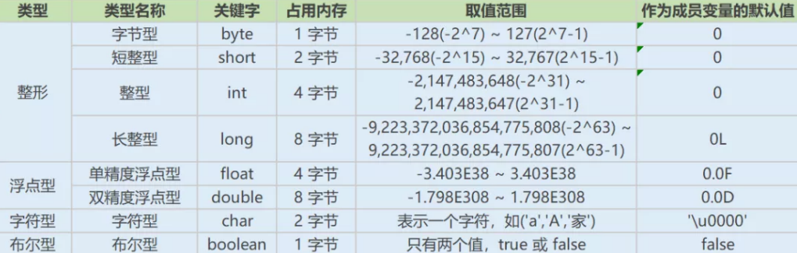

# 目录

[[toc]]

## Java基础

### Java语言特点

1）简单易学。Java有丰富的类库，能够通过静态方法封装，降低`API`的学习成本，提高工作效率。 

2）面向对象。这个也是`Java`最重要的特性， `java` 能够使得程序耦合度更低，内聚性更高。 

3）可靠安全。`Java`生态系统包括用于分析和报告安全性问题的各种工具。 

4）与平台无关。`Java`能够跨平台使用。 

5）支持多线程。`Java`可以采用多线程+协程方式实现更多的并发操作

### 面向对象和面向过程的区别

#### 面向过程

字面意义上就是面向的是过程，先做什么、在做什么、最后做什么，然后用函数把 这些步骤一步一步地实现，在使用的时候一一调用则可。

#### 面向对象

字面意义上就是面向的是对象，是把构成问题的事务分解成各个对象，但是建立对象的目的也不是为了完成一个个步骤，而是为了描述某个事物在解决整个问题的过程中所发生的行为。

### 面向对象编程三大特性

#### 封装

封装把一个对象的属性私有化，同时提供一些可以被外界访问的属性的方法，如果属性不想被外界访问，我们大可不必提供方法给外界访问。

> 如果一个类没有提供给外界访问的方法，那么这个类也没有什么意义了。 

#### 继承

继承是使用已存在的类的定义作为基础建立新类的技术，新类的定义可以增加新的数据或新的功能，也可以用父类的功能，但不能选择性地继承

#### 多态

所谓多态就是指程序中定义的引用变量所指向的具体类型和通过该引用变量发出的方法调用在编程时并不确 定，是在程序运行期间才确定

即一个引用变量到底会指向哪个类的实例对象，该引用变量发出的方法调用到底是哪个类中实现的方法，必须在由程序运行期间才能决定。

### 八种基本数据类型的大小，以及他们的封装类

### JDK、JRE、JVM

`Java` 虚拟机（JVM）是运行 `Java` 字节码的虚拟机。`JVM` 有针对不同系统的特定实现（Windows，Linux， macOS），目的是使用相同的字节码，它们都会给出相同的结果。字节码和不同系统的 `JVM` 实现是 Java 语言“一 次编译，随处可以运行”的关键所在。 

`JDK` 是 Java Development Kit，它是功能齐全的 `Java SDK`。它拥有 `JRE` 所拥有的一切，还有编译器（javac）和工具（如 javadoc 和 jdb）。它能够创建和编译程序。

`JRE` 是 `Java` 运行时环境。它是运行已编译 `Java` 程序所需的所有内容的集合，包括 `Java` 虚拟机（JVM），`Java` 类库，`java` 命令和其他的些基础构件。但是，它不能用于创建新程序。

### instanceof

`instanceof` 严格来说是`Java`中的一个双目运算符，用来测试一个对象是否为一个类的实例

~~~java
boolean result = obj instanceof Class
~~~

~~~java
int i = 0;
//编译不通过 i必须是引用类型，不能是基本类型
System.out.println(i instanceof Integer);
//编译不通过
System.out.println(i instanceof Object);
Integer integer = new Integer(1);
System.out.println(integer instanceof Integer);//true
//false ,在 JavaSE规范 中对 instanceof 运算符的规定就是：如果 obj 为 null，那么将返回 false。
System.out.println(null instanceof Object);
~~~

### Java自动装箱与拆箱

装箱就是自动将基本数据类型转换为包装器类型（ int-->Integer ）；

调用方法：`Integer`的 `valueOf(int)` 方法 

拆箱就是自动将包装器类型转换为基本数据类型（ Integer-->int ）。

调用方法：`Integer`的 `intValue` 方法

> 在 JDK5 之前，如果要生成一个数值为10的Integer对象，必须这样进行
>
> ~~~java
> Integer i = new Integer(10);
> ~~~
>
> 而在从 JDK5 开始就提供了自动装箱的特性，如果要生成一个数值为10的Integer对象，只需要这样就可以了
>
> ~~~java
> Integer i = 10;
> ~~~

### 重载和重写

#### 重写(Override) 

从字面上看，重写就是重新写一遍的意思。其实就是在子类中把父类本身有的方法重新写一遍。

子类继承了父类原 有的方法，但有时子类并不想原封不动的继承父类中的某个方法，所以在方法名，参数列表，返回类型(除过子类 中方法的返回值是父类中方法返回值的子类时)都相同的情况下， 对方法体进行修改或重写，这就是重写。

> 注意子类函数的访问修饰权限不能少于父类的。

~~~java
public class Father {
    public static void main(String[] args) {
// TODO Auto-generated method stub
        Son s = new Son();
        s.sayHello();
    }
    public void sayHello() {
        System.out.println("Hello");
    }
}
class Son extends Father{
    @Override
    public void sayHello() {
// TODO Auto-generated method stub
        System.out.println("hello by ");
    }
}
~~~

#### 重载（Overload） 

在一个类中，同名的方法如果有不同的参数列表（参数类型不同、参数个数不同甚至是参数顺序不同）则视为重 载。

同时，重载对返回类型没有要求，可以相同也可以不同，但不能通过返回类型是否相同来判断重载。

~~~java
public class Father {
    public static void main(String[] args) {
// TODO Auto-generated method stub
        Father s = new Father();
        s.sayHello();
        s.sayHello("wintershii");
    }
    public void sayHello() {
        System.out.println("Hello");
    }
    public void sayHello(String name) {
        System.out.println("Hello" + " " + name);
    }
}
~~~

> 重载Overload是一个类中多态性的一种表现

### Integer a= 127 与 Integer b = 127相等吗

如果整型字面量的值在-128到127之间，那么自动装箱时不会`new`新的`Integer`对象，而是直接引用常量池中的 `Integer`对象，超过范围 a1==b1的结果是`false`

### 抽象类和接口的对比

抽象类是用来捕捉子类的通用特性的。

接口是抽象方法的集合。

#### 相同点

- 接口和抽象类都不能实例化 
- 都位于继承的顶端，用于被其他实现或继承 
- 都包含抽象方法，其子类都必须覆写这些抽象方法

#### 不同点

| 参数       | 抽象类   | 接口         |
| ---------- | -------- | ------------ |
| 声明       | abstract | interface    |
| 实现       | extends  | implements   |
| 构造器     | 可以有   | 不能有       |
| 访问修饰符 | 任意的   | public       |
| 多继承     | 单继承   | 多实现       |
| 字段声明   | 任意的   | static final |

### 内部类优点

- 一个内部类对象可以访问创建它的外部类对象的内容，包括私有数据！ 
- 内部类不为同一包的其他类所见，具有很好的封装性； 
- 内部类有效实现了“多重继承”，优化 java 单继承的缺陷。 

### Java代码初始化顺序

1. 父类静态变量 
2. 父类静态代码块 
3. 子类静态变量 
4. 子类静态代码块 
5. 父类非静态变量 
6. 父类非静态代码块 
7. 父类构造函数 
8. 子类非静态变量 
9. 子类非静态代码块 
10. 子类构造函数

### equals与== 

#### == 

== 比较的是变量(栈)内存中存放的对象的(堆)内存地址，用来判断两个对象的地址是否相同，即是否是指相同一个 对象。

1、比较的是操作符两端的操作数是否是同一个对象。 

2、两边的操作数必须是同一类型的（可以是父子类之间）才能编译通过。 

3、比较的是地址，如果是具体的阿拉伯数字的比较，值相等则为`true`。

如： int a=10 与 long b=10L 与 double c=10.0 都是相同的（为true），因为他们都指向地址为10的堆。

#### equals 

`equals`用来比较的是两个对象的内容是否相等（更加准确的回答是：有类重写的规定），由于所有的类都是继承自 `java.lang.Object` 类的，所以适用于所有对象

如果没有对该方法进行覆盖的话，调用的仍然是`Object`类中的 方法，而`Object`中的 `equals()` 方法返回的却是`==`的判断。

### hashcode

它返回的就是根据对象的内存地址换算出的一个值。

这样一来，当集合要添加新的元素时，先调用这个元素的 `hashCode()` 方法，就一下子能定位到它应该放置的物理位置上。

如果这个位置上没有元素，它就可以直接存储在这个位置上，不用再进行任何比较了；

如果这个位置上已经有元素了，就调用它的 `equals`方法与新元素进行比较，相同的话就不存了，不相同就散列其它的地址。

这样一来实际调用`equals`方法的次 数就大大降低了，几乎只需要一两次。

### String 、 StringBuffer 和 StringBuilder

`String`是只读字符串，它并不是基本数据类型，而是一个对象。

从底层源码来看是一个`final`类型的字符数组，所引用的字符串不能被改变，一经定义，无法再增删改。

每次对 `String` 的操作都会生成新的 `String` 对象。

~~~java
private final char value[];
~~~

每次`+`操作 ： 隐式在堆上`new`了一个跟原字符串相同的 `StringBuilder` 对象，再调用`append`方法 拼接`+`后面的字 符。

`StringBuffer` 和 `StringBuilder` 他们两都继承了 `AbstractStringBuilder` 抽象类，从 `AbstractStringBuilder` 抽 象类中我们可以看到

~~~java
/**
* The value is used for character storage.
*/
char[] value;
~~~

他们的底层都是可变的字符数组，所以在进行频繁的字符串操作时，建议使用 `StringBuffer` 和 `StringBuilder` 来 进行操作。 

另外 `StringBuffer` 对方法加了同步锁或者对调用的方法加了同步锁，所以是线程安全的。 

`StringBuilder` 并没有对方法进行加同步锁，所以是非线程安全的。

### Java创建对象的几种方式

- new创建新对象 
- 通过反射机制 
- 采用`clone`机制 
- 通过序列化机制

### 深拷贝和浅拷贝

#### 浅拷贝

被复制对象的所有变量都含有与原来的对象相同的值,而所有的对其他对象的引用仍然指向原来的对象.

换言之,浅拷贝仅复制所考虑的对象,而不复制它所引用的对象. 

#### 深拷贝

被复制对象的所有变量都含有与原来的对象相同的值.而那些引用其他对象的变量将指向被复制过的新对象.而不再是原有的那些被引用的对象.

换言之.深拷贝把要复制的对象所引用的对象都复制了一遍.

> 深浅拷贝指的是被拷贝对象的引用类型属性是否还是指向原来的。

### final

- 被`final`修饰的类不可以被继承 
- 被`final`修饰的方法不可以被重写 
- 被`final`修饰的变量不可以被改变.
  - 如果修饰引用，那么表示引用不可变,引用指向的内容可变. 
- 被`final`修饰的方法，`JVM`会尝试将其内联，以提高运行效率 
- 被`final`修饰的常量，在编译阶段会存入常量池中.

### final finally finalize

`final`可以修饰类、变量、方法，修饰类表示该类不能被继承、修饰方法表示该方法不能被重写、修饰变量表 示该 变量是一个常量不能被重新赋值。 

`finally`一般作用在`try-catch`代码块中，在处理异常的时候，通常我们将一定要执行的代码方法`finally`代码块 中，表示不管是否出现异常，该代码块都会执行，一般用来存放一些关闭资源的代码。 

`finalize`是一个方法，属于`Object`类的一个方法，而`Object`类是所有类的父类，该方法一般由垃圾回收器来调用， 当我们调用 `System.gc()` 方法的时候，由垃圾回收器调用`finalize()`，回收垃圾，一个对象是否可回收的最后判 断。

### this关键字

`this`是自身的一个对象，代表对象本身，可以理解为：指向对象本身的一个指针。 

`this`的用法在`java`中大体可以分为3种： 

- 普通的直接引用，`this`相当于是指向当前对象本身。 
- 形参与成员名字重名，用`this`来区分。 
- 引用本类的构造函数 。

### super关键字

`super`可以理解为是指向自己超（父）类对象的一个指针，而这个超类指的是离自己最近的一个父类。 

`super`也有三种用法： 

- 普通的直接引用，与`this`类似，`super`相当于是指向当前对象的父类的引用，这样就可以用 `super.xxx` 来引用父类的成员。 
- 子类中的成员变量或方法与父类中的成员变量或方法同名时，用`super`进行区分
- 引用父类构造函数 
  - `super`（参数）：调用父类中的某一个构造函数（应该为构造函数中的第一条语句）。 
  - `this`（参数）：调用本类中另一种形式的构造函数（应该为构造函数中的第一条语句）。

### this与super的区别

**super:** 它引用当前对象的直接父类中的成员

**this：**它代表当前对象名

`super()`和t`his()`类似,区别是，`super()`在子类中调用父类的构造方法，`this()`在本类内调用本类的其它构造方法。 

**super()和this()均需放在构造方法内第一行。** 

尽管可以用`this`调用一个构造器，但却不能调用两个。 

**this和super不能同时出现在一个构造函数里面**，因为`this`必然会调用其它的构造函数，其它的构造函数必然也会 有`super`语句的存在，所以在同一个构造函数里面有相同的语句，就失去了语句的意义，编译器也不会通过。 

`this()`和`super()`都指的是对象，所以，均不可以在`static`环境中使用。包括：`static`变量,`static`方法，`static`语句块。 

> 从本质上讲，`this`是一个指向本对象的指针, 然而`super`是一个`Java`关键字。

### static

static关键字这两个基本的用法

- 静态变量
- 静态方法

被`static`所修饰的变量/方法都属于类的静态资源,类实例所共享

`static`也用于静态块,多用于初始化操作

~~~java
public calss PreCache{
	static{
		//执行相关操作
	}
}
~~~

此外`static`也多用于修饰内部类,此时称之为静态内部类。 

最后一种用法就是静态导包，即 `import static` 。 

> import static 是在 JDK 1.5 之后引入的新特性,可以用来指定导入某个类中的静态资源,并且不需要使用类名,可以 直接使用资源名。

~~~java
import static java.lang.Math.*;
public class Test{
	public static void main(String[] args){
		//System.out.println(Math.sin(20));传统做法
		System.out.println(sin(20));
	}
}

~~~

> 注意：
>
> - 静态只能访问静态。 
> - 非静态既可以访问非静态的，也可以访问静态的。

### &和&&

`&`运算符有两种用法：(1)按位与；(2)逻辑与。

`&&`运算符是短路与运算

> 如果 `&&`左边的表达式的值是 `false`，右边的表达式会被直接短路掉，不会进行运算
>
> 注意：逻辑或运算符（|）和短路或运算符（||）的差别也是如此。

### switch

switch(expr)中，expr 只能是 

`byte`、`short`、`char`、`int`。从 Java5 开始，Java 中引入了枚举类 型，expr 也可以是 `enum` 类型，从 Java 7 开始，expr 还可以是字符串（`String`）

### eqauls 方法和 hashCode

(1)如果两个对象相同（equals 方法返回 true），那么它们的 `hashCode` 值一定要相同； 

(2)如果两个对象的 `hashCode` 相同，x.equals(y) 不一定为true。

### a=a+b与a+=b

`+=` 操作符会进行隐式自动类型转换，操作的结果类型强制转换为持有结果的类型

### try catch finally，try里有return，finally还执行么

执行，并且`finally`的执行早于`try`里面的`return` 

结论： 

1、不管有木有出现异常，`finally`块中代码都会执行； 

2、当`try`和`catch`中有`return`时，`finally`仍然会执行； 

3、`finally`是在`return`后面的表达式运算后执行的（此时并没有返回运算后的值，而是先把要返回的值保存起来， 管finally中的代码怎么样，返回的值都不会改变，任然是之前保存的值），所以函数返回值是在`finally`执行前确定 的； 

4、`finally`中最好不要包含`return`，否则程序会提前退出，返回值不是`try`或`catch`中保存的返回值

### transient

`transient` 关键字的作用是

- 阻止实例中那些用此关键字修饰的的变量序列化；

- 当对象被反序列化时，被 `transient` 修饰的变量值不会被持久化和恢复。 

- > `transient` 只能修饰变量，不能修饰类和方法

### 反射

反射机制是在运行时，对于任意一个类，都能够知道这个类的所有属性和方法；

对于任意个对象，都能够调用它的 任意一个方法。

在java中，只要给定类的名字，就可以通过反射机制来获得类的所有信息。 

这种动态获取的信息以及动态调用对象的方法的功能称为Java语言的反射机制

#### 反射的实现方式

获取`Class`对象，有4中方法： 

1）`Class.forName(“类的路径”)；`

2）类名`.class` 

3）对象名`.getClass()` 

4） 基本类型的包装类，可以调用包装类的`Type`属性来获得该包装类的`Class`对象

#### 实现Java反射的类

1）`Class`：表示正在运行的`Java`应用程序中的类和接口 

注意： 所有获取对象的信息都需要`Class`类来实现。 

2） `Field`：提供有关类和接口的属性信息，以及对它的动态访问权限。 

3）`Constructor`：提供关于类的单个构造方法 的信息以及它的访问权限 

4）`Method`：提供类或接口中某个方法的信息

### String类的intern()

`Stirng` 中的 `intern()` 是个`Native`方法

它会首先从常量池中查找是否存在该常量值的字符串,若不存在则先在常量池中创建，否则直接返回常量池已经存在的字符串的引用

~~~java
String s1="aa";
String s2=s1.intern();
System.out.print(s1==s2); // true
~~~

### String字符串为什么说是不可变

没有提供public修饰的方法来修改value数组，所以，你是没发改变其内容的。