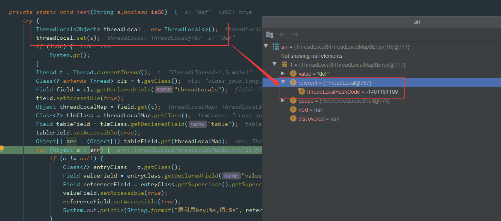

# Java并发

## 一、创建线程

有三种创建线程的方法：

- 实现 `Runnable` 接口
- 实现 `Callable` 接口
- 继承 `Thread` 类

实现 `Runnable` 和 `Callable` 接口的类只能当做一个可以在线程中运行的任务，不是真正意义上的线程，因此最后还需要通过 `Thread` 来调用。

::: tip

任务是通过线程驱动从而执行的。

:::

### Thread

同样也是需要实现 `run()` 方法，因为 `Thread` 类也实现了 `Runable` 接口。

当调用 `start()` 方法启动一个线程时，虚拟机会将该线程放入就绪队列中等待被调度，当一个线程被调度时会执行该线程的 `run()` 方法

```java
public class MyThread extends Thread {
    public void run() {
        // 要执行的任务
    }
}
public static void main(String[] args) {
    MyThread mt = new MyThread();
    mt.start();
}
```

### Runnable

需要实现接口中的 `run()` 方法。

```java
public class MyRunnable implements Runnable {
    @Override
    public void run() {
        // 要执行的任务
    }
}
```

使用 `Runnable` 实例再创建一个 `Thread` 实例，然后调用 `Thread` 实例的 `start()` 方法来启动线程。

```java
public static void main(String[] args) {
    MyRunnable instance = new MyRunnable();
    Thread thread = new Thread(instance);
    thread.start();
}
```

### Callable

与 `Runnable` 相比，`Callable` 可以有返回值，返回值通过 `FutureTask` 进行封装

```java
public class MyCallable implements Callable<Integer> {
    public Integer call() {
        return 123;
    }
}
public static void main(String[] args) throws ExecutionException, InterruptedException {
    MyCallable mc = new MyCallable();
    FutureTask<Integer> ft = new FutureTask<>(mc);
    Thread thread = new Thread(ft);
    thread.start();
    // 通过 get 方法获取执行结果
    System.out.println(ft.get());
}
```

### 实现接口 VS 继承 Thread

实现接口会更好一些，因为：

- `Java` 不支持多重继承，因此继承了 `Thread` 类就无法继承其它类，但是可以实现多个接口；
- 类可能只要求可执行就行，继承整个 `Thread` 类开销过大。

## 二、线程状态

线程一共有六种状态


一个线程只能处于一种状态，并且这里的线程状态特指 Java 虚拟机的线程状态，不能反映线程在特定操作系统下的状态。

### 新建（NEW）

创建后尚未启动

### 可运行（RUNNABLE）

线程已经调用了`start()`，等待CPU调度

### 阻塞（BLOCKED）

线程在执行的时候未竞争到锁对象，则该线程进入阻塞状态

### 无限期等待（WAITING）

等待其它线程调用`notify()`或`notifyAll()`显式地唤醒。

阻塞和等待的区别在于，阻塞是被动的，它是在等待获取 `monitor lock`。

而等待是主动的，通过调用 `Object.wait()` 等方法进入。

| 进入方法                                   | 退出方法                             |
| ------------------------------------------ | ------------------------------------ |
| 没有设置 Timeout 参数的 Object.wait() 方法 | Object.notify() / Object.notifyAll() |
| 没有设置 Timeout 参数的 Thread.join() 方法 | 被调用的线程执行完毕                 |
| LockSupport.park() 方法                    | LockSupport.unpark(Thread)           |

### 限期等待（TIMED WAITING）

无需等待其它线程显式地唤醒，在一定时间之后会被系统自动唤醒。

| 进入方法                                 | 退出方法                                        |
| ---------------------------------------- | ----------------------------------------------- |
| Thread.sleep() 方法                      | 时间结束                                        |
| 设置了 Timeout 参数的 Object.wait() 方法 | 时间结束 / Object.notify() / Object.notifyAll() |
| 设置了 Timeout 参数的 Thread.join() 方法 | 时间结束 / 被调用的线程执行完毕                 |
| LockSupport.parkNanos() 方法             | LockSupport.unpark(Thread)                      |
| LockSupport.parkUntil() 方法             | LockSupport.unpark(Thread)                      |

调用 `Thread.sleep()` 方法使线程进入限期等待状态时，常常用“使一个线程睡眠”进行描述。

调用 `Object.wait()` 方法使线程进入限期等待或者无限期等待时，常常用“挂起一个线程”进行描述。

::: tip

睡眠和挂起是用来描述行为，而阻塞和等待用来描述状态。

:::

### 死亡（TERMINATED）

可以是线程结束任务之后自己结束，或者产生了异常而结束。

## 三、线程间通信

当多个线程可以一起工作去解决某个问题时，如果某些部分必须在其它部分之前完成，那么就需要对线程进行协调。

### join()

在线程中调用另一个线程的 `join()` 方法，会将当前线程挂起，而不是忙等待，直到目标线程结束。

对于以下代码，虽然 b 线程先启动，但是因为在 b 线程中调用了 a 线程的 `join()` 方法，b 线程会等待 a 线程结束才继续执行，因此最后能够保证 a 线程的输出先于 b 线程的输出。

```java
public class JoinExample {

    private class A extends Thread {
        @Override
        public void run() {
            System.out.println("A");
        }
    }

    private class B extends Thread {

        private A a;

        B(A a) {
            this.a = a;
        }

        @Override
        public void run() {
            try {
                a.join();
            } catch (InterruptedException e) {
                e.printStackTrace();
            }
            System.out.println("B");
        }
    }

    public void test() {
        A a = new A();
        B b = new B(a);
        b.start();
        a.start();
    }
}
public static void main(String[] args) {
    JoinExample example = new JoinExample();
    example.test();
}

// 输出
A
B
```

### wait() notify() notifyAll()

调用 `wait()` 使得线程等待某个条件满足，线程在等待时会被挂起，当其他线程的运行使得这个条件满足时，其它线程会调用 `notify()` 或者 `notifyAll()` 来唤醒挂起的线程。

它们都属于 `Object` 的一部分，而不属于 `Thread`。

只能用在同步方法或者同步控制块中使用，否则会在运行时抛出 `IllegalMonitorStateException`。

使用 `wait()` 挂起期间，线程会释放锁。这是因为，如果没有释放锁，那么其它线程就无法进入对象的同步方法或者同步控制块中，那么就无法执行 `notify()` 或者 `notifyAll()` 来唤醒挂起的线程，造成死锁。

```java
public class WaitNotifyExample {

    public synchronized void before() {
        System.out.println("before");
        notifyAll();
    }

    public synchronized void after() {
        try {
            wait();
        } catch (InterruptedException e) {
            e.printStackTrace();
        }
        System.out.println("after");
    }
}
public static void main(String[] args) {
    ExecutorService executorService = Executors.newCachedThreadPool();
    WaitNotifyExample example = new WaitNotifyExample();
    executorService.execute(() -> example.after());
    executorService.execute(() -> example.before());
}

// 输出
before
after
```

**wait() 和 sleep() 的区别**

- `wait()` 是 `Object` 的方法，而 `sleep()` 是 `Thread` 的静态方法；
- `wait()` 会释放锁，`sleep()` 不会。

### await() signal() signalAll()

`java.util.concurrent` 类库中提供了 `Condition` 类来实现线程之间的协调，可以在 `Condition` 上调用 `await()` 方法使线程等待，其它线程调用 `signal()` 或 `signalAll()` 方法唤醒等待的线程。

相比于 `wait()` 这种等待方式，`await()` 可以指定等待的条件，因此更加灵活。

使用 `Lock` 来获取一个 `Condition` 对象。

```java
public class AwaitSignalExample {

    private Lock lock = new ReentrantLock();
    private Condition condition = lock.newCondition();

    public void before() {
        lock.lock();
        try {
            System.out.println("before");
            condition.signalAll();
        } finally {
            lock.unlock();
        }
    }

    public void after() {
        lock.lock();
        try {
            condition.await();
            System.out.println("after");
        } catch (InterruptedException e) {
            e.printStackTrace();
        } finally {
            lock.unlock();
        }
    }
}
public static void main(String[] args) {
    ExecutorService executorService = Executors.newCachedThreadPool();
    AwaitSignalExample example = new AwaitSignalExample();
    executorService.execute(() -> example.after());
    executorService.execute(() -> example.before());
}

// 输出
before
after
```

## 四、线程池

使用线程池的好处：

- **降低资源消耗**。通过重复利用已创建的线程降低线程创建和销毁造成的消耗。
- **提高响应速度**。当任务到达时，任务可以不需要等到线程创建就能立即执行。
- **提高线程的可管理性**。线程是稀缺资源，如果无限制的创建，不仅会消耗系统资源，还会降低系统的稳定性，使用线程池可以进行统一的分配，调优和监控。

::: tip

线程池一般用于执行多个不相关联的耗时任务，没有多线程的情况下，任务顺序执行，使用了线程池的话可让多个不相关联的任务同时执行

:::

### 前置概念

**1、任务**

执行任务需要实现的 `Runnable` 接口 或 `Callable`接口。

`Runnable` 接口或 `Callable` 接口 实现类都可以被 `ThreadPoolExecutor` 或 `ScheduledThreadPoolExecutor` 执行。

**2、任务的执行**


任务执行机制的核心接口 `Executor` ，以及继承自 `Executor` 接口的 `ExecutorService` 接口。

`ThreadPoolExecutor` 和 `ScheduledThreadPoolExecutor` 这两个关键类实现了 `ExecutorService` 接口

**3、异步计算结果**

异步计算结果的核心 `Future` 接口，以及`Future`接口的实现类`FutureTak`类

当我们把 `Runnable`接口 或 `Callable` 接口 的实现类提交给 `ThreadPoolExecutor` 或 `ScheduledThreadPoolExecutor` 执行。（调用 `submit()` 方法时会返回一个 `FutureTask` 对象）


- 主线程首先要创建实现 `Runnable` 或者 `Callable` 接口的任务对象。
- 把创建完成的实现 `Runnable`/`Callable`接口的 对象直接交给 `ExecutorService` 执行: 
  - `ExecutorService.execute（Runnable command）`
  - 也可以把 `Runnable` 对象或`Callable` 对象提交给 `ExecutorService` 执行（`ExecutorService.submit（Runnable task）`
  - 或 `ExecutorService.submit（Callable task）`。
- 如果执行 `ExecutorService.submit（）`，`ExecutorService` 将返回一个实现`Future`接口的对象
  - 执行 `execute()`方法和 `submit()`方法的区别，`submit()`会返回一个 `FutureTask 对象`
  - 由于 `FutureTask` 实现了 `Runnable`，我们也可以创建 `FutureTask`，然后直接交给 `ExecutorService` 执行。
- 最后，主线程可以执行 `FutureTask.get()`方法来等待任务执行完成。
  - 主线程也可以执行 `FutureTask.cancel（boolean mayInterruptIfRunning）`来取消此任务的执行。

一共可接收7个参数

- `corePoolSize`：线程池的核心线程数量
- `maximumPoolSize`：线程池的最大线程数
- `keepAliveTime`：当线程数大于核心线程数时，多余的空闲线程存活的最长时间
- `unit`：时间单位
- `workQueue`：任务队列，用来储存等待执行任务的队列
- `threadFactory`：线程工厂，用来创建线程
- `handler`：拒绝策略，当提交的任务过多而不能及时处理时，拒绝策略是怎样的

::: tip

`corePoolSize`，`maximumPoolSize` ，`workQueue`，比较重要哦

:::

::: warning 注意

临时线程的创建时机：当所有核心线程都在忙，且任务队列满了，这时在有新的任务来才会创建临时线程去处理。

临时线程的销毁：当临时线程空闲时，经过设定的`keepAliveTime`时间后，才会销毁，而不是立即销毁。

入队时机：新任务来的时候会先判断当前运行的线程数量是否达到核心线程数，如果达到的话，新任务就会被存放在队列

:::

### ThreadPoolExecutor

线程池实现类 `ThreadPoolExecutor` 是 `Executor` 框架最核心的类

#### 构造方法

`ThreadPoolExecutor` 类中提供的四个构造方法。

其余三个都是在这个构造方法的基础上给定某些参数的默认值，比如默认拒绝策略

~~~java
public ThreadPoolExecutor(int corePoolSize,							
                              int maximumPoolSize,					
                              long keepAliveTime,					
                              TimeUnit unit,						
                              BlockingQueue<Runnable> workQueue,	
                              ThreadFactory threadFactory,			
                              RejectedExecutionHandler handler		
                               ) {
        if (corePoolSize < 0 ||
            maximumPoolSize <= 0 ||
            maximumPoolSize < corePoolSize ||
            keepAliveTime < 0)
            throw new IllegalArgumentException();
        if (workQueue == null || threadFactory == null || handler == null)
            throw new NullPointerException();
        this.corePoolSize = corePoolSize;
        this.maximumPoolSize = maximumPoolSize;
        this.workQueue = workQueue;
        this.keepAliveTime = unit.toNanos(keepAliveTime);
        this.threadFactory = threadFactory;
        this.handler = handler;
    }
~~~

一共可接收7个参数

- `corePoolSize`：线程池的核心线程数量
- `maximumPoolSize`：线程池的最大线程数
- `keepAliveTime`：当线程数大于核心线程数时，多余的空闲线程存活的最长时间
- `unit`：时间单位
- `workQueue`：任务队列，用来储存等待执行任务的队列
- `threadFactory`：线程工厂，用来创建线程
- `handler`：拒绝策略，当提交的任务过多而不能及时处理时，拒绝策略是怎样的

::: tip

`corePoolSize`，`maximumPoolSize` ，`workQueue`，比较重要哦

:::

::: warning 注意

临时线程的创建时机：当所有核心线程都在忙，且任务队列满了，这时在有新的任务来才会创建临时线程去处理。

临时线程的销毁：当临时线程空闲时，经过设定的`keepAliveTime`时间后，才会销毁，而不是立即销毁。

入队时机：新任务来的时候会先判断当前运行的线程数量是否达到核心线程数，如果达到的话，新任务就会被存放在队列

:::

#### 拒绝策略

如果当前同时运行的线程数量达到最大线程数量并且队列也已经被放满了任务时，这时再来新任务所采取的策略

- `AbortPolicy` ：抛出 `RejectedExecutionException`来拒绝新任务的处理。（默认）
  - `ThreadPoolExecutor.AbortPolicy`
- `CallerRunsPolicy` ：调用执行自己的线程运行任务，也就是直接在调用`execute`方法的线程中运行被拒绝的任务，如果执行程序已关闭，则会丢弃该任务。因此这种策略会降低对于新任务提交速度，影响程序的整体性能。如果您的应用程序可以承受此延迟并且你要求任何一个任务请求都要被执行的话，你可以选择这个策略。
  - `ThreadPoolExecutor.CallerRunsPolicy`
- `DiscardPolicy` ：不处理新任务，直接丢弃掉。
  - `ThreadPoolExecutor.DiscardPolicy`
- `DiscardOldestPolicy` ： 此策略将丢弃最早的未处理的任务请求
  - `ThreadPoolExecutor.DiscardOldestPolicy`

#### 阻塞队列

线程池常用阻塞队列

- `LinkedBlockingQueue`：无界队列；
  - 容量为 `Integer.MAX_VALUE`
- `SynchronousQueue`：同步队列；
  - 没有容量，不存储元素；
  - 如果有空闲线程，则使用空闲线程来处理，否则新建一个线程来处理任务
  - 线程数是可以无限扩展的，可能会创建大量线程，从而导致 `OOM`
- `DelayedWorkQueue`：延迟阻塞队列；
  - 内部采用的是“堆”的数据结构，按照延迟的时间长短对任务进行排序
  - 每次出队的任务都是当前队列中执行时间最靠前的
  - 元素满了之后会自动扩容原来容量的 `1/2`，即永远不会阻塞，最大扩容可达 `Integer.MAX_VALUE`

### 线程池的创建

#### 方式一

通过`ThreadPoolExecutor`构造函数来创建（推荐）


#### 方式二

通过 `Executor` 框架的工具类 `Executors` 来创建

通过这种方式我们可以创建多种类型的 `ThreadPoolExecutor`：

- `FixedThreadPool` ： 该方法返回一个固定线程数量的线程池。该线程池中的线程数量始终不变。当有一个新的任务提交时，线程池中若有空闲线程，则立即执行。若没有，则新的任务会被暂存在一个任务队列中，待有线程空闲时，便处理在任务队列中的任务。
- `SingleThreadExecutor`： 该方法返回一个只有一个线程的线程池。若多余一个任务被提交到该线程池，任务会被保存在一个任务队列中，待线程空闲，按先入先出的顺序执行队列中的任务。
- `CachedThreadPool`： 该方法返回一个可根据实际情况调整线程数量的线程池。线程池的线程数量不确定，但若有空闲线程可以复用，则会优先使用可复用的线程。若所有线程均在工作，又有新的任务提交，则会创建新的线程处理任务。所有线程在当前任务执行完毕后，将返回线程池进行复用。
- `ScheduledThreadPool` ：该返回一个用来在给定的延迟后运行任务或者定期执行任务的线程池。

::: tip

**阿里巴巴Java手册**强制线程池不允许使用 `Executors` 去创建，而是通过 `ThreadPoolExecutor` 构造函数的方式，这样的创建方式让我们更加明确线程池的运行规则，规避资源耗尽的风险

:::

### 方法对比

#### `execute()` 与 `submit()`

- `execute()`方法用于提交不需要返回值的任务，所以无法判断任务是否被线程池执行成功与否；
- `submit()`方法用于提交需要返回值的任务。线程池会返回一个 `Future` 类型的对象，通过这个 `Future` 对象可以判断任务是否执行成功，并且可以通过 `Future` 的 `get()`方法来获取返回值，`get()`方法会阻塞当前线程直到任务完成，而使用 `get（long timeout，TimeUnit unit）`方法的话，如果在 `timeout` 时间内任务还没有执行完，就会抛出 `java.util.concurrent.TimeoutException`

#### `shutdown()`VS`shutdownNow()`

- **`shutdown（）`** :关闭线程池，线程池的状态变为 `SHUTDOWN`。线程池不再接受新任务了，但是队列里的任务得执行完毕。
- **`shutdownNow（）`** :关闭线程池，线程的状态变为 `STOP`。线程池会终止当前正在运行的任务，并停止处理排队的任务并返回正在等待执行的 List。

#### `isTerminated()` VS `isShutdown()`

- **`isShutDown`** 当调用 `shutdown()` 方法后返回为 true。
- **`isTerminated`** 当调用 `shutdown()` 方法后，并且所有提交的任务完成后返回为 true


### 原理


- 如果当前运行的线程数小于核心线程数，那么就会新建一个线程来执行任务。
- 如果当前运行的线程数等于或大于核心线程数，但是小于最大线程数，那么就把该任务放入到任务队列里等待执行。
- 如果向任务队列投放任务失败（任务队列已经满了），但是当前运行的线程数是小于最大线程数的，就新建一个线程来执行任务。
- 如果当前运行的线程数已经等同于最大线程数了，那么当前任务会被拒绝，饱和策略会调用`RejectedExecutionHandler.rejectedExecution()`方法。

`execute`方法

~~~java
  // 存放线程池的运行状态 (runState) 和线程池内有效线程的数量 (workerCount)
   private final AtomicInteger ctl = new AtomicInteger(ctlOf(RUNNING, 0));

    private static int workerCountOf(int c) {
        return c & CAPACITY;
    }
    //任务队列
    private final BlockingQueue<Runnable> workQueue;

    public void execute(Runnable command) {
        // 如果任务为null，则抛出异常。
        if (command == null)
            throw new NullPointerException();
        // ctl 中保存的线程池当前的一些状态信息
        int c = ctl.get();

        //  下面会涉及到 3 步 操作
        // 1.首先判断当前线程池中执行的任务数量是否小于 corePoolSize
        // 如果小于的话，通过addWorker(command, true)新建一个线程，并将任务(command)添加到该线程中；然后，启动该线程从而执行任务。
        if (workerCountOf(c) < corePoolSize) {
            if (addWorker(command, true))
                return;
            c = ctl.get();
        }
        // 2.如果当前执行的任务数量大于等于 corePoolSize 的时候就会走到这里，表明创建新的线程失败。
        // 通过 isRunning 方法判断线程池状态，线程池处于 RUNNING 状态并且队列可以加入任务，该任务才会被加入进去
        if (isRunning(c) && workQueue.offer(command)) {
            int recheck = ctl.get();
            // 再次获取线程池状态，如果线程池状态不是 RUNNING 状态就需要从任务队列中移除任务，并尝试判断线程是否全部执行完毕。同时执行拒绝策略。
            if (!isRunning(recheck) && remove(command))
                reject(command);
                // 如果当前工作线程数量为0，新创建一个线程并执行。
            else if (workerCountOf(recheck) == 0)
                addWorker(null, false);
        }
        //3. 通过addWorker(command, false)新建一个线程，并将任务(command)添加到该线程中；然后，启动该线程从而执行任务。
        // 传入 false 代表增加线程时判断当前线程数是否少于 maxPoolSize
        //如果addWorker(command, false)执行失败，则通过reject()执行相应的拒绝策略的内容。
        else if (!addWorker(command, false))
            reject(command);
    }
~~~

在 `execute` 方法中，多次调用 `addWorker` 方法。

`addWorker` 这个方法主要用来创建新的工作线程，如果返回 `true` 说明创建和启动工作线程成功，否则的话返回的就是 `false`

~~~java
// 全局锁，并发操作必备
    private final ReentrantLock mainLock = new ReentrantLock();
    // 跟踪线程池的最大大小，只有在持有全局锁mainLock的前提下才能访问此集合
    private int largestPoolSize;
    // 工作线程集合，存放线程池中所有的（活跃的）工作线程，只有在持有全局锁mainLock的前提下才能访问此集合
    private final HashSet<Worker> workers = new HashSet<>();
    //获取线程池状态
    private static int runStateOf(int c)     { return c & ~CAPACITY; }
    //判断线程池的状态是否为 Running
    private static boolean isRunning(int c) {
        return c < SHUTDOWN;
    }


    /**
     * 添加新的工作线程到线程池
     * @param firstTask 要执行
     * @param core参数为true的话表示使用线程池的基本大小，为false使用线程池最大大小
     * @return 添加成功就返回true否则返回false
     */
   private boolean addWorker(Runnable firstTask, boolean core) {
        retry:
        for (;;) {
            //这两句用来获取线程池的状态
            int c = ctl.get();
            int rs = runStateOf(c);

            // Check if queue empty only if necessary.
            if (rs >= SHUTDOWN &&
                ! (rs == SHUTDOWN &&
                   firstTask == null &&
                   ! workQueue.isEmpty()))
                return false;

            for (;;) {
               //获取线程池中工作的线程的数量
                int wc = workerCountOf(c);
                // core参数为false的话表明队列也满了，线程池大小变为 maximumPoolSize
                if (wc >= CAPACITY ||
                    wc >= (core ? corePoolSize : maximumPoolSize))
                    return false;
               //原子操作将workcount的数量加1
                if (compareAndIncrementWorkerCount(c))
                    break retry;
                // 如果线程的状态改变了就再次执行上述操作
                c = ctl.get();
                if (runStateOf(c) != rs)
                    continue retry;
                // else CAS failed due to workerCount change; retry inner loop
            }
        }
        // 标记工作线程是否启动成功
        boolean workerStarted = false;
        // 标记工作线程是否创建成功
        boolean workerAdded = false;
        Worker w = null;
        try {

            w = new Worker(firstTask);
            final Thread t = w.thread;
            if (t != null) {
              // 加锁
                final ReentrantLock mainLock = this.mainLock;
                mainLock.lock();
                try {
                   //获取线程池状态
                    int rs = runStateOf(ctl.get());
                   //rs < SHUTDOWN 如果线程池状态依然为RUNNING,并且线程的状态是存活的话，就会将工作线程添加到工作线程集合中
                  //(rs=SHUTDOWN && firstTask == null)如果线程池状态小于STOP，也就是RUNNING或者SHUTDOWN状态下，同时传入的任务实例firstTask为null，则需要添加到工作线程集合和启动新的Worker
                   // firstTask == null证明只新建线程而不执行任务
                    if (rs < SHUTDOWN ||
                        (rs == SHUTDOWN && firstTask == null)) {
                        if (t.isAlive()) // precheck that t is startable
                            throw new IllegalThreadStateException();
                        workers.add(w);
                       //更新当前工作线程的最大容量
                        int s = workers.size();
                        if (s > largestPoolSize)
                            largestPoolSize = s;
                      // 工作线程是否启动成功
                        workerAdded = true;
                    }
                } finally {
                    // 释放锁
                    mainLock.unlock();
                }
                //// 如果成功添加工作线程，则调用Worker内部的线程实例t的Thread#start()方法启动真实的线程实例
                if (workerAdded) {
                    t.start();
                  /// 标记线程启动成功
                    workerStarted = true;
                }
            }
        } finally {
           // 线程启动失败，需要从工作线程中移除对应的Worker
            if (! workerStarted)
                addWorkerFailed(w);
        }
        return workerStarted;
    }
~~~

文章推荐：[4W 字从源码上分析 JUC 线程池 ThreadPoolExecutor 的实现原理](https://www.throwx.cn/2020/08/23/java-concurrency-thread-pool-executor/)

## 五、线程池最佳实践

### 1、使用`ThreadPoolExecutor` 创建线程池

### 2、监控线程池运行状态

- `ThreadPoolExecutor`提供了获取线程池当前的线程数和活跃线程数、已经执行完成的任务数、正在排队中的任务数等`API`

- 

- ~~~java
  /**
   * 打印线程池的状态
   *
   * @param threadPool 线程池对象
   */
  public static void printThreadPoolStatus(ThreadPoolExecutor threadPool) {
      ScheduledExecutorService scheduledExecutorService = new ScheduledThreadPoolExecutor(1, createThreadFactory("print-images/thread-pool-status", false));
      scheduledExecutorService.scheduleAtFixedRate(() -> {
          log.info("=========================");
          log.info("ThreadPool Size: [{}]", threadPool.getPoolSize());
          log.info("Active Threads: {}", threadPool.getActiveCount());
          log.info("Number of Tasks : {}", threadPool.getCompletedTaskCount());
          log.info("Number of Tasks in Queue: {}", threadPool.getQueue().size());
          log.info("=========================");
      }, 0, 1, TimeUnit.SECONDS);
  }
  ~~~

### 3、给线程起个有意义的名字，这样可以方便找 Bug

- 利用 `guava` 的 `ThreadFactoryBuilder`

  - ~~~java
    ThreadFactory threadFactory = new ThreadFactoryBuilder()
                            .setNameFormat(threadNamePrefix + "-%d")
                            .setDaemon(true).build();
    ExecutorService threadPool = new ThreadPoolExecutor(corePoolSize, maximumPoolSize, keepAliveTime, TimeUnit.MINUTES, workQueue, threadFactory)
    ~~~

- 实现 `ThreadFactor`

  - ~~~java
    /**
     * 线程工厂，它设置线程名称，有利于我们定位问题。
     */
    public final class NamingThreadFactory implements ThreadFactory {
    
        private final AtomicInteger threadNum = new AtomicInteger();
        private final ThreadFactory delegate;
        private final String name;
    
        /**
         * 创建一个带名字的线程池生产工厂
         */
        public NamingThreadFactory(ThreadFactory delegate, String name) {
            this.delegate = delegate;
            this.name = name; // TODO consider uniquifying this
        }
    
        @Override
        public Thread newThread(Runnable r) {
            Thread t = delegate.newThread(r);
            t.setName(name + " [#" + threadNum.incrementAndGet() + "]");
            return t;
        }
    
    }
    ~~~

### 4、正确配置线程池参数

如果我们设置的线程池数量太小的话，如果同一时间有大量任务/请求需要处理，可能会导致大量的请求/任务在任务队列中排队等待执行，甚至会出现任务队列满了之后任务/请求无法处理的情况，或者大量任务堆积在任务队列导致 `OOM`。这样很明显是有问题的，CPU 根本没有得到充分利用。

如果我们设置线程数量太大，大量线程可能会同时在争取 CPU 资源，这样会导致大量的上下文切换，从而增加线程的执行时间，影响了整体执行效率。

#### 参考公式

**CPU 密集型任务(N+1)：** 这种任务消耗的主要是 CPU 资源，可以将线程数设置为 N（CPU 核心数）+1。比 CPU 核心数多出来的一个线程是为了防止线程偶发的缺页中断，或者其它原因导致的任务暂停而带来的影响。一旦任务暂停，CPU 就会处于空闲状态，而在这种情况下多出来的一个线程就可以充分利用 CPU 的空闲时间。

**I/O 密集型任务(2N)：** 这种任务应用起来，系统会用大部分的时间来处理 `I/O` 交互，而线程在处理 `I/O` 的时间段内不会占用 CPU 来处理，这时就可以将 CPU 交出给其它线程使用。因此在 `I/O` 密集型任务的应用中，我们可以多配置一些线程，具体的计算方法是 2N。

#### 判断是 CPU 密集任务还是 IO 密集任务

CPU 密集型简单理解就是利用 CPU 计算能力的任务比如你在内存中对大量数据进行排序。

但凡涉及到网络读取，文件读取这类都是 IO 密集型，这类任务的特点是 CPU 计算耗费时间相比于等待 IO 操作完成的时间来说很少，大部分时间都花在了等待 IO 操作完成上

## 六、乐观锁和悲观锁

### 悲观锁

悲观锁总是假设最坏的情况，认为共享资源每次被访问的时候就会出现问题(比如共享数据被修改)，所以每次在获取资源操作的时候都会上锁，这样其他线程想拿到这个资源就会阻塞直到锁被上一个持有者释放。也就是说，**共享资源每次只给一个线程使用，其它线程阻塞，用完后再把资源转让给其它线程**。

像 Java 中`synchronized`和`ReentrantLock`等独占锁就是悲观锁思想的实现。

```java
public void performSynchronisedTask() {
    synchronized (this) {
        // 需要同步的操作
    }
}

private Lock lock = new ReentrantLock();
lock.lock();
try {
   // 需要同步的操作
} finally {
    lock.unlock();
}
```

高并发的场景下，激烈的锁竞争会造成线程阻塞，大量阻塞线程会导致系统的上下文切换，增加系统的性能开销。并且，悲观锁还可能会存在死锁问题，影响代码的正常运行

### 乐观锁

乐观锁总是假设最好的情况，认为共享资源每次被访问的时候不会出现问题，线程可以不停地执行，无需加锁也无需等待，只是在提交修改的时候去验证对应的资源（也就是数据）是否被其它线程修改了（具体方法可以使用版本号机制或 CAS 算法）。

像 Java 中`java.util.concurrent.atomic`包下面的原子变量类（比如`AtomicInteger`、`LongAdder`）就是使用了乐观锁的一种实现方式 **CAS** 实现的。

::: tip

高并发的场景下，乐观锁相比悲观锁来说，不存在锁竞争造成线程阻塞，也不会有死锁的问题，在性能上往往会更胜一筹。但是，如果冲突频繁发生（写占比非常多的情况），会频繁失败和重试（悲观锁的开销是固定的），这样同样会非常影响性能，导致 CPU 飙升。

理论上来说：

- 悲观锁通常多用于【写比较多】的情况下，这样可以避免频繁失败和重试影响性能，悲观锁的开销是固定的
- 乐观锁通常多于【写比较少】的情况下，这样可以避免频繁加锁影响性能。

:::

### 实现乐观锁

乐观锁一般会使用【版本号机制】或 【CAS 算法】实现，CAS 算法相对来说更多一些。

#### 版本号机制

一般是在数据表中加上一个数据版本号 `version` 字段，表示数据被修改的次数。当数据被修改时，`version` 值会加一。当线程 A 要更新数据值时，在读取数据的同时也会读取 `version` 值，在提交更新时，若刚才读取到的 version 值为当前数据库中的 `version` 值相等时才更新(相等说明没被别人改过)，否则重试更新操作，直到更新成功。

**例** ：假设数据库中帐户信息表中有一个 version 字段，当前值为 1 ；而当前帐户余额字段（ `balance` ）为 `$100` 。

1. 操作员 A 此时将其读出（ `version`=1 ），并从其帐户余额中扣除 $50（ $100-$50 ）。
2. 在操作员 A 操作的过程中，操作员 B 也读入此用户信息（ `version`=1 ），并从其帐户余额中扣除 $20 （ $100-$20 ）。
3. 操作员 A 完成了修改工作，将数据版本号（ `version`=1 ），连同帐户扣除后余额（ `balance`=$50 ），提交至数据库更新，此时由于提交数据版本等于数据库记录当前版本，数据被更新，数据库记录 `version` 更新为 2 。
4. 操作员 B 完成了操作，也将版本号（ `version`=1 ）试图向数据库提交数据（ `balance`=$80 ），但此时比对数据库记录版本时发现，操作员 B 提交的数据版本号为 1 ，数据库记录当前版本也为 2 ，不满足 “ 提交版本必须等于当前版本才能执行更新 “ 的乐观锁策略，因此，操作员 B 的提交被驳回。

这样就避免了操作员 B 用基于 `version`=1 的旧数据修改的结果覆盖操作员 A 的操作结果的可能

#### CAS 算法

CAS 的全称是 **Compare And Swap（比较与交换）** ，用于实现乐观锁，被广泛应用于各大框架中。

CAS 的思想很简单，就是用一个预期值和要更新的变量值进行比较，两值相等才会进行更新。

CAS 是一个原子操作，底层依赖于一条 CPU 的原子指令。

> **原子操作** 即最小不可拆分的操作，也就是说操作一旦开始，就不能被打断，直到操作完成。

CAS 涉及到三个操作数：

- **V** ：要更新的变量值(Var)
- **E** ：预期值(Expected)
- **N** ：拟写入的新值(New)

当且仅当 V 的值等于 E 时，CAS 通过原子方式用新值 N 来更新 V 的值。如果不等，说明已经有其它线程更新了 V，则当前线程放弃更新。

**例** ：线程 A 要修改变量 i 的值为 6，i 原值为 1（V = 1，E=1，N=6，假设不存在 ABA 问题）。

1. i 与 1 进行比较，如果相等， 则说明没被其他线程修改，可以被设置为 6 。
2. i 与 1 进行比较，如果不相等，则说明被其他线程修改，当前线程放弃更新，CAS 操作失败。

当多个线程同时使用 CAS 操作一个变量时，只有一个会胜出，并成功更新，其余均会失败，但失败的线程并不会被挂起，仅是被告知失败，并且允许再次尝试，当然也允许失败的线程放弃操作。

Java 语言并没有直接实现 CAS，CAS 相关的实现是通过 C++ 内联汇编的形式实现的（JNI 调用）。因此， CAS 的具体实现和操作系统以及 CPU 都有关系。

### 乐观锁存在的问题

ABA 问题是乐观锁最常见的问题。

#### ABA 问题

如果一个变量 V 初次读取的时候是 A 值，并且在准备赋值的时候检查到它仍然是 A 值，那我们就能说明它的值没有被其他线程修改过了吗？很明显是不能的，因为在这段时间它的值可能被改为其他值，然后又改回 A，那 CAS 操作就会误认为它从来没有被修改过。这个问题被称为 CAS 操作的 **"ABA"问题。**

解决思路是在变量前面追加上**版本号或者时间戳**。JDK 1.5 以后的 `AtomicStampedReference` 类就是用来解决 ABA 问题的，其中的 `compareAndSet()` 方法就是首先检查当前引用是否等于预期引用，并且当前标志是否等于预期标志，如果全部相等，则以原子方式将该引用和该标志的值设置为给定的更新值。

```java
public boolean compareAndSet(V   expectedReference,
                             V   newReference,
                             int expectedStamp,
                             int newStamp) {
    Pair<V> current = pair;
    return
        expectedReference == current.reference &&
        expectedStamp == current.stamp &&
        ((newReference == current.reference &&
          newStamp == current.stamp) ||
         casPair(current, Pair.of(newReference, newStamp)));
}
```

### 循环时间长开销大

CAS 经常会用到自旋操作来进行重试，也就是不成功就一直循环执行直到成功。如果长时间不成功，会给 CPU 带来非常大的执行开销。

如果 JVM 能支持处理器提供的 pause 指令那么效率会有一定的提升，pause 指令有两个作用：

1. 可以延迟流水线执行指令，使 CPU 不会消耗过多的执行资源，延迟的时间取决于具体实现的版本，在一些处理器上延迟时间是零。
2. 可以避免在退出循环的时候因内存顺序冲而引起 CPU 流水线被清空，从而提高 CPU 的执行效率。

### 只能保证一个共享变量的原子操作

CAS 只对单个共享变量有效，当操作涉及跨多个共享变量时 CAS 无效。但是从 JDK 1.5 开始，提供了`AtomicReference`类来保证引用对象之间的原子性，你可以把多个变量放在一个对象里来进行 CAS 操作.所以我们可以使用锁或者利用`AtomicReference`类把多个共享变量合并成一个共享变量来操作。

## 七、ThreadLocal 详解

::: warning 注

本文基于`JDK 1.8`

原文地址：[https://juejin.cn/post/6844904151567040519](https://juejin.cn/post/6844904151567040519)

:::


### 前言

对于`ThreadLocal`，大家的第一反应可能是很简单呀，线程的变量副本，每个线程隔离。那这里有几个问题大家可以思考一下：

- `ThreadLocal`的 key 是**弱引用**，那么在 `ThreadLocal.get()`的时候，发生**GC**之后，key 是否为**null**？
- `ThreadLocal`中`ThreadLocalMap`的**数据结构**？
- `ThreadLocalMap`的**Hash 算法**？
- `ThreadLocalMap`中**Hash 冲突**如何解决？
- `ThreadLocalMap`的**扩容机制**？
- `ThreadLocalMap`中**过期 key 的清理机制**？**探测式清理**和**启发式清理**流程？
- `ThreadLocalMap.set()`方法实现原理？
- `ThreadLocalMap.get()`方法实现原理？
- 项目中`ThreadLocal`使用情况？遇到的坑？
- ......

### 使用示例

~~~java
public class ThreadLocalTest {
    private List<String> messages = Lists.newArrayList();

    public static final ThreadLocal<ThreadLocalTest> holder = ThreadLocal.withInitial(ThreadLocalTest::new);

    public static void add(String message) {
        holder.get().messages.add(message);
    }

    public static List<String> clear() {
        List<String> messages = holder.get().messages;
        holder.remove();

        System.out.println("size: " + holder.get().messages.size());
        return messages;
    }

    public static void main(String[] args) {
        ThreadLocalTest.add("Hello ThreadLocal");
        System.out.println(holder.get().messages);
        ThreadLocalTest.clear();
    }
}
~~~

打印结果：

~~~
[Hello ThreadLocal]
size: 0
~~~

`ThreadLocal`对象可以提供线程局部变量，每个线程`Thread`拥有一份自己的**副本变量**，多个线程互不干扰。

### ThreadLocal 数据结构


`Thread`类有一个类型为`ThreadLocal.ThreadLocalMap`的实例变量`threadLocals`，也就是说每个线程有一个自己的`ThreadLocalMap`。

`ThreadLocalMap`有自己的独立实现，可以简单地将它的`key`视作`ThreadLocal`，`value`为代码中放入的值（实际上`key`并不是`ThreadLocal`本身，而是它的一个**弱引用**）。

每个线程在往`ThreadLocal`里放值的时候，都会往自己的`ThreadLocalMap`里存，读也是以`ThreadLocal`作为引用，在自己的`map`里找对应的`key`，从而实现了**线程隔离**。

`ThreadLocalMap`有点类似`HashMap`的结构，只是`HashMap`是由**数组+链表**实现的，而`ThreadLocalMap`中并没有**链表**结构。

我们还要注意`Entry`， 它的`key`是`ThreadLocal<?> k` ，继承自`WeakReference`， 也就是我们常说的弱引用类型。

### GC 之后 key 是否为 null？

`ThreadLocal` 的`key`是弱引用，那么在`ThreadLocal.get()`的时候，发生`GC`之后，`key`是否是`null`？

为了搞清楚这个问题，我们需要搞清楚`Java`的**四种引用类型**：

- **强引用**：我们常常 `new` 出来的对象就是强引用类型，只要强引用存在，垃圾回收器将永远不会回收被引用的对象，哪怕内存不足的时候
- **软引用**：使用 `SoftReference` 修饰的对象被称为软引用，软引用指向的对象在内存要溢出的时候被回收
- **弱引用**：使用 `WeakReference` 修饰的对象被称为弱引用，只要发生垃圾回收，若这个对象只被弱引用指向，那么就会被回收
- **虚引用**：虚引用是最弱的引用，在 Java 中使用 `PhantomReference` 进行定义。虚引用中唯一的作用就是用队列接收对象即将死亡的通知

接着再来看下代码，我们使用反射的方式来看看`GC`后`ThreadLocal`中的数据情况

~~~java
public class ThreadLocalDemo {

    public static void main(String[] args) throws NoSuchFieldException, IllegalAccessException, InterruptedException {
        Thread t = new Thread(()->test("abc",false));
        t.start();
        t.join();
        System.out.println("--gc后--");
        Thread t2 = new Thread(() -> test("def", true));
        t2.start();
        t2.join();
    }

    private static void test(String s,boolean isGC)  {
        try {
            new ThreadLocal<>().set(s);
            if (isGC) {
                System.gc();
            }
            Thread t = Thread.currentThread();
            Class<? extends Thread> clz = t.getClass();
            Field field = clz.getDeclaredField("threadLocals");
            field.setAccessible(true);
            Object ThreadLocalMap = field.get(t);
            Class<?> tlmClass = ThreadLocalMap.getClass();
            Field tableField = tlmClass.getDeclaredField("table");
            tableField.setAccessible(true);
            Object[] arr = (Object[]) tableField.get(ThreadLocalMap);
            for (Object o : arr) {
                if (o != null) {
                    Class<?> entryClass = o.getClass();
                    Field valueField = entryClass.getDeclaredField("value");
                    Field referenceField = entryClass.getSuperclass().getSuperclass().getDeclaredField("referent");
                    valueField.setAccessible(true);
                    referenceField.setAccessible(true);
                    System.out.println(String.format("弱引用key:%s,值:%s", referenceField.get(o), valueField.get(o)));
                }
            }
        } catch (Exception e) {
            e.printStackTrace();
        }
    }
}
~~~

结果如下：

~~~
弱引用key:java.lang.ThreadLocal@433619b6,值:abc
弱引用key:java.lang.ThreadLocal@418a15e3,值:java.lang.ref.SoftReference@bf97a12
--gc后--
弱引用key:null,值:def
~~~


如图所示，因为这里创建的`ThreadLocal`并没有指向任何值，也就是没有任何引用：

~~~java
new ThreadLocal<>().set(s);
~~~

所以这里在`GC`之后，`key`就会被回收，我们看到上面`debug`中的`referent=null`, 如果**改动一下代码：**



这个问题刚开始看，如果没有过多思考，**弱引用**，还有**垃圾回收**，那么肯定会觉得是`null`。

其实是不对的，因为题目说的是在做 `ThreadLocal.get()` 操作，证明其实还是有**强引用**存在的，所以 `key` 并不为 `null`，如下图所示，`ThreadLocal`的**强引用**仍然是存在的。


如果我们的**强引用**不存在的话，那么 `key` 就会被回收，也就是会出现我们 `value` 没被回收，`key` 被回收，导致 `value` 永远存在，出现**内存泄漏**。

### ThreadLocal.set()方法源码详解


`ThreadLocal`中的`set`方法原理如上图所示，很简单，主要是判断`ThreadLocalMap`是否存在，然后使用`ThreadLocal`中的`set`方法进行数据处理。

代码如下：

主要的核心逻辑还是在`ThreadLocalMap`中的

~~~java
public void set(T value) {
    Thread t = Thread.currentThread();
    ThreadLocalMap map = getMap(t);
    if (map != null)
        map.set(this, value);
    else
        createMap(t, value);
}

void createMap(Thread t, T firstValue) {
    t.threadLocals = new ThreadLocalMap(this, firstValue);
}
~~~

### ThreadLocalMap的Hash 算法

既然是`Map`结构，那么`ThreadLocalMap`当然也要实现自己的`hash`算法来解决散列表数组冲突问题。

~~~java
int i = key.threadLocalHashCode & (len-1);
~~~

`ThreadLocalMap`中`hash`算法很简单，这里`i`就是当前 key 在散列表中对应的数组下标位置。

这里最关键的就是`threadLocalHashCode`值的计算，`ThreadLocal`中有一个属性为`HASH_INCREMENT = 0x61c88647`

~~~java
public class ThreadLocal<T> {
    private final int threadLocalHashCode = nextHashCode();

    private static AtomicInteger nextHashCode = new AtomicInteger();

    private static final int HASH_INCREMENT = 0x61c88647;

    private static int nextHashCode() {
        return nextHashCode.getAndAdd(HASH_INCREMENT);
    }

    static class ThreadLocalMap {
        ThreadLocalMap(ThreadLocal<?> firstKey, Object firstValue) {
            table = new Entry[INITIAL_CAPACITY];
            int i = firstKey.threadLocalHashCode & (INITIAL_CAPACITY - 1);

            table[i] = new Entry(firstKey, firstValue);
            size = 1;
            setThreshold(INITIAL_CAPACITY);
        }
    }
}
~~~

每当创建一个`ThreadLocal`对象，这个`ThreadLocal.nextHashCode` 这个值就会增长 `0x61c88647` 。

这个值很特殊，它是**斐波那契数** 也叫**黄金分割数**。`hash`增量为这个数字，带来的好处就是 `hash` **分布非常均匀**。


可以看到产生的哈希码分布很均匀

### ThreadLocalMap的Hash 冲突

::: tip 提示

下面所有示例图中，**绿色块**`Entry`代表**正常数据**，**灰色块**代表`Entry`的`key`值为`null`，**已被垃圾回收**。**白色块**表示`Entry`为`null`。

:::

虽然`ThreadLocalMap`中使用了**黄金分割数**来作为`hash`计算因子，大大减少了`Hash`冲突的概率，但是仍然会存在冲突。

`HashMap`中解决冲突的方法是在数组上构造一个**链表**结构，冲突的数据挂载到链表上，如果链表长度超过一定数量则会转化成**红黑树**。

而 `ThreadLocalMap` 中并没有链表结构，所以这里不能使用 `HashMap` 解决冲突的方式了。


如上图所示，如果我们插入一个`value=27`的数据，通过 `hash` 计算后应该落入槽位 4 中，而槽位 4 已经有了 `Entry` 数据。

此时就会线性向后查找，一直找到 `Entry` 为 `null` 的槽位才会停止查找，将当前元素放入此槽位中。当然迭代过程中还有其他的情况，后面会一一再说。

这里还画了一个`Entry`中的`key`为`null`的数据（**Entry=2 的灰色块数据**），因为`key`值是**弱引用**类型，所以会有这种数据存在。在`set`过程中，如果遇到了`key`过期的`Entry`数据，实际上是会进行一轮**探测式清理**操作的，具体操作方式后面会说到。

### ThreadLocalMap.set()详解

往`ThreadLocalMap`中`set`数据（**新增**或者**更新**数据）分为好几种情况

**第一种情况：** 通过`hash`计算后的槽位对应的`Entry`数据为空：直接将数据放到该槽位即可。


**第二种情况：** 槽位数据不为空，`key`值与当前`ThreadLocal`通过`hash`计算获取的`key`值一致：直接更新该槽位的数据。


**第三种情况：** 槽位数据不为空，往后遍历过程中，在找到`Entry`为`null`的槽位之前，没有遇到`key`过期的`Entry`：遍历散列数组，线性往后查找，如果找到`Entry`为`null`的槽位，则将数据放入该槽位中，或者往后遍历过程中，遇到了**key 值相等**的数据，直接更新即可。


**第四种情况：** 槽位数据不为空，往后遍历过程中，在找到`Entry`为`null`的槽位之前，遇到`key`过期的`Entry`，如下图，往后遍历过程中，遇到了`index=7`的槽位数据`Entry`的`key=null`：


散列数组下标为 7 位置对应的`Entry`数据`key`为`null`，表明此数据`key`值已经被垃圾回收掉了，此时就会执行`replaceStaleEntry()`方法，该方法含义是**替换过期数据的逻辑**，以**index=7**位起点开始遍历，进行探测式数据清理工作。

初始化探测式清理过期数据扫描的开始位置：`slotToExpunge = staleSlot = 7`

以当前`staleSlot`开始 向前迭代查找，找其他过期的数据，然后更新过期数据起始扫描下标`slotToExpunge`。`for`循环迭代，直到碰到`Entry`为`null`结束。

如果找到了过期的数据，继续向前迭代，直到遇到`Entry=null`的槽位才停止迭代，如下图所示，**slotToExpunge 被更新为 0**：


以当前节点(`index=7`)向前迭代，检测是否有过期的`Entry`数据，如果有则更新`slotToExpunge`值。碰到`null`则结束探测。以上图为例`slotToExpunge`被更新为 0。

上面向前迭代的操作是为了更新探测清理过期数据的起始下标`slotToExpunge`的值，这个值在后面会讲解，它是用来判断当前过期槽位`staleSlot`之前是否还有过期元素。

接着开始以`staleSlot`位置(`index=7`)向后迭代，**如果找到了相同 key 值的 Entry 数据：**


从当前节点`staleSlot`向后查找`key`值相等的`Entry`元素，找到后更新`Entry`的值并交换`staleSlot`元素的位置(`staleSlot`位置为过期元素)，更新`Entry`数据，然后开始进行过期`Entry`的清理工作，如下图所示：


向后遍历过程中，如果没有找到相同 key 值的 Entry 数据：


从当前节点`staleSlot`向后查找`key`值相等的`Entry`元素，直到`Entry`为`null`则停止寻找。通过上图可知，此时`table`中没有`key`值相同的`Entry`。

创建新的`Entry`，替换`table[stableSlot]`位置：


替换完成后也是进行过期元素清理工作，清理工作主要是有两个方法：`expungeStaleEntry()`和`cleanSomeSlots()`，具体细节后面会讲到，请继续往后看。

#### ThreadLocalMap.set()源码详解

上面已经用图的方式解析了`set()`实现的原理，其实已经很清晰了，我们接着再看下源码：

`java.lang.ThreadLocal`.`ThreadLocalMap.set()`:

~~~java
private void set(ThreadLocal<?> key, Object value) {
    Entry[] tab = table;
    int len = tab.length;
    int i = key.threadLocalHashCode & (len-1);

    for (Entry e = tab[i];
         e != null;
         e = tab[i = nextIndex(i, len)]) {
        ThreadLocal<?> k = e.get();

        if (k == key) {
            e.value = value;
            return;
        }

        if (k == null) {
            replaceStaleEntry(key, value, i);
            return;
        }
    }

    tab[i] = new Entry(key, value);
    int sz = ++size;
    if (!cleanSomeSlots(i, sz) && sz >= threshold)
        rehash();
}
~~~

这里会通过`key`来计算在散列表中的对应位置，然后以当前`key`对应的桶的位置向后查找，找到可以使用的桶。

~~~java
Entry[] tab = table;
int len = tab.length;
int i = key.threadLocalHashCode & (len-1);
~~~

什么情况下桶才是可以使用的呢？

1. `k = key` 说明是替换操作，可以使用
2. 碰到一个过期的桶，执行替换逻辑，占用过期桶
3. 查找过程中，碰到桶中`Entry=null`的情况，直接使用

接着就是执行`for`循环遍历，向后查找，我们先看下`nextIndex()`、`prevIndex()`方法实现：


~~~java
private static int nextIndex(int i, int len) {
    return ((i + 1 < len) ? i + 1 : 0);
}

private static int prevIndex(int i, int len) {
    return ((i - 1 >= 0) ? i - 1 : len - 1);
}
~~~

接着看剩下`for`循环中的逻辑：

1. 遍历当前`key`值对应的桶中`Entry`数据为空，这说明散列数组这里没有数据冲突，跳出`for`循环，直接`set`数据到对应的桶中
2. 如果`key`值对应的桶中`Entry`数据不为空
    2.1 如果`k = key`，说明当前`set`操作是一个替换操作，做替换逻辑，直接返回
    2.2 如果`key = null`，说明当前桶位置的`Entry`是过期数据，执行`replaceStaleEntry()`方法(核心方法)，然后返回
3. `for`循环执行完毕，继续往下执行说明向后迭代的过程中遇到了`entry`为`null`的情况
    3.1 在`Entry`为`null`的桶中创建一个新的`Entry`对象
    3.2 执行`++size`操作
4. 调用`cleanSomeSlots()`做一次启发式清理工作，清理散列数组中`Entry`的`key`过期的数据
    4.1 如果清理工作完成后，未清理到任何数据，且`size`超过了阈值(数组长度的 2/3)，进行`rehash()`操作
    4.2 `rehash()`中会先进行一轮探测式清理，清理过期`key`，清理完成后如果**size >= threshold - threshold / 4**，就会执行真正的扩容逻辑(扩容逻辑往后看)

接着重点看下`replaceStaleEntry()`方法，`replaceStaleEntry()`方法提供替换过期数据的功能，我们可以对应上面**第四种情况**的原理图来再回顾下，具体代码如下：

`java.lang.ThreadLocal.ThreadLocalMap.replaceStaleEntry()`:

~~~java
private void replaceStaleEntry(ThreadLocal<?> key, Object value,
                                       int staleSlot) {
    Entry[] tab = table;
    int len = tab.length;
    Entry e;

    int slotToExpunge = staleSlot;
    for (int i = prevIndex(staleSlot, len);
         (e = tab[i]) != null;
         i = prevIndex(i, len))

        if (e.get() == null)
            slotToExpunge = i;

    for (int i = nextIndex(staleSlot, len);
         (e = tab[i]) != null;
         i = nextIndex(i, len)) {

        ThreadLocal<?> k = e.get();

        if (k == key) {
            e.value = value;

            tab[i] = tab[staleSlot];
            tab[staleSlot] = e;

            if (slotToExpunge == staleSlot)
                slotToExpunge = i;
            cleanSomeSlots(expungeStaleEntry(slotToExpunge), len);
            return;
        }

        if (k == null && slotToExpunge == staleSlot)
            slotToExpunge = i;
    }

    tab[staleSlot].value = null;
    tab[staleSlot] = new Entry(key, value);

    if (slotToExpunge != staleSlot)
        cleanSomeSlots(expungeStaleEntry(slotToExpunge), len);
}
~~~

`slotToExpunge`表示开始探测式清理过期数据的开始下标，默认从当前的`staleSlot`开始。以当前的`staleSlot`开始，向前迭代查找，找到没有过期的数据，`for`循环一直碰到`Entry`为`null`才会结束。如果向前找到了过期数据，更新探测清理过期数据的开始下标为 i，即`slotToExpunge=i`

~~~java
for (int i = prevIndex(staleSlot, len);
     (e = tab[i]) != null;
     i = prevIndex(i, len)){

    if (e.get() == null){
        slotToExpunge = i;
    }
}
~~~

接着开始从`staleSlot`向后查找，也是碰到`Entry`为`null`的桶结束。 如果迭代过程中，**碰到 k == key**，这说明这里是替换逻辑，替换新数据并且交换当前`staleSlot`位置。如果`slotToExpunge == staleSlot`，这说明`replaceStaleEntry()`一开始向前查找过期数据时并未找到过期的`Entry`数据，接着向后查找过程中也未发现过期数据，修改开始探测式清理过期数据的下标为当前循环的 index，即`slotToExpunge = i`。最后调用`cleanSomeSlots(expungeStaleEntry(slotToExpunge), len);`进行启发式过期数据清理。

~~~java
if (k == key) {
    e.value = value;

    tab[i] = tab[staleSlot];
    tab[staleSlot] = e;

    if (slotToExpunge == staleSlot)
        slotToExpunge = i;

    cleanSomeSlots(expungeStaleEntry(slotToExpunge), len);
    return;
}
~~~

`cleanSomeSlots()`和`expungeStaleEntry()`方法后面都会细讲，这两个是和清理相关的方法，一个是过期`key`相关`Entry`的启发式清理(`Heuristically scan`)，另一个是过期`key`相关`Entry`的探测式清理。

**如果 k != key**则会接着往下走，`k == null`说明当前遍历的`Entry`是一个过期数据，`slotToExpunge == staleSlot`说明，一开始的向前查找数据并未找到过期的`Entry`。如果条件成立，则更新`slotToExpunge` 为当前位置，这个前提是前驱节点扫描时未发现过期数据。

~~~java
if (k == null && slotToExpunge == staleSlot)
    slotToExpunge = i;
~~~

往后迭代的过程中如果没有找到`k == key`的数据，且碰到`Entry`为`null`的数据，则结束当前的迭代操作。此时说明这里是一个添加的逻辑，将新的数据添加到`table[staleSlot]` 对应的`slot`中。

```java
tab[staleSlot].value = null;
tab[staleSlot] = new Entry(key, value);
```

最后判断除了`staleSlot`以外，还发现了其他过期的`slot`数据，就要开启清理数据的逻辑：

```java
if (slotToExpunge != staleSlot)
    cleanSomeSlots(expungeStaleEntry(slotToExpunge), len);
```

### ThreadLocalMap过期 key 的探测式清理流程

上面我们有提及`ThreadLocalMap`的两种过期`key`数据清理方式：**探测式清理**和**启发式清理**。

我们先讲下探测式清理，也就是`expungeStaleEntry`方法，遍历散列数组，从开始位置向后探测清理过期数据，将过期数据的`Entry`设置为`null`，沿途中碰到未过期的数据则将此数据`rehash`后重新在`table`数组中定位，如果定位的位置已经有了数据，则会将未过期的数据放到最靠近此位置的`Entry=null`的桶中，使`rehash`后的`Entry`数据距离正确的桶的位置更近一些。操作逻辑如下：


如上图，`set(27)` 经过 hash 计算后应该落到`index=4`的桶中，由于`index=4`桶已经有了数据，所以往后迭代最终数据放入到`index=7`的桶中，放入后一段时间后`index=5`中的`Entry`数据`key`变为了`null`


如果再有其他数据`set`到`map`中，就会触发**探测式清理**操作。

如上图，执行**探测式清理**后，`index=5`的数据被清理掉，继续往后迭代，到`index=7`的元素时，经过`rehash`后发现该元素正确的`index=4`，而此位置已经有了数据，往后查找离`index=4`最近的`Entry=null`的节点(刚被探测式清理掉的数据：`index=5`)，找到后移动`index= 7`的数据到`index=5`中，此时桶的位置离正确的位置`index=4`更近了。

经过一轮探测式清理后，`key`过期的数据会被清理掉，没过期的数据经过`rehash`重定位后所处的桶位置理论上更接近`i= key.hashCode & (tab.len - 1)`的位置。这种优化会提高整个散列表查询性能。

接着看下`expungeStaleEntry()`具体流程，我们还是以先原理图后源码讲解的方式来一步步梳理：


我们假设`expungeStaleEntry(3)` 来调用此方法，如上图所示，我们可以看到`ThreadLocalMap`中`table`的数据情况，接着执行清理操作：


第一步是清空当前`staleSlot`位置的数据，`index=3`位置的`Entry`变成了`null`。然后接着往后探测：


执行完第二步后，index=4 的元素挪到 index=3 的槽位中。

继续往后迭代检查，碰到正常数据，计算该数据位置是否偏移，如果被偏移，则重新计算`slot`位置，目的是让正常数据尽可能存放在正确位置或离正确位置更近的位置


在往后迭代的过程中碰到空的槽位，终止探测，这样一轮探测式清理工作就完成了，接着我们继续看看具体**实现源代码**：

~~~java
private int expungeStaleEntry(int staleSlot) {
    Entry[] tab = table;
    int len = tab.length;

    tab[staleSlot].value = null;
    tab[staleSlot] = null;
    size--;

    Entry e;
    int i;
    for (i = nextIndex(staleSlot, len);
         (e = tab[i]) != null;
         i = nextIndex(i, len)) {
        ThreadLocal<?> k = e.get();
        if (k == null) {
            e.value = null;
            tab[i] = null;
            size--;
        } else {
            int h = k.threadLocalHashCode & (len - 1);
            if (h != i) {
                tab[i] = null;

                while (tab[h] != null)
                    h = nextIndex(h, len);
                tab[h] = e;
            }
        }
    }
    return i;
}
~~~

这里我们还是以`staleSlot=3` 来做示例说明，首先是将`tab[staleSlot]`槽位的数据清空，然后设置`size--` 接着以`staleSlot`位置往后迭代，如果遇到`k==null`的过期数据，也是清空该槽位数据，然后`size--`

```java
ThreadLocal<?> k = e.get();

if (k == null) {
    e.value = null;
    tab[i] = null;
    size--;
}
```

如果`key`没有过期，重新计算当前`key`的下标位置是不是当前槽位下标位置，如果不是，那么说明产生了`hash`冲突，此时以新计算出来正确的槽位位置往后迭代，找到最近一个可以存放`entry`的位置。

~~~java
int h = k.threadLocalHashCode & (len - 1);
if (h != i) {
    tab[i] = null;

    while (tab[h] != null)
        h = nextIndex(h, len);

    tab[h] = e;
}
~~~

这里是处理正常的产生`Hash`冲突的数据，经过迭代后，有过`Hash`冲突数据的`Entry`位置会更靠近正确位置，这样的话，查询的时候 效率才会更高。

### ThreadLocalMap扩容机制

在`ThreadLocalMap.set()`方法的最后，如果执行完启发式清理工作后，未清理到任何数据，且当前散列数组中`Entry`的数量已经达到了列表的扩容阈值`(len*2/3)`，就开始执行`rehash()`逻辑：

```java
if (!cleanSomeSlots(i, sz) && sz >= threshold)
    rehash();
```

接着看下`rehash()`具体实现：

```java
private void rehash() {
    expungeStaleEntries();

    if (size >= threshold - threshold / 4)
        resize();
}

private void expungeStaleEntries() {
    Entry[] tab = table;
    int len = tab.length;
    for (int j = 0; j < len; j++) {
        Entry e = tab[j];
        if (e != null && e.get() == null)
            expungeStaleEntry(j);
    }
}
```

这里首先是会进行探测式清理工作，从`table`的起始位置往后清理，上面有分析清理的详细流程。清理完成之后，`table`中可能有一些`key`为`null`的`Entry`数据被清理掉，所以此时通过判断`size >= threshold - threshold / 4` 也就是`size >= threshold * 3/4` 来决定是否扩容。

我们还记得上面进行`rehash()`的阈值是`size >= threshold`，所以当面试官套路我们`ThreadLocalMap`扩容机制的时候 我们一定要说清楚这两个步骤：


接着看看具体的`resize()`方法，为了方便演示，我们以`oldTab.len=8`来举例：


扩容后的`tab`的大小为`oldLen * 2`，然后遍历老的散列表，重新计算`hash`位置，然后放到新的`tab`数组中，如果出现`hash`冲突则往后寻找最近的`entry`为`null`的槽位，遍历完成之后，`oldTab`中所有的`entry`数据都已经放入到新的`tab`中了。重新计算`tab`下次扩容的**阈值**，具体代码如下：

```java
private void resize() {
    Entry[] oldTab = table;
    int oldLen = oldTab.length;
    int newLen = oldLen * 2;
    Entry[] newTab = new Entry[newLen];
    int count = 0;

    for (int j = 0; j < oldLen; ++j) {
        Entry e = oldTab[j];
        if (e != null) {
            ThreadLocal<?> k = e.get();
            if (k == null) {
                e.value = null;
            } else {
                int h = k.threadLocalHashCode & (newLen - 1);
                while (newTab[h] != null)
                    h = nextIndex(h, newLen);
                newTab[h] = e;
                count++;
            }
        }
    }

    setThreshold(newLen);
    size = count;
    table = newTab;
}
```

### ThreadLocalMap.get()详解

上面已经看完了`set()`方法的源码，其中包括`set`数据、清理数据、优化数据桶的位置等操作，接着看看`get()`操作的原理。

#### ThreadLocalMap.get()图解

**第一种情况：** 通过查找`key`值计算出散列表中`slot`位置，然后该`slot`位置中的`Entry.key`和查找的`key`一致，则直接返回：


**第二种情况：** `slot`位置中的`Entry.key`和要查找的`key`不一致：


我们以`get(ThreadLocal1)`为例，通过`hash`计算后，正确的`slot`位置应该是 4，而`index=4`的槽位已经有了数据，且`key`值不等于`ThreadLocal1`，所以需要继续往后迭代查找。

迭代到`index=5`的数据时，此时`Entry.key=null`，触发一次探测式数据回收操作，执行`expungeStaleEntry()`方法，执行完后，`index 5,8`的数据都会被回收，而`index 6,7`的数据都会前移。`index 6,7`前移之后，继续从 `index=5` 往后迭代，于是就在 `index=5` 找到了`key`值相等的`Entry`数据，如下图所示：


#### ThreadLocalMap.get()源码详解

`java.lang.ThreadLocal.ThreadLocalMap.getEntry()`:


```java
private Entry getEntry(ThreadLocal<?> key) {
    int i = key.threadLocalHashCode & (table.length - 1);
    Entry e = table[i];
    if (e != null && e.get() == key)
        return e;
    else
        return getEntryAfterMiss(key, i, e);
}

private Entry getEntryAfterMiss(ThreadLocal<?> key, int i, Entry e) {
    Entry[] tab = table;
    int len = tab.length;

    while (e != null) {
        ThreadLocal<?> k = e.get();
        if (k == key)
            return e;
        if (k == null)
            expungeStaleEntry(i);
        else
            i = nextIndex(i, len);
        e = tab[i];
    }
    return null;
}
```

### ThreadLocalMap过期 key 的启发式清理流程

上面多次提及到`ThreadLocalMap`过期key的两种清理方式：**探测式清理(expungeStaleEntry())**、**启发式清理(cleanSomeSlots())**

探测式清理是以当前`Entry` 往后清理，遇到值为`null`则结束清理，属于**线性探测清理**。

而启发式清理被作者定义为：**Heuristically scan some cells looking for stale entries**.


具体代码如下：

~~~java
private boolean cleanSomeSlots(int i, int n) {
    boolean removed = false;
    Entry[] tab = table;
    int len = tab.length;
    do {
        i = nextIndex(i, len);
        Entry e = tab[i];
        if (e != null && e.get() == null) {
            n = len;
            removed = true;
            i = expungeStaleEntry(i);
        }
    } while ( (n >>>= 1) != 0);
    return removed;
}
~~~

### InheritableThreadLocal

我们使用`ThreadLocal`的时候，在异步场景下是无法给子线程共享父线程中创建的线程副本数据的。

为了解决这个问题，JDK 中还有一个`InheritableThreadLocal`类，我们来看一个例子：

```java
public class InheritableThreadLocalDemo {
    public static void main(String[] args) {
        ThreadLocal<String> ThreadLocal = new ThreadLocal<>();
        ThreadLocal<String> inheritableThreadLocal = new InheritableThreadLocal<>();
        ThreadLocal.set("父类数据:threadLocal");
        inheritableThreadLocal.set("父类数据:inheritableThreadLocal");

        new Thread(new Runnable() {
            @Override
            public void run() {
                System.out.println("子线程获取父类ThreadLocal数据：" + ThreadLocal.get());
                System.out.println("子线程获取父类inheritableThreadLocal数据：" + inheritableThreadLocal.get());
            }
        }).start();
    }
}
```

打印结果：


```java
子线程获取父类ThreadLocal数据：null
子线程获取父类inheritableThreadLocal数据：父类数据:inheritableThreadLocal
```

实现原理是子线程是通过在父线程中通过调用`new Thread()`方法来创建子线程，`Thread#init`方法在`Thread`的构造方法中被调用。在`init`方法中拷贝父线程数据到子线程中：


```java
private void init(ThreadGroup g, Runnable target, String name,
                      long stackSize, AccessControlContext acc,
                      boolean inheritThreadLocals) {
    if (name == null) {
        throw new NullPointerException("name cannot be null");
    }

    if (inheritThreadLocals && parent.inheritableThreadLocals != null)
        this.inheritableThreadLocals =
            ThreadLocal.createInheritedMap(parent.inheritableThreadLocals);
    this.stackSize = stackSize;
    tid = nextThreadID();
}
```

但`InheritableThreadLocal`仍然有缺陷，一般我们做异步化处理都是使用的线程池，而`InheritableThreadLocal`是在`new Thread`中的`init()`方法给赋值的，而线程池是线程复用的逻辑，所以这里会存在问题。

当然，有问题出现就会有解决问题的方案，阿里巴巴开源了一个`TransmittableThreadLocal`组件就可以解决这个问题，这里就不再延伸，感兴趣的可自行查阅资料。

### ThreadLocal项目中使用实战

#### ThreadLocal使用场景

我们现在项目中日志记录用的是`ELK+Logstash`，最后在`Kibana`中进行展示和检索。

现在都是分布式系统统一对外提供服务，项目间调用的关系可以通过 `traceId` 来关联，但是不同项目之间如何传递 `traceId` 呢？

这里我们使用 `org.slf4j.MDC` 来实现此功能，内部就是通过 `ThreadLocal` 来实现的，具体实现如下：

当前端发送请求到**服务 A**时，**服务 A**会生成一个类似`UUID`的`traceId`字符串，将此字符串放入当前线程的`ThreadLocal`中，在调用**服务 B**的时候，将`traceId`写入到请求的`Header`中，**服务 B**在接收请求时会先判断请求的`Header`中是否有`traceId`，如果存在则写入自己线程的`ThreadLocal`中。


图中的`requestId`即为我们各个系统链路关联的`traceId`，系统间互相调用，通过这个`requestId`即可找到对应链路，这里还有会有一些其他场景：


针对于这些场景，我们都可以有相应的解决方案，如下所示

#### Feign 远程调用解决方案

**服务发送请求：**


```java
@Component
@Slf4j
public class FeignInvokeInterceptor implements RequestInterceptor {

    @Override
    public void apply(RequestTemplate template) {
        String requestId = MDC.get("requestId");
        if (StringUtils.isNotBlank(requestId)) {
            template.header("requestId", requestId);
        }
    }
}
```

**服务接收请求：**


```java
@Slf4j
@Component
public class LogInterceptor extends HandlerInterceptorAdapter {

    @Override
    public void afterCompletion(HttpServletRequest arg0, HttpServletResponse arg1, Object arg2, Exception arg3) {
        MDC.remove("requestId");
    }

    @Override
    public void postHandle(HttpServletRequest arg0, HttpServletResponse arg1, Object arg2, ModelAndView arg3) {
    }

    @Override
    public boolean preHandle(HttpServletRequest request, HttpServletResponse response, Object handler) throws Exception {

        String requestId = request.getHeader(BaseConstant.REQUEST_ID_KEY);
        if (StringUtils.isBlank(requestId)) {
            requestId = UUID.randomUUID().toString().replace("-", "");
        }
        MDC.put("requestId", requestId);
        return true;
    }
}
```

#### 线程池异步调用，requestId 传递

因为`MDC`是基于`ThreadLocal`去实现的，异步过程中，子线程并没有办法获取到父线程`ThreadLocal`存储的数据，所以这里可以自定义线程池执行器，修改其中的`run()`方法：


```java
public class MyThreadPoolTaskExecutor extends ThreadPoolTaskExecutor {

    @Override
    public void execute(Runnable runnable) {
        Map<String, String> context = MDC.getCopyOfContextMap();
        super.execute(() -> run(runnable, context));
    }

    @Override
    private void run(Runnable runnable, Map<String, String> context) {
        if (context != null) {
            MDC.setContextMap(context);
        }
        try {
            runnable.run();
        } finally {
            MDC.remove();
        }
    }
}
```

#### 使用 MQ 发送消息给第三方系统

在 MQ 发送的消息体中自定义属性`requestId`，接收方消费消息后，自己解析`requestId`使用即可。

## 八、CompletableFuture 详解

`CompletableFuture` 是 Java 8 才被引入的一个非常有用的用于异步编程的类。

`CompletableFuture` 同时实现了 `Future` 和 `CompletionStage` 接口。

```java
public class CompletableFuture<T> implements Future<T>, CompletionStage<T> {
}
```


`CompletableFuture` 除了提供了更为好用和强大的 `Future` 特性之外，还提供了函数式编程的能力。


`Future` 接口有 5 个方法：

- `boolean cancel(boolean mayInterruptIfRunning)` ：尝试取消执行任务。
- `boolean isCancelled()` ：判断任务是否被取消。
- `boolean isDone()` ： 判断任务是否已经被执行完成。
- `get()` ：等待任务执行完成并获取运算结果。
- `get(long timeout, TimeUnit unit)` ：多了一个超时时间。

`CompletionStage` 接口描述了一个异步计算的阶段。很多计算可以分成多个阶段或步骤，此时可以通过它将所有步骤组合起来，形成异步计算的流水线。

`CompletionStage` 接口中的方法比较多，`CompletableFuture` 的函数式能力就是这个接口赋予的。从这个接口的方法参数你就可以发现其大量使用了 Java8 引入的函数式编程。


### 创建 CompletableFuture

常见的创建 `CompletableFuture` 对象的方法如下：

1. 通过 new 关键字。
2. 基于 `CompletableFuture` 自带的静态工厂方法：`runAsync()` 、`supplyAsync()` 。

#### new 关键字

通过 new 关键字创建 `CompletableFuture` 对象这种使用方式可以看作是将 `CompletableFuture` 当做 `Future` 来使用。

下面咱们来看一个简单的案例。

我们通过创建了一个结果值类型为 `RpcResponse<Object>` 的 `CompletableFuture`，你可以把 `resultFuture` 看作是异步运算结果的载体。

```java
CompletableFuture<RpcResponse<Object>> resultFuture = new CompletableFuture<>();
```

假设在未来的某个时刻，我们得到了最终的结果。这时，我们可以调用 `complete()` 方法为其传入结果，这表示 `resultFuture` 已经被完成了。

```java
// complete() 方法只能调用一次，后续调用将被忽略。
resultFuture.complete(rpcResponse);
```

你可以通过 `isDone()` 方法来检查是否已经完成。

```java
public boolean isDone() {
    return result != null;
}
```

获取异步计算的结果也非常简单，直接调用 `get()` 方法即可。调用 `get()` 方法的线程会阻塞直到 `CompletableFuture` 完成运算。

```java
rpcResponse = completableFuture.get();
```

如果你已经知道计算的结果的话，可以使用静态方法 `completedFuture()` 来创建 `CompletableFuture` 。

```java
CompletableFuture<String> future = CompletableFuture.completedFuture("hello!");
assertEquals("hello!", future.get());
```

`completedFuture()` 方法底层调用的是带参数的 new 方法，只不过，这个方法不对外暴露。

```java
public static <U> CompletableFuture<U> completedFuture(U value) {
    return new CompletableFuture<U>((value == null) ? NIL : value);
}
```

#### 静态工厂方法

这两个方法可以帮助我们封装计算逻辑。

```java
static <U> CompletableFuture<U> supplyAsync(Supplier<U> supplier);
// 使用自定义线程池(推荐)
static <U> CompletableFuture<U> supplyAsync(Supplier<U> supplier, Executor executor);
static CompletableFuture<Void> runAsync(Runnable runnable);
// 使用自定义线程池(推荐)
static CompletableFuture<Void> runAsync(Runnable runnable, Executor executor);
```

`runAsync()` 方法接受的参数是 `Runnable` ，这是一个函数式接口，不允许返回值。当你需要异步操作且不关心返回结果的时候可以使用 `runAsync()` 方法。

```java
@FunctionalInterface
public interface Runnable {
    public abstract void run();
}
```

`supplyAsync()` 方法接受的参数是 `Supplier<U>` ，这也是一个函数式接口，`U` 是返回结果值的类型。

```java
@FunctionalInterface
public interface Supplier<T> {

    /**
     * Gets a result.
     *
     * @return a result
     */
    T get();
}
```

当你需要异步操作且关心返回结果的时候,可以使用 `supplyAsync()` 方法。

```java
CompletableFuture<Void> future = CompletableFuture.runAsync(() -> System.out.println("hello!"));
future.get();// 输出 "hello!"
CompletableFuture<String> future2 = CompletableFuture.supplyAsync(() -> "hello!");
assertEquals("hello!", future2.get());
```

### 处理异步结算的结果

当我们获取到异步计算的结果之后，还可以对其进行进一步的处理，比较常用的方法有下面几个：

- `thenApply()`
- `thenAccept()`
- `thenRun()`
- `whenComplete()`

`thenApply()` 方法接受一个 `Function` 实例，用它来处理结果。

```java
// 沿用上一个任务的线程池
public <U> CompletableFuture<U> thenApply(
    Function<? super T,? extends U> fn) {
    return uniApplyStage(null, fn);
}

//使用默认的 ForkJoinPool 线程池（不推荐）
public <U> CompletableFuture<U> thenApplyAsync(
    Function<? super T,? extends U> fn) {
    return uniApplyStage(defaultExecutor(), fn);
}
// 使用自定义线程池(推荐)
public <U> CompletableFuture<U> thenApplyAsync(
    Function<? super T,? extends U> fn, Executor executor) {
    return uniApplyStage(screenExecutor(executor), fn);
}
```

`thenApply()` 方法使用示例如下：

```java
CompletableFuture<String> future = CompletableFuture.completedFuture("hello!")
        .thenApply(s -> s + "world!");
assertEquals("hello!world!", future.get());
// 这次调用将被忽略。
future.thenApply(s -> s + "nice!");
assertEquals("hello!world!", future.get());
```

你还可以进行 **流式调用**：

```java
CompletableFuture<String> future = CompletableFuture.completedFuture("hello!")
        .thenApply(s -> s + "world!").thenApply(s -> s + "nice!");
assertEquals("hello!world!nice!", future.get());
```

**如果你不需要从回调函数中获取返回结果，可以使用 `thenAccept()` 或者 `thenRun()`。这两个方法的区别在于 `thenRun()` 不能访问异步计算的结果。**

`thenAccept()` 方法的参数是 `Consumer<? super T>` 。

```java
public CompletableFuture<Void> thenAccept(Consumer<? super T> action) {
    return uniAcceptStage(null, action);
}

public CompletableFuture<Void> thenAcceptAsync(Consumer<? super T> action) {
    return uniAcceptStage(defaultExecutor(), action);
}

public CompletableFuture<Void> thenAcceptAsync(Consumer<? super T> action,
                                               Executor executor) {
    return uniAcceptStage(screenExecutor(executor), action);
}
```

顾名思义，`Consumer` 属于消费型接口，它可以接收 1 个输入对象然后进行“消费”。

```java
@FunctionalInterface
public interface Consumer<T> {

    void accept(T t);

    default Consumer<T> andThen(Consumer<? super T> after) {
        Objects.requireNonNull(after);
        return (T t) -> { accept(t); after.accept(t); };
    }
}
```

`thenRun()` 的方法是的参数是 `Runnable` 。

```java
public CompletableFuture<Void> thenRun(Runnable action) {
    return uniRunStage(null, action);
}

public CompletableFuture<Void> thenRunAsync(Runnable action) {
    return uniRunStage(defaultExecutor(), action);
}

public CompletableFuture<Void> thenRunAsync(Runnable action,
                                            Executor executor) {
    return uniRunStage(screenExecutor(executor), action);
}
```

`thenAccept()` 和 `thenRun()` 使用示例如下：

```java
CompletableFuture.completedFuture("hello!")
        .thenApply(s -> s + "world!").thenApply(s -> s + "nice!").thenAccept(System.out::println);//hello!world!nice!

CompletableFuture.completedFuture("hello!")
        .thenApply(s -> s + "world!").thenApply(s -> s + "nice!").thenRun(() -> System.out.println("hello!"));//hello!
```

`whenComplete()` 的方法的参数是 `BiConsumer<? super T, ? super Throwable>` 。

```java
public CompletableFuture<T> whenComplete(
    BiConsumer<? super T, ? super Throwable> action) {
    return uniWhenCompleteStage(null, action);
}


public CompletableFuture<T> whenCompleteAsync(
    BiConsumer<? super T, ? super Throwable> action) {
    return uniWhenCompleteStage(defaultExecutor(), action);
}
// 使用自定义线程池(推荐)
public CompletableFuture<T> whenCompleteAsync(
    BiConsumer<? super T, ? super Throwable> action, Executor executor) {
    return uniWhenCompleteStage(screenExecutor(executor), action);
}
```

相对于 `Consumer` ， `BiConsumer` 可以接收 2 个输入对象然后进行“消费”。

```java
@FunctionalInterface
public interface BiConsumer<T, U> {
    void accept(T t, U u);

    default BiConsumer<T, U> andThen(BiConsumer<? super T, ? super U> after) {
        Objects.requireNonNull(after);

        return (l, r) -> {
            accept(l, r);
            after.accept(l, r);
        };
    }
}
```

`whenComplete()` 使用示例如下：

```java
CompletableFuture<String> future = CompletableFuture.supplyAsync(() -> "hello!")
        .whenComplete((res, ex) -> {
            // res 代表返回的结果
            // ex 的类型为 Throwable ，代表抛出的异常
            System.out.println(res);
            // 这里没有抛出异常所有为 null
            assertNull(ex);
        });
assertEquals("hello!", future.get());
```

### 异常处理

你可以通过 `handle()` 方法来处理任务执行过程中可能出现的抛出异常的情况。

```java
public <U> CompletableFuture<U> handle(
    BiFunction<? super T, Throwable, ? extends U> fn) {
    return uniHandleStage(null, fn);
}

public <U> CompletableFuture<U> handleAsync(
    BiFunction<? super T, Throwable, ? extends U> fn) {
    return uniHandleStage(defaultExecutor(), fn);
}

public <U> CompletableFuture<U> handleAsync(
    BiFunction<? super T, Throwable, ? extends U> fn, Executor executor) {
    return uniHandleStage(screenExecutor(executor), fn);
}
```

示例代码如下：

```java
CompletableFuture<String> future
        = CompletableFuture.supplyAsync(() -> {
    if (true) {
        throw new RuntimeException("Computation error!");
    }
    return "hello!";
}).handle((res, ex) -> {
    // res 代表返回的结果
    // ex 的类型为 Throwable ，代表抛出的异常
    return res != null ? res : "world!";
});
assertEquals("world!", future.get());
```

你还可以通过 `exceptionally()` 方法来处理异常情况。

```java
CompletableFuture<String> future
        = CompletableFuture.supplyAsync(() -> {
    if (true) {
        throw new RuntimeException("Computation error!");
    }
    return "hello!";
}).exceptionally(ex -> {
    System.out.println(ex.toString());// CompletionException
    return "world!";
});
assertEquals("world!", future.get());
```

如果你想让 `CompletableFuture` 的结果就是异常的话，可以使用 `completeExceptionally()` 方法为其赋值。

```java
CompletableFuture<String> completableFuture = new CompletableFuture<>();
// ...
completableFuture.completeExceptionally(
  new RuntimeException("Calculation failed!"));
// ...
completableFuture.get(); // ExecutionException
```

### 组合 CompletableFuture

你可以使用 `thenCompose()` 按顺序链接两个 `CompletableFuture` 对象。

```java
public <U> CompletableFuture<U> thenCompose(
    Function<? super T, ? extends CompletionStage<U>> fn) {
    return uniComposeStage(null, fn);
}

public <U> CompletableFuture<U> thenComposeAsync(
    Function<? super T, ? extends CompletionStage<U>> fn) {
    return uniComposeStage(defaultExecutor(), fn);
}

public <U> CompletableFuture<U> thenComposeAsync(
    Function<? super T, ? extends CompletionStage<U>> fn,
    Executor executor) {
    return uniComposeStage(screenExecutor(executor), fn);
}
```

`thenCompose()` 方法会使用示例如下：

```java
CompletableFuture<String> future
        = CompletableFuture.supplyAsync(() -> "hello!")
        .thenCompose(s -> CompletableFuture.supplyAsync(() -> s + "world!"));
assertEquals("hello!world!", future.get());
```

在实际开发中，这个方法还是非常有用的。比如说，我们先要获取用户信息然后再用用户信息去做其他事情。

和 `thenCompose()` 方法类似的还有 `thenCombine()` 方法， `thenCombine()` 同样可以组合两个 `CompletableFuture` 对象。

```java
CompletableFuture<String> completableFuture
        = CompletableFuture.supplyAsync(() -> "hello!")
        .thenCombine(CompletableFuture.supplyAsync(
                () -> "world!"), (s1, s2) -> s1 + s2)
        .thenCompose(s -> CompletableFuture.supplyAsync(() -> s + "nice!"));
assertEquals("hello!world!nice!", completableFuture.get());
```

**那 `thenCompose()` 和 `thenCombine()` 有什么区别呢？**

- `thenCompose()` 可以两个 `CompletableFuture` 对象，并将前一个任务的返回结果作为下一个任务的参数，它们之间存在着先后顺序。
- `thenCombine()` 会在两个任务都执行完成后，把两个任务的结果合并。两个任务是并行执行的，它们之间并没有先后依赖顺序。

### 并行运行多个 CompletableFuture

你可以通过 `CompletableFuture` 的 `allOf()`这个静态方法来并行运行多个 `CompletableFuture` 。

实际项目中，我们经常需要并行运行多个互不相关的任务，这些任务之间没有依赖关系，可以互相独立地运行。

比说我们要读取处理 6 个文件，这 6 个任务都是没有执行顺序依赖的任务，但是我们需要返回给用户的时候将这几个文件的处理的结果进行统计整理。像这种情况我们就可以使用并行运行多个 `CompletableFuture` 来处理。

示例代码如下：

```java
CompletableFuture<Void> task1 =
  CompletableFuture.supplyAsync(()->{
    //自定义业务操作
  });
......
CompletableFuture<Void> task6 =
  CompletableFuture.supplyAsync(()->{
    //自定义业务操作
  });
......
 CompletableFuture<Void> headerFuture=CompletableFuture.allOf(task1,.....,task6);

  try {
    headerFuture.join();
  } catch (Exception ex) {
    ......
  }
System.out.println("all done. ");
```

经常和 `allOf()` 方法拿来对比的是 `anyOf()` 方法。

**`allOf()` 方法会等到所有的 `CompletableFuture` 都运行完成之后再返回**

```java
Random rand = new Random();
CompletableFuture<String> future1 = CompletableFuture.supplyAsync(() -> {
    try {
        Thread.sleep(1000 + rand.nextInt(1000));
    } catch (InterruptedException e) {
        e.printStackTrace();
    } finally {
        System.out.println("future1 done...");
    }
    return "abc";
});
CompletableFuture<String> future2 = CompletableFuture.supplyAsync(() -> {
    try {
        Thread.sleep(1000 + rand.nextInt(1000));
    } catch (InterruptedException e) {
        e.printStackTrace();
    } finally {
        System.out.println("future2 done...");
    }
    return "efg";
});
```

调用 `join()` 可以让程序等`future1` 和 `future2` 都运行完了之后再继续执行。

```java
CompletableFuture<Void> completableFuture = CompletableFuture.allOf(future1, future2);
completableFuture.join();
assertTrue(completableFuture.isDone());
System.out.println("all futures done...");
```

输出：

```java
future1 done...
future2 done...
all futures done...
```

**`anyOf()` 方法不会等待所有的 `CompletableFuture` 都运行完成之后再返回，只要有一个执行完成即可！**

```java
CompletableFuture<Object> f = CompletableFuture.anyOf(future1, future2);
System.out.println(f.get());
```

输出结果可能是：

```java
future2 done...
efg
```

也可能是：

```text
future1 done...
abc
```

## 九、AQS 详解

### AQS简介

AQS 的全称为 `AbstractQueuedSynchronizer` ，翻译过来的意思就是抽象队列同步器。这个类在 `java.util.concurrent.locks` 包下面。

AQS 就是一个抽象类，主要用来构建锁和同步器。

```java
public abstract class AbstractQueuedSynchronizer extends AbstractOwnableSynchronizer implements java.io.Serializable {
}
```

AQS 为构建锁和同步器提供了一些通用功能的是实现，因此，使用 AQS 能简单且高效地构造出应用广泛的大量的同步器，比如 `ReentrantLock`，`Semaphore`，其他的诸如 `ReentrantReadWriteLock`，`SynchronousQueue`等等皆是基于 AQS 的。

### AQS原理

#### AQS 核心思想

AQS 核心思想是，如果被请求的共享资源空闲，则将当前请求资源的线程设置为有效的工作线程，并且将共享资源设置为锁定状态。

如果被请求的共享资源被占用，那么就需要一套线程阻塞等待以及被唤醒时锁分配的机制，这个机制 AQS 是基于 **CLH 锁** （Craig, Landin, and Hagersten locks） 实现的。

CLH 锁是对自旋锁的一种改进，是一个虚拟的双向队列（虚拟的双向队列即不存在队列实例，仅存在结点之间的关联关系），暂时获取不到锁的线程将被加入到该队列中。AQS 将每条请求共享资源的线程封装成一个 CLH 队列锁的一个结点（Node）来实现锁的分配。在 CLH 队列锁中，一个节点表示一个线程，它保存着线程的引用（thread）、 当前节点在队列中的状态（waitStatus）、前驱节点（prev）、后继节点（next）。


