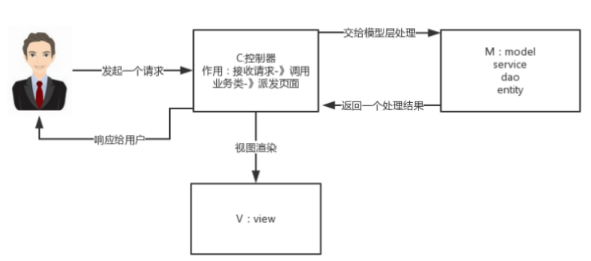
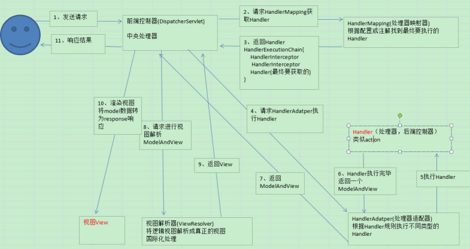
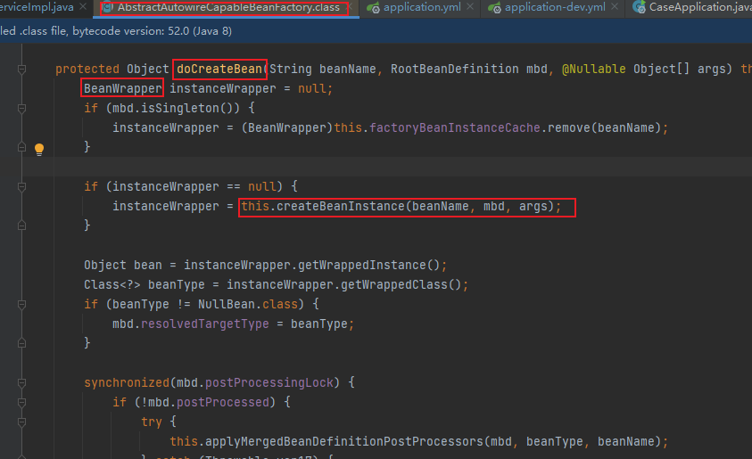
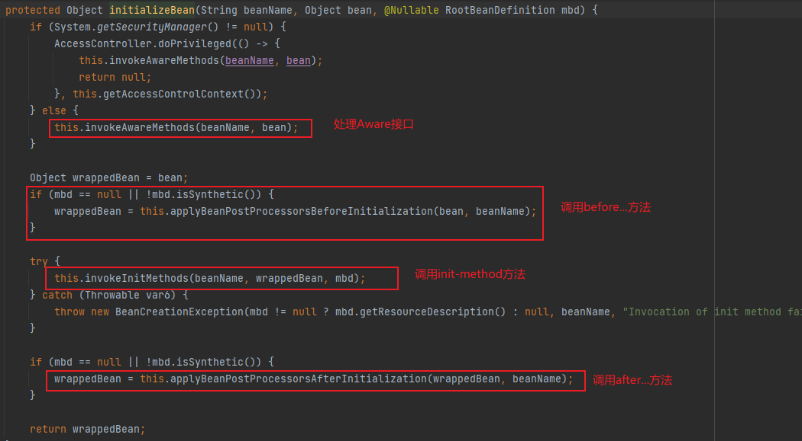
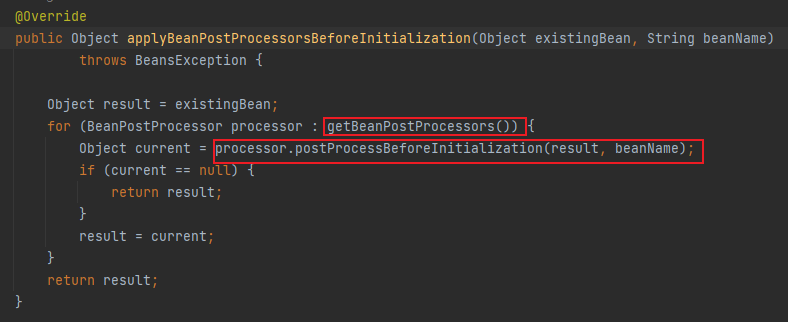
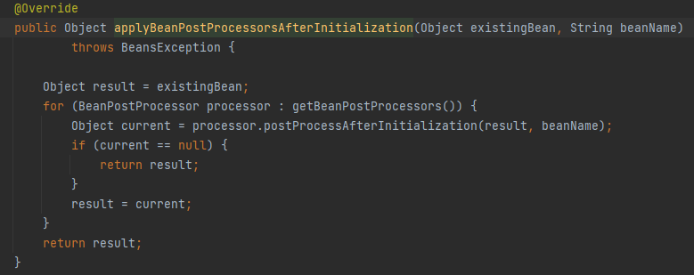

# Spring

## 一、Spring IOC

`IOC`就是控制反转，是一个`Spring`容器

使用者之前要使用`B`对象的时候都需要自己去创建和组装，而现在这些创建和组装都交给`Spring`容器去给完成了，使用者只需要去`Spring`容器中查找需要使用的对象就可以了 

这个过程中`B`对象的创建和组装，之前是由开发者控制的，现在交给了`Spring`去控制，即控制反转

作用： 主要是为了降低系统代码的耦合度，让系统利于维护和扩展  

### DI

`DI`，依赖注入

> `IOC`是一种设计理念，而`DI`是这种理念的实现

依赖注入是`spring`容器中创建对象时给其设置依赖对象的方式 

比如给`spring`一个清单，清单中列出了需要创建`B`对象以及其他的一些对象（可能包含了`B`类型中需要依赖对象），此时`spring`在创建`B`对象的时候，会看`B`对象需要依赖于哪些对象，然后去查找一下清单中有没有包含这些被依赖的对象，如果有就去将其创建好，然后将其传递给`B`对象；

可能`B`需要依赖于很多对象，`B`创建之前完全不需要知道其他对象是否存在或者其他对象在哪里以及被他们是如何创建，而`spring`容器会将`B`依赖对象主动创建好并将其注入到`B`中去

比如`spring`容器创建`B`的时候，发现`B`需要依赖于`A`，那么`spring`容器在清单中找到`A` 的定义并将其创建好之后，注入到`B`对象中。  

### Spring 容器对象

#### BeanFactory接口  

`spring`容器中具有代表性的容器就是`BeanFactory`接口，这个是`spring`容器的顶层接口，提供了容器最 基本的功能。  

```java
//按bean的id或者别名查找容器中的bean
Object getBean(String name) throws BeansException
    
//按照bean的id或者别名查找指定类型的bean，返回指定类型的bean对象
<T> T getBean(String name, Class<T> requiredType) throws BeansException;

//返回容器中指定类型的bean对象
<T> T getBean(Class<T> requiredType) throws BeansException;

//获取指定类型bean对象的获取器，这个方法比较特别，以后会专门来讲
<T> ObjectProvider<T> getBeanProvider(Class<T> requiredType);
```

#### ApplicationContext接口  

这个接口继承了`BeanFactory`接口，所以内部包含了`BeanFactory`所有的功能，并且在其上进行了扩 展，增加了很多企业级功能，比如`AOP`、国际化、事件支持等等  

#### ClassPathXmlApplicationContext类  

这个类实现了`ApplicationContext`接口，注意一下这个类名称包含了`ClassPathXml`，说明这个容器类 可以从`classpath`中加载`bean.xml`配置文件，然后创建`xml`中配置的`bean`对象  

#### AnnotationConfigApplicationContext类  

这个类也实现了`ApplicationContext`接口，注意其类名包含了`Annotation`和`config`两个单词，当我们使用注解的方式定义`bean`的时候，就需要用到这个容器来装载了，这个容器内部会解析注解来构建构建和管理需要的`bean`。  

### ApplicationContext 和 BeanFactory 的区别 

`BeanFactory` 是 `Spring` 框架的基础设施，面向 `Spring` 本身；

而 `ApplicationContext` 面向使用 `Spring` 的开发者， 相比 `BeanFactory` 提供了更多面向实际应用的功能，几乎所有场合都可以直接使用 `ApplicationContext`，而不是 底层的 `BeanFactory`。 


#### 1、延迟加载

- `BeanFactroy` 采用的是延迟加载形式来注入 `Bean` 的，即只有在使用到某个 `Bean` 时(调用 `getBean()`)，才对 该 `Bean` 进行加载实例化。

  这样，我们就不能发现一些存在的 `spring` 的配置问题  

- `ApplicationContext` 则是在容器启动时，一次性创建了所有的 `Bean`。

  这样，在容器启动时，我们就可以发现 `Spring` 中存 在的配置错误  

#### 2、国际化

- `BeanFactory` 是不支持国际化功能的，因为 `BeanFactory` 没有扩展 `Spring` 中 `MessageResource` 接口  
- 由于 `ApplicationContext` 扩展了 `MessageResource` 接口，因而具有消息处理的能力（`i18N`）  

#### 3、事件机制（Event）

`ApplicationContext` 的事件机制主要通过 `ApplicationEvent` 和 `ApplicationListener` 这两个接口来提供的  ， 当 `ApplicationContext` 中发布一个事件时，所有扩展了 `ApplicationListener` 的 `Bean` 都将接受到这个事件，并进行相应的处理 

#### 4、底层资源的访问  

- `BeanFactory` 是没有扩展 `ResourceLoader`  
- `ApplicationContext` 扩展了 `ResourceLoader`（资源加载器）接口，从而可以用来加载多个 `Resource`  

## 二、Spring AOP

`AOP`（Aspect-Oriented Programming，面向切面编程）能够将那些与业务无关，却为业务模块所共同调用的逻辑 或责任（例如事务处理、日志管理、权限控制等）封装起来，便于减少系统的重复代码，降低模块间的耦合度  

> 大白话说就是：在不改变源代码的情况下，实现对源代码功能的增强

`Spring AOP`是基于动态代理的

- 如果要代理的对象实现了某个接口，那么就会使用`JDK`动态代理去创建代理对象；
- 而对于没有实现接口的对象，就使用`CGlib`动态代理生成一个被代理对象的子类来作为代理。  

`Spring AOP`中已经集成了`AspectJ`  

- `Spring AOP` 是属于运行时增强，而`AspectJ`是编译时增强。
- `Spring AOP`基于代理（Proxying），而`AspectJ`基于字节码操作（Bytecode Manipulation）。  

### JDK动态代理、CGLIB动态代理

#### JDK动态代理

`jdk`中是使用`Proxy`类来创建代理的，而`Proxy`类只能为接口生成代理类 ，所以`jdk`动态代理只能为接口生成代理
`jdk`中为实现代理提供了支持，主要用到2个类： 

> java.lang.reflect.Proxy 
> java.lang.reflect.InvocationHandler 

**java.lang.reflect.Proxy**

这是`jdk`动态代理中主要的一个类，里面有一些静态方法会经常用到  

```java
// 为指定的接口创建代理类，返回代理类的Class对象 
// loader：定义代理类的类加载器
// interfaces：指定需要实现的接口列表，创建的代理默认会按顺序实现interfaces指定的接口
public static Class<?> getProxyClass(ClassLoader loader,
										Class<?>... interfaces)
// - - - - - - - - - - - - - - - - - - - - - - - - - - - - - - - - - - - - - - - - 

// 创建代理类的实例对象
public static Object newProxyInstance(ClassLoader loader,
					Class<?>[] interfaces,InvocationHandler h)
// 其中 InvocationHandler是个接口
public Object invoke(Object proxy, Method method, Object[] args) throws Throwable;
/** 
newProxyInstance方法会返回一个代理对象，当调用代理对象的任何方法的时候，
就会被 InvocationHandler 接口的 invoke 方法处理，
所以主要代码需要卸载 invoke 方法中
*/
// - - - - - - - - - - - - - - - - - - - - - - - - - - - - - - - - - - - - - - - - 

// 判断指定的类是否是一个代理类
public static boolean isProxyClass(Class<?> cl)
// - - - - - - - - - - - - - - - - - - - - - - - - - - - - - - - - - - - - - - - - 

// 获取代理对象的 InvocationHandler 对象
public static InvocationHandler getInvocationHandler(Object proxy)
											throws IllegalArgumentException
```

##### 创建代理

**方式一**

> 1.使用`InvocationHandler`接口创建代理类的处理器 
> 2.使用`Proxy`类的静态方法`newProxyInstance`直接创建代理对象 
> 3.使用代理对象 
> （也可以自定义一个类，实现  `InvocationHandler`  接口，重写 `invoke` 方法来作为代理类的处理器）

```java
// IService 接口
public interface IService {
	void m1();
	void m2();
	void m3();
}

@Test
public void m2() throws Exception {
	// 1. 创建代理类的处理器
	InvocationHandler invocationHandler = new InvocationHandler() {
		@Override
		public Object invoke(Object proxy, Method method, Object[] args) throws Throwable {
			System.out.println("我是InvocationHandler，被调用的方法是：" +
			method.getName());
			return null;
		}
	};
	// 2. 创建代理实例
	IService proxyService = (IService) Proxy.newProxyInstance(IService.class.getClassLoader(), 
                                                              new Class[]{IService.class}, invocationHandler);
	// 3. 调用代理的方法
	proxyService.m1();
	proxyService.m2();
	proxyService.m3();
}
```

**方式二**

> 1.调用Proxy.getProxyClass方法获取代理类的`Class`对象 
> 2.使用`InvocationHandler`接口创建代理类的处理器 
> 3.通过代理类和`InvocationHandler`创建代理对象 
> 4.上面已经创建好代理对象了，接着我们就可以使用代理对象了

```java
// 创建 IService 接口的代理对象
@Test
public void m1() throws Exception {
	// 1. 获取接口对应的代理类
	Class<IService> proxyClass = (Class<IService>)
		Proxy.getProxyClass(IService.class.getClassLoader(), 
                            IService.class);
	// 2. 创建代理类的处理器
	InvocationHandler invocationHandler = new InvocationHandler() {
		@Override
		public Object invoke(Object proxy, Method method, Object[] args) throws Throwable {
			System.out.println("我是InvocationHandler，被调用的方法是：" + method.getName());
			return null;
		}
	};
	// 3. 创建代理实例
	IService proxyService = proxyClass.getConstructor(InvocationHandler.class)
        							  .newInstance(invocationHandler);
	// 4. 调用代理的方法
	proxyService.m1();
	proxyService.m2();
	proxyService.m3();
}
```

#### CGLIB动态代理

如果我们想为普通的类也实现代理功能，我们就需要用到`cglib`来实现 

`cglib`是一个强大、高性能的字节码生成库，它用于在运行时扩展`Java`类和实现接口；

本质上它是通过动态的生成一个子类去覆盖所要代理的类（非final修饰的类和方法）。

`Enhancer`可能是`CGLIB`中最常用的 一个类，和`jdk`中的`Proxy`不同的是，`Enhancer`既能够代理普通的`class`，也能够代理接口。

`Enhancer`创 建一个被代理对象的子类并且拦截所有的方法调用（包括从`Object`中继承的`toString`和`hashCode`方 法）。

`Enhancer`不能够拦截`final`方法，例如`Object.getClass()`方法，这是由于`Java` `final`方法语义决定 的。

基于同样的道理，`Enhancer`也不能对`final`类进行代理操作  


### 关注点、横切关注点、连接点、切入点

- 关注点是应用中一个模块的行为，一个关注点可能会被定义成一个我们想实现的一个功能  
- 横切关注点也是一个关注点，此关注点是整个应用都会使用的功能，并影响整个应用，比如日志，安全和数据传输，几乎应用的每个模块都需要的功能。因此这些都属于横切关注点。  
- 连接点代表一个应用程序的某个位置，在这个位置我们可以插入一个`AOP`切面，它实际上是个应用程序执行`Spring AOP`的位置 
- 切入点是一个或一组连接点，通知将在这些位置执行  

### 通知

通知是个在方法执行前或执行后要做的动作，实际上是程序执行时要通过`SpringAOP`框架触发的代码段 

`Spring`切面可以应用五种类型的通知： 

- **before**：前置通知，在一个方法执行前被调用。 
- **after**: 在方法执行之后调用的通知，无论方法执行是否成功。 
- **after-returning**: 仅当方法成功完成后执行的通知。 
- **after-throwing**: 在方法抛出异常退出时执行的通知。 
- **around**: 在方法执行之前和之后调用的通知。  

### SpringAOP中一些概念

**目标对象(target)** 
目标对象指将要被增强的对象，即包含主业务逻辑的类对象。 

**连接点(JoinPoint)**
连接点，程序运行的某一个点，比如执行某个方法，在`Spring AOP`中`Join Point`总是表示一个方法的执行 

**代理对象(Proxy)**
`AOP`中会通过代理的方式，对目标对象生成一个代理对象，代理对象中会加入需要增强功能，通过代理 对象来间接的方式目标对象，起到增强目标对象的效果。 

**通知(Advice)**
需要在目标对象中增强的功能，如：业务方法前验证用户的功能、方法执行之后打印方法的执行日志。 
通知中有2个重要的信息：方法的什么地方，执行什么操作，这2个信息通过通知来指定。

**切入点(Pointcut )**
用来指定需要将通知使用到哪些地方，比如需要用在哪些类的哪些方法上，切入点就是做这个配置的。 

**切面（Aspect）** 
通知（Advice）和切入点（Pointcut）的组合。切面来定义在哪些地方（Pointcut）执行什么操作 （Advice）。 

**顾问（Advisor)**
`Advisor` 其实它就是 `Pointcut` 与 `Advice` 的组合，`Advice` 是要增强的逻辑，而增强的逻辑要在什么地方 执行是通过`Pointcut`来指定的，所以 `Advice` 必需与 `Pointcut` 组合在一起，这就诞生了 `Advisor` 这个 类，`spring Aop`中提供了一个`Advisor`接口将`Pointcut` 与 `Advice` 的组合起来。 `Advisor`有好几个称呼：顾问、通知器。  


## 三、SpringMVC


`M-Model` 模型（完成业务逻辑：有javaBean构成，service+dao+entity） 
`V-View` 视图（做界面的展示 jsp，html……） 
`C-Controller` 控制器（接收请求—>调用模型—>根据结果派发页面)  

### 工作原理


1、 用户发送请求至前端控制器`DispatcherServlet`。 

2、 `DispatcherServlet`收到请求调用`HandlerMapping`处理器映射器。 

3、 处理器映射器找到具体的处理器(可以根据`xml`配置、注解进行查找)，生成处理器对象及处理器拦截器(如果有 则生成)一并返回给`DispatcherServlet`。 

4、 `DispatcherServlet`调用`HandlerAdapter`处理器适配器。 

5、 `HandlerAdapter`经过适配调用具体的处理器(`Controller`，也叫后端控制器)。 

6、 `Controller`执行完成返回`ModelAndView`。 

7、 `HandlerAdapter`将`controller`执行结果`ModelAndView`返回给`DispatcherServlet`。 

8、 `DispatcherServlet`将`ModelAndView`传给`ViewReslover`视图解析器。 

9、 `ViewReslover`解析后返回具体`View`。 

10、`DispatcherServlet`根据`View`进行渲染视图（即将模型数据填充至视图中)。 

11、 `DispatcherServlet`响应用户。  

### spring mvc 组件

 `Spring MVC`的核心组件： 

1. `DispatcherServlet`：中央控制器，把请求给转发到具体的控制类 
2. `Controller`：具体处理请求的控制器 
3. `HandlerMapping`：映射处理器，负责映射中央处理器转发给controller时的映射策略 
4. `ModelAndView`：服务层返回的数据和视图层的封装类 
5. `ViewResolver`：视图解析器，解析具体的视图 
6. `Interceptors` ：拦截器，负责拦截我们定义的请求然后做处理工作

### **常用注解**

-  @RequestMapping ：用于处理请求 url 映射的注解，可用于类或方法上。用于类上，则表示类中的所有响应请求的 方法都是以该地址作为父路径。  
-  @RequestBody ：注解实现接收http请求的json数据，将json转换为java对象。  
-  @ResponseBody ：注解实现将conreoller方法返回对象转化为json对象响应给客户。  


## 四、Spring中常用的11个扩展点


### 1、自定义拦截器

`spring mvc` 拦截器和 `spring` 拦截器相比，它里面能够获取**HttpServletRequest**和**HttpServletResponse**等 `web` 对象实例。
`spring mvc` 拦截器的顶层接口是：**HandlerInterceptor**，包含三个方法：

- **preHandle** 目标方法执行前执行
- **postHandle** 目标方法执行后执行
- **afterCompletion 请求完成时执行**

一般情况会用**HandlerInterceptor**接口的实现类**HandlerInterceptorAdapter**类。
假如有权限认证、日志、统计的场景，可以使用该拦截器。

#### 第一步

继承**HandlerInterceptorAdapter**类定义拦截器：

```java
public class AuthInterceptor extends HandlerInterceptorAdapter {

    // 目标方法执行前执行
    @Override
    public boolean preHandle(HttpServletRequest request, HttpServletResponse response, Object handler)
            throws Exception {
        String requestUrl = request.getRequestURI();
        if (checkAuth(requestUrl)) {
            return true;
        }

        return false;
    }

    // 目标方法
    private boolean checkAuth(String requestUrl) {
        System.out.println("===权限校验===");
        return true;
    }
}
```

#### 第二步

将该拦截器注册到spring容器：

```java
@Configuration
public class WebAuthConfig extends WebMvcConfigurerAdapter {
 
    @Bean
    public AuthInterceptor getAuthInterceptor() {
        return new AuthInterceptor();
    }

    @Override
    public void addInterceptors(InterceptorRegistry registry) {
        registry.addInterceptor(new AuthInterceptor());
    }
}
```

### 2、获取Spring容器对象

#### BeanFactoryAware接口

实现**BeanFactoryAware**接口，然后重写**setBeanFactory**方法，就能从该方法中获取到`spring`容器对象。

```java
@Service
public class PersonService implements BeanFactoryAware {
    private BeanFactory beanFactory;

    @Override
    public void setBeanFactory(BeanFactory beanFactory) throws BeansException {
        this.beanFactory = beanFactory;
    }

    public void add() {
        Person person = (Person) beanFactory.getBean("person");
    }
}
```

#### ApplicationContextAware接口

实现**ApplicationContextAware**接口，然后重写**setApplicationContext**方法，也能从该方法中获取到 `spring` 容器对象。

```java
@Service
public class PersonService2 implements ApplicationContextAware {
    private ApplicationContext applicationContext;

    @Override
    public void setApplicationContext(ApplicationContext applicationContext) throws BeansException {
        this.applicationContext = applicationContext;
    }

    public void add() {
        Person person = (Person) applicationContext.getBean("person");
    }
}
```

#### ApplicationListener接口

```java
@Service
public class PersonService3 implements ApplicationListener<ContextRefreshedEvent> {
    private ApplicationContext applicationContext;
    @Override
    public void onApplicationEvent(ContextRefreshedEvent event) {
        applicationContext = event.getApplicationContext();
    }

    public void add() {
        Person person = (Person) applicationContext.getBean("person");
    }
}
```

### 3.全局异常处理

以前我们在开发接口时，如果出现异常，为了给用户一个更友好的提示，例如：

```java
@RequestMapping("/test")
@RestController
public class TestController {

    @GetMapping("/add")
    public String add() {
        int a = 10 / 0;
        return "成功";
    }
}
```

如果不做任何处理请求，`add`接口结果直接报错：


这种交互方式给用户的体验非常差，为了解决这个问题，我们通常会在接口中捕获异常：

```java
@GetMapping("/add")
public String add() {
    String result = "成功";
    try {
        int a = 10 / 0;
    } catch (Exception e) {
        result = "数据异常";
    }
    return result;
}
```

接口改造后，出现异常时会提示：“数据异常”，对用户来说更友好。
看起来挺不错的，但是有问题。。。
如果只是一个接口还好，但是如果项目中有成百上千个接口，都要加上异常捕获代码吗？
答案是否定的，这时全局异常处理就派上用场了：**RestControllerAdvice**。

```java
@RestControllerAdvice
public class GlobalExceptionHandler {

    @ExceptionHandler(Exception.class)
    public String handleException(Exception e) {
        if (e instanceof ArithmeticException) {
            return "数据异常";
        }
        if (e instanceof Exception) {
            return "服务器内部异常";
        }
        retur null;
    }
}
```

只需在**handleException**方法中处理异常情况，业务接口中可以放心使用，不再需要捕获异常（有人统一处理了）。真是爽歪歪。

### 4.类型转换器

`spring`目前支持3中类型转换器：

- `Converter<S,T>`：将 S 类型对象转为 T 类型对象
- `ConverterFactory<S, R>`：将 S 类型对象转为 R 类型及子类对象
- `GenericConverter`：它支持多个`source`和目标类型的转化，同时还提供了`source`和目标类型的上下文，这个上下文能让你实现基于属性上的注解或信息来进行类型转换。

这3种类型转换器使用的场景不一样，我们以**Converter<S,T>**为例。假如：接口中接收参数的实体对象中，有个字段的类型是`Date`，但是实际传参的是字符串类型：2021-01-03 10:20:15，要如何处理呢？

#### 第一步

定义一个实体User：

```java
@Data
public class User {

    private Long id;
    private String name;
    private Date registerDate;
}
```

#### 第二步

定义一个类，实现**Converter**接口：

```java
public class DateConverter implements Converter<String, Date> {

    private SimpleDateFormat simpleDateFormat = new SimpleDateFormat("yyyy-MM-dd HH:mm:ss");

    @Override
    public Date convert(String source) {
        if (source != null && !"".equals(source)) {
            try {
                simpleDateFormat.parse(source);
            } catch (ParseException e) {
                e.printStackTrace();
            }
        }
        return null;
    }
}
```

#### 第三步

将新定义的类型转换器注入到spring容器中：

```java
@Configuration
public class WebConfig extends WebMvcConfigurerAdapter {

    @Override
    public void addFormatters(FormatterRegistry registry) {
        registry.addConverter(new DateConverter());
    }
}
```

#### 第四步

调用接口

```java
@RequestMapping("/user")
@RestController
public class UserController {

    @RequestMapping("/save")
    public String save(@RequestBody User user) {
        return "success";
    }
}
```

请求接口时`User`对象中`registerDate`字段会被自动转换成`Date`类型。

### 5.导入配置

有时我们需要在某个配置类中引入另外一些类，被引入的类也加到spring容器中。

这时可以使用 **@Import** 注解完成这个功能。

如果你看过它的源码会发现，引入的类支持三种不同类型。

但是我认为最好将普通类和@Configuration注解的配置类分开讲解，所以列了四种不同类型：


#### 普通类

这种引入方式是最简单的，被引入的类会被实例化`bean`对象。

```java
public class A {
}

@Import(A.class)
@Configuration
public class TestConfiguration {
}
```

通过 **@Import** 注解引入A类，`spring`就能自动实例化A对象，然后在需要使用的地方通过 **@Autowired** 注解注入即可

```java
@Autowired
private A a;
```

是不是挺让人意外的？不用加 **@Bean** 注解也能实例化`bean`。

#### 配置类

这种引入方式是最复杂的，因为 **@Configuration** 注解还支持多种组合注解，比如：

- @Import
- @ImportResource
- @PropertySource等。

```java
public class A {
}

public class B {
}

@Import(B.class)
@Configuration
public class AConfiguration {

    @Bean
    public A a() {
        return new A();
    }
}

@Import(AConfiguration.class)
@Configuration
public class TestConfiguration {
}
```

通过`@Import`注解引入`@Configuration`注解的配置类，会把该配置类相关 **@Import** 、**@ImportResource**、**@PropertySource**等注解引入的类进行递归，一次性全部引入。

#### ImportSelector

这种引入方式需要实现**ImportSelector**接口：

```java
public class AImportSelector implements ImportSelector {

private static final String CLASS_NAME = "com.sue.cache.service.test13.A";
    
 public String[] selectImports(AnnotationMetadata importingClassMetadata) {
        return new String[]{CLASS_NAME};
    }
}

@Import(AImportSelector.class)
@Configuration
public class TestConfiguration {
}
```

这种方式的好处是**selectImports**方法返回的是数组，意味着可以同时引入多个类，还是非常方便的。

#### ImportBeanDefinitionRegistrar

这种引入方式需要实现**ImportBeanDefinitionRegistrar**接口：

```java
public class AImportBeanDefinitionRegistrar implements ImportBeanDefinitionRegistrar {
    @Override
    public void registerBeanDefinitions(AnnotationMetadata importingClassMetadata, BeanDefinitionRegistry registry) {
        RootBeanDefinition rootBeanDefinition = new RootBeanDefinition(A.class);
        registry.registerBeanDefinition("a", rootBeanDefinition);
    }
}

@Import(AImportBeanDefinitionRegistrar.class)
@Configuration
public class TestConfiguration {
}
```

这种方式是最灵活的，能在**registerBeanDefinitions**方法中获取到**BeanDefinitionRegistry**容器注册对象，可以手动控制`BeanDefinition`的创建和注册

### 6.项目启动时

有时候我们需要在项目启动时定制化一些附加功能，比如：加载一些系统参数、完成初始化、预热本地缓存等，该怎么办呢？
好消息是`springboot`提供了：

- `CommandLineRunner`
- `ApplicationRunner`

这两个接口帮助我们实现以上需求。
它们的用法还是挺简单的，以**ApplicationRunner**接口为例：

```java
@Component
public class TestRunner implements ApplicationRunner {

    @Autowired
    private LoadDataService loadDataService;

    public void run(ApplicationArguments args) throws Exception {
        loadDataService.load();
    }
}
```

实现**ApplicationRunner**接口，重写**run**方法，在该方法中实现自己定制化需求。
如果项目中有多个类实现了ApplicationRunner接口，他们的执行顺序使用 **@Order(n)** 注解来指定，n的值越小越先执行。当然也可以通过 **@Priority** 注解指定顺序。

### 7.修改BeanDefinition

`Spring IOC`在实例化`Bean`对象之前，需要先读取`Bean`的相关属性，保存到**BeanDefinition**对象中，然后通过`BeanDefinition`对象，实例化`Bean`对象。
如果想修改`BeanDefinition`对象中的属性，我们可以实现**BeanFactoryPostProcessor**接口。

```java
@Component
public class MyBeanFactoryPostProcessor implements BeanFactoryPostProcessor {
    
    @Override
    public void postProcessBeanFactory(ConfigurableListableBeanFactory configurableListableBeanFactory) throws BeansException {
        DefaultListableBeanFactory defaultListableBeanFactory = (DefaultListableBeanFactory) configurableListableBeanFactory;
        BeanDefinitionBuilder beanDefinitionBuilder = BeanDefinitionBuilder.genericBeanDefinition(User.class);
        beanDefinitionBuilder.addPropertyValue("id", 123);
        beanDefinitionBuilder.addPropertyValue("name", "阿伟说技术");
        defaultListableBeanFactory.registerBeanDefinition("user", beanDefinitionBuilder.getBeanDefinition());
    }
}
```

在 `postProcessBeanFactory` 方法中，可以获取 `BeanDefinition` 的相关对象，并且修改该对象的属性。

### 8.初始化Bean前后

有时，你想在初始化Bean前后，实现一些自己的逻辑。
这时可以实现：**BeanPostProcessor**接口。
该接口目前有两个方法：

- `postProcessBeforeInitialization` 该在初始化方法之前调用。
- `postProcessAfterInitialization` 该方法在初始化方法之后调用。

例如：

```java
@Component
public class MyBeanPostProcessor implements BeanPostProcessor {

    @Override
    public Object postProcessAfterInitialization(Object bean, String beanName) throws BeansException {
        if (bean instanceof User) {
            ((User) bean).setUserName("阿伟说技术");
        }
        return bean;
    }
}
```

其实，我们经常使用的注解，比如：`@Autowired`、`@Value`、`@Resource`、`@PostConstruct`等，是通过`AutowiredAnnotationBeanPostProcessor`和`CommonAnnotationBeanPostProcessor`实现的。

### 9.初始化方法

目前`spring`中使用比较多的初始化`bean`的方法有：

1. 使用`@PostConstruct`注解
2. 实现`InitializingBean`接口

#### 使用@PostConstruct注解

```java
@Service
public class AService {
    @PostConstruct
    public void init() {
        System.out.println("===初始化===");
    }
}
```

在需要初始化的方法上增加 **@PostConstruct** 注解，这样就有初始化的能力。

#### 实现InitializingBean接口

```java
@Service
public class BService implements InitializingBean {

    @Override
    public void afterPropertiesSet() throws Exception {
        System.out.println("===初始化===");
    }
}
```

实现**InitializingBean**接口，重写**afterPropertiesSet**方法，该方法中可以完成初始化功能。

### 10.关闭容器前

有时候，我们需要在关闭`spring`容器前，做一些额外的工作，比如：关闭资源文件等。
这时可以实现**DisposableBean**接口，并且重写它的**destroy**方法：

```java
@Service
public class DService implements InitializingBean, DisposableBean {
 
    @Override
    public void destroy() throws Exception {
        System.out.println("DisposableBean destroy");
    }
 
    @Override
    public void afterPropertiesSet() throws Exception {
        System.out.println("InitializingBean afterPropertiesSet");
    }
}
```

这样`spring`容器销毁前，会调用该`destroy`方法，做一些额外的工作。
通常情况下，我们会同时实现`InitializingBean`和`DisposableBean`接口，重写初始化方法和销毁方法。

### 11.自定义作用域

我们都知道 `spring` 默认支持的**Scope**只有两种：

- `singleton` 单例，每次从 `spring` 容器中获取到的 `bean` 都是同一个对象。
- `prototype` 多例，每次从 `spring` 容器中获取到的 `bean` 都是不同的对象。

`spring web`又对 `Scope` 进行了扩展，增加了：

- `RequestScope` 同一次请求从 `spring` 容器中获取到的 `bean` 都是同一个对象。
- `SessionScope` 同一个会话从 `spring` 容器中获取到的 `bean` 都是同一个对象。

即便如此，有些场景还是无法满足我们的要求。
比如，我们想在同一个线程中从`spring`容器获取到的`bean`都是同一个对象，该怎么办？
这就需要自定义 `Scope` 了。

#### 第一步

实现 `Scope` 接口：

```java
public class ThreadLocalScope implements Scope {
    private static final ThreadLocal THREAD_LOCAL_SCOPE = new ThreadLocal();

    @Override
    public Object get(String name, ObjectFactory<?> objectFactory) {
        Object value = THREAD_LOCAL_SCOPE.get();
        if (value != null) {
            return value;
        }

        Object object = objectFactory.getObject();
        THREAD_LOCAL_SCOPE.set(object);
        return object;
    }

    @Override
    public Object remove(String name) {
        THREAD_LOCAL_SCOPE.remove();
        return null;
    }

    @Override
    public void registerDestructionCallback(String name, Runnable callback) {
    }

    @Override
    public Object resolveContextualObject(String key) {
        return null;
    }

    @Override
    public String getConversationId() {
        return null;
    }
}
```

#### 第二步

将新定义的 `Scope` 注入到 `spring` 容器中：

```java
@Component
public class ThreadLocalBeanFactoryPostProcessor implements BeanFactoryPostProcessor {
    @Override
    public void postProcessBeanFactory(ConfigurableListableBeanFactory beanFactory) throws BeansException {
        beanFactory.registerScope("threadLocalScope", new ThreadLocalScope());
    }
}
```

#### 第三步

使用新定义的`Scope`：

```java
@Scope("threadLocalScope")
@Service
public class CService {
    public void add() {
    }
}
```

## 五、Spring获取Bean的几种方式

一共七种方式：

1、使用 **`BeanFactory`** 直接获取（不推荐）

2、在初始化时保存 **`ApplicationContext`** 对象

3、继承自抽象类 **`ApplicationObjectSupport`**

4、继承自抽象类 **`WebApplicationObjectSupport`**

5、使用`Spring`提供的工具类 **`WebApplicationContextUtils`**

6、实现 **`ApplicationContextAware`** 接口

7、使用 **`ContextLoader`** 提供的 **`getCurrentWebApplicationContext`()** 方法


### 1、BeanFactory（不推荐）

使用 **`BeanFactory`** 从工厂中直接获取`Bean`实例，但是 **`XmlBeanFactory`** 类已经废弃，因此不建议使用

```java
/**
 * 方式一：XmlBeanFactory已经废弃不建议使用
 */
@Test
public void getBeanTest1() {
    BeanFactory beanFactory = new XmlBeanFactory(new ClassPathResource("applicationContext.xml"));
    UserInfo userInfo = (UserInfo) beanFactory.getBean("userInfo");
    System.out.println(userInfo);
}
```

### 2、ApplicationContext

可以在初始化的时候保存 **`ApplicationContext`** 对象，然后通过这个对象获取`Bean`

```java
/**
 * 方式二：使用ClassPathXmlApplicationContext获取ApplicationContext
 */
@Test
public void getBeanTest2() {
    ApplicationContext applicationContext = new ClassPathXmlApplicationContext("applicationContext.xml");
    UserInfo userInfo = (UserInfo) applicationContext.getBean("userInfo");
    System.out.println(userInfo);
}
```

### 3、ApplicationObjectSupport

可以继承抽象类 **`ApplicationObjectSupport`** 并将自己继承的类注入到`Spring`容器中

```java
/**
 * 方法三：继承ApplicationObjectSupport来获取ApplicationContext，
 * 注意：需要把自己继承的类注入到Spring
 */
@Test
public void getBeanTest3() {
    ApplicationContextUtil2 applicationContextUtil2 = (ApplicationContextUtil2) ApplicationContextUtil.getBean("applicationContextUtil2");
    UserInfo userInfo = (UserInfo) applicationContextUtil2.getBean("userInfo");
    System.out.println(userInfo);
}
```

其中**ApplicationContextUtil2**的代码如下

```java
@Component
public class ApplicationContextUtil2 extends ApplicationObjectSupport {

    /**
     * 通过bean的id获取bean对象
     * @param beanName
     * @return
     */
    public Object getBean(String beanName){
        return super.getApplicationContext().getBean(beanName);
    }

}
```

### 4、WebApplicationObjectSupport

可以继承抽象类 **`WebApplicationObjectSupport`** 并将自己继承的类注入到`Spring`容器中

```java
/**
 * 方法四：继承WebApplicationObjectSupport来获取ApplicationContext，
 * 注意：需要把自己继承的类注入到Spring，同时需要添加@WebAppConfiguration注解，否则会找不到web容器
 */
@Test
public void getBeanTest4() {
    ApplicationContextUtil3 applicationContextUtil3 = (ApplicationContextUtil3) ApplicationContextUtil.getBean("applicationContextUtil3");
    UserInfo userInfo = (UserInfo) applicationContextUtil3.getBean("userInfo");
    System.out.println(userInfo);
}
```

其中 **ApplicationContextUtil3** 的示例代码如下：

```java
@Component
public class ApplicationContextUtil3 extends WebApplicationObjectSupport{

    /**
     * 通过bean的id获取bean对象
     * @param beanName
     * @return
     */
    public Object getBean(String beanName){
        return super.getWebApplicationContext().getBean(beanName);
    }

}
```

### 5、WebApplicationContextUtils

使用`Spring`提供的工具类 **`WebApplicationContextUtils`** 来获取 **`WebApplicationContext`** 对象，这个方法很常见于`SpringMVC`构建的`web`项目中

```java
/**
 * 方法五：使用WebApplicationContextUtils提供的方法获取ApplicationContext对象
 */
@Test
public void getBeanTest5(){
    //模拟ServletContext上下文，不然会出现空指针异常
    MockServletContext sc = new MockServletContext("");
    sc.addInitParameter(ContextLoader.CONFIG_LOCATION_PARAM, "/applicationContext.xml");
    ServletContextListener listener = new ContextLoaderListener();
    ServletContextEvent event = new ServletContextEvent(sc);
    listener.contextInitialized(event);

    //使用WebApplicationContextUtils的getRequiredWebApplicationContext方法
    WebApplicationContext webApplicationContext = WebApplicationContextUtils.getRequiredWebApplicationContext(sc);
    UserInfo userInfo = (UserInfo) webApplicationContext.getBean("userInfo");
    System.out.println(userInfo);
    //使用WebApplicationContextUtils的getWebApplicationContext方法
    WebApplicationContext webApplicationContext2 = WebApplicationContextUtils.getWebApplicationContext(sc);
    UserInfo userInfo2 = (UserInfo) webApplicationContext2.getBean("userInfo");
    System.out.println(userInfo2);
}
```

### 6、ApplicationContextAware

通过实现 **`ApplicationContextAware`** 接口，在`Spring`容器启动的时候将**`ApplicationContext`**注入进去，从而获取**`ApplicationContext`**对象，这种方法也是常见的获取`Bean`的一种方式

```java
/**
 *方法六：实现ApplicationContextAware接口获取ApplicationContext
 */
@Test
public void getBeanTest6(){
    UserInfo userInfo2 = (UserInfo) ApplicationContextUtil.getBean("userInfo");
    System.out.println(userInfo2);
}
```

其中**ApplicationContextUtil**的实现如下：

```java
public class ApplicationContextUtil implements ApplicationContextAware{
    private static ApplicationContext applicationContext;

    /**
     * 通过bean的id获取bean对象
     * @param beanName
     * @return
     */
    public static Object getBean(String beanName){
        return applicationContext.getBean(beanName);
    }

    /**
     * 根据bean的id和类型获取bean对象
     * @param beanName
     * @param clazz
     * @param <T>
     * @return
     */
    public static <T> T getBean(String beanName,Class<T> clazz){
        return clazz.cast(getBean(beanName));
    }


    @Override
    public void setApplicationContext(ApplicationContext applicationContext) throws BeansException {
        this.applicationContext = applicationContext;
    }
}
```

### 7、ContextLoader

使用 **`ContextLoader`** 提供的 **`getCurrentWebApplicationContext`** 方法提供的方法也是常用的获取 **`WebApplicationContext`** 的一种方法，这个方法常见于SpringMVC实现的web项目中

```java
/**
 * 方法七：使用ContextLoader的getCurrentWebApplicationContext方法获取WebApplicationContext
 */
@Test
public void getBeanTest7() {
    MockServletContext sc = new MockServletContext("");
    sc.addInitParameter(ContextLoader.CONFIG_LOCATION_PARAM, "/applicationContext.xml");
    ServletContextListener listener = new ContextLoaderListener();
    ServletContextEvent event = new ServletContextEvent(sc);
    listener.contextInitialized(event);
    //如果不加上面的模拟创建ServletContext对象，会报空指针异常
    WebApplicationContext wac = ContextLoader.getCurrentWebApplicationContext();
    UserInfo userInfo = (UserInfo) wac.getBean("userInfo");
    System.out.println(userInfo);
}
```

## 六、Bean 生命周期

当我们向容器请求一个尚未初始化的`bean`时，或初始化`bean`的时候需要注入另一个尚未初始化的依赖时，就会开始`Bean`的生命周期
**实例化 -->   依赖注入  --> 初始化  --> 销毁**

### 实例化Bean

1. 首先会调用 **AbstractAutowireCapableBeanFactory** 类的 **doCreateBean** 方法创建`bean`
   1. 第一步 调用 **createBeanInstance** 方法利用反射创建`bean`实例
   2. 将创建好的`bean`放入 **BeanWrapper** 中
   3. 实例化后的对象会利用 **ObjectFactory** 暴露



### 依赖注入

1. 调用 **populateBean** 方法对使用到了注入属性的注解就会进行注入
2. 如果在注入的过程发现注入的对象还没生成，则会跑去生产要注入的对象


### 初始化bean



1. 调用 **initializeBean** 方法初始化`bean`

   ①首先调用的是 **invokeAwareMethods** 方法，该方法处理 `Aware` 接口

   - 如果这个`Bean`已经实现了 **BeanNameAware** 接口，会调用它实现的 **setBeanName(String beanId)** 方法，此处传 递的就是`Spring`配置文件中`Bean`的`id`值
   - 如果这个`Bean`已经实现了 **BeanFactoryAware** 接口，会调用它实现的 **setBeanFactory()** 方法，传递的是`Spring`工 厂自身。
   - 如果这个`Bean`已经实现了 **BeanClassLoaderAware **接口，会调用 s**etBeanClassLoader()** 方法，传入类加载器


​	②然后调用 **applyBeanPostProcessorsBeforeInitialization** 方法，处理 **BeanPostProcessor** 接口

- 如果有类实现了 **BeanPostProcessor** 接口，就会执行 **postProcessBeforeInitialization** 方法
- 如果多个类实现**BeanPostProcessor**接口，那么多个实现类都会执行**postProcessBeforeInitialization**方法，可以看到是`for`循环依次执行的，
- 还有一个注意的点就是如果加载`A`类到`spring`容器中，`A`类也重写了 **BeanPostProcessor** 接口的 **postProcessBeforeInitialization** 方法，这时要注意`A`类的**postProcessBeforeInitialization** 方法并不会得到执行，因为`A`类还未加载完成，还未完全放到`spring`的 **singletonObjects** 一级缓存中。



③然后执行 **invokeInitMethods** 方法

- 如果实现了 **InitializingBean** 接口，重写了 **afterPropertiesSet** 方法，则会调用**afterPropertiesSet** 方法
- 最后如果指定了 **init-method**，可以通过标签，或者`@Bean`注解的`initMethod`指定，则会调用指定的 **init-method** 方法


④最后会执行 **applyBeanPostProcessorsAfterInitialization** 方法

1. 跟之前的 **postProcessBeforeInitialization** 方法类似，也是循环遍历实现了**BeanPostProcessor** 的接口实现类，执行 **postProcessAfterInitialization** 方法


**至此 Bean初始化完成，可以正常使用**

（1）实例化Bean：  

- 对于`BeanFactory`容器，当客户向容器请求一个尚未初始化的`bean`时，或初始化`bean`的时候需要注入另一个尚未初始化的依赖时，容器就会调用`createBean`进行实例化  
- 对于`ApplicationContext`容器，当容器启动结束后，通过 获取`BeanDefinition`对象中的信息，实例化所有的`bean`。  

（2）依赖注入 
实例化后的对象被封装在`BeanWrapper`对象中，紧接着，`Spring`根据`BeanDefinition`中的信息 以及 通过 `BeanWrapper`提供的设置属性的接口完成依赖注入 
（3）初始化
（4）销毁
`DisposableBean`  接口
当`Bean`不再需要时，会经过清理阶段，如果`Bean`实现了`DisposableBean`这个接口，会调用其实现的`destroy()`方 法 
如果这个`Bean`配置了`destroy-method`属性，会自动调用其配置的销毁方法 


## 七、循环依赖

### 什么是循环依赖

循环依赖，即多个`bean`之间相互依赖，形成了一个闭环
比如：A依赖B、B依赖C、C依赖A

### 检测是否存在循环依赖

会使用一个列表来记录正在创建中的`bean`，`bean`创建之前，会先去记录中看一下自己是否已经在列表中了，如果在，说明存在循环依赖，如果不在，则将其加入到这个列表，`bean`创建完毕之后，将其再从这个列表中移除 

**spring创建单例bean时候，会调用下面方法**

```java
protected void beforeSingletonCreation(String beanName) {
	if (!this.inCreationCheckExclusions.contains(beanName) &&
			!this.singletonsCurrentlyInCreation.add(beanName)) {
		throw new BeanCurrentlyInCreationException(beanName);
	}
}
/**
singletonsCurrentlyInCreation 就是用来记录目前正在创建中的bean名称列表
this.singletonsCurrentlyInCreation.add(beanName) 返回 false ，
说明beanName已经在当前列表中了，
此时会抛循环依赖的异常 BeanCurrentlyInCreationException
*/
```

**非单例bean的情况， 以prototype情况为例**

```java
//检查正在创建的bean列表中是否存在beanName，如果存在，说明存在循环依赖，抛出循环依赖的异常
if (isPrototypeCurrentlyInCreation(beanName)) {
	throw new BeanCurrentlyInCreationException(beanName);
}
//判断scope是否是prototype
if (mbd.isPrototype()) {
	Object prototypeInstance = null;
    try {
		//将beanName放入正在创建的列表中
		beforePrototypeCreation(beanName);
		prototypeInstance = createBean(beanName, mbd, args);
	}
	finally {
		//将beanName从正在创建的列表中移除
		afterPrototypeCreation(beanName);
	}
}

```

### 解决循环依赖

`Spring`是在属性注入阶段，采用三级缓存的方式解决循环依赖的
属性注入有两种情况：

- 通过构造器注入（无法解决）
- 通过setter注入

由于单例`bean`在`spring`容器中只存在一个，所以`spring`容器中肯定是有一个缓存来存放所有已创建好的单例`bean`；

获取单例`bean`之前，可以先去缓存中找，找到了直接返回，找不到的情况下再去创建，创 建完毕之后再将其丢到缓存中，可以使用一个`map`来存储单例`bean` 
**三级缓存对应代码**

```java
/** 第一级缓存：单例bean的缓存 */
private final Map<String, Object> singletonObjects = new ConcurrentHashMap<>
(256);

/** 第二级缓存：早期暴露的bean的缓存 */
private final Map<String, Object> earlySingletonObjects = new HashMap<>(16);

/** 第三级缓存：单例bean工厂的缓存 */
private final Map<String, ObjectFactory<?>> singletonFactories = new HashMap<>
(16);
```

开始的时候，获取A，调用如下代码

@1代码块

```java
protected <T> T doGetBean(final String name, @Nullable final Class<T>
				requiredType, @Nullable final Object[] args, 
    			boolean typeChekOnly) throws BeansException {
	//1.查看缓存中是否已经有这个bean了
	Object sharedInstance = getSingleton(beanName); 
	if (sharedInstance != null && args == null) {
	bean = getObjectForBeanInstance(sharedInstance, name, beanName, null);
	} else {
	//若缓存中不存在，准备创建这个bean
		if (mbd.isSingleton()) {// @1
			//2.下面进入单例bean的创建过程
			sharedInstance = getSingleton(beanName, () -> {
				try {
					return createBean(beanName, mbd, args); // @2
				}
				catch (BeansException ex) {
					throw ex;
				}
			});
			bean = getObjectForBeanInstance(sharedInstance, 
                                            name, beanName,mbd);
		}
	}
	return (T) bean;
}
```

然后进入下面方法，会依次尝试从3级缓存中查找`bean`，注意下面的第2个参数，为`ture`的时候，才会从第3级中查找，否则只会查找1、2级缓存  

@2代码块

```java
//allowEarlyReference:是否允许从三级缓存singletonFactories中通过getObject拿到bean
protected Object getSingleton(String beanName, boolean allowEarlyReference) {
	//1.先从一级缓存中找
	Object singletonObject = this.singletonObjects.get(beanName);
	if (singletonObject == null && isSingletonCurrentlyInCreation(beanName)) {
		synchronized (this.singletonObjects) {
			//2.从二级缓存中找
			singletonObject = this.earlySingletonObjects.get(beanName);
			if (singletonObject == null && allowEarlyReference) {
				//3.二级缓存中没找到 && allowEarlyReference为true的情况下,从三级缓存找
				ObjectFactory<?> singletonFactory = this.singletonFactories.get(beanName);
				if (singletonFactory != null) {
					//三级缓存返回的是一个工厂，通过工厂来获取创建bean
					singletonObject = singletonFactory.getObject();
					//将创建好的bean丢到二级缓存中
					this.earlySingletonObjects.put(beanName, singletonObject);
					//从三级缓存移除
					this.singletonFactories.remove(beanName);
				}
			}
		}
	}
	return singletonObject;
}

```

刚开始，3个缓存中肯定是找不到的，会返回null，接着会执行上面@1代码准备创建 A  

最终执行  `getSingleton(String beanName, ObjectFactory singletonFactory)`  方法

@3代码块

```java
public Object getSingleton(String beanName, ObjectFactory<?> singletonFactory) {
	synchronized (this.singletonObjects) {
		Object singletonObject = this.singletonObjects.get(beanName);
		if (singletonObject == null) {
    		//单例bean创建之前调用，将其加入正在创建的列表中，主要用来检测循环依赖用的
			beforeSingletonCreation(beanName);
			boolean newSingleton = false;
			try {
				//调用工厂创建bean
				singletonObject = singletonFactory.getObject();//@1中的@2传入
				newSingleton = true;
			}
			finally {
				//单例bean创建之后调用,主要是将其从正在创建的列表中移除
				afterSingletonCreation(beanName);
			}
			if (newSingleton) {
				//将创建好的单例bean放入缓存中
				addSingleton(beanName, singletonObject);
			}
		}
		return singletonObject;
	}
}
```

@1中的@2 `createBean`方法，会调用如下方法

createBean代码块

```java
BeanWrapper instanceWrapper = null;
if (instanceWrapper == null) {
	//通过反射调用构造器实例化serviceA
	instanceWrapper = createBeanInstance(beanName, mbd, args);
}
//变量bean：表示刚刚同构造器创建好的bean示例
final Object bean = instanceWrapper.getWrappedInstance();
//判断是否需要暴露早期的bean，条件为（是否是单例bean && 当前容器允许循环依赖 && bean名称存在
//于正在创建的bean名称清单中）
boolean earlySingletonExposure = (mbd.isSingleton() && this.allowCircularReferences 
                                  && isSingletonCurrentlyInCreation(beanName));
if (earlySingletonExposure) {
	//若earlySingletonExposure为true，通过addSingletonFactory将早期的bean暴露到三级缓存去
	addSingletonFactory(beanName, 
                        () -> getEarlyBeanReference(beanName, mbd,bean));
}
```

刚刚实例化好的`bean`就是早期的`bean`，此时`bean`还未进行属性填充，初始化等操作  

```java
protected void addSingletonFactory(String beanName, ObjectFactory<?>
										singletonFactory) {
	Assert.notNull(singletonFactory, "Singleton factory must not be null");
	synchronized (this.singletonObjects) {
		//第1级缓存中不存在bean
		if (!this.singletonObjects.containsKey(beanName)) {
		//将其丢到第3级缓存中
		this.singletonFactories.put(beanName, singletonFactory);
		//后面的2行代码不用关注
		this.earlySingletonObjects.remove(beanName);
		this.registeredSingletons.add(beanName);
		}
	}
}

```

上面的方法执行之后，A就被丢到第3级的缓存中了。 

后续的过程A开始注入依赖的对象，发现需要注入B，会从容器中获取B，而 B的获取又会走上面同样的过程实例化B，然后将B提前暴露出去，然后B 开始注入依赖的对象，B发现自己需要注入A，此时去容器中找A，找A会 先去缓存中找，会执行 getSingleton("serviceA",true) ，此时会走@2部分的代码： 

方法走完之后，A会被放入二级缓存 earlySingletonObjects 中，会将A返回， 此时B中的A注入成功，B继续完成创建，然后将自己返回给A，此时 A通过set方法将B注入。 A创建完毕之后，会调用 addSingleton 方法将其加入到缓存中，这块代码如下：  

```java
protected void addSingleton(String beanName, Object singletonObject) {
	synchronized (this.singletonObjects) {
		//将bean放入第1级缓存中
		this.singletonObjects.put(beanName, singletonObject);
		//将其从第3级缓存中移除
		this.singletonFactories.remove(beanName);
		//将其从第2级缓存中移除
		this.earlySingletonObjects.remove(beanName);
	}
}
```

到此，serviceA和serviceB之间的循环依赖注入就完成了 
捋一捋整个过程：

> 1.从容器中获取serviceA 
>
> 2.容器尝试从3个缓存中找serviceA，找不到 
>
> 3.准备创建serviceA 
>
> 4.调用serviceA的构造器创建serviceA，得到serviceA实例，此时serviceA还未填充属性，未进行其他任何初始化的操作 
>
> 5.将早期的serviceA暴露出去：即将其丢到第3级缓存singletonFactories中 
>
> 6.serviceA准备填充属性，发现需要注入serviceB，然后向容器获取serviceB 
>
> 7.容器尝试从3个缓存中找serviceB，找不到 
>
> 8.准备创建serviceB 
>
> 9.调用serviceB的构造器创建serviceB，得到serviceB实例，此时serviceB还未填充属性，未进行其 他任何初始化的操作 
>
> 10.将早期的serviceB暴露出去：即将其丢到第3级缓存singletonFactories中 
>
> 11.serviceB准备填充属性，发现需要注入serviceA，然后向容器获取serviceA 
>
> 12.容器尝试从3个缓存中找serviceA，发现此时serviceA位于第3级缓存中，经过处理之后，serviceA 会从第3级缓存中移除，然后会存到第2级缓存中，然后将其返回给serviceB，此时serviceA通过 serviceB中的setServiceA方法被注入到serviceB中 
>
> 13.serviceB继续执行后续的一些操作，最后完成创建工作，然后会调用addSingleton方法，将自己丢到 第1级缓存中，并将自己从第2和第3级缓存中移除 
>
> 14.serviceB将自己返回给serviceA 
>
> 15.serviceA通过setServiceB方法将serviceB注入进去 
>
> 16.serviceA继续执行后续的一些操作，最后完成创建工作,然后会调用addSingleton方法，将自己丢到第 1级缓存中，并将自己从第2和第3级缓存中移除  

### 循环依赖无法解决的情况  

**多例的情况下，无法解决循环依赖**
只有单例的`bean`会通过三级缓存提前暴露来解决循环依赖的问题，而非单例的`bean`，每次从容器中获 取都是一个新的对象，都会重新创建，所以非单例的bean是没有缓存的，不会将其放到三级缓存中。 
**情况一：**
serviceA：多例 	serviceB：多例  	
结果： 此时不管是任何方式都是无法解决循环依赖的问题，最终都会报错，因为每次去获取依赖的`bean`都会重新创建 

**情况二：**
 serviceA：单例 	serviceB：多例 
结果：

- 若使用构造器的方式相互注入，是无法完成注入操作的，会报错  
- 若采用`set`方式注入，所有`bean`都还未创建的情况下，先去容器中获取`serviceB`，会报错，为什么？我 们来看一下过程  

> 1.从容器中获取serviceB 
>
> 2.serviceB由于是多例的，所以缓存中肯定是没有的 
>
> 3.检查serviceB是在正在创建的bean名称列表中，没有 
>
> 4.准备创建serviceB 
>
> 5.将serviceB放入正在创建的bean名称列表中 
>
> 6.实例化serviceB（由于serviceB是多例的，所以不会提前暴露，必须是单例的才会暴露） 
>
> 7.准备填充serviceB属性，发现需要注入serviceA 
>
> 8.从容器中查找serviceA 
>
> 9.尝试从3级缓存中找serviceA，找不到 
>
> 10.准备创建serviceA 
>
> 11.将serviceA放入正在创建的bean名称列表中 
>
> 12.实例化serviceA 
>
> 13.由于serviceA是单例的，将早期serviceA暴露出去，丢到第3级缓存中 
>
> 14.准备填充serviceA的属性，发现需要注入serviceB 
>
> 15.从容器中获取serviceB 
>
> 16.先从缓存中找serviceB，找不到 
>
> 17.检查serviceB是在正在创建的bean名称列表中,发现已经存在了，抛出循环依赖的异常  

### 为什么需要用3级缓存，二级缓存不行吗？

不行
原因：早期暴露给其他依赖者的`bean`和最终暴露的`bean`不一致的问题 

若将刚刚实例化好的`bean`直接丢到二级缓存中暴露出去，如果后期这个`bean`对象被更改了，比如可能 在上面加了一些拦截器，将其包装为一个代理了，那么暴露出去的`bean`和最终的这个`bean`就不一样的

将自己暴露出去的时候是一个原始对象，而自己最终却是一个代理对象，最终会导致被暴露出去的和最终的`bean`不是同一个`bean`的，将产生意向不到的效果，而三级缓存就可以发现这个问题，会报错  

### 单例bean解决了循环依赖，还存在什么问题？

循环依赖的情况下，由于注入的是早期的`bean`，此时早期的`bean`中还未被填充属性，初始化等各种操 作，也就是说此时`bean`并没有被完全初始化完毕，此时若直接拿去使用，可能存在有问题的风险。  


## 八、其它

### @Autowired 和 @Resource 的区别？  

**@Autowired**
 `@Autowired`为`Spring`提供的注解，是按照类型（byType）装配依赖对象，默认情况下它要求依赖对象必须存在，如果允许null值， 可以设置它的`required`属性为`false`。如果我们想使用按照名称（byName）来装配，可以结合`@Qualifier`注解一起使用  

```java
public class TestServiceImpl {
	// 下面两种@Autowired只要使用一种即可
	@Autowired
	private UserDao userDao; // 用于字段上
	@Autowired
	public void setUserDao(UserDao userDao) { // 用于属性的方法上
		this.userDao = userDao;
	}
}

public class TestServiceImpl {
	@Autowired
	@Qualifier("userDao")
	private UserDao userDao;
}

```

**@Resource**
`@Resource` 是`Java`的注解，默认按照`ByName`自动注入，`@Resource`有两个重要的属性：`name`和`type`，而`Spring`将`@Resource`注解的`name`属性解析为`bean`的名字，而`type`属性则解析为`bean`的类型  

```java
public class TestServiceImpl {
	// 下面两种@Resource只要使用一种即可
	//name="userDao"这里就是只定了name
	@Resource(name="userDao")
	private UserDao userDao; // 用于字段上
    
	@Resource(name="userDao")
	public void setUserDao(UserDao userDao) { // 用于属性的setter方法上
		this.userDao = userDao;
	}
}
```

**注：最好是将 @Resource 放在setter方法上，因为这样更符合面向对象的思想，通过set、get去操作属性，而不是 直接去操作属性。** 
@Resource 装配顺序： 

- 如果同时指定了`name`和`type`，则从`Spring`上下文中找到唯一匹配的`bean`进行装配，找不到则抛出异常。 
- 如果指定了`name`，则从上下文中查找名称（id）匹配的`bean`进行装配，找不到则抛出异常。  
- 如果指定了`type`，则从上下文中找到类似匹配的唯一`bean`进行装配，找不到或是找到多个，都会抛出异常。 
- 如果既没有指定`name`，又没有指定`type`，则自动按照`byName`方式进行装配；如果没有匹配，则回退为一个 原始类型进行匹配，如果匹配则自动装配。  

### Spring中Bean的几种作用域

（1）singleton：默认，每个容器中只有一个bean的实例，单例的模式由BeanFactory自身来维护。 

（2）prototype：为每一个bean请求提供一个实例。 

（3）request：为每一个网络请求创建一个实例，在请求完成以后，bean会失效并被垃圾回收器回收。 

（4）session：与request范围类似，确保每个session中有一个bean的实例，在session过期后，bean会随之失 效。 

（5）global-session：全局作用域，global-session和Portlet应用相关。当你的应用部署在Portlet容器中工作时， 它包含很多portlet。

如果你想要声明让所有的portlet共用全局的存储变量的话，那么这全局变量需要存储在 global-session中。

全局作用域与Servlet中的session作用域效果相同。  

### Spring事务的传播级别

事务的传播行为是指，多个声明了事务的方法，在互相调用时，事务应该如何传递
`Spring`事务定义了7种传播机制： 

1. `PROPAGATION_REQUIRED`:默认的Spring事物传播级别，若当前存在事务，则加入该事务，若不存在事务， 则新建一个事务。 
2. `PAOPAGATION_REQUIRE_NEW`:若当前没有事务，则新建一个事务。若当前存在事务，则新建一个事务，新老事务相互独立。外部事务抛出异常回滚不会影响内部事务的正常提交。 
3. `PROPAGATION_NESTED`:如果当前存在事务，则嵌套在当前事务中执行。如果当前没有事务，则新建一个事 务，类似于`REQUIRE_NEW`。 
4. `PROPAGATION_SUPPORTS`:支持当前事务，若当前不存在事务，以非事务的方式执行。 
5. `PROPAGATION_NOT_SUPPORTED`:以非事务的方式执行，若当前存在事务，则把当前事务挂起。 
6. `PROPAGATION_MANDATORY`:强制事务执行，若当前不存在事务，则抛出异常. 
7. `PROPAGATION_NEVER`:以非事务的方式执行，如果当前存在事务，则抛出异常。  

### 事务注解的本质是什么？  

声明式事务主要是得益于`Spring AOP`。使用一个事务拦截器，在方法调用的前后/周围进行事务性增强 （advice），来驱动事务完成 

`@Transactional` 注解具有两方面功能，一是表明该方法要参与事务，二是配置相关属性来定制事务的参与方式和运行行为 

`@Transactional` 注解既可以标注在类上，也可以标注在方法上。

当在类上时，默认应用到类里的所有方法。

如果 此时方法上也标注了，则方法上的优先级高。 

> 另外注意方法一定要是`public`的  

### BeanFactory和FactoryBean

`BeanFactory` 是 `IOC`容器，是用来装载对象的

`FactoryBean` 是一个接口类型的`Bean`，当我们容器中的`Bean`实现该接口时，通过`getBean(beanName)`获取`Bean`时，获取到的并不是接口的实现类对象，而是接口中`getObject`方法所返回的对象。

只有通过`getBean(&beanName)`获取到的才是接口的实现类对象。

> 是`Spring`对`Bean`的一种扩展

### @Repository、@Service、@Compent、@Controller它们有什么区别

这四个注解的本质都是一样的，都是将被该注解标识的对象放入 spring 容器当中，只是为了在使用上区分不同的应用分层

- @Repository:	dao层
- @Service:	service层
- @Controller:	controller层
- @Compent:	其他不属于以上三层的统一使用该注解


