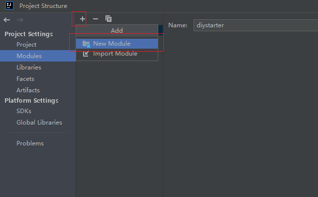
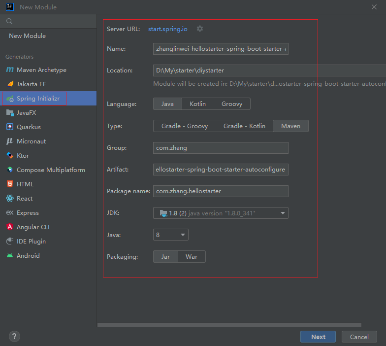
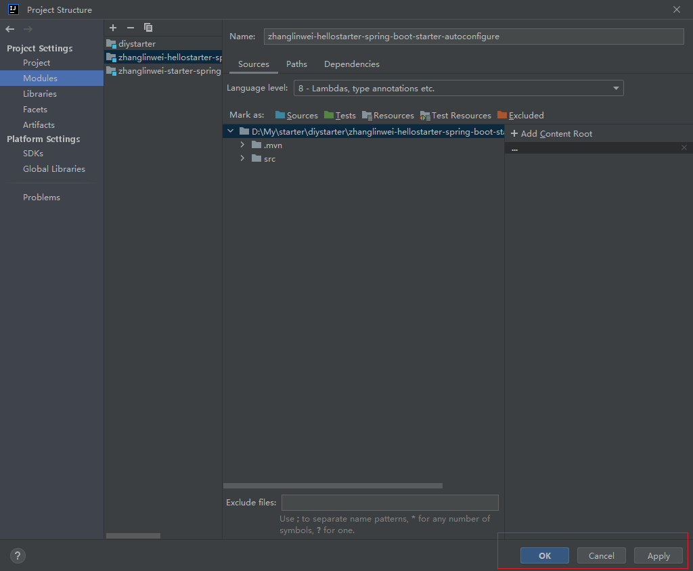
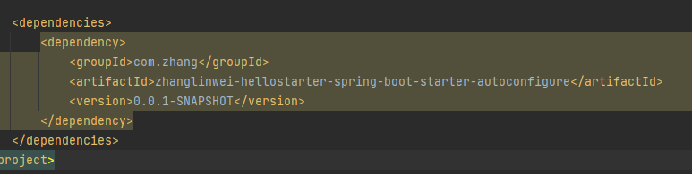
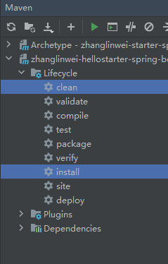
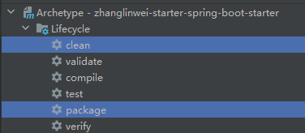
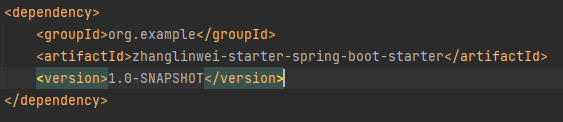
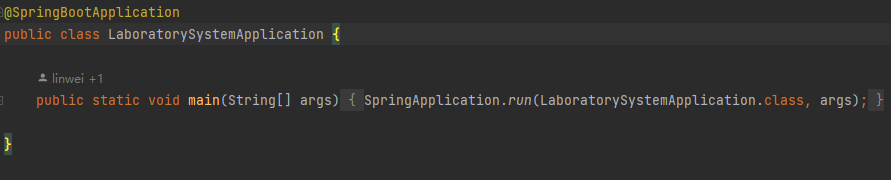
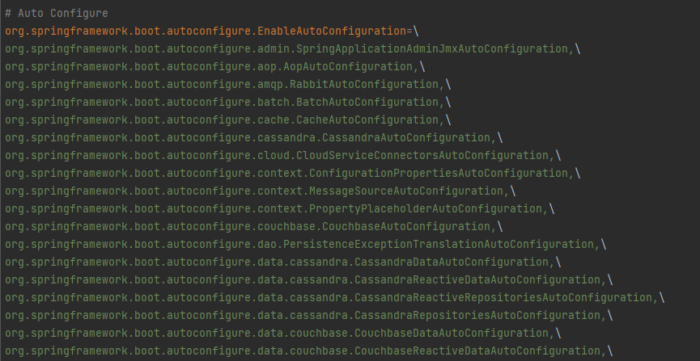

# SpringBoot

## 一、SpringBoot返回JSON数据

`Spring Boot` 中 默认使用的 `Json` 解析技术框架是 `jackson`。

并已经集成在了 `spring-boot-starter-web` 依赖中

### 默认 jackson

**User实体类**

~~~java
public class User {
	private Long id;
	private String username;
	private String password;
	/* 省略get、set和带参构造方法 */
}
~~~

**Controller类**

~~~java
@RestController
@RequestMapping("/json")
public class JsonController {
    @RequestMapping("/user")
    public User getUser() {
        return new User(1, "zhanglinwei", "123456");
    }

    @RequestMapping("/list")
    public List<User> getUserList() {
        List<User> userList = new ArrayList<>();
        User user1 = new User(1, "zhanglinwei", "123456");
        User user2 = new User(2, "linweizhang", "123456");
        userList.add(user1);
        userList.add(user2);
        return userList;
    }

    @RequestMapping("/map")
    public Map<String, Object> getMap() {
        Map<String, Object> map = new HashMap<>(3);
        User user = new User(1, "zhanglinwei", "123456");
        map.put("作者信息", user);
        map.put("博客地址", "http://zhanglinwei");
        map.put("CSDN地址", "http://zhanglinwei");
        map.put("粉丝数量", 1000000);
        return map;
    }
}
~~~

**返回结果**

**User**

~~~json
{
	"id": 1,
	"username": "zhanglinwei",
	"password": "123456"
}
~~~

**List**

~~~json
[
    {
		"id": 1,
		"username": "zhanglinwei",
		"password": "123456"
	}, 
    {
		"id": 2,
		"username": "linweizhang",
		"password": "123456"
	}
]
~~~

**Map**

~~~json
{
	"作者信息": {
					"id": 1,
					"username": "zhanglinwei",
					"password": "123456"
			   },
	"CSDN地址": "http://zhanglinwei",
	"粉丝数量": 10000000,
	"博客地址": "http://zhanglinwei"
}
~~~

#### **Null值处理**

**添加配置**

~~~java
@Configuration
public class JacksonConfig {
    @Bean
    @Primary
    @ConditionalOnMissingBean(ObjectMapper.class)
    public ObjectMapper jacksonObjectMapper(Jackson2ObjectMapperBuilder builder) {
        ObjectMapper objectMapper = builder.createXmlMapper(false).build();
        objectMapper.getSerializerProvider().setNullValueSerializer(new JsonSerializer<Object>() {
            @Override
            public void serialize(Object o, JsonGenerator jsonGenerator, SerializerProvider
                    serializerProvider) throws IOException {
                jsonGenerator.writeString("");
            }
        });
        return objectMapper;
    }
}
~~~

**修改 map 接口**

```java
@RequestMapping("/map")
public Map<String, Object> getMap(){
        Map<String, Object> map=new HashMap<>(3);
        User user=new User(1,"zhanglinwei",null);
        map.put("作者信息",user);
        map.put("博客地址","http://zhanglinwei");
        map.put("CSDN地址",null);
        map.put("粉丝数量",10000000);
        return map;
}
```

**结果**

~~~json
{
	"作者信息": {
				"id": 1,
				"username": "zhanglinwei",
				"password": ""
			   },
	"CSDN地址": "",
	"粉丝数量": 4153,
	"博客地址": "http://zhanglinwei"
}
~~~

### FastJson（Alibaba）

**依赖**

~~~xml
<dependency>
	<groupId>com.alibaba</groupId>
	<artifactId>fastjson</artifactId>
	<version>1.2.35</version>
</dependency>
~~~

**Null值处理**

~~~java
@Configuration
public class fastJsonConfig extends WebMvcConfigurationSupport {
    /**
     * 使用阿里 FastJson 作为JSON MessageConverter
     *
     * @param converters
     */
    @Override
    public void configureMessageConverters(List<HttpMessageConverter<?>> converters) {
        FastJsonHttpMessageConverter converter = new FastJsonHttpMessageConverter();
        FastJsonConfig config = new FastJsonConfig();
        config.setSerializerFeatures(
				// 保留map空的字段
                SerializerFeature.WriteMapNullValue,
				// 将String类型的null转成""
                SerializerFeature.WriteNullStringAsEmpty,
				// 将Number类型的null转成0
                SerializerFeature.WriteNullNumberAsZero,
				// 将List类型的null转成[]
                SerializerFeature.WriteNullListAsEmpty,
				// 将Boolean类型的null转成false
                SerializerFeature.WriteNullBooleanAsFalse,
				// 避免循环引用
                SerializerFeature.DisableCircularReferenceDetect);
        converter.setFastJsonConfig(config);
        converter.setDefaultCharset(Charset.forName("UTF-8"));
        List<MediaType> mediaTypeList = new ArrayList<>();
		// 解决中文乱码问题，相当于在Controller上的@RequestMapping中加了个属性produces ="application/json"
        mediaTypeList.add(MediaType.APPLICATION_JSON);
        converter.setSupportedMediaTypes(mediaTypeList);
        converters.add(converter);
    }
}
~~~


###  jackson 和 FastJson 的对比

| 选项                  | fastJson | jackson |
| --------------------- | -------- | ------- |
| 上手难易程度          | 容易     | 中等    |
| 高级特性支持          | 中等     | 丰富    |
| 官方文档、Example支持 | 中文     | 英文    |
| 处理json速度          | 略快     | 快      |


### 封装统一返回的数据结构

#### 代码

~~~java
public class JsonResult<T> {
    private T data;
    private String code;
    private String msg;

    /**
     * 若没有数据返回，默认状态码为0，提示信息为：操作成功！
     */
    public JsonResult() {
        this.code = "0";
        this.msg = "操作成功！";
    }

    /**
     * 若没有数据返回，可以人为指定状态码和提示信息
     *
     * @param code
     * @param msg
     */
    public JsonResult(String code, String msg) {
        this.code = code;
        this.msg = msg;
    }

    /**
     * 有数据返回时，状态码为0，默认提示信息为：操作成功！
     *
     * @param data
     */
    public JsonResult(T data) {
        this.data = data;
        this.code = "0";
        this.msg = "操作成功！";
    }

    /**
     * 有数据返回，状态码为0，人为指定提示信息
     *
     * @param data
     * @param msg
     */
    public JsonResult(T data, String msg) {
        this.data = data;
        this.code = "0";
        this.msg = msg;
    }
	// 省略get和set方法
}
~~~

#### 结果

**User**

~~~json
{
	"code": "0",
	"data": {
		"id": 1,
		"password": "123456",
		"username": "zhanglinwei"
	},
	"msg": "操作成功！"
}
~~~


**List**

~~~json
{
	"code": "0",
	"data": [
        		{
					"id": 1,
					"password": "123456",
					"username": "zhanglinwei"
				},
				{
					"id": 2,
					"password": "123456",
					"username": "linweizhang"
				}
	],
	"msg": "获取用户列表成功"
}
~~~


**Map**

~~~json
{
	"code": "0",
	"data": {
				"作者信息": {
					"id": 1,
					"password": "",
					"username": "zhanglinwei"
				},
				"CSDN地址": null,
				"粉丝数量": 10000000,
				"博客地址": "http://zhanglinwei"
	},
	"msg": "操作成功！"
}
~~~

## 二、slf4j 日志

SpringBoot内部已经继承了 `slf4j` ，配置即用

### 配置

~~~yaml
logging:
	pattern:
		console: "%d{yyyy/MM/dd-HH:mm:ss} [%thread] %-5level %logger- %msg%n" # 控制台的输出格式 
		file: "%d{yyyy/MM/dd-HH:mm} [%thread] %-5level %logger- %msg%n" # 日志文件的输出格式  
	file: # 日志输出到文件中
		path: ./logs # 指定输出的文件为当前项目路径的 logs 文件下，默认生成的日志文件为 spring.log 
	config: logback-spring.xml # 指定项目启动的时候，读取哪个配置文件
	level: # 指定具体的 mapper 中日志的输出级别
		com.zhang.linwei.dao: trace #该包下的所有mapper日志，trace 会打印sql
		# ERROR、WARN、INFO、DEBUG
~~~

编码含义：

- %d{HH:mm:ss.SSS}——日志输出时间 
- %thread——输出日志的进程名字，这在Web应用以及异步任务处理中很有用 
- %-5level——日志级别，并且使用5个字符靠左对齐 
- %logger- ——日志输出者的名字 
- %msg——日志消息 
- %n——平台的换行符  

### 使用

#### 标注注解

在需要使用的类上标注注解

~~~java
@Slf4j
class DemoApplicationTests {
 	@Test
 	public void test(){
  		log.debug("输出DEBUG日志.......");
 	}
}

~~~

或

~~~java
@Slf4j
class DemoApplicationTests {
    private final static Logger logger = LoggerFactory.getLogger(TestController.class);

 	@Test
 	public void test(){
  		logger.debug("=====测试日志debug级别打印====");
		logger.info("======测试日志info级别打印=====");
		logger.error("=====测试日志error级别打印====");
		logger.warn("======测试日志warn级别打印=====");
		// 可以使用占位符打印出一些参数信息
		String str1 = "zhanglinwei";
		String str2 = "真帅";
		logger.info("======人物描述：{}；特点：{}", str1, str2);
 	}
}
~~~

### 自定义日志配置

`Spring Boot`官方推荐优先使用带有`-spring`的文件名作为你的日志配置。

因此只需要在 `src/resources` 文件夹下创建 `logback-spring.xml` 即可

配置文件内容如下：  

~~~xml
<?xml version="1.0" encoding="UTF-8"?>
<configuration scan="true" scanPeriod="60 seconds" debug="false">
	<!-- 定义日志存放目录 -->
	<property name="logPath" value="logs"/>
	<!-- 日志输出的格式-->
	<property name="PATTERN" value="%d{yyyy-MM-dd HH:mm:ss.SSS} [%t-%L] %-5level %logger{36} %L %M -
%msg%xEx%n"/>
	<contextName>logback</contextName>
  
	<!--输出到控制台 ConsoleAppender-->
	<appender name="consoleLog" class="ch.qos.logback.core.ConsoleAppender">
		<!--展示格式 layout-->
		<layout class="ch.qos.logback.classic.PatternLayout">
			<pattern>${PATTERN}</pattern>
		</layout>
<!--过滤器，只有过滤到指定级别的日志信息才会输出，如果level为ERROR，那么控制台只会输出
ERROR日志-->
<!-- <filter class="ch.qos.logback.classic.filter.ThresholdFilter">-->
<!-- <level>ERROR</level>-->
<!-- </filter>-->
	</appender>
  
	<!--正常的日志文件，输出到文件中-->
  <appender name="fileDEBUGLog" class="ch.qos.logback.core.rolling.RollingFileAppender">
		<!--如果只是想要 Info 级别的日志，只是过滤 info 还是会输出 Error 日志，因为 Error 的级别高，
			所以我们使用下面的策略，可以避免输出 Error 的日志-->
		<filter class="ch.qos.logback.classic.filter.LevelFilter">
			<!--过滤 Error-->
			<level>Error</level>
			<!--匹配到就禁止-->
			<onMatch>DENY</onMatch>
			<!--没有匹配到就允许-->
			<onMismatch>ACCEPT</onMismatch>
		</filter>
		<!--日志名称，如果没有File 属性，那么只会使用FileNamePattern的文件路径规则
			如果同时有<File>和<FileNamePattern>，那么当天日志是<File>，明天会自动把今天
			的日志改名为今天的日期。即，<File> 的日志都是当天的。-->
		<File>${logPath}/log_demo.log</File>
		<!--滚动策略，按照时间滚动 TimeBasedRollingPolicy-->
		<rollingPolicy class="ch.qos.logback.core.rolling.TimeBasedRollingPolicy">
			<!--文件路径,定义了日志的切分方式——把每一天的日志归档到一个文件中,以防止日志填满整个
				磁盘空间-->
			<FileNamePattern>${logPath}/log_demo_%d{yyyy-MM-dd}.log</FileNamePattern>
			<!--只保留最近90天的日志-->
			<maxHistory>90</maxHistory>
			<!--用来指定日志文件的上限大小，那么到了这个值，就会删除旧的日志-->
			<!--<totalSizeCap>1GB</totalSizeCap>-->
		</rollingPolicy>
		<!--日志输出编码格式化-->
		<encoder>
			<charset>UTF-8</charset>
			<pattern>${PATTERN}</pattern>
		</encoder>
	</appender>
  
	<!--输出ERROR日志到指定的文件中-->
	<appender name="fileErrorLog" class="ch.qos.logback.core.rolling.RollingFileAppender">
		<!--如果只是想要 Error 级别的日志，那么需要过滤一下，默认是 info 级别的，ThresholdFilter-->
		<filter class="ch.qos.logback.classic.filter.ThresholdFilter">
			<level>Error</level>
		</filter>
		<!--日志名称，如果没有File 属性，那么只会使用FileNamePattern的文件路径规则
			如果同时有<File>和<FileNamePattern>，那么当天日志是<File>，明天会自动把今天
			的日志改名为今天的日期。即，<File> 的日志都是当天的。-->
		<File>${logPath}/error.log</File>
		<!--滚动策略，按照时间滚动 TimeBasedRollingPolicy-->
		<rollingPolicy class="ch.qos.logback.core.rolling.TimeBasedRollingPolicy">
			<!--文件路径,定义了日志的切分方式——把每一天的日志归档到一个文件中,以防止日志填满整个
				磁盘空间-->
			<FileNamePattern>${logPath}/error_%d{yyyy-MM-dd}.log</FileNamePattern>
			<!--只保留最近90天的日志-->
			<maxHistory>90</maxHistory>
			<!--用来指定日志文件的上限大小，那么到了这个值，就会删除旧的日志-->
			<!--<totalSizeCap>1GB</totalSizeCap>-->
		</rollingPolicy>
		<!--日志输出编码格式化-->
		<encoder>
			<charset>UTF-8</charset>
			<pattern>${PATTERN}</pattern>
		</encoder>
	</appender>
  
	<!--指定最基础的日志输出级别-->
	<root level="DEBUG">
		<!--appender将会添加到这个loger-->
		<appender-ref ref="consoleLog"/>
		<appender-ref ref="fileDEBUGLog"/>
		<appender-ref ref="fileErrorLog"/>
	</root>
  
	<!-- 定义指定package的日志级别-->
	<logger name="org.springframework" level="DEBUG"></logger>
	<logger name="org.mybatis" level="DEBUG"></logger>
	<logger name="java.sql.Connection" level="DEBUG"></logger>
	<logger name="java.sql.Statement" level="DEBUG"></logger>
	<logger name="java.sql.PreparedStatement" level="DEBUG"></logger>
	<logger name="io.lettuce.*" level="INFO"></logger>
	<logger name="io.netty.*" level="ERROR"></logger>
	<logger name="com.rabbitmq.*" level="DEBUG"></logger>
	<logger name="org.springframework.amqp.*" level="DEBUG"></logger>
	<logger name="org.springframework.scheduling.*" level="DEBUG"></logger>
	<!--定义com.xxx..xx..xx包下的日志信息不上传，直接输出到fileDEBUGLog和fileErrorLog这个两个appender
		中，日志级别为DEBUG-->
	<logger name="com.xxx.xxx.xx" additivity="false" level="DEBUG">
		<appender-ref ref="fileDEBUGLog"/>
		<appender-ref ref="fileErrorLog"/>
	</logger>
</configuration>
~~~

配置解释

>  **configuration节点**  这是一个根节点，其中的各个属性如下： 
>
>  **1. scan** ：当此属性设置为true时，配置文件如果发生改变，将会被重新加载，默认值为true。 
>
>  **2. scanPeriod** ：设置监测配置文件是否有修改的时间间隔，如果没有给出时间单位，默认单位是毫 秒。当scan为true时，此属性生效。默认的时间间隔为1分钟。 
>
>  **3. debug** ：当此属性设置为true时，将打印出logback内部日志信息，实时查看logback运行状态。 默认值为false。  
>
>  **root节点**  
>
>  这是一个必须节点，用来指定基础的日志级别，只有一个 level 属性，默认值是 DEBUG 。 该节点可以包含零个或者多个元素，子节点是 appender-ref ，标记这个 appender 将会添加到这个logger 中。  	
>
>  **contextName节点** 
>
>  标识一个上下文名称，默认为default，一般用不到  
>
>  **property节点** 
>
>  标记一个上下文变量，属性有name和value，定义变量之后可以使用 ${} 来获取。  
>
>  **appender节点**
>
>  用来格式化日志输出节点，有两个属性 name 和 class ，class用来指定哪种输出策略，常用就是**控制台输出策略**和**文件输出策略**。
>  	这个节点很重要，通常的日志文件需要定义三个appender，分别是控制台输出，常规日志文件输出，异
>  常日志文件输出。
>  该节点有几个重要的子节点，如下：
>
>  1. **filter** ：日志输出拦截器，没有特殊定制一般使用系统自带的即可，但是如果要将日志分开，比
>     如将ERROR级别的日志输出到一个文件中，将除了 ERROR 级别的日志输出到另外一个文件中，此
>       时就要拦截 ERROR 级别的日志了。
>  2. **encoder** ： 和pattern节点组合用于具体输出的日志格式和编码方式。
>  3. **file** : 节点用来指明日志文件的输出位置，可以是绝对路径也可以是相对路径
>  4. **rollingPolicy** : 日志回滚策略，在这里我们用了TimeBasedRollingPolicy，基于时间的回滚策略,
>     有以下子节点fileNamePattern，必要节点，可以用来设置指定时间的日志归档。
>  5. **maxHistory** : 可选节点，控制保留的归档文件的最大数量，超出数量就删除旧文件,，例如设置为
>     30的话，则30天之后，旧的日志就会被删除
>  6. **totalSizeCap** : 可选节点，用来指定日志文件的上限大小，例如设置为3GB的话，那么到了这个
>     值，就会删除旧的日志
>
>  **logger节点**
>  	可选节点，用来具体指明包的日志输出级别，它将会覆盖root的输出级别。
>  该节点有几个重要的属性如下：
>
>  1. **name** ：指定的包名
>  2. **level** ：可选，日志的级别
>  3. **addtivity** ：可选，默认为true，将此logger的信息向上级传递，将有root节点定义日志打印。
>     如果设置为false，将不会上传，此时需要定义一个 appender-ref 节点才会输出。

## 三、读取配置文件

### @Value

`@Value` 注解上通过 ${key} 即可获取配置文件中和 `key` 对应的 `value` 值。

~~~yaml
server:
	port: 8001
application:
	name: zhanglinwei
# 配置多个微服务的地址
url:
	# 订单微服务的地址
	orderUrl: http://localhost:8002
	# 用户微服务的地址
	userUrl: http://localhost:8003
	# 购物车微服务的地址
	shoppingUrl: http://localhost:8004
lesson: SpringBoot
~~~

~~~java
@RestController
@RequestMapping("/test")
public class ConfigController {
    private static final Logger LOGGER = LoggerFactory.getLogger(ConfigController.class);
    @Value("${application.name}")
    private String name;

    @RequestMapping("/config")
    public String testConfig() {
        LOGGER.info("=====项目名称：{}", name);
        return "success";
    }
}
~~~

### @ConfigurationProperties

使用 `@ConfigurationProperties` 注解并且使用 `prefix` 来指定一个前缀，然后该类中 的属性名就是配置中去掉前缀后的名字，一一对应即可，使用时直接注入即可

**自定义实体类**

~~~java
@Component
// 指定前缀
@ConfigurationProperties(prefix = "url")
public class MicroServiceUrl {
	private String orderUrl;
	private String userUrl;
	private String shoppingUrl;
	// 省去get和set方法
}

~~~

**使用**

~~~java
@RestController
@RequestMapping("/test")
public class TestController {
    private static final Logger LOGGER = LoggerFactory.getLogger(TestController.class);
    @Resource
    private MicroServiceUrl microServiceUrl;

    @RequestMapping("/config")
    public String testConfig() {
        LOGGER.info("=====获取的订单服务地址为：{}", microServiceUrl.getOrderUrl());
        LOGGER.info("=====获取的用户服务地址为：{}", microServiceUrl.getUserUrl());
        LOGGER.info("=====获取的购物车服务地址为：{}", microServiceUrl.getShoppingUrl());
        return "success";
    }
}
~~~

### Environment

`SpringBoot`提供的一个对象，能够把所有的数据都封装到这一个对象中，使用自动装配注解可以将所有的`yaml`数据封装到这个对象中

获取属性时，通过`Environment`的接口操作进行，具体方法是`getProperties（String）`，参数填写属性名即可

~~~java
@RestController
@RequestMapping("/test")
public class TestController {
    private static final Logger LOGGER = LoggerFactory.getLogger(TestController.class);
    @Autowired
    private Environment env;

    @RequestMapping("/config")
    public String testConfig() {
        LOGGER.info("=====application.name：{}", env.getProperties("env.application.name"));
        LOGGER.info("=====lesson：{}", env.getProperties("env.lesson"));
        return "success";
    }
}
~~~

### 指定项目配置文件

新建两个配置文件： `application-dev.yml` 和 `application-pro.yml` ，分别用来对开发环境和生产环境进行 相关配置

~~~yaml
# 开发环境配置文件
server:
	port: 8001
~~~

~~~yaml
# 生产环境配置文件
server:
	port: 8002
~~~

然后在 `application.yml` 文件中指定读取哪个配置文件即可

~~~yaml
spring:
	profiles:
		active:
		- dev
~~~


## 四、全局异常处理

### 全局异常处理器

#### 新建全局异常处理类

新建一个 `GlobalExceptionHandler` 全局异常处理类，然后加上 `@ControllerAdvice` 注解即可拦截项目中抛出的异常

> `@ControllerAdvice` 注解包含了 `@Component` 注解，说明在 `Spring Boot` 启动时，也会把该类作为组件交给 `Spring` 来管理，除此之外，该注解还有个 `basePackages` 属性， 该属性是用来拦截哪个包中的异常信息

~~~java
@ControllerAdvice
@ResponseBody // 用于返回JSON数据
public class GlobalExceptionHandler {
    // 打印log
    private static final Logger logger = LoggerFactory.getLogger(GlobalExceptionHandler.class);
	// ……
}
~~~

#### 通过 `@ExceptionHandler` 注解来指定具体的异常

~~~java
@ExceptionHandler(MissingServletRequestParameterException.class)
@ResponseStatus(value = HttpStatus.BAD_REQUEST)
public JsonResult handleHttpMessageNotReadableException(
        MissingServletRequestParameterException ex){
        logger.error("缺少请求参数，{}",ex.getMessage());
        return new JsonResult("400","缺少必要的请求参数");
}
~~~

#### 全部代码

~~~java
@ControllerAdvice
@ResponseBody // 用于返回JSON数据
public class GlobalExceptionHandler {
    // 打印log
    private static final Logger logger = LoggerFactory.getLogger(GlobalExceptionHandler.class);
	
    @ExceptionHandler(MissingServletRequestParameterException.class)
	@ResponseStatus(value = HttpStatus.BAD_REQUEST)
	public JsonResult handleHttpMessageNotReadableException(
        MissingServletRequestParameterException ex){
        logger.error("缺少请求参数，{}",ex.getMessage());
        // JsonResult 为自定义返回结果类
        return new JsonResult("400","缺少必要的请求参数");
	}
}
~~~

### 自定义异常

#### 定义类，实现`RuntimeException`

~~~java
/**
 * 自定义运行时异常
 *
 */
public class BusinessErrorException extends RuntimeException {
    private static final long serialVersionUID = -7480022450501760611L;
    /**
     * 异常码
     */
    private String code;
    /**
     * 异常提示信息
     */
    private String message;

    public BusinessErrorException() {
        this.code = businessMsgEnum.code();
        this.message = businessMsgEnum.msg();
    }
	// get set方法
}

~~~

#### 定义异常信息枚举类

~~~java
public enum BusinessMsgEnum {
    /**
     * 参数异常
     */
    PARMETER_EXCEPTION("102", "参数异常!"),
    /**
     * 等待超时
     */
    SERVICE_TIME_OUT("103", "服务调用超时！"),
    /**
     * 参数过大
     */
    PARMETER_BIG_EXCEPTION("102", "输入的图片数量不能超过50张!"),
    /**
     * 500 : 一劳永逸的提示也可以在这定义
     */
    UNEXPECTED_EXCEPTION("500", "系统发生异常，请联系管理员！");
	// 还可以定义更多的业务异常
    /**
     * 消息码
     */
    private String code;
    /**
     * 消息内容
     */
    private String msg;

    private BusinessMsgEnum(String code, String msg) {
        this.code = code;
        this.msg = msg;
    }
	// set get方法
}
~~~

#### 在全局异常处理器拦截自定义异常

在全局异常处理器中定义方法拦截自定义异常，参考前面说的全局异常处理，这里就不展示了

#### 模拟抛出

~~~java
@RestController
@RequestMapping("/exception")
public class ExceptionController {
    private static final Logger logger = LoggerFactory.getLogger(ExceptionController.class);

    @GetMapping("/business")
    public JsonResult testException() {
        try {
            int i = 1 / 0;
        } catch (Exception e) {
            throw new BusinessErrorException(BusinessMsgEnum.UNEXPECTED_EXCEPTION);
        }
        return new JsonResult();
    }
}
~~~

## 五、AOP处理

### 依赖

~~~xml
<dependency>
	<groupId>org.springframework.boot</groupId>
	<artifactId>spring-boot-starter-aop</artifactId>
</dependency>
~~~

### 实现AOP切面

新建一个类，用来定义切面和处理方法。

在类上加个 `@Aspect` 注解即可，并交给`Spring`管理。

> @Aspect 注解用来描述 一个切面类，定义切面类的时候需要打上这个注解。

~~~java
@Aspect
@Component
public class LogAspectHandler {
    
}
~~~

几个常用的注解及使用

1.`@Pointcut`：定义一个切面，即上面所描述的关注的某件事入口。

2.`@Before`：在做某件事之前做的事。

3.`@After`：在做某件事之后做的事。

4.`@AfterReturning`：在做某件事之后，对其返回值做增强处理。

5.`@AfterThrowing`：在做某件事抛出异常时，处理。

### @Pointcut 注解

~~~java
@Aspect
@Component
public class LogAspectHandler {
    /**
     * 定义一个切面，拦截com.itcodai.course09.controller包和子包下的所有方法
     */
    @Pointcut("execution(* com.zhang.linwei.controller..*.*(..))")
    public void pointCut() {
    }
}
~~~

两个常用的表达式：

- 一个是使用 execution() 

  > - execution() 为表达式主体 
  > - 第一个 `*` 号的位置：表示返回值类型， `*` 表示所有类型 
  > - 包名：表示需要拦截的包名，后面的两个`. .`表示当前包和当前包的所有子包， `com.zhang.linwei.controller` 包、子包下所有类的方法 
  > - 第二个 `*` 号的位置：表示类名， `*` 表示所有类 
  > - `*(..)` ：这个星号表示方法名， `*` 表示所有的方法，后面括弧里面表示方法的参数，两个句点表示任何参数

- 另一个是使用 `annotation()` 

  - `annotation()` 方式是针对某个注解来定义切面，比如我们对具有 `@GetMapping` 注解的方法做切面，可以如下定义切面

  - ~~~java
    @Pointcut("@annotation(org.springframework.web.bind.annotation.GetMapping)")
    public void annotationCut() {}
    ~~~

  - 然后使用该切面的话，就会切入注解是 `@GetMapping` 的方法。

### @Before 注解

`@Before` 注解指定的方法在切面切入目标方法之前执行

~~~java
@Aspect
@Component
public class LogAspectHandler {
    private final Logger logger = LoggerFactory.getLogger(this.getClass());

    /**
     * 在上面定义的切面方法之前执行该方法
     *
     * @param joinPoint jointPoint
     */
    @Before("pointCut()")
    public void doBefore(JoinPoint joinPoint) {
        logger.info("====doBefore方法进入了====");
		// 获取签名
        Signature signature = joinPoint.getSignature();
		// 获取切入的包名
        String declaringTypeName = signature.getDeclaringTypeName();
		// 获取即将执行的方法名
        String funcName = signature.getName();
        logger.info("即将执行方法为: {}，属于{}包", funcName, declaringTypeName);
		// 也可以用来记录一些信息，比如获取请求的url和ip
        ServletRequestAttributes attributes = (ServletRequestAttributes)
                RequestContextHolder.getRequestAttributes();
        HttpServletRequest request = attributes.getRequest();
		// 获取请求url
        String url = request.getRequestURL().toString();
		// 获取请求ip
        String ip = request.getRemoteAddr();
        logger.info("用户请求的url为：{}，ip地址为：{}", url, ip);
    }
}
~~~

> `JointPoint` 对象很有用，可以用它来获取一个签名，然后利用签名可以获取请求的包名、方法名，包括参数（通过 `joinPoint.getArgs()` 获取）

### @After 注解

`@After` 注解和 `@Before` 注解相对应，指定的方法在切面切入目标方法之后执行

~~~java
@Aspect
@Component
public class LogAspectHandler {
    private final Logger logger = LoggerFactory.getLogger(this.getClass());

    /**
     * 定义一个切面，拦截com.zhang.linwei.controller包下的所有方法
     */
    @Pointcut("execution(* com.zhang.linwei.controller..*.*(..))")
    public void pointCut() {
    }

    /**
     * 在上面定义的切面方法之后执行该方法
     *
     * @param joinPoint jointPoint
     */
    @After("pointCut()")
    public void doAfter(JoinPoint joinPoint) {
        logger.info("====doAfter方法进入了====");
        Signature signature = joinPoint.getSignature();
        String method = signature.getName();
        logger.info("方法{}已经执行完", method);
    }
}
~~~

### 测试

~~~java
@RestController
@RequestMapping("/aop")
public class AopController {
    @GetMapping("/{name}")
    public String testAop(@PathVariable String name) {
        return "Hello " + name;
    }
}
~~~

输出

~~~
====doBefore方法进入了====
即将执行方法为: testAop，属于com.zhang.linwei.controller.AopController包
用户请求的url为：http://localhost:8080/aop/name，ip地址为：0:0:0:0:0:0:0:1
====doAfter方法进入了====
方法testAop已经执行完

~~~

### @AfterReturning 注解

`@AfterReturning` 注解和 `@After` 有些类似，区别在于 `@AfterReturning` 注解可以用来捕获切入方法执行完之后的返回值，对返回值进行业务逻辑上的增强处理

该方法中的第二个入参就是被切方法的返回值，在 `doAfterReturning` 方法中可以对返回值进行增强

~~~java
@Aspect
@Component
public class LogAspectHandler {
    private final Logger logger = LoggerFactory.getLogger(this.getClass());

    /**
     * 在上面定义的切面方法返回后执行该方法，可以捕获返回对象或者对返回对象进行增强
     *
     * @param joinPoint joinPoint
     * @param result    result
     */
    @AfterReturning(pointcut = "pointCut()", returning = "result")
    public void doAfterReturning(JoinPoint joinPoint, Object result) {
        Signature signature = joinPoint.getSignature();
        String classMethod = signature.getName();
        logger.info("方法{}执行完毕，返回参数为：{}", classMethod, result);
		// 实际项目中可以根据业务做具体的返回值增强
        logger.info("对返回参数进行业务上的增强：{}", result + "增强版");
    }
}
~~~

> 注意：在 `@AfterReturning` 注解 中，属性 `returning` 的值必须要和参数保持一致，否则会检测不到

~~~
方法testAop执行完毕，返回参数为：Hello SpringBoot
对返回参数进行业务上的增强：Hello SpringBoot增强版
~~~

### @AfterThrowing 注解

`@AfterThrowing` 注解是当被切方法执行时抛出异常时，会进入 `@AfterThrowing` 注解的方法中执行

在该方法中可以做一些异常的处理逻辑。

> 注意： throwing 属性的值必须要和参数一致，否则会报错。

该方法 中的第二个入参即为抛出的异常。

~~~java
@Aspect
@Component
public class LogAspectHandler {
    private final Logger logger = LoggerFactory.getLogger(this.getClass());

    /**
     * 在上面定义的切面方法执行抛异常时，执行该方法
     *
     * @param joinPoint jointPoint
     * @param ex        ex
     */
    @AfterThrowing(pointcut = "pointCut()", throwing = "ex")
    public void afterThrowing(JoinPoint joinPoint, Throwable ex) {
        Signature signature = joinPoint.getSignature();
        String method = signature.getName();
		// 处理异常的逻辑
        logger.info("执行方法{}出错，异常为：{}", method, ex);
    }
}
~~~

## 六、SpringBoot使用拦截器

只需要两步即可：

- 定义拦截器
- 配置拦截器

### 定义拦截器

只需要实现 `HandlerInterceptor` 接口

> `HandlerInterceptor` 接口是所有自定义拦截器或者 `Spring Boot` 提供的拦截器的大爹
>
> 该接口中有三个方法： 
>
> - `preHandle(……)` ：该方法的执行时机是，当某个 `url` 已经匹配到对应的 `Controller` 中的某个方法，且在 这个方法执行之前。
>
>   所以 `preHandle(……)` 方法可以决定是否将请求放行，返回 `true` 则放行，返回 `false` 则不会向后执行
>
> - `postHandle(……)`：该方法的执行时机是，当某个 `url` 已经匹配到对应的 `Controller` 中的某个方法，且 在执行完了该方法，但是在 `DispatcherServlet` 视图渲染之前。
>
>   所以在这个方法中有个 `ModelAndView` 参 数，可以在此做一些修改动作。
>
> - `afterCompletion(……)`：该方法是在整个请求处理完成后（包括视图渲染）执行
>
>   这时做一 些资源的清理工作，这个方法只有在 p`reHandle(……)` 被成功执行后并且返回 `true` 才会被执行。

~~~java
/**
 * 自定义拦截器
 */
public class MyInterceptor implements HandlerInterceptor {
    private static final Logger logger = LoggerFactory.getLogger(MyInterceptor.class);

    @Override
    public boolean preHandle(HttpServletRequest request, HttpServletResponse response, Object
            handler) throws Exception {
        HandlerMethod handlerMethod = (HandlerMethod) handler;
        Method method = handlerMethod.getMethod();
        String methodName = method.getName();
        logger.info("====拦截到了方法：{}，在该方法执行之前执行====", methodName);
		// 返回true才会继续执行，返回false则取消当前请求
        return true;
    }

    @Override
    public void postHandle(HttpServletRequest request, HttpServletResponse response, Object
            handler, ModelAndView modelAndView) throws Exception {
        logger.info("执行完方法之后进执行(Controller方法调用之后)，但是此时还没进行视图渲染");
    }

    @Override
    public void afterCompletion(HttpServletRequest request, HttpServletResponse response, Object
            handler, Exception ex) throws Exception {
        logger.info("整个请求都处理完咯，DispatcherServlet也渲染了对应的视图咯，此时我可以做一些清理的
                工作了");
    }
}
~~~

### 配置拦截器

继承 `WebMvcConfigurationSupport` 或 实现 `WebMvcConfigurer` 接口

- `WebMvcConfigurationSupport`：会拦截静态资源
- `WebMvcConfigurer`：不会拦截静态资源

重写 `addInterceptors` 方法，将我们上面自定义的拦截器添加进去

`addPathPatterns` 方法是添加要 拦截的请求，这里我们拦截所有的请求

~~~java
@Configuration
public class MyInterceptorConfig extends WebMvcConfigurationSupport {
    @Override
    protected void addInterceptors(InterceptorRegistry registry) {
        // 实现WebMvcConfigurationSupport会导致静态资源被拦截
        registry.addInterceptor(new MyInterceptor()).addPathPatterns("/**");
        super.addInterceptors(registry);
    }
}

// = = = = = = = = = 
@Configuration
public class MyInterceptorConfig implements WebMvcConfigurer {
    @Override
    public void addInterceptors(InterceptorRegistry registry) {
		// 实现WebMvcConfigurer不会导致静态资源被拦截
        registry.addInterceptor(new MyInterceptor()).addPathPatterns("/**");
    }
}
~~~

### 测试

~~~java
@Controller
@RequestMapping("/interceptor")
public class InterceptorController {
    @RequestMapping("/test")
    public String test() {
        return "hello";
    }
}
~~~

~~~
====拦截到了方法：test，在该方法执行之前执行====
执行完方法之后进执行(Controller方法调用之后)，但是此时还没进行视图渲染
整个请求都处理完咯，DispatcherServlet也渲染了对应的视图咯，此时我可以做一些清理的工作了
~~~

### 解决静态资源被拦截问题

重写 `addResourceHandlers`方法 ，将静态资源放开

~~~java
/**
 * 用来指定静态资源不被拦截，否则继承WebMvcConfigurationSupport这种方式会导致静态资源无法直接访问
 */
@Override
protected void addResourceHandlers(ResourceHandlerRegistry registry){
        registry.addResourceHandler("/**").addResourceLocations("classpath:/static/");
        super.addResourceHandlers(registry);
}
~~~

### 取消拦截

#### 自定义一个注解

~~~java
/**
 * 该注解用来指定某个方法不用拦截
 */
@Target(ElementType.METHOD)
@Retention(RetentionPolicy.RUNTIME)
public @interface UnInterception {
}
~~~

#### 修改拦截器逻辑

~~~java
@Override
public boolean preHandle(HttpServletRequest request,HttpServletResponse response,Object
        handler)throws Exception{
    
        HandlerMethod handlerMethod=(HandlerMethod)handler;
        Method method=handlerMethod.getMethod();
        String methodName=method.getName();
        logger.info("====拦截到了方法：{}，在该方法执行之前执行====",methodName);
		// 通过方法，可以获取该方法上的自定义注解，然后通过注解来判断该方法是否要被拦截
		// @UnInterception 是我们自定义的注解
        UnInterception unInterception=method.getAnnotation(UnInterception.class);
        // 如果存在@UnInterception注解则放行
    	if(null!= unInterception){
        	return true;
        }
		// 返回true才会继续执行，返回false则取消当前请求
        return true;
        }
~~~

> 在 Controller 中的某个方法上添加该注解，即可取消拦截该方法

### 使用实例，判断用户是否登录

如果用户登录成功了，每次请求的时候都会带上该用户的 `token`，如果未登 录，则没有该 `token`

~~~java
@Override
public boolean preHandle(HttpServletRequest request, HttpServletResponse response, Object
        handler) throws Exception {
    
        HandlerMethod handlerMethod = (HandlerMethod) handler;
        Method method = handlerMethod.getMethod();
        String methodName = method.getName();
        logger.info("====拦截到了方法：{}，在该方法执行之前执行====", methodName);
		// 判断用户有没有登陆，一般登陆之后的用户都有一个对应的token
        String token = request.getParameter("token");
        if (null == token || "".equals(token)) {
        	logger.info("用户未登录，没有权限执行……请登录");
        	return false;
        }
		// 返回true才会继续执行，返回false则取消当前请求
        return true;
}
~~~


## 七、SpringBoot 中自定义事件监听

### 自定义事件

需要继承 `ApplicationEvent` 对象，在事件中定义一个 `User` 对象来模拟数据，构造方法中将 `User` 对象 传进来初始化

~~~java
/**
 * 自定义事件
 */
public class MyEvent extends ApplicationEvent {
    private User user;
    public MyEvent(Object source, User user) {
        super(source);
        this.user = user;
    }
	// 省去get、set方法
}
~~~

### 发布事件

注入 `ApplicationContext`，在业务代码处理完之后，通过 `ApplicationContext` 对象手动发布 `MyEvent` 事件

这样我们自定义的监听器就能监听到

~~~java
/**
 * UserService
 */
@Service
public class UserService {
    @Resource
    private ApplicationContext applicationContext;
    /**
     * 发布事件
     * @return
     */
    public User getUser2() {
        User user = new User(1L, "zhanglinwei", "123456");
		// 发布事件
        MyEvent event = new MyEvent(this, user);
        applicationContext.publishEvent(event);
        return user;
    }
}
~~~


### 自定义监听器

自定义一个监听器来监听上面定义的 `MyEvent` 事件

自定义监听器需要实现 `ApplicationListener` 接口

然后重写 `onApplicationEvent` 方法，将自定义的 `MyEvent` 事件传进来

~~~java
/**
 * 自定义监听器，监听MyEvent事件
 */
@Component
public class MyEventListener implements ApplicationListener<MyEvent> {
    @Override
    public void onApplicationEvent(MyEvent myEvent) {
		// 把事件中的信息获取到
        User user = myEvent.getUser();
		// 处理事件，实际项目中可以通知别的微服务或者处理其他逻辑等等
        System.out.println("用户名：" + user.getUsername());
        System.out.println("密码：" + user.getPassword());
    }
}
~~~


### 测试

~~~java
@GetMapping("/publish")
public User publishEvent() {
    return userService.getUser2();
}
~~~


### 小例子

#### 监听Servlet上下文对象

**数据库查询信息**

~~~java
@Service
public class UserService {
    /**
     * 获取用户信息
     * @return
     */
    public User getUser() {
		// 实际中会根据具体的业务场景，从数据库中查询对应的信息
        return new User(1L, "zhanglinwei", "123456");
    }
}
~~~

**编写监听器**

写一个监听器，实现 `ApplicationListener` 接口，重写 `onApplicationEvent` 方 法，将 `ContextRefreshedEvent` 对象传进去。

如果我们想在加载或刷新应用上下文时，也重新刷新下我们预加载的资源，就可以通过监听 `ContextRefreshedEvent` 来做这样的事情。

~~~java
/**
 * 使用ApplicationListener来初始化一些数据到application域中的监听器
 */
@Component
public class MyServletContextListener implements ApplicationListener<ContextRefreshedEvent> {
    @Override
    public void onApplicationEvent(ContextRefreshedEvent contextRefreshedEvent) {
		// 先获取到application上下文
        ApplicationContext applicationContext = contextRefreshedEvent.getApplicationContext();
		// 获取对应的service
        UserService userService = applicationContext.getBean(UserService.class);
        User user = userService.getUser();
		// 获取application域对象，将查到的信息放到application域中
        ServletContext application = applicationContext.getBean(ServletContext.class);
        application.setAttribute("user", user);
    }
}
~~~

~~~java
@RestController
@RequestMapping("/listener")
public class TestController {
    @GetMapping("/user")
    public User getUser(HttpServletRequest request) {
        ServletContext application = request.getServletContext();
        return (User) application.getAttribute("user");
    }
}
~~~

#### 监听HTTP会话 Session对象

监听 `session` 对象，来获取在线用户数量

- 首先该监听器需要实现 `HttpSessionListener` 接口
- 然后重写 `sessionCreated` 和 `sessionDestroyed` 方法
- 在 `sessionCreated` 方法中传递一个 `HttpSessionEvent` 对象
- 然后将当前 `session` 中的用户数量加1
- `sessionDestroyed` 方法刚好相反

~~~java
/**
 * 使用HttpSessionListener统计在线用户数的监听器
 */
@Component
public class MyHttpSessionListener implements HttpSessionListener {
    private static final Logger logger = LoggerFactory.getLogger(MyHttpSessionListener.class);
    /**
     * 记录在线的用户数量
     */
    public Integer count = 0;
    @Override
    public synchronized void sessionCreated(HttpSessionEvent httpSessionEvent) {
        logger.info("新用户上线了");
        count++;
        httpSessionEvent.getSession().getServletContext().setAttribute("count", count);
    }
    @Override
    public synchronized void sessionDestroyed(HttpSessionEvent httpSessionEvent) {
        logger.info("用户下线了");
        count--;
        httpSessionEvent.getSession().getServletContext().setAttribute("count", count);
    }
}
~~~

~~~java
@GetMapping("/total2")
public String getTotalUser(HttpServletRequest request,HttpServletResponse response){
        Cookie cookie;
        try{
			// 把sessionId记录在浏览器中
        	cookie=new Cookie("JSESSIONID",URLEncoder.encode(request.getSession().getId(),"utf8"));
        	cookie.setPath("/");
			//设置cookie有效期为2天，设置长一点
        	cookie.setMaxAge(48*60*60);
        	response.addCookie(cookie);
        } catch (UnsupportedEncodingException e){
        	e.printStackTrace();
        }
        Integer count=(Integer)request.getSession().getServletContext().getAttribute("count");
        return"当前在线人数："+count;
}
~~~

> 该处理逻辑是让服务器记得原来那个 `session`，即把原来的 `sessionId` 记录在浏览器中，下次再打开时，把这个 `sessionId` 传过去，这样服务器就不会重新再创建了

#### 监听客户端请求Servlet Request对象

获取用户的访问信息比较简单，实现 `ServletRequestListener` 接口即可，然后通过 `request` 对象获取 一些信息

~~~java
/**
 * 使用ServletRequestListener获取访问信息
 */
@Component
public class MyServletRequestListener implements ServletRequestListener {
    private static final Logger logger =
            LoggerFactory.getLogger(MyServletRequestListener.class);

    @Override
    public void requestInitialized(ServletRequestEvent servletRequestEvent) {
        HttpServletRequest request = (HttpServletRequest)
                servletRequestEvent.getServletRequest();
        logger.info("session id为：{}", request.getRequestedSessionId());
        logger.info("request url为：{}", request.getRequestURL());
        request.setAttribute("name", "zhanglinwei");
    }

    @Override
    public void requestDestroyed(ServletRequestEvent servletRequestEvent) {
        logger.info("request end");
        HttpServletRequest request = (HttpServletRequest)
                servletRequestEvent.getServletRequest();
        logger.info("request域中保存的name值为：{}", request.getAttribute("name"));
    }
}
~~~

~~~java
@GetMapping("/request")
public String getRequestInfo(HttpServletRequest request) {
        System.out.println("requestListener中的初始化的name数据：" + request.getAttribute("name"));
        return "success";
}
~~~

## 八、定时任务

`SpringBoot`定时任务可以直接使用`SpringBoot`自带的`Scheduled`来实现，简单方便快捷

### 定时任务配置详解

`cron`表达式详解

`cron`表达式是一个字符串，由6或7个表达式组成，每个表达式中间有个空格，每个表达式代表一个含义，`cron`有两种语法格式

- `Seconds`（秒） `Minutes`（分） `Hours`（时） `DayofMonth`（月份中的日期） `Month`（月） `DayofWeek`（星期中的日期） `Year`（年）
- `Seconds`（秒） `Minutes`（分） `Hours`（时） `DayofMonth`（月份中的日期） `Month`（月） `DayofWeek`（星期中的日期）

| 位置 |          表达式名称          |                允许值                 |  允许的特殊字符   |
| :--: | :--------------------------: | :-----------------------------------: | :---------------: |
|  1   |       `Seconds`（秒）        |              0-59的整数               |     `, - * /`     |
|  2   |       `Minutes`（分）        |              0-59的整数               |     `, - * /`     |
|  3   |        `Hours`（时）         |              0-23的整数               |     `, - * /`     |
|  4   | `DayofMonth`（月份中的日期） |              1-31的整数               | `, - * / ? L W C` |
|  5   |        `Month`（月）         |          1-12的整数或JAN-DEc          |     `, - * /`     |
|  6   | `DayofWeek`（星期中的日期）  | 1-7的整数（1表示星期天，2表示星期一） | `, - * / ? L C #` |
|  7   |     `Year`（年）（可选）     |              1970-2099年              |     `, - * /`     |

- `*`：表示对应时间表达式的每一个时刻， 例如， 在秒字段时， 表示“每秒”；
- `?`：表明不想设置的那个字段。 例如想在每月的10日触发任务调度，不管10日到底是星期几，则只能使用如下写法： `0 0 0 10 * ?`, 其中最后一位只能用`？`，而不能使用`*`，如果使用`*`表示不管星期几都会触发， 与在每月10号触发矛盾了。
- `-`：表达一个范围，例如在`Hours`表达式使用`8-12`，表示从8点到12点每小时触发一次任务
- `,`：表达一个列表值， 如在星期字段中使用“`2,3,6`”， 则表示星期一， 星期二和星期五；
- `/`：`x/y` 表达一个等步长序列， `x` 为起始值， `y` 为增量步长值。 如在秒字段中使用 `0/15`， 则表示为 0,15,30 和 45 秒，都要执行调度任务。 而`5/15` 在分钟字段使用则表示在5,20,35,50分钟的时候都要执行调度任务。你也可以使用`/y`， 它等同于 `0/y`；
- `L`：表示最后，只能出现在`DayofWeek`和`DayofMonth`表达式，如果在`DayofWeek`表达式使用`2L`,表示在最后的一个星期一触发调度任务；
- `W`：表示有效工作日(周一到周五),只能出现在`DayofMonth`表达式，系统将在离指定日期的最近的有效工作日触发事件。例如：在 `DayofMonth`使用`10W`，如果10号是星期六，则将在最近的工作日：星期五，即14号触发。 如果15号是星期天，则在16号(周一)触发；如果15号在星期一到星期五中的一天，则就在15号当天触发。但必须注意匹配日期不能够跨月， 如你指定`1W`， 如果1号是星期六， 正确匹配的是 3 号星期一， 而不是上个月最后的那天（星期五）。 `W` 字符串只能指定单一日期， 而不能指定日期范围；
- `LW`:在`DayofMonth`表达式可以组合使用 `LW`， 它的意思是当月的最后一个工作日
- \`#`:用于确定每个月第几个星期几，只能出现在`DayofMonth`表达式。例如在`2#3`，表示某月的第三个星期一。
- `C`： 该字符只在`DayofWeek`和`DayofMonth`表达式中使用， 代表“`Calendar`”的意思。 它的意思是计划所关联的日期，如果日期没有被关联， 则相当于日历中所有日期。 例如 `5C` 在`DayofMonth`字段中就相当于日历 5 日以后的第一天。`1C` 在`DayofWeek`字段中相当于星期日后的第一天

#### 示例

~~~java
// 每隔5秒钟执行一次任务
@Scheduled(cron="0/5 * * * * ?") 
// 每隔1分钟执行一次任务
@Scheduled(cron="0 0/1 * * * ?") 
// 每天中午12点行一次任务
@Scheduled(cron="0 0 12 * * ?") 
// 每天上午10:25行一次任务
@Scheduled(cron="0 25 10 ? * *") 
// 每天上午10:25行一次任务
@Scheduled(cron="0 25 10 * * ?") 
// 每天上午10:25行一次任务
@Scheduled(cron="0 25 10 * * ? *") 
// 2005年的每天上午10:15行一次任务
@Scheduled(cron="0 15 10 * * ? 2005") 
// 在每天下午6点到下午6:59期间的每1分钟行一次任务
@Scheduled(cron="0 * 18 * * ?") 
// 在每天下午6点到下午6:55期间的每5分钟行一次任务
@Scheduled(cron="0 0/5 18 * * ?") 
// 在每天下午2点到2:55期间和下午6点到6:55期间的每5分钟
@Scheduled(cron="0 0/5 14,18 * * ?") 
// 在每天下午6点到下午6:05期间的每1分钟行一次任务
@Scheduled(cron="0 0-5 18 * * ?") 
// 每天上午8点，10点，12点行一次任务
@Scheduled(cron="0 0 8,10,12 * * ?") 
// 朝九晚五工作时间内每半小时行一次任务
@Scheduled(cron="0 0/30 9-17 * * ?") 
// 表示每个星期一中午12点行一次任务
@Scheduled(cron="0 0 12 ? * 2") 
// 每年二月的星期二的下午2:10和2:50行一次任务
@Scheduled(cron="0 10,50 14 ? 2 3") 
// 周一至周五的上午10:20行一次任务
@Scheduled(cron="0 20 10 ? * 2-6") 
// 每月20日上午10:35行一次任务
@Scheduled(cron="0 35 10 20 * ?") 
// 每月最后一日的上午10:35行一次任务
@Scheduled(cron="0 35 10 L * ?") 
// 每月的最后一个星期五上午10:35行一次任务
@Scheduled(cron="0 35 10 ? * 6L") 
// 2020年至2025年的每月的最后一个星期五上午10:35
@Scheduled(cron="0 35 10 ? * 6L 2020-2025") 
// 每月的第二个星期五上午10:35行一次任务
@Scheduled(cron="0 35 10 ? * 6#2") 
~~~

### 线程池配置详解

~~~java
@Configuration
public class TaskConfig {
    //核心线程数，默认是1，为1的时候就是单线程
    private int corePoolSize = 5;
    //最大线程数，核心线程不够用的时候会创建新的线程，最大不超过maxPoolSize
    private int maxPoolSize = 20;
    //队列最大长度（容量）
    private int queueCapacity = 5;
    //非核心线程闲置时的超时时长，单位时秒
    private int keepAliveTime = 60;

    @Bean
    public Executor taskExecutor() {
        ThreadPoolTaskExecutor executor = new ThreadPoolTaskExecutor();
        //设置核心线程数
        executor.setCorePoolSize(corePoolSize);
        //设置最大线程数
        executor.setMaxPoolSize(maxPoolSize);
        //设置队列最大长度（容量）
        executor.setQueueCapacity(queueCapacity);
        //设置闲置时的超时时长
        executor.setKeepAliveSeconds(keepAliveTime);
        //允许核心线程超时，默认时false，当设置为true后，核心线程超时也会销毁
        executor.setAllowCoreThreadTimeOut(true);
        // 线程池对拒绝任务（无线程可用）的处理策略，目前有4种方式，分别如下
        // AbortPolicy 丢弃任务，抛运行时异常，CallerRunsPolicy 执行任务
        // DiscardPolicy 忽视，什么都不会发生，DiscardOldestPolicy 从队列中踢出最先进入队列（最后一个执行）的任务
        executor.setRejectedExecutionHandler(new ThreadPoolExecutor.CallerRunsPolicy());
        //等待所有线程执行完关闭线程池，默认为false
        executor.setWaitForTasksToCompleteOnShutdown(true);
        //设置等待关闭线程池的时间，因为不能无限的等待下去
        executor.setAwaitTerminationSeconds(60);
        //设置线程名字的前缀
        executor.setThreadNamePrefix("test-task-");
        executor.initialize();
        return executor;
    }
}
~~~

1. `corePoolSize`：核心线程数。

- 核心线程会一直存活，及时没有任务需要执行
- 当线程数小于核心线程数时，即使有线程空闲，线程池也会优先创建新线程处理
- 设置`allowCoreThreadTimeout`=`true`（默认false）时，核心线程会超时关闭

2. `maxPoolSize`：最大线程数。

- 当线程数`>=``corePoolSize`，且任务队列已满时。线程池会创建新线程来处理任务
- 当线程数`=``maxPoolSize`，且任务队列已满时，线程池会拒绝处理任务而抛出异常或根据 `RejectedExecutionHandler` 来进行拒绝策略处理。

3. `queueCapacity`：任务队列容量（阻塞队列） +当核心线程数达到最大时，新任务会放在队列中排队等待执行

4. `keepAliveTime`：线程空闲时间

- 当线程空闲时间达到`keepAliveTime`时，线程会退出，直到线程数量`=``corePoolSize`
- 如果`allowCoreThreadTimeout`=`true`，则会直到线程数量`=0`

5. `allowCoreThreadTimeout`：允许核心线程超时

6. `rejectedExecutionHandler`：任务拒绝处理器

- 两种情况会拒绝处理任务：
  - 当线程数已经达到`maxPoolSize`，切队列已满，会拒绝新任务
  - 当线程池被调用`shutdown()`后，会等待线程池里的任务执行完毕，再`shutdown`。如果在调用`shutdown()`和线程池真正`shutdown`之间提交任务，会拒绝新任务
- 线程池会调用`rejectedExecutionHandler`来处理这个任务。如果没有设置默认是`AbortPolicy`，会抛出异常
- `ThreadPoolExecutor`类有几个内部实现类来处理这类情况：
  - `AbortPolicy` 丢弃任务，抛运行时异常
  - `CallerRunsPolicy` 执行任务
  - `DiscardPolicy` 忽视，什么都不会发生
  - `DiscardOldestPolicy` 从队列中踢出最先进入队列（最后一个执行）的任务
- 实现`RejectedExecutionHandler`接口，可自定义处理器

**默认值**

- `corePoolSize`=`1`
- `queueCapacity`=`Integer.MAX_VALUE`
- `maxPoolSize`=`Integer.MAX_VALUE`
- `keepAliveTime`=`60s`
- `allowCoreThreadTimeout`=`false`
- `rejectedExecutionHandler`=`AbortPolicy()`

#### 单线程示例

1. 先创建一个`springboot`工程，然后创建一个`task`的包，在包下创建`ScheduleTaskTest`类，类里面内容如下：

~~~java
@Component
@Slf4j
public class ScheduleTaskTest {
    // 每隔5秒钟执行一次任务
    @Scheduled(cron="0/5 * * * * ?")
    private void task1(){
        Thread current = Thread.currentThread();
        log.info("定时任务1:  taskId="+current.getId()+ ",name="+current.getName());
    }
    // 每隔3秒钟执行一次任务
    @Scheduled(cron="0/3 * * * * ?")
    private void task2(){
        Thread current = Thread.currentThread();
        log.info("定时任务2:  taskId="+current.getId()+ ",name="+current.getName());
    }
}
~~~

- `@Scheduled` 注解用于标注这个方法是一个定时任务的方法

2. 然后在启动类上面加上`@EnableScheduling`注解， 作用是发现组件里面带`@Scheduled`注解的任务并在后台执行该任务。并扫描定时任务所在包

~~~java
@SpringBootApplication((scanBasePackages = "com.zhang.task" ))
@EnableScheduling //开启定时任务
public class Springboot2Test02Application {
    public static void main(String[] args) {
        SpringApplication.run(TestApplication.class, args);
    }
}
~~~

3. 启动项目，看到控制台会有如下信息，表明控制台里面已经定时执行我们的任务了

~~~
定时任务2:  taskId=23,name=scheduling-1
定时任务1:  taskId=23,name=scheduling-1
定时任务2:  taskId=23,name=scheduling-1
定时任务2:  taskId=23,name=scheduling-1
定时任务1:  taskId=23,name=scheduling-1
定时任务2:  taskId=23,name=scheduling-1
~~~

::: tip

两个任务的`id`和`name`都是相同的，也就是说我们只有一个线程来执行任务。

`springboot`默认就是单线程

:::

#### 多线程示例

1. 创建一个任务配置类`TaskConfig`，内容如下：

~~~java
@Configuration
public class TaskConfig {
    //核心线程数，默认是1，为1的时候就是单线程
    private int corePoolSize = 5;
    //最大线程数，核心线程不够用的时候会创建新的线程
    private int maxPoolSize = 20;
    //队列最大长度（容量）
    private int queueCapacity = 5;

    @Bean
    public Executor taskExecutor() {
        ThreadPoolTaskExecutor executor = new ThreadPoolTaskExecutor();
        executor.setCorePoolSize(corePoolSize);
        executor.setMaxPoolSize(maxPoolSize);
        executor.setQueueCapacity(queueCapacity);
        executor.initialize();
        return executor;
    }
}
~~~

2. 创建`AsyncTaskTest`用来测试多线程任务

~~~java
@Component
@Slf4j
public class AsyncTaskTest {
    // 每隔5秒钟执行一次任务
    @Async
    @Scheduled(cron="0/5 * * * * ?")
    public void task3(){
        Thread current = Thread.currentThread();
        log.info("定时任务3:  taskId="+current.getId()+ ",name="+current.getName());
    }
    // 每隔3秒钟执行一次任务
    @Async
    @Scheduled(cron="0/3 * * * * ?")
    public void task4(){
        Thread current = Thread.currentThread();
        log.info("定时任务4:  taskId="+current.getId()+ ",name="+current.getName());
    }
}
~~~

3. 在启动类上加`@EnableAsync`表示开启多线程，也就是异步任务

~~~java
@SpringBootApplication(scanBasePackages = "com.ezhang.task" )
@EnableScheduling //开启定时任务
@EnableAsync //开启多线程
public class Springboot2Test02Application {
    public static void main(String[] args) {
        SpringApplication.run(TestApplication.class, args);
    }
}
~~~

::: tip

不要忘了添加`@EnableScheduling`和配置包扫描

:::

4. 启动项目，可以在控制台看到如下信息，表明任务有5个线程在执行，也就是我们在`TaskConfig`里面配置的`corePoolSize = 5`

~~~
定时任务3:  taskId=46,name=taskExecutor-2
定时任务4:  taskId=47,name=taskExecutor-3
定时任务4:  taskId=48,name=taskExecutor-4
定时任务3:  taskId=49,name=taskExecutor-5
定时任务4:  taskId=45,name=taskExecutor-1
定时任务4:  taskId=46,name=taskExecutor-2
定时任务3:  taskId=47,name=taskExecutor-3
~~~

### 配置多个线程池

因为有些定时任务是比较重要，有些则是不太重要，我们可以把定时任务分别放到不同的线程池中。

1. 我们创建一个任务配置类`TaskConfig`，内容如下：

~~~java
@Configuration
public class TaskConfig {
    //核心线程数，默认是1，为1的时候就是单线程
    private int corePoolSize = 5;
    //最大线程数，核心线程不够用的时候会创建新的线程
    private int maxPoolSize = 20;
    //队列最大长度（容量）
    private int queueCapacity = 5;
	
    //线程池1
    @Bean
    public Executor taskExecutor1() {
        ThreadPoolTaskExecutor executor = new ThreadPoolTaskExecutor();
        executor.setCorePoolSize(corePoolSize);
        executor.setMaxPoolSize(maxPoolSize);
        executor.setQueueCapacity(queueCapacity);
        executor.initialize();
        return executor;
    }
	
    //线程池2
    @Bean
    public Executor taskExecutor2() {
        ThreadPoolTaskExecutor executor = new ThreadPoolTaskExecutor();
        executor.setCorePoolSize(corePoolSize);
        executor.setMaxPoolSize(maxPoolSize);
        executor.setQueueCapacity(queueCapacity);
        executor.initialize();
        return executor;
    }
}
~~~

2. 创建一个测试类`AsyncTaskTest`用来测试不同任务使用不同线程池

在任务的`@Async`注解里面添加线程池的名字，表示该任务在哪个线程池里面

~~~java
@Component
@Slf4j
public class AsyncTaskTest {
    // 每隔5秒钟执行一次任务
    @Async("taskExecutor1")
    @Scheduled(cron="0/5 * * * * ?")
    public void task5(){
        Thread current = Thread.currentThread();
        log.info("定时任务3:  taskId="+current.getId()+ ",name="+current.getName());
    }
    // 每隔3秒钟执行一次任务
    @Async("taskExecutor2")
    @Scheduled(cron="0/3 * * * * ?")
    public void task6(){
        Thread current = Thread.currentThread();
        log.info("定时任务4:  taskId="+current.getId()+ ",name="+current.getName());
    }
}
~~~

3. 启动项目后，在控制台可以看到，两个任务分别在各自的线程池内执行。

~~~
定时任务3:  taskId=45,name=taskExecutor1-1
定时任务4:  taskId=46,name=taskExecutor2-1
定时任务4:  taskId=47,name=taskExecutor2-2
定时任务3:  taskId=48,name=taskExecutor1-2
定时任务4:  taskId=49,name=taskExecutor2-3
定时任务4:  taskId=50,name=taskExecutor2-4
定时任务3:  taskId=51,name=taskExecutor1-3
定时任务4:  taskId=52,name=taskExecutor2-5
~~~

### 动态定时任务

动态任务开启主要是用ThreadPoolTaskScheduler类的`schedule(Runnable task, Trigger trigger)`方法实现的，该方法有两个参数，第一个就是我们的任务类，第二个就是一个触发器，触发器 里面可以指定任务的cron，也就是执行策略。默认写法如下：

~~~java
new Trigger() {
            @Override
            public Date nextExecutionTime(TriggerContext triggerContext) {
                CronTrigger trigger = new CronTrigger(taskCron);
                Date nextExec = trigger.nextExecutionTime(triggerContext);
                return nextExec;
            }
        };
~~~

::: tip

new CronTrigger(taskCron)中的taskCron就是我们自定义的cron，比如"`0/5 * * * * ?`"

:::

**示例**

1. `TaskConfig`配置还是用上个示例创建的
2. 创建`TaskScheduledParent`做为调度任务公共父接口，下个示例我们也会用到

~~~java
/**
 * 调度任务公共父接口
 */
public interface TaskScheduledParent extends Runnable{
}
~~~

3. 创建任务`TaskScheduled01`实现`TaskScheduledParent`

~~~java
@Slf4j
public class TaskScheduled01 implements TaskScheduledParent {
    @Override
    public void run() {
        Thread current = Thread.currentThread();
        log.info("动态定时任务1:  taskId="+current.getId()+ ",name="+current.getName());
    }
}
~~~

4. 创建一个测试类`Test1Controller`

~~~java
@RestController
@RequestMapping("test1")
public class Test1Controller {
    // 注入ThreadPoolTaskScheduler线程池
    @Autowired
    private ThreadPoolTaskScheduler threadPoolTaskScheduler;

    @RequestMapping("start")
    public String start() {
        TaskScheduled01 taskScheduled01 = new TaskScheduled01();
        threadPoolTaskScheduler.schedule(taskScheduled01,getTrigger("0/5 * * * * ?"));
        return "启动任务成功";
    }

    /**
     * Trigger
     * @param taskCron
     * @return
     */
    private Trigger getTrigger(String taskCron){
        return new Trigger() {
            @Override
            public Date nextExecutionTime(TriggerContext triggerContext) {
                CronTrigger trigger = new CronTrigger(taskCron);
                Date nextExec = trigger.nextExecutionTime(triggerContext);
                return nextExec;
            }
        };
    }
}
~~~

5. 启动类

~~~java
@SpringBootApplication
public class Springboot2Test04Application {
    public static void main(String[] args){
        SpringApplication.run(Springboot2Test04Application.class, args);
    }
}
~~~

6. 测试 运行程序，我们观察控制台，是没有任务输出的信息，我们在浏览器输入`http://localhost:8088/moyundong/test1/start`开启任务，这时候控制台就有任务执行的信息了。

#### 开发实例

在实际开发中，我们把策略都是放到数据库当中的，而且可以对策略进行修改，可以自定义启动、关闭任务，下面我们来看一个完整的实例。

1. 创建数据库表`task_scheduled` 并且添加数据

~~~sql
CREATE TABLE `task_scheduled` (
  `id` varchar(64) NOT NULL,
  `task_key` varchar(255) DEFAULT NULL COMMENT '任务key值',
  `task_desc` varchar(255) DEFAULT NULL COMMENT '任务描述',
  `task_cron` varchar(255) DEFAULT NULL COMMENT '任务表达式',
  `status` tinyint(4) DEFAULT NULL COMMENT '1启动，2停止',
  PRIMARY KEY (`id`)
) ENGINE=InnoDB DEFAULT CHARSET=utf8;

INSERT INTO `task_scheduled`(`id`, `task_key`, `task_desc`, `task_cron`, `status`) VALUES ('1', 'taskScheduled01', '定时任务01', '0/5 * * * * ?', 1);
INSERT INTO `task_scheduled`(`id`, `task_key`, `task_desc`, `task_cron`, `status`) VALUES ('2', 'taskScheduled02', '定时任务02', '0/2 * * * * ?', 1);
INSERT INTO `task_scheduled`(`id`, `task_key`, `task_desc`, `task_cron`, `status`) VALUES ('3', 'taskScheduled03', '定时任务03', '0/10 * * * * ?', 1);
~~~

2. 创建实体类

~~~java
@Data
public class TaskScheduled {
    private String id;
    /**
     * 任务key值 唯一
     */
    private String taskKey;
    /**
     * 任务描述
     */
    private String taskDesc;
    /**
     * 任务表达式
     */
    private String taskCron;

    /**
     * 是否启动 1 是 2 否
     */
    private Integer status;
}
~~~

3. 创建调度任务公共父接口

~~~java
/**
 * 调度任务公共父接口
 */
public interface TaskScheduledJobParent extends Runnable{
}
~~~

4. 创建3个测试任务`TaskScheduledJob01`、`TaskScheduledJob02`、`TaskScheduledJob03`

~~~java
@Slf4j
public class TaskScheduledJob01 implements TaskScheduledJobParent {
    @Override
    public void run() {
        Thread current = Thread.currentThread();
        log.info("动态定时任务1:  taskId="+current.getId()+ ",name="+current.getName());
    }
}
~~~

TaskScheduledJob02

~~~java
@Slf4j
public class TaskScheduledJob02 implements TaskScheduledJobParent {
    @Override
    public void run() {
        Thread current = Thread.currentThread();
        log.info("动态定时任务2:  taskId="+current.getId()+ ",name="+current.getName());
    }
}
~~~

TaskScheduledJob03

~~~java
@Slf4j
public class TaskScheduledJob03 implements TaskScheduledJobParent {
    @Override
    public void run() {
        Thread current = Thread.currentThread();
        log.info("动态定时任务3:  taskId="+current.getId()+ ",name="+current.getName());
    }
}
~~~

5. 创建任务集合类`TaskScheduledJobMap`

~~~java
public class TaskScheduledJobMap {
    public static Map<String , TaskScheduledJobParent> taskScheduledMap = null;

    /**
     * 初始化任务集合，把我们定义的所有任务都放到集合，这里只是举例子
     * @return
     */
    public static Map<String , TaskScheduledJobParent> initTask(){
        if (taskScheduledMap == null){
            taskScheduledMap = new ConcurrentHashMap<>();
            TaskScheduledJobParent taskScheduled01 = new TaskScheduledJob01();
            TaskScheduledJobParent taskScheduled02 = new TaskScheduledJob02();
            TaskScheduledJobParent taskScheduled03 = new TaskScheduledJob03();
            // 这里的key要和数据库里面的一致taskScheduled01、taskScheduled02、taskScheduled03
            taskScheduledMap.put("taskScheduled01",taskScheduled01);
            taskScheduledMap.put("taskScheduled02",taskScheduled02);
            taskScheduledMap.put("taskScheduled03",taskScheduled03);
        }
        return taskScheduledMap;
    }

    /**
     * 获取集合
     * @return
     */
    public static Map<String, TaskScheduledJobParent> getTaskScheduledMap() {
        return taskScheduledMap;
    }
}
~~~

6. 创建`TaskScheduledDao`

~~~java
public interface TaskScheduledDao {
    TaskScheduled getByKey(String cronKey);
    List<TaskScheduled> selectAll(Integer status);
}
~~~

7. 创建`TaskScheduledDaoMapper.xml`

~~~xml
<?xml version="1.0" encoding="UTF-8"?>
<!DOCTYPE mapper PUBLIC "-//mybatis.org//DTD Mapper 3.0//EN" "http://mybatis.org/dtd/mybatis-3-mapper.dtd">
<mapper namespace="com.moyundong.dao.TaskScheduledDao">

    <select id="selectAll" resultType="TaskScheduled">
        select  id,
                task_key,
                task_desc,
                task_cron,
                status
            from task_scheduled
            where 1 = 1
            <if test="status != null and status != ''">
                status = #{status}
            </if>
    </select>

    <select id="getByKey" resultType="TaskScheduled">
        select  id,
                task_key,
                task_desc,
                task_cron,
                status
            from task_scheduled
            where task_key = #{taskKey}
    </select>
</mapper>
~~~

8. 创建`TaskScheduledService`接口

~~~java
public interface TaskScheduledService {
    /**
     * 所有任务列表
     */
    List<TaskScheduled> taskList();

    /**
     * 根据任务key 启动任务
     */
    Boolean start(String taskKey);

    /**
     * 根据任务key 停止任务
     */
    Boolean stop(String taskKey);

    /**
     * 根据任务key 重启任务
     */
    Boolean restart(String taskKey);
    /**
     * 程序启动时初始化  ==> 启动所有正常状态的任务
     */
    void initAllTask(List<TaskScheduled> scheduledCronList);
}
~~~

9. 创建`TaskScheduledService`接口的实现`TaskScheduledServiceImpl`

~~~java
@Slf4j
@Service
public class TaskScheduledServiceImpl implements TaskScheduledService{

    /**
     * 可重入锁
     */
    private ReentrantLock lock = new ReentrantLock();

    @Autowired
    private TaskScheduledDao taskScheduledDao;

    /**
     * 定时任务线程池
     */
    @Autowired
    private ThreadPoolTaskScheduler threadPoolTaskScheduler;

    /**
     * 存放已经启动的任务map
     */
    private Map<String, ScheduledFuture> scheduledFutureMap = new ConcurrentHashMap<>();

    @Override
    public List<TaskScheduled> taskList() {
        log.info("************** 获取任务列表开始 ************** ");
        //数据库查询所有任务 => 未做分页
        List<TaskScheduled> taskList = taskScheduledDao.selectAll(null);
        if (CollectionUtils.isEmpty(taskList)) {
            return new ArrayList<>();
        }

        for (TaskScheduled taskEntity : taskList) {
            String taskKey = taskEntity.getTaskKey();
            //是否启动标记处理
            //taskBean.setStatus(this.isStart(taskKey));
        }
        log.info("************** 获取任务列表结束 ************** ");
        return taskList;
    }

    @Override
    public Boolean start(String taskKey) {
        log.info("************** 启动任务 {} 开始 **************", taskKey);
        //添加锁放一个线程启动，防止多人启动多次
        lock.lock();
        log.info("************** 添加任务启动锁完毕");
        try {
            //根据key从数据库获取任务cron信息
            TaskScheduled scheduledTask = taskScheduledDao.getByKey(taskKey);
            //启动任务
            this.doStartTask(scheduledTask);
        } finally {
            // 释放锁
            lock.unlock();
            log.info("************** 释放任务启动锁完毕");
        }
        log.info("************** 启动任务 {} 结束 **************", taskKey);
        return true;
    }

    @Override
    public Boolean stop(String taskKey) {
        log.info("************** 进入停止任务 {}  **************", taskKey);
        //当前任务实例是否存在
        boolean taskStartFlag = scheduledFutureMap.containsKey(taskKey);
        log.info("************** 当前任务实例是否存在 {}", taskStartFlag);
        if (taskStartFlag) {
            // 从scheduledFutureMap删除关闭的实例并且获取该实例
            ScheduledFuture scheduledFuture = scheduledFutureMap.remove(taskKey);
            //关闭实例
            scheduledFuture.cancel(true);
        }
        log.info("************** 结束停止任务 {}  **************", taskKey);
        return taskStartFlag;
    }

    @Override
    public Boolean restart(String taskKey) {
        log.info("************** 进入重启任务 {}  **************", taskKey);
        //先停止
        this.stop(taskKey);
        //再启动
        return this.start(taskKey);
    }

    @Override
    public void initAllTask() {
        List<TaskScheduled> taskScheduledList = taskScheduledDao.selectAll(1);
        log.info("初始化所有任务开始 ！size={}", taskScheduledList.size());
        if (CollectionUtils.isEmpty(taskScheduledList)) {
            return;
        }
        for (TaskScheduled taskScheduled : taskScheduledList) {
            //任务 key
            String taskKey = taskScheduled.getTaskKey();
            //校验是否已经启动，已经启动就不用启动了
            if (this.isStart(taskKey)) {
                continue;
            }
            //启动任务
            this.doStartTask(taskScheduled);
        }
        log.info("初始化所有任务结束 ！size={}", taskScheduledList.size());
    }

    /**
     * 执行启动任务
     */
    private void doStartTask(TaskScheduled taskScheduled) {
        //任务key
        String taskKey = taskScheduled.getTaskKey();
        //定时表达式
        String taskCron = taskScheduled.getTaskCron();
        //获取需要定时调度的接口
        TaskScheduledJobParent taskScheduledJob = TaskScheduledJobMap.getTaskScheduledMap().get(taskKey);
        log.info("************** 任务 [ {} ] ,cron={}", taskScheduled.getTaskDesc(), taskCron);
        ScheduledFuture scheduledFuture = threadPoolTaskScheduler.schedule(taskScheduledJob, getTrigger(taskCron));
        //将启动的任务放入 map
        scheduledFutureMap.put(taskKey, scheduledFuture);
    }
    /**
     * Trigger
     * @param taskCron
     * @return
     */
    private Trigger getTrigger(String taskCron){
        return new Trigger() {
            @Override
            public Date nextExecutionTime(TriggerContext triggerContext) {
                CronTrigger trigger = new CronTrigger(taskCron);
                Date nextExec = trigger.nextExecutionTime(triggerContext);
                return nextExec;
            }
        };
    }

    /**
     * 任务是否已经启动，如果任务在以启动的集合里就证明踏实启动的
     */
    private Boolean isStart(String taskKey) {
        //校验是否已经启动
        if (scheduledFutureMap.containsKey(taskKey)) {
            return true;
        }
        return false;
    }
}
~~~

10. 创建测试用的`Test2Controller`

~~~java
@RestController
@RequestMapping("test2")
public class Test2Controller {

    @Autowired
    private TaskScheduledService taskScheduledService;

    /**
     * 所有任务列表
     */
    @RequestMapping("taskList")
    public List<TaskScheduled> taskList() {
        return taskScheduledService.taskList();
    }

    /**
     * 根据任务key => 启动任务
     */
    @RequestMapping("start")
    public String start(@RequestParam("taskKey") String taskKey) {
        taskScheduledService.start(taskKey);
        return "任务启动成功";
    }

    /**
     * 根据任务key => 停止任务
     */
    @RequestMapping("stop")
    public String stop(@RequestParam("taskKey") String taskKey) {
        taskScheduledService.stop(taskKey);
        return "任务停止成功";
    }

    /**
     * 根据任务key => 重启任务
     */
    @RequestMapping("restart")
    public String restart(@RequestParam("taskKey") String taskKey) {
        taskScheduledService.restart(taskKey);
        return "任务重启成功";
    }
}
~~~

11. 创建初始化类`TestApplicationRunner`

~~~java
/**
 * 系统初始化加载，可以同时有多个，通过Order(value=1)排序,value越小越先执行
 */
@Component
@Order(value=1)
@Slf4j
public class TestApplicationRunner implements ApplicationRunner {
    @Override
    public void run(ApplicationArguments args) throws Exception {
        log.info("初始化任务 start");
        TaskScheduledJobMap.initTask();
        log.info("初始化任务 end");
    }
}
~~~

12. 测试

~~~java
启动服务测试，在浏览器输入:
`http://localhost:8088/moyundong/test2/start?taskKey=taskScheduled01`,
就能开启任务1，其它的接口大家可以自行测试。
~~~

13. 延申

通常我们都是在系统启动的时候开启所有设置为开启的（status为1的任务）任务，这种情况也很好实现，我们只需要在系统启动类里面查询出所有状态为1的任务，然后逐个开启就行了。

~~~java
 @Override
    public void initAllTask() {
        List<TaskScheduled> taskScheduledList = taskScheduledDao.selectAll(1);
        log.info("初始化所有任务开始 ！size={}", taskScheduledList.size());
        if (CollectionUtils.isEmpty(taskScheduledList)) {
            return;
        }
        for (TaskScheduled taskScheduled : taskScheduledList) {
            //任务 key
            String taskKey = taskScheduled.getTaskKey();
            //校验是否已经启动，已经启动就不用启动了
            if (this.isStart(taskKey)) {
                continue;
            }
            //启动任务
            this.doStartTask(taskScheduled);
        }
        log.info("初始化所有任务结束 ！size={}", taskScheduledList.size());
    }
~~~

## 九、Starter

### 自定义Starter

**创建一个空项目**


**给该项目添加两个模块**






创建好之后，Apply -->  OK



**在启动器项目中引入自动配置项目依赖**



**编写自动配置功能**

在自动配置项目中，创建3个类

- HelloService：要自动配置的功能
- HelloProperties：`HelloService`绑定配置前缀
- HelloServiceAutoConfiguration：自动配置类

代码如下：

HelloService

~~~java
//默认不要放在容器中
public class HelloService {

    @Autowired
    HelloProperties helloProperties;

    public String sayHello (String userName) {
        return helloProperties.getPrefix() + "：" + userName + "》" + helloProperties.getSuffix();
    }

}
~~~

HelloProperties

~~~java
@ConfigurationProperties("zhang.hello") // 绑定前缀
public class HelloProperties {

    private String prefix;
    private String suffix;

    public String getPrefix() {
        return prefix;
    }

    public void setPrefix(String prefix) {
        this.prefix = prefix;
    }

    public String getSuffix() {
        return suffix;
    }

    public void setSuffix(String suffix) {
        this.suffix = suffix;
    }
}
~~~

HelloServiceAutoConfiguration

~~~java
@Configuration
@ConditionalOnMissingBean(HelloService.class) // 容器中不存在才放入
@EnableConfigurationProperties(HelloProperties.class) //开启配置绑定功能，还会默认放到容器中
public class HelloServiceAutoConfiguration {

    @Bean
    public HelloService helloService(){
        HelloService helloService = new HelloService();
        return helloService;
    }

}
~~~

编写 **spring.factories** 文件

在 `resources/META-INF` 下新建 `spring.factories` 文件

填写自动配置类的全路径

~~~properties
# Auto Configure
org.springframework.boot.autoconfigure.EnableAutoConfiguration=\
com.zhang.hellostarter.auto.HelloServiceAutoConfiguration
~~~

**将无用文件删除**

如：test、启动类、配置文件等


**Maven**打包

将两个项目都打包

> 注意：先打包自动配置包，在打包场景启动器



### 测试

**在其它项目中引入场景启动器依赖**



**编写Controller测试**

~~~java
@RestController
public class HelloController {

    @Autowired
    private HelloService helloService;

    @GetMapping("hello")
    public String testStarter (String userName) {
        String str = helloService.sayHello("张林伟");
        return str;
    }

}
~~~

**编写配置文件**

~~~yaml
zhang:
  hello:
    prefix: nihao
    suffix: zhenshuai
~~~

**结果**

~~~
nihao：张林伟》zhenshuai
~~~

## 十、YAML文件

1. 大小写敏感
2. 属性层级关系使用多行描述，**每行结尾使用冒号结束**
3. 使用缩进表示层级关系，同层级左侧对齐，只允许使用空格（不允许使用`Tab`键）
4. 属性值前面添加空格（属性名与属性值之间使用冒号+空格作为分隔）
5. `#`号 表示注释

> IDEA 可以使用 Tab 索引， IDEA  yyds

### 书写格式

#### 常见书写格式

~~~yaml
boolean: TRUE  						#TRUE,true,True,FALSE,false，False均可
float: 3.14    						#6.8523015e+5  #支持科学计数法
int: 123       						#0b1010_0111_0100_1010_1110    #支持二进制、八进制、十六进制
null: ~        						#使用~表示null
string: HelloWorld      			#字符串可以直接书写
string2: "Hello World"  			#可以使用双引号包裹特殊字符
date: 2018-02-17        			#日期必须使用yyyy-MM-dd格式
datetime: 2018-02-17T15:02:31+08:00  #时间和日期之间使用T连接，最后使用+代表时区
~~~

#### 数组书写格式

~~~yaml
subject:
	- Java
	- 前端
	- 大数据
enterprise:
	name: itcast
  age: 16
  subject:
  	- Java
    - 前端
    - 大数据
likes: [王者荣耀,刺激战场]			#数组书写缩略格式
users:							 #对象数组格式一
  - name: Tom
   	age: 4
  - name: Jerry
    age: 5
users:							 #对象数组格式二
  -  
    name: Tom
    age: 4
  -   
    name: Jerry
    age: 5			    
users2: [ { name:Tom , age:4 } , { name:Jerry , age:5 } ]	#对象数组缩略格式
~~~

## 十一、自动配置原理

### 入口

自动配置入口为`@SpringBootApplication`注解

其中又包含了3个注解

- @SpringBootConfiguration：里面集成了 `@Configuration`注解，表明是个配置类
- @EnableAutoConfiguration：开启自动配置功能
- @ComponentScan：包扫描




### @EnableAutoConfiguration

在这个注解中通过`@Import`引入了`AutoConfigurationImportSelector.class`类

在这个类中会去加载`META-INF/spring.factories`文件

> 在pom.xml中引入的每个依赖都有此文件


在`spring.factories`文件中，写死了`SpringBoot`容器启动就要去加载的配置类

基本都以 `XXXAutoConfiguration` 命名



在对应的配置类中会通过`@EnableConfigurationProperties`开启自动配置功能，该注解会绑定一个类

在该类中会通过`@ConfigurationProperties`绑定配置文件前缀


并根据条件注解 `@Conditional`判断是否生效


生效的配置类就会在我们的容器中添加很多组件，而容器中有了这些组件，对应的功能也就有了

### 总结

1、会通过 `@SpringBootApplication`注解集成的`@EnableAutoConfiguration`注解开启自动配置功能

2、在 `@EnableAutoConfiguration`注解引入的`AutoConfigurationImportSelector.class`类中加载`META-INF/spring.factories`文件

3、文件中写死了`SpringBoot`容器启动就要去加载的配置类，都以 `XXXAutoConfiguration` 命名

4、在对应的配置类中通过`@EnableConfigurationProperties`开启自动配置功能

5、通过`@ConfigurationProperties`绑定配置文件前缀

6、根据条件注解 `@Conditional`判断是否生效

7、生效的配置类就会在我们的容器中添加很多组件，而容器中有了这些组件，对应的功能也就有了


