# Linux

Linux的目录结构

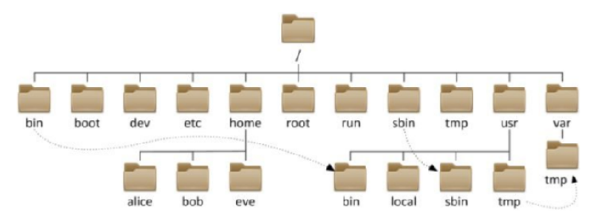

- **/，根目录是最顶级的目录了  ， Linux只有一个顶级目录：/**
- **路径描述的层次关系同样适用/来表示**
- **/home/itheima/a.txt，表示根目录下的home文件夹内有itheima文件夹， 内有a.txt**

## 一、Linux基础

### **隐藏文件、文件夹**

在Linux中以 `.` 开头的，均是隐藏的。 默认不显示出来，需要 `-a` 选项才可查看到

### **HOME目录**

每一个用户在`Linux`系统中都有自己的专属工作目录，称之为`HOME`目录。 

- 普通用户的`HOME`目录，默认在：`/home/用户名` 
- `root`用户的`HOME`目录，在：`/root` 

FinalShell登陆终端后，默认的工作目录就是用户的`HOME`目录

### **相对路径、绝对路径**

- 相对路径， 非  `/`  开头的称之为相对路径 

相对路径表示以当前目录作为起点，去描述路径，如`test/a.txt`，表示当前 工作目录内的`test`文件夹内的`a.txt`文件 

- 绝对路径， 以 `/`开头的称之为绝对路径 

绝对路径从根开始描述路径  

### **特殊路径符**

- **.** ，表示当前，比如`./a.txt`，表示当前文件夹内的`a.txt`文件 
- **. .** ，表示上级目录，比如 `../`表示上级目录， `../ ../`表示上级的上级目录 
- **~** ，表示用户的`HOME`目录，比如`cd ~`，即可切回用户`HOME`目录  

### 环境变量

临时设置： **export 变量名=变量值**

永久设置：

针对用户，设置用户HOME目录内：**.bashrc文件**

针对全局，设置**/etc/profile**

### PATH变量

记录了执行程序的搜索路径 

可以将自定义路径加入PATH内，实现自定义命令在任意地方均可执行的效果 

### $ 符号 取出指定的环境变量的值

语法：**$变量名** 

示例： echo $PATH，输出PATH环境变量的值 

​           echo ${PATH}ABC，输出PATH环境变量的值以及ABC 

如果变量名和其它内容混淆在一起，可以使用${} 

### 压缩解压缩

Linux系统中常用压缩格式有：**.tar、.gzip、.zip **

.tar，常见为**.tar**，称之为tarball，归档文件，既简单的将文件组装到一个.tar的文件内，并没有太多文件体积的减少，仅仅是简单的封装

.gz，也常见为**.tar.gz**，gzip格式压缩文件，即使用gzip压缩算法将文件压缩到一个文件内，可以极大的减少压缩后的体积

针对以上两种格式，使用**tar**命令均可以进行压缩和解压缩的操作

zip格式则需要使用**zip**命令进行压缩和解压缩的操作

#### 压缩

##### **.tar、.gzip的压缩**

tar [-c -v -x -f -z -C] 要压缩的文件1，要压缩的文件2……要压缩的文件N

选项：

**-c：**创建压缩文件，用于压缩模式

**-v：**显示压缩、解压过程，用于查看进度

**-x：**解压模式

**-f：**要创建的文件，或要解压的文件，-f必须在所有选项中位置处于最后一个

**-z：**gzip模式，不使用-z就是普通的tarball格式

**-C：**选择解压的目的地，用于解压模式

**tar的常用组合（压缩）**

tar -cvf test.tar 1.txt 2.txt 3.txt	将1.txt 2.txt 3.txt压缩到test.tar文件内

tar -zcvf test.tar.gz 1.txt 2.txt 3.txt	将1.txt 2.txt 3.txt压缩到test.tar.gz文件内，使用gzip模式

**注意：**-z如果使用，需处于选项位第一个。-f必须在选项位最后一个

##### **.zip的压缩**

**使用zip命令，压缩为.zip文件**

zip [-r] 参数1 参数2 ……参数N

-r：被压缩的包含文件夹时，需要用-r选项（和rm命令的-r效果一致）

例：

zip test.zip a.txt b.txt c.txt	将a.txt b.txt c.txt压缩到test.zip文件内

zip -r test.zip test itheima a.txt	将test itheima两个文件夹和 a.txt文件压缩到test.zip文件内

#### 解压缩

##### **.tar、.gzip的解压缩**

tar [-c -v -x -f -z -C] 要解压的文件

选项：

**-c：**创建压缩文件，用于压缩模式

**-v：**显示压缩、解压过程，用于查看进度

**-x：**解压模式

**-f：**要创建的文件，或要解压的文件，-f必须在所有选项中位置处于最后一个

**-z：**gzip模式，不使用-z就是普通的tarball格式

**-C：**选择解压的目的地，用于解压模式

**tar的常用组合（解压缩）**

tar -xvf test.tar	解压test.tar，解压到当前目录

tar -xvf test.tar -C .home.itheima	解压test.tar，解压到指定目录（.home.itheima）

tar -zxvf test.tar.gz -C .home.itheima	解压test.tar.gz，解压到指定目录（.home.itheima）

**注意：**-f必须在最后一位，-z必须在开头，-C必须单独使用和解压所需其他参数分开

##### **.zip的解压缩**

**使用unzip命令，解压.zip的文件**

unzip [-d] 参数

-d：**指定解压去的位置（同tar的-C）**

参数：被解压的zip压缩包文件

例：

unzip test.zip	将test.zip解压到当前目录

unzip test.zip -d .home.itheima	将test.zip解压到指定目录（.home.itheima）

## 二、常用命令

**命令比较多，建议使用 CTRL + F 进行搜索**

~~~bash
# 查看命令帮助
命令 --help
# 查看命令的详细手册
man 命令 
~~~

#### ls  列出文件夹信息  

语法：**ls [-l -h -a] [参数]**

- 参数：被查看的文件夹，不提供参数，表示查看当前工作目录 
- -l，以列表形式查看 
- -h，配合-l，以更加人性化的方式显示文件大小 
- -a，显示隐藏文件  

#### pwd  展示当前工作目录  

语法：**pwd**

#### cd  切换工作目录  

语法：**cd [目标目录]** 

参数：目标目录，要切换去的地方，不提供默认切换到当前登录用户HOME目录 

#### mkdir  创建文件夹  

语法：**mkdir [-p] 参数** 

- 参数：被创建文件夹的路径 
- 选项：-p，可选，表示创建前置路径 

#### touch  创建文件  

语法：**touch 参数** 

- 参数：被创建的文件路径 

#### cat  查看文件内容  

 语法：**cat 参数** 

- 参数：被查看的文件路径 

#### more  查看文件，可以支持翻页查看  

语法：**more 参数** 

- 参数：被查看的文件路径 
- 在查看过程中： 
  - 空格键翻页 
  - q退出查看 

#### cp  功能：复制文件、文件夹  

语法：**cp [-r] 参数1 参数2** 

- 参数1，被复制的 
- 参数2，要复制去的地方 
- 选项：-r，可选，复制文件夹使用 

示例： 

- cp a.txt b.txt，复制当前目录下a.txt为b.txt 
- cp a.txt test/，复制当前目录a.txt到test文件夹内 
- cp -r test test2，复制文件夹test到当前文件夹内为test2存在 

#### mv  移动文件、文件夹  

语法：**mv 参数1 参数2** 

- 参数1：被移动的 
- 参数2：要移动去的地方，参数2如果不存在，则会进行改名 

#### rm  删除文件、文件夹  

语法：**rm [-r -f] 参数 . . . 参数** 

- 参数：支持多个，每一个表示被删除的，空格进行分隔 
- 选项：
  - -r，删除文件夹使用 
  - -f，强制删除，不会给出确认提示，一般root用户会用到 

#### which  查看命令的程序本体文件路径  

语法：**which 参数** 

- 参数：被查看的命令 

#### find  搜索文件  

语法：**按文件名搜索：find 路径 -name 参数** 

- 路径，搜索的起始路径 
- 参数，搜索的关键字，支持通配符 *， 比如：*test表示搜索任意以test结尾 的文件 

#### grep  过滤关键字  

语法：**grep [-n] 关键字 文件路径** 

- 选项：-n，可选，表示在结果中显示匹配的行的行号。 
- 关键字，必填，表示过滤的关键字，带有空格或其它特殊符号，建议使 用””将关键字包围起来 
- 文件路径，必填，表示要过滤内容的文件路径，可作为内容输入端口 

> 文件路径，可以作为管道符的输入  

#### wc  统计  

语法：**wc [-c -m -l -w] 文件路径** 

- 选项：
  - -c，统计bytes数量 选项
  - -m，统计字符数量 选项
  - -l，统计行数 选项
  - -w，统计单词数量 
- 文件路径，被统计的文件，可作为内容输入端口 

> 文件路径，可以作为管道符的输入  

#### 管道符 |   将符号左边的结果，作为符号右边的输入  

示例：

**cat a.txt | grep itheima**，将cat a.txt的结果，作为grep命令的输入， 用来过滤itheima关键字可以支持嵌套：

**cat a.txt | grep itheima | grep itcast** 

#### echo  输出内容  

语法：**echo 参数** 

- 参数：被输出的内容 

#### ` 反引号   被两个反引号包围的内容，会作为命令执行  

示例： 

- **echo `pwd`**，会输出当前工作目录 

#### tail  查看文件尾部内容  

语法：**tail [-f] 参数** 

- 参数：被查看的文件 
- 选项：-f，持续跟踪文件修改 

#### head  查看文件头部内容  

语法：**head [-n] 参数** 

- 参数：被查看的文件 
- 选项：-n，查看的行数 

#### >> 重定向符   将符号左边的结果，输出到右边指定的文件中去  

`>`表示覆盖输出

`>>`表示追加输出

#### su 切换用户

语法：**su [-] [用户]  **

选项：

-：表示切换后加载环境变量，建议带上

用户：可以省略，省略默认切换到 root 用户

#### sudo 让普通命令带有 root 权限

语法：**sudo 其它命令**

**需要以 root 用户执行 visudo 命令，增加配置方可让普通用户有 sudo 命令的执行权限**

 比如：

~~~bash
itheima ALL=(ALL)	NOPASSWD: ALL
~~~

> 在visudo内配置如上内容，可以让itheima用户，无需密码直接使用sudo 

#### chmod  修改文件、文件夹权限 

语法：**chmod [-R] 权限 参数** 

选项-R，设置文件夹和其内部全部内容一样生效

参数，被修改的文件、文件夹

权限，要设置的权限，比如755，表示：rwxr-xr-x  

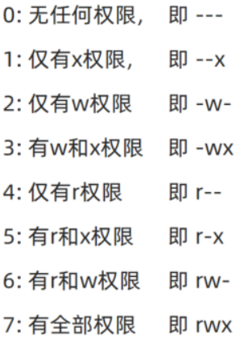

**u**表示user所属用户权限，**g**表示group组权限，**o**表示other其他用户权限

#### chown  修改文件、文件夹所属用户、组  

语法：**chown [-R] [用户] [:] [用户组] 文件或文件夹**  

选项：

-R：同chmod

用户：修改所属用户

用户组：修改所属用户组

：：用于分割用户和用户组

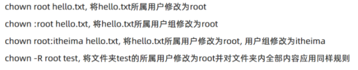

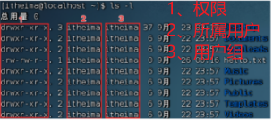

#### 创建用户组

**groupadd 用户组名**

> 需要 root 权限

#### 删除用户组

**groupdel 用户组名**

> 需要 root 权限

#### 查看系统全部用户组 

**getent group**，查看系统全部的用户组 

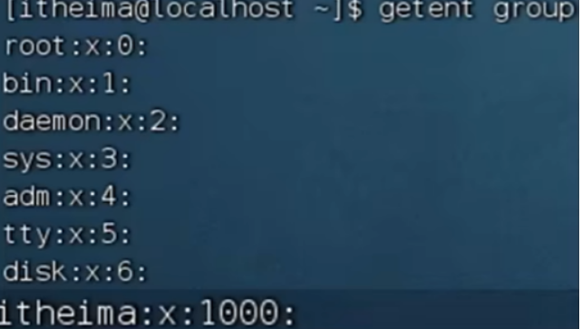

信息从左至右分别为： 组名称：组认证：组ID

#### 查看系统全部用户

**getent passwd**，查看当前系统中有哪些用户

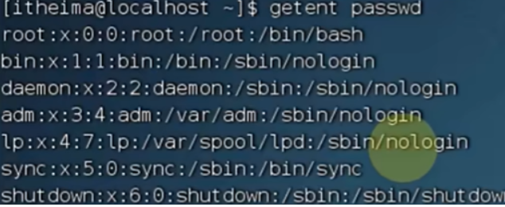

信息从左至右分别为： 用户名：密码：用户ID：组ID：描述信息（无用）：HOME目录：执行中断（默认bash)

#### env 查看系统全部的环境变量

**env**

#### 创建用户

**useradd [-g -d] 用户名**

选项：

-g：指定用户组，不指定-g，会创建同名用户组并自动加入

指定-g，需要组已存在，若已存在同名组，必须使用-g

-d：指定用户HOME路径，不指定，HOME默认在：/home/用户名

#### 删除用户

**userdel [-r] 用户名**

选项：-r，删除用户的HOME目录，不使用-r，删除用户时，HOME目录保留

#### 查看用户所属组

**id [用户名]**

用户名：被查看的用户，不提供则查看自身

#### 修改用户所属组

**usermod -aG 用户组 用户名**

指定用户加入指定用户组↑

#### systemctl  控制系统服务的启动关闭等

语法：**systemctl start | stop | restart | disable | enable | status 服务名** 

- start，启动 
- stop，停止 
- status，查看状态 
- disable，关闭开机自启 
- enable，开启开机自启 
- restart，重启  

#### 软链接  创建文件、文件夹软链接（快捷方式）  

语法：**ln -s 参数1 参数2** 

- 参数1：被链接的 
- 参数2：要链接去的地方（快捷方式的名称和存放位置） 

#### 日期

语法：**date [-d] [+格式化字符串]** 

- -d 按照给定的字符串显示日期，一般用于日期计算 
- 格式化字符串：通过特定的字符串标记，来控制显示的日期格式 
  - %Y 年%y 年份后两位数字 (00 .99) 
  - %m 月份 (01 .12) 
  - %d 日 (01 .31) 
  - %H 小时 (00 .23) 
  - %M 分钟 (00 .59) 
  - %S 秒 (00 .60) 
  - %s 自 1970-01-01 00:00:00 UTC 到现在的秒数  

示例：

-  按照2022-01-01的格式显示日期  

-  按照2022-01-01 10:00:00的格式显示日期  

-  -d选项日期计算  

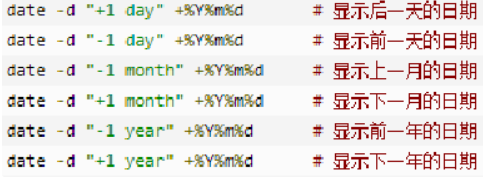

   -  支持的时间标记为：  
   -  

#### 时区

修改时区为中国时区  

~~~bash
rm -f /etc/localtime
sudu ln -s /usr/share/zoneinfo/Asia/Shanghai /etc/localtime
~~~

#### ntp 同步时间

安装：yum install -y ntp 

启动管理：systemctl start | stop | restart | status | disable | enable ntpd

手动校准时间：ntpdate -u ntp.aliyun.com 

#### ip地址

格式：a.b.c.d 

- abcd为0~255的数字 

特殊IP： 

- 127.0.0.1，表示本机 
- 0.0.0.0 
  - 可以表示本机 
  - 也可以表示任意IP（看使用场景） 

查看ip：ifconfig 

#### 主机名  Linux系统的名称  

查看：hostname 

设置：hostnamectl set-hostname 主机名 

#### ps  查看进程信息  

语法：**ps -ef**，查看全部进程信息

可以搭配grep做过滤：**ps -ef | grep xxx ** 

#### kill 关闭进程

语法：**kill [9] 进程ID**

选项： -9，表示强制关闭进程。不使用此选项会向进程发送信号要求其关闭，但是否关闭看进程自身的处理机制

#### nmap 查看端口占用情况

安装 nmap ：yum install -y nmap

语法：**nmap 被查看的 ip 地址**

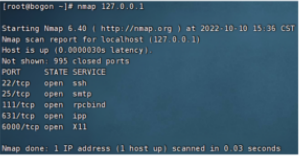

可以看到，本机（127.0.0.1)有5个端口被占用

#### netstat 查看端口占用

用法： netstat -anp | grep xxx

#### ping  测试网络是否联通  

语法：**ping [-c num] 参数  **

选项：-c，检查的次数，不使用 -c 将无限次持续检查

参数：被检查的 ip 或主机名

#### wget 非交互式文件下载器

语法：**wget [-b] url**

选项：-b，可选，后台下载，会将日志写入到当前工作目录的 wget-log 文件

url：下载链接

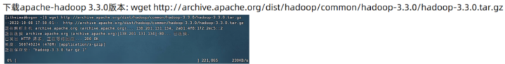

**无论下载是否完成，都会生产要下载的文件，如果下载未完成，请及时清理未完成的不可以文件**

#### curl 发送http网络请求

语法：**curl [-O] url**

选项：-O，用于下载文件，当url时下载链接时，可用此选项保存文件

url：要发送请求的网络地址

#### top 查看主机运行状态

语法：**top**，查看基础信息

选项：

-p：只显示某个进程的信息

-d：设置刷新时间，默认5s

-c：显示产生进程的完整命令，默认时进程名

-n：指定刷新次数

-b：以非交互式非全屏模式运行，一般配合-n指定输出几次统计信息，将输出重定向到指定文件

如： top -b -n 3 >> /tmp/top.tmp

-i：不显示任何闲置或无用的进程

-u：查找特定用户启动的进程

交互模式可用快捷键：

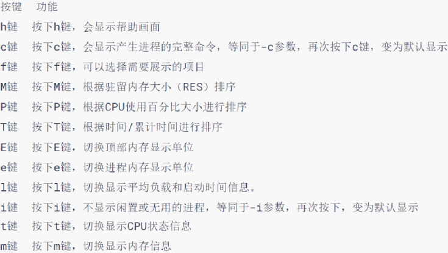

#### df 查看磁盘占用

语法：**df [-h]**

选项：-h，以更人性化的单位显示

#### iostat 查看CPU、磁盘的相关信息

语法：**iostat [-x] [num1] [num2]**

选项：

-x：显示更多信息

num1：数字，刷新间隔

num2：数字，刷新几次

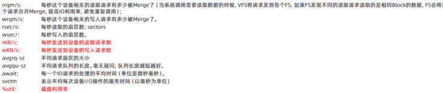

#### sar 查看网络统计

语法：**sar -n DEV num1 num2**

选项：-n，查看网络，DEV表示查看网络接口

num1：数字，刷新间隔（不填就一次）

num2：数字，查看次数（不填无限次）

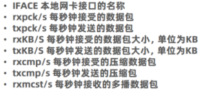

## 三、vi编辑器

### 命令模式快捷键

| **命令**          | **描述**                             |
| ----------------- | ------------------------------------ |
| **i**             | 在当前光标位置进入，**输入模式**     |
| **a**             | 在当前光标位置之后进入，**输入模式** |
| **I （大写i）**   | 在当前行的开头，进入 **输入模式**    |
| **A**             | 在当前行的结尾，进入 **输入模式**    |
| **o**             | 在当前光标下一行，进入**输入模式**   |
| **O**             | 在当前光标上一行，进入**输入模式**   |
| **esc**           | 回到**命令模式**                     |
| **↑、k**          | 向上移动光标                         |
| **↓、j**          | 向下移动光标                         |
| **←、h**          | 向左移动光标                         |
| **→、l（小写L）** | 向右移动光标                         |
| **0(数字0)**      | 移动光标到当前行的开头               |
| **$**             | 移动光标到当前行的结尾               |
| **PgUp**          | 向上翻页                             |
| **PgDn**          | 向下翻页                             |
| **/**             | 进入搜索模式                         |
| **n**             | 向下继续搜索                         |
| **N**             | 向上继续搜索                         |
| **dd**            | 删除光标所在行的内容                 |
| **ndd**           | n是数字，表示删除当前光标向下n行     |
| **yy**            | 复制当前行                           |
| **nyy**           | n是数字，复制当前行和下面的n行       |
| **p**             | 粘贴                                 |
| **u**             | 撤销修改                             |
| **ctrl + r**      | 反向撤销                             |
| **gg**            | 跳到首行                             |
| **G**             | 跳到行尾                             |
| **dG**            | 从当前行开始，向下全部删除           |
| **dgg**           | 从当前行开始，向上全部删除           |
| **d$**            | 从当前光标开始，删除到本行的结尾     |
| **d0（数字0）**   | 从当前光标开始，删除到本行的开头     |

### 底线命令快捷键

| **命令**       | **描述**     |
| -------------- | ------------ |
| **:wq**        | 保存并退出   |
| **:q**         | 仅退出       |
| **:q!**        | 强制退出     |
| **:w**         | 仅保存       |
| **:set nu**    | 显示行号     |
| **:set paste** | 设置粘贴模式 |
