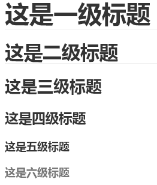
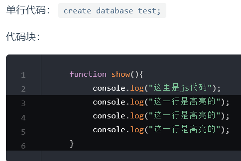
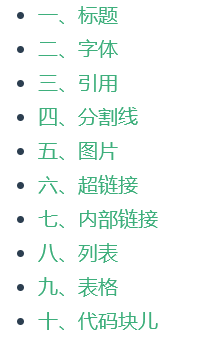

# MarkDown常用语法

## 一、标题

~~~markdown
# 这是一级标题
## 这是二级标题，二级标题底下有横线
### 这是三级标题
#### 这是四级标题
##### 这是五级标题
###### 这是六级标题
~~~

**效果**



::: warning 注意

`#`后面必须有个空格，然后再跟内容，否则`#`就是普通字符

:::

## 二、字体

~~~markdown
**这是加粗的文字**
*这是倾斜的文字*`
***这是斜体加粗的文字***
~~这是加删除线的文字~~
~~~

**效果**

**这是加粗的文字**

*这是倾斜的文字*

***这是斜体加粗的文字***

~~这是加删除线的文字~~

## 三、引用

~~~markdown
>这是1级引用的内容

>>这是2级引用的内容

>>>这是3级引用的内容
~~~

**效果**

>这是1级引用的内容

>>这是2级引用的内容

>>>这是3级引用的内容

## 四、分割线

~~~markdown
使用3个或者多个“*”的分割线
***

使用3个或者多个“-”的分割线

---
~~~

**效果**

使用3个或者多个`*`的分割线
***

使用3个或者多个`-`的分割线

---

::: warning 注意

在三个或者多个`-`的上面加文字的话会自动变成2级标题，所以要么空一行要么就使用`*`

:::

## 五、图片

**格式：**`![图片alt] (图片地址 "图片title")`

- **图片alt**：就是显示在图片下面的文字，相当于对图片内容的解释。
- **图片地址**:可以是本地路径的图片，也可以是网络上的图片
- **图片title**：是图片的标题，当鼠标移到图片上时显示的内容。`title`可加可不加

~~~markdown
本地图片

网络图片

~~~

**效果**

本地图片


网络图片


::: warning 注意

中括号与小括号之间是没有空格的

:::

## 六、超链接

**格式**：[超链接名] (超链接地址 "超链接title")

- `title`可加可不加

~~~markdown
[FullStackNotes](http://linwei-zhang.gitee.io/full-stack-notes/)
[百度](http://baidu.com)
~~~

**效果**

[FullStackNotes](http://linwei-zhang.gitee.io/full-stack-notes/)

[百度](http://baidu.com)

## 七、内部链接

网站内部的链接，将会被转换成 `<router-link>`用于 `SPA` 导航。

同时，站内的每一个文件夹下的`README.md`或者 `index.md` 文件都会被自动编译为`index.html`，对应的链接将被视为`/`。

~~~markdown
以如下的文件结构为例：
.
├─ README.md
├─ foo
│  ├─ README.md
│  ├─ HAHA.md
│  └─ HEIHEI.md
└─ bar
   ├─ README.md
   ├─ Hello.md
   └─ Hei.md
~~~

**效果**

~~~markdown
假设你现在在 foo/HAHA.md 中：
[Home](/) <!-- 跳转到根部的 README.md -->
[foo](/foo/) <!-- 跳转到 foo 文件夹的 index.html -->
[foo](./HEIHEI) <!-- 跳转到 HEIHEI 文件 -->
[foo heading](./#heading) <!-- 跳转到 foo/index.html 的特定标题位置 -->
[bar - Hello](../bar/Hello.md) <!-- 具体文件可以使用 .md 结尾（推荐） -->
[bar - Hei](../bar/Hei.html) <!-- 也可以用 .html -->
~~~

## 八、列表

~~~markdown
无序列表
- 列表内容1
+ 列表内容2
* 列表内容3
有序列表
1. 列表内容
2. 列表内容
3. 列表内容
列表嵌套
+ 一级无序列表内容1
   1. 二级有序列表内容11
   2. 二级有序列表内容12
   3. 二级有序列表内容13
+ 一级无序列表内容2
   1. 二级有序列表内容21
   2. 二级有序列表内容22
   3. 二级有序列表内容23
~~~

**效果**

无序列表
- 列表内容1
+ 列表内容2
* 列表内容3
有序列表
1. 列表内容
2. 列表内容
3. 列表内容
列表嵌套
+ 一级无序列表内容1
   1. 二级有序列表内容11
   2. 二级有序列表内容12
   3. 二级有序列表内容13
+ 一级无序列表内容2
   1. 二级有序列表内容21
   2. 二级有序列表内容22
   3. 二级有序列表内容23

## 九、表格

~~~markdown
表头|表头|表头
---|:--:|---:
内容|内容|内容
内容|内容|内容

-第二行分割表头和内容。- 有一个就行，为了书写对齐，多加了几个，内容会自动撑开表格宽度
-文字默认居左
-在第二行“--”两边加“：”表示文字居中
-在第二行“--”右边加“：”表示文字居右
~~~

**效果**

| 姓名         |   年龄   |           国家 |
| ------------ | :------: | -------------: |
| 内容默认居左 | 内容居中 |       内容居右 |
| 张三         |    19    | 中华人民共和国 |
| 李四         |    29    |           中国 |
| 王麻子       |    18    | 中华人民共和国 |

## 十、代码块儿

~~~markdown
单行代码：
`create database test;`
代码块：
``` js {3-6}
  function show(){
           console.log("这里是js代码");
           console.log("这一行是高亮的");
           console.log("这一行是高亮的");
           console.log("这一行是高亮的");
      }
```
~~~

**效果**



## 十一、文字位置

~~~markdown
居中：
<center>文字居中</center>
右对齐：
<p align="right">右对齐</p>
~~~

**效果**

**居中：**

<center>文字居中</center>

**右对齐：**

<p align="right">右对齐</p>

## 十二、提示信息

~~~markdown
::: tip 提示
这是一个tip，使用了别名“提示”
:::
::: warning
这是一个warning，没有使用别名
:::
::: danger
这是一个danger，没有使用别名
:::
::: details 请看详情
这是一个details，使用了别名“请看详情”
:::
~~~

**效果**

::: tip 提示
这是一个tip，使用了别名“提示”
:::
::: warning
这是一个warning，没有使用别名
:::
::: danger
这是一个danger，没有使用别名
:::
::: details 请看详情
这是一个details，使用了别名“请看详情”
:::

## 十三、Emoji表情

使用表情有两种方式

- 使用代码
- 直接复制粘贴

~~~markdown
使用代码
  :tada: 
  :100: 
  :game_die:
复制粘贴
🐰 
🐺 
🐸
~~~

**效果**

使用代码
  :tada: 
  :100: 
  :game_die:
  
复制粘贴
🐰 
🐺 
🐸

## 十四、显示目录

~~~markdown
[[toc]]
~~~

**效果**


