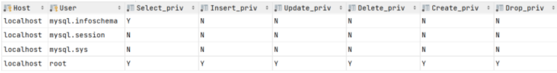

# 目录
[[toc]]
# DCL（Data Control Language）

数据控制语言，用来管理数据库用户、控制数据库的访问权限

**在MySQL中需要通过Host和User来唯一标识一 个用户。** 

执行  select * from mysql.user;   查询结果如下

**含义解析：**

- Host：代表当前用户访问的主机, 如果为localhost, 仅代表只能够在当前本机访问，是不可以 远程访问的。 
- User：代表的是访问该数据库的用户名。

## 使用示例

- 在MySQL中需要通过用户名@主机名的方式，来唯一标识一个用户  
- 主机名可以使用 % 通配 
- 多个权限之间，使用逗号分隔  
- 授权时， 数据库名和表名可以使用 * 进行通配，代表所有

~~~sql
-- 创建用户
CREATE USER '用户名'@'主机名' IDENTIFIED BY '密码';

create user 'zhanglinwei'@'localhost' identified by '123456';

create user 'linwei'@'%' identified by '123456';

-- 修改用户密码
ALTER USER '用户名'@'主机名' IDENTIFIED WITH mysql_native_password BY '新密码' ;

alter user 'linwei'@'%' identified with mysql_native_password by '1234';

-- 删除用户
DROP USER '用户名'@'主机名' ;

drop user 'zhanglinwei'@'localhost';

-- 查询权限
SHOW GRANTS FOR '用户名'@'主机名' ;

show grants for 'linwei'@'%';

-- 授予权限
GRANT 权限列表 ON 数据库名.表名 TO '用户名'@'主机名';

grant all on ilovemysql.* to 'linwei'@'%';

-- 撤销权限
REVOKE 权限列表 ON 数据库名.表名 FROM '用户名'@'主机名';

revoke all on ilovemysql.* from 'linwei'@'%';

~~~

