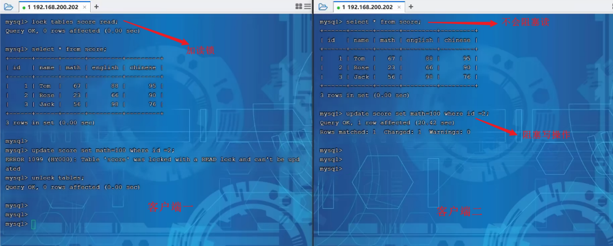
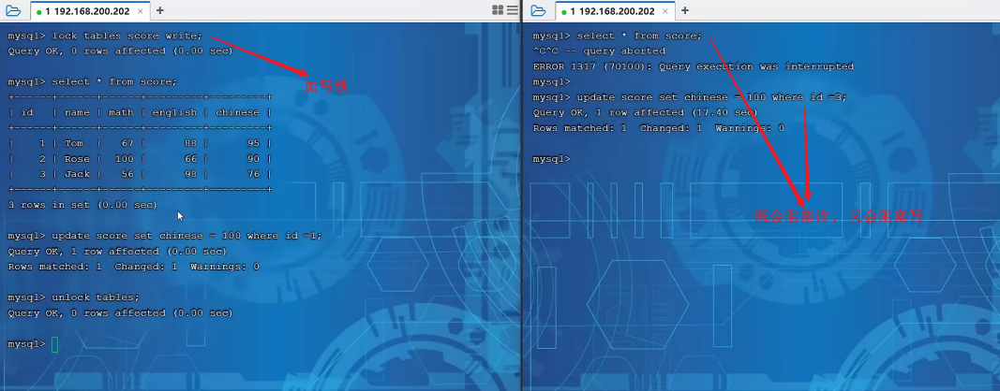
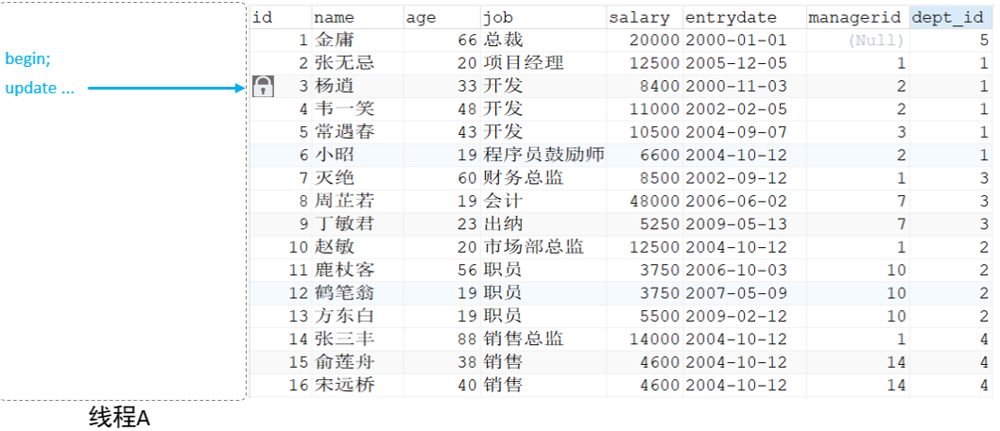
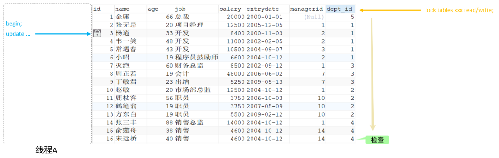
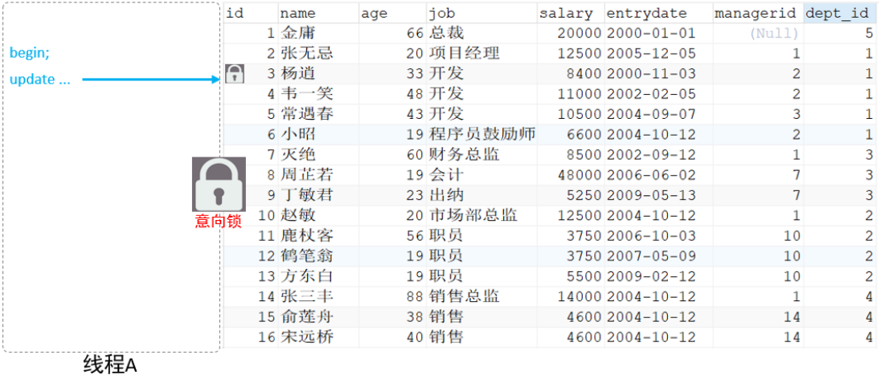
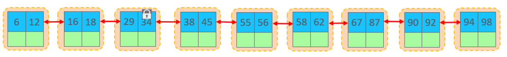
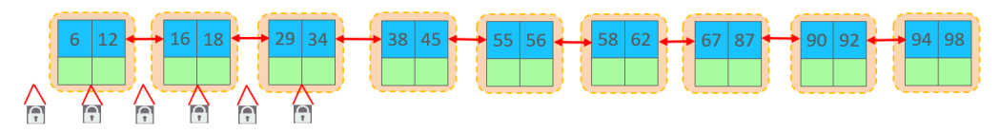
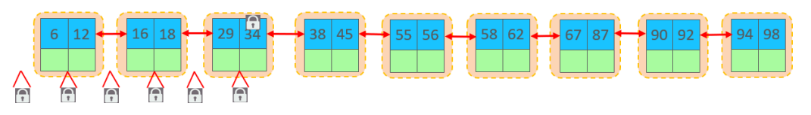

# 目录

[[toc]]

## MySQL锁

锁是计算机协调多个进程或线程并发访问某一资源的机制

`MySQL`中的锁，按照锁的粒度分，分为以下三类

- 全局锁：锁定数据库中的所有表。 
- 表级锁：每次操作锁住整张表。 
  - 表锁
    - 表共享读锁（read lock） 
    - 表独占写锁（write lock）
  - 元数据锁（meta data lock，MDL）
  - 意向锁
    - 意向共享锁(IS)
    - 意向排他锁(IX)
- 行级锁：每次操作锁住对应的行数据。
  - 行锁
    - 共享锁（S）
    - 排他锁（X）
  - 间隙锁
  - 临键锁

## 全局锁

全局锁就是对整个数据库实例加锁，加锁后整个实例就处于只读状态，后续的`DML`的写语句，`DDL`语句，已经更新操作的事务提交语句都将被阻塞

典型的使用场景是做全库的逻辑备份，对所有的表进行锁定，从而获取一致性视图，保证数据的完整 性

~~~sql
-- 加全局锁
flush tables with read lock ;

-- 数据备份 （注意，这个不是sql命令）
mysqldump -uroot –p1234 zhang > zhang.sql

-- 释放锁
unlock tables ;
~~~

> 在`InnoDB`引擎中，我们可以在备份时加上参数 `--single-transaction` 参数来完成不加锁的一致性数据备份。
>
> ~~~sql
> mysqldump --single-transaction -uroot –p123456 zhang > zhang.sql
> ~~~

## 表级锁

表级锁，每次操作锁住整张表。锁定粒度大，发生锁冲突的概率最高，并发度最低。

应用在`MyISAM`、 `InnoDB`、`BDB`等存储引擎中

主要分为三类

- 表锁 
  - 表共享读锁（read lock） 
  - 表独占写锁（write lock）
- 元数据锁（meta data lock，MDL） 
- 意向锁

### 表锁

对于表锁，分为两类

- 表共享读锁（read lock） 

- 表独占写锁（write lock）

~~~sql
-- 加锁
lock tables 表名... read
lock tables 表名... write

-- 释放锁
unlock tables / 客户端断开连接
~~~

#### 读锁

左侧为客户端一，对指定表加了读锁，不会影响右侧客户端二的读，但是会阻塞右侧客户端的写。

#### 写锁

左侧为客户端一，对指定表加了写锁，会阻塞右侧客户端的读和写。

::: tip 结论

读锁不会阻塞其他客户端的读，但是会阻塞写。

写锁既会阻塞其他客户端的读，又会阻塞 其他客户端的写。

:::

### 元数据锁

`meta data lock` , 元数据锁，简写`MDL`

`MDL`加锁过程是系统自动控制，无需显式使用，在访问一张表的时候会自动加上。

`MDL`锁主要作用是维护表元数据的数据一致性，在表上有活动事务的时候，不可以对元数据进行写入操作

::: tip

也就是说，某一张表涉及到未提交的事务 时，是不能够修改这张表的表结构

:::

当对一张表进行增删改查的时候，加`MDL`读锁(共享)

当对表结构进行变更操作的时候，加`MDL`写锁(排他)

### 意向锁

为了避免`DML`在执行时，加的行锁与表锁的冲突，在`InnoDB`中引入了意向锁，使得表锁不用检查每行数据是否加锁，使用意向锁来减少表锁的检查

- 意向共享锁(IS): 由语句`select ... lock in share mode`添加 。 
  - 与表锁共享锁 (read)兼容，与表锁排他锁(write)互斥。 

- 意向排他锁(IX): 由`insert`、`update`、`delete`、`select...for update`添加 。
  - 与表锁共 享锁(read)及排他锁(write)都互斥，意向锁之间不会互斥。

**假如没有意向锁**，客户端一对表加了行锁后，客户端二如何给表加表锁呢

首先客户端一，开启一个事务，然后执行`DML`操作，在执行`DML`语句时，会对涉及到的行加行锁

当客户端二，想对这张表加表锁时，会检查当前表是否有对应的行锁，如果没有，则添加表锁，此时就会从第一行数据，检查到最后一行数据，效率较低

**有了意向锁之后**

客户端一，在执行`DML`操作时，会对涉及的行加行锁，同时也会对该表加上意向锁

而其他客户端，在对这张表加表锁的时候，会根据该表上所加的意向锁来判定是否可以成功加表锁，而不用逐行判断行锁情况了

::: tip

一旦事务提交了，意向共享锁、意向排他锁，都会自动释放

:::

## 行级锁

行级锁，每次操作锁住对应的行数据。锁定粒度最小，发生锁冲突的概率最低，并发度最高。

应用在 `InnoDB`存储引擎中。

`InnoDB`的数据是基于索引组织的，行锁是通过对索引上的**索引项加锁**来实现的，而不是对记录加的锁

- 行锁（Record Lock）：锁定单个行记录的锁，防止其他事务对此行进行update和delete。在 `RC`、`RR`隔离级别下都支持。

  

- 间隙锁（Gap Lock）：锁定索引记录间隙（不含该记录），确保索引记录间隙不变，防止其他事务在这个间隙进行`insert`，产生幻读。在`RR`隔离级别下都支持。

  

- 临键锁（Next-Key Lock）：行锁和间隙锁组合，同时锁住数据，并锁住数据前面的间隙。 在`RR`隔离级别下支持

### 行锁

`InnoDB`实现了两种类型的行锁

- 共享锁（S）：允许一个事务去读一行，阻止其他事务获得相同数据集的排它锁。 
- 排他锁（X）：允许获取排他锁的事务更新数据，阻止其他事务获得相同数据集的共享锁和排他 锁。

常见`SQL`加锁情况

| SQL    | 行锁类型    | 说明     |
| ------ | ----------- | -------- |
| INSERT | 排他锁      | 自动加锁 |
| UPDATE | 排他锁      | 自动加锁 |
| DELETE | 排他锁      | 自动加锁 |
| SELECT | 不加任何 锁 |          |

::: tip

默认情况下，`InnoDB`在 `REPEATABLE READ`事务隔离级别运行，`InnoDB`使用 `next-key` 锁进行搜 索和索引扫描，以防止幻读

针对唯一索引进行检索时，对已存在的记录进行等值匹配时，将会自动优化为行锁

:::

::: danger 注意

`InnoDB`的行锁是针对于索引加的锁，不通过索引条件检索数据，那么`InnoDB`将对表中的所有记录加锁，此时就会升级为表锁

:::

### 间隙锁&临键锁

默认情况下，`InnoDB`在 `REPEATABLE READ`事务隔离级别运行，`InnoDB`使用 `next-key` 锁进行搜索和索引扫描，以防止幻读

- 索引上的等值查询(唯一索引)，给不存在的记录加锁时, 优化为间隙锁 。 
- 索引上的等值查询(非唯一普通索引)，向右遍历时最后一个值不满足查询需求时，`next-key lock` 退化为间隙锁。 
- 索引上的范围查询(唯一索引)--会访问到不满足条件的第一个值为止

::: danger 注意

间隙锁唯一目的是防止其他事务插入间隙。

间隙锁可以共存，一个事务采用的间隙锁不会阻止另一个事务在同一间隙上采用间隙锁。

:::

