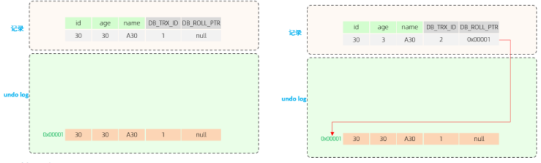

---

# title: 'MysSQL'
# level: [1,2,3,4]
---

# MySQL

## MySQL的数据类型

 主要分为三类：数值类型、字符串类型、日期时间类型


### 数值类型

| **类型**                             | **大小**          | **有符号范围SIGNED**                                   | **无符号范围UNSIGNED**                                     | **描述**              |
| ------------------------------------ | ----------------- | ------------------------------------------------------ | ---------------------------------------------------------- | --------------------- |
| TINYINT                              | 1byte             | (-128，127)                                            | (0，255)                                                   | 小整 数值             |
| SMALLINT                             | 2bytes            | (-32768，32767)                                        | (0，65535)                                                 | 大整 数值             |
| MEDIUMINT                            | 3bytes            | (-8388608，8388607)                                    | (0，16777215)                                              | 大整 数值             |
| INT/INTEGER                          | 4bytes            | (-2147483648， 2147483647)                             | (0，4294967295)                                            | 大整 数值             |
| BIGINT                               | 8bytes            | (-2^63，2^63-1)                                        | (0，2^64-1)                                                | 极大 整数 值          |
| FLOAT                                | 4bytes            | (-3.402823466 E+38， 3.402823466351 E+38)              | 0 和                                                       |                       |
| (1.175494351 E-38，3.402823466 E+38) | 单精 度浮 点数 值 |                                                        |                                                            |                       |
| DOUBLE                               | 8bytes            | (-1.7976931348623157 E+308， 1.7976931348623157 E+308) | 0 和 (2.2250738585072014 E-308， 1.7976931348623157 E+308) | 双精 度浮 点数 值     |
| DECIMAL                              |                   | 依赖于M(精度)和D(标度) 的值                            | 依赖于M(精度)和D(标度)的 值                                | 小数 值(精 确定 点数) |


### 字符串类型

-  char 相对 varchar char的性能会更高些
-  varchar 后面的数字表示长度
-  int 后面的数字表示位数，不够则补0，需要配合 zerofill 使用

| **类型**   | **大小**              | **描述**                     |
| ---------- | --------------------- | ---------------------------- |
| CHAR       | 0-255 bytes           | 定长字符串(需要指定长度)     |
| VARCHAR    | 0-65535 bytes         | 变长字符串(需要指定长度)     |
| TINYBLOB   | 0-255 bytes           | 不超过255个字符的二进制数据  |
| TINYTEXT   | 0-255 bytes           | 短文本字符串                 |
| BLOB       | 0-65 535 bytes        | 二进制形式的长文本数据       |
| TEXT       | 0-65 535 bytes        | 长文本数据                   |
| MEDIUMBLOB | 0-16 777 215 bytes    | 二进制形式的中等长度文本数据 |
| MEDIUMTEXT | 0-16 777 215 bytes    | 中等长度文本数据             |
| LONGBLOB   | 0-4 294 967 295 bytes | 二进制形式的极大文本数据     |
| LONGTEXT   | 0-4 294 967 295 bytes | 极大文本数据                 |


### 日期时间类型

| **类型**  | **大小** | **范围**                                   | **格式**            | **描述**                  |
| --------- | -------- | ------------------------------------------ | ------------------- | ------------------------- |
| DATE      | 3        | 1000-01-01 至 9999-12-31                   | YYYY-MM-DD          | 日期值                    |
| TIME      | 3        | -838:59:59 至 838:59:59                    | HH:MM:SS            | 时间值或持续 时间         |
| YEAR      | 1        | 1901 至 2155                               | YYYY                | 年份值                    |
| DATETIME  | 8        | 1000-01-01 00:00:00 至 9999-12-31 23:59:59 | YYYY-MM-DD HH:MM:SS | 混合日期和时 间值         |
| TIMESTAMP | 4        | 1970-01-01 00:00:01 至 2038-01-19 03:14:07 | YYYY-MM-DD HH:MM:SS | 混合日期和时 间值，时间戳 |


## MySQL运算符


### 比较运算符

| **比较运算符**      | **功能**                                       |
| ------------------- | ---------------------------------------------- |
| >                   | 大于                                           |
| >=                  | 大于等于                                       |
| <                   | 小于                                           |
| <=                  | 小于等于                                       |
| =                   | 等于                                           |
| <> 或 !=            | 不等于                                         |
| BETWEEN ... AND ... | 在某个范围之内（含最小、最大值）               |
| IN( ... )           | 在 in 之后的列表中的值，多选一                 |
| LIKE 占位符         | 模糊匹配（ _ 匹配单个字符， % 匹配任意个字符） |
| IS NULL             | 是 NULL                                        |
| NOT IN              | 不在指定的集合范围之内                         |
| ANY                 | 子查询返回列表中，有任意一个满足即可           |
| SOME                | 与ANY等同，使用SOME的地方都可以使用ANY         |
| ALL                 | 子查询返回列表的所有值都必须满足               |


### 逻辑运算符

| **逻辑运算符**      | **功能**                     |
| ------------------- | ---------------------------- |
| AND 或 &&           | 并且（多个条件同时成立）     |
| OR 或 &#124; &#124; | 或者（多个条件任意一个成立） |
| NOT 或 !            | 非，不是                     |


## MySQL常见函数


### 常见的聚合函数

| **函数** | **功能** |
| -------- | -------- |
| count    | 统计数量 |
| max      | 最大值   |
| min      | 最小值   |
| avg      | 平均值   |
| sum      | 求和     |


### 常见的字符串函数

| **函数**                 | **功能**                                                   |
| ------------------------ | ---------------------------------------------------------- |
| CONCAT(S1,S2,...Sn)      | 字符串拼接，将S1，S2，... Sn拼接成一个字符串               |
| LOWER(str)               | 将字符串str全部转为小写                                    |
| UPPER(str)               | 将字符串str全部转为大写                                    |
| LPAD(str,n,pad)          | 左填充，用字符串pad对str的左边进行填充，达到n个字符 串长度 |
| RPAD(str,n,pad)          | 右填充，用字符串pad对str的右边进行填充，达到n个字符 串长度 |
| TRIM(str)                | 去掉字符串头部和尾部的空格                                 |
| SUBSTRING(str,start,len) | 返回从字符串str从start位置起的len个长度的字符串            |


### 常见的数值函数

| **函数**   | **功能**                           |
| ---------- | ---------------------------------- |
| CEIL(x)    | 向上取整                           |
| FLOOR(x)   | 向下取整                           |
| MOD(x,y)   | 返回x/y的模                        |
| RAND( )    | 返回0~1内的随机数                  |
| ROUND(x,y) | 求参数x的四舍五入的值，保留y位小数 |


### 常见的日期函数

| **函数**                           | **功能**                                             |
| ---------------------------------- | ---------------------------------------------------- |
| CURDATE( )                         | 返回当前日期                                         |
| CURTIME( )                         | 返回当前时间                                         |
| NOW( )                             | 返回当前日期和时间                                   |
| YEAR(date)                         | 获取指定date的年份                                   |
| MONTH(date)                        | 获取指定date的月份                                   |
| DAY(date)                          | 获取指定date的日期                                   |
| DATE_ADD(date, INTERVAL expr type) | 返回一个日期/时间值加上一个时间间隔expr后，的 时间值 |
| DATEDIFF(date1,date2)              | 返回起始时间date1 和 结束时间date2之间的天 数        |


### 常见的流程函数

流程函数也是很常用的一类函数，可以在SQL语句中实现条件筛选，从而提高语句的效率  

| **函数**                                                     | **功能**                                                   |
| ------------------------------------------------------------ | ---------------------------------------------------------- |
| IF(value , t , f)                                            | 如果value为true，则返回t，否则返回 f                       |
| IFNULL(value1 , value2)                                      | 如果value1不为空，返回value1，否则 返回value2              |
| CASE WHEN [ val1 ] THEN [res1] ... ELSE [ default ] END      | 如果val1为true，返回res1，... 否 则返回default默认值       |
| CASE [ expr ] WHEN [ val1 ] THEN [res1] ... ELSE [ default ] END | 如果expr的值等于val1，返回 res1，... 否则返回default默认值 |


## MySQL常用权限

只是简单罗列了常见的几种权限描述，其他权限描述及含义，可以直接参考[官方文档](https://dev.mysql.com/doc/refman/8.0/en/privileges-provided.html)。  

| **权限**            | **说明**                 |
| ------------------- | ------------------------ |
| ALL, ALL PRIVILEGES | 所有权限                 |
| SELECT              | 查询数据权限             |
| INSERT              | 插入数据权限             |
| UPDATE              | 修改数据权限             |
| DELETE              | 删除数据权限             |
| ALTER               | 修改表权限               |
| DROP                | 删除数据库、表、视图权限 |
| CREATE              | 创建数据库、表权限       |


## MySQL约束

**概念：** 约束是作用于表中字段上的规则，用于限制存储在表中的数据。

**目的：** 保证数据库中数据的正确、有效性和完整性。  

| **约束**                  | **描述**                                                    | **关键字**  |
| ------------------------- | ----------------------------------------------------------- | ----------- |
| 非空约束                  | 限制该字段的数据不能为null                                  | NOT NULL    |
| 唯一约束                  | 保证该字段的所有数据都是唯一、不重复的                      | UNIQUE      |
| 主键约束                  | 主键是一行数据的唯一标识，要求非空且唯一                    | PRIMARY KEY |
| 默认约束                  | 保存数据时，如果未指定该字段的值，则采用默认值              | DEFAULT     |
| 检查约束(8.0.16版本 之后) | 保证字段值满足某一个条件                                    | CHECK       |
| 外键约束                  | 用来让两张表的数据之间建立连接，保证数据的一致 性和完整  性 | FOREIGN KEY |

 **注意：约束是作用于表中字段上的，可以在创建表/修改表的时候添加约束。**

~~~sql
CREATE TABLE tb_user(
	id int AUTO_INCREMENT PRIMARY KEY COMMENT 'ID唯一标识',
	name varchar(10) NOT NULL UNIQUE COMMENT '姓名' ,
	age int check (age > 0 && age <= 120) COMMENT '年龄' ,
	status char(1) default '1' COMMENT '状态',
	gender char(1) COMMENT '性别'
);
~~~


## SQL语法


### DCL（Data Control Language）

数据控制语言，用来管理数据库用户、控制数据库的访问权限

**在MySQL中需要通过Host和User来唯一标识一 个用户。** 

执行  select * from mysql.user;   查询结果如下


**含义解析：**

- Host：代表当前用户访问的主机, 如果为localhost, 仅代表只能够在当前本机访问，是不可以 远程访问的。 
- User：代表的是访问该数据库的用户名。


#### 使用示例

- 在MySQL中需要通过用户名@主机名的方式，来唯一标识一个用户  
- 主机名可以使用 % 通配 
- 多个权限之间，使用逗号分隔  
- 授权时， 数据库名和表名可以使用 * 进行通配，代表所有

~~~sql
-- 创建用户
CREATE USER '用户名'@'主机名' IDENTIFIED BY '密码';

create user 'zhanglinwei'@'localhost' identified by '123456';

create user 'linwei'@'%' identified by '123456';

-- 修改用户密码
ALTER USER '用户名'@'主机名' IDENTIFIED WITH mysql_native_password BY '新密码' ;

alter user 'linwei'@'%' identified with mysql_native_password by '1234';

-- 删除用户
DROP USER '用户名'@'主机名' ;

drop user 'zhanglinwei'@'localhost';

-- 查询权限
SHOW GRANTS FOR '用户名'@'主机名' ;

show grants for 'linwei'@'%';

-- 授予权限
GRANT 权限列表 ON 数据库名.表名 TO '用户名'@'主机名';

grant all on ilovemysql.* to 'linwei'@'%';

-- 撤销权限
REVOKE 权限列表 ON 数据库名.表名 FROM '用户名'@'主机名';

revoke all on ilovemysql.* from 'linwei'@'%';

~~~


### DDL(Data Definition Language)

数据定义语言，用来定义数据库对象(数据库，表，字段) 。 

用于创建或修改数据库、表、表结构


#### 数据库操作

~~~sql
-- 查询所有数据库
show databases;

-- 查询当前数据库
select database();

-- 创建数据库 方式一
create database [ if not exists ] 数据库名 [ default charset 字符集 ] [ collate 排序规则 ];

create database ilovemysql;

create database if not exists ilovemysql; -- ilovemysql不存在就创建，存在不创建

create database ilikemysql default charset utf8mb4; -- 指定字符集

-- 创建数据库 方式二
create schema 数据库名;

create schema db01;


-- 删除数据库
drop database [ if exists ] 数据库名;

drop database ilovemysql;

drop database if exists ilovemysql; -- 若存在 itcast 数据库，就删除

-- 切换数据库
use 数据库名;

use ilikemysql;
~~~


#### 表操作

```sql
-- 查询当前数据库所有表
show tables;

-- 查看指定表结构
-- 通过这条指令，我们可以查看到指定表的字段，字段的类型、是否可以为NULL，是否存在默认值等信息
desc 表名;

--  查询指定表的建表语句
show create table 表名;

-- 创建表结构
CREATE TABLE 表名(
	字段1 字段1类型 [ COMMENT 字段1注释 ],
	字段2 字段2类型 [COMMENT 字段2注释 ],
	字段3 字段3类型 [COMMENT 字段3注释 ],
	......
	字段n 字段n类型 [COMMENT 字段n注释 ]
) [ COMMENT 表注释 ];

--  添加字段
ALTER TABLE 表面 ADD 字段名 类型(长度) [ COMMENT 注释 ] [ 约束 ];

ALTER TABLE emp ADD nickname varchar(20) COMMENT '昵称';

-- 修改数据类型
ALTER TABLE 表名 MODIFY 字段名 新数据类型(长度);

-- 修改字段名和字段类型
ALTER TABLE 表名 CHANGE 旧字段名 新字段名 类型(长度) [ COMMENT 注释 ] [ 约束 ];

ALTER TABLE emp CHANGE nickname username varchar(30) COMMENT '昵称';

-- 删除字段
ALTER TABLE 表名 DROP 字段名;

ALTER TABLE emp DROP username;

-- 修改表名
ALTER TABLE 表名 RENAME TO 新表名;

ALTER TABLE emp RENAME TO employee;

-- 删除表
DROP TABLE [ IF EXISTS ] 表名;

DROP TABLE IF EXISTS tb_user;

--  删除指定表, 并重新创建表 （在删除表时，数据也会被删除）
TRUNCATE TABLE 表名;

```


### DML（Data Manipulation Language）

数据操作语言，用来对数据库中表的数据记录进 行增、删、改操作


#### insert 添加

-  插入数据时，指定的字段顺序需要与值的顺序是一一对应的。  
-  字符串和日期型数据应该包含在引号中。  
-  插入的数据大小，应该在字段的规定范围内。  

~~~sql
--  给指定字段添加数据
INSERT INTO 表名 (字段名1, 字段名2, ...) VALUES (值1, 值2, ...);

insert into employee(id,workno,name,gender,age,idcard,entrydate)
values(1,'1','Itcast','男',10,'123456789012345678','2000-01-01');

-- 给全部字段添加数据
INSERT INTO 表名 VALUES (值1, 值2, ...);

insert into employee values(2,'2','张无忌','男',18,'123456789012345670','2005-01-01');

-- 批量添加数据
INSERT INTO 表名 (字段名1, 字段名2, ...) VALUES (值1, 值2, ...), (值1, 值2, ...), (值
1, 值2, ...) ;
INSERT INTO 表名 VALUES (值1, 值2, ...), (值1, 值2, ...), (值1, 值2, ...) ;

insert into employee values(3,'3','韦一笑','男',38,'123456789012345670','2005-01-
01'),(4,'4','赵敏','女',18,'123456789012345670','2005-01-01');
~~~


#### update 修改

修改语句的条件可以有，也可以没有，如果没有条件，则会修改整张表的所有数据。  

~~~sql
UPDATE 表名 SET 字段名1 = 值1 , 字段名2 = 值2 , .... [ WHERE 条件 ] ;

update employee set name = 'itheima' where id = 1;

update employee set name = '小昭' , gender = '女' where id = 1;

update employee set entrydate = '2008-01-01';
~~~


#### delete 删除

-  DELETE 语句的条件可以有，也可以没有，如果没有条件，则会删除整张表的所有数据。  
-  DELETE 语句不能删除某一个字段的值(可以使用UPDATE，将该字段值置为NULL即 可)。  

~~~sql
DELETE FROM 表名 [ WHERE 条件 ] ;

delete from employee where gender = '女';

delete from employee;
~~~


### DQL（Data QueryLanguage）

数据查询语言，用来查询数据库中表的记录。  


#### 语法结构

~~~sql
SELECT
	字段列表
FROM
	表名列表
WHERE
	条件列表
GROUP BY
	分组字段列表
HAVING
	分组后条件列表
ORDER BY
	排序字段列表
LIMIT
	分页参数

-- 语句执行顺序
FROM
	表名列表
WHERE
	条件列表
GROUP BY
	分组字段列表
HAVING
	分组后条件列表
SELECT
	字段列表
ORDER BY
	排序字段列表
LIMIT
	分页参数
~~~


#### 基本查询

~~~sql
-- 查询多个字段
SELECT 字段1, 字段2, 字段3 ... FROM 表名 ; -- 查询指定字段
SELECT * FROM 表名 ; -- 查询全部字段(少用 * ，不直观，影响效率)

select name,workno,age from emp;
select * from emp;

-- 字段设置别名
SELECT 字段1 [ AS 别名1 ] , 字段2 [ AS 别名2 ] ... FROM 表名;
SELECT 字段1 [ 别名1 ] , 字段2 [ 别名2 ] ... FROM 表名;

select workaddress as '工作地址' from emp;
select workaddress '工作地址' from emp; -- as 可以省略

-- 去除重复记录
SELECT DISTINCT 字段列表 FROM 表名; -- DISTINCT 为去重

select distinct workaddress '工作地址' from emp;
~~~


#### where 条件查询

~~~sql
-- 根据 where 条件查询
SELECT 字段列表 FROM 表名 WHERE 条件列表 ;

select * from emp where age = 88;
select * from emp where age < 20;
select * from emp where age <= 20;

select * from emp where idcard is null;
select * from emp where idcard is not null;

select * from emp where age != 88;
select * from emp where age <> 88;

select * from emp where age >= 15 && age <= 20;
select * from emp where age >= 15 and age <= 20;
select * from emp where age between 15 and 20;

select * from emp where gender = '女' and age < 25;
select * from emp where age = 18 or age = 20 or age =40;

select * from emp where age in(18,20,40);
select * from emp where age not in(18,20,40);

select * from emp where name like '__'; -- _表示匹配一个任意字符
select * from emp where idcard like '%X'; -- %表示匹配多个任意字符
~~~


#### 使用函数

NULL值是不参与所有聚合函数运算的。

~~~ sql
-- 聚合函数
SELECT 聚合函数(字段列表) FROM 表名 ;

select count(*) from emp; -- 统计的是总记录数
select count(idcard) from emp; -- 统计的是idcard字段不为null的记录数

select avg(age) from emp; -- 统计该企业员工的平均年龄

select max(age) from emp; -- 统计该企业员工的最大年龄

select min(age) from emp; -- 统计该企业员工的最小年龄

select sum(age) from emp where workaddress = '西安'; -- 统计西安地区员工的年龄之和

-- 字符串函数
-- 企业员工的工号，统一为5位数，目前不足5位数的全部在前面补0。比如： 1号员工的工号应该为00001。

update emp set workno = lpad(workno, 5, '0');

-- 数值函数
-- 通过数据库的函数，生成一个六位数的随机验证码。
select lpad(round(rand()*1000000 , 0), 6, '0');
 
-- 日期函数 
select date_add(now(), INTERVAL 70 YEAR );

-- 流程函数
-- 查询emp表的员工姓名和工作地址 (北京/上海 ----> 一线城市 , 其他 ----> 二线城市)
select name,
( case workaddress when '北京' then '一线城市' when '上海' then '一线城市' else
'二线城市' end ) as '工作地址' from emp;
~~~


#### group 分组查询

分组之后，查询的字段一般为聚合函数和分组字段，查询其他字段无任何意义。  

**执行顺序:** where > 聚合函数 > having 。  

支持多字段分组, 具体语法为 : `group by columnA,columnB`  

**where与having区别**
**1、执行时机不同：**

- where是分组之前进行过滤，不满足where条件，不参与分组；
- 而having是分组之后对结果进行过滤。

**2、判断条件不同：**

- where不能对聚合函数进行判断，而having可以。 

~~~sql
-- ASC : 升序(默认值)  DESC: 降序
SELECT 字段列表 FROM 表名 ORDER BY 字段1 排序方式1 , 字段2 排序方式2 ;

select * from emp order by age asc;
select * from emp order by age;

select * from emp order by entrydate desc;
select * from emp order by age asc , entrydate desc;
~~~

- **如果是升序, 可以不指定排序方式ASC**
- **如果是多字段排序，当第一个字段值相同时，才会根据第二个字段进行排序**


#### 分页查询

-  **起始索引从0开始，起始索引 = （查询页码 - 1）X  每页显示记录数**
-  **分页查询是数据库的方言，不同的数据库有不同的实现，MySQL中是LIMIT**
-  **如果查询的是第一页数据，起始索引可以省略，直接简写为 limit 10**

~~~sql
SELECT 字段列表 FROM 表名 LIMIT 起始索引, 查询记录数 ;

select * from emp limit 0,10;
select * from emp limit 10;

--  查询第2页员工数据, 每页展示10条记录
select * from emp limit 10,10;
~~~


## 多表查询

内容包含：连接查询、联合查询、子查询


 各个表之间的联系，基本上分为三种： 

- 一对多(多对一) 
- 多对多 
- 一对一  


### 连接查询

- **内连接：** 相当于查询A、B交集部分数据  
- **左外连接：** 查询左表所有数据，以及两张表交集部分数据  
- **右外连接：** 查询右表所有数据，以及两张表交集部分数据  
- **自连接：** 当前表与自身的连接查询，自连接必须使用表别名  


#### 内连接

内连接的语法分为两种: 

- 隐式内连接
- 显式内连接

内连接查询的是两张表交集部分的数 据。(也就是绿色部分的数据)  


##### 1). 隐式内连接  

~~~sql
SELECT 字段列表 FROM 表1 , 表2 WHERE 条件 ... ;

-- 查询每一个员工的姓名 , 及关联的部门的名称
select e.name,d.name from emp e , dept d where e.dept_id = d.id;
~~~


##### 2). 显式内连接  

~~~sql
SELECT 字段列表 FROM 表1 [ INNER ] JOIN 表2 ON 连接条件 ... ;

-- 查询每一个员工的姓名 , 及关联的部门的名称
select e.name, d.name from emp e join dept d on e.dept_id = d.id;
~~~


#### 外连接

 外连接分为两种：

- 左外连接： 左外连接相当于查询表1(左表)的所有数据，当然也包含表1和表2交集部分的数据
- 右外连接：右外连接相当于查询表2(右表)的所有数据，当然也包含表1和表2交集部分的数据。  


##### 1). 左外连接 

 左外连接相当于查询表1(左表)的所有数据，当然也包含表1和表2交集部分的数据

~~~sql
SELECT 字段列表 FROM 表1 LEFT [ OUTER ] JOIN 表2 ON 条件 ... ;

-- 查询emp表的所有数据, 和对应的部门信息
select e.*, d.name from emp e left join dept d on e.dept_id = d.id;
~~~


##### 2). 右外连接

右外连接相当于查询表2(右表)的所有数据，当然也包含表1和表2交集部分的数据。  

~~~sql
SELECT 字段列表 FROM 表1 RIGHT [ OUTER ] JOIN 表2 ON 条件 ... ;

-- 查询dept表的所有数据, 和对应的员工信息
select d.*, e.* from dept d left outer join emp e on e.dept_id = d.id;
~~~


#### 自连接

自连接查询，顾名思义，就是自己连接自己，也就是把一张表连接查询多次  
而对于自连接查询，可以是内连接查询，也可以是外连接查询。  

~~~sql
SELECT 字段列表 FROM 表A 别名A JOIN 表A 别名B ON 条件 ... ;

--  查询员工 及其 所属领导的名字
select a.name , b.name from emp a , emp b where a.managerid = b.id;

-- 查询所有员工 emp 及其领导的名字 emp , 如果员工没有领导, 也需要查询出来
select a.name '员工', b.name '领导' from emp a left join emp b on a.managerid = b.id;
~~~


### 联合查询

 对于union查询，就是把多次查询的结果合并起来，形成一个新的查询结果集  

- 联合查询的多张表的列数必须保持一致，字段类型也需要保持一致
- `union all` 会将全部的数据直接合并在一起，`union` 会对合并之后的数据去重

```sql
SELECT 字段列表 FROM 表A ...
UNION [ ALL ]
SELECT 字段列表 FROM 表B ....;

select * from emp where salary < 5000
union all
select * from emp where age > 50;

```


### 子查询

 SQL语句中嵌套SELECT语句，称为嵌套查询，又称子查询

 子查询外部的语句可以是`INSERT` / `UPDATE` / `DELETE` / `SELECT` 的任何一个  

根据子查询结果不同，分为： 

- 标量子查询（子查询结果为单个值），常用的操作符：=、<>、>、>=、<、<=
- 列子查询(子查询结果为一列) ，常用的操作符：IN 、NOT IN 、 ANY 、SOME 、 ALL  
- 行子查询(子查询结果为一行)  ，= 、<> 、IN 、NOT IN  
- 表子查询(子查询结果为多行多列)，IN 

~~~sql
SELECT * FROM t1 WHERE column1 = ( SELECT column1 FROM t2 );

-- 标量子查询
-- 根据 "销售部" 部门ID, 查询员工信息
select * from emp where dept_id = (select id from dept where name = '销售部');

--  查询在 "方东白" 入职之后的员工信息
select * from emp where entrydate > (select entrydate from emp where name = '方东白');


-- 列子查询
-- 查询 "销售部" 和 "市场部" 的所有员工信息
select * from emp where dept_id in (select id from dept where name = '销售部' or name = '市场部');

-- 查询比 财务部 所有人工资都高的员工信息
select * from emp where salary > all ( select salary from emp where dept_id =
(select id from dept where name = '财务部') );

-- 查询比研发部其中任意一人工资高的员工信息
select * from emp where salary > any ( select salary from emp where dept_id =
(select id from dept where name = '研发部') );


-- 行子查询
--  查询与 "张无忌" 的薪资及直属领导相同的员工信息
select * from emp where (salary,managerid) = (select salary, managerid from emp
where name = '张无忌');


-- 表子查询
 -- 查询与 "鹿杖客" , "宋远桥" 的职位和薪资相同的员工信息
select * from emp where (job,salary) in ( select job, salary from emp where name =
'鹿杖客' or name = '宋远桥' );

--  查询入职日期是 "2006-01-01" 之后的员工信息 , 及其部门信息
select e.*, d.* from (select * from emp where entrydate > '2006-01-01') e left
join dept d on e.dept_id = d.id ;
~~~


## MySQL事务

事务通常是由一个或一组`SQL`组成的，组成一个事务的`SQL`一般都是一个业务操作

事务是一组操作的集合，它是一个不可分割的工作单位，事务会把所有的操作作为一个整体一起向系统提交或撤销操作请求，即这些操作要么同时成功，要么同时失败

- **事务是基于当前数据库连接而言的，连接`A`中开启事务，是不会影响连接`B`的**

- **默认MySQL的事务是自动提交的，也就是说，当执行完一条DML语句时，MySQL会立即隐式的提交事务。**

~~~sql
-- 查看/设置事务提交方式
SELECT @@autocommit ; -- 查看

SET @@autocommit = 0 ; -- 0不自动提交
~~~


### 事务四大特性 ACID

1. **原子性（Atomicity）**：

   ​	事务是不可分割的最小操作单元，要么全部成功，要么全部失败  

2. **一致性（Consistency）**：

   ​	不管事务发生的前后，`MySQL`中原本的数据变化都是一致的，也就是`DB`中的数据只允许从一个一致性状态变化为另一个一致性状态。

   ​	说人话：一个事务中的所有操作，要么一起改变数据库中的数据，要么都不改变，对于其他事务而言，数据的变化是一致的

3. **隔离性（Isolation）**：

   ​	指多个事务之间都是独立的，相当于每个事务都被装在一个箱子中，每个箱子之间都是隔开的，相互之间并不影响

4. **持久性（Durability）**：

   ​	事务一旦提交或回滚，它对数据库中的数据的改变就是永久的  

   

### 手动控制事务

**手动开启事务后一定要做提交或回滚处理，否则不会生效**

在`MySQL`中，提供了一系列事务相关的命令

- `start transaction | begin | begin work`：开启一个事务
- `commit`：提交一个事务
- `rollback`：回滚一个事务

~~~sql
-- 开启一个事务
start transaction;

-- 第一条SQL语句
-- 第二条SQL语句
-- 第三条SQL语句

-- 提交或回滚事务
commit || rollback;
~~~


### 事务回滚点

当一个事务中的后续操作执行失败时，会回滚到指定的回滚点位置，而不是回滚整个事务中的所有操作

但假设目前有一个事务，由很多条`SQL`组成，但是我想让其中一部分执行成功后，就算后续`SQL`执行失败也照样提交，这时就可以使用**事务回滚点**

`MySQL`提供了两个关于事务回滚点的命令：

- `savepoint point_name`：添加一个事务回滚点
- `rollback to point_name`：回滚到指定的事务回滚点

~~~sql
-- 先查询一次用户表
SELECT * FROM `zz_users`;
-- 开启事务
start transaction;
-- 修改 ID=4 的姓名为：黑熊
update `zz_users` set `user_name` = "黑熊" where `user_id` = 4;
-- 添加一个事务回滚点：update_name
savepoint update_name;
-- 删除 ID=1 的行数据
delete from `zz_users` where `user_id` = 1;
-- 回滚到 update_name 这个事务点
rollback to update_name;
-- 再次查询一次数据
SELECT * FROM `zz_users`;
-- 提交事务
COMMIT;
~~~

上述代码中开启了一个事务，事务中总共修改和删除两条`SQL`组成，然后在修改语句后面添加了一个事务回滚点`update_name`，在删除语句后回滚到了前面添加的回滚点。

> **<font color=#FF0000 >注意：</font>**
>
> 回滚到事务点后不代表着事务结束了，只是事务内发生了一次回滚，如果要结束当前这个事务，还依旧需要通过`commit|rollback;`命令处理


### 事务隔离级别

| **隔离级别**                   | **脏读** | **不可重复的** | **幻读** |
| :----------------------------- | -------- | -------------- | -------- |
| 读未提交 Read Uncommitted      | √        | √              | √        |
| 读已提交 Read Committed        | ×        | √              | √        |
| 可重复读 Repeatable Read(默认) | ×        | ×              | √        |
| 串行化 Serializable            | ×        | ×              | ×        |

> 事务隔离级别越高，数据越安全，但是性能越低

~~~sql
-- 查看事务隔离级别
SELECT @@TRANSACTION_ISOLATION;

-- 设置事务隔离级别
SET [ SESSION | GLOBAL ] TRANSACTION ISOLATION LEVEL { READ UNCOMMITTED |
READ COMMITTED | REPEATABLE READ | SERIALIZABLE }
~~~

**脏读** :指一个事务读到了其他事务还未提交的数据

**不可重复读** :指在一个事务中，多次读取同一数据，先后读取到的数据不一致

**幻读** :一个事务按照条件查询数据时，没有对应的数据行，但是在插入数据时，又发现这行数据已经存在

**脏写** :多个事务一起操作同一条数据，例如两个事务同时向表中添加一条`ID=888`的数据，此时就会造成数据覆盖，或者主键冲突的问题，这个问题也被称之为更新丢失问题。

**读未提交级别：** 基于**写互斥锁**实现的，只有获取到锁的事务，才允许对数据进行写操作，解决了**脏写**问题

**读已提交级别：** 对于写操作同样会使用**写互斥锁**，对于读操作则使用`MVCC`

**可重复读级别：** 在这个隔离级别中，主要就是解决上一个级别中遗留的不可重复读问题，但`MySQL`依旧是利用`MVCC`机制来解决这个问题的

**串行化级别：** 所有的事务按序排队后串行化处理，也就是操作同一张表的事务只能一个一个执行，事务在执行前需要先获取表级别的锁资源，拿到锁资源的事务才能执行，其余事务则陷入阻塞，等待当前事务释放锁。

> *`RR`级别中也可以解决幻读问题，就是使用临键锁（间隙锁+行锁）这种方式来加锁*


### 事务原理

`MySQL`的事务机制是基于日志实现的

任意一条写`SQL`的执行都会记录三个日志：`undo-log、redo-log、bin-log`

- `undo-log`：主要记录`SQL`的撤销日志，比如目前是`insert`语句，就记录一条`delete`日志。
- `redo-log`：记录当前`SQL`归属事务的状态，以及记录修改内容和修改页的位置。
- `bin-log`：记录每条`SQL`操作日志，只要是用于数据的主从复制与数据恢复/备份。

> 重点是`undo-log、redo-log`这两个日志


#### redo-log

`redo-log`是一种`WAL(Write-ahead logging)`预写式日志，在数据发生更改之前会先记录日志，也就是在`SQL`执行前会先记录一条`prepare`状态的日志，然后再执行数据的写操作

> 注意：`MySQL`是基于磁盘的，但磁盘的写入速度相较内存而言会较慢，因此`MySQL-InnoDB`引擎中不会直接将数据写入到磁盘文件中，而是会先写到`BufferPool`缓冲区中，当`SQL`被成功写入到缓冲区后，紧接着会将`redo-log`日志中相应的记录改为`commit`状态，然后再由`MySQL`刷盘机制去做具体的落盘操作

~~~sql
-- 开启事务
start transaction;
-- 修改 ID=4 的姓名为：黑熊（原本user_name = 1111）
update `zz_users` set `user_name` = "黑熊" where `user_id` = 4;
-- 删除 ID=1 的行数据
delete from `zz_users` where `user_id` = 1;
-- 提交事务
COMMIT;
~~~

这段`SQL`代码执行的过程如下：

1. 当`MySQL`执行时，碰到`start transaction;`的命令时，会将后续所有写操作全部先关闭自动提交机制，也就是后续的所有写操作，不管有没有成功都不会将日志记录修改为`commit`状态

2. 先在`redo-log`中为第一条`SQL`语句，记录一条`prepare`状态的日志，然后再生成对应的撤销日志并记录到`undo-log`中，然后执行`SQL`，将要写入的数据先更新到缓冲区

3. 再对第二条`SQL`语句做相同处理，如果有更多条`SQL`则逐条依次做相同处理

4. 直到碰到了`rollback、commit`命令时，再对前面的所有写`SQL`做相应处理

   - commit：先将当前事务中，所有的`SQL`的`redo-log`日志改为`commit`状态，然后由`MySQL`后台线程做刷盘，将缓冲区中的数据落入磁盘存储
   - rollback：在`undo-log`日志中找到对应的撤销`SQL`执行，将缓冲区内更新过的数据全部还原，由于缓冲区的数据被还原了，因此后台线程在刷盘时，依旧不会改变磁盘文件中存储的数据

   

### 事务的恢复机制

MySQL在运行期间会有几个问题

1、当`SQL`执行时，数据还没被刷写到磁盘中，结果数据库宕机了，那数据是不是就丢了啊？

> 对于这个问题并不需要担心，因为前面提到过`redo-log`是一种预写式日志，会先记录日志再去更新缓冲区中的数据，所以就算缓冲区的数据未被刷写到磁盘，在`MySQL`重启时，依旧可以通过`redo-log`日志重新恢复未落盘的数据，从而确保数据的持久化特性

2、那如果在记录`redo-log`日志时，`MySQL`芭比Q了咋整？

> 前面说过数据被更新到缓冲区代表着`SQL`执行成功了，此时客户端会收到`MySQL`返回的写入成功提示，只是没有落盘而言，所以`MySQL`重启后只需要再次落盘即可
>
> 但如果在记录日志的时候`MySQL`宕机了，这代表着`SQL`都没执行成功，`SQL`没执行成功的话，`MySQL`也不会向客户端返回任何信息，因为`MySQL`一直没返回执行结果，因此会导致客户端连接超时，而一般客户端都会有超时补偿机制的，比如会超时后重试，如果`MySQL`做了热备/灾备，这个重试的时间足够`MySQL`重启完成了，因此用户的操作依旧不会丢失（对于超时补偿机制，在各大数据库连接池中是有实现的）


### 事务的ACID实现

- 原子性由 `undo log` 保证
- 一致性由 `undo log + redo log` 保证
- 隔离性由 `锁 + MVCC` 保证
- 持久性由 `redo log` 保证


**原子性：** 当事务中的操作失败时，需要回滚，此时就需要用到 `undo log` 日志中记录的反向操作来进行回滚。

**一致性：** 前面也有说过，当事务结束时，会有两种情况 1、提交 2、回滚

- 提交：就需要用到 `redo log` 日志，将其中记录的所有本次事务操作改为 `commit` 状态，然后由`MySQL`后台线程做刷盘
- 回滚：就需要用到 `undo log` 日志，找到对应的撤销 `sq`l 执行，还原缓冲区数据

**隔离性：** 通过锁机制，将多个事务隔离开，通过 MVCC 机制，实现非阻塞都的功能。

**持久性：** 对数据的所有操作都会记录在 `redo log` 中，避免 `MySQL` 宕机重启后丢失修改


### MVCC

全称 Multi-Version Concurrency Control，多版本并发控制。

会维护一个数据的多个版本， 使得读写操作没有冲突，快照读为 `MySQ`L 实现 `MVCC` 提供了一个非阻塞读功能

`MVCC` 的具体实现，还需要依赖于数据库记录中的**三个隐式字段、undo log版本链、readView读视图**


#### **三个隐式字段**

| **隐藏字段** | **含义**                                                     |
| ------------ | ------------------------------------------------------------ |
| DB_TRX_ID    | 最近修改事务ID，记录插入这条记录或最后一次修改该记录的事务ID。 |
| DB_ROLL_PTR  | 回滚指针，指向这条记录的上一个版本，用于配合undo log，指向上一个版 本。 |
| DB_ROW_ID    | 隐藏主键，如果表结构没有指定主键，将会生成该隐藏字段。       |


#### **undo log版本链**

不同事务或相同事务对同一条记录进行修改，会导致该记录的`undolog`生成一条记录版本链表，链表的头部是最新的旧记录，链表尾部是最早的旧记录

有一张表，原始数据为


**DB_TRX_ID :** 代表最近修改事务ID，记录插入这条记录或最后一次修改该记录的事务ID，是 自增的。 
**DB_ROLL_PTR ：** 由于这条数据是才插入的，没有被更新过，所以该字段值为null。  

 然后，有四个并发事务同时在访问这张表。  


- 当事务2执行第一条修改语句时，会记录undo log日志，记录数据变更之前的样子; 
- 然后更新记录， 并且记录本次操作的事务ID，回滚指针，回滚指针用来指定如果发生回滚，回滚到哪一个版本。



最终会形成如下的版本链


#### readview 读视图

是 快照读 `SQL`执行时`MVCC`提取数据的依据，记录并维护系统当前活跃的事务 （未提交的）id。 

**ReadView**中包含了四个核心字段： 

| **字段**       | **含义**                                             |
| -------------- | ---------------------------------------------------- |
| m_ids          | 当前活跃的事务ID集合                                 |
| min_trx_id     | 最小活跃事务ID                                       |
| max_trx_id     | 预分配事务ID，当前最大事务ID+1（因为事务ID是自增的） |
| creator_trx_id | ReadView创建者的事务ID                               |

而在`readview`中就规定了版本链数据的访问规则

- trx_id 代表当前undolog版本链对应事务ID

| **条件**                           | **是否可以访问**                           | **说明**                                    |
| ---------------------------------- | ------------------------------------------ | ------------------------------------------- |
| trx_id == creator_trx_id           | 可以访问该版本                             | 成立，说明数据是当前这个事 务更改的         |
| trx_id < min_trx_id                | 可以访问该版本                             | 成立，说明数据已经提交了。                  |
| trx_id > max_trx_id                | 不可以访问该版本                           | 成立，说明该事务是在 ReadView生成后才开启。 |
| min_trx_id <= trx_id <= max_trx_id | 如果trx_id不在m_ids中， 是可以访问该版本的 | 成立，说明数据已经提交。                    |

**不同的隔离级别，生成ReadView的时机不同：**

- **READ COMMITTED ：在事务中每一次执行快照读时生成ReadView，保证读取到的是数据可见的最新版本。**
- **REPEATABLE READ：仅在事务中第一次执行快照读时生成ReadView，后续复用该ReadView实现可重复读。**


## 存储引擎

存储引擎就是存储数据、建立索引、更新/查询数据等技术的实现方式 。

- 存储引擎是基于表的 
- MySQL默认存储引擎为： InnoDB
- 常用存储引擎： InnoDB、MyISAM

`MySQL`是一款支持拔插式引擎的数据库，在开发过程中你可以根据业务特性，从支持的诸多引擎中选择一款适合的


~~~sql
-- 建表时指定存储引擎
CREATE TABLE 表名(
	字段1 字段1类型 [ COMMENT 字段1注释 ] ,
	......
	字段n 字段n类型 [COMMENT 字段n注释 ]
) ENGINE = INNODB [ COMMENT 表注释 ] ;

-- 查询当前数据库支持的存储引擎
show engines;

-- 批量修改一个库所有表的存储引擎命令
mysql_convert_table_fromat --user=user_name --password=user_pwd --engine=MyISAM database_name;
~~~


### InnoDB VS MyISAM


#### 磁盘文件对比


其中使用`MyISAM`引擎的表：`zz_myisam_index`，会在本地生成三个磁盘文件

- `zz_myisam_index.frm`：该文件中存储表的结构信息。
- `zz_myisam_index.MYD`：该文件中存储表的行数据。
- `zz_myisam_index.MYI`：该文件中存储表的索引数据。

> `MyISAM`引擎的表数据和索引数据，会分别放在两个不同的文件中存储

使用`InnoDB`引擎的表：`zz_innodb_index`，在磁盘中仅有两个文件

- `zz_innodb_index.frm`：该文件中存储表的结构信息。
- `zz_innodb_index.ibd`：该文件中存储表的行数据和索引数据。

> `InnoDB `引擎的表数据和索引数据，会分放在一个文件中存储


#### 索引支持对比

**`InnoDB`支持聚簇索引、`MyISAM`不支持聚簇索引**

因为`MyISAM`引擎，会将表分为`.frm、.MYD、.MYI`三个文件放在磁盘存储，表数据和索引数据是分别放在`.MYD、.MYI`文件中，所以注定了`MyISAM`引擎只支持**非聚簇索引**。

而`InnoDB`引擎的表数据、索引数据都放在`.ibd`文件中存储，因此`InnoDB`是支持**聚簇索引**的。

> 聚簇索引的要求是：索引键和行数据必须在物理空间上也是连续的，而`MyISAM`表数据和索引数据，分别位于两个磁盘文件中，这也就注定了它无法满足聚簇索引的要求。
>
> 不支持聚簇索引也有好处，也就是无论走任何索引，都只需要一遍查询即可获得数据，而`InnoDB`引擎的表中，如果不走聚簇（主键）索引查询数据，走其他索引的情况下，都需要经过两遍（回表）查询才能获得数据


#### 事务机制对比

**`InnoDB`支持事务、`MyISAM`不支持事务**

因为`InnoDB`引擎中有两个自己专享的日志，即`undo log`、`redo log``

``InnoDB`在`MySQL`启动后，会在内存中构建一个`undo_log_buffer`缓冲区，同时在磁盘中也有相应的`undo-log`日志文件

所以使用`InnoDB`存储引擎的表，可以借助`undo-log`日志实现事务机制，支持多条`SQL`组成一个事务，可以保证发生异常的情况下，组成这个事务的`SQL`到底回滚还是提交


而`MyISAM`并未设计类似的技术，在启动时不会在内存中构建`undo_log_buffer`缓冲区，磁盘中也没有相应的日志文件，因此`MyISAM`并不支持事务机制

> 关于 `undo log`、`redo log` 和事务原理，在前面的事务篇说过


#### 故障恢复的对比

**`MyISAM`并没有`InnoDB`引擎可靠**

`InnoDB`在启动时，同样会在内存中构建一个`redo_log_buffer`缓冲区，在磁盘中也会有相应的`redo-log`日志文件

`InnoDB`引擎由于`redo-log`日志的存在，因此只要事务提交，无论是机器断电、程序宕机等各种灾难情况，都可以用`redo-log`日志来恢复数据

但`MyISAM`引擎同样没有`redo-log`日志，所以并不支持数据的故障恢复，所以丢了也就无法找回。


#### 锁粒度对比

**`MyISAM`仅支持表锁，而`InnoDB`同时支持表锁、行锁**

`MyISAM`由于不支持聚簇索引，所以无法实现行锁，光说没用，上例子


上述这张表中，假设使用的是`MyISAM`引擎，同时对`student_id`字段建立了主键索引，`name`字段建立了普通索引，`sex、height`字段建立了联合索引

> 这张表中存在三个索引，那在本地的`.MYI`索引文件中，肯定存在三颗`B+`树，同时由于`MyISAM`不支持聚簇索引，所以这三个索引是平级的，每棵`B+`树的索引键，都直接指向`.MYD`数据文件中的行数据地址。

假设`MyISAM`要实现行锁，当要对一行数据加锁时，可以锁定一棵树中某一个数据，但无法锁定其他树的行数据

因为`MySQL`是对索引加锁，当基于不同索引查询数据时，就可能会导致一行数据上加多个锁！

这样又会导致多条线程同时操作一个数据，所以又会因为多线程并发执行的原因，造成脏读、幻读、不可重复读这系列问题出现


但`InnoDB`引擎，因为支持聚簇索引，所以`InnoDB`表中的索引，是有主次之分的，所有的次级索引（二级索引），其索引值都存储聚簇索引的索引键，因此想要对一行数据加锁时，只需要锁定聚簇索引的数据即可。

> 表中就算没有显式定义主键，内部依旧会用一个隐藏列来作为聚簇索引的索引字段

~~~sql
-- 通过主键索引查询数据
select * from zz_students where student_id = 1 for update;
-- 通过普通索引查询数据
select * from zz_students where name = "竹子" for update;
~~~

当通过主键索引查询的`SQL`语句，会直接定位到聚簇索引的数据，然后对`ID=1`的数据加锁。

而第二条通过普通索引查询数据的`SQL`语句，经过查询后会得到一个值：`ID=1`，然后会拿着这个`ID=1`的值再去回表，在聚簇索引中再次查询`ID=1`的数据，找到之后发现上面已经有线程加锁了，当前线程就会阻塞等待上一个线程释放锁。


#### 并发性能对比

`MyISAM`不如`InnoDB`的并发性能

因为`MyISAM`仅支持表锁，且不支持聚簇索引，所以当出现多条线程同时读写数据时，只能锁住整张表


而`InnoDB`同时支持表锁、行锁，并支持聚簇索引，每个索引最终都会指向聚簇索引中的索引键，因此出现并发事务时，`InnoDB`只需要锁住聚簇索引的数据即可，而不需要锁住整张表，因此并发性能更高。

> `InnoDB`为了提升读-写并存场景下的并发度，又基于`undo-log`版本链+事务快照，又推出了`MVCC`多版本并发控制技术，因此对于读-写共存的场景支持并发执行。


#### 内存利用度对比

`InnoDB`不像`Memory`引擎那样完全基于内存运行，但它将所有能够在内存完成的操作，全部都放在了内存中完成，无论是读写数据、维护索引结构也好，记录日志也罢，各类操作全部都在内存完成。

`InnoDB`引擎，通过缓冲池结合异步`IO`技术，活生生将一款基于磁盘的引擎，演变成了半内存式的引擎。

反观`MyISAM`引擎，内部虽然也有缓冲池以及异步`IO`技术，但对内存的开发度远不足于`InnoDB`引擎，运行期间大量操作依旧会走磁盘完成。

> 详细内容可以看 MySQL内存篇


#### 总结

**这也是为什么 `InnoDB`引擎能取代`MyISAM`引擎的原因**

①存储方式：

- `MyISAM`引擎会将表数据和索引数据分成两个文件存储
- `InnoDB`引擎将表数据和索引数据在一个文件中存储

②索引支持：

- `MyISAM`引擎的表数据和索引数据是分开的，因此不支持聚簇索引。
- `InnoDB`引擎的表数据和索引数据是在一起的，因此支持聚簇索引

③事务支持：

- `MyISAM`引擎没有`undo log`日志，所以不支持多条`SQL`组成事务并回滚。
- `InnoDB`引擎存在`undo log`日志，所以支持事务

④故障恢复：

- `MyISAM`引擎依靠`bin-log`日志实现，`bin-log`中未写入的数据会永久丢失。
- `InnoDB`引擎依靠`redo log`日志实现，数据会先写入`redo log`在写入缓冲区

⑤锁粒度支持：

- `MyISAM`不支持聚簇索引，因此无法实现行锁，所有并发操作只能加表锁。
- `InnoDB`引擎支持聚簇索引，所有并发操作只需加行锁

⑥并发性能：

- `MyISAM`引擎仅支持表锁，所以多条线程出现读-写并发场景时会阻塞。
- `InnoDB`支持表锁、行锁，不需要锁住整张表，因此并发性能更高。

⑦内存利用度：

- `MyISAM`引擎过于依赖`MySQL Server`，对缓冲池、异步`IO`技术开发度不够。
- `InnoDB`引擎将所有能够在内存完成的操作，全部都放在了内存中完成（读写数据、维护索引结构也好，记录日志）等


### MyISAM引擎的优势

前面几乎都在说`InnoDB`引擎的好，现在来看看`MyISAM`引擎有哪些优势


#### 统计总数的优化

`MyISAM`引擎中会记录表的行数，也就是当执行`count()`时，如果表是`MyISAM`引擎，则可以直接获取之前统计的值并返回

`InnoDB`会一行行的去统计表的行数

> 但是如果后面跟了`where`条件，那`InnoDB、MyISAM`的工作模式是相同的，先根据`where`后的条件查询数据，再一行行统计总数


#### 删除数据/表的优化

当使用`delete`命令清空表数据时

~~~sql
delete from `table_name`;
~~~

`MyISAM`会直接重新创建表数据文件

`InnoDB`则是一行行删除数据

> `MyISAM`引擎的表，对于`delete`过的数据不会立即删除，而且先隐藏起来，后续定时删除或手动删除
>
> ~~~sql
> -- 手动强制清理命令
> optimize table `table_name`;
> ~~~

这样做的好处，就是当你误删一张表的大量数据时，只要你手速够快，手动将本地的`.MYD、.MYI`文件拷贝出去，就可以直接基于这两个数据文件恢复数据，而不需要通过日志或第三方工具修复数据。


#### CRUD速度更快

`InnoDB`引擎当查询数据时，如果在基于非聚簇索引查找数据，就算查到了也需要经过一次回表才能得到数据，同时插入数据、修改数据时，都需要维护聚簇索引和非聚簇索引之间的关系

所以`InnoDB`的聚簇索引，会影响读写数据的性能


`MyISAM`引擎中，所有已创建的索引都是非聚簇索引，每个索引之间都是独立的，在索引中存储的是直接指向行数据的地址，而并非聚簇索引的索引键，因此无论走任何索引，都仅需一次即可获得数据，无需做回表查询

同时写数据时，也不需要维护不同索引之间的关系，毕竟每个索引都是独立的


### MyISAM真的比InnoDB快吗

如果是对比单个客户端连接的读写性能，那自然`MyISAM`远超于`InnoDB`引擎，毕竟`InnoDB`需要维护聚簇索引


随着连接数的增加`MyISAM`的读写性能就远不如`InnoDB`，这是由于**锁机制导致的**

`MyISAM`引擎仅支持表锁，也就意味着无论有多少个客户端连接到来，对于同一张表永远只能允许一条线程操作，除非多个连接都是在读数据，才不会相互排斥。

`InnoDB`引擎，由于支持行锁，所以并发冲突很小，在高并发、多连接的场景中，性能会更加出色


### MyISAM引擎的适用场景

`MySQL`利用主从架构，实现读写分离时的场景，一般从库会承载`select`请求，而主库会承载`insert/update/delete`请求。

读写分离的场景中，从库的表结构可以改为`MyISAM`引擎，因为基于`MyISAM`的索引查询数据，不需要经过回表查询，速度更快！

> 同时，由于做了读写分离，因此从库上只会有读请求，不会存在任何外部的写请求，所以支持并发读取。
>
> 而且从库的数据是由后台线程来从主库复制的，因此从库在写入数据时，只会有少数几条线程执行写入工作，因而造成的冲突不会太大，不会由于表锁引起大量阻塞。


