# MySQL

## 一、SQL语法

### DCL（Data Control Language）

数据控制语言，用来管理数据库用户、控制数据库的访问权限

**在MySQL中需要通过Host和User来唯一标识一 个用户。** 

执行  select * from mysql.user;   查询结果如下

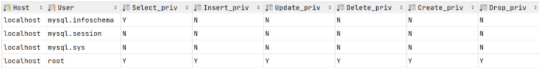

**含义解析：**

- Host：代表当前用户访问的主机, 如果为localhost, 仅代表只能够在当前本机访问，是不可以 远程访问的。 
- User：代表的是访问该数据库的用户名。

#### 使用示例

- 在MySQL中需要通过用户名@主机名的方式，来唯一标识一个用户  
- 主机名可以使用 % 通配 
- 多个权限之间，使用逗号分隔  
- 授权时， 数据库名和表名可以使用 * 进行通配，代表所有

~~~sql
-- 创建用户
CREATE USER '用户名'@'主机名' IDENTIFIED BY '密码';

create user 'zhanglinwei'@'localhost' identified by '123456';

create user 'linwei'@'%' identified by '123456';

-- 修改用户密码
ALTER USER '用户名'@'主机名' IDENTIFIED WITH mysql_native_password BY '新密码' ;

alter user 'linwei'@'%' identified with mysql_native_password by '1234';

-- 删除用户
DROP USER '用户名'@'主机名' ;

drop user 'zhanglinwei'@'localhost';

-- 查询权限
SHOW GRANTS FOR '用户名'@'主机名' ;

show grants for 'linwei'@'%';

-- 授予权限
GRANT 权限列表 ON 数据库名.表名 TO '用户名'@'主机名';

grant all on ilovemysql.* to 'linwei'@'%';

-- 撤销权限
REVOKE 权限列表 ON 数据库名.表名 FROM '用户名'@'主机名';

revoke all on ilovemysql.* from 'linwei'@'%';

~~~

### DDL(Data Definition Language)

数据定义语言，用来定义数据库对象(数据库，表，字段) 。 

用于创建或修改数据库、表、表结构

#### 数据库操作

~~~sql
-- 查询所有数据库
show databases;

-- 查询当前数据库
select database();

-- 创建数据库 方式一
create database [ if not exists ] 数据库名 [ default charset 字符集 ] [ collate 排序规则 ];

create database ilovemysql;

create database if not exists ilovemysql; -- ilovemysql不存在就创建，存在不创建

create database ilikemysql default charset utf8mb4; -- 指定字符集

-- 创建数据库 方式二
create schema 数据库名;

create schema db01;


-- 删除数据库
drop database [ if exists ] 数据库名;

drop database ilovemysql;

drop database if exists ilovemysql; -- 若存在 itcast 数据库，就删除

-- 切换数据库
use 数据库名;

use ilikemysql;
~~~

#### 表操作

```sql
-- 查询当前数据库所有表
show tables;

-- 查看指定表结构
-- 通过这条指令，我们可以查看到指定表的字段，字段的类型、是否可以为NULL，是否存在默认值等信息
desc 表名;

--  查询指定表的建表语句
show create table 表名;

-- 创建表结构
CREATE TABLE 表名(
	字段1 字段1类型 [ COMMENT 字段1注释 ],
	字段2 字段2类型 [COMMENT 字段2注释 ],
	字段3 字段3类型 [COMMENT 字段3注释 ],
	......
	字段n 字段n类型 [COMMENT 字段n注释 ]
) [ COMMENT 表注释 ];

--  添加字段
ALTER TABLE 表面 ADD 字段名 类型(长度) [ COMMENT 注释 ] [ 约束 ];

ALTER TABLE emp ADD nickname varchar(20) COMMENT '昵称';

-- 修改数据类型
ALTER TABLE 表名 MODIFY 字段名 新数据类型(长度);

-- 修改字段名和字段类型
ALTER TABLE 表名 CHANGE 旧字段名 新字段名 类型(长度) [ COMMENT 注释 ] [ 约束 ];

ALTER TABLE emp CHANGE nickname username varchar(30) COMMENT '昵称';

-- 删除字段
ALTER TABLE 表名 DROP 字段名;

ALTER TABLE emp DROP username;

-- 修改表名
ALTER TABLE 表名 RENAME TO 新表名;

ALTER TABLE emp RENAME TO employee;

-- 删除表
DROP TABLE [ IF EXISTS ] 表名;

DROP TABLE IF EXISTS tb_user;

--  删除指定表, 并重新创建表 （在删除表时，数据也会被删除）
TRUNCATE TABLE 表名;

```

### DML（Data Manipulation Language）

数据操作语言，用来对数据库中表的数据记录进 行增、删、改操作

#### insert 添加

-  插入数据时，指定的字段顺序需要与值的顺序是一一对应的。  
-  字符串和日期型数据应该包含在引号中。  
-  插入的数据大小，应该在字段的规定范围内。  

~~~sql
--  给指定字段添加数据
INSERT INTO 表名 (字段名1, 字段名2, ...) VALUES (值1, 值2, ...);

insert into employee(id,workno,name,gender,age,idcard,entrydate)
values(1,'1','Itcast','男',10,'123456789012345678','2000-01-01');

-- 给全部字段添加数据
INSERT INTO 表名 VALUES (值1, 值2, ...);

insert into employee values(2,'2','张无忌','男',18,'123456789012345670','2005-01-01');

-- 批量添加数据
INSERT INTO 表名 (字段名1, 字段名2, ...) VALUES (值1, 值2, ...), (值1, 值2, ...), (值
1, 值2, ...) ;
INSERT INTO 表名 VALUES (值1, 值2, ...), (值1, 值2, ...), (值1, 值2, ...) ;

insert into employee values(3,'3','韦一笑','男',38,'123456789012345670','2005-01-
01'),(4,'4','赵敏','女',18,'123456789012345670','2005-01-01');
~~~

#### update 修改

修改语句的条件可以有，也可以没有，如果没有条件，则会修改整张表的所有数据。  

~~~sql
UPDATE 表名 SET 字段名1 = 值1 , 字段名2 = 值2 , .... [ WHERE 条件 ] ;

update employee set name = 'itheima' where id = 1;

update employee set name = '小昭' , gender = '女' where id = 1;

update employee set entrydate = '2008-01-01';
~~~

#### delete 删除

-  DELETE 语句的条件可以有，也可以没有，如果没有条件，则会删除整张表的所有数据。  
-  DELETE 语句不能删除某一个字段的值(可以使用UPDATE，将该字段值置为NULL即 可)。  

~~~sql
DELETE FROM 表名 [ WHERE 条件 ] ;

delete from employee where gender = '女';

delete from employee;
~~~

### DQL（Data QueryLanguage）

数据查询语言，用来查询数据库中表的记录。  

#### 语法结构

~~~sql
SELECT
	字段列表
FROM
	表名列表
WHERE
	条件列表
GROUP BY
	分组字段列表
HAVING
	分组后条件列表
ORDER BY
	排序字段列表
LIMIT
	分页参数

-- 语句执行顺序
FROM
	表名列表
WHERE
	条件列表
GROUP BY
	分组字段列表
HAVING
	分组后条件列表
SELECT
	字段列表
ORDER BY
	排序字段列表
LIMIT
	分页参数
~~~

#### 使用示例

##### 基本查询

~~~sql
-- 查询多个字段
SELECT 字段1, 字段2, 字段3 ... FROM 表名 ; -- 查询指定字段
SELECT * FROM 表名 ; -- 查询全部字段(少用 * ，不直观，影响效率)

select name,workno,age from emp;
select * from emp;

-- 字段设置别名
SELECT 字段1 [ AS 别名1 ] , 字段2 [ AS 别名2 ] ... FROM 表名;
SELECT 字段1 [ 别名1 ] , 字段2 [ 别名2 ] ... FROM 表名;

select workaddress as '工作地址' from emp;
select workaddress '工作地址' from emp; -- as 可以省略

-- 去除重复记录
SELECT DISTINCT 字段列表 FROM 表名; -- DISTINCT 为去重

select distinct workaddress '工作地址' from emp;
~~~

##### where 条件查询

~~~sql
-- 根据 where 条件查询
SELECT 字段列表 FROM 表名 WHERE 条件列表 ;

select * from emp where age = 88;
select * from emp where age < 20;
select * from emp where age <= 20;

select * from emp where idcard is null;
select * from emp where idcard is not null;

select * from emp where age != 88;
select * from emp where age <> 88;

select * from emp where age >= 15 && age <= 20;
select * from emp where age >= 15 and age <= 20;
select * from emp where age between 15 and 20;

select * from emp where gender = '女' and age < 25;
select * from emp where age = 18 or age = 20 or age =40;

select * from emp where age in(18,20,40);
select * from emp where age not in(18,20,40);

select * from emp where name like '__'; -- _表示匹配一个任意字符
select * from emp where idcard like '%X'; -- %表示匹配多个任意字符
~~~

##### 使用函数

NULL值是不参与所有聚合函数运算的。

~~~ sql
-- 聚合函数
SELECT 聚合函数(字段列表) FROM 表名 ;

select count(*) from emp; -- 统计的是总记录数
select count(idcard) from emp; -- 统计的是idcard字段不为null的记录数

select avg(age) from emp; -- 统计该企业员工的平均年龄

select max(age) from emp; -- 统计该企业员工的最大年龄

select min(age) from emp; -- 统计该企业员工的最小年龄

select sum(age) from emp where workaddress = '西安'; -- 统计西安地区员工的年龄之和

-- 字符串函数
-- 企业员工的工号，统一为5位数，目前不足5位数的全部在前面补0。比如： 1号员工的工号应该为00001。

update emp set workno = lpad(workno, 5, '0');

-- 数值函数
-- 通过数据库的函数，生成一个六位数的随机验证码。
select lpad(round(rand()*1000000 , 0), 6, '0');
 
-- 日期函数 
select date_add(now(), INTERVAL 70 YEAR );

-- 流程函数
-- 查询emp表的员工姓名和工作地址 (北京/上海 ----> 一线城市 , 其他 ----> 二线城市)
select name,
( case workaddress when '北京' then '一线城市' when '上海' then '一线城市' else
'二线城市' end ) as '工作地址' from emp;
~~~

##### group 分组查询

分组之后，查询的字段一般为聚合函数和分组字段，查询其他字段无任何意义。  

**执行顺序:** where > 聚合函数 > having 。  

支持多字段分组, 具体语法为 : `group by columnA,columnB`  

**where与having区别**
**1、执行时机不同：**

- where是分组之前进行过滤，不满足where条件，不参与分组；
- 而having是分组之后对结果进行过滤。

**2、判断条件不同：**

- where不能对聚合函数进行判断，而having可以。 

~~~sql
-- ASC : 升序(默认值)  DESC: 降序
SELECT 字段列表 FROM 表名 ORDER BY 字段1 排序方式1 , 字段2 排序方式2 ;

select * from emp order by age asc;
select * from emp order by age;

select * from emp order by entrydate desc;
select * from emp order by age asc , entrydate desc;
~~~

- **如果是升序, 可以不指定排序方式ASC  **
- **如果是多字段排序，当第一个字段值相同时，才会根据第二个字段进行排序  **

##### 分页查询

-  **起始索引从0开始，起始索引 = （查询页码 - 1）* 每页显示记录数**
-  **分页查询是数据库的方言，不同的数据库有不同的实现，MySQL中是LIMIT**
-  **如果查询的是第一页数据，起始索引可以省略，直接简写为 limit 10  **

~~~sql
SELECT 字段列表 FROM 表名 LIMIT 起始索引, 查询记录数 ;

select * from emp limit 0,10;
select * from emp limit 10;

--  查询第2页员工数据, 每页展示10条记录
select * from emp limit 10,10;
~~~

## 二、MySQL的数据类型

 主要分为三类：数值类型、字符串类型、日期时间类型

### 数值类型

| **类型**                             | **大小**          | **有符号范围SIGNED**                                   | **无符号范围UNSIGNED**                                     | **描述**              |
| ------------------------------------ | ----------------- | ------------------------------------------------------ | ---------------------------------------------------------- | --------------------- |
| TINYINT                              | 1byte             | (-128，127)                                            | (0，255)                                                   | 小整 数值             |
| SMALLINT                             | 2bytes            | (-32768，32767)                                        | (0，65535)                                                 | 大整 数值             |
| MEDIUMINT                            | 3bytes            | (-8388608，8388607)                                    | (0，16777215)                                              | 大整 数值             |
| INT/INTEGER                          | 4bytes            | (-2147483648， 2147483647)                             | (0，4294967295)                                            | 大整 数值             |
| BIGINT                               | 8bytes            | (-2^63，2^63-1)                                        | (0，2^64-1)                                                | 极大 整数 值          |
| FLOAT                                | 4bytes            | (-3.402823466 E+38， 3.402823466351 E+38)              | 0 和                                                       |                       |
| (1.175494351 E-38，3.402823466 E+38) | 单精 度浮 点数 值 |                                                        |                                                            |                       |
| DOUBLE                               | 8bytes            | (-1.7976931348623157 E+308， 1.7976931348623157 E+308) | 0 和 (2.2250738585072014 E-308， 1.7976931348623157 E+308) | 双精 度浮 点数 值     |
| DECIMAL                              |                   | 依赖于M(精度)和D(标度) 的值                            | 依赖于M(精度)和D(标度)的 值                                | 小数 值(精 确定 点数) |

### 字符串类型

-  char 相对 varchar char的性能会更高些
-  varchar 后面的数字表示长度
-  int 后面的数字表示位数，不够则补0，需要配合 zerofill 使用

| **类型**   | **大小**              | **描述**                     |
| ---------- | --------------------- | ---------------------------- |
| CHAR       | 0-255 bytes           | 定长字符串(需要指定长度)     |
| VARCHAR    | 0-65535 bytes         | 变长字符串(需要指定长度)     |
| TINYBLOB   | 0-255 bytes           | 不超过255个字符的二进制数据  |
| TINYTEXT   | 0-255 bytes           | 短文本字符串                 |
| BLOB       | 0-65 535 bytes        | 二进制形式的长文本数据       |
| TEXT       | 0-65 535 bytes        | 长文本数据                   |
| MEDIUMBLOB | 0-16 777 215 bytes    | 二进制形式的中等长度文本数据 |
| MEDIUMTEXT | 0-16 777 215 bytes    | 中等长度文本数据             |
| LONGBLOB   | 0-4 294 967 295 bytes | 二进制形式的极大文本数据     |
| LONGTEXT   | 0-4 294 967 295 bytes | 极大文本数据                 |

### 日期时间类型

| **类型**  | **大小** | **范围**                                   | **格式**            | **描述**                  |
| --------- | -------- | ------------------------------------------ | ------------------- | ------------------------- |
| DATE      | 3        | 1000-01-01 至 9999-12-31                   | YYYY-MM-DD          | 日期值                    |
| TIME      | 3        | -838:59:59 至 838:59:59                    | HH:MM:SS            | 时间值或持续 时间         |
| YEAR      | 1        | 1901 至 2155                               | YYYY                | 年份值                    |
| DATETIME  | 8        | 1000-01-01 00:00:00 至 9999-12-31 23:59:59 | YYYY-MM-DD HH:MM:SS | 混合日期和时 间值         |
| TIMESTAMP | 4        | 1970-01-01 00:00:01 至 2038-01-19 03:14:07 | YYYY-MM-DD HH:MM:SS | 混合日期和时 间值，时间戳 |

## 三、MySQL运算符

### 比较运算符

| **比较运算符**      | **功能**                                       |
| ------------------- | ---------------------------------------------- |
| >                   | 大于                                           |
| >=                  | 大于等于                                       |
| <                   | 小于                                           |
| <=                  | 小于等于                                       |
| =                   | 等于                                           |
| <> 或 !=            | 不等于                                         |
| BETWEEN ... AND ... | 在某个范围之内（含最小、最大值）               |
| IN( ... )           | 在 in 之后的列表中的值，多选一                 |
| LIKE 占位符         | 模糊匹配（ _ 匹配单个字符， % 匹配任意个字符） |
| IS NULL             | 是 NULL                                        |
| NOT IN              | 不在指定的集合范围之内                         |
| ANY                 | 子查询返回列表中，有任意一个满足即可           |
| SOME                | 与ANY等同，使用SOME的地方都可以使用ANY         |
| ALL                 | 子查询返回列表的所有值都必须满足               |

### 逻辑运算符

| **逻辑运算符**      | **功能**                     |
| ------------------- | ---------------------------- |
| AND 或 &&           | 并且（多个条件同时成立）     |
| OR 或 &#124; &#124; | 或者（多个条件任意一个成立） |
| NOT 或 !            | 非，不是                     |

## 四、常见的聚合函数

| **函数** | **功能** |
| -------- | -------- |
| count    | 统计数量 |
| max      | 最大值   |
| min      | 最小值   |
| avg      | 平均值   |
| sum      | 求和     |

### 常见的字符串函数

| **函数**                 | **功能**                                                   |
| ------------------------ | ---------------------------------------------------------- |
| CONCAT(S1,S2,...Sn)      | 字符串拼接，将S1，S2，... Sn拼接成一个字符串               |
| LOWER(str)               | 将字符串str全部转为小写                                    |
| UPPER(str)               | 将字符串str全部转为大写                                    |
| LPAD(str,n,pad)          | 左填充，用字符串pad对str的左边进行填充，达到n个字符 串长度 |
| RPAD(str,n,pad)          | 右填充，用字符串pad对str的右边进行填充，达到n个字符 串长度 |
| TRIM(str)                | 去掉字符串头部和尾部的空格                                 |
| SUBSTRING(str,start,len) | 返回从字符串str从start位置起的len个长度的字符串            |

### 常见的数值函数

| **函数**   | **功能**                           |
| ---------- | ---------------------------------- |
| CEIL(x)    | 向上取整                           |
| FLOOR(x)   | 向下取整                           |
| MOD(x,y)   | 返回x/y的模                        |
| RAND( )    | 返回0~1内的随机数                  |
| ROUND(x,y) | 求参数x的四舍五入的值，保留y位小数 |

### 常见的日期函数

| **函数**                           | **功能**                                             |
| ---------------------------------- | ---------------------------------------------------- |
| CURDATE( )                         | 返回当前日期                                         |
| CURTIME( )                         | 返回当前时间                                         |
| NOW( )                             | 返回当前日期和时间                                   |
| YEAR(date)                         | 获取指定date的年份                                   |
| MONTH(date)                        | 获取指定date的月份                                   |
| DAY(date)                          | 获取指定date的日期                                   |
| DATE_ADD(date, INTERVAL expr type) | 返回一个日期/时间值加上一个时间间隔expr后，的 时间值 |
| DATEDIFF(date1,date2)              | 返回起始时间date1 和 结束时间date2之间的天 数        |

### 常见的流程函数

流程函数也是很常用的一类函数，可以在SQL语句中实现条件筛选，从而提高语句的效率  

| **函数**                                                     | **功能**                                                   |
| ------------------------------------------------------------ | ---------------------------------------------------------- |
| IF(value , t , f)                                            | 如果value为true，则返回t，否则返回 f                       |
| IFNULL(value1 , value2)                                      | 如果value1不为空，返回value1，否则 返回value2              |
| CASE WHEN [ val1 ] THEN [res1] ... ELSE [ default ] END      | 如果val1为true，返回res1，... 否 则返回default默认值       |
| CASE [ expr ] WHEN [ val1 ] THEN [res1] ... ELSE [ default ] END | 如果expr的值等于val1，返回 res1，... 否则返回default默认值 |

## 五、MySQL约束

**概念：** 约束是作用于表中字段上的规则，用于限制存储在表中的数据。

**目的：** 保证数据库中数据的正确、有效性和完整性。  

| **约束**                  | **描述**                                                    | **关键字**  |
| ------------------------- | ----------------------------------------------------------- | ----------- |
| 非空约束                  | 限制该字段的数据不能为null                                  | NOT NULL    |
| 唯一约束                  | 保证该字段的所有数据都是唯一、不重复的                      | UNIQUE      |
| 主键约束                  | 主键是一行数据的唯一标识，要求非空且唯一                    | PRIMARY KEY |
| 默认约束                  | 保存数据时，如果未指定该字段的值，则采用默认值              | DEFAULT     |
| 检查约束(8.0.16版本 之后) | 保证字段值满足某一个条件                                    | CHECK       |
| 外键约束                  | 用来让两张表的数据之间建立连接，保证数据的一致 性和完整  性 | FOREIGN KEY |

 **注意：约束是作用于表中字段上的，可以在创建表/修改表的时候添加约束。**

~~~sql
CREATE TABLE tb_user(
	id int AUTO_INCREMENT PRIMARY KEY COMMENT 'ID唯一标识',
	name varchar(10) NOT NULL UNIQUE COMMENT '姓名' ,
	age int check (age > 0 && age <= 120) COMMENT '年龄' ,
	status char(1) default '1' COMMENT '状态',
	gender char(1) COMMENT '性别'
);
~~~

## 六、MySQL常用权限

只是简单罗列了常见的几种权限描述，其他权限描述及含义，可以直接参考[官方文档](https://dev.mysql.com/doc/refman/8.0/en/privileges-provided.html)。  

| **权限**            | **说明**                 |
| ------------------- | ------------------------ |
| ALL, ALL PRIVILEGES | 所有权限                 |
| SELECT              | 查询数据权限             |
| INSERT              | 插入数据权限             |
| UPDATE              | 修改数据权限             |
| DELETE              | 删除数据权限             |
| ALTER               | 修改表权限               |
| DROP                | 删除数据库、表、视图权限 |
| CREATE              | 创建数据库、表权限       |


## 七、多表查询

内容包含：连接查询、联合查询、子查询


 各个表之间的联系，基本上分为三种： 

- 一对多(多对一) 
- 多对多 
- 一对一  

### 连接查询

- **内连接：** 相当于查询A、B交集部分数据  
- **左外连接：** 查询左表所有数据，以及两张表交集部分数据  
- **右外连接：** 查询右表所有数据，以及两张表交集部分数据  
- **自连接：** 当前表与自身的连接查询，自连接必须使用表别名  

#### 内连接

内连接的语法分为两种: 

- 隐式内连接
- 显式内连接

内连接查询的是两张表交集部分的数 据。(也就是绿色部分的数据)  


##### 1). 隐式内连接  

~~~sql
SELECT 字段列表 FROM 表1 , 表2 WHERE 条件 ... ;

-- 查询每一个员工的姓名 , 及关联的部门的名称
select e.name,d.name from emp e , dept d where e.dept_id = d.id;
~~~

##### 2). 显式内连接  

~~~sql
SELECT 字段列表 FROM 表1 [ INNER ] JOIN 表2 ON 连接条件 ... ;

-- 查询每一个员工的姓名 , 及关联的部门的名称
select e.name, d.name from emp e join dept d on e.dept_id = d.id;
~~~

#### 外连接

 外连接分为两种：

- 左外连接： 左外连接相当于查询表1(左表)的所有数据，当然也包含表1和表2交集部分的数据
- 右外连接：右外连接相当于查询表2(右表)的所有数据，当然也包含表1和表2交集部分的数据。  

##### 1). 左外连接 

 左外连接相当于查询表1(左表)的所有数据，当然也包含表1和表2交集部分的数据

~~~sql
SELECT 字段列表 FROM 表1 LEFT [ OUTER ] JOIN 表2 ON 条件 ... ;

-- 查询emp表的所有数据, 和对应的部门信息
select e.*, d.name from emp e left join dept d on e.dept_id = d.id;
~~~

##### 2). 右外连接

右外连接相当于查询表2(右表)的所有数据，当然也包含表1和表2交集部分的数据。  

~~~sql
SELECT 字段列表 FROM 表1 RIGHT [ OUTER ] JOIN 表2 ON 条件 ... ;

-- 查询dept表的所有数据, 和对应的员工信息
select d.*, e.* from dept d left outer join emp e on e.dept_id = d.id;
~~~

#### 自连接

自连接查询，顾名思义，就是自己连接自己，也就是把一张表连接查询多次  
而对于自连接查询，可以是内连接查询，也可以是外连接查询。  

~~~sql
SELECT 字段列表 FROM 表A 别名A JOIN 表A 别名B ON 条件 ... ;

--  查询员工 及其 所属领导的名字
select a.name , b.name from emp a , emp b where a.managerid = b.id;

-- 查询所有员工 emp 及其领导的名字 emp , 如果员工没有领导, 也需要查询出来
select a.name '员工', b.name '领导' from emp a left join emp b on a.managerid = b.id;
~~~

### 联合查询

 对于union查询，就是把多次查询的结果合并起来，形成一个新的查询结果集  

- 联合查询的多张表的列数必须保持一致，字段类型也需要保持一致
- `union all` 会将全部的数据直接合并在一起，`union` 会对合并之后的数据去重

```sql
SELECT 字段列表 FROM 表A ...
UNION [ ALL ]
SELECT 字段列表 FROM 表B ....;

select * from emp where salary < 5000
union all
select * from emp where age > 50;

```

### 子查询

 SQL语句中嵌套SELECT语句，称为嵌套查询，又称子查询

 子查询外部的语句可以是`INSERT` / `UPDATE` / `DELETE` / `SELECT` 的任何一个  

根据子查询结果不同，分为： 

- 标量子查询（子查询结果为单个值），常用的操作符：=、<>、>、>=、<、<=
- 列子查询(子查询结果为一列) ，常用的操作符：IN 、NOT IN 、 ANY 、SOME 、 ALL  
- 行子查询(子查询结果为一行)  ，= 、<> 、IN 、NOT IN  
- 表子查询(子查询结果为多行多列)，IN 

~~~sql
SELECT * FROM t1 WHERE column1 = ( SELECT column1 FROM t2 );

-- 标量子查询
-- 根据 "销售部" 部门ID, 查询员工信息
select * from emp where dept_id = (select id from dept where name = '销售部');

--  查询在 "方东白" 入职之后的员工信息
select * from emp where entrydate > (select entrydate from emp where name = '方东白');


-- 列子查询
-- 查询 "销售部" 和 "市场部" 的所有员工信息
select * from emp where dept_id in (select id from dept where name = '销售部' or name = '市场部');

-- 查询比 财务部 所有人工资都高的员工信息
select * from emp where salary > all ( select salary from emp where dept_id =
(select id from dept where name = '财务部') );

-- 查询比研发部其中任意一人工资高的员工信息
select * from emp where salary > any ( select salary from emp where dept_id =
(select id from dept where name = '研发部') );


-- 行子查询
--  查询与 "张无忌" 的薪资及直属领导相同的员工信息
select * from emp where (salary,managerid) = (select salary, managerid from emp
where name = '张无忌');


-- 表子查询
 -- 查询与 "鹿杖客" , "宋远桥" 的职位和薪资相同的员工信息
select * from emp where (job,salary) in ( select job, salary from emp where name =
'鹿杖客' or name = '宋远桥' );

--  查询入职日期是 "2006-01-01" 之后的员工信息 , 及其部门信息
select e.*, d.* from (select * from emp where entrydate > '2006-01-01') e left
join dept d on e.dept_id = d.id ;
~~~


## 八、存储引擎

存储引擎就是存储数据、建立索引、更新/查询数据等技术的实现方式 。

- 存储引擎是基于表的 
- MySQL默认存储引擎为： InnoDB
- 常用存储引擎： InnoDB、MyISAM

`MySQL`是一款支持拔插式引擎的数据库，在开发过程中你可以根据业务特性，从支持的诸多引擎中选择一款适合的


~~~sql
-- 建表时指定存储引擎
CREATE TABLE 表名(
	字段1 字段1类型 [ COMMENT 字段1注释 ] ,
	......
	字段n 字段n类型 [COMMENT 字段n注释 ]
) ENGINE = INNODB [ COMMENT 表注释 ] ;

-- 查询当前数据库支持的存储引擎
show engines;

-- 批量修改一个库所有表的存储引擎命令
mysql_convert_table_fromat --user=user_name --password=user_pwd --engine=MyISAM database_name;
~~~


### InnoDB VS MyISAM

#### 磁盘文件对比


其中使用`MyISAM`引擎的表：`zz_myisam_index`，会在本地生成三个磁盘文件

- `zz_myisam_index.frm`：该文件中存储表的结构信息。
- `zz_myisam_index.MYD`：该文件中存储表的行数据。
- `zz_myisam_index.MYI`：该文件中存储表的索引数据。

> `MyISAM`引擎的表数据和索引数据，会分别放在两个不同的文件中存储

使用`InnoDB`引擎的表：`zz_innodb_index`，在磁盘中仅有两个文件

- `zz_innodb_index.frm`：该文件中存储表的结构信息。
- `zz_innodb_index.ibd`：该文件中存储表的行数据和索引数据。

> `InnoDB `引擎的表数据和索引数据，会分放在一个文件中存储


#### 索引支持对比

**`InnoDB`支持聚簇索引、`MyISAM`不支持聚簇索引**

因为`MyISAM`引擎，会将表分为`.frm、.MYD、.MYI`三个文件放在磁盘存储，表数据和索引数据是分别放在`.MYD、.MYI`文件中，所以注定了`MyISAM`引擎只支持**非聚簇索引**。

而`InnoDB`引擎的表数据、索引数据都放在`.ibd`文件中存储，因此`InnoDB`是支持**聚簇索引**的。

> 聚簇索引的要求是：索引键和行数据必须在物理空间上也是连续的，而`MyISAM`表数据和索引数据，分别位于两个磁盘文件中，这也就注定了它无法满足聚簇索引的要求。
>
> 不支持聚簇索引也有好处，也就是无论走任何索引，都只需要一遍查询即可获得数据，而`InnoDB`引擎的表中，如果不走聚簇（主键）索引查询数据，走其他索引的情况下，都需要经过两遍（回表）查询才能获得数据


#### 事务机制对比

**`InnoDB`支持事务、`MyISAM`不支持事务**

因为`InnoDB`引擎中有两个自己专享的日志，即`undo log`、`redo log``

``InnoDB`在`MySQL`启动后，会在内存中构建一个`undo_log_buffer`缓冲区，同时在磁盘中也有相应的`undo-log`日志文件

所以使用`InnoDB`存储引擎的表，可以借助`undo-log`日志实现事务机制，支持多条`SQL`组成一个事务，可以保证发生异常的情况下，组成这个事务的`SQL`到底回滚还是提交


而`MyISAM`并未设计类似的技术，在启动时不会在内存中构建`undo_log_buffer`缓冲区，磁盘中也没有相应的日志文件，因此`MyISAM`并不支持事务机制

> 关于 `undo log`、`redo log` 和事务原理，在前面的事务篇说过


#### 故障恢复的对比

**`MyISAM`并没有`InnoDB`引擎可靠**

`InnoDB`在启动时，同样会在内存中构建一个`redo_log_buffer`缓冲区，在磁盘中也会有相应的`redo-log`日志文件

`InnoDB`引擎由于`redo-log`日志的存在，因此只要事务提交，无论是机器断电、程序宕机等各种灾难情况，都可以用`redo-log`日志来恢复数据

但`MyISAM`引擎同样没有`redo-log`日志，所以并不支持数据的故障恢复，所以丢了也就无法找回。


#### 锁粒度对比

**`MyISAM`仅支持表锁，而`InnoDB`同时支持表锁、行锁**

`MyISAM`由于不支持聚簇索引，所以无法实现行锁，光说没用，上例子


上述这张表中，假设使用的是`MyISAM`引擎，同时对`student_id`字段建立了主键索引，`name`字段建立了普通索引，`sex、height`字段建立了联合索引

> 这张表中存在三个索引，那在本地的`.MYI`索引文件中，肯定存在三颗`B+`树，同时由于`MyISAM`不支持聚簇索引，所以这三个索引是平级的，每棵`B+`树的索引键，都直接指向`.MYD`数据文件中的行数据地址。

假设`MyISAM`要实现行锁，当要对一行数据加锁时，可以锁定一棵树中某一个数据，但无法锁定其他树的行数据

因为`MySQL`是对索引加锁，当基于不同索引查询数据时，就可能会导致一行数据上加多个锁！

这样又会导致多条线程同时操作一个数据，所以又会因为多线程并发执行的原因，造成脏读、幻读、不可重复读这系列问题出现


但`InnoDB`引擎，因为支持聚簇索引，所以`InnoDB`表中的索引，是有主次之分的，所有的次级索引（二级索引），其索引值都存储聚簇索引的索引键，因此想要对一行数据加锁时，只需要锁定聚簇索引的数据即可。

> 表中就算没有显式定义主键，内部依旧会用一个隐藏列来作为聚簇索引的索引字段

~~~sql
-- 通过主键索引查询数据
select * from zz_students where student_id = 1 for update;
-- 通过普通索引查询数据
select * from zz_students where name = "竹子" for update;
~~~

当通过主键索引查询的`SQL`语句，会直接定位到聚簇索引的数据，然后对`ID=1`的数据加锁。

而第二条通过普通索引查询数据的`SQL`语句，经过查询后会得到一个值：`ID=1`，然后会拿着这个`ID=1`的值再去回表，在聚簇索引中再次查询`ID=1`的数据，找到之后发现上面已经有线程加锁了，当前线程就会阻塞等待上一个线程释放锁。


#### 并发性能对比

`MyISAM`不如`InnoDB`的并发性能

因为`MyISAM`仅支持表锁，且不支持聚簇索引，所以当出现多条线程同时读写数据时，只能锁住整张表


而`InnoDB`同时支持表锁、行锁，并支持聚簇索引，每个索引最终都会指向聚簇索引中的索引键，因此出现并发事务时，`InnoDB`只需要锁住聚簇索引的数据即可，而不需要锁住整张表，因此并发性能更高。

> `InnoDB`为了提升读-写并存场景下的并发度，又基于`undo-log`版本链+事务快照，又推出了`MVCC`多版本并发控制技术，因此对于读-写共存的场景支持并发执行。


#### 内存利用度对比

`InnoDB`不像`Memory`引擎那样完全基于内存运行，但它将所有能够在内存完成的操作，全部都放在了内存中完成，无论是读写数据、维护索引结构也好，记录日志也罢，各类操作全部都在内存完成。

`InnoDB`引擎，通过缓冲池结合异步`IO`技术，活生生将一款基于磁盘的引擎，演变成了半内存式的引擎。

反观`MyISAM`引擎，内部虽然也有缓冲池以及异步`IO`技术，但对内存的开发度远不足于`InnoDB`引擎，运行期间大量操作依旧会走磁盘完成。

> 详细内容可以看 MySQL内存篇


#### 总结

**这也是为什么 `InnoDB`引擎能取代`MyISAM`引擎的原因**

①存储方式：

- `MyISAM`引擎会将表数据和索引数据分成两个文件存储
- `InnoDB`引擎将表数据和索引数据在一个文件中存储

②索引支持：

- `MyISAM`引擎的表数据和索引数据是分开的，因此不支持聚簇索引。
- `InnoDB`引擎的表数据和索引数据是在一起的，因此支持聚簇索引

③事务支持：

- `MyISAM`引擎没有`undo log`日志，所以不支持多条`SQL`组成事务并回滚。
- `InnoDB`引擎存在`undo log`日志，所以支持事务

④故障恢复：

- `MyISAM`引擎依靠`bin-log`日志实现，`bin-log`中未写入的数据会永久丢失。
- `InnoDB`引擎依靠`redo log`日志实现，数据会先写入`redo log`在写入缓冲区

⑤锁粒度支持：

- `MyISAM`不支持聚簇索引，因此无法实现行锁，所有并发操作只能加表锁。
- `InnoDB`引擎支持聚簇索引，所有并发操作只需加行锁

⑥并发性能：

- `MyISAM`引擎仅支持表锁，所以多条线程出现读-写并发场景时会阻塞。
- `InnoDB`支持表锁、行锁，不需要锁住整张表，因此并发性能更高。

⑦内存利用度：

- `MyISAM`引擎过于依赖`MySQL Server`，对缓冲池、异步`IO`技术开发度不够。
- `InnoDB`引擎将所有能够在内存完成的操作，全部都放在了内存中完成（读写数据、维护索引结构也好，记录日志）等


### MyISAM引擎的优势

前面几乎都在说`InnoDB`引擎的好，现在来看看`MyISAM`引擎有哪些优势


#### 统计总数的优化

`MyISAM`引擎中会记录表的行数，也就是当执行`count()`时，如果表是`MyISAM`引擎，则可以直接获取之前统计的值并返回

`InnoDB`会一行行的去统计表的行数

> 但是如果后面跟了`where`条件，那`InnoDB、MyISAM`的工作模式是相同的，先根据`where`后的条件查询数据，再一行行统计总数


#### 删除数据/表的优化

当使用`delete`命令清空表数据时

~~~sql
delete from `table_name`;
~~~

`MyISAM`会直接重新创建表数据文件

`InnoDB`则是一行行删除数据

> `MyISAM`引擎的表，对于`delete`过的数据不会立即删除，而且先隐藏起来，后续定时删除或手动删除
>
> ~~~sql
> -- 手动强制清理命令
> optimize table `table_name`;
> ~~~

这样做的好处，就是当你误删一张表的大量数据时，只要你手速够快，手动将本地的`.MYD、.MYI`文件拷贝出去，就可以直接基于这两个数据文件恢复数据，而不需要通过日志或第三方工具修复数据。


#### CRUD速度更快

`InnoDB`引擎当查询数据时，如果在基于非聚簇索引查找数据，就算查到了也需要经过一次回表才能得到数据，同时插入数据、修改数据时，都需要维护聚簇索引和非聚簇索引之间的关系

所以`InnoDB`的聚簇索引，会影响读写数据的性能


`MyISAM`引擎中，所有已创建的索引都是非聚簇索引，每个索引之间都是独立的，在索引中存储的是直接指向行数据的地址，而并非聚簇索引的索引键，因此无论走任何索引，都仅需一次即可获得数据，无需做回表查询

同时写数据时，也不需要维护不同索引之间的关系，毕竟每个索引都是独立的


### MyISAM真的比InnoDB快吗

如果是对比单个客户端连接的读写性能，那自然`MyISAM`远超于`InnoDB`引擎，毕竟`InnoDB`需要维护聚簇索引


随着连接数的增加`MyISAM`的读写性能就远不如`InnoDB`，这是由于**锁机制导致的**

`MyISAM`引擎仅支持表锁，也就意味着无论有多少个客户端连接到来，对于同一张表永远只能允许一条线程操作，除非多个连接都是在读数据，才不会相互排斥。

`InnoDB`引擎，由于支持行锁，所以并发冲突很小，在高并发、多连接的场景中，性能会更加出色


### MyISAM引擎的适用场景

`MySQL`利用主从架构，实现读写分离时的场景，一般从库会承载`select`请求，而主库会承载`insert/update/delete`请求。

读写分离的场景中，从库的表结构可以改为`MyISAM`引擎，因为基于`MyISAM`的索引查询数据，不需要经过回表查询，速度更快！

> 同时，由于做了读写分离，因此从库上只会有读请求，不会存在任何外部的写请求，所以支持并发读取。
>
> 而且从库的数据是由后台线程来从主库复制的，因此从库在写入数据时，只会有少数几条线程执行写入工作，因而造成的冲突不会太大，不会由于表锁引起大量阻塞。

## 九、索引

索引（index）是帮助`MySQL`高效获取数据的数据结构 (有序) 

**为什么使用索引快？**

索引就相当于一本书的目录

试想一本书如果没有目录的话，你想找一篇文章是不是就只能从头到尾一页页找了？（全表扫描）

而有索引的话，想找什么内容就可以通过目录定位文章所在页数


**索引特点**

- **优点**
  - **提高数据检索的效率，降低数据库 的IO成本**
  - **通过索引列对数据进行排序，降低 数据排序的成本，降低CPU的消 耗**
- **缺点**
  - **索引列也是要占用空间的**
  - **索引大大提高了查询效率，同时却也降低更新表的速度， 如对表进行INSERT、UPDATE、DELETE时，效率降低。  因为需要维护索引**

~~~SQL
--  创建索引
CREATE [ UNIQUE | FULLTEXT ] INDEX 索引名 ON 表名 (列名,... ) ;

CREATE INDEX idx_user_name ON tb_user(name);

CREATE UNIQUE INDEX idx_user_phone ON tb_user(phone);

CREATE INDEX idx_user_pro_age_sta ON tb_user(profession,age,status);

-- 查看索引
SHOW INDEX FROM 表名 ;

-- 删除索引
DROP INDEX 索引名 ON 表名;

-- 前缀索引
create index 索引名 on 表名(列名(长度)) ;

create index idx_email_5 on tb_user(email(5));
~~~

### 索引结构

 `MySQL`的索引是在存储引擎层实现的，不同的存储引擎有不同的索引结构  

| **索引结构**           | **描述**                                                     | **InnoDB** | **MyISAM** | **Memory** |
| ---------------------- | ------------------------------------------------------------ | ---------- | ---------- | ---------- |
| `B+Tree`索引           | 最常见的索引类型，大部分引擎都支持 `B+` 树索引               | 支持       | 支持       | 支持       |
| `Hash`索引             | 底层数据结构是用哈希表实现的, 只有精确匹配索引列的查询才有效, 不 支持范围查询 | 不支持     | 不支持     | 支持       |
| `R-tree`(空间索 引）   | 空间索引是`MyISAM`引擎的一个特殊索引类型，主要用于地理空间数据类 型，通常使用较少 | 不支持     | 支持       | 不支持     |
| `Full-text`(全文 索引) | 是一种通过建立倒排索引,快速匹配文档的方式。类似于 Lucene,Solr,ES | 5.6后支持  | 支持       | 不支持     |

> 注意： 我们平常所说的索引，如果没有特别指明，都是指`B+`树结构组织的索引。

#### 二叉树

 假如说`MySQL`的索引结构采用二叉树的数据结构，比较理想的结构如下： 


如果主键是顺序插入的，则会形成一个单向链表，结构如下： 


**所以，如果选择二叉树作为索引结构，会存在以下缺点**

- **顺序插入时，会形成一个链表，查询性能大大降低**
- **大数据量情况下，层级较深，检索速度慢**

#### 红黑树

此时可能会想到，可以选择红黑树，红黑树是一颗自平衡二叉树，那这样即使是顺序插入数 据，最终形成的数据结构也是一颗平衡的二叉树


**但是，即使如此，由于红黑树也是一颗二叉树，所以也会存在一个缺点**

- **大数据量情况下，层级较深，检索速度慢**


**所以，在`MySQL`的索引结构中，并没有选择二叉树或者红黑树，而选择的是`B+Tree`**

#### B-Tree

 `B-Tree`，B树是一种多叉路衡查找树，相对于二叉树，B树每个节点可以有多个分支，即多叉。 
以一颗最大度数（max-degree）为5(5阶)的`b-tree`为例，那这个B树每个节点最多存储4个`key`，5 个指针

**特点**

- **5阶的B树，每一个节点最多存储4个key，对应5个指针**
- **一旦节点存储的key数量到达5，就会裂变，中间元素向上分裂**
- **在B树中，非叶子节点和叶子节点都会存放数据**

 我们可以通过一个数据结构可视化的网站来简单演示一下

[https://www.cs.usfca.edu/~galles/visualization/BPlusTree.html](https://www.cs.usfca.edu/~galles/visualization/BPlusTree.html  )  

#### B+Tree

 `B+Tree`是`B-Tree`的变种，我们以一颗最大度数（max-degree）为4（4阶）的b+tree为例

 

我们可以看到，两部分： 

- 绿色框框起来的部分，是索引部分，仅仅起到索引数据的作用，不存储数据。 
- 红色框框起来的部分，是数据存储部分，在其叶子节点中要存储具体的数据。  

 **最终我们看到，B+Tree 与 B-Tree相比，主要有以下三点区别：**

- **所有的数据都会出现在叶子节点。**
- **叶子节点形成一个单向链表。**
- **非叶子节点仅仅起到索引数据作用，具体的数据都是在叶子节点存放的。**

**  **

`MySQL`索引数据结构对经典的`B+Tree`进行了优化。

在原`B+Tree`的基础上，增加一个指向相邻叶子节点 的链表指针，就形成了带有顺序指针的`B+Tree`，**提高区间访问的性能，利于排序**


#### Hash索引

 `MySQL`中除了支持`B+Tree`索引，还支持一种索引类型---`Hash`索引。  

 哈希索引就是采用一定的`hash`算法，将键值换算成新的`hash`值，映射到对应的槽位上，然后存储在 `hash`表中


如果两个(或多个)键值，映射到一个相同的槽位上，他们就产生了`hash`冲突（也称为`hash`碰撞），可 以通过链表来解决。 


**特点**

- **Hash索引只能用于对等比较(=，in)，不支持范围查询（between，>，< ，...）**
  **无法利用索引完成排序操作**
- **查询效率高，通常(不存在hash冲突的情况)只需要一次检索就可以了，效率通常要高于`B+tree`索 引**
- **在`MySQL`中，支持`hash`索引的是`Memory`存储引擎。 而`InnoDB`中具有自适应`hash`功能，`hash`索引是 `InnoDB`存储引擎根据`B+Tree`索引在指定条件下自动构建的。**

### 索引分类

 在`MySQL`数据库，将索引的具体类型主要分为以下几类

- 主键索引
- 唯一索引
- 常规索引
- 全文索引  

| **分类** | **含义**                                              | **特点**                  | **关键字** |
| -------- | ----------------------------------------------------- | ------------------------- | ---------- |
| 主键索引 | 针对于表中主键创建的索引                              | 默认自动创建, 只能 有一个 | `PRIMARY`  |
| 唯一索引 | 避免同一个表中某数据列中的值重复                      | 可以有多个                | `UNIQUE`   |
| 常规索引 | 快速定位特定数据                                      | 可以有多个                |            |
| 全文索引 | 全文索引查找的是文本中的关键词，而不是比 较索引中的值 | 可以有多个                | `FULLTEXT` |

 而在在`InnoDB`存储引擎中，根据索引的存储形式，又可以分为以下两种

| **分类**                  | **含义**                                                    | **特点**             |
| ------------------------- | ----------------------------------------------------------- | -------------------- |
| 聚集索引(Clustered Index) | 将数据存储与索引放到了一块，索引结构的叶子 节点保存了行数据 | 必须有,而且只 有一个 |
| 二级索引(Secondary Index) | 将数据与索引分开存储，索引结构的叶子节点关 联的是对应的主键 | 可以存在多个         |

**聚集索引选取规则**

- **如果存在主键，主键索引就是聚集索引**
- **如果不存在主键，将使用第一个唯一（UNIQUE）索引作为聚集索引**
- **如果表没有主键，或没有合适的唯一索引，则`InnoDB`会自动生成一个`rowid`作为隐藏的聚集索引**


 聚集索引和二级索引的具体结构


### **回表查询**

这种先到二级索引中查找数据，找到主键值，然后再到聚集索引中根据主键值，获取 数据的方式，就称之为回表查询。 

**具体过程如下:**

**①. 由于是根据name字段进行查询，所以先根据name='Arm'到name字段的二级索引中进行匹配查 找。但是在二级索引中只能查找到 Arm 对应的主键值 10**

**②. 由于查询返回的数据是，所以此时，还需要根据主键值10，到聚集索引中查找10对应的记录，最终找到10对应的行row**

**③. 最终拿到这一行的数据，直接返回即可**

### 前缀索引

当字段类型为字符串（`varchar`，`text`，`longtext`等）时，有时候需要索引很长的字符串，这会让 索引变得很大，查询时，浪费大量的磁盘IO， 影响查询效率。

此时可以只将字符串的一部分前缀，建 立索引，这样可以大大节约索引空间，从而提高索引效率。

1）语法

~~~SQL
create index idx_xxxx on table_name(column(n)) ;    
~~~

2）前缀长度

可以根据索引的选择性来决定，而选择性是指**不重复的索引值（基数）和数据表的记录总数的比值**， 索引选择性越高则查询效率越高， 唯一索引的选择性是1，这是最好的索引选择性，性能也是最好的。  

~~~SQL
select count(distinct email) / count(*) from tb_user ; 

select count(distinct substring(email,1,5)) / count(*) from tb_user ;  
~~~


###  单列索引与联合索引  

单列索引：即一个索引只包含单个列。 

联合索引：即一个索引包含了多个列。

若在`and`连接的两个字段 `phone`、`name`上都是有单列索引的，但是最终`mysql`只会选择一个索引，也就是说，只能走一个字段的索引，此时是会回表查询的。 

若有联合索引则会走联合索引，不会回表查询


### 索引失效情况

#### 最左前缀法则

 如果索引了多列（联合索引），要遵守最左前缀法则。  

- 最左前缀法则指的是查询从索引的最左列开始，**最左列必须存在**，否则索引**全部失效**
- 并且不能跳过索引中的列。如果跳跃某一列，索引将会**部分失效**(后面的字段索引失效)  

> **注意 ： 最左前缀法则中指的最左边的列，是指在查询时，联合索引的最左边的字段(即是 第一个字段)必须存在，与我们编写SQL时，条件编写的先后顺序无关。**

#### 范围查询

 联合索引中，出现范围查询(`>,<`)，范围查询右侧的列索引失效。

~~~sql
 explain select * from tb_user where profession = '软件工程' and age > 30 and status = '0'; 
~~~


 当范围查询使用`>=` 或 `<=` 时， 所有的字段都是走索引 的 

~~~sql
explain select * from tb_user where profession = '软件工程' and age >= 30 and status = '0';
~~~


#### 索引列运算

 不要在索引列上进行运算操作， 索引将失效 

~~~sql
 explain select * from tb_user where substring(phone,10,2) = '15'; 
~~~


#### 字符串不加引号  

 字符串类型字段使用时，不加引号，索引将失效 

>  如果字符串不加单引号，对于查询结果，没什么影响，但是数 据库存在隐式类型转换，索引将失效 


~~~sql
explain select * from tb_user where profession = '软件工程' and age = 31 and status = '0'; 

explain select * from tb_user where profession = '软件工程' and age = 31 and status = 0; 
~~~


~~~sql
explain select * from tb_user where phone = '17799990015'; 

explain select * from tb_user where phone = 17799990015; 
~~~


#### 头部模糊查询

如果仅仅是尾部模糊匹配，索引不会失效。

如果是头部模糊匹配，索引失效 

~~~sql
explain select * from tb_user where profession like '软件%'; 

explain select * from tb_user where profession like '%工程'; 

explain select * from tb_user where profession like '%工%'; 
~~~


####  or 连接条件

用`or`分割开的条件， 如果`or`前的条件中的列有索引，而后面的列中没有索引，那么涉及的索引都不会被用到 

~~~sql
explain select * from tb_user where id = 10 or age = 23; 

explain select * from tb_user where phone = '17799990017' or age = 23; 
~~~


由于`age`没有索引，所以即使`id`、`phone`有索引，索引也会失效。

所以需要针对于`age`也要建立索引。 

> 当`or`连接的条件，左右两侧字段都有索引时，索引才会生效。  

#### 空值判断

判断`null`的情况不会走索引

~~~sql
select * from xxx where yyy is null;
select * from xxx where yyy not is null;
~~~

都不会走索引

#### 数据分布影响

如果`MySQL`评估使用索引比全表更慢，则不使用索引  

- 如果符合条件的记录数超过总记录数的一半，就不会走索引
- 如果符合条件的记录数未到总记录数的一半，就会走索引

如：
表中10条记录，6条为`null`， `is null` 查询，就不会走索引，`is not null` 就会走索引

### 索引设计原则

#### 建立索引

①经常频繁用作查询条件的字段应酌情考虑为其创建索引。

②表的主外键或连表字段，必须建立索引，因为能很大程度提升连表查询的性能。

③建立索引的字段，一般值的区分性要足够高，这样才能提高索引的检索效率。

④建立索引的字段，值不应该过长，如果较长的字段要建立索引，可以选择前缀索引。

⑤建立联合索引，应当遵循最左前缀原则，将多个字段之间按优先级顺序组合。

⑥经常根据范围取值、排序、分组的字段应建立索引，因为索引有序，能加快排序时间。

⑦对于唯一索引，如果确认不会利用该字段排序，那可以将结构改为`Hash`结构。

⑧尽量使用联合索引代替单值索引，联合索引比多个单值索引查询效率要高。

#### 不适合建立索引

❶值经常会增删改的字段，不合适建立索引，因为每次改变后需维护索引结构。

❷一个字段存在大量的重复值时，不适合建立索引，比如之前举例的性别字段。

❸索引不能参与计算，因此经常带函数查询的字段，并不适合建立索引。

❹一张表中的索引数量并不是越多越好，一般控制在`3`，最多不能超过`5`。

❺建立联合索引时，一定要考虑优先级，查询频率最高的字段应当放首位。

❻当表的数据较少，不应当建立索引，因为数据量不大时，维护索引反而开销更大。

❼索引的字段值无序时，不推荐建立索引，因为会造成页分裂，尤其是主键索引。

### 索引优化

如何判断一条`SQL`会不会走索引呢？这里需要使用一个工具：`explain`

是`MySQL`自带的一个执行分析工具，可使用于`select、insert、update、delete、repleace`等语句上，需要使用时只需在`SQL`语句前加上一个`explain`关键字即可，然后`MySQL`会对应语句的执行计划列出


::: tip

重点关注以下几个字段

- `key`：如果该值为空，则表示未使用索引查询，此时需要调整`SQL`或建立索引。
- `type`：这个字段决定了查询的类型，如果为`index、all`就需要进行优化。
- `rows`：这个字段代表着查询时可能会扫描的数据行数，较大时也需要进行优化。
- `filtered`：这个字段代表着查询时，表中不会扫描的数据行占比，较小时需要进行优化。
- `Extra`：这个字段代表着查询时的具体情况，在某些情况下需要根据对应信息进行优化。

:::

#### id字段

一条`SQL`语句可能会出现多步执行计划，所以会出现多个`ID`值，这个值越大，表示执行的优先级越高，同时还会出现四种情况

- `ID`相同：当出现多个`ID`相同的执行计划时，从上往下挨个执行。
- `ID`不同时：按照`ID`值从大到小依次执行。
- `ID`有相同又有不同：先从到到小依次执行，碰到相同`ID`时从上往下执行。
- `ID`为空：`ID=null`时，会放在最后执行。

#### select_type字段

这个字段主要是说明当前查询语句所属的类型，以及在整条大的查询语句中，当前这个查询语句所属的位置

取值如下：

`SIMPLE`：简单的`select`查询语句，不包含`union`、子查询语句。

`PRIMARY`：`union`或子查询语句中，最外层的主`select`语句。

`SUBQUEPY`：包含在主`select`语句中的第一个子查询，如`select ... xx = (select ...)`。

`DERIVED`：派生表，指包含在`from`中的子查询语句，如`select ... from (select ...)`。

`DEPENDENT SUBQUEPY`：复杂`SQL`中的第一个`select`子查询（依赖于外部查询的结果集）。

`UNCACHEABLE SUBQUERY`：不缓存结果集的子查询语句。

`UNION`：多条语句通过`union`组成的查询中，第二个以及更后面的`select`语句。

`UNION RESULT`：`union`的结果集。

`DEPENDENT UNION`：含义同上，但是基于外部查询的结果集来查询的。

`UNCACHEABLE UNION`：含义同上，但查询出的结果集不会加入缓存。

`MATERIALIZED`：采用物化的方式执行的包含派生表的查询语句。

#### table字段

表示当前这个执行计划是基于哪张表执行的，这里会写出表名

`<derivenN>`：基于`id=N`的查询结果集，进一步检索数据。

`<unionM,N>`：会出现在查询类型为`UNION RESULT`的计划中，表示结果由`id=M,N...`的查询组成。

`<subqueryN>`：基于`id=N`的子查询结果，进一步进行数据检索。

`<tableName>`：基于磁盘中已创建的某张表查询。

#### partitions字段

该列的值表示检索数据的分区

#### type字段

表示当前语句执行的类型，可能出现的值如下

`all`：全表扫描，基于表中所有的数据，逐行扫描并过滤符合条件的数据。

`index`：全索引扫描，和全表扫描类似，但这个是把索引树遍历一次，会比全表扫描要快。

`range`：基于索引字段进行范围查询，如`between、<、>、in....`等操作时出现的情况。

`index_subquery`：和上面含义相同，区别：这个是基于非主键、唯一索引字段进行`in`操作。

`unique_subquery`：执行基于主键索引字段，进行`in`操作的子查询语句会出现的情况。

`index_merge`：多条件查询时，组合使用多个索引来检索数据的情况。

`ref_or_null`：基于次级(非主键)索引做条件查询时，该索引字段允许为`null`出现的情况。

`fulltext`：基于全文索引字段，进行查询时出现的情况。

`ref`：基于非主键或唯一索引字段查找数据时，会出现的情况。

`eq_ref`：连表查询时，基于主键、唯一索引字段匹配数据的情况，会出现多次索引查找。

`const`：通过索引一趟查找后就能获取到数据，基于唯一、主键索引字段查询数据时的情况。

`system`：表中只有一行数据，这是`const`的一种特例。

`null`：表中没有数据，无需经过任何数据检索，直接返回结果

::: tip 重要

这个字段的值很重要，它决定了`MySQL`在执行一条`SQL`时，访问数据的方式，性能从好到坏依次为

完整：`null` → `system` → `const` → `eq_ref` → `ref` → `fulltext` → `ref_or_null` → `index_merge` → `unique_subquery` → `index_subquery` → `range` → `index` → `all`

常见：`system` → `const` → `eq_ref` → `ref` → `fulltext` → `range` → `index` → `all`

> 一般都会要求最好优化到`ref`级别，至少也要到`range`级别

:::

#### possible_keys字段

可能会用到哪些索引

::: warning

可能会用到并不代表一定会用

:::

#### key字段

具体使用的索引

#### key_len字段

索引字段长度

- 如果索引是前缀索引，这里则只会使用创建前缀索引时，声明的前`N`个字节来检索数据。
- 如果是联合索引，这里只会显示当前`SQL`会用到的索引字段长度，可能不是全匹配的情况。
- 如果一个索引字段的值允许为空，`key_len`的长度会为：索引字段长度`+1`

#### ref字段

显示索引查找过程中，查询时会用到的常量或字段

`const`：如果显示这个，则代表目前是在基于主键字段值或数据库已有的常量（如`null`）查询数据。

- `select ... where 主键字段 = 主键值;`
- `select ... where 索引字段 is null;`

显示具体的字段名：表示目前会基于该字段查询数据。

`func`：如果显示这个，则代表当与索引字段匹配的值是一个函数，如：

- `select ... where 索引字段 = 函数(值);`

#### rows字段

预计会扫描的行数，该值越小越好

::: tip

对于`InnoDB`表来说，其实有时并不够准确

:::

#### filtered字段

该值越小则表示执行时会扫描的数据量越大，取值范围是`0.00~100.00`

#### extra字段

包含`MySQL`执行查询语句时的一些其他信息，这个信息对索引调优而言比较重要

`Using index`：表示目前的查询语句，使用了索引覆盖机制拿到了数据。

`Using where`：表示目前的查询语句无法从索引中获取数据，需要进一步做回表去拿表数据。

`Using temporary`：表示`MySQL`在执行查询时，会创建一张临时表来处理数据。

`Using filesort`：表示会以磁盘+内存完成排序工作，而完全加载数据到内存来完成排序。

`Select tables optimized away`：表示查询过程中，对于索引字段使用了聚合函数。

`Using where;Using index`：表示要返回的数据在索引中包含，但并不是索引的前导列，需要做回表获取数据。

`NULL`：表示查询的数据未被索引覆盖，但`where`条件中用到了主键，可以直接读取表数据。

`Using index condition`：和`Using where`类似，要返回的列未完全被索引覆盖，需要回表。

`Using join buffer (Block Nested Loop)`：连接查询时驱动表不能有效的通过索引加快访问速度时，会使用`join-buffer`来加快访问速度，在内存中完成`Loop`匹配。

`Impossible WHERE`：`where`后的条件永远不可能成立时提示的信息，如`where 1!=1`。

`Impossible WHERE noticed after reading const tables`：基于唯一索引查询不存在的值时出现的提示。

`const row not found`：表中不存在数据时会返回的提示。

`distinct`：去重查询时，找到某个值的第一个值时，会将查找该值的工作从去重操作中移除。

`Start temporary, End temporary`：表示临时表用于`DuplicateWeedout`半连接策略，也就是用来进行`semi-join`去重。

`Using MRR`：表示执行查询时，使用了`MRR`机制读取数据。

`Using index for skip scan`：表示执行查询语句时，使用了索引跳跃扫描机制读取数据。

`Using index for group-by`：表示执行分组或去重工作时，可以基于某个索引处理。

`FirstMatch`：表示对子查询语句进行`Semi-join`优化策略。

`No tables used`：查询语句中不存在`from`子句时提示的信息，如`desc table_name;`。

::: tip 性能排序

`Using index → NULL → Using index condition → Using where → Using where;Using index → Using join buffer → Using filesort → Using MRR → Using index for skip scan → Using temporary → Strart temporary,End temporary → FirstMatch`

:::

## 十、MySQL锁

锁是计算机协调多个进程或线程并发访问某一资源的机制

`MySQL`中的锁，按照锁的粒度分，分为以下三类

- 全局锁：锁定数据库中的所有表。 
- 表级锁：每次操作锁住整张表。 
  - 表锁
    - 表共享读锁（read lock） 
    - 表独占写锁（write lock）
  - 元数据锁（meta data lock，MDL）
  - 意向锁
    - 意向共享锁(IS)
    - 意向排他锁(IX)
- 行级锁：每次操作锁住对应的行数据。
  - 行锁
    - 共享锁（S）
    - 排他锁（X）
  - 间隙锁
  - 临键锁

### 全局锁

全局锁就是对整个数据库实例加锁，加锁后整个实例就处于只读状态，后续的`DML`的写语句，`DDL`语句，已经更新操作的事务提交语句都将被阻塞

典型的使用场景是做全库的逻辑备份，对所有的表进行锁定，从而获取一致性视图，保证数据的完整 性

~~~sql
-- 加全局锁
flush tables with read lock ;

-- 数据备份 （注意，这个不是sql命令）
mysqldump -uroot –p1234 zhang > zhang.sql

-- 释放锁
unlock tables ;
~~~

> 在`InnoDB`引擎中，我们可以在备份时加上参数 `--single-transaction` 参数来完成不加锁的一致性数据备份。
>
> ~~~sql
> mysqldump --single-transaction -uroot –p123456 zhang > zhang.sql
> ~~~

### 表级锁

表级锁，每次操作锁住整张表。锁定粒度大，发生锁冲突的概率最高，并发度最低。

应用在`MyISAM`、 `InnoDB`、`BDB`等存储引擎中

主要分为三类

- 表锁 
  - 表共享读锁（read lock） 
  - 表独占写锁（write lock）
- 元数据锁（meta data lock，MDL） 
- 意向锁

#### 表锁

对于表锁，分为两类

- 表共享读锁（read lock） 

- 表独占写锁（write lock）

~~~sql
-- 加锁
lock tables 表名... read
lock tables 表名... write

-- 释放锁
unlock tables / 客户端断开连接
~~~


##### 读锁

左侧为客户端一，对指定表加了读锁，不会影响右侧客户端二的读，但是会阻塞右侧客户端的写。

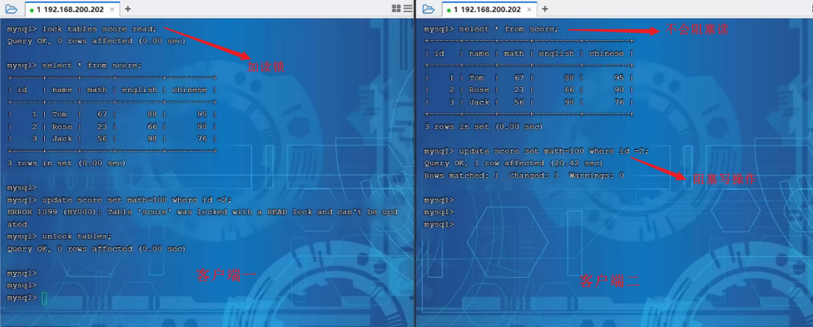


##### 写锁

左侧为客户端一，对指定表加了写锁，会阻塞右侧客户端的读和写。


::: tip 结论

读锁不会阻塞其他客户端的读，但是会阻塞写。

写锁既会阻塞其他客户端的读，又会阻塞 其他客户端的写。

:::

#### 元数据锁

`meta data lock` , 元数据锁，简写`MDL`

`MDL`加锁过程是系统自动控制，无需显式使用，在访问一张表的时候会自动加上。

`MDL`锁主要作用是维护表元数据的数据一致性，在表上有活动事务的时候，不可以对元数据进行写入操作

::: tip

也就是说，某一张表涉及到未提交的事务 时，是不能够修改这张表的表结构

:::

当对一张表进行增删改查的时候，加`MDL`读锁(共享)

当对表结构进行变更操作的时候，加`MDL`写锁(排他)

#### 意向锁

为了避免`DML`在执行时，加的行锁与表锁的冲突，在`InnoDB`中引入了意向锁，使得表锁不用检查每行数据是否加锁，使用意向锁来减少表锁的检查

- 意向共享锁(IS): 由语句`select ... lock in share mode`添加 。 
  - 与表锁共享锁 (read)兼容，与表锁排他锁(write)互斥。 

- 意向排他锁(IX): 由`insert`、`update`、`delete`、`select...for update`添加 。
  - 与表锁共 享锁(read)及排他锁(write)都互斥，意向锁之间不会互斥。


**假如没有意向锁**，客户端一对表加了行锁后，客户端二如何给表加表锁呢

首先客户端一，开启一个事务，然后执行`DML`操作，在执行`DML`语句时，会对涉及到的行加行锁


当客户端二，想对这张表加表锁时，会检查当前表是否有对应的行锁，如果没有，则添加表锁，此时就会从第一行数据，检查到最后一行数据，效率较低

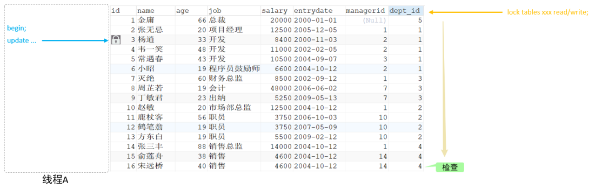


**有了意向锁之后**

客户端一，在执行`DML`操作时，会对涉及的行加行锁，同时也会对该表加上意向锁


而其他客户端，在对这张表加表锁的时候，会根据该表上所加的意向锁来判定是否可以成功加表锁，而不用逐行判断行锁情况了

::: tip

一旦事务提交了，意向共享锁、意向排他锁，都会自动释放

:::

### 行级锁

行级锁，每次操作锁住对应的行数据。锁定粒度最小，发生锁冲突的概率最低，并发度最高。

应用在 `InnoDB`存储引擎中。

`InnoDB`的数据是基于索引组织的，行锁是通过对索引上的**索引项加锁**来实现的，而不是对记录加的锁

- 行锁（Record Lock）：锁定单个行记录的锁，防止其他事务对此行进行update和delete。在 `RC`、`RR`隔离级别下都支持。

  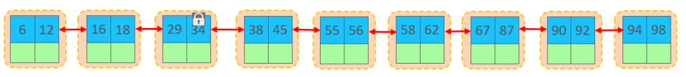

- 间隙锁（Gap Lock）：锁定索引记录间隙（不含该记录），确保索引记录间隙不变，防止其他事务在这个间隙进行`insert`，产生幻读。在`RR`隔离级别下都支持。

  

- 临键锁（Next-Key Lock）：行锁和间隙锁组合，同时锁住数据，并锁住数据前面的间隙。 在`RR`隔离级别下支持

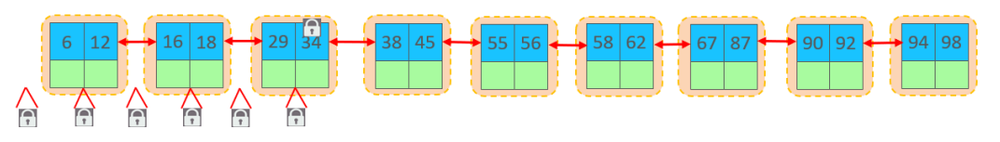

#### 行锁

`InnoDB`实现了两种类型的行锁

- 共享锁（S）：允许一个事务去读一行，阻止其他事务获得相同数据集的排它锁。 
- 排他锁（X）：允许获取排他锁的事务更新数据，阻止其他事务获得相同数据集的共享锁和排他 锁。

常见`SQL`加锁情况

| SQL    | 行锁类型    | 说明     |
| ------ | ----------- | -------- |
| INSERT | 排他锁      | 自动加锁 |
| UPDATE | 排他锁      | 自动加锁 |
| DELETE | 排他锁      | 自动加锁 |
| SELECT | 不加任何 锁 |          |

::: tip

默认情况下，`InnoDB`在 `REPEATABLE READ`事务隔离级别运行，`InnoDB`使用 `next-key` 锁进行搜 索和索引扫描，以防止幻读

针对唯一索引进行检索时，对已存在的记录进行等值匹配时，将会自动优化为行锁

:::

::: danger 注意

`InnoDB`的行锁是针对于索引加的锁，不通过索引条件检索数据，那么`InnoDB`将对表中的所有记录加锁，此时就会升级为表锁

:::

#### 间隙锁&临键锁

默认情况下，`InnoDB`在 `REPEATABLE READ`事务隔离级别运行，`InnoDB`使用 `next-key` 锁进行搜索和索引扫描，以防止幻读

- 索引上的等值查询(唯一索引)，给不存在的记录加锁时, 优化为间隙锁 。 
- 索引上的等值查询(非唯一普通索引)，向右遍历时最后一个值不满足查询需求时，`next-key lock` 退化为间隙锁。 
- 索引上的范围查询(唯一索引)--会访问到不满足条件的第一个值为止

::: danger 注意

间隙锁唯一目的是防止其他事务插入间隙。

间隙锁可以共存，一个事务采用的间隙锁不会阻止另一个事务在同一间隙上采用间隙锁。

:::

## 十一、MySQL事务

事务通常是由一个或一组`SQL`组成的，组成一个事务的`SQL`一般都是一个业务操作

事务是一组操作的集合，它是一个不可分割的工作单位，事务会把所有的操作作为一个整体一起向系统提交或撤销操作请求，即这些操作要么同时成功，要么同时失败

- **事务是基于当前数据库连接而言的，连接`A`中开启事务，是不会影响连接`B`的**

- **默认MySQL的事务是自动提交的，也就是说，当执行完一条DML语句时，MySQL会立即隐式的提交事务。**

~~~sql
-- 查看/设置事务提交方式
SELECT @@autocommit ; -- 查看

SET @@autocommit = 0 ; -- 0不自动提交
~~~


### 事务四大特性 ACID

1. **原子性（Atomicity）**：

   ​	事务是不可分割的最小操作单元，要么全部成功，要么全部失败  

2. **一致性（Consistency）**：

   ​	不管事务发生的前后，`MySQL`中原本的数据变化都是一致的，也就是`DB`中的数据只允许从一个一致性状态变化为另一个一致性状态。

   ​	说人话：一个事务中的所有操作，要么一起改变数据库中的数据，要么都不改变，对于其他事务而言，数据的变化是一致的

3. **隔离性（Isolation）**：

   ​	指多个事务之间都是独立的，相当于每个事务都被装在一个箱子中，每个箱子之间都是隔开的，相互之间并不影响

4. **持久性（Durability）**：

   ​	事务一旦提交或回滚，它对数据库中的数据的改变就是永久的  

   

### 手动控制事务

**手动开启事务后一定要做提交或回滚处理，否则不会生效**

在`MySQL`中，提供了一系列事务相关的命令

- `start transaction | begin | begin work`：开启一个事务
- `commit`：提交一个事务
- `rollback`：回滚一个事务

~~~sql
-- 开启一个事务
start transaction;

-- 第一条SQL语句
-- 第二条SQL语句
-- 第三条SQL语句

-- 提交或回滚事务
commit || rollback;
~~~


### 事务回滚点

当一个事务中的后续操作执行失败时，会回滚到指定的回滚点位置，而不是回滚整个事务中的所有操作

但假设目前有一个事务，由很多条`SQL`组成，但是我想让其中一部分执行成功后，就算后续`SQL`执行失败也照样提交，这时就可以使用**事务回滚点**

`MySQL`提供了两个关于事务回滚点的命令：

- `savepoint point_name`：添加一个事务回滚点
- `rollback to point_name`：回滚到指定的事务回滚点

~~~sql
-- 先查询一次用户表
SELECT * FROM `zz_users`;
-- 开启事务
start transaction;
-- 修改 ID=4 的姓名为：黑熊
update `zz_users` set `user_name` = "黑熊" where `user_id` = 4;
-- 添加一个事务回滚点：update_name
savepoint update_name;
-- 删除 ID=1 的行数据
delete from `zz_users` where `user_id` = 1;
-- 回滚到 update_name 这个事务点
rollback to update_name;
-- 再次查询一次数据
SELECT * FROM `zz_users`;
-- 提交事务
COMMIT;
~~~

上述代码中开启了一个事务，事务中总共修改和删除两条`SQL`组成，然后在修改语句后面添加了一个事务回滚点`update_name`，在删除语句后回滚到了前面添加的回滚点。

> **注意：**
>
> 回滚到事务点后不代表着事务结束了，只是事务内发生了一次回滚，如果要结束当前这个事务，还依旧需要通过`commit|rollback;`命令处理


### 事务隔离级别

| **隔离级别**                   | **脏读** | **不可重复的** | **幻读** |
| :----------------------------- | -------- | -------------- | -------- |
| 读未提交 Read Uncommitted      | √        | √              | √        |
| 读已提交 Read Committed        | ×        | √              | √        |
| 可重复读 Repeatable Read(默认) | ×        | ×              | √        |
| 串行化 Serializable            | ×        | ×              | ×        |

> 事务隔离级别越高，数据越安全，但是性能越低

~~~sql
-- 查看事务隔离级别
SELECT @@TRANSACTION_ISOLATION;

-- 设置事务隔离级别
SET [ SESSION | GLOBAL ] TRANSACTION ISOLATION LEVEL { READ UNCOMMITTED |
READ COMMITTED | REPEATABLE READ | SERIALIZABLE }
~~~

**脏读** :指一个事务读到了其他事务还未提交的数据

**不可重复读** :指在一个事务中，多次读取同一数据，先后读取到的数据不一致

**幻读** :一个事务按照条件查询数据时，没有对应的数据行，但是在插入数据时，又发现这行数据已经存在

**脏写** :多个事务一起操作同一条数据，例如两个事务同时向表中添加一条`ID=888`的数据，此时就会造成数据覆盖，或者主键冲突的问题，这个问题也被称之为更新丢失问题。

**读未提交级别：** 基于**写互斥锁**实现的，只有获取到锁的事务，才允许对数据进行写操作，解决了**脏写**问题

**读已提交级别：** 对于写操作同样会使用**写互斥锁**，对于读操作则使用`MVCC`

**可重复读级别：** 在这个隔离级别中，主要就是解决上一个级别中遗留的不可重复读问题，但`MySQL`依旧是利用`MVCC`机制来解决这个问题的

**串行化级别：** 所有的事务按序排队后串行化处理，也就是操作同一张表的事务只能一个一个执行，事务在执行前需要先获取表级别的锁资源，拿到锁资源的事务才能执行，其余事务则陷入阻塞，等待当前事务释放锁。

> *`RR`级别中也可以解决幻读问题，就是使用临键锁（间隙锁+行锁）这种方式来加锁*


### 事务原理

`MySQL`的事务机制是基于日志实现的

任意一条写`SQL`的执行都会记录三个日志：`undo-log、redo-log、bin-log`

- `undo-log`：主要记录`SQL`的撤销日志，比如目前是`insert`语句，就记录一条`delete`日志。
- `redo-log`：记录当前`SQL`归属事务的状态，以及记录修改内容和修改页的位置。
- `bin-log`：记录每条`SQL`操作日志，只要是用于数据的主从复制与数据恢复/备份。

> 重点是`undo-log、redo-log`这两个日志


#### redo-log

`redo-log`是一种`WAL(Write-ahead logging)`预写式日志，在数据发生更改之前会先记录日志，也就是在`SQL`执行前会先记录一条`prepare`状态的日志，然后再执行数据的写操作

> 注意：`MySQL`是基于磁盘的，但磁盘的写入速度相较内存而言会较慢，因此`MySQL-InnoDB`引擎中不会直接将数据写入到磁盘文件中，而是会先写到`BufferPool`缓冲区中，当`SQL`被成功写入到缓冲区后，紧接着会将`redo-log`日志中相应的记录改为`commit`状态，然后再由`MySQL`刷盘机制去做具体的落盘操作

~~~sql
-- 开启事务
start transaction;
-- 修改 ID=4 的姓名为：黑熊（原本user_name = 1111）
update `zz_users` set `user_name` = "黑熊" where `user_id` = 4;
-- 删除 ID=1 的行数据
delete from `zz_users` where `user_id` = 1;
-- 提交事务
COMMIT;
~~~

这段`SQL`代码执行的过程如下：

1. 当`MySQL`执行时，碰到`start transaction;`的命令时，会将后续所有写操作全部先关闭自动提交机制，也就是后续的所有写操作，不管有没有成功都不会将日志记录修改为`commit`状态

2. 先在`redo-log`中为第一条`SQL`语句，记录一条`prepare`状态的日志，然后再生成对应的撤销日志并记录到`undo-log`中，然后执行`SQL`，将要写入的数据先更新到缓冲区

3. 再对第二条`SQL`语句做相同处理，如果有更多条`SQL`则逐条依次做相同处理

4. 直到碰到了`rollback、commit`命令时，再对前面的所有写`SQL`做相应处理

   - commit：先将当前事务中，所有的`SQL`的`redo-log`日志改为`commit`状态，然后由`MySQL`后台线程做刷盘，将缓冲区中的数据落入磁盘存储
   - rollback：在`undo-log`日志中找到对应的撤销`SQL`执行，将缓冲区内更新过的数据全部还原，由于缓冲区的数据被还原了，因此后台线程在刷盘时，依旧不会改变磁盘文件中存储的数据

   

### 事务的恢复机制

MySQL在运行期间会有几个问题

1、当`SQL`执行时，数据还没被刷写到磁盘中，结果数据库宕机了，那数据是不是就丢了啊？

> 对于这个问题并不需要担心，因为前面提到过`redo-log`是一种预写式日志，会先记录日志再去更新缓冲区中的数据，所以就算缓冲区的数据未被刷写到磁盘，在`MySQL`重启时，依旧可以通过`redo-log`日志重新恢复未落盘的数据，从而确保数据的持久化特性

2、那如果在记录`redo-log`日志时，`MySQL`芭比Q了咋整？

> 前面说过数据被更新到缓冲区代表着`SQL`执行成功了，此时客户端会收到`MySQL`返回的写入成功提示，只是没有落盘而言，所以`MySQL`重启后只需要再次落盘即可
>
> 但如果在记录日志的时候`MySQL`宕机了，这代表着`SQL`都没执行成功，`SQL`没执行成功的话，`MySQL`也不会向客户端返回任何信息，因为`MySQL`一直没返回执行结果，因此会导致客户端连接超时，而一般客户端都会有超时补偿机制的，比如会超时后重试，如果`MySQL`做了热备/灾备，这个重试的时间足够`MySQL`重启完成了，因此用户的操作依旧不会丢失（对于超时补偿机制，在各大数据库连接池中是有实现的）


### 事务的ACID实现

- 原子性由 `undo log` 保证
- 一致性由 `undo log + redo log` 保证
- 隔离性由 `锁 + MVCC` 保证
- 持久性由 `redo log` 保证


**原子性：** 当事务中的操作失败时，需要回滚，此时就需要用到 `undo log` 日志中记录的反向操作来进行回滚。

**一致性：** 前面也有说过，当事务结束时，会有两种情况 1、提交 2、回滚

- 提交：就需要用到 `redo log` 日志，将其中记录的所有本次事务操作改为 `commit` 状态，然后由`MySQL`后台线程做刷盘
- 回滚：就需要用到 `undo log` 日志，找到对应的撤销 `sq`l 执行，还原缓冲区数据

**隔离性：** 通过锁机制，将多个事务隔离开，通过 MVCC 机制，实现非阻塞都的功能。

**持久性：** 对数据的所有操作都会记录在 `redo log` 中，避免 `MySQL` 宕机重启后丢失修改


### MVCC

全称 Multi-Version Concurrency Control，多版本并发控制。

会维护一个数据的多个版本， 使得读写操作没有冲突，快照读为 `MySQ`L 实现 `MVCC` 提供了一个非阻塞读功能

`MVCC` 的具体实现，还需要依赖于数据库记录中的**三个隐式字段、undo log版本链、readView读视图**

#### **三个隐式字段**

| **隐藏字段** | **含义**                                                     |
| ------------ | ------------------------------------------------------------ |
| DB_TRX_ID    | 最近修改事务ID，记录插入这条记录或最后一次修改该记录的事务ID。 |
| DB_ROLL_PTR  | 回滚指针，指向这条记录的上一个版本，用于配合undo log，指向上一个版 本。 |
| DB_ROW_ID    | 隐藏主键，如果表结构没有指定主键，将会生成该隐藏字段。       |

#### **undo log版本链**

不同事务或相同事务对同一条记录进行修改，会导致该记录的`undolog`生成一条记录版本链表，链表的头部是最新的旧记录，链表尾部是最早的旧记录

有一张表，原始数据为

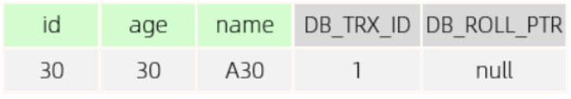

**DB_TRX_ID :** 代表最近修改事务ID，记录插入这条记录或最后一次修改该记录的事务ID，是 自增的。 
**DB_ROLL_PTR ：** 由于这条数据是才插入的，没有被更新过，所以该字段值为null。  

 然后，有四个并发事务同时在访问这张表。  

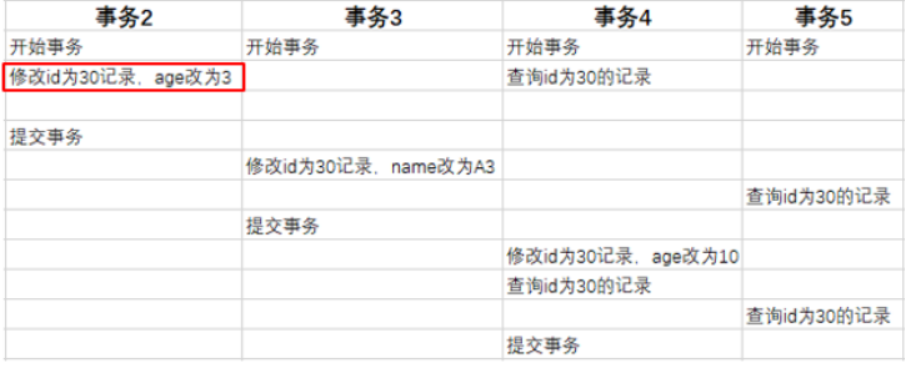

- 当事务2执行第一条修改语句时，会记录undo log日志，记录数据变更之前的样子; 
- 然后更新记录， 并且记录本次操作的事务ID，回滚指针，回滚指针用来指定如果发生回滚，回滚到哪一个版本。


最终会形成如下的版本链


#### readview 读视图

是 快照读 `SQL`执行时`MVCC`提取数据的依据，记录并维护系统当前活跃的事务 （未提交的）id。 

**ReadView**中包含了四个核心字段： 

| **字段**       | **含义**                                             |
| -------------- | ---------------------------------------------------- |
| m_ids          | 当前活跃的事务ID集合                                 |
| min_trx_id     | 最小活跃事务ID                                       |
| max_trx_id     | 预分配事务ID，当前最大事务ID+1（因为事务ID是自增的） |
| creator_trx_id | ReadView创建者的事务ID                               |

而在`readview`中就规定了版本链数据的访问规则

- trx_id 代表当前undolog版本链对应事务ID

| **条件**                           | **是否可以访问**                           | **说明**                                    |
| ---------------------------------- | ------------------------------------------ | ------------------------------------------- |
| trx_id == creator_trx_id           | 可以访问该版本                             | 成立，说明数据是当前这个事 务更改的         |
| trx_id < min_trx_id                | 可以访问该版本                             | 成立，说明数据已经提交了。                  |
| trx_id > max_trx_id                | 不可以访问该版本                           | 成立，说明该事务是在 ReadView生成后才开启。 |
| min_trx_id <= trx_id <= max_trx_id | 如果trx_id不在m_ids中， 是可以访问该版本的 | 成立，说明数据已经提交。                    |

**不同的隔离级别，生成ReadView的时机不同：**

- **READ COMMITTED ：在事务中每一次执行快照读时生成ReadView，保证读取到的是数据可见的最新版本。**
- **REPEATABLE READ：仅在事务中第一次执行快照读时生成ReadView，后续复用该ReadView实现可重复读。**

## 十二、SQL优化

所谓的`SQL`优化，就是指将一条`SQL`写的更加简洁，让`SQL`的执行速度更快，易读性与维护性更好

::: warning 注意

优化一定要建立在不违背业务需求的情况下进行

:::

### select

对于`select`的优化，核心就是要确保索引生效，尽量覆盖索引避免回表查询

#### 查询时尽量不要使用`*`

##### ①分析成本变高

一条`SQL`在执行前都会经过分析器解析，当使用`*`时，解析器需要先去解析出当前要查询的表上`*`表示哪些字段，因此会额外增加解析成本。

但如果明确写出了查询字段，分析器则不会有这一步解析`*`的开销。

##### ②网络开销变大

当使用`*`时，查询时每条数据会返回所有字段值，然后这些查询出的数据会先被放到结果集中，最终查询完成后会统一返回给客户端

但线上`Java`程序和`MySQL`都是分机器部署的，所以返回数据时需要经过网络传输，而由于返回的是所有字段数据，因此网络数据包的体积就会变大，从而导致占用的网络带宽变高，影响数据传输的性能和资源开销。

但实际上可能仅需要用到其中的某几个字段值，所以写清楚字段后查询，能让网络数据包体积变小，从而减小资源消耗、提升响应速度

##### ③内存占用变高

`InnoDB`引擎，当查询一条数据时都会将其结果集放入到`BufferPool`的数据缓冲页中，如果每次用`*`来查询数据，查到的结果集自然会更大，占用的内存也会越大，单个结果集的数据越大，整个内存缓冲池中能存下的数据也就越少，当其他`SQL`操作时，在内存中找不到数据，又会去触发磁盘`IO`，最终导致`MySQL`整体性能下降

##### ④会回表查询


#### 连表查询时尽量不要关联太多表

一旦关联太多的表，就会导致执行效率变慢，执行时间变长，原因如下

- 数据量会随表数量呈直线性增长，数据量越大检索效率越低。
- 当关联的表数量过多时，无法控制好索引的匹配，涉及的表越多，索引不可控风险越大

::: tip

一般来说，关联的表数量应当控制在`5`张表之内

:::

#### 多表查询时一定要以小驱大

当执行多表联查时，`MySQL`的关联算法为`Nest Loop Join`，该算法会依照驱动表的结果集作为循环基础数据，然后通过该结果集中一条条数据，作为过滤条件去下一个表中查询数据，最后合并结果得到最终数据集

例：

假设`student`学生表中有`10000`条数据，`class`班级表中有`100`条数据，当需要关联这两张表查询数据时，`SQL`

~~~sql
-- 大表在前，小表在后
select * from student as s left join class as c on s.class_id = c.class_id;
-- 小表在前，大表在后
select * from class as c left join student as s on c.class_id = s.class_id;
~~~

如果学生表在前作为驱动表，根据`Nest Loop Join`算法会循环一万次查询数据

反之如果班级表在前，则只需要循环`100`次即可查询出数据

#### 覆盖索引

覆盖索引是指查询使用了索引，并且需要返回的列，在该索引中已经全部能够找到


根据`id`查询，直接走聚集索引查询，一次索引扫描，直接返回数据

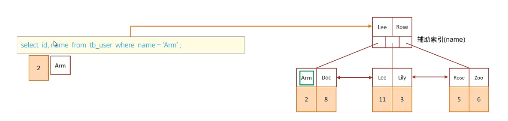

虽然是根据`name`字段查询，查询二级索引，但是由于查询返回在字段为 `id`，`name`，在`name`的二级索引中，这两个值都是可以直接获取到的，因为覆盖索引，所以不需要回表查询

#### SQL提示

在`SQL`语句中加入一些人为的提示来达到优 化操作的目的

##### use index

建议`MySQL`使用哪一个索引完成此次查询（仅仅是建议，`mysql`内部还会再次进 行评估）

~~~sql
select * from tb_user use index(idx_user_pro) where profession = '软件工程';
~~~

##### ignore index

忽略指定的索引

~~~sql
select * from tb_user ignore index(idx_user_pro) where profession = '软件工程';
~~~

##### force index

强制使用索引

~~~sql
select * from tb_user force index(idx_user_pro) where profession = '软件工程';
~~~

### insert

如果我们需要一次性往数据库表中插入多条记录，可以从三个方面进行优化

- 批量插入数据

  ~~~sql
  Insert into tb_test values(1,'Tom'),(2,'Cat'),(3,'Jerry');
  ~~~

- 手动控制事务

  ~~~sql
  start transaction;
  
  insert into tb_test values(1,'Tom'),(2,'Cat'),(3,'Jerry');
  insert into tb_test values(4,'Tom'),(5,'Cat'),(6,'Jerry');
  insert into tb_test values(7,'Tom'),(8,'Cat'),(9,'Jerry');
  
  commit;
  ~~~

- 主键顺序插入，性能要高于乱序插入

  ~~~
  主键乱序插入 : 8 1 9 21 88 2 4 15 89 5 7 3
  主键顺序插入 : 1 2 3 4 5 7 8 9 15 21 88 89大批量插入数据
  ~~~

#### 大批量插入数据

如果一次性需要插入大批量数据(比如: 几百万的记录)，用`MySQL`数据库提供的`load`指令进行插入

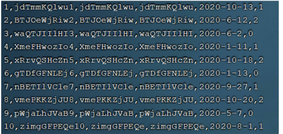

~~~sql
-- 客户端连接服务端时，加上参数 -–local-infile
mysql –-local-infile -u root -p

-- 设置全局参数local_infile为1，开启从本地加载文件导入数据的开关
set global local_infile = 1;

-- 执行load指令将准备好的数据，加载到表结构中
load data local infile '/root/sql1.log' into table tb_user fields
terminated by ',' lines terminated by '\n' ;
~~~

### update

`update`优化核心就是**避免行锁升级为表锁**

### 主键优化

前面提到，主键顺序插入的性能是要高于乱序插入的，这里介绍一下具体的原因

- 页分裂
- 页合并

#### 1). 数据组织方式 

在`InnoDB`存储引擎中，表数据都是根据主键顺序组织存放的，这种存储方式的表称为索引组织表

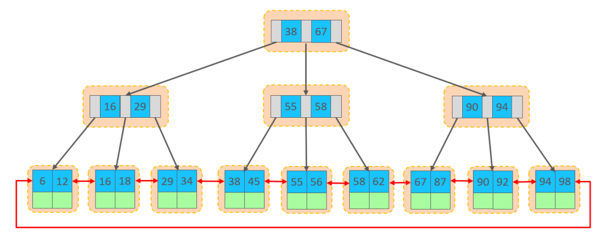

行数据，都是存储在聚集索引的叶子节点上的

在`InnoDB`引擎中，数据行是记录在逻辑结构 `page` 页中的，而每一个页的大小是固定的，默认`16K`。 

那也就意味着， 一个页中所存储的行也是有限的，如果插入的数据行`row`在该页存储不小，将会存储 到下一个页中，页与页之间会通过指针连接

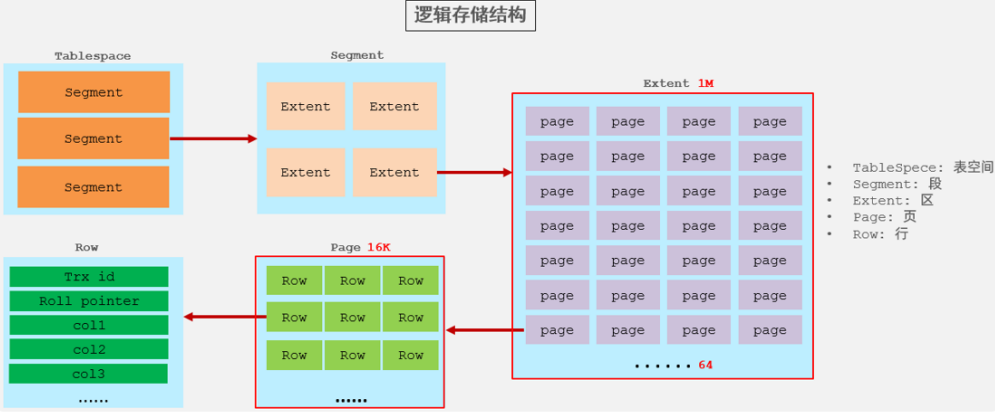

#### 2). 页分裂

页可以为空，也可以填充一半，也可以填充100%。每个页包含了`2-N`行数据(如果一行数据过大，会行 溢出)，根据主键排列

##### 主键顺序插入效果

①. 从磁盘中申请页， 主键顺序插入


②. 第一个页没有满，继续往第一页插入


③. 当第一个也写满之后，再写入第二个页，页与页之间会通过指针连接


④. 当第二页写满了，再往第三页写


##### 主键乱序插入效果

①. 假如`1#`,`2#`页都已经写满了，存放了如图所示的数据


②. 此时再插入`id`为50的记录

此时不会再次开启一个页，写入新的页中，因为，索引结构的叶子节点是有顺序的。按照顺序，应该存储在47之后

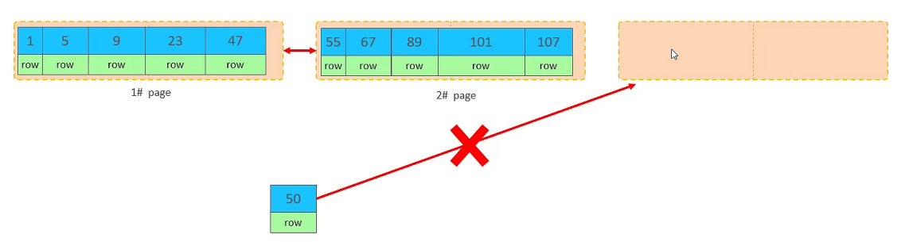


但是47所在的`1#`页，已经写满了，存储不了50对应的数据了。 那么此时会开辟一个新的页 `3#`


但是并不会直接将50存入`3#`页，而是会将`1#`页后一半的数据，移动到`3#`页，然后在`3#`页，插入50

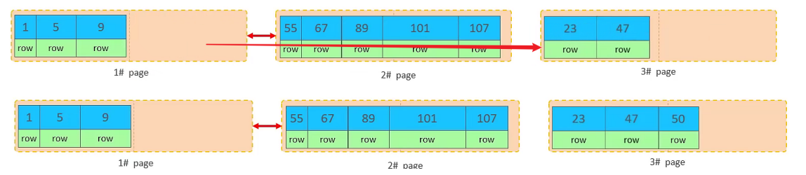

移动数据，并插入id为50的数据之后，那么此时，这三个页之间的数据顺序是有问题的。 

`1#`的下一个 页，应该是`3#`， `3#`的下一个页是`2#`。 

所以，此时，需要重新设置链表指针。


::: tip

这就是也分裂

:::

#### 3).页合并

目前表中已有数据的索引结构(叶子节点)如下


当删除一行记录时，实际上记录并没有被物理删除，只是记录被标记（flaged）为删除并且它的空间 变得允许被其他记录声明使用


当我们继续删除`2#`的数据记录


当页中删除的记录达到 `MERGE_THRESHOLD`（默认为页的50%），`InnoDB`会开始寻找最靠近的页（前 或 后）看看是否可以将两个页合并以优化空间使用。

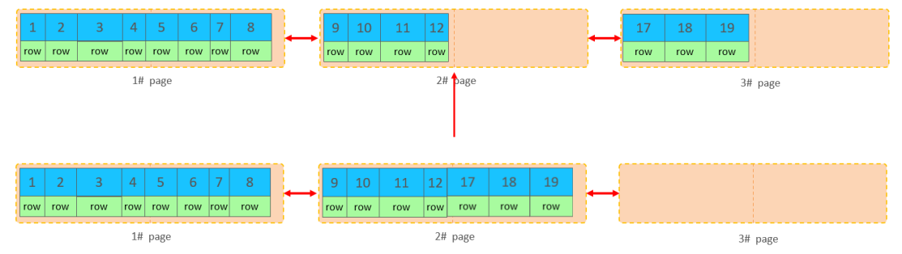

删除数据，并将页合并之后，再次插入新的数据21，则直接插入`3#`页


::: tip

这就是页合并

:::

### count

`count()` 是一个聚合函数，对于返回的结果集，一行行地判断，如果 `count` 函数的参数不是 `NULL`，累计值就加 1，否则不加，最后返回累计值。 

用法：`count（*）`、`count（主键）`、`count（字段）`、`count（数字）`

| count用法     | 含义                                                         |
| ------------- | ------------------------------------------------------------ |
| count（主键） | `InnoDB` 引擎会遍历整张表，把每一行的 主键`id` 值都取出来，返回给服务层。 服务层拿到主键后，直接按行进行累加(因为主键不可能为`null`) |
| count（字段） | 没有`not null` 约束 : `InnoDB` 引擎会遍历整张表把每一行的字段值都取出 来，返回给服务层，服务层判断是否为`null`，不为`null`，计数累加。 有`not null` 约束：`InnoDB` 引擎会遍历整张表把每一行的字段值都取出来，返 回给服务层，直接按行进行累加。 |
| count（数字） | `InnoDB` 引擎遍历整张表，但不取值。服务层对于返回的每一行，放一个数字“1” 进去，直接按行进行累加。 |
| count（*）    | `InnoDB`引擎并不会把全部字段取出来，而是专门做了优化，不取值，服务层直接按行进行累加。 |

::: tip

按照效率排序的话，`count(字段)` `<` `count(主键 id)` `<` `count(1)` `≈` `count(*)`

所以尽量使用 `count(*)`

:::

### order by

根据排序字段建立合适的索引，多字段排序时，也遵循最左前缀法则。 

尽量使用覆盖索引。 

多字段排序, 一个升序一个降序，此时需要注意联合索引在创建时的规则（ASC/DESC）。

~~~sql
create index idx_user_age_phone_ad on tb_user(age asc ,phone desc);
~~~

### group by

在分组操作时，可以通过索引来提高效率。 

分组操作时，索引的使用也是满足最左前缀法则的。

## 十三、MySQL常用工具

主要介绍几个开发过程中常用的`MySQL`工具

### mysql

该`mysql`不是指`mysql`服务，而是指`mysql`的客户端工具。

~~~
语法 ：
	mysql [options] [database]
选项 ：
	-u, --user=name #指定用户名
	-p, --password[=name] #指定密码
	-h, --host=name #指定服务器IP或域名
	-P, --port=port #指定连接端口
	-e, --execute=name #执行SQL语句并退出
~~~

`-e`选项可以在`Mysql`客户端执行`SQL`语句，而不用连接到`MySQL`数据库再执行，对于一些批处理脚本，这种方式尤其方便

示例：

~~~sql
mysql -uroot –p123456 db01 -e "select * from stu";
~~~


### mysqladmin

`mysqladmin` 是一个执行管理操作的客户端程序。

可以用它来检查服务器的配置和当前状态、创建并删除数据库等

~~~
通过帮助文档查看选项：
	mysqladmin --help

语法:
	mysqladmin [options] command ...
选项:
	-u, --user=name #指定用户名
	-p, --password[=name] #指定密码
	-h, --host=name #指定服务器IP或域名
	-P, --port=port #指定连接端口
~~~

示例：

~~~
mysqladmin -uroot –p1234 drop 'test01';

mysqladmin -uroot –p1234 version;
~~~


### mysqlbinlog

由于服务器生成的二进制日志文件以二进制格式保存，所以如果想要检查这些文本的文本格式，就会使 用到`mysqlbinlog` 日志管理工具

~~~
语法 ：
	mysqlbinlog [options] log-files1 log-files2 ...
选项 ：
	-d, --database=name 指定数据库名称，只列出指定的数据库相关操作。
	-o, --offset=# 忽略掉日志中的前n行命令。
	-r,--result-file=name 将输出的文本格式日志输出到指定文件。
	-s, --short-form 显示简单格式， 省略掉一些信息。
	--start-datatime=date1 --stop-datetime=date2 指定日期间隔内的所有日志。
	--start-position=pos1 --stop-position=pos2 指定位置间隔内的所有日志。
~~~

示例：

查看 binlog.000008这个二进制文件中的数据信息


### mysqlshow

`mysqlshow` 客户端对象查找工具，用来很快地查找存在哪些数据库、数据库中的表、表中的列或者索引。

~~~
语法 ：
	mysqlshow [options] [db_name [table_name [col_name]]]
选项 ：
	--count 显示数据库及表的统计信息（数据库，表 均可以不指定）
	-i 显示指定数据库或者指定表的状态信息
	
示例：
#查询test库中每个表中的字段书，及行数
mysqlshow -uroot -p2143 test --count
#查询test库中book表的详细情况
mysqlshow -uroot -p2143 test book --count
~~~

示例：

查询每个数据库的表的数量及表中记录的数量

~~~
mysqlshow -uroot -p1234 --count
~~~


查看数据库db01的统计信息

~~~
mysqlshow -uroot -p1234 db01 --count
~~~


### mysqldump

`mysqldump` 客户端工具用来备份数据库或在不同数据库之间进行数据迁移。

备份内容包含创建表，及插入表的`SQL`语句。

~~~
语法 ：
	mysqldump [options] db_name [tables]
	mysqldump [options] --database/-B db1 [db2 db3...]
	mysqldump [options] --all-databases/-A
连接选项 ：
	-u, --user=name 指定用户名
	-p, --password[=name] 指定密码
	-h, --host=name 指定服务器ip或域名
	-P, --port=# 指定连接端口
输出选项：
	--add-drop-database 在每个数据库创建语句前加上 drop database 语句
	--add-drop-table 在每个表创建语句前加上 drop table 语句 , 默认开启 ; 不开启 (--skip-add-drop-table)
	-n, --no-create-db 不包含数据库的创建语句
	-t, --no-create-info 不包含数据表的创建语句
	-d --no-data 不包含数据
	-T, --tab=name 自动生成两个文件：一个.sql文件，创建表结构的语句；一个.txt文件，数据文件

~~~

示例：

备份db01数据库

~~~
mysqldump -uroot -p1234 db01 > db01.sql
~~~


备份出来的数据包含： 

- 删除表的语句 
- 创建表的语句 
- 数据插入语句 

### mysqlimport

`mysqlimport` 是客户端数据导入工具，用来导入`mysqldump` 加 `-T` 参数后导出的文本文件

~~~
语法 ：
	mysqlimport [options] db_name textfile1 [textfile2...]
示例 ：
	mysqlimport -uroot -p2143 test /tmp/city.txt
~~~


### source

如果需要导入`sql`文件,可以使用`mysql`中的`source` 指令 

~~~
语法 ：
source /root/xxxxx.sql
~~~


