# 目录

[[toc]]

## 索引

索引（index）是帮助`MySQL`高效获取数据的数据结构 (有序) 

**为什么使用索引快？**

索引就相当于一本书的目录

试想一本书如果没有目录的话，你想找一篇文章是不是就只能从头到尾一页页找了？（全表扫描）

而有索引的话，想找什么内容就可以通过目录定位文章所在页数

**索引特点**

- **优点**
   - **提高数据检索的效率，降低数据库 的IO成本**
   - **通过索引列对数据进行排序，降低 数据排序的成本，降低CPU的消 耗**
- **缺点**
   - **索引列也是要占用空间的**
   - **索引大大提高了查询效率，同时却也降低更新表的速度， 如对表进行INSERT、UPDATE、DELETE时，效率降低。  因为需要维护索引**

~~~SQL
--  创建索引
CREATE [ UNIQUE | FULLTEXT ] INDEX 索引名 ON 表名 (列名,... ) ;

CREATE INDEX idx_user_name ON tb_user(name);

CREATE UNIQUE INDEX idx_user_phone ON tb_user(phone);

CREATE INDEX idx_user_pro_age_sta ON tb_user(profession,age,status);

-- 查看索引
SHOW INDEX FROM 表名 ;

-- 删除索引
DROP INDEX 索引名 ON 表名;

-- 前缀索引
create index 索引名 on 表名(列名(长度)) ;

create index idx_email_5 on tb_user(email(5));
~~~

## 索引结构
 `MySQL`的索引是在存储引擎层实现的，不同的存储引擎有不同的索引结构  

| **索引结构** | **描述** | **InnoDB** | **MyISAM** | **Memory** |
| --- | --- | --- | --- | --- |
|  `B+Tree`索引 |  最常见的索引类型，大部分引擎都支持 `B+` 树索引 | 支持 | 支持 | 支持 |
|  `Hash`索引 |  底层数据结构是用哈希表实现的, 只有精确匹配索引列的查询才有效, 不 支持范围查询   | 不支持 | 不支持 | 支持 |
|  `R-tree`(空间索 引） |  空间索引是`MyISAM`引擎的一个特殊索引类型，主要用于地理空间数据类 型，通常使用较少 | 不支持 | 支持 | 不支持 |
|  `Full-text`(全文 索引) |  是一种通过建立倒排索引,快速匹配文档的方式。类似于 Lucene,Solr,ES   | 5.6后支持 | 支持 | 不支持 |

> 注意： 我们平常所说的索引，如果没有特别指明，都是指`B+`树结构组织的索引。

### 二叉树

 假如说`MySQL`的索引结构采用二叉树的数据结构，比较理想的结构如下： 

如果主键是顺序插入的，则会形成一个单向链表，结构如下： 
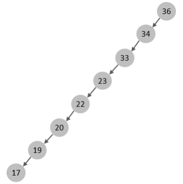

**所以，如果选择二叉树作为索引结构，会存在以下缺点**

- **顺序插入时，会形成一个链表，查询性能大大降低**
- **大数据量情况下，层级较深，检索速度慢**
### 红黑树
此时可能会想到，可以选择红黑树，红黑树是一颗自平衡二叉树，那这样即使是顺序插入数 据，最终形成的数据结构也是一颗平衡的二叉树

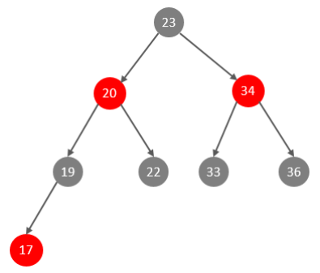

**但是，即使如此，由于红黑树也是一颗二叉树，所以也会存在一个缺点**

- **大数据量情况下，层级较深，检索速度慢**

**所以，在`MySQL`的索引结构中，并没有选择二叉树或者红黑树，而选择的是`B+Tree`**

### B-Tree
 `B-Tree`，B树是一种多叉路衡查找树，相对于二叉树，B树每个节点可以有多个分支，即多叉。 
以一颗最大度数（max-degree）为5(5阶)的`b-tree`为例，那这个B树每个节点最多存储4个`key`，5 个指针
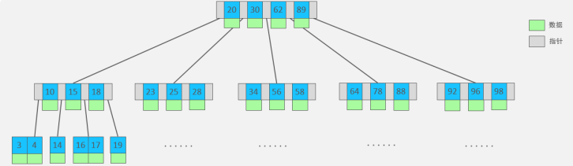
**特点**

- **5阶的B树，每一个节点最多存储4个key，对应5个指针**
- **一旦节点存储的key数量到达5，就会裂变，中间元素向上分裂**
- **在B树中，非叶子节点和叶子节点都会存放数据**

 我们可以通过一个数据结构可视化的网站来简单演示一下

[https://www.cs.usfca.edu/~galles/visualization/BPlusTree.html](https://www.cs.usfca.edu/~galles/visualization/BPlusTree.html  )  

### B+Tree
 `B+Tree`是`B-Tree`的变种，我们以一颗最大度数（max-degree）为4（4阶）的b+tree为例

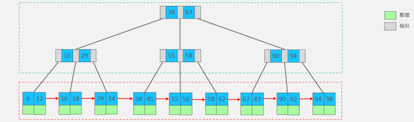 

我们可以看到，两部分： 

- 绿色框框起来的部分，是索引部分，仅仅起到索引数据的作用，不存储数据。 
- 红色框框起来的部分，是数据存储部分，在其叶子节点中要存储具体的数据。  

 **最终我们看到，B+Tree 与 B-Tree相比，主要有以下三点区别：**

- **所有的数据都会出现在叶子节点。**
- **叶子节点形成一个单向链表。**
- **非叶子节点仅仅起到索引数据作用，具体的数据都是在叶子节点存放的。**

**  **
`MySQL`索引数据结构对经典的`B+Tree`进行了优化。

在原`B+Tree`的基础上，增加一个指向相邻叶子节点 的链表指针，就形成了带有顺序指针的`B+Tree`，**提高区间访问的性能，利于排序**

### Hash索引
 `MySQL`中除了支持`B+Tree`索引，还支持一种索引类型---`Hash`索引。  

 哈希索引就是采用一定的`hash`算法，将键值换算成新的`hash`值，映射到对应的槽位上，然后存储在 `hash`表中

如果两个(或多个)键值，映射到一个相同的槽位上，他们就产生了`hash`冲突（也称为`hash`碰撞），可 以通过链表来解决。 

**特点**

- **Hash索引只能用于对等比较(=，in)，不支持范围查询（between，>，< ，...）**
  **无法利用索引完成排序操作**
- **查询效率高，通常(不存在hash冲突的情况)只需要一次检索就可以了，效率通常要高于`B+tree`索 引**
- **在`MySQL`中，支持`hash`索引的是`Memory`存储引擎。 而`InnoDB`中具有自适应`hash`功能，`hash`索引是 `InnoDB`存储引擎根据`B+Tree`索引在指定条件下自动构建的。**

## 索引分类
 在`MySQL`数据库，将索引的具体类型主要分为以下几类

- 主键索引
- 唯一索引
- 常规索引
- 全文索引  

| **分类** | **含义** | **特点** | **关键字** |
| --- | --- | --- | --- |
| 主键索引 |  针对于表中主键创建的索引   |  默认自动创建, 只能 有一个   | `PRIMARY` |
| 唯一索引 |  避免同一个表中某数据列中的值重复   |  可以有多个   |  `UNIQUE` |
| 常规索引 |  快速定位特定数据   |  可以有多个   |  |
| 全文索引 |  全文索引查找的是文本中的关键词，而不是比 较索引中的值   |  可以有多个   |  `FULLTEXT` |

 而在在`InnoDB`存储引擎中，根据索引的存储形式，又可以分为以下两种

| **分类** | **含义** | **特点** |
| --- | --- | --- |
|  聚集索引(Clustered Index)   |  将数据存储与索引放到了一块，索引结构的叶子 节点保存了行数据   |  必须有,而且只 有一个   |
|  二级索引(Secondary Index)   |  将数据与索引分开存储，索引结构的叶子节点关 联的是对应的主键   |  可以存在多个   |

**聚集索引选取规则**

- **如果存在主键，主键索引就是聚集索引**
- **如果不存在主键，将使用第一个唯一（UNIQUE）索引作为聚集索引**
- **如果表没有主键，或没有合适的唯一索引，则`InnoDB`会自动生成一个`rowid`作为隐藏的聚集索引**

 聚集索引和二级索引的具体结构

## **回表查询**

这种先到二级索引中查找数据，找到主键值，然后再到聚集索引中根据主键值，获取 数据的方式，就称之为回表查询。 

**具体过程如下:**

**①. 由于是根据name字段进行查询，所以先根据name='Arm'到name字段的二级索引中进行匹配查 找。但是在二级索引中只能查找到 Arm 对应的主键值 10**

**②. 由于查询返回的数据是，所以此时，还需要根据主键值10，到聚集索引中查找10对应的记录，最终找到10对应的行row**

**③. 最终拿到这一行的数据，直接返回即可**

## 前缀索引
当字段类型为字符串（`varchar`，`text`，`longtext`等）时，有时候需要索引很长的字符串，这会让 索引变得很大，查询时，浪费大量的磁盘IO， 影响查询效率。

此时可以只将字符串的一部分前缀，建 立索引，这样可以大大节约索引空间，从而提高索引效率。

1）语法

~~~SQL
create index idx_xxxx on table_name(column(n)) ;    
~~~

2）前缀长度

可以根据索引的选择性来决定，而选择性是指**不重复的索引值（基数）和数据表的记录总数的比值**， 索引选择性越高则查询效率越高， 唯一索引的选择性是1，这是最好的索引选择性，性能也是最好的。  

~~~SQL
select count(distinct email) / count(*) from tb_user ; 

select count(distinct substring(email,1,5)) / count(*) from tb_user ;  
~~~

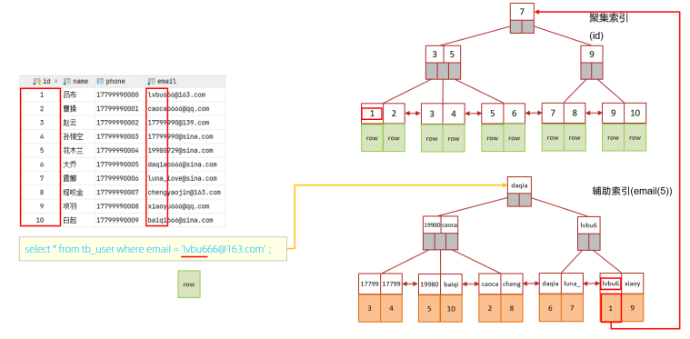
##  单列索引与联合索引  
单列索引：即一个索引只包含单个列。 

联合索引：即一个索引包含了多个列。

若在`and`连接的两个字段 `phone`、`name`上都是有单列索引的，但是最终`mysql`只会选择一个索引，也就是说，只能走一个字段的索引，此时是会回表查询的。 

若有联合索引则会走联合索引，不会回表查询

## 索引失效情况
### 最左前缀法则
 如果索引了多列（联合索引），要遵守最左前缀法则。  

- 最左前缀法则指的是查询从索引的最左列开始，**最左列必须存在**，否则索引**全部失效**
- 并且不能跳过索引中的列。如果跳跃某一列，索引将会**部分失效**(后面的字段索引失效)  

> **注意 ： 最左前缀法则中指的最左边的列，是指在查询时，联合索引的最左边的字段(即是 第一个字段)必须存在，与我们编写SQL时，条件编写的先后顺序无关。**

### 范围查询
 联合索引中，出现范围查询(`>,<`)，范围查询右侧的列索引失效。
~~~sql
 explain select * from tb_user where profession = '软件工程' and age > 30 and status = '0'; 
~~~

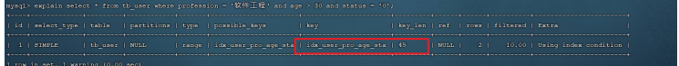
 当范围查询使用`>=` 或 `<=` 时， 所有的字段都是走索引 的 

~~~sql
explain select * from tb_user where profession = '软件工程' and age >= 30 and status = '0';
~~~

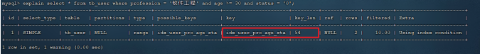

### 索引列运算
 不要在索引列上进行运算操作， 索引将失效 
~~~sql
 explain select * from tb_user where substring(phone,10,2) = '15'; 
~~~

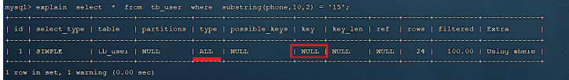

### 字符串不加引号  
 字符串类型字段使用时，不加引号，索引将失效 

>  如果字符串不加单引号，对于查询结果，没什么影响，但是数 据库存在隐式类型转换，索引将失效 

~~~sql
explain select * from tb_user where profession = '软件工程' and age = 31 and status = '0'; 

explain select * from tb_user where profession = '软件工程' and age = 31 and status = 0; 
~~~

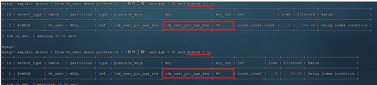

~~~sql
explain select * from tb_user where phone = '17799990015'; 

explain select * from tb_user where phone = 17799990015; 
~~~

### 头部模糊查询
如果仅仅是尾部模糊匹配，索引不会失效。

如果是头部模糊匹配，索引失效 

~~~sql
explain select * from tb_user where profession like '软件%'; 

explain select * from tb_user where profession like '%工程'; 

explain select * from tb_user where profession like '%工%'; 
~~~

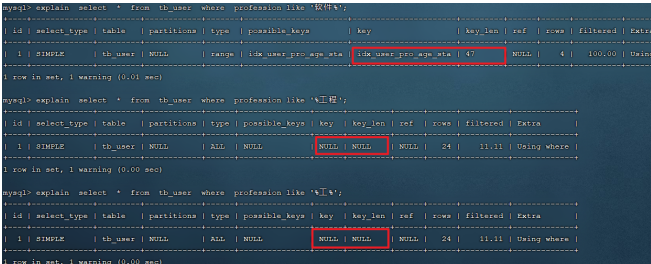

###  or 连接条件
用`or`分割开的条件， 如果`or`前的条件中的列有索引，而后面的列中没有索引，那么涉及的索引都不会被用到 

~~~sql
explain select * from tb_user where id = 10 or age = 23; 

explain select * from tb_user where phone = '17799990017' or age = 23; 
~~~

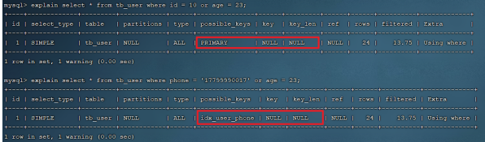

由于`age`没有索引，所以即使`id`、`phone`有索引，索引也会失效。

所以需要针对于`age`也要建立索引。 

> 当`or`连接的条件，左右两侧字段都有索引时，索引才会生效。  

### 数据分布影响
如果`MySQL`评估使用索引比全表更慢，则不使用索引  

- 如果符合条件的记录数超过总记录数的一半，就不会走索引
- 如果符合条件的记录数未到总记录数的一半，就会走索引

如：
表中10条记录，6条为`null`， `is null` 查询，就不会走索引，`is not null` 就会走索引

## 索引设计原则

### 建立索引

①经常频繁用作查询条件的字段应酌情考虑为其创建索引。

②表的主外键或连表字段，必须建立索引，因为能很大程度提升连表查询的性能。

③建立索引的字段，一般值的区分性要足够高，这样才能提高索引的检索效率。

④建立索引的字段，值不应该过长，如果较长的字段要建立索引，可以选择前缀索引。

⑤建立联合索引，应当遵循最左前缀原则，将多个字段之间按优先级顺序组合。

⑥经常根据范围取值、排序、分组的字段应建立索引，因为索引有序，能加快排序时间。

⑦对于唯一索引，如果确认不会利用该字段排序，那可以将结构改为`Hash`结构。

⑧尽量使用联合索引代替单值索引，联合索引比多个单值索引查询效率要高。

### 不适合建立索引

❶值经常会增删改的字段，不合适建立索引，因为每次改变后需维护索引结构。

❷一个字段存在大量的重复值时，不适合建立索引，比如之前举例的性别字段。

❸索引不能参与计算，因此经常带函数查询的字段，并不适合建立索引。

❹一张表中的索引数量并不是越多越好，一般控制在`3`，最多不能超过`5`。

❺建立联合索引时，一定要考虑优先级，查询频率最高的字段应当放首位。

❻当表的数据较少，不应当建立索引，因为数据量不大时，维护索引反而开销更大。

❼索引的字段值无序时，不推荐建立索引，因为会造成页分裂，尤其是主键索引。

