# 目录

[[toc]]

## SQL优化

所谓的`SQL`优化，就是指将一条`SQL`写的更加简洁，让`SQL`的执行速度更快，易读性与维护性更好

::: warning 注意

优化一定要建立在不违背业务需求的情况下进行

:::

## select

对于`select`的优化，核心就是要确保索引生效，尽量覆盖索引避免回表查询

### 查询时尽量不要使用`*`

#### ①分析成本变高

一条`SQL`在执行前都会经过分析器解析，当使用`*`时，解析器需要先去解析出当前要查询的表上`*`表示哪些字段，因此会额外增加解析成本。

但如果明确写出了查询字段，分析器则不会有这一步解析`*`的开销。

#### ②网络开销变大

当使用`*`时，查询时每条数据会返回所有字段值，然后这些查询出的数据会先被放到结果集中，最终查询完成后会统一返回给客户端

但线上`Java`程序和`MySQL`都是分机器部署的，所以返回数据时需要经过网络传输，而由于返回的是所有字段数据，因此网络数据包的体积就会变大，从而导致占用的网络带宽变高，影响数据传输的性能和资源开销。

但实际上可能仅需要用到其中的某几个字段值，所以写清楚字段后查询，能让网络数据包体积变小，从而减小资源消耗、提升响应速度

#### ③内存占用变高

`InnoDB`引擎，当查询一条数据时都会将其结果集放入到`BufferPool`的数据缓冲页中，如果每次用`*`来查询数据，查到的结果集自然会更大，占用的内存也会越大，单个结果集的数据越大，整个内存缓冲池中能存下的数据也就越少，当其他`SQL`操作时，在内存中找不到数据，又会去触发磁盘`IO`，最终导致`MySQL`整体性能下降

#### ④会回表查询

### 连表查询时尽量不要关联太多表

一旦关联太多的表，就会导致执行效率变慢，执行时间变长，原因如下

- 数据量会随表数量呈直线性增长，数据量越大检索效率越低。
- 当关联的表数量过多时，无法控制好索引的匹配，涉及的表越多，索引不可控风险越大

::: tip

一般来说，关联的表数量应当控制在`5`张表之内

:::

### 多表查询时一定要以小驱大

当执行多表联查时，`MySQL`的关联算法为`Nest Loop Join`，该算法会依照驱动表的结果集作为循环基础数据，然后通过该结果集中一条条数据，作为过滤条件去下一个表中查询数据，最后合并结果得到最终数据集

例：

假设`student`学生表中有`10000`条数据，`class`班级表中有`100`条数据，当需要关联这两张表查询数据时，`SQL`

~~~sql
-- 大表在前，小表在后
select * from student as s left join class as c on s.class_id = c.class_id;
-- 小表在前，大表在后
select * from class as c left join student as s on c.class_id = s.class_id;
~~~

如果学生表在前作为驱动表，根据`Nest Loop Join`算法会循环一万次查询数据

反之如果班级表在前，则只需要循环`100`次即可查询出数据

### 覆盖索引

覆盖索引是指查询使用了索引，并且需要返回的列，在该索引中已经全部能够找到

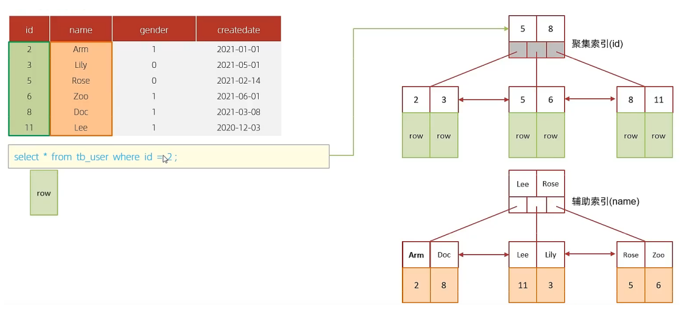

根据`id`查询，直接走聚集索引查询，一次索引扫描，直接返回数据

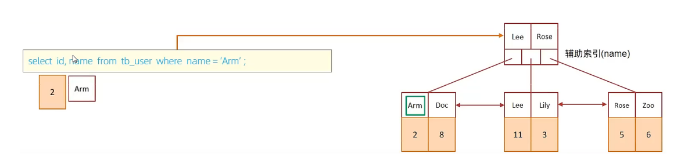

虽然是根据`name`字段查询，查询二级索引，但是由于查询返回在字段为 `id`，`name`，在`name`的二级索引中，这两个值都是可以直接获取到的，因为覆盖索引，所以不需要回表查询

### SQL提示

在`SQL`语句中加入一些人为的提示来达到优 化操作的目的

##### use index

建议`MySQL`使用哪一个索引完成此次查询（仅仅是建议，`mysql`内部还会再次进 行评估）

~~~sql
select * from tb_user use index(idx_user_pro) where profession = '软件工程';
~~~

##### ignore index

忽略指定的索引

~~~sql
select * from tb_user ignore index(idx_user_pro) where profession = '软件工程';
~~~

##### force index

强制使用索引

~~~sql
select * from tb_user force index(idx_user_pro) where profession = '软件工程';
~~~

## insert

如果我们需要一次性往数据库表中插入多条记录，可以从三个方面进行优化

- 批量插入数据

  ~~~sql
  Insert into tb_test values(1,'Tom'),(2,'Cat'),(3,'Jerry');
  ~~~

- 手动控制事务

  ~~~sql
  start transaction;
  
  insert into tb_test values(1,'Tom'),(2,'Cat'),(3,'Jerry');
  insert into tb_test values(4,'Tom'),(5,'Cat'),(6,'Jerry');
  insert into tb_test values(7,'Tom'),(8,'Cat'),(9,'Jerry');
  
  commit;
  ~~~

- 主键顺序插入，性能要高于乱序插入

  ~~~
  主键乱序插入 : 8 1 9 21 88 2 4 15 89 5 7 3
  主键顺序插入 : 1 2 3 4 5 7 8 9 15 21 88 89大批量插入数据
  ~~~

### 大批量插入数据

如果一次性需要插入大批量数据(比如: 几百万的记录)，用`MySQL`数据库提供的`load`指令进行插入

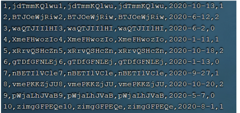

~~~sql
-- 客户端连接服务端时，加上参数 -–local-infile
mysql –-local-infile -u root -p

-- 设置全局参数local_infile为1，开启从本地加载文件导入数据的开关
set global local_infile = 1;

-- 执行load指令将准备好的数据，加载到表结构中
load data local infile '/root/sql1.log' into table tb_user fields
terminated by ',' lines terminated by '\n' ;
~~~

## update

`update`优化核心就是**避免行锁升级为表锁**

## 主键优化

前面提到，主键顺序插入的性能是要高于乱序插入的，这里介绍一下具体的原因

- 页分裂
- 页合并

### 1). 数据组织方式 

在`InnoDB`存储引擎中，表数据都是根据主键顺序组织存放的，这种存储方式的表称为索引组织表

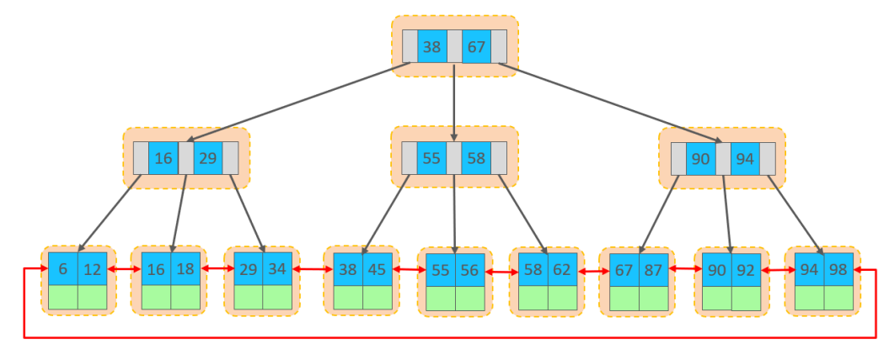

行数据，都是存储在聚集索引的叶子节点上的

在`InnoDB`引擎中，数据行是记录在逻辑结构 `page` 页中的，而每一个页的大小是固定的，默认`16K`。 

那也就意味着， 一个页中所存储的行也是有限的，如果插入的数据行`row`在该页存储不小，将会存储 到下一个页中，页与页之间会通过指针连接

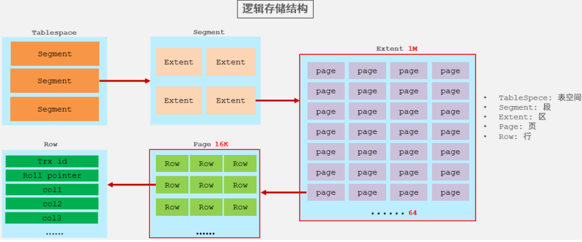

### 2). 页分裂

页可以为空，也可以填充一半，也可以填充100%。每个页包含了`2-N`行数据(如果一行数据过大，会行 溢出)，根据主键排列

#### 主键顺序插入效果

①. 从磁盘中申请页， 主键顺序插入

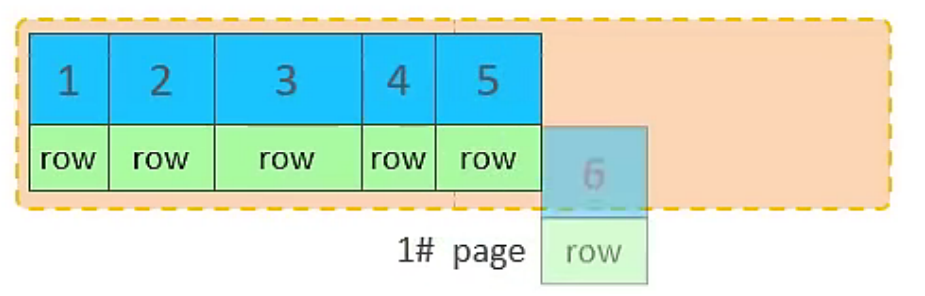

②. 第一个页没有满，继续往第一页插入

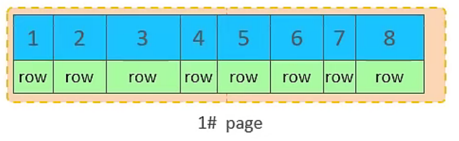

③. 当第一个也写满之后，再写入第二个页，页与页之间会通过指针连接

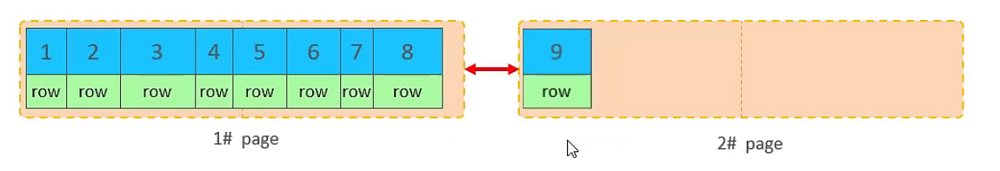

④. 当第二页写满了，再往第三页写

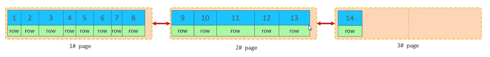

#### 主键乱序插入效果

①. 假如`1#`,`2#`页都已经写满了，存放了如图所示的数据

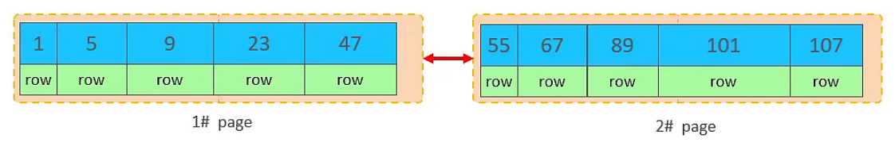

②. 此时再插入`id`为50的记录

此时不会再次开启一个页，写入新的页中，因为，索引结构的叶子节点是有顺序的。按照顺序，应该存储在47之后

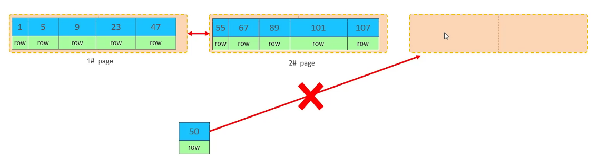

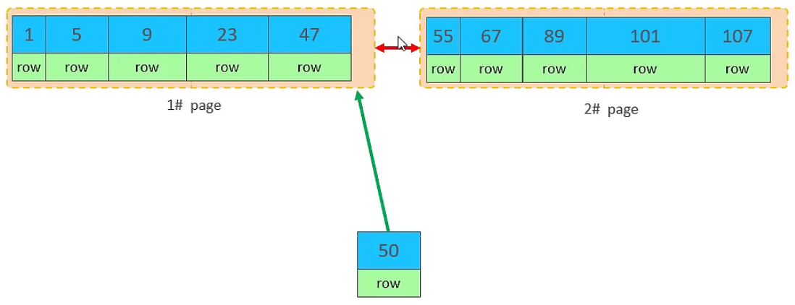

但是47所在的`1#`页，已经写满了，存储不了50对应的数据了。 那么此时会开辟一个新的页 `3#`

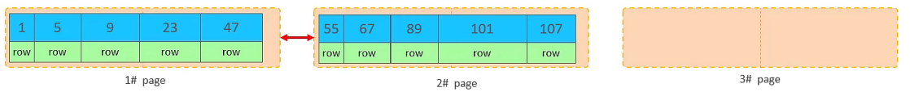

但是并不会直接将50存入`3#`页，而是会将`1#`页后一半的数据，移动到`3#`页，然后在`3#`页，插入50

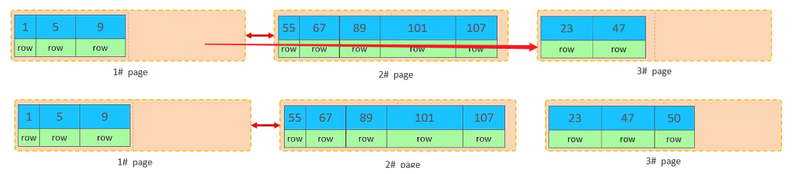

移动数据，并插入id为50的数据之后，那么此时，这三个页之间的数据顺序是有问题的。 

`1#`的下一个 页，应该是`3#`， `3#`的下一个页是`2#`。 

所以，此时，需要重新设置链表指针。

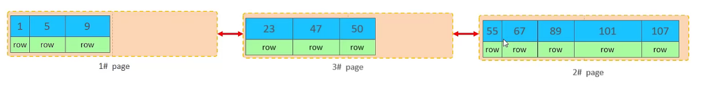

::: tip

这就是也分裂

:::

### 3).页合并

目前表中已有数据的索引结构(叶子节点)如下

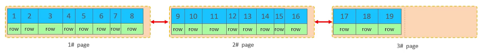

当删除一行记录时，实际上记录并没有被物理删除，只是记录被标记（flaged）为删除并且它的空间 变得允许被其他记录声明使用

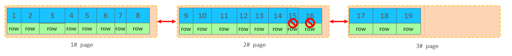

当我们继续删除`2#`的数据记录

当页中删除的记录达到 `MERGE_THRESHOLD`（默认为页的50%），`InnoDB`会开始寻找最靠近的页（前 或 后）看看是否可以将两个页合并以优化空间使用。

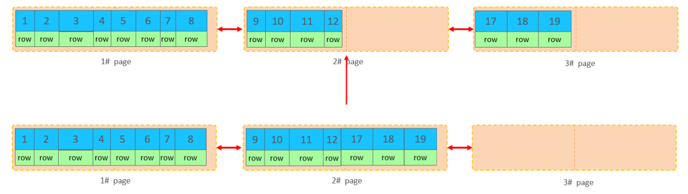

删除数据，并将页合并之后，再次插入新的数据21，则直接插入`3#`页

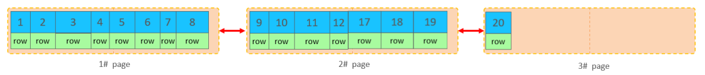

::: tip

这就是页合并

:::

## count

`count()` 是一个聚合函数，对于返回的结果集，一行行地判断，如果 `count` 函数的参数不是 `NULL`，累计值就加 1，否则不加，最后返回累计值。 

用法：`count（*）`、`count（主键）`、`count（字段）`、`count（数字）`

| count用法     | 含义                                                         |
| ------------- | ------------------------------------------------------------ |
| count（主键） | `InnoDB` 引擎会遍历整张表，把每一行的 主键`id` 值都取出来，返回给服务层。 服务层拿到主键后，直接按行进行累加(因为主键不可能为`null`) |
| count（字段） | 没有`not null` 约束 : `InnoDB` 引擎会遍历整张表把每一行的字段值都取出 来，返回给服务层，服务层判断是否为`null`，不为`null`，计数累加。 有`not null` 约束：`InnoDB` 引擎会遍历整张表把每一行的字段值都取出来，返 回给服务层，直接按行进行累加。 |
| count（数字） | `InnoDB` 引擎遍历整张表，但不取值。服务层对于返回的每一行，放一个数字“1” 进去，直接按行进行累加。 |
| count（*）    | `InnoDB`引擎并不会把全部字段取出来，而是专门做了优化，不取值，服务层直接按行进行累加。 |

::: tip

按照效率排序的话，`count(字段)` `<` `count(主键 id)` `<` `count(1)` `≈` `count(*)`

所以尽量使用 `count(*)`

:::

## order by

根据排序字段建立合适的索引，多字段排序时，也遵循最左前缀法则。 

尽量使用覆盖索引。 

多字段排序, 一个升序一个降序，此时需要注意联合索引在创建时的规则（ASC/DESC）。

~~~sql
create index idx_user_age_phone_ad on tb_user(age asc ,phone desc);
~~~

## group by

在分组操作时，可以通过索引来提高效率。 

分组操作时，索引的使用也是满足最左前缀法则的。