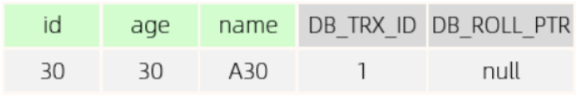
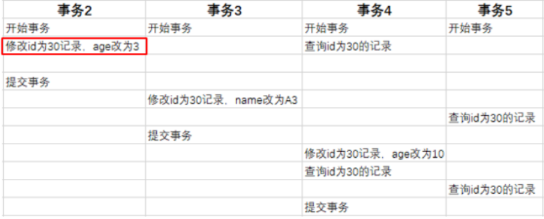
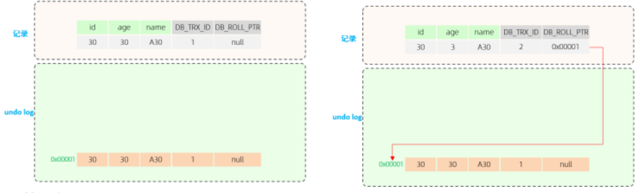
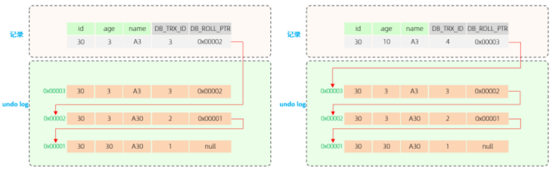

# 目录
[[toc]]
## MySQL事务

事务通常是由一个或一组`SQL`组成的，组成一个事务的`SQL`一般都是一个业务操作

事务是一组操作的集合，它是一个不可分割的工作单位，事务会把所有的操作作为一个整体一起向系统提交或撤销操作请求，即这些操作要么同时成功，要么同时失败

- **事务是基于当前数据库连接而言的，连接`A`中开启事务，是不会影响连接`B`的**

- **默认MySQL的事务是自动提交的，也就是说，当执行完一条DML语句时，MySQL会立即隐式的提交事务。**

~~~sql
-- 查看/设置事务提交方式
SELECT @@autocommit ; -- 查看

SET @@autocommit = 0 ; -- 0不自动提交
~~~

## 事务四大特性 ACID

1. **原子性（Atomicity）**：

   ​	事务是不可分割的最小操作单元，要么全部成功，要么全部失败  

2. **一致性（Consistency）**：

   ​	不管事务发生的前后，`MySQL`中原本的数据变化都是一致的，也就是`DB`中的数据只允许从一个一致性状态变化为另一个一致性状态。

   ​	说人话：一个事务中的所有操作，要么一起改变数据库中的数据，要么都不改变，对于其他事务而言，数据的变化是一致的

3. **隔离性（Isolation）**：

   ​	指多个事务之间都是独立的，相当于每个事务都被装在一个箱子中，每个箱子之间都是隔开的，相互之间并不影响

4. **持久性（Durability）**：

   ​	事务一旦提交或回滚，它对数据库中的数据的改变就是永久的  

   

## 手动控制事务

**手动开启事务后一定要做提交或回滚处理，否则不会生效**

在`MySQL`中，提供了一系列事务相关的命令

- `start transaction | begin | begin work`：开启一个事务
- `commit`：提交一个事务
- `rollback`：回滚一个事务

~~~sql
-- 开启一个事务
start transaction;

-- 第一条SQL语句
-- 第二条SQL语句
-- 第三条SQL语句

-- 提交或回滚事务
commit || rollback;
~~~

## 事务回滚点

当一个事务中的后续操作执行失败时，会回滚到指定的回滚点位置，而不是回滚整个事务中的所有操作

但假设目前有一个事务，由很多条`SQL`组成，但是我想让其中一部分执行成功后，就算后续`SQL`执行失败也照样提交，这时就可以使用**事务回滚点**

`MySQL`提供了两个关于事务回滚点的命令：

- `savepoint point_name`：添加一个事务回滚点
- `rollback to point_name`：回滚到指定的事务回滚点

~~~sql
-- 先查询一次用户表
SELECT * FROM `zz_users`;
-- 开启事务
start transaction;
-- 修改 ID=4 的姓名为：黑熊
update `zz_users` set `user_name` = "黑熊" where `user_id` = 4;
-- 添加一个事务回滚点：update_name
savepoint update_name;
-- 删除 ID=1 的行数据
delete from `zz_users` where `user_id` = 1;
-- 回滚到 update_name 这个事务点
rollback to update_name;
-- 再次查询一次数据
SELECT * FROM `zz_users`;
-- 提交事务
COMMIT;
~~~

上述代码中开启了一个事务，事务中总共修改和删除两条`SQL`组成，然后在修改语句后面添加了一个事务回滚点`update_name`，在删除语句后回滚到了前面添加的回滚点。

> **注意：**
>
> 回滚到事务点后不代表着事务结束了，只是事务内发生了一次回滚，如果要结束当前这个事务，还依旧需要通过`commit|rollback;`命令处理

## 事务隔离级别

| **隔离级别**                   | **脏读** | **不可重复的** | **幻读** |
| :----------------------------- | -------- | -------------- | -------- |
| 读未提交 Read Uncommitted      | √        | √              | √        |
| 读已提交 Read Committed        | ×        | √              | √        |
| 可重复读 Repeatable Read(默认) | ×        | ×              | √        |
| 串行化 Serializable            | ×        | ×              | ×        |

> 事务隔离级别越高，数据越安全，但是性能越低

~~~sql
-- 查看事务隔离级别
SELECT @@TRANSACTION_ISOLATION;

-- 设置事务隔离级别
SET [ SESSION | GLOBAL ] TRANSACTION ISOLATION LEVEL { READ UNCOMMITTED |
READ COMMITTED | REPEATABLE READ | SERIALIZABLE }
~~~

**脏读** :指一个事务读到了其他事务还未提交的数据

**不可重复读** :指在一个事务中，多次读取同一数据，先后读取到的数据不一致

**幻读** :一个事务按照条件查询数据时，没有对应的数据行，但是在插入数据时，又发现这行数据已经存在

**脏写** :多个事务一起操作同一条数据，例如两个事务同时向表中添加一条`ID=888`的数据，此时就会造成数据覆盖，或者主键冲突的问题，这个问题也被称之为更新丢失问题。

**读未提交级别：** 基于**写互斥锁**实现的，只有获取到锁的事务，才允许对数据进行写操作，解决了**脏写**问题

**读已提交级别：** 对于写操作同样会使用**写互斥锁**，对于读操作则使用`MVCC`

**可重复读级别：** 在这个隔离级别中，主要就是解决上一个级别中遗留的不可重复读问题，但`MySQL`依旧是利用`MVCC`机制来解决这个问题的

**串行化级别：** 所有的事务按序排队后串行化处理，也就是操作同一张表的事务只能一个一个执行，事务在执行前需要先获取表级别的锁资源，拿到锁资源的事务才能执行，其余事务则陷入阻塞，等待当前事务释放锁。

> *`RR`级别中也可以解决幻读问题，就是使用临键锁（间隙锁+行锁）这种方式来加锁*

## 事务原理

`MySQL`的事务机制是基于日志实现的

任意一条写`SQL`的执行都会记录三个日志：`undo-log、redo-log、bin-log`

- `undo-log`：主要记录`SQL`的撤销日志，比如目前是`insert`语句，就记录一条`delete`日志。
- `redo-log`：记录当前`SQL`归属事务的状态，以及记录修改内容和修改页的位置。
- `bin-log`：记录每条`SQL`操作日志，只要是用于数据的主从复制与数据恢复/备份。

> 重点是`undo-log、redo-log`这两个日志

### redo-log

`redo-log`是一种`WAL(Write-ahead logging)`预写式日志，在数据发生更改之前会先记录日志，也就是在`SQL`执行前会先记录一条`prepare`状态的日志，然后再执行数据的写操作

> 注意：`MySQL`是基于磁盘的，但磁盘的写入速度相较内存而言会较慢，因此`MySQL-InnoDB`引擎中不会直接将数据写入到磁盘文件中，而是会先写到`BufferPool`缓冲区中，当`SQL`被成功写入到缓冲区后，紧接着会将`redo-log`日志中相应的记录改为`commit`状态，然后再由`MySQL`刷盘机制去做具体的落盘操作

~~~sql
-- 开启事务
start transaction;
-- 修改 ID=4 的姓名为：黑熊（原本user_name = 1111）
update `zz_users` set `user_name` = "黑熊" where `user_id` = 4;
-- 删除 ID=1 的行数据
delete from `zz_users` where `user_id` = 1;
-- 提交事务
COMMIT;
~~~

这段`SQL`代码执行的过程如下：

1. 当`MySQL`执行时，碰到`start transaction;`的命令时，会将后续所有写操作全部先关闭自动提交机制，也就是后续的所有写操作，不管有没有成功都不会将日志记录修改为`commit`状态

2. 先在`redo-log`中为第一条`SQL`语句，记录一条`prepare`状态的日志，然后再生成对应的撤销日志并记录到`undo-log`中，然后执行`SQL`，将要写入的数据先更新到缓冲区

3. 再对第二条`SQL`语句做相同处理，如果有更多条`SQL`则逐条依次做相同处理

4. 直到碰到了`rollback、commit`命令时，再对前面的所有写`SQL`做相应处理

   - commit：先将当前事务中，所有的`SQL`的`redo-log`日志改为`commit`状态，然后由`MySQL`后台线程做刷盘，将缓冲区中的数据落入磁盘存储
   - rollback：在`undo-log`日志中找到对应的撤销`SQL`执行，将缓冲区内更新过的数据全部还原，由于缓冲区的数据被还原了，因此后台线程在刷盘时，依旧不会改变磁盘文件中存储的数据

   

## 事务的恢复机制

MySQL在运行期间会有几个问题

1、当`SQL`执行时，数据还没被刷写到磁盘中，结果数据库宕机了，那数据是不是就丢了啊？

> 对于这个问题并不需要担心，因为前面提到过`redo-log`是一种预写式日志，会先记录日志再去更新缓冲区中的数据，所以就算缓冲区的数据未被刷写到磁盘，在`MySQL`重启时，依旧可以通过`redo-log`日志重新恢复未落盘的数据，从而确保数据的持久化特性

2、那如果在记录`redo-log`日志时，`MySQL`芭比Q了咋整？

> 前面说过数据被更新到缓冲区代表着`SQL`执行成功了，此时客户端会收到`MySQL`返回的写入成功提示，只是没有落盘而言，所以`MySQL`重启后只需要再次落盘即可
>
> 但如果在记录日志的时候`MySQL`宕机了，这代表着`SQL`都没执行成功，`SQL`没执行成功的话，`MySQL`也不会向客户端返回任何信息，因为`MySQL`一直没返回执行结果，因此会导致客户端连接超时，而一般客户端都会有超时补偿机制的，比如会超时后重试，如果`MySQL`做了热备/灾备，这个重试的时间足够`MySQL`重启完成了，因此用户的操作依旧不会丢失（对于超时补偿机制，在各大数据库连接池中是有实现的）

## 事务的ACID实现

- 原子性由 `undo log` 保证
- 一致性由 `undo log + redo log` 保证
- 隔离性由 `锁 + MVCC` 保证
- 持久性由 `redo log` 保证

**原子性：** 当事务中的操作失败时，需要回滚，此时就需要用到 `undo log` 日志中记录的反向操作来进行回滚。

**一致性：** 前面也有说过，当事务结束时，会有两种情况 1、提交 2、回滚

- 提交：就需要用到 `redo log` 日志，将其中记录的所有本次事务操作改为 `commit` 状态，然后由`MySQL`后台线程做刷盘
- 回滚：就需要用到 `undo log` 日志，找到对应的撤销 `sq`l 执行，还原缓冲区数据

**隔离性：** 通过锁机制，将多个事务隔离开，通过 MVCC 机制，实现非阻塞都的功能。

**持久性：** 对数据的所有操作都会记录在 `redo log` 中，避免 `MySQL` 宕机重启后丢失修改

## MVCC

全称 Multi-Version Concurrency Control，多版本并发控制。

会维护一个数据的多个版本， 使得读写操作没有冲突，快照读为 `MySQ`L 实现 `MVCC` 提供了一个非阻塞读功能

`MVCC` 的具体实现，还需要依赖于数据库记录中的**三个隐式字段、undo log版本链、readView读视图**

### **三个隐式字段**

| **隐藏字段** | **含义**                                                     |
| ------------ | ------------------------------------------------------------ |
| DB_TRX_ID    | 最近修改事务ID，记录插入这条记录或最后一次修改该记录的事务ID。 |
| DB_ROLL_PTR  | 回滚指针，指向这条记录的上一个版本，用于配合undo log，指向上一个版 本。 |
| DB_ROW_ID    | 隐藏主键，如果表结构没有指定主键，将会生成该隐藏字段。       |

### **undo log版本链**

不同事务或相同事务对同一条记录进行修改，会导致该记录的`undolog`生成一条记录版本链表，链表的头部是最新的旧记录，链表尾部是最早的旧记录

有一张表，原始数据为

**DB_TRX_ID :** 代表最近修改事务ID，记录插入这条记录或最后一次修改该记录的事务ID，是 自增的。 
**DB_ROLL_PTR ：** 由于这条数据是才插入的，没有被更新过，所以该字段值为null。  

 然后，有四个并发事务同时在访问这张表。  

- 当事务2执行第一条修改语句时，会记录undo log日志，记录数据变更之前的样子; 
- 然后更新记录， 并且记录本次操作的事务ID，回滚指针，回滚指针用来指定如果发生回滚，回滚到哪一个版本。

最终会形成如下的版本链

### readview 读视图

是 快照读 `SQL`执行时`MVCC`提取数据的依据，记录并维护系统当前活跃的事务 （未提交的）id。 

**ReadView**中包含了四个核心字段： 

| **字段**       | **含义**                                             |
| -------------- | ---------------------------------------------------- |
| m_ids          | 当前活跃的事务ID集合                                 |
| min_trx_id     | 最小活跃事务ID                                       |
| max_trx_id     | 预分配事务ID，当前最大事务ID+1（因为事务ID是自增的） |
| creator_trx_id | ReadView创建者的事务ID                               |

而在`readview`中就规定了版本链数据的访问规则

- trx_id 代表当前undolog版本链对应事务ID

| **条件**                           | **是否可以访问**                           | **说明**                                    |
| ---------------------------------- | ------------------------------------------ | ------------------------------------------- |
| trx_id == creator_trx_id           | 可以访问该版本                             | 成立，说明数据是当前这个事 务更改的         |
| trx_id < min_trx_id                | 可以访问该版本                             | 成立，说明数据已经提交了。                  |
| trx_id > max_trx_id                | 不可以访问该版本                           | 成立，说明该事务是在 ReadView生成后才开启。 |
| min_trx_id <= trx_id <= max_trx_id | 如果trx_id不在m_ids中， 是可以访问该版本的 | 成立，说明数据已经提交。                    |

**不同的隔离级别，生成ReadView的时机不同：**

- **READ COMMITTED ：在事务中每一次执行快照读时生成ReadView，保证读取到的是数据可见的最新版本。**
- **REPEATABLE READ：仅在事务中第一次执行快照读时生成ReadView，后续复用该ReadView实现可重复读。**
