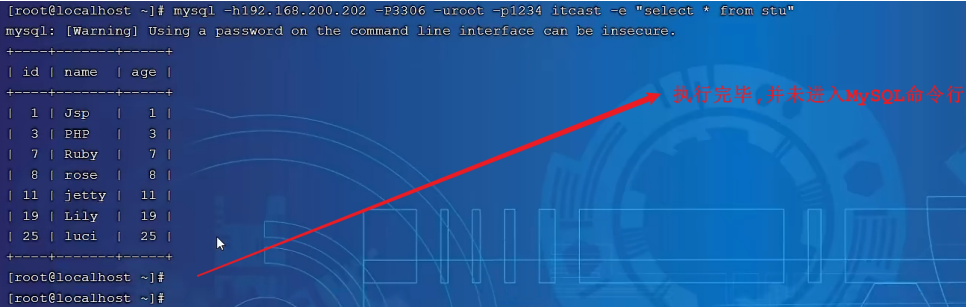
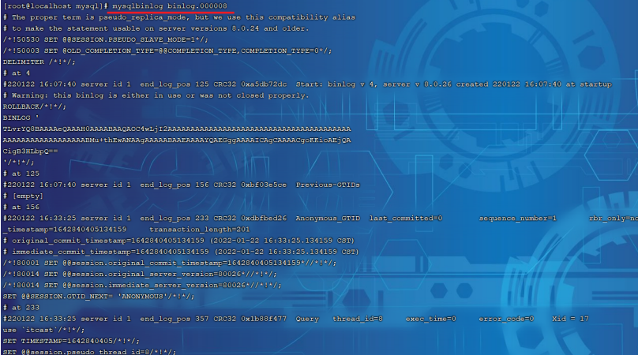
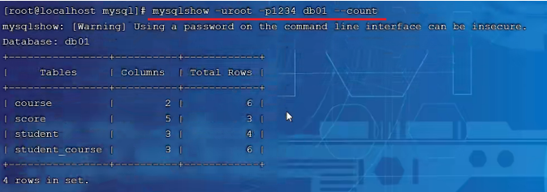
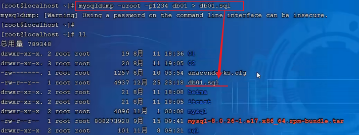
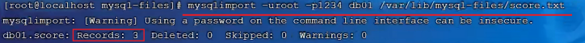

# 目录

[[toc]]

## MySQL常用工具

主要介绍几个开发过程中常用的`MySQL`工具

## mysql

该`mysql`不是指`mysql`服务，而是指`mysql`的客户端工具。

~~~
语法 ：
	mysql [options] [database]
选项 ：
	-u, --user=name #指定用户名
	-p, --password[=name] #指定密码
	-h, --host=name #指定服务器IP或域名
	-P, --port=port #指定连接端口
	-e, --execute=name #执行SQL语句并退出
~~~

`-e`选项可以在`Mysql`客户端执行`SQL`语句，而不用连接到`MySQL`数据库再执行，对于一些批处理脚本，这种方式尤其方便

示例：

~~~sql
mysql -uroot –p123456 db01 -e "select * from stu";
~~~

## mysqladmin

`mysqladmin` 是一个执行管理操作的客户端程序。

可以用它来检查服务器的配置和当前状态、创建并删除数据库等

~~~
通过帮助文档查看选项：
	mysqladmin --help

语法:
	mysqladmin [options] command ...
选项:
	-u, --user=name #指定用户名
	-p, --password[=name] #指定密码
	-h, --host=name #指定服务器IP或域名
	-P, --port=port #指定连接端口
~~~

示例：

~~~
mysqladmin -uroot –p1234 drop 'test01';

mysqladmin -uroot –p1234 version;
~~~

## mysqlbinlog

由于服务器生成的二进制日志文件以二进制格式保存，所以如果想要检查这些文本的文本格式，就会使 用到`mysqlbinlog` 日志管理工具

~~~
语法 ：
	mysqlbinlog [options] log-files1 log-files2 ...
选项 ：
	-d, --database=name 指定数据库名称，只列出指定的数据库相关操作。
	-o, --offset=# 忽略掉日志中的前n行命令。
	-r,--result-file=name 将输出的文本格式日志输出到指定文件。
	-s, --short-form 显示简单格式， 省略掉一些信息。
	--start-datatime=date1 --stop-datetime=date2 指定日期间隔内的所有日志。
	--start-position=pos1 --stop-position=pos2 指定位置间隔内的所有日志。
~~~

示例：

查看 binlog.000008这个二进制文件中的数据信息

## mysqlshow

`mysqlshow` 客户端对象查找工具，用来很快地查找存在哪些数据库、数据库中的表、表中的列或者索引。

~~~
语法 ：
	mysqlshow [options] [db_name [table_name [col_name]]]
选项 ：
	--count 显示数据库及表的统计信息（数据库，表 均可以不指定）
	-i 显示指定数据库或者指定表的状态信息
	
示例：
#查询test库中每个表中的字段书，及行数
mysqlshow -uroot -p2143 test --count
#查询test库中book表的详细情况
mysqlshow -uroot -p2143 test book --count
~~~

示例：

查询每个数据库的表的数量及表中记录的数量

~~~
mysqlshow -uroot -p1234 --count
~~~

查看数据库db01的统计信息

~~~
mysqlshow -uroot -p1234 db01 --count
~~~

## mysqldump

`mysqldump` 客户端工具用来备份数据库或在不同数据库之间进行数据迁移。

备份内容包含创建表，及插入表的`SQL`语句。

~~~
语法 ：
	mysqldump [options] db_name [tables]
	mysqldump [options] --database/-B db1 [db2 db3...]
	mysqldump [options] --all-databases/-A
连接选项 ：
	-u, --user=name 指定用户名
	-p, --password[=name] 指定密码
	-h, --host=name 指定服务器ip或域名
	-P, --port=# 指定连接端口
输出选项：
	--add-drop-database 在每个数据库创建语句前加上 drop database 语句
	--add-drop-table 在每个表创建语句前加上 drop table 语句 , 默认开启 ; 不开启 (--skip-add-drop-table)
	-n, --no-create-db 不包含数据库的创建语句
	-t, --no-create-info 不包含数据表的创建语句
	-d --no-data 不包含数据
	-T, --tab=name 自动生成两个文件：一个.sql文件，创建表结构的语句；一个.txt文件，数据文件

~~~

示例：

备份db01数据库

~~~
mysqldump -uroot -p1234 db01 > db01.sql
~~~

备份出来的数据包含： 

- 删除表的语句 
- 创建表的语句 
- 数据插入语句 

## mysqlimport

`mysqlimport` 是客户端数据导入工具，用来导入`mysqldump` 加 `-T` 参数后导出的文本文件

~~~
语法 ：
	mysqlimport [options] db_name textfile1 [textfile2...]
示例 ：
	mysqlimport -uroot -p2143 test /tmp/city.txt
~~~

## source

如果需要导入`sql`文件,可以使用`mysql`中的`source` 指令 

~~~
语法 ：
source /root/xxxxx.sql
~~~

