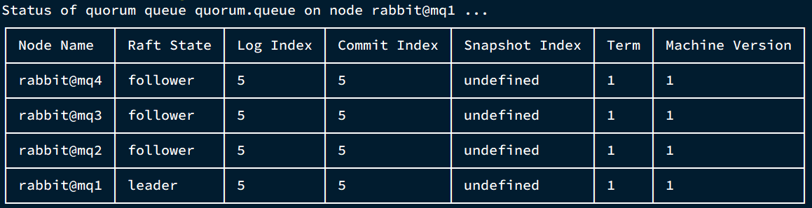
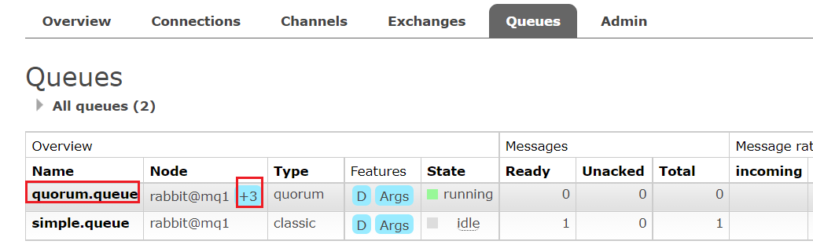

# 目录

[[toc]]

## 仲裁队列

### 集群特征

仲裁队列：仲裁队列是3.8版本以后才有的新功能，用来替代镜像队列，具备下列特征：

- 与镜像队列一样，都是主从模式，支持主从数据同步
- 使用非常简单，没有复杂的配置
- 主从同步基于Raft协议，强一致


### 部署

#### 添加仲裁队列

在任意控制台添加一个队列，一定要选择队列类型为`Quorum`类型。


在任意控制台查看队列：


可以看到，仲裁队列的 + 2字样。代表这个队列有2个镜像节点。

因为仲裁队列默认的镜像数为5。如果你的集群有7个节点，那么镜像数肯定是5；而我们集群只有3个节点，因此镜像数量就是3.


#### 测试

可以参考对镜像集群的测试，效果是一样的。


## 集群扩容

### 加入集群

1）启动一个新的`MQ`容器：

```sh
docker run -d --net mq-net \
-v ${PWD}/.erlang.cookie:/var/lib/rabbitmq/.erlang.cookie \
-e RABBITMQ_DEFAULT_USER=itcast \
-e RABBITMQ_DEFAULT_PASS=123321 \
--name mq4 \
--hostname mq5 \
-p 8074:15672 \
-p 8084:15672 \
rabbitmq:3.8-management
```

2）进入容器控制台：

```sh
docker exec -it mq4 bash
```

3）停止`mq`进程

```sh
rabbitmqctl stop_app
```


4）重置`RabbitMQ`中的数据：

```sh
rabbitmqctl reset
```


5）加入`mq1`：

```sh
rabbitmqctl join_cluster rabbit@mq1
```


6）再次启动`mq`进程

```sh
rabbitmqctl start_app
```


### 增加仲裁队列副本

我们先查看下`quorum.queue`这个队列目前的副本情况，进入`mq1`容器：

```sh
docker exec -it mq1 bash
```

执行命令：

```sh
rabbitmq-queues quorum_status "quorum.queue"
```

结果：


现在，我们让`mq4`也加入进来：

```sh
rabbitmq-queues add_member "quorum.queue" "rabbit@mq4"
```

结果：


再次查看：

```sh
rabbitmq-queues quorum_status "quorum.queue"
```




查看控制台，发现`quorum.queue`的镜像数量也从原来的 +2 变成了 +3：




## Java代码创建仲裁队列

```java
@Bean
public Queue quorumQueue() {
    return QueueBuilder
        .durable("quorum.queue") // 持久化
        .quorum() // 仲裁队列
        .build();
}
```


## SpringAMQP连接MQ集群

注意，这里用address来代替host、port方式

```java
spring:
  rabbitmq:
    addresses: 192.168.150.105:8071, 192.168.150.105:8072, 192.168.150.105:8073
    username: itcast
    password: 123321
    virtual-host: /
```


