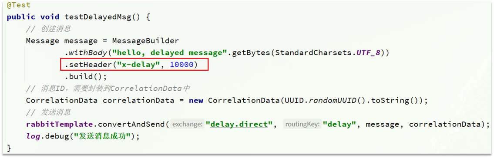

# 目录

[[toc]]

## 死信交换机

什么是死信？

当一个队列中的消息满足下列情况之一时，可以成为死信（dead letter）：

- 消费者使用`basic.reject`或 `basic.nack`声明消费失败，并且消息的`requeue`参数设置为`false`
- 消息是一个过期消息，超时无人消费
- 要投递的队列消息满了，无法投递


如果这个包含死信的队列配置了`dead-letter-exchange`属性，指定了一个交换机，那么队列中的死信就会投递到这个交换机中，而这个交换机称为**死信交换机**（Dead Letter Exchange，简称DLX）。


如图，一个消息被消费者拒绝了，变成了死信：


因为`simple.queue`绑定了死信交换机 `dl.direct`，因此死信会投递给这个交换机：


如果这个死信交换机也绑定了一个队列，则消息最终会进入这个存放死信的队列：


另外，队列将死信投递给死信交换机时，必须知道两个信息：

- 死信交换机名称
- 死信交换机与死信队列绑定的`RoutingKey`

这样才能确保投递的消息能到达死信交换机，并且正确的路由到死信队列。


### 利用死信交换机接收死信

在失败重试策略中，默认的`RejectAndDontRequeueRecoverer`会在本地重试次数耗尽后，发送`reject`给`RabbitMQ`，消息变成死信，被丢弃。


我们可以给`simple.queue`添加一个死信交换机，给死信交换机绑定一个队列。这样消息变成死信后也不会丢弃，而是最终投递到死信交换机，路由到与死信交换机绑定的队列。


我们在`consumer`服务中，定义一组死信交换机、死信队列：

```java
// 声明普通的 simple.queue队列，并且为其指定死信交换机：dl.direct
@Bean
public Queue simpleQueue2(){
    return QueueBuilder.durable("simple.queue") // 指定队列名称，并持久化
        .deadLetterExchange("dl.direct") // 指定死信交换机
        .build();
}
// 声明死信交换机 dl.direct
@Bean
public DirectExchange dlExchange(){
    return new DirectExchange("dl.direct", true, false);
}
// 声明存储死信的队列 dl.queue
@Bean
public Queue dlQueue(){
    return new Queue("dl.queue", true);
}
// 将死信队列 与 死信交换机绑定
@Bean
public Binding dlBinding(){
    return BindingBuilder.bind(dlQueue()).to(dlExchange()).with("simple");
}
```

### 总结

什么样的消息会成为死信？

- 消息被消费者`reject`或者返回`nack`
- 消息超时未消费
- 队列满了

死信交换机的使用场景是什么？

- 如果队列绑定了死信交换机，死信会投递到死信交换机；
- 可以利用死信交换机收集所有消费者处理失败的消息（死信），交由人工处理，进一步提高消息队列的可靠性。


## TTL

一个队列中的消息如果超时未消费，则会变为死信，超时分为两种情况：

- 消息所在的队列设置了超时时间
- 消息本身设置了超时时间


### 接收超时死信的死信交换机

在`consumer`服务的`SpringRabbitListener`中，定义一个新的消费者，并且声明 死信交换机、死信队列：

```java
@RabbitListener(bindings = @QueueBinding(
    value = @Queue(name = "dl.ttl.queue", durable = "true"),
    exchange = @Exchange(name = "dl.ttl.direct"),
    key = "ttl"
))
public void listenDlQueue(String msg){
    log.info("接收到 dl.ttl.queue的延迟消息：{}", msg);
}
```


### 声明一个队列，并且指定TTL

要给队列设置超时时间，需要在声明队列时配置`x-message-ttl`属性：

```java
@Bean
public Queue ttlQueue(){
    return QueueBuilder.durable("ttl.queue") // 指定队列名称，并持久化
        .ttl(10000) // 设置队列的超时时间，10秒
        .deadLetterExchange("dl.ttl.direct") // 指定死信交换机
        .build();
}
```

注意，这个队列设定了死信交换机为`dl.ttl.direct`


声明交换机，将ttl与交换机绑定：

```java
@Bean
public DirectExchange ttlExchange(){
    return new DirectExchange("ttl.direct");
}
@Bean
public Binding ttlBinding(){
    return BindingBuilder.bind(ttlQueue()).to(ttlExchange()).with("ttl");
}
```


发送消息，但是不要指定TTL：

```java
@Test
public void testTTLQueue() {
    // 创建消息
    String message = "hello, ttl queue";
    // 消息ID，需要封装到CorrelationData中
    CorrelationData correlationData = new CorrelationData(UUID.randomUUID().toString());
    // 发送消息
    rabbitTemplate.convertAndSend("ttl.direct", "ttl", message, correlationData);
    // 记录日志
    log.debug("发送消息成功");
}
```

发送消息的日志：


查看下接收消息的日志：


因为队列的`TTL`值是10000ms，也就是10秒。可以看到消息发送与接收之间的时差刚好是10秒。


### 发送消息时，设定TTL

在发送消息时，也可以指定`TTL`

```java
@Test
public void testTTLMsg() {
    // 创建消息
    Message message = MessageBuilder
        .withBody("hello, ttl message".getBytes(StandardCharsets.UTF_8))
        .setExpiration("5000")
        .build();
    // 消息ID，需要封装到CorrelationData中
    CorrelationData correlationData = new CorrelationData(UUID.randomUUID().toString());
    // 发送消息
    rabbitTemplate.convertAndSend("ttl.direct", "ttl", message, correlationData);
    log.debug("发送消息成功");
}
```


查看发送消息日志：


接收消息日志：


这次，发送与接收的延迟只有5秒。说明当队列、消息都设置了`TTL`时，任意一个到期就会成为死信。


### 总结

消息超时的两种方式是？

- 给队列设置`ttl`属性，进入队列后超过`ttl`时间的消息变为死信
- 给消息设置`ttl`属性，队列接收到消息超过`ttl`时间后变为死信


## 延迟队列

利用`TTL`结合死信交换机，我们实现了消息发出后，消费者延迟收到消息的效果。这种消息模式就称为延迟队列（Delay Queue）模式。

延迟队列的使用场景包括：

- 延迟发送短信
- 用户下单，如果用户在15 分钟内未支付，则自动取消
- 预约工作会议，20分钟后自动通知所有参会人员


因为延迟队列的需求非常多，所以`RabbitMQ`的官方也推出了一个插件，原生支持延迟队列效果。

这个插件就是`DelayExchange`插件。

参考`RabbitMQ`的插件列表页面：https://www.rabbitmq.com/community-plugins.html


使用方式可以参考官网地址：https://blog.rabbitmq.com/posts/2015/04/scheduling-messages-with-rabbitmq


### 安装DelayExchange插件

这里为基于Docker来安装RabbitMQ插件。

> 基于linux原生安装RabbitMQ，然后安装插件指南地址为：https://blog.rabbitmq.com/posts/2015/04/scheduling-messages-with-rabbitmq

#### 下载插件

`RabbitMQ`有一个官方的插件社区，地址为：https://www.rabbitmq.com/community-plugins.html

其中包含各种各样的插件，包括我们要使用的`DelayExchange`插件：


大家可以去对应的`GitHub`页面下载`3.8.9`版本的插件，地址为https://github.com/rabbitmq/rabbitmq-delayed-message-exchange/releases/tag/3.8.9这个对应`RabbitMQ`的`3.8.5`以上版本。

#### 上传插件

因为我们是基于`Docker`安装，所以需要先查看`RabbitMQ`的插件目录对应的数据卷。

我们之前设定的`RabbitMQ`的数据卷名称为`mq-plugins`，所以我们使用下面命令查看数据卷：

```sh
docker volume inspect mq-plugins
```

可以得到下面结果：


接下来，将插件上传到这个目录即可：


#### 安装插件

最后就是安装了，需要进入`MQ`容器内部来执行安装。我的容器名为`mq`，所以执行下面命令：

```sh
docker exec -it mq bash
```

执行时，请将其中的 `-it` 后面的`mq`替换为你自己的容器名.

进入容器内部后，执行下面命令开启插件：

```sh
rabbitmq-plugins enable rabbitmq_delayed_message_exchange
```

结果如下：


### DelayExchange原理

`DelayExchange`需要将一个交换机声明为`delayed`类型。当我们发送消息到`delayExchange`时，流程如下：

- 接收消息
- 判断消息是否具备x-delay属性
- 如果有`x-delay`属性，说明是延迟消息，持久化到硬盘，读取`x-delay`值，作为延迟时间
- 返回`routing not found`结果给消息发送者
- `x-delay`时间到期后，重新投递消息到指定队列


### 使用DelayExchange

插件的使用也非常简单：声明一个交换机，交换机的类型可以是任意类型，只需要设定`delayed`属性为`true`即可，然后声明队列与其绑定即可。

#### 1）声明DelayExchange交换机

基于注解方式（推荐）：


也可以基于@Bean的方式：


#### 2）发送消息

发送消息时，一定要携带`x-delay`属性，指定延迟的时间：




### 总结

延迟队列插件的使用步骤包括哪些？

•声明一个交换机，添加`delayed`属性为`true`

•发送消息时，添加`x-delay`头，值为超时时间


