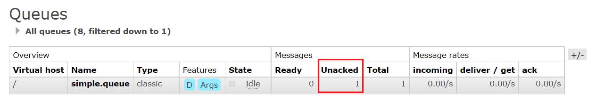

# 目录

[[toc]]

## 消息可靠性

消息从发送，到消费者接收，会经理多个过程：


其中的每一步都可能导致消息丢失，常见的丢失原因包括：

- 发送时丢失：
  - 生产者发送的消息未送达`exchange`
  - 消息到达`exchange`后未到达`queue`
- `MQ`宕机，`queue`将消息丢失
- `consumer`接收到消息后未消费就宕机


针对这些问题，`RabbitMQ`分别给出了解决方案：

- 生产者确认机制
- mq持久化
- 消费者确认机制
- 失败重试机制


## 生产者消息确认

`RabbitMQ`提供了`publisher confirm`机制来避免消息发送到`MQ`过程中丢失。

这种机制必须给每个消息指定一个**唯一ID**。

消息发送到`MQ`以后，会返回一个结果给发送者，表示消息是否处理成功。

返回结果有两种方式：

- `publisher-confirm`，发送者确认
  - 消息成功投递到交换机，返回`ack`
  - 消息未投递到交换机，返回`nack`
- `publisher-return`，发送者回执
  - 消息投递到交换机了，但是没有路由到队列。返回`ACK`，及路由失败原因。


注意：


### 修改配置

首先，修改`publisher`服务中的`application.yml`文件，添加下面的内容：

```yaml
spring:
  rabbitmq:
    publisher-confirm-type: correlated
    publisher-returns: true
    template:
      mandatory: true
   
```

说明：

- `publish-confirm-type`：开启`publisher-confirm`，这里支持两种类型：
  - `simple`：同步等待`confirm`结果，直到超时
  - `correlated`：异步回调，定义`ConfirmCallback`，`MQ`返回结果时会回调这个`ConfirmCallback`
- `publish-returns`：开启`publish-return`功能，同样是基于`callback`机制，不过是定义`ReturnCallback`
- `template.mandatory`：定义消息路由失败时的策略。
  - `true`，则调用`ReturnCallback`；
  - `false`：则直接丢弃消息


### 定义Return回调

每个`RabbitTemplate`只能配置一个`ReturnCallback`，因此需要在项目加载时配置：

修改`publisher`服务，添加一个：

```java
@Slf4j
@Configuration
public class CommonConfig implements ApplicationContextAware {
    @Override
    public void setApplicationContext(ApplicationContext applicationContext) throws BeansException {
        // 获取RabbitTemplate
        RabbitTemplate rabbitTemplate = applicationContext.getBean(RabbitTemplate.class);
        // 设置ReturnCallback
        rabbitTemplate.setReturnCallback((message, replyCode, replyText, exchange, routingKey) -> {
            // 投递失败，记录日志
            log.info("消息发送失败，应答码{}，原因{}，交换机{}，路由键{},消息{}",
                     replyCode, replyText, exchange, routingKey, message.toString());
            // 如果有业务需要，可以重发消息
        });
    }
}
```


### 定义ConfirmCallback

`ConfirmCallback`可以在发送消息时指定，因为每个业务处理`confirm`成功或失败的逻辑不一定相同。

在`publisher`服务

```java
public void testSendMessage2SimpleQueue() throws InterruptedException {
    // 1.消息体
    String message = "hello, spring amqp!";
    // 2.全局唯一的消息ID，需要封装到CorrelationData中
    CorrelationData correlationData = new CorrelationData(UUID.randomUUID().toString());
    // 3.添加callback
    correlationData.getFuture().addCallback(
        result -> {
            if(result.isAck()){
                // 3.1.ack，消息成功
                log.debug("消息发送成功, ID:{}", correlationData.getId());
            }else{
                // 3.2.nack，消息失败
                log.error("消息发送失败, ID:{}, 原因{}",correlationData.getId(), result.getReason());
            }
        },
        ex -> log.error("消息发送异常, ID:{}, 原因{}",correlationData.getId(),ex.getMessage())
    );
    // 4.发送消息
    rabbitTemplate.convertAndSend("task.direct", "task", message, correlationData);

    // 休眠一会儿，等待ack回执
    Thread.sleep(2000);
}
```


## 消息持久化

生产者确认可以确保消息投递到`RabbitMQ`的队列中，但是消息发送到`RabbitMQ`以后，如果突然宕机，也可能导致消息丢失。

要想确保消息在`RabbitMQ`中安全保存，必须开启消息持久化机制。

- 交换机持久化
- 队列持久化
- 消息持久化


### 交换机持久化

`RabbitMQ`中交换机默认是非持久化的，`mq`重启后就丢失。

`SpringAMQP`中可以通过代码指定交换机持久化：

```java
@Bean
public DirectExchange simpleExchange(){
    // 三个参数：交换机名称、是否持久化、当没有queue与其绑定时是否自动删除
    return new DirectExchange("simple.direct", true, false);
}
```

事实上，默认情况下，由`SpringAMQP`声明的交换机都是持久化的。


可以在`RabbitMQ`控制台看到持久化的交换机都会带上`D`的标示：


### 队列持久化

`RabbitMQ`中队列默认是非持久化的，`mq`重启后就丢失。

`SpringAMQP`中可以通过代码指定交换机持久化：

```java
@Bean
public Queue simpleQueue(){
    // 使用QueueBuilder构建队列，durable就是持久化的
    return QueueBuilder.durable("simple.queue").build();
}
```

事实上，默认情况下，由`SpringAMQP`声明的队列都是持久化的。

可以在RabbitMQ控制台看到持久化的队列都会带上`D`的标示：


### 消息持久化

利用`SpringAMQP`发送消息时，可以设置消息的属性（MessageProperties），指定`delivery-mode`：

- 1：非持久化
- 2：持久化

用java代码指定：


默认情况下，`SpringAMQP`发出的任何消息都是持久化的，不用特意指定。


## 消费者消息确认

`RabbitMQ`是**阅后即焚**机制，`RabbitMQ`确认消息被消费者消费后会立刻删除。

而`RabbitMQ`是通过消费者回执来确认消费者是否成功处理消息的：消费者获取消息后，应该向`RabbitMQ`发送`ACK`回执，表明自己已经处理消息。


设想这样的场景：

- 1）`RabbitMQ`投递消息给消费者
- 2）消费者获取消息后，返回`ACK`给`RabbitMQ`
- 3）`RabbitMQ`删除消息
- 4）消费者宕机，消息尚未处理

这样，消息就丢失了。因此消费者返回`ACK`的时机非常重要。


而`SpringAMQP`则允许配置三种确认模式：

•`manual`：手动`ack`，需要在业务代码结束后，调用`api`发送`ack`。

•`auto`：自动`ack`，由`spring`监测`listener`代码是否出现异常，没有异常则返回`ack`；抛出异常则返回`nack`

•`none`：关闭`ack`，`MQ`假定消费者获取消息后会成功处理，因此消息投递后立即被删除


由此可知：

- `none`模式下，消息投递是不可靠的，可能丢失
- `auto`模式类似事务机制，出现异常时返回`nack`，消息回滚到`mq`；没有异常，返回`ack`
- `manual`：自己根据业务情况，判断什么时候该`ack`

一般，我们都是使用默认的`auto`即可。


### 演示none模式

修改`consumer`服务的`application.yml`文件，添加下面内容：

```yaml
spring:
  rabbitmq:
    listener:
      simple:
        acknowledge-mode: none # 关闭ack
```

修改`consumer`服务的`SpringRabbitListener`类中的方法，模拟一个消息处理异常：

```java
@RabbitListener(queues = "simple.queue")
public void listenSimpleQueue(String msg) {
    log.info("消费者接收到simple.queue的消息：【{}】", msg);
    // 模拟异常
    System.out.println(1 / 0);
    log.debug("消息处理完成！");
}
```

测试可以发现，当消息处理抛异常时，消息依然被`RabbitMQ`删除了。


### 演示auto模式

再次把确认机制修改为`auto`:

```yaml
spring:
  rabbitmq:
    listener:
      simple:
        acknowledge-mode: auto # 关闭ack
```

在异常位置打断点，再次发送消息，程序卡在断点时，可以发现此时消息状态为unack（未确定状态）：



抛出异常后，因为`Spring`会自动返回`nack`，所以消息恢复至`Ready`状态，并且没有被`RabbitMQ`删除：


## 消费失败重试机制

当消费者出现异常后，消息会不断`requeue`（重入队）到队列，再重新发送给消费者，然后再次异常，再次`requeue`，无限循环，导致`mq`的消息处理飙升，带来不必要的压力：


怎么办呢？


### 本地重试

我们可以利用`Spring`的`retry`机制，在消费者出现异常时利用本地重试，而不是无限制的`requeue`到`mq`队列。

修改`consumer`服务的`application.yml`文件，添加内容：

```yaml
spring:
  rabbitmq:
    listener:
      simple:
        retry:
          enabled: true # 开启消费者失败重试
          initial-interval: 1000 # 初识的失败等待时长为1秒
          multiplier: 1 # 失败的等待时长倍数，下次等待时长 = multiplier * last-interval
          max-attempts: 3 # 最大重试次数
          stateless: true # true无状态；false有状态。如果业务中包含事务，这里改为false
```


重启`consumer`服务，重复之前的测试。可以发现：

- 在重试3次后，`SpringAMQP`会抛出异常`AmqpRejectAndDontRequeueException`，说明本地重试触发了
- 查看`RabbitMQ`控制台，发现消息被删除了，说明最后`SpringAMQP`返回的是`ack`，`mq`删除消息了


结论：

- 开启本地重试时，消息处理过程中抛出异常，不会`requeue`到队列，而是在消费者本地重试
- 重试达到最大次数后，`Spring`会返回`ack`，消息会被丢弃


### 失败策略

在之前的测试中，达到最大重试次数后，消息会被丢弃，这是由`Spring`内部机制决定的。

在开启重试模式后，重试次数耗尽，如果消息依然失败，则需要有`MessageRecovery`接口来处理，它包含三种不同的实现：

- `RejectAndDontRequeueRecoverer`：重试耗尽后，直接`reject`，丢弃消息。默认就是这种方式

- `ImmediateRequeueMessageRecoverer`：重试耗尽后，返回`nack`，消息重新入队

- `RepublishMessageRecoverer`：重试耗尽后，将失败消息投递到指定的交换机


比较优雅的一种处理方案是`RepublishMessageRecoverer`，失败后将消息投递到一个指定的，专门存放异常消息的队列，后续由人工集中处理。


1）在`consumer`服务中定义处理失败消息的交换机和队列

```java
@Bean
public DirectExchange errorMessageExchange(){
    return new DirectExchange("error.direct");
}
@Bean
public Queue errorQueue(){
    return new Queue("error.queue", true);
}
@Bean
public Binding errorBinding(Queue errorQueue, DirectExchange errorMessageExchange){
    return BindingBuilder.bind(errorQueue).to(errorMessageExchange).with("error");
}
```


2）定义一个`RepublishMessageRecoverer`，关联队列和交换机

```java
@Bean
public MessageRecoverer republishMessageRecoverer(RabbitTemplate rabbitTemplate){
    return new RepublishMessageRecoverer(rabbitTemplate, "error.direct", "error");
}
```


完整代码：

```java
@Configuration
public class ErrorMessageConfig {
    @Bean
    public DirectExchange errorMessageExchange(){
        return new DirectExchange("error.direct");
    }
    @Bean
    public Queue errorQueue(){
        return new Queue("error.queue", true);
    }
    @Bean
    public Binding errorBinding(Queue errorQueue, DirectExchange errorMessageExchange){
        return BindingBuilder.bind(errorQueue).to(errorMessageExchange).with("error");
    }

    @Bean
    public MessageRecoverer republishMessageRecoverer(RabbitTemplate rabbitTemplate){
        return new RepublishMessageRecoverer(rabbitTemplate, "error.direct", "error");
    }
}
```


## 总结

如何确保`RabbitMQ`消息的可靠性？

- 开启生产者确认机制，确保生产者的消息能到达队列
- 开启持久化功能，确保消息未消费前在队列中不会丢失
- 开启消费者确认机制为`auto`，由`spring`确认消息处理成功后完成`ack`
- 开启消费者失败重试机制，并设置`MessageRecoverer`，多次重试失败后将消息投递到异常交换机，交由人工处理
