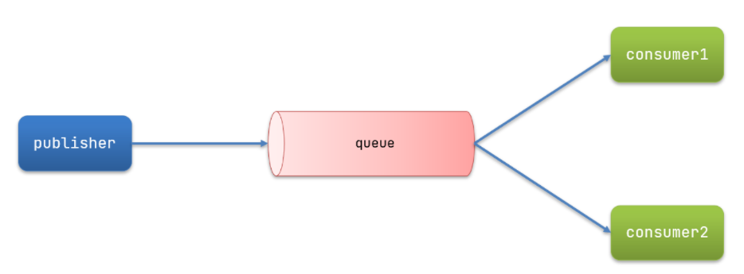
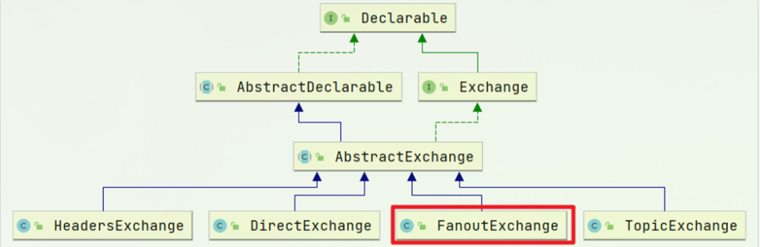
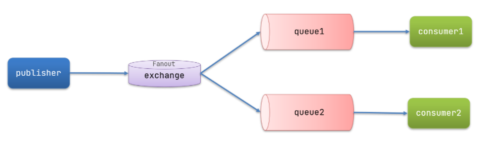
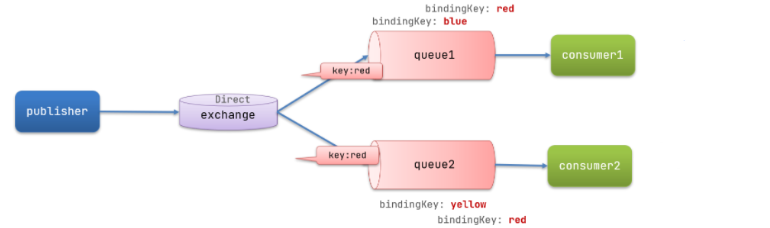
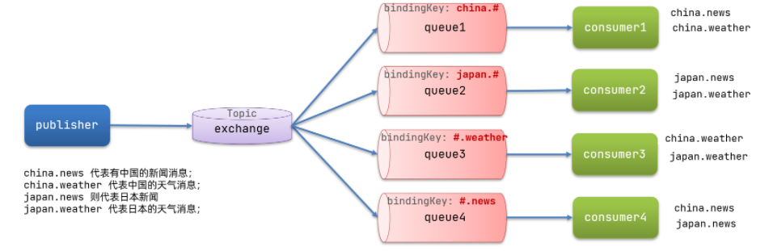

# 目录

[[toc]]


消息队列目前主要 5 种模式：

- 基本消息队列（BasicQueue）
- 工作消息队列（WorkQueue）
- 发布订阅（Publish、Subscribe）
   - `Fanout Exchange`：广播，将消息交给所有绑定到交换机的队列
   - `Direct Exchange`：路由，把消息交给符合指定`routing key` 的队列
   - `Topic Exchange`：主题、通配符，把消息交给符合`routing pattern`（路由模式） 的队列
## 基本消息队列 BasicQueue


案例

```java
public class Publisher {

    @Autowired
    private RabbitTemplate rabbitTemplate;

    public void testSimpleQueue() {
        // 队列名称
        String queueName = "simple.queue";
        // 消息
        String message = "hello, spring amqp!";
        // 发送消息
        rabbitTemplate.convertAndSend(queueName, message);
    }
}
```
```java
@Component
public class SpringRabbitListener {

    @RabbitListener(queues = "simple.queue")
    public void listenSimpleQueueMessage(String msg) throws InterruptedException {
        System.out.println("spring 消费者接收到消息：【" + msg + "】");
    }
}
```
## 工作消息队列 WorkQueue
**让多个消费者绑定到一个队列，共同消费队列中的消息**

> 注：多个消费者绑定到一个队列，同一条消息只会被一个消费者处理

当消息处理比较耗时的时候，可能生产消息的速度会远远大于消息的消费速度。长此以往，消息就会堆积越来越多，无法及时处理。

此时就可以使用`work` 模型，多个消费者共同处理消息处理，速度就能大大提高了



```java
/**
     * workQueue
     * 向队列中不停发送消息，模拟消息堆积。
     */
public void testWorkQueue() throws InterruptedException {
    // 队列名称
    String queueName = "simple.queue";
    // 消息
    String message = "hello, message_";
    for (int i = 0; i < 50; i++) {
        // 发送消息
        rabbitTemplate.convertAndSend(queueName, message + i);
        Thread.sleep(20);
    }
}
```
```java
@RabbitListener(queues = "simple.queue")
public void listenWorkQueue1(String msg) throws InterruptedException {
    System.out.println("消费者1接收到消息：【" + msg + "】" + LocalTime.now());
    Thread.sleep(20);
}

@RabbitListener(queues = "simple.queue")
public void listenWorkQueue2(String msg) throws InterruptedException {
    System.err.println("消费者2........接收到消息：【" + msg + "】" + LocalTime.now());
    Thread.sleep(200);
}
```
**结果：**

消息是平均分配给每个消费者，并没有考虑到消费者的处理能力。这样显然是有问题的

解决：

修改`consumer`服务的`application.yml`文件，添加配置

```yaml
spring:
  rabbitmq:
    listener:
      simple:
        prefetch: 1 # 每次只能获取一条消息，处理完成才能获取下一个消息
```
## 声明队列和交换机
Spring提供了一个接口`Exchange`，来表示所有不同类型的交换机：



### 普通方式
```java
@Configuration
public class FanoutConfig {
    /**
     * 声明交换机
     * @return Fanout类型交换机
     */
    @Bean
    public FanoutExchange fanoutExchange(){
        return new FanoutExchange("itcast.fanout");
    }

    /**
     * 第1个队列
     */
    @Bean
    public Queue fanoutQueue1(){
        return new Queue("fanout.queue1");
    }

    /**
     * 绑定队列和交换机
     */
    @Bean
    public Binding bindingQueue1(Queue fanoutQueue1, FanoutExchange fanoutExchange){
        return BindingBuilder.bind(fanoutQueue1).to(fanoutExchange);
    }

    /**
     * 第2个队列
     */
    @Bean
    public Queue fanoutQueue2(){
        return new Queue("fanout.queue2");
    }

    /**
     * 绑定队列和交换机
     */
    @Bean
    public Binding bindingQueue2(Queue fanoutQueue2, FanoutExchange fanoutExchange){
        return BindingBuilder.bind(fanoutQueue2).to(fanoutExchange);
    }
}
```
### 基于注解
在`consumer`的`SpringRabbitListener`中添加两个消费者，同时基于注解来声明队列和交换机
```java
@RabbitListener(bindings = @QueueBinding(
    value = @Queue(name = "direct.queue1"),
    exchange = @Exchange(name = "itcast.direct", type = ExchangeTypes.DIRECT),
    key = {"red", "blue"}
))
public void listenDirectQueue1(String msg){
    System.out.println("消费者接收到direct.queue1的消息：【" + msg + "】");
}

@RabbitListener(bindings = @QueueBinding(
    value = @Queue(name = "direct.queue2"),
    exchange = @Exchange(name = "itcast.direct", type = ExchangeTypes.DIRECT),
    key = {"red", "yellow"}
))
public void listenDirectQueue2(String msg){
    System.out.println("消费者接收到direct.queue2的消息：【" + msg + "】");
}
```
## 广播 Fanout Exchange


将消息交给所有绑定到交换机的队列，一条消息，会被所有订阅的队列都消费

在广播模式下，消息发送流程是这样的：

- 1） 可以有多个队列
- 2） 每个队列都要绑定到Exchange（交换机）
- 3） 生产者发送的消息，只能发送到交换机，交换机来决定要发给哪个队列，生产者无法决定
- 4） 交换机把消息发送给绑定过的所有队列
- 5） 订阅队列的消费者都能拿到消息
```java
public void testFanoutExchange() {
    // 交换机名称
    String exchangeName = "itcast.fanout";
    // 消息
    String message = "hello, everyone!";
    rabbitTemplate.convertAndSend(exchangeName, "", message);
}
```
```java
//新建一个配置类，按照上面的两种方式声明队列和交换机

@Component
public class SpringRabbitListener {
    
	@RabbitListener(queues = "fanout.queue1")
	public void listenFanoutQueue1(String msg) {
    	System.out.println("消费者1接收到Fanout消息：【" + msg + "】");
	}

	@RabbitListener(queues = "fanout.queue2")
	public void listenFanoutQueue2(String msg) {
  	  System.out.println("消费者2接收到Fanout消息：【" + msg + "】");
	}
}
```
## 路由 Direct Exchange


在某些场景下，我们希望不同的消息被不同的队列消费。这时就要用到`Direct`类型的`Exchange`。

在`Direct`模型下：

- 队列与交换机的绑定，不能是任意绑定了，而是要指定一个`RoutingKey`（路由key）
- 消息的发送方在向 `Exchange`发送消息时，也必须指定消息的 `RoutingKey`。
- `Exchange`不再把消息交给每一个绑定的队列，而是根据消息的`Routing Key`进行判断，只有队列的`Routingkey`与消息的 `Routing key`完全一致，才会接收到消息
```java
@RabbitListener(bindings = @QueueBinding(
    value = @Queue(name = "direct.queue1"),
    exchange = @Exchange(name = "itcast.direct", type = ExchangeTypes.DIRECT),
    key = {"red", "blue"}
))
public void listenDirectQueue1(String msg){
    System.out.println("消费者接收到direct.queue1的消息：【" + msg + "】");
}

@RabbitListener(bindings = @QueueBinding(
    value = @Queue(name = "direct.queue2"),
    exchange = @Exchange(name = "itcast.direct", type = ExchangeTypes.DIRECT),
    key = {"red", "yellow"}
))
public void listenDirectQueue2(String msg){
    System.out.println("消费者接收到direct.queue2的消息：【" + msg + "】");
}
```
```java
public void testSendDirectExchange() {
    // 交换机名称
    String exchangeName = "itcast.direct";
    // 消息
    String message = "红色警报！日本乱排核废水，导致海洋生物变异，惊现哥斯拉！";
    // 发送消息
    rabbitTemplate.convertAndSend(exchangeName, "red", message);
}
```
## 主题 Topic Exchange


把消息交给符合`routing pattern`（路由模式) 的队列

`Topic`类型的`Exchange`与`Direct`相比，都是可以根据`RoutingKey`把消息路由到不同的队列。只不过`Topic`类型`Exchange`可以让队列在绑定`Routing key` 的时候使用通配符

`Routingkey` 一般都是有一个或多个单词组成，多个单词之间以”`.`”分割，例如： item.insert

通配符规则：

`#`：匹配一个或多个词

`*`：匹配不多不少恰好1个词

*举例：*

`item.#`：能够匹配item.spu.insert 或者 item.spu

`item.*`：只能匹配item.spu

```java
/**
     * topicExchange
     */
public void testSendTopicExchange() {
    // 交换机名称
    String exchangeName = "itcast.topic";
    // 消息
    String message = "喜报！孙悟空大战哥斯拉，胜!";
    // 发送消息
    rabbitTemplate.convertAndSend(exchangeName, "china.news", message);
}
```
```java
@RabbitListener(bindings = @QueueBinding(
    value = @Queue(name = "topic.queue1"),
    exchange = @Exchange(name = "itcast.topic", type = ExchangeTypes.TOPIC),
    key = "china.#"
))
public void listenTopicQueue1(String msg){
    System.out.println("消费者接收到topic.queue1的消息：【" + msg + "】");
}

@RabbitListener(bindings = @QueueBinding(
    value = @Queue(name = "topic.queue2"),
    exchange = @Exchange(name = "itcast.topic", type = ExchangeTypes.TOPIC),
    key = "#.news"
))
public void listenTopicQueue2(String msg){
    System.out.println("消费者接收到topic.queue2的消息：【" + msg + "】");
}
```
