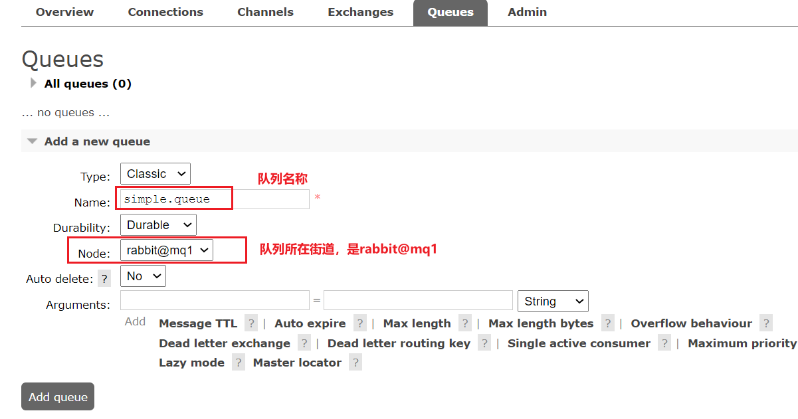

# 目录

[[toc]]

## MQ集群

### 集群分类

`RabbitMQ`的是基于`Erlang`语言编写，而`Erlang`又是一个面向并发的语言，天然支持集群模式。`RabbitMQ`的集群有两种模式：

•**普通集群**：是一种分布式集群，将队列分散到集群的各个节点，从而提高整个集群的并发能力。

•**镜像集群**：是一种主从集群，普通集群的基础上，添加了主从备份功能，提高集群的数据可用性。


镜像集群虽然支持主从，但主从同步并不是强一致的，某些情况下可能有数据丢失的风险。因此在`RabbitMQ的3.8`版本以后，推出了新的功能：**仲裁队列**来代替镜像集群，底层采用`Raft`协议确保主从的数据一致性。


## 普通集群

### 集群结构和特征

普通集群，或者叫标准集群（classic cluster），具备下列特征：

- 会在集群的各个节点间共享部分数据，包括：交换机、队列元信息。不包含队列中的消息。
- 当访问集群某节点时，如果队列不在该节点，会从数据所在节点传递到当前节点并返回
- 队列所在节点宕机，队列中的消息就会丢失

结构如图：


### 部署

我们的计划部署3节点的`mq`集群

| 主机名 | 控制台端口      | amqp通信端口    |
| ------ | --------------- | --------------- |
| mq1    | 8081 ---> 15672 | 8071 ---> 5672  |
| mq2    | 8082 ---> 15672 | 8072 ---> 5672  |
| mq3    | 8083 ---> 15672 | 8073  ---> 5672 |

集群中的节点标示默认都是：`rabbit@[hostname]`，因此以上三个节点的名称分别为：

- rabbit@mq1
- rabbit@mq2
- rabbit@mq3

### 获取cookie

集群模式中的每个`RabbitMQ` 节点使用 `cookie` 来确定它们是否被允许相互通信。

要使两个节点能够通信，它们必须具有相同的共享秘密，称为**Erlang cookie**。`cookie` 只是一串最多 `255` 个字符的字母数字字符。

每个集群节点必须具有**相同的 cookie**。实例之间也需要它来相互通信。


我们先在之前启动的`mq`容器中获取一个`cookie`值，作为集群的`cookie`。执行下面的命令：

```sh
docker exec -it mq cat /var/lib/rabbitmq/.erlang.cookie
```

可以看到`cookie`值如下：

```sh
FXZMCVGLBIXZCDEMMVZQ
```


接下来，停止并删除当前的`mq`容器，我们重新搭建集群。

```sh
docker rm -f mq
```

### 准备集群配置

在/tmp目录新建一个配置文件 `rabbitmq.conf`

```sh
cd /tmp
# 创建文件
touch rabbitmq.conf
```

文件内容如下：

```nginx
loopback_users.guest = false
listeners.tcp.default = 5672
cluster_formation.peer_discovery_backend = rabbit_peer_discovery_classic_config
cluster_formation.classic_config.nodes.1 = rabbit@mq1
cluster_formation.classic_config.nodes.2 = rabbit@mq2
cluster_formation.classic_config.nodes.3 = rabbit@mq3
```


再创建一个文件，记录`cookie`

```sh
cd /tmp
# 创建cookie文件
touch .erlang.cookie
# 写入cookie
echo "FXZMCVGLBIXZCDEMMVZQ" > .erlang.cookie
# 修改cookie文件的权限
chmod 600 .erlang.cookie
```


准备三个目录,mq1、mq2、mq3：

```sh
cd /tmp
# 创建目录
mkdir mq1 mq2 mq3
```


然后拷贝`rabbitmq.conf`、`cookie`文件到mq1、mq2、mq3：

```sh
# 进入/tmp
cd /tmp
# 拷贝
cp rabbitmq.conf mq1
cp rabbitmq.conf mq2
cp rabbitmq.conf mq3
cp .erlang.cookie mq1
cp .erlang.cookie mq2
cp .erlang.cookie mq3
```


### 启动集群

创建一个网络：

```sh
docker network create mq-net
```


docker volume create 


运行命令

```sh
docker run -d --net mq-net \
-v ${PWD}/mq1/rabbitmq.conf:/etc/rabbitmq/rabbitmq.conf \
-v ${PWD}/.erlang.cookie:/var/lib/rabbitmq/.erlang.cookie \
-e RABBITMQ_DEFAULT_USER=itcast \
-e RABBITMQ_DEFAULT_PASS=123321 \
--name mq1 \
--hostname mq1 \
-p 8071:5672 \
-p 8081:15672 \
rabbitmq:3.8-management
```


```sh
docker run -d --net mq-net \
-v ${PWD}/mq2/rabbitmq.conf:/etc/rabbitmq/rabbitmq.conf \
-v ${PWD}/.erlang.cookie:/var/lib/rabbitmq/.erlang.cookie \
-e RABBITMQ_DEFAULT_USER=itcast \
-e RABBITMQ_DEFAULT_PASS=123321 \
--name mq2 \
--hostname mq2 \
-p 8072:5672 \
-p 8082:15672 \
rabbitmq:3.8-management
```


```sh
docker run -d --net mq-net \
-v ${PWD}/mq3/rabbitmq.conf:/etc/rabbitmq/rabbitmq.conf \
-v ${PWD}/.erlang.cookie:/var/lib/rabbitmq/.erlang.cookie \
-e RABBITMQ_DEFAULT_USER=itcast \
-e RABBITMQ_DEFAULT_PASS=123321 \
--name mq3 \
--hostname mq3 \
-p 8073:5672 \
-p 8083:15672 \
rabbitmq:3.8-management
```


### 测试

在mq1这个节点上添加一个队列：



如图，在mq2和mq3两个控制台也都能看到：


### 数据共享测试

点击这个队列，进入管理页面：


然后利用控制台发送一条消息到这个队列：


结果在mq2、mq3上都能看到这条消息：


### 可用性测试

我们让其中一台节点mq1宕机：

```sh
docker stop mq1
```

然后登录mq2或mq3的控制台，发现simple.queue也不可用了：


> 说明数据并没有拷贝到mq2和mq3。


