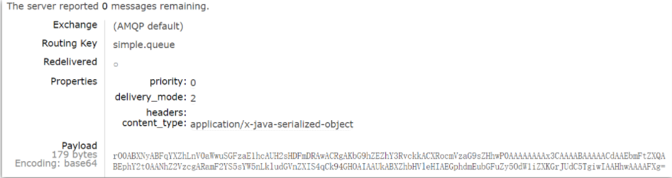
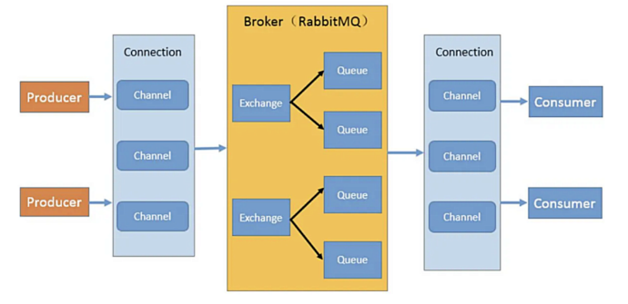

# 目录

[[toc]]

## AMQP依赖

~~~xml
<!--AMQP依赖，包含RabbitMQ-->
<dependency>
  <groupId>org.springframework.boot</groupId>
  <artifactId>spring-boot-starter-amqp</artifactId>
</dependency>

<!--配置JSON格式消息转换器，需要在容器中添加 MessageConverter 的Bean-->
<!--具体请看 配置JSON格式转换器篇-->
<dependency>
  <groupId>com.fasterxml.jackson.dataformat</groupId>
  <artifactId>jackson-dataformat-xml</artifactId>
  <version>2.9.10</version>
</dependency>
~~~

## RabbitMQ配置

```yaml
# 发送端、接收端都要配置
spring:
  rabbitmq:
    host: 192.168.150.101 # 主机名
    port: 5672 # 端口
    virtual-host: / # 虚拟主机
    username: itcast # 用户名
    password: 123321 # 密码
    listener:
      simple:
        prefetch: 1 # 每次只能获取一条消息，处理完成才能获取下一个消息
        acknowledge-mode: none # none关闭ack、auto自动ack、manual手动ack
        retry:
          enabled: true # 开启消费者失败重试
          initial-interval: 1000 # 初识的失败等待时长为1秒
          multiplier: 1 # 失败的等待时长倍数，下次等待时长 = multiplier * last-interval
          max-attempts: 3 # 最大重试次数
          stateless: true # true无状态；false有状态。如果业务中包含事务，这里改为false
    publisher-confirm-type: correlated # simple同步等待confirm结果，直到超时,correlated异步回调，定义ConfirmCallback，MQ返回结果时会回调这个ConfirmCallback
    publisher-returns: true # 同样是基于callback机制，不过是定义ReturnCallback
    template:
      mandatory: true # 定义消息路由失败时的策略。true，则调用ReturnCallback；false：则直接丢弃消息

# = = = = = = = = = = = = = = = = = = = = = = = = = = = = = = = = = = = = = = = = = = = = = = = = = = = = = = = =
# 集群
spring:
		rabbitmq:
    	addresses: 192.168.150.105:8071, 192.168.150.105:8072, 192.168.150.105:8073
    	username: itcast
    	password: 123321
    	virtual-host: /
```
`RabbitMQ` 2007 年发布，是使用 `Erlang` 语言开发的开源消息队列系统，基于 `AMQP` 协议来实现。

`AMQP`协议是具有现代特征的二进制协议。是一个提供统一消息服务的应用层标准高级消息队列协议，是应用层协议的一个开放标准，为面向消息的中间件设计。

先了解一下`AMQP`协议中间的几个重要概念：

- **Server：接收客户端的连接，实现AMQP实体服务。**
- **Connection：连接，应用程序与Server的网络连接，TCP连接。**
- **Channel：信道，消息读写等操作在信道中进行。客户端可以建立多个信道，每个信道代表一个会话任务。**
- **Message：消息，应用程序和服务器之间传送的数据，消息可以非常简单，也可以很复杂。由Properties和Body组成。Properties为外包装，可以对消息进行修饰，比如消息的优先级、延迟等高级特性；Body就是消息体内容。**
- **Virtual Host：虚拟主机，用于逻辑隔离。一个虚拟主机里面可以有若干个Exchange和Queue，同一个虚拟主机里面不能有相同名称的Exchange或Queue。**
- **Exchange：交换机，接收消息，按照路由规则将消息路由到一个或者多个队列。如果路由不到，或者返回给生产者，或者直接丢弃。RabbitMQ常用的交换器常用类型有direct、topic、fanout、headers四种，后面详细介绍。**

**注：只负责转发消息，不具备存储消息的能力**，**因此如果没有任何队列与Exchange绑定，或者没有符合路由规则的队列，那么消息会丢失！**

- **Binding：绑定，交换器和消息队列之间的虚拟连接，绑定中可以包含一个或者多个RoutingKey。**
- **RoutingKey：路由键，生产者将消息发送给交换器的时候，会发送一个RoutingKey，用来指定路由规则，这样交换器就知道把消息发送到哪个队列。路由键通常为一个“.”分割的字符串，例如“com.rabbitmq”。**
- **Queue：消息队列，用来保存消息，供消费者消费**


## 为什么要使用MQ

### 流量削峰

举个例子，如果订单系统最多能处理一万次订单，这个处理能力应付正常时段的下单时绰绰有余，正常时段我们下单一秒后就能返回结果。但是在高峰期，如果有两万次下单操作系统是处理不了的，只能限制订单超过一万后不允许用户下单。<br />使用消息队列做缓冲，我们可以取消这个限制，把一秒内下的订单分散成一段时间来处理，这时有些用户可能在下单十几秒后才能收到下单成功的操作，但是比不能下单的体验要好  

### 应用解耦

 以电商应用为例，应用中有订单系统、库存系统、物流系统、支付系统。用户创建订单后，如果耦合调用库存系统、物流系统、支付系统，任何一个子系统出了故障，都会造成下单操作异常。<br />当转变成基于消息队列的方式后，系统间调用的问题会减少很多，比如物流系统因为发生故障，需要几分钟来修复。在这几分钟的时间里，物流系统要处理的内存被缓存在消息队列中，用户的下单操作可以正常完成。当物流系统恢复后，继续处理订单信息即可，中单用户感受不到物流系统的故障，提升系统的可用性  

### 异步处理

有些服务间调用是异步的，例如 A 调用 B，B 需要花费很长时间执行，但是 A 需要知道 B 什么时候可 以执行完，以前一般有两种方式，A 过一段时间去调用 B 的查询 api 查询。或者 A 提供一个 callback api， B 执行完之后调用 api 通知 A 服务。这两种方式都不是很优雅<br />使用消息总线，可以很方便解决这个问题， A 调用 B 服务后，只需要监听 B 处理完成的消息，当 B 处理完成后，会发送一条消息给 MQ，MQ 会将此 消息转发给 A 服务。这样 A 服务既不用循环调用 B 的查询 api，也不用提供 callback api。同样 B 服务也不 用做这些操作。A 服务还能及时的得到异步处理成功的消息  

## 配置JSON格式消息转换器

`Spring`会把你发送的消息序列化为字节发送给`MQ`，接收消息的时候，还会把字节反序列化为`Java`对象

只不过，默认情况下`Spring`采用的序列化方式是`JDK`序列化。众所周知，`JDK`序列化存在下列问题：

- 数据体积过大
- 有安全漏洞
- 可读性差

发送消息后查看控制台：



显然，JDK序列化方式并不合适。我们希望消息体的体积更小、可读性更高，因此可以使用JSON方式来做序列化和反序列化。

在`publisher`和`consumer`两个服务中都引入依赖：

```xml
<dependency>
  <groupId>com.fasterxml.jackson.dataformat</groupId>
  <artifactId>jackson-dataformat-xml</artifactId>
  <version>2.9.10</version>
</dependency>
```

在启动类中添加一个`Bean`即可

```java
@Bean
public MessageConverter jsonMessageConverter(){
    return new Jackson2JsonMessageConverter();
}
```

## 工作原理

`AMQP` 协议模型由三部分组成：生产者、消费者和服务端，执行流程如下：

1. **生产者是连接到 Server，建立一个连接，开启一个信道。**
2. **生产者声明交换机和队列，设置相关属性，并通过路由键将交换机和队列进行绑定。**
3. **消费者也需要进行建立连接，开启信道等操作，便于接收消息。**
4. **生产者发送消息，发送到服务端中的虚拟主机。**
5. **虚拟主机中的交换机根据路由键选择路由规则，发送到不同的消息队列中。**
6. **订阅了消息队列的消费者就可以获取到消息，进行消费**


