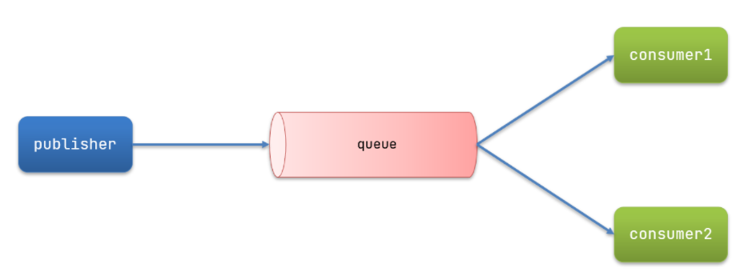
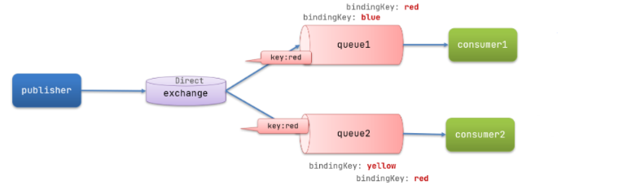
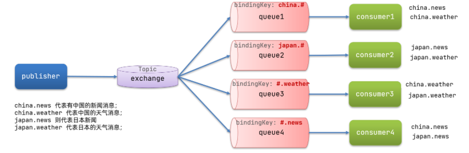
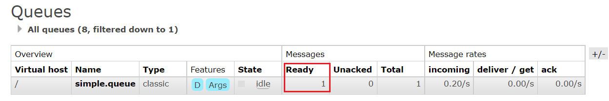
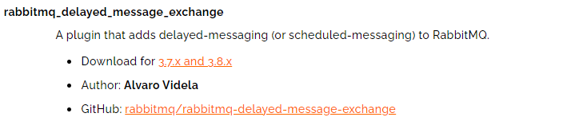
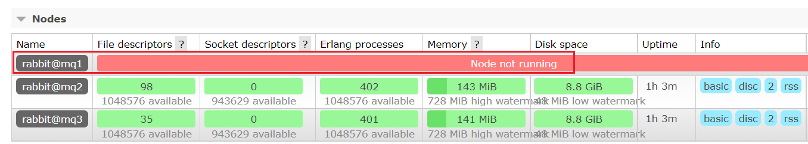
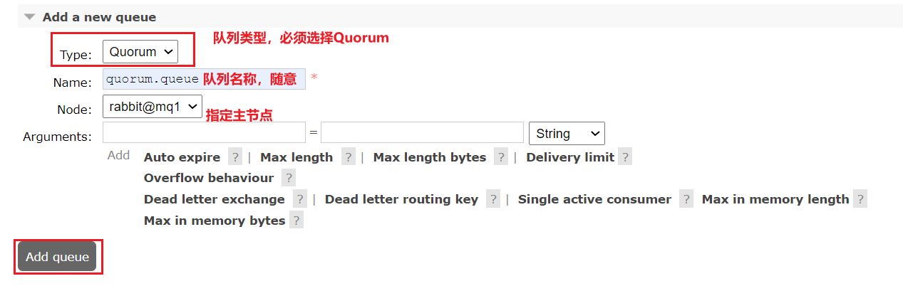

# RabbtiMQ

## 一、概述

### 为什么要使用MQ

#### 流量削峰

举个例子，如果订单系统最多能处理一万次订单，这个处理能力应付正常时段的下单时绰绰有余，正常时段我们下单一秒后就能返回结果。但是在高峰期，如果有两万次下单操作系统是处理不了的，只能限制订单超过一万后不允许用户下单。

使用消息队列做缓冲，我们可以取消这个限制，把一秒内下的订单分散成一段时间来处理，这时有些用户可能在下单十几秒后才能收到下单成功的操作，但是比不能下单的体验要好  

#### 应用解耦

 以电商应用为例，应用中有订单系统、库存系统、物流系统、支付系统。用户创建订单后，如果耦合调用库存系统、物流系统、支付系统，任何一个子系统出了故障，都会造成下单操作异常。

当转变成基于消息队列的方式后，系统间调用的问题会减少很多，比如物流系统因为发生故障，需要几分钟来修复。在这几分钟的时间里，物流系统要处理的内存被缓存在消息队列中，用户的下单操作可以正常完成。当物流系统恢复后，继续处理订单信息即可，中单用户感受不到物流系统的故障，提升系统的可用性  

#### 异步处理

有些服务间调用是异步的，例如 A 调用 B，B 需要花费很长时间执行，但是 A 需要知道 B 什么时候可 以执行完，以前一般有两种方式，A 过一段时间去调用 B 的查询 api 查询。或者 A 提供一个 callback api， B 执行完之后调用 api 通知 A 服务。这两种方式都不是很优雅

使用消息总线，可以很方便解决这个问题， A 调用 B 服务后，只需要监听 B 处理完成的消息，当 B 处理完成后，会发送一条消息给 MQ，MQ 会将此 消息转发给 A 服务。这样 A 服务既不用循环调用 B 的查询 api，也不用提供 callback api。同样 B 服务也不 用做这些操作。A 服务还能及时的得到异步处理成功的消息  

### AMQP依赖

~~~xml
<!--AMQP依赖，包含RabbitMQ-->
<dependency>
  <groupId>org.springframework.boot</groupId>
  <artifactId>spring-boot-starter-amqp</artifactId>
</dependency>

<!--配置JSON格式消息转换器，需要在容器中添加 MessageConverter 的Bean-->
<!--具体请看 配置JSON格式转换器篇-->
<dependency>
  <groupId>com.fasterxml.jackson.dataformat</groupId>
  <artifactId>jackson-dataformat-xml</artifactId>
  <version>2.9.10</version>
</dependency>
~~~

### RabbitMQ配置

```yaml
# 发送端、接收端都要配置
spring:
  rabbitmq:
    host: 192.168.150.101 # 主机名
    port: 5672 # 端口
    virtual-host: / # 虚拟主机
    username: itcast # 用户名
    password: 123321 # 密码
    listener:
      simple:
        prefetch: 1 # 每次只能获取一条消息，处理完成才能获取下一个消息
        acknowledge-mode: none # none关闭ack、auto自动ack、manual手动ack
        retry:
          enabled: true # 开启消费者失败重试
          initial-interval: 1000 # 初识的失败等待时长为1秒
          multiplier: 1 # 失败的等待时长倍数，下次等待时长 = multiplier * last-interval
          max-attempts: 3 # 最大重试次数
          stateless: true # true无状态；false有状态。如果业务中包含事务，这里改为false
    publisher-confirm-type: correlated # simple同步等待confirm结果，直到超时,correlated异步回调，定义ConfirmCallback，MQ返回结果时会回调这个ConfirmCallback
    publisher-returns: true # 同样是基于callback机制，不过是定义ReturnCallback
    template:
      mandatory: true # 定义消息路由失败时的策略。true，则调用ReturnCallback；false：则直接丢弃消息

# = = = = = = = = = = = = = = = = = = = = = = = = = = = = = = = = = = = = = = = = = = = = = = = = = = = = = = = =
# 集群
spring:
		rabbitmq:
    	addresses: 192.168.150.105:8071, 192.168.150.105:8072, 192.168.150.105:8073
    	username: itcast
    	password: 123321
    	virtual-host: /
```
`RabbitMQ` 2007 年发布，是使用 `Erlang` 语言开发的开源消息队列系统，基于 `AMQP` 协议来实现。

`AMQP`协议是具有现代特征的二进制协议。是一个提供统一消息服务的应用层标准高级消息队列协议，是应用层协议的一个开放标准，为面向消息的中间件设计。

先了解一下`AMQP`协议中间的几个重要概念：

- **Server：接收客户端的连接，实现AMQP实体服务。**
- **Connection：连接，应用程序与Server的网络连接，TCP连接。**
- **Channel：信道，消息读写等操作在信道中进行。客户端可以建立多个信道，每个信道代表一个会话任务。**
- **Message：消息，应用程序和服务器之间传送的数据，消息可以非常简单，也可以很复杂。由Properties和Body组成。Properties为外包装，可以对消息进行修饰，比如消息的优先级、延迟等高级特性；Body就是消息体内容。**
- **Virtual Host：虚拟主机，用于逻辑隔离。一个虚拟主机里面可以有若干个Exchange和Queue，同一个虚拟主机里面不能有相同名称的Exchange或Queue。**
- **Exchange：交换机，接收消息，按照路由规则将消息路由到一个或者多个队列。如果路由不到，或者返回给生产者，或者直接丢弃。RabbitMQ常用的交换器常用类型有direct、topic、fanout、headers四种，后面详细介绍。**

**注：只负责转发消息，不具备存储消息的能力**，**因此如果没有任何队列与Exchange绑定，或者没有符合路由规则的队列，那么消息会丢失！**

- **Binding：绑定，交换器和消息队列之间的虚拟连接，绑定中可以包含一个或者多个RoutingKey。**
- **RoutingKey：路由键，生产者将消息发送给交换器的时候，会发送一个RoutingKey，用来指定路由规则，这样交换器就知道把消息发送到哪个队列。路由键通常为一个“.”分割的字符串，例如“com.rabbitmq”。**
- **Queue：消息队列，用来保存消息，供消费者消费**


### 配置JSON格式消息转换器

`Spring`会把你发送的消息序列化为字节发送给`MQ`，接收消息的时候，还会把字节反序列化为`Java`对象

只不过，默认情况下`Spring`采用的序列化方式是`JDK`序列化。众所周知，`JDK`序列化存在下列问题：

- 数据体积过大
- 有安全漏洞
- 可读性差

发送消息后查看控制台：


显然，JDK序列化方式并不合适。我们希望消息体的体积更小、可读性更高，因此可以使用JSON方式来做序列化和反序列化。

在`publisher`和`consumer`两个服务中都引入依赖：

```xml
<dependency>
  <groupId>com.fasterxml.jackson.dataformat</groupId>
  <artifactId>jackson-dataformat-xml</artifactId>
  <version>2.9.10</version>
</dependency>
```

在启动类中添加一个`Bean`即可

```java
@Bean
public MessageConverter jsonMessageConverter(){
    return new Jackson2JsonMessageConverter();
}
```

### 工作原理

`AMQP` 协议模型由三部分组成：生产者、消费者和服务端，执行流程如下：

1. **生产者是连接到 Server，建立一个连接，开启一个信道。**
2. **生产者声明交换机和队列，设置相关属性，并通过路由键将交换机和队列进行绑定。**
3. **消费者也需要进行建立连接，开启信道等操作，便于接收消息。**
4. **生产者发送消息，发送到服务端中的虚拟主机。**
5. **虚拟主机中的交换机根据路由键选择路由规则，发送到不同的消息队列中。**
6. **订阅了消息队列的消费者就可以获取到消息，进行消费**


## 二、安装MQ

### 下载镜像

方式一：在线拉取

``` sh
docker pull rabbitmq:3.8-management
```


方式二：从本地加载

上传到虚拟机中后，使用命令加载镜像即可：

```sh
docker load -i mq.tar
```


### 安装MQ

执行下面的命令来运行MQ容器：

```sh
docker run \
 -e RABBITMQ_DEFAULT_USER=itcast \
 -e RABBITMQ_DEFAULT_PASS=123321 \
 -v mq-plugins:/plugins \
 --name mq \
 --hostname mq1 \
 -p 15672:15672 \
 -p 5672:5672 \
 -d \
 rabbitmq:3.8-management
```

## 三、MQ模式

消息队列目前主要 5 种模式：

- 基本消息队列（BasicQueue）
- 工作消息队列（WorkQueue）
- 发布订阅（Publish、Subscribe）
  - `Fanout Exchange`：广播，将消息交给所有绑定到交换机的队列
  - `Direct Exchange`：路由，把消息交给符合指定`routing key` 的队列
  - `Topic Exchange`：主题、通配符，把消息交给符合`routing pattern`（路由模式） 的队列

### 基本消息队列 BasicQueue


案例

```java
public class Publisher {

    @Autowired
    private RabbitTemplate rabbitTemplate;

    public void testSimpleQueue() {
        // 队列名称
        String queueName = "simple.queue";
        // 消息
        String message = "hello, spring amqp!";
        // 发送消息
        rabbitTemplate.convertAndSend(queueName, message);
    }
}
```

```java
@Component
public class SpringRabbitListener {

    @RabbitListener(queues = "simple.queue")
    public void listenSimpleQueueMessage(String msg) throws InterruptedException {
        System.out.println("spring 消费者接收到消息：【" + msg + "】");
    }
}
```

### 工作消息队列 WorkQueue

**让多个消费者绑定到一个队列，共同消费队列中的消息**

> 注：多个消费者绑定到一个队列，同一条消息只会被一个消费者处理

当消息处理比较耗时的时候，可能生产消息的速度会远远大于消息的消费速度。长此以往，消息就会堆积越来越多，无法及时处理。

此时就可以使用`work` 模型，多个消费者共同处理消息处理，速度就能大大提高了



```java
/**
     * workQueue
     * 向队列中不停发送消息，模拟消息堆积。
     */
public void testWorkQueue() throws InterruptedException {
    // 队列名称
    String queueName = "simple.queue";
    // 消息
    String message = "hello, message_";
    for (int i = 0; i < 50; i++) {
        // 发送消息
        rabbitTemplate.convertAndSend(queueName, message + i);
        Thread.sleep(20);
    }
}
```

```java
@RabbitListener(queues = "simple.queue")
public void listenWorkQueue1(String msg) throws InterruptedException {
    System.out.println("消费者1接收到消息：【" + msg + "】" + LocalTime.now());
    Thread.sleep(20);
}

@RabbitListener(queues = "simple.queue")
public void listenWorkQueue2(String msg) throws InterruptedException {
    System.err.println("消费者2........接收到消息：【" + msg + "】" + LocalTime.now());
    Thread.sleep(200);
}
```

**结果：**

消息是平均分配给每个消费者，并没有考虑到消费者的处理能力。这样显然是有问题的

解决：

修改`consumer`服务的`application.yml`文件，添加配置

```yaml
spring:
  rabbitmq:
    listener:
      simple:
        prefetch: 1 # 每次只能获取一条消息，处理完成才能获取下一个消息
```

### 声明队列和交换机

Spring提供了一个接口`Exchange`，来表示所有不同类型的交换机：


#### 普通方式

```java
@Configuration
public class FanoutConfig {
    /**
     * 声明交换机
     * @return Fanout类型交换机
     */
    @Bean
    public FanoutExchange fanoutExchange(){
        return new FanoutExchange("itcast.fanout");
    }

    /**
     * 第1个队列
     */
    @Bean
    public Queue fanoutQueue1(){
        return new Queue("fanout.queue1");
    }

    /**
     * 绑定队列和交换机
     */
    @Bean
    public Binding bindingQueue1(Queue fanoutQueue1, FanoutExchange fanoutExchange){
        return BindingBuilder.bind(fanoutQueue1).to(fanoutExchange);
    }

    /**
     * 第2个队列
     */
    @Bean
    public Queue fanoutQueue2(){
        return new Queue("fanout.queue2");
    }

    /**
     * 绑定队列和交换机
     */
    @Bean
    public Binding bindingQueue2(Queue fanoutQueue2, FanoutExchange fanoutExchange){
        return BindingBuilder.bind(fanoutQueue2).to(fanoutExchange);
    }
}
```

#### 基于注解

在`consumer`的`SpringRabbitListener`中添加两个消费者，同时基于注解来声明队列和交换机

```java
@RabbitListener(bindings = @QueueBinding(
    value = @Queue(name = "direct.queue1"),
    exchange = @Exchange(name = "itcast.direct", type = ExchangeTypes.DIRECT),
    key = {"red", "blue"}
))
public void listenDirectQueue1(String msg){
    System.out.println("消费者接收到direct.queue1的消息：【" + msg + "】");
}

@RabbitListener(bindings = @QueueBinding(
    value = @Queue(name = "direct.queue2"),
    exchange = @Exchange(name = "itcast.direct", type = ExchangeTypes.DIRECT),
    key = {"red", "yellow"}
))
public void listenDirectQueue2(String msg){
    System.out.println("消费者接收到direct.queue2的消息：【" + msg + "】");
}
```

### 广播 Fanout Exchange


将消息交给所有绑定到交换机的队列，一条消息，会被所有订阅的队列都消费

在广播模式下，消息发送流程是这样的：

- 1） 可以有多个队列
- 2） 每个队列都要绑定到Exchange（交换机）
- 3） 生产者发送的消息，只能发送到交换机，交换机来决定要发给哪个队列，生产者无法决定
- 4） 交换机把消息发送给绑定过的所有队列
- 5） 订阅队列的消费者都能拿到消息

```java
public void testFanoutExchange() {
    // 交换机名称
    String exchangeName = "itcast.fanout";
    // 消息
    String message = "hello, everyone!";
    rabbitTemplate.convertAndSend(exchangeName, "", message);
}
```

```java
//新建一个配置类，按照上面的两种方式声明队列和交换机

@Component
public class SpringRabbitListener {
    
	@RabbitListener(queues = "fanout.queue1")
	public void listenFanoutQueue1(String msg) {
    	System.out.println("消费者1接收到Fanout消息：【" + msg + "】");
	}

	@RabbitListener(queues = "fanout.queue2")
	public void listenFanoutQueue2(String msg) {
  	  System.out.println("消费者2接收到Fanout消息：【" + msg + "】");
	}
}
```

### 路由 Direct Exchange



在某些场景下，我们希望不同的消息被不同的队列消费。这时就要用到`Direct`类型的`Exchange`。

在`Direct`模型下：

- 队列与交换机的绑定，不能是任意绑定了，而是要指定一个`RoutingKey`（路由key）
- 消息的发送方在向 `Exchange`发送消息时，也必须指定消息的 `RoutingKey`。
- `Exchange`不再把消息交给每一个绑定的队列，而是根据消息的`Routing Key`进行判断，只有队列的`Routingkey`与消息的 `Routing key`完全一致，才会接收到消息

```java
@RabbitListener(bindings = @QueueBinding(
    value = @Queue(name = "direct.queue1"),
    exchange = @Exchange(name = "itcast.direct", type = ExchangeTypes.DIRECT),
    key = {"red", "blue"}
))
public void listenDirectQueue1(String msg){
    System.out.println("消费者接收到direct.queue1的消息：【" + msg + "】");
}

@RabbitListener(bindings = @QueueBinding(
    value = @Queue(name = "direct.queue2"),
    exchange = @Exchange(name = "itcast.direct", type = ExchangeTypes.DIRECT),
    key = {"red", "yellow"}
))
public void listenDirectQueue2(String msg){
    System.out.println("消费者接收到direct.queue2的消息：【" + msg + "】");
}
```

```java
public void testSendDirectExchange() {
    // 交换机名称
    String exchangeName = "itcast.direct";
    // 消息
    String message = "红色警报！日本乱排核废水，导致海洋生物变异，惊现哥斯拉！";
    // 发送消息
    rabbitTemplate.convertAndSend(exchangeName, "red", message);
}
```

### 主题 Topic Exchange



把消息交给符合`routing pattern`（路由模式) 的队列

`Topic`类型的`Exchange`与`Direct`相比，都是可以根据`RoutingKey`把消息路由到不同的队列。只不过`Topic`类型`Exchange`可以让队列在绑定`Routing key` 的时候使用通配符

`Routingkey` 一般都是有一个或多个单词组成，多个单词之间以”`.`”分割，例如： item.insert

通配符规则：

`#`：匹配一个或多个词

`*`：匹配不多不少恰好1个词

*举例：*

`item.#`：能够匹配item.spu.insert 或者 item.spu

`item.*`：只能匹配item.spu

```java
/**
     * topicExchange
     */
public void testSendTopicExchange() {
    // 交换机名称
    String exchangeName = "itcast.topic";
    // 消息
    String message = "喜报！孙悟空大战哥斯拉，胜!";
    // 发送消息
    rabbitTemplate.convertAndSend(exchangeName, "china.news", message);
}
```

```java
@RabbitListener(bindings = @QueueBinding(
    value = @Queue(name = "topic.queue1"),
    exchange = @Exchange(name = "itcast.topic", type = ExchangeTypes.TOPIC),
    key = "china.#"
))
public void listenTopicQueue1(String msg){
    System.out.println("消费者接收到topic.queue1的消息：【" + msg + "】");
}

@RabbitListener(bindings = @QueueBinding(
    value = @Queue(name = "topic.queue2"),
    exchange = @Exchange(name = "itcast.topic", type = ExchangeTypes.TOPIC),
    key = "#.news"
))
public void listenTopicQueue2(String msg){
    System.out.println("消费者接收到topic.queue2的消息：【" + msg + "】");
}
```


## 四、消息可靠性

消息从发送，到消费者接收，会经理多个过程：


其中的每一步都可能导致消息丢失，常见的丢失原因包括：

- 发送时丢失：
  - 生产者发送的消息未送达`exchange`
  - 消息到达`exchange`后未到达`queue`
- `MQ`宕机，`queue`将消息丢失
- `consumer`接收到消息后未消费就宕机


针对这些问题，`RabbitMQ`分别给出了解决方案：

- 生产者确认机制
- mq持久化
- 消费者确认机制
- 失败重试机制


### 生产者消息确认

`RabbitMQ`提供了`publisher confirm`机制来避免消息发送到`MQ`过程中丢失。

这种机制必须给每个消息指定一个**唯一ID**。

消息发送到`MQ`以后，会返回一个结果给发送者，表示消息是否处理成功。

返回结果有两种方式：

- `publisher-confirm`，发送者确认
  - 消息成功投递到交换机，返回`ack`
  - 消息未投递到交换机，返回`nack`
- `publisher-return`，发送者回执
  - 消息投递到交换机了，但是没有路由到队列。返回`ACK`，及路由失败原因。


注意：


#### 修改配置

首先，修改`publisher`服务中的`application.yml`文件，添加下面的内容：

```yaml
spring:
  rabbitmq:
    publisher-confirm-type: correlated
    publisher-returns: true
    template:
      mandatory: true
   
```

说明：

- `publish-confirm-type`：开启`publisher-confirm`，这里支持两种类型：
  - `simple`：同步等待`confirm`结果，直到超时
  - `correlated`：异步回调，定义`ConfirmCallback`，`MQ`返回结果时会回调这个`ConfirmCallback`
- `publish-returns`：开启`publish-return`功能，同样是基于`callback`机制，不过是定义`ReturnCallback`
- `template.mandatory`：定义消息路由失败时的策略。
  - `true`，则调用`ReturnCallback`；
  - `false`：则直接丢弃消息


#### 定义Return回调

每个`RabbitTemplate`只能配置一个`ReturnCallback`，因此需要在项目加载时配置：

修改`publisher`服务，添加一个：

```java
@Slf4j
@Configuration
public class CommonConfig implements ApplicationContextAware {
    @Override
    public void setApplicationContext(ApplicationContext applicationContext) throws BeansException {
        // 获取RabbitTemplate
        RabbitTemplate rabbitTemplate = applicationContext.getBean(RabbitTemplate.class);
        // 设置ReturnCallback
        rabbitTemplate.setReturnCallback((message, replyCode, replyText, exchange, routingKey) -> {
            // 投递失败，记录日志
            log.info("消息发送失败，应答码{}，原因{}，交换机{}，路由键{},消息{}",
                     replyCode, replyText, exchange, routingKey, message.toString());
            // 如果有业务需要，可以重发消息
        });
    }
}
```


#### 定义ConfirmCallback

`ConfirmCallback`可以在发送消息时指定，因为每个业务处理`confirm`成功或失败的逻辑不一定相同。

在`publisher`服务

```java
public void testSendMessage2SimpleQueue() throws InterruptedException {
    // 1.消息体
    String message = "hello, spring amqp!";
    // 2.全局唯一的消息ID，需要封装到CorrelationData中
    CorrelationData correlationData = new CorrelationData(UUID.randomUUID().toString());
    // 3.添加callback
    correlationData.getFuture().addCallback(
        result -> {
            if(result.isAck()){
                // 3.1.ack，消息成功
                log.debug("消息发送成功, ID:{}", correlationData.getId());
            }else{
                // 3.2.nack，消息失败
                log.error("消息发送失败, ID:{}, 原因{}",correlationData.getId(), result.getReason());
            }
        },
        ex -> log.error("消息发送异常, ID:{}, 原因{}",correlationData.getId(),ex.getMessage())
    );
    // 4.发送消息
    rabbitTemplate.convertAndSend("task.direct", "task", message, correlationData);

    // 休眠一会儿，等待ack回执
    Thread.sleep(2000);
}
```


### 持久化

生产者确认可以确保消息投递到`RabbitMQ`的队列中，但是消息发送到`RabbitMQ`以后，如果突然宕机，也可能导致消息丢失。

要想确保消息在`RabbitMQ`中安全保存，必须开启消息持久化机制。

- 交换机持久化
- 队列持久化
- 消息持久化


#### 交换机持久化

`RabbitMQ`中交换机默认是非持久化的，`mq`重启后就丢失。

`SpringAMQP`中可以通过代码指定交换机持久化：

```java
@Bean
public DirectExchange simpleExchange(){
    // 三个参数：交换机名称、是否持久化、当没有queue与其绑定时是否自动删除
    return new DirectExchange("simple.direct", true, false);
}
```

事实上，默认情况下，由`SpringAMQP`声明的交换机都是持久化的。


可以在`RabbitMQ`控制台看到持久化的交换机都会带上`D`的标示：


#### 队列持久化

`RabbitMQ`中队列默认是非持久化的，`mq`重启后就丢失。

`SpringAMQP`中可以通过代码指定交换机持久化：

```java
@Bean
public Queue simpleQueue(){
    // 使用QueueBuilder构建队列，durable就是持久化的
    return QueueBuilder.durable("simple.queue").build();
}
```

事实上，默认情况下，由`SpringAMQP`声明的队列都是持久化的。

可以在RabbitMQ控制台看到持久化的队列都会带上`D`的标示：


#### 消息持久化

利用`SpringAMQP`发送消息时，可以设置消息的属性（MessageProperties），指定`delivery-mode`：

- 1：非持久化
- 2：持久化

用java代码指定：


默认情况下，`SpringAMQP`发出的任何消息都是持久化的，不用特意指定。


### 消费者消息确认

`RabbitMQ`是**阅后即焚**机制，`RabbitMQ`确认消息被消费者消费后会立刻删除。

而`RabbitMQ`是通过消费者回执来确认消费者是否成功处理消息的：消费者获取消息后，应该向`RabbitMQ`发送`ACK`回执，表明自己已经处理消息。


设想这样的场景：

- 1）`RabbitMQ`投递消息给消费者
- 2）消费者获取消息后，返回`ACK`给`RabbitMQ`
- 3）`RabbitMQ`删除消息
- 4）消费者宕机，消息尚未处理

这样，消息就丢失了。因此消费者返回`ACK`的时机非常重要。


而`SpringAMQP`则允许配置三种确认模式：

•`manual`：手动`ack`，需要在业务代码结束后，调用`api`发送`ack`。

•`auto`：自动`ack`，由`spring`监测`listener`代码是否出现异常，没有异常则返回`ack`；抛出异常则返回`nack`

•`none`：关闭`ack`，`MQ`假定消费者获取消息后会成功处理，因此消息投递后立即被删除


由此可知：

- `none`模式下，消息投递是不可靠的，可能丢失
- `auto`模式类似事务机制，出现异常时返回`nack`，消息回滚到`mq`；没有异常，返回`ack`
- `manual`：自己根据业务情况，判断什么时候该`ack`

一般，我们都是使用默认的`auto`即可。


#### 演示none模式

修改`consumer`服务的`application.yml`文件，添加下面内容：

```yaml
spring:
  rabbitmq:
    listener:
      simple:
        acknowledge-mode: none # 关闭ack
```

修改`consumer`服务的`SpringRabbitListener`类中的方法，模拟一个消息处理异常：

```java
@RabbitListener(queues = "simple.queue")
public void listenSimpleQueue(String msg) {
    log.info("消费者接收到simple.queue的消息：【{}】", msg);
    // 模拟异常
    System.out.println(1 / 0);
    log.debug("消息处理完成！");
}
```

测试可以发现，当消息处理抛异常时，消息依然被`RabbitMQ`删除了。


#### 演示auto模式

再次把确认机制修改为`auto`:

```yaml
spring:
  rabbitmq:
    listener:
      simple:
        acknowledge-mode: auto # 关闭ack
```

在异常位置打断点，再次发送消息，程序卡在断点时，可以发现此时消息状态为unack（未确定状态）：


抛出异常后，因为`Spring`会自动返回`nack`，所以消息恢复至`Ready`状态，并且没有被`RabbitMQ`删除：




### 消费失败重试机制

当消费者出现异常后，消息会不断`requeue`（重入队）到队列，再重新发送给消费者，然后再次异常，再次`requeue`，无限循环，导致`mq`的消息处理飙升，带来不必要的压力：


怎么办呢？


#### 本地重试

我们可以利用`Spring`的`retry`机制，在消费者出现异常时利用本地重试，而不是无限制的`requeue`到`mq`队列。

修改`consumer`服务的`application.yml`文件，添加内容：

```yaml
spring:
  rabbitmq:
    listener:
      simple:
        retry:
          enabled: true # 开启消费者失败重试
          initial-interval: 1000 # 初识的失败等待时长为1秒
          multiplier: 1 # 失败的等待时长倍数，下次等待时长 = multiplier * last-interval
          max-attempts: 3 # 最大重试次数
          stateless: true # true无状态；false有状态。如果业务中包含事务，这里改为false
```


重启`consumer`服务，重复之前的测试。可以发现：

- 在重试3次后，`SpringAMQP`会抛出异常`AmqpRejectAndDontRequeueException`，说明本地重试触发了
- 查看`RabbitMQ`控制台，发现消息被删除了，说明最后`SpringAMQP`返回的是`ack`，`mq`删除消息了


结论：

- 开启本地重试时，消息处理过程中抛出异常，不会`requeue`到队列，而是在消费者本地重试
- 重试达到最大次数后，`Spring`会返回`ack`，消息会被丢弃


#### 失败策略

在之前的测试中，达到最大重试次数后，消息会被丢弃，这是由`Spring`内部机制决定的。

在开启重试模式后，重试次数耗尽，如果消息依然失败，则需要有`MessageRecovery`接口来处理，它包含三种不同的实现：

- `RejectAndDontRequeueRecoverer`：重试耗尽后，直接`reject`，丢弃消息。默认就是这种方式

- `ImmediateRequeueMessageRecoverer`：重试耗尽后，返回`nack`，消息重新入队

- `RepublishMessageRecoverer`：重试耗尽后，将失败消息投递到指定的交换机


比较优雅的一种处理方案是`RepublishMessageRecoverer`，失败后将消息投递到一个指定的，专门存放异常消息的队列，后续由人工集中处理。


1）在`consumer`服务中定义处理失败消息的交换机和队列

```java
@Bean
public DirectExchange errorMessageExchange(){
    return new DirectExchange("error.direct");
}
@Bean
public Queue errorQueue(){
    return new Queue("error.queue", true);
}
@Bean
public Binding errorBinding(Queue errorQueue, DirectExchange errorMessageExchange){
    return BindingBuilder.bind(errorQueue).to(errorMessageExchange).with("error");
}
```


2）定义一个`RepublishMessageRecoverer`，关联队列和交换机

```java
@Bean
public MessageRecoverer republishMessageRecoverer(RabbitTemplate rabbitTemplate){
    return new RepublishMessageRecoverer(rabbitTemplate, "error.direct", "error");
}
```


完整代码：

```java
@Configuration
public class ErrorMessageConfig {
    @Bean
    public DirectExchange errorMessageExchange(){
        return new DirectExchange("error.direct");
    }
    @Bean
    public Queue errorQueue(){
        return new Queue("error.queue", true);
    }
    @Bean
    public Binding errorBinding(Queue errorQueue, DirectExchange errorMessageExchange){
        return BindingBuilder.bind(errorQueue).to(errorMessageExchange).with("error");
    }

    @Bean
    public MessageRecoverer republishMessageRecoverer(RabbitTemplate rabbitTemplate){
        return new RepublishMessageRecoverer(rabbitTemplate, "error.direct", "error");
    }
}
```


### 总结

如何确保`RabbitMQ`消息的可靠性？

- 开启生产者确认机制，确保生产者的消息能到达队列
- 开启持久化功能，确保消息未消费前在队列中不会丢失
- 开启消费者确认机制为`auto`，由`spring`确认消息处理成功后完成`ack`
- 开启消费者失败重试机制，并设置`MessageRecoverer`，多次重试失败后将消息投递到异常交换机，交由人工处理


## 五、死信交换机

什么是死信？

当一个队列中的消息满足下列情况之一时，可以成为死信（dead letter）：

- 消费者使用`basic.reject`或 `basic.nack`声明消费失败，并且消息的`requeue`参数设置为`false`
- 消息是一个过期消息，超时无人消费
- 要投递的队列消息满了，无法投递


如果这个包含死信的队列配置了`dead-letter-exchange`属性，指定了一个交换机，那么队列中的死信就会投递到这个交换机中，而这个交换机称为**死信交换机**（Dead Letter Exchange，简称DLX）。


如图，一个消息被消费者拒绝了，变成了死信：


因为`simple.queue`绑定了死信交换机 `dl.direct`，因此死信会投递给这个交换机：


如果这个死信交换机也绑定了一个队列，则消息最终会进入这个存放死信的队列：


另外，队列将死信投递给死信交换机时，必须知道两个信息：

- 死信交换机名称
- 死信交换机与死信队列绑定的`RoutingKey`

这样才能确保投递的消息能到达死信交换机，并且正确的路由到死信队列。


### 利用死信交换机接收死信

在失败重试策略中，默认的`RejectAndDontRequeueRecoverer`会在本地重试次数耗尽后，发送`reject`给`RabbitMQ`，消息变成死信，被丢弃。


我们可以给`simple.queue`添加一个死信交换机，给死信交换机绑定一个队列。这样消息变成死信后也不会丢弃，而是最终投递到死信交换机，路由到与死信交换机绑定的队列。


我们在`consumer`服务中，定义一组死信交换机、死信队列：

```java
// 声明普通的 simple.queue队列，并且为其指定死信交换机：dl.direct
@Bean
public Queue simpleQueue2(){
    return QueueBuilder.durable("simple.queue") // 指定队列名称，并持久化
        .deadLetterExchange("dl.direct") // 指定死信交换机
        .build();
}
// 声明死信交换机 dl.direct
@Bean
public DirectExchange dlExchange(){
    return new DirectExchange("dl.direct", true, false);
}
// 声明存储死信的队列 dl.queue
@Bean
public Queue dlQueue(){
    return new Queue("dl.queue", true);
}
// 将死信队列 与 死信交换机绑定
@Bean
public Binding dlBinding(){
    return BindingBuilder.bind(dlQueue()).to(dlExchange()).with("simple");
}
```

#### 总结

什么样的消息会成为死信？

- 消息被消费者`reject`或者返回`nack`
- 消息超时未消费
- 队列满了

死信交换机的使用场景是什么？

- 如果队列绑定了死信交换机，死信会投递到死信交换机；
- 可以利用死信交换机收集所有消费者处理失败的消息（死信），交由人工处理，进一步提高消息队列的可靠性。


### TTL

一个队列中的消息如果超时未消费，则会变为死信，超时分为两种情况：

- 消息所在的队列设置了超时时间
- 消息本身设置了超时时间


#### 接收超时死信的死信交换机

在`consumer`服务的`SpringRabbitListener`中，定义一个新的消费者，并且声明 死信交换机、死信队列：

```java
@RabbitListener(bindings = @QueueBinding(
    value = @Queue(name = "dl.ttl.queue", durable = "true"),
    exchange = @Exchange(name = "dl.ttl.direct"),
    key = "ttl"
))
public void listenDlQueue(String msg){
    log.info("接收到 dl.ttl.queue的延迟消息：{}", msg);
}
```


#### 声明一个队列，并且指定TTL

要给队列设置超时时间，需要在声明队列时配置`x-message-ttl`属性：

```java
@Bean
public Queue ttlQueue(){
    return QueueBuilder.durable("ttl.queue") // 指定队列名称，并持久化
        .ttl(10000) // 设置队列的超时时间，10秒
        .deadLetterExchange("dl.ttl.direct") // 指定死信交换机
        .build();
}
```

注意，这个队列设定了死信交换机为`dl.ttl.direct`


声明交换机，将ttl与交换机绑定：

```java
@Bean
public DirectExchange ttlExchange(){
    return new DirectExchange("ttl.direct");
}
@Bean
public Binding ttlBinding(){
    return BindingBuilder.bind(ttlQueue()).to(ttlExchange()).with("ttl");
}
```


发送消息，但是不要指定TTL：

```java
@Test
public void testTTLQueue() {
    // 创建消息
    String message = "hello, ttl queue";
    // 消息ID，需要封装到CorrelationData中
    CorrelationData correlationData = new CorrelationData(UUID.randomUUID().toString());
    // 发送消息
    rabbitTemplate.convertAndSend("ttl.direct", "ttl", message, correlationData);
    // 记录日志
    log.debug("发送消息成功");
}
```

发送消息的日志：


查看下接收消息的日志：


因为队列的`TTL`值是10000ms，也就是10秒。可以看到消息发送与接收之间的时差刚好是10秒。


#### 发送消息时，设定TTL

在发送消息时，也可以指定`TTL`

```java
@Test
public void testTTLMsg() {
    // 创建消息
    Message message = MessageBuilder
        .withBody("hello, ttl message".getBytes(StandardCharsets.UTF_8))
        .setExpiration("5000")
        .build();
    // 消息ID，需要封装到CorrelationData中
    CorrelationData correlationData = new CorrelationData(UUID.randomUUID().toString());
    // 发送消息
    rabbitTemplate.convertAndSend("ttl.direct", "ttl", message, correlationData);
    log.debug("发送消息成功");
}
```


查看发送消息日志：


接收消息日志：


这次，发送与接收的延迟只有5秒。说明当队列、消息都设置了`TTL`时，任意一个到期就会成为死信。


#### 总结

消息超时的两种方式是？

- 给队列设置`ttl`属性，进入队列后超过`ttl`时间的消息变为死信
- 给消息设置`ttl`属性，队列接收到消息超过`ttl`时间后变为死信


### 延迟队列

利用`TTL`结合死信交换机，我们实现了消息发出后，消费者延迟收到消息的效果。这种消息模式就称为延迟队列（Delay Queue）模式。

延迟队列的使用场景包括：

- 延迟发送短信
- 用户下单，如果用户在15 分钟内未支付，则自动取消
- 预约工作会议，20分钟后自动通知所有参会人员


因为延迟队列的需求非常多，所以`RabbitMQ`的官方也推出了一个插件，原生支持延迟队列效果。

这个插件就是`DelayExchange`插件。

参考`RabbitMQ`的插件列表页面：https://www.rabbitmq.com/community-plugins.html


使用方式可以参考官网地址：https://blog.rabbitmq.com/posts/2015/04/scheduling-messages-with-rabbitmq


#### 安装DelayExchange插件

这里为基于Docker来安装RabbitMQ插件。

> 基于linux原生安装RabbitMQ，然后安装插件指南地址为：https://blog.rabbitmq.com/posts/2015/04/scheduling-messages-with-rabbitmq

#### 下载插件

`RabbitMQ`有一个官方的插件社区，地址为：https://www.rabbitmq.com/community-plugins.html

其中包含各种各样的插件，包括我们要使用的`DelayExchange`插件：




大家可以去对应的`GitHub`页面下载`3.8.9`版本的插件，地址为https://github.com/rabbitmq/rabbitmq-delayed-message-exchange/releases/tag/3.8.9这个对应`RabbitMQ`的`3.8.5`以上版本。

#### 上传插件

因为我们是基于`Docker`安装，所以需要先查看`RabbitMQ`的插件目录对应的数据卷。

我们之前设定的`RabbitMQ`的数据卷名称为`mq-plugins`，所以我们使用下面命令查看数据卷：

```sh
docker volume inspect mq-plugins
```

可以得到下面结果：


接下来，将插件上传到这个目录即可：


#### 安装插件

最后就是安装了，需要进入`MQ`容器内部来执行安装。我的容器名为`mq`，所以执行下面命令：

```sh
docker exec -it mq bash
```

执行时，请将其中的 `-it` 后面的`mq`替换为你自己的容器名.

进入容器内部后，执行下面命令开启插件：

```sh
rabbitmq-plugins enable rabbitmq_delayed_message_exchange
```

结果如下：


#### DelayExchange原理

`DelayExchange`需要将一个交换机声明为`delayed`类型。当我们发送消息到`delayExchange`时，流程如下：

- 接收消息
- 判断消息是否具备x-delay属性
- 如果有`x-delay`属性，说明是延迟消息，持久化到硬盘，读取`x-delay`值，作为延迟时间
- 返回`routing not found`结果给消息发送者
- `x-delay`时间到期后，重新投递消息到指定队列


#### 使用DelayExchange

插件的使用也非常简单：声明一个交换机，交换机的类型可以是任意类型，只需要设定`delayed`属性为`true`即可，然后声明队列与其绑定即可。

#### 1）声明DelayExchange交换机

基于注解方式（推荐）：


也可以基于@Bean的方式：


#### 2）发送消息

发送消息时，一定要携带`x-delay`属性，指定延迟的时间：


#### 总结

延迟队列插件的使用步骤包括哪些？

•声明一个交换机，添加`delayed`属性为`true`

•发送消息时，添加`x-delay`头，值为超时时间

## 六、惰性队列

### 消息堆积问题

当生产者发送消息的速度超过了消费者处理消息的速度，就会导致队列中的消息堆积，直到队列存储消息达到上限。之后发送的消息就会成为死信，可能会被丢弃，这就是消息堆积问题。


解决消息堆积有两种思路：

- 增加更多消费者，提高消费速度。也就是我们之前说的`work queue`模式
- 扩大队列容积，提高堆积上限


要提升队列容积，把消息保存在内存中显然是不行的。


### 惰性队列

从`RabbitMQ`的`3.6.0`版本开始，就增加了`Lazy Queues`的概念，也就是惰性队列。惰性队列的特征如下：

- 接收到消息后直接存入磁盘而非内存
- 消费者要消费消息时才会从磁盘中读取并加载到内存
- 支持数百万条的消息存储


#### 基于命令行设置lazy-queue

而要设置一个队列为惰性队列，只需要在声明队列时，指定`x-queue-mode`属性为`lazy`即可。可以通过命令行将一个运行中的队列修改为惰性队列：

```sh
rabbitmqctl set_policy Lazy "^lazy-queue$" '{"queue-mode":"lazy"}' --apply-to queues  
```

命令解读：

- `rabbitmqctl` ：`RabbitMQ`的命令行工具
- `set_policy` ：添加一个策略
- `Lazy` ：策略名称，可以自定义
- `"^lazy-queue$"` ：用正则表达式匹配队列的名字
- `'{"queue-mode":"lazy"}'` ：设置队列模式为lazy模式
- `--apply-to queues  `：策略的作用对象，是所有的队列


#### 基于@Bean声明lazy-queue


#### 基于@RabbitListener声明LazyQueue


### 总结

消息堆积问题的解决方案？

- 队列上绑定多个消费者，提高消费速度
- 使用惰性队列，可以再`mq`中保存更多消息

惰性队列的优点有哪些？

- 基于磁盘存储，消息上限高
- 没有间歇性的`page-out`，性能比较稳定

惰性队列的缺点有哪些？

- 基于磁盘存储，消息时效性会降低
- 性能受限于磁盘的IO

## 七、MQ集群


### 集群分类

`RabbitMQ`的是基于`Erlang`语言编写，而`Erlang`又是一个面向并发的语言，天然支持集群模式。`RabbitMQ`的集群有两种模式：

•**普通集群**：是一种分布式集群，将队列分散到集群的各个节点，从而提高整个集群的并发能力。

•**镜像集群**：是一种主从集群，普通集群的基础上，添加了主从备份功能，提高集群的数据可用性。


镜像集群虽然支持主从，但主从同步并不是强一致的，某些情况下可能有数据丢失的风险。因此在`RabbitMQ的3.8`版本以后，推出了新的功能：**仲裁队列**来代替镜像集群，底层采用`Raft`协议确保主从的数据一致性。


### 普通集群

#### 集群结构和特征

普通集群，或者叫标准集群（classic cluster），具备下列特征：

- 会在集群的各个节点间共享部分数据，包括：交换机、队列元信息。不包含队列中的消息。
- 当访问集群某节点时，如果队列不在该节点，会从数据所在节点传递到当前节点并返回
- 队列所在节点宕机，队列中的消息就会丢失

结构如图：


#### 部署

我们的计划部署3节点的`mq`集群

| 主机名 | 控制台端口      | amqp通信端口    |
| ------ | --------------- | --------------- |
| mq1    | 8081 ---> 15672 | 8071 ---> 5672  |
| mq2    | 8082 ---> 15672 | 8072 ---> 5672  |
| mq3    | 8083 ---> 15672 | 8073  ---> 5672 |

集群中的节点标示默认都是：`rabbit@[hostname]`，因此以上三个节点的名称分别为：

- rabbit@mq1
- rabbit@mq2
- rabbit@mq3

#### 获取cookie

集群模式中的每个`RabbitMQ` 节点使用 `cookie` 来确定它们是否被允许相互通信。

要使两个节点能够通信，它们必须具有相同的共享秘密，称为**Erlang cookie**。`cookie` 只是一串最多 `255` 个字符的字母数字字符。

每个集群节点必须具有**相同的 cookie**。实例之间也需要它来相互通信。


我们先在之前启动的`mq`容器中获取一个`cookie`值，作为集群的`cookie`。执行下面的命令：

```sh
docker exec -it mq cat /var/lib/rabbitmq/.erlang.cookie
```

可以看到`cookie`值如下：

```sh
FXZMCVGLBIXZCDEMMVZQ
```


接下来，停止并删除当前的`mq`容器，我们重新搭建集群。

```sh
docker rm -f mq
```

#### 准备集群配置

在/tmp目录新建一个配置文件 `rabbitmq.conf`

```sh
cd /tmp
# 创建文件
touch rabbitmq.conf
```

文件内容如下：

```nginx
loopback_users.guest = false
listeners.tcp.default = 5672
cluster_formation.peer_discovery_backend = rabbit_peer_discovery_classic_config
cluster_formation.classic_config.nodes.1 = rabbit@mq1
cluster_formation.classic_config.nodes.2 = rabbit@mq2
cluster_formation.classic_config.nodes.3 = rabbit@mq3
```


再创建一个文件，记录`cookie`

```sh
cd /tmp
# 创建cookie文件
touch .erlang.cookie
# 写入cookie
echo "FXZMCVGLBIXZCDEMMVZQ" > .erlang.cookie
# 修改cookie文件的权限
chmod 600 .erlang.cookie
```


准备三个目录,mq1、mq2、mq3：

```sh
cd /tmp
# 创建目录
mkdir mq1 mq2 mq3
```


然后拷贝`rabbitmq.conf`、`cookie`文件到mq1、mq2、mq3：

```sh
# 进入/tmp
cd /tmp
# 拷贝
cp rabbitmq.conf mq1
cp rabbitmq.conf mq2
cp rabbitmq.conf mq3
cp .erlang.cookie mq1
cp .erlang.cookie mq2
cp .erlang.cookie mq3
```


#### 启动集群

创建一个网络：

```sh
docker network create mq-net
```


docker volume create 


运行命令

```sh
docker run -d --net mq-net \
-v ${PWD}/mq1/rabbitmq.conf:/etc/rabbitmq/rabbitmq.conf \
-v ${PWD}/.erlang.cookie:/var/lib/rabbitmq/.erlang.cookie \
-e RABBITMQ_DEFAULT_USER=itcast \
-e RABBITMQ_DEFAULT_PASS=123321 \
--name mq1 \
--hostname mq1 \
-p 8071:5672 \
-p 8081:15672 \
rabbitmq:3.8-management
```


```sh
docker run -d --net mq-net \
-v ${PWD}/mq2/rabbitmq.conf:/etc/rabbitmq/rabbitmq.conf \
-v ${PWD}/.erlang.cookie:/var/lib/rabbitmq/.erlang.cookie \
-e RABBITMQ_DEFAULT_USER=itcast \
-e RABBITMQ_DEFAULT_PASS=123321 \
--name mq2 \
--hostname mq2 \
-p 8072:5672 \
-p 8082:15672 \
rabbitmq:3.8-management
```


```sh
docker run -d --net mq-net \
-v ${PWD}/mq3/rabbitmq.conf:/etc/rabbitmq/rabbitmq.conf \
-v ${PWD}/.erlang.cookie:/var/lib/rabbitmq/.erlang.cookie \
-e RABBITMQ_DEFAULT_USER=itcast \
-e RABBITMQ_DEFAULT_PASS=123321 \
--name mq3 \
--hostname mq3 \
-p 8073:5672 \
-p 8083:15672 \
rabbitmq:3.8-management
```


#### 测试

在mq1这个节点上添加一个队列：


如图，在mq2和mq3两个控制台也都能看到：


#### 数据共享测试

点击这个队列，进入管理页面：


然后利用控制台发送一条消息到这个队列：


结果在mq2、mq3上都能看到这条消息：


#### 可用性测试

我们让其中一台节点mq1宕机：

```sh
docker stop mq1
```

然后登录mq2或mq3的控制台，发现simple.queue也不可用了：


> 说明数据并没有拷贝到mq2和mq3。


### 镜像集群

#### 集群结构和特征

镜像集群：本质是主从模式，具备下面的特征：

- 交换机、队列、队列中的消息会在各个`mq`的镜像节点之间同步备份。
- 创建队列的节点被称为该队列的**主节点，**备份到的其它节点叫做该队列的**镜像**节点。
- 一个队列的主节点可能是另一个队列的镜像节点
- 所有操作都是主节点完成，然后同步给镜像节点
- 主宕机后，镜像节点会替代成新的主
- 当主节点接收到消费者的ACK时，所有镜像都会删除节点中的数据。

结构如图：


#### 部署

镜像模式的配置有3种模式

| ha-mode         | ha-params         | 效果                                                         |
| :-------------- | :---------------- | :----------------------------------------------------------- |
| 准确模式exactly | 队列的副本量count | 集群中队列副本（主服务器和镜像服务器之和）的数量。count如果为1意味着单个副本：即队列主节点。count值为2表示2个副本：1个队列主和1个队列镜像。换句话说：count = 镜像数量 + 1。如果群集中的节点数少于count，则该队列将镜像到所有节点。如果有集群总数大于count+1，并且包含镜像的节点出现故障，则将在另一个节点上创建一个新的镜像。 |
| all             | (none)            | 队列在群集中的所有节点之间进行镜像。队列将镜像到任何新加入的节点。镜像到所有节点将对所有群集节点施加额外的压力，包括网络I / O，磁盘I / O和磁盘空间使用情况。推荐使用exactly，设置副本数为（N / 2 +1）。 |
| nodes           | *node names*      | 指定队列创建到哪些节点，如果指定的节点全部不存在，则会出现异常。如果指定的节点在集群中存在，但是暂时不可用，会创建节点到当前客户端连接到的节点。 |

以rabbitmqctl命令作为配置语法。

语法示例：

#### exactly模式

```
rabbitmqctl set_policy ha-two "^two\." '{"ha-mode":"exactly","ha-params":2,"ha-sync-mode":"automatic"}'
```

- `rabbitmqctl set_policy`：固定写法
- `ha-two`：策略名称，自定义
- `"^two\."`：匹配队列的正则表达式，符合命名规则的队列才生效，这里是任何以`two.`开头的队列名称
- `'{"ha-mode":"exactly","ha-params":2,"ha-sync-mode":"automatic"}'`: 策略内容
  - `"ha-mode":"exactly"`：策略模式，此处是exactly模式，指定副本数量
  - `"ha-params":2`：策略参数，这里是2，就是副本数量为2，1主1镜像
  - `"ha-sync-mode":"automatic"`：同步策略，默认是manual，即新加入的镜像节点不会同步旧的消息。如果设置为`automatic`，则新加入的镜像节点会把主节点中所有消息都同步，会带来额外的网络开销

#### all模式

```
rabbitmqctl set_policy ha-all "^all\." '{"ha-mode":"all"}'
```

- `ha-all`：策略名称，自定义
- `"^all\."`：匹配所有以`all.`开头的队列名
- `'{"ha-mode":"all"}'`：策略内容
  - `"ha-mode":"all"`：策略模式，此处是all模式，即所有节点都会称为镜像节点

#### nodes模式

```
rabbitmqctl set_policy ha-nodes "^nodes\." '{"ha-mode":"nodes","ha-params":["rabbit@nodeA", "rabbit@nodeB"]}'
```

- `rabbitmqctl set_policy`：固定写法
- `ha-nodes`：策略名称，自定义
- `"^nodes\."`：匹配队列的正则表达式，符合命名规则的队列才生效，这里是任何以`nodes.`开头的队列名称
- `'{"ha-mode":"nodes","ha-params":["rabbit@nodeA", "rabbit@nodeB"]}'`: 策略内容
  - `"ha-mode":"nodes"`：策略模式，此处是nodes模式
  - `"ha-params":["rabbit@mq1", "rabbit@mq2"]`：策略参数，这里指定副本所在节点名称


#### 测试

我们使用`exactly`模式的镜像，因为集群节点数量为3，因此镜像数量就设置为2.


运行下面的命令：

```sh
docker exec -it mq1 rabbitmqctl set_policy ha-two "^two\." '{"ha-mode":"exactly","ha-params":2,"ha-sync-mode":"automatic"}'
```


下面，我们创建一个新的队列：


在任意一个mq控制台查看队列：


#### 测试数据共享

给two.queue发送一条消息：


然后在mq1、mq2、mq3的任意控制台查看消息：


#### 测试高可用

现在，我们让two.queue的主节点mq1宕机：

```sh
docker stop mq1
```


查看集群状态：




查看队列状态：


发现依然是健康的！并且其主节点切换到了rabbit@mq2上


### 仲裁队列

#### 集群特征

仲裁队列：仲裁队列是3.8版本以后才有的新功能，用来替代镜像队列，具备下列特征：

- 与镜像队列一样，都是主从模式，支持主从数据同步
- 使用非常简单，没有复杂的配置
- 主从同步基于Raft协议，强一致


#### 部署

##### 添加仲裁队列

在任意控制台添加一个队列，一定要选择队列类型为`Quorum`类型。




在任意控制台查看队列：


可以看到，仲裁队列的 + 2字样。代表这个队列有2个镜像节点。

因为仲裁队列默认的镜像数为5。如果你的集群有7个节点，那么镜像数肯定是5；而我们集群只有3个节点，因此镜像数量就是3.


##### 测试

可以参考对镜像集群的测试，效果是一样的。


#### 集群扩容

##### 加入集群

1）启动一个新的`MQ`容器：

```sh
docker run -d --net mq-net \
-v ${PWD}/.erlang.cookie:/var/lib/rabbitmq/.erlang.cookie \
-e RABBITMQ_DEFAULT_USER=itcast \
-e RABBITMQ_DEFAULT_PASS=123321 \
--name mq4 \
--hostname mq5 \
-p 8074:15672 \
-p 8084:15672 \
rabbitmq:3.8-management
```

2）进入容器控制台：

```sh
docker exec -it mq4 bash
```

3）停止`mq`进程

```sh
rabbitmqctl stop_app
```


4）重置`RabbitMQ`中的数据：

```sh
rabbitmqctl reset
```


5）加入`mq1`：

```sh
rabbitmqctl join_cluster rabbit@mq1
```


6）再次启动`mq`进程

```sh
rabbitmqctl start_app
```


##### 增加仲裁队列副本

我们先查看下`quorum.queue`这个队列目前的副本情况，进入`mq1`容器：

```sh
docker exec -it mq1 bash
```

执行命令：

```sh
rabbitmq-queues quorum_status "quorum.queue"
```

结果：


现在，我们让`mq4`也加入进来：

```sh
rabbitmq-queues add_member "quorum.queue" "rabbit@mq4"
```

结果：


再次查看：

```sh
rabbitmq-queues quorum_status "quorum.queue"
```


查看控制台，发现`quorum.queue`的镜像数量也从原来的 +2 变成了 +3：


#### Java代码创建仲裁队列

```java
@Bean
public Queue quorumQueue() {
    return QueueBuilder
        .durable("quorum.queue") // 持久化
        .quorum() // 仲裁队列
        .build();
}
```


#### SpringAMQP连接MQ集群

注意，这里用address来代替host、port方式

```java
spring:
  rabbitmq:
    addresses: 192.168.150.105:8071, 192.168.150.105:8072, 192.168.150.105:8073
    username: itcast
    password: 123321
    virtual-host: /
```


