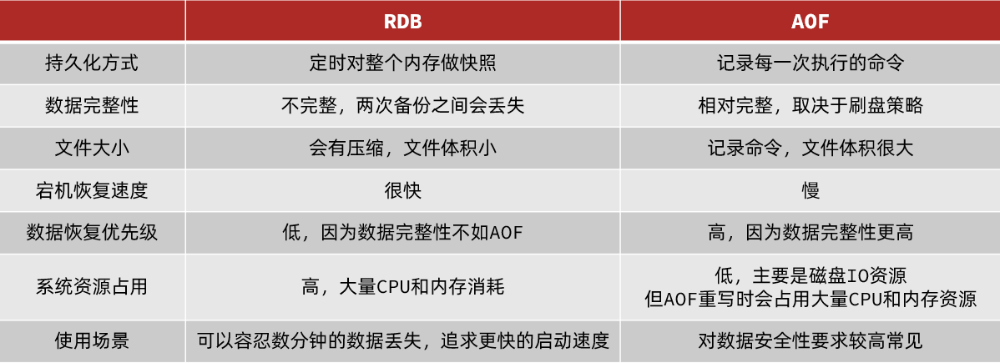

# 目录

[[toc]]

## AOF持久化

### AOF原理

`AOF`全称为Append Only File（追加文件）。

`Redis`处理的每一个写命令都会记录在`AOF`文件，可以看做是命令日志文件。


### AOF配置

`AOF`默认是关闭的，需要修改`redis.conf`配置文件来开启`AOF`

```properties
# 是否开启AOF功能，默认是no
appendonly yes
# AOF文件的名称
appendfilename "appendonly.aof"
```


`AOF`的命令记录的频率也可以通过`redis.conf`文件来配：

```properties
# 表示每执行一次写命令，立即记录到AOF文件
appendfsync always 
# 写命令执行完先放入AOF缓冲区，然后表示每隔1秒将缓冲区数据写到AOF文件，是默认方案
appendfsync everysec 
# 写命令执行完先放入AOF缓冲区，由操作系统决定何时将缓冲区内容写回磁盘
appendfsync no
```


三种策略对比：


### AOF文件重写

因为是记录命令，`AOF`文件会比`RDB`文件大的多。而且`AOF`会记录对同一个`key`的多次写操作，但只有最后一次写操作才有意义。

通过执行`bgrewriteaof`命令，可以让`AOF`文件执行重写功能，用最少的命令达到相同效果。


如图，`AOF`原本有三个命令，但是`set num 123 和 set num 666`都是对`num`的操作，第二次会覆盖第一次的值，因此第一个命令记录下来没有意义。

所以重写命令后，`AOF`文件内容就是：`mset name jack num 666`


`Redis`也会在触发阈值时自动去重写`AOF`文件。阈值也可以在`redis.conf`中配置：

```properties
# AOF文件比上次文件 增长超过多少百分比则触发重写
auto-aof-rewrite-percentage 100
# AOF文件体积最小多大以上才触发重写 
auto-aof-rewrite-min-size 64mb 
```


## RDB与AOF对比

`RDB`和`AOF`各有自己的优缺点，如果对数据安全性要求较高，在实际开发中往往会**结合**两者来使用。



