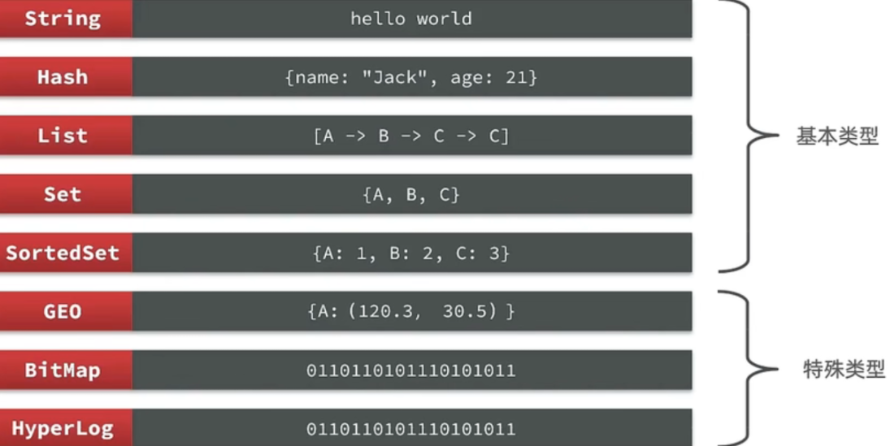
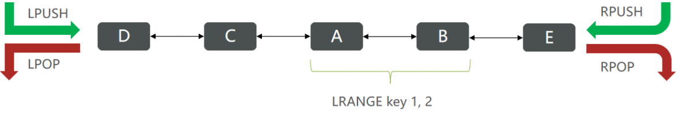

# 目录
[[toc]]
## Redis常见命令&数据类型
### Redis数据结构
Redis是一个key-value的数据库，key一般是String类型，不过value的类型多种多样：


### Key的层级结构

`Redis`的`key`允许有多个单词形成层级结构，多个单词之间用'`:`'隔开，格式如下：


> 这个格式并非固定，也可以根据自己的需求来删除或添加词条。

## Redis命令

在官网（ [https://redis.io/commands](https://redis.io/commands) ）可以查看到不同的命令

### Redis通用命令

通用指令是部分数据类型的，都可以使用的指令，常见的有：

- **KEYS**：查看符合模板的所有`key`
- **DEL**：删除一个指定的`key`
- **EXISTS**：判断`key`是否存在
- **EXPIRE**：给一个`key`设置有效期，有效期到期时该`key`会被自动删除
- **TTL**：查看一个`KEY`的剩余有效期

**示例代码：**
```bash
# KEYS
127.0.0.1:6379> keys *
1) "name"
2) "age"
127.0.0.1:6379>

# 查询以a开头的key
127.0.0.1:6379> keys a*
1) "age"
127.0.0.1:6379>


# DEL
127.0.0.1:6379> del name #删除单个
(integer) 1  #成功删除1个

127.0.0.1:6379> keys *
1) "age"

127.0.0.1:6379> MSET k1 v1 k2 v2 k3 v3 #批量添加数据
OK

127.0.0.1:6379> keys *
1) "k3"
2) "k2"
3) "k1"
4) "age"

127.0.0.1:6379> del k1 k2 k3 k4
(integer) 3   #此处返回的是成功删除的key，由于redis中只有k1,k2,k3 所以只成功删除3个，最终返回
127.0.0.1:6379>

127.0.0.1:6379> keys * #再查询全部的key
1) "age"	#只剩下一个了
127.0.0.1:6379>


# EXISTS
127.0.0.1:6379> exists age
(integer) 1 # 存在

127.0.0.1:6379> exists name
(integer) 0 # 不存在


# EXPIRE
127.0.0.1:6379> expire age 10
(integer) 1

127.0.0.1:6379> ttl age
(integer) 8

127.0.0.1:6379> ttl age
(integer) 6

127.0.0.1:6379> ttl age
(integer) -2

127.0.0.1:6379> ttl age
(integer) -2  #当这个key过期了，那么此时查询出来就是-2 

127.0.0.1:6379> keys *
(empty list or set)

127.0.0.1:6379> set age 10 #如果没有设置过期时间
OK

127.0.0.1:6379> ttl age
(integer) -1  # ttl的返回值就是-1，表示永久存在
```
### String类型命令
`String`类型，也就是字符串类型，是`Redis`中最简单的存储类型。
其`value`是字符串，不过根据字符串的格式不同，又可以分为3类：

- `string`：普通字符串
- `int`：整数类型，可以做自增.自减操作
- `float`：浮点类型，可以做自增.自减操作


**String的常见命令有：**

- **SET**：添加或者修改已经存在的一个`String`类型的键值对
- **GET**：根据`key`获取`String`类型的`value`
- **MSET**：批量添加多个`String`类型的键值对
- **MGET**：根据多个`key`获取多个`String`类型的`value`
- **INCR**：让一个整型的key自增1
- **INCRBY:让一个整型的key自增并指定步长，例如：incrby num 2 让num值自增2**
- **INCRBYFLOAT**：让一个浮点类型的数字自增并指定步长
- **SETNX**：添加一个`String`类型的键值对，前提是这个`key`不存在，否则不执行
- **SETEX**：添加一个`String`类型的键值对，并且指定有效期
```bash
# SET 和 GET  不存在就是新增，存在就是修改
127.0.0.1:6379> set name Rose  //原来不存在
OK

127.0.0.1:6379> get name 
"Rose"

127.0.0.1:6379> set name Jack //原来存在，就是修改
OK

127.0.0.1:6379> get name
"Jack"

# MSET 和 MGET
127.0.0.1:6379> MSET k1 v1 k2 v2 k3 v3
OK

127.0.0.1:6379> MGET name age k1 k2 k3
1) "Jack" //之前存在的name
2) "10"   //之前存在的age
3) "v1"
4) "v2"
5) "v3"

# INCR 和 INCRBY 和 DECY
127.0.0.1:6379> get age 
"10"

127.0.0.1:6379> incr age //增加1
(integer) 11
    
127.0.0.1:6379> get age //获得age
"11"

127.0.0.1:6379> incrby age 2 //一次增加2
(integer) 13 //返回目前的age的值
    
127.0.0.1:6379> incrby age 2
(integer) 15
    
127.0.0.1:6379> incrby age -1 //也可以增加负数，相当于减
(integer) 14
    
127.0.0.1:6379> incrby age -2 //一次减少2个
(integer) 12
    
127.0.0.1:6379> DECR age //相当于 incr 负数，减少正常用法
(integer) 11
    
127.0.0.1:6379> get age 
"11"

# SETNX
127.0.0.1:6379> set name Jack  //设置名称
OK

127.0.0.1:6379> setnx name lisi //如果key不存在，则添加成功
(integer) 0

127.0.0.1:6379> get name //由于name已经存在，所以lisi的操作失败
"Jack"

127.0.0.1:6379> setnx name2 lisi //name2 不存在，所以操作成功
(integer) 1

127.0.0.1:6379> get name2 
"lisi"

# SETEX
127.0.0.1:6379> setex name 10 jack
OK

127.0.0.1:6379> ttl name
(integer) 8

127.0.0.1:6379> ttl name
(integer) 7

127.0.0.1:6379> ttl name
(integer) 5
```
### Hash类型命令
`Hash`类型，也叫散列，其`value`是一个无序字典，类似于`Java`中的`HashMap`结构。
`String`结构是将对象序列化为`JSON`字符串后存储，当需要修改对象某个字段时很不方便
`Hash`结构可以将对象中的每个字段独立存储，可以针对单个字段做`CRUD`


**Hash类型的常见命令**

- **HSET key field value**：添加或者修改`hash`类型`key`的`field`的值
- **HGET key field**：获取一个`hash`类型`key`的`field`的值
- **HMSET**：批量添加多个`hash`类型`key`的`field`的值
- **HMGET**：批量获取多个`hash`类型`key`的`field`的值
- **HGETALL**：获取一个`hash`类型的`key`中的所有的`field`和`value`
- **HKEYS：** 获取一个`hash`类型的`key`中的所有的`field`
- **HVALS**：获取一个`hash`类型的`key`中的所有的`value`
- **HINCRBY**:让一个`hash`类型`key`的字段值自增并指定步长
- **HSETNX**：添加一个`hash`类型的`key`的field值，前提是这个`field`不存在，否则不执行
```bash
# HSET 和 HGET
127.0.0.1:6379> HSET heima:user:3 name Lucy//大key是 heima:user:3 小key是name，小value是Lucy
(integer) 1

127.0.0.1:6379> HSET heima:user:3 age 21// 如果操作不存在的数据，则是新增
(integer) 1

127.0.0.1:6379> HSET heima:user:3 age 17 //如果操作存在的数据，则是修改
(integer) 0

127.0.0.1:6379> HGET heima:user:3 name 
"Lucy"

127.0.0.1:6379> HGET heima:user:3 age
"17"

# HMSET 和 HMGET
127.0.0.1:6379> HMSET heima:user:4 name HanMeiMei
OK

127.0.0.1:6379> HMSET heima:user:4 name LiLei age 20 sex man
OK

127.0.0.1:6379> HMGET heima:user:4 name age sex
1) "LiLei"
2) "20"
3) "man"

# HGETALL
127.0.0.1:6379> HGETALL heima:user:4
1) "name"
2) "LiLei"
3) "age"
4) "20"
5) "sex"
6) "man"

# HKEYS 和 HVALS
127.0.0.1:6379> HKEYS heima:user:4
1) "name"
2) "age"
3) "sex"

127.0.0.1:6379> HVALS heima:user:4
1) "LiLei"
2) "20"
3) "man"

# HINCRBY
127.0.0.1:6379> HINCRBY  heima:user:4 age 2
(integer) 22

127.0.0.1:6379> HVALS heima:user:4
1) "LiLei"
2) "22"
3) "man"

127.0.0.1:6379> HINCRBY  heima:user:4 age -2
(integer) 20

# HSETNX
127.0.0.1:6379> HSETNX heima:user4 sex woman
(integer) 1

127.0.0.1:6379> HGETALL heima:user:3
1) "name"
2) "Lucy"
3) "age"
4) "17"

127.0.0.1:6379> HSETNX heima:user:3 sex woman
(integer) 1

127.0.0.1:6379> HGETALL heima:user:3
1) "name"
2) "Lucy"
3) "age"
4) "17"
5) "sex"
6) "woman"
```
### List类型命令
`Redis`中的`List`类型与`Java`中的`LinkedList`类似，可以看做是一个双向链表结构。既可以支持正向检索和也可以支持反向检索。
特征也与`LinkedList`类似：

- 有序
- 元素可以重复
- 插入和删除快
- 查询速度一般

常用来存储一个有序数据，例如：朋友圈点赞列表，评论列表等。

**List的常见命令有：**

- **LPUSH key element ...**：向列表左侧插入一个或多个元素
- **LPOP key**：移除并返回列表左侧的第一个元素，没有则返回`nil`
- **RPUSH key element ...**：向列表右侧插入一个或多个元素
- **RPOP key**：移除并返回列表右侧的第一个元素
- **LRANGE key star end**：返回一段角标范围内的所有元素
- **BLPOP和BRPOP**：与`LPOP`和`RPOP`类似，只不过在没有元素时等待指定时间，而不是直接返回nil


```bash
# LPUSH 和 RPUSH
127.0.0.1:6379> LPUSH users 1 2 3
(integer) 3

127.0.0.1:6379> RPUSH users 4 5 6
(integer) 6

# LPOP 和 RPOP
127.0.0.1:6379> LPOP users
"3"

127.0.0.1:6379> RPOP users
"6"

# LRANGE
127.0.0.1:6379> LRANGE users 1 2
1) "1"
2) "4"
```
### Set类型命令
`Redis`的`Set`结构与`Java`中的`HashSet`类似，可以看做是一个`value`为`null`的`HashMap`。

因为也是一个`hash`表，因此具备与`HashSet`类似的特征：

- 无序
- 元素不可重复
- 查找快
- 支持交集.并集.差集等功能

**Set类型的常见命令**

- **SADD key member ...**：向`set`中添加一个或多个元素
- **SREM key member ...**: 移除`set`中的指定元素
- **SCARD key**： 返回`set`中元素的个数
- **SISMEMBER key member**：判断一个元素是否存在于`set`中
- **SMEMBERS**：获取`set`中的所有元素
- **SINTER key1 key2 ...**：求`key1`与`key2`的交集
- **SDIFF key1 key2 ...**：求`key1`与`key2`的差集
- **SUNION key1 key2 ..**：求`key1`和`key2`的并集
```bash
127.0.0.1:6379> sadd s1 a b c
(integer) 3

127.0.0.1:6379> smembers s1
1) "c"
2) "b"
3) "a"

127.0.0.1:6379> srem s1 a
(integer) 1
    
127.0.0.1:6379> SISMEMBER s1 a
(integer) 0
    
127.0.0.1:6379> SISMEMBER s1 b
(integer) 1
    
127.0.0.1:6379> SCARD s1
(integer) 2

* 将下列数据用Redis的Set集合来存储：
* 张三的好友有：李四.王五.赵六
* 李四的好友有：王五.麻子.二狗
* 利用Set的命令实现下列功能：
* 计算张三的好友有几人
* 计算张三和李四有哪些共同好友
* 查询哪些人是张三的好友却不是李四的好友
* 查询张三和李四的好友总共有哪些人
* 判断李四是否是张三的好友
* 判断张三是否是李四的好友
* 将李四从张三的好友列表中移除
127.0.0.1:6379> SADD zs lisi wangwu zhaoliu
(integer) 3
    
127.0.0.1:6379> SADD ls wangwu mazi ergou
(integer) 3
    
127.0.0.1:6379> SCARD zs
(integer) 3
    
127.0.0.1:6379> SINTER zs ls
1) "wangwu"
    
127.0.0.1:6379> SDIFF zs ls
1) "zhaoliu"
2) "lisi"
    
127.0.0.1:6379> SUNION zs ls
1) "wangwu"
2) "zhaoliu"
3) "lisi"
4) "mazi"
5) "ergou"
    
127.0.0.1:6379> SISMEMBER zs lisi
(integer) 1
    
127.0.0.1:6379> SISMEMBER ls zhangsan
(integer) 0
    
127.0.0.1:6379> SREM zs lisi
(integer) 1
    
127.0.0.1:6379> SMEMBERS zs
1) "zhaoliu"
2) "wangwu"
```
### SortedSet类型命令
`Redis`的`SortedSet`是一个可排序的`set`集合，与`Java`中的`TreeSet`有些类似，但底层数据结构却差别很大。`SortedSet`中的每一个元素都带有一个`score`属性，可以基于`score`属性对元素排序，底层的实现是一个跳表（SkipList）加 `hash`表。
`SortedSet`具备下列特性：

- 可排序
- 元素不重复
- 查询速度快

因为`SortedSet`的可排序特性，经常被用来实现排行榜这样的功能。

**SortedSet的常见命令有：**

- **ZADD key score member**：添加一个或多个元素到`sorted set` ，如果已经存在则更新其`score`值
- **ZREM key member**：删除`sorted set`中的一个指定元素
- **ZSCORE key member** : 获取`sorted set`中的指定元素的`score`值
- **ZRANK key member**：获取`sorted set` 中的指定元素的排名
- **ZCARD key**：获取`sorted set`中的元素个数
- **ZCOUNT key min max**：统计`score`值在给定范围内的所有元素的个数
- **ZINCRBY key increment member**：让`sorted set`中的指定元素自增，步长为指定的`increment`值
- **ZRANGE key min max**：按照`score`排序后，获取指定排名范围内的元素
- **ZRANGEBYSCORE key min max**：按照`score`排序后，获取指定`score`范围内的元素
- **ZDIFF.ZINTER.ZUNION**：求差集.交集.并集

注意：所有的排名默认都是升序，如果要降序则在命令的`Z`后面添加`REV`即可，例如：

- **升序**获取`sorted set` 中的指定元素的排名：`ZRANK key member`
- **降序**获取`sorted set` 中的指定元素的排名：`ZREVRANK key memeber`
