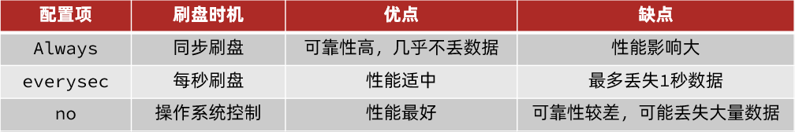

# Redis

## 一、概述

Redis的官方网站地址：[https://redis.io/](https://redis.io/)

### SpringDataRedis依赖

```xml
<!--redis依赖-->
<dependency>
	<groupId>org.springframework.boot</groupId>
	<artifactId>spring-boot-starter-data-redis</artifactId>
</dependency>
<!--common-pool-->
<dependency>
	<groupId>org.apache.commons</groupId>
	<artifactId>commons-pool2</artifactId>
</dependency>
<!--Jackson依赖-->
<dependency>
	<groupId>com.fasterxml.jackson.core</groupId>
	<artifactId>jackson-databind</artifactId>
</dependency>
```

### SpringDataRedisRedis配置

~~~yaml
spring:
  redis:
    host: 192.168.150.101
    port: 6379
    password: 123321
    lettuce:
      pool:
        max-active: 8  #最大连接
        max-idle: 8   #最大空闲连接
        min-idle: 0   #最小空闲连接
        max-wait: 100ms #连接等待时间
~~~

## 二、Redis常见命令&数据类型

### Redis数据结构

Redis是一个key-value的数据库，key一般是String类型，不过value的类型多种多样：


### Key的层级结构

`Redis`的`key`允许有多个单词形成层级结构，多个单词之间用'`:`'隔开，格式如下：


> 这个格式并非固定，也可以根据自己的需求来删除或添加词条。

### Redis命令

在官网（ [https://redis.io/commands](https://redis.io/commands) ）可以查看到不同的命令

#### Redis通用命令

通用指令是部分数据类型的，都可以使用的指令，常见的有：

- **KEYS**：查看符合模板的所有`key`
- **DEL**：删除一个指定的`key`
- **EXISTS**：判断`key`是否存在
- **EXPIRE**：给一个`key`设置有效期，有效期到期时该`key`会被自动删除
- **TTL**：查看一个`KEY`的剩余有效期

**示例代码：**

```bash
# KEYS
127.0.0.1:6379> keys *
1) "name"
2) "age"
127.0.0.1:6379>

# 查询以a开头的key
127.0.0.1:6379> keys a*
1) "age"
127.0.0.1:6379>


# DEL
127.0.0.1:6379> del name #删除单个
(integer) 1  #成功删除1个

127.0.0.1:6379> keys *
1) "age"

127.0.0.1:6379> MSET k1 v1 k2 v2 k3 v3 #批量添加数据
OK

127.0.0.1:6379> keys *
1) "k3"
2) "k2"
3) "k1"
4) "age"

127.0.0.1:6379> del k1 k2 k3 k4
(integer) 3   #此处返回的是成功删除的key，由于redis中只有k1,k2,k3 所以只成功删除3个，最终返回
127.0.0.1:6379>

127.0.0.1:6379> keys * #再查询全部的key
1) "age"	#只剩下一个了
127.0.0.1:6379>


# EXISTS
127.0.0.1:6379> exists age
(integer) 1 # 存在

127.0.0.1:6379> exists name
(integer) 0 # 不存在


# EXPIRE
127.0.0.1:6379> expire age 10
(integer) 1

127.0.0.1:6379> ttl age
(integer) 8

127.0.0.1:6379> ttl age
(integer) 6

127.0.0.1:6379> ttl age
(integer) -2

127.0.0.1:6379> ttl age
(integer) -2  #当这个key过期了，那么此时查询出来就是-2 

127.0.0.1:6379> keys *
(empty list or set)

127.0.0.1:6379> set age 10 #如果没有设置过期时间
OK

127.0.0.1:6379> ttl age
(integer) -1  # ttl的返回值就是-1，表示永久存在
```

#### String类型命令

`String`类型，也就是字符串类型，是`Redis`中最简单的存储类型。
其`value`是字符串，不过根据字符串的格式不同，又可以分为3类：

- `string`：普通字符串
- `int`：整数类型，可以做自增.自减操作
- `float`：浮点类型，可以做自增.自减操作


**String的常见命令有：**

- **SET**：添加或者修改已经存在的一个`String`类型的键值对
- **GET**：根据`key`获取`String`类型的`value`
- **MSET**：批量添加多个`String`类型的键值对
- **MGET**：根据多个`key`获取多个`String`类型的`value`
- **INCR**：让一个整型的key自增1
- **INCRBY:让一个整型的key自增并指定步长，例如：incrby num 2 让num值自增2**
- **INCRBYFLOAT**：让一个浮点类型的数字自增并指定步长
- **SETNX**：添加一个`String`类型的键值对，前提是这个`key`不存在，否则不执行
- **SETEX**：添加一个`String`类型的键值对，并且指定有效期

```bash
# SET 和 GET  不存在就是新增，存在就是修改
127.0.0.1:6379> set name Rose  //原来不存在
OK

127.0.0.1:6379> get name 
"Rose"

127.0.0.1:6379> set name Jack //原来存在，就是修改
OK

127.0.0.1:6379> get name
"Jack"

# MSET 和 MGET
127.0.0.1:6379> MSET k1 v1 k2 v2 k3 v3
OK

127.0.0.1:6379> MGET name age k1 k2 k3
1) "Jack" //之前存在的name
2) "10"   //之前存在的age
3) "v1"
4) "v2"
5) "v3"

# INCR 和 INCRBY 和 DECY
127.0.0.1:6379> get age 
"10"

127.0.0.1:6379> incr age //增加1
(integer) 11
    
127.0.0.1:6379> get age //获得age
"11"

127.0.0.1:6379> incrby age 2 //一次增加2
(integer) 13 //返回目前的age的值
    
127.0.0.1:6379> incrby age 2
(integer) 15
    
127.0.0.1:6379> incrby age -1 //也可以增加负数，相当于减
(integer) 14
    
127.0.0.1:6379> incrby age -2 //一次减少2个
(integer) 12
    
127.0.0.1:6379> DECR age //相当于 incr 负数，减少正常用法
(integer) 11
    
127.0.0.1:6379> get age 
"11"

# SETNX
127.0.0.1:6379> set name Jack  //设置名称
OK

127.0.0.1:6379> setnx name lisi //如果key不存在，则添加成功
(integer) 0

127.0.0.1:6379> get name //由于name已经存在，所以lisi的操作失败
"Jack"

127.0.0.1:6379> setnx name2 lisi //name2 不存在，所以操作成功
(integer) 1

127.0.0.1:6379> get name2 
"lisi"

# SETEX
127.0.0.1:6379> setex name 10 jack
OK

127.0.0.1:6379> ttl name
(integer) 8

127.0.0.1:6379> ttl name
(integer) 7

127.0.0.1:6379> ttl name
(integer) 5
```

#### Hash类型命令

`Hash`类型，也叫散列，其`value`是一个无序字典，类似于`Java`中的`HashMap`结构。
`String`结构是将对象序列化为`JSON`字符串后存储，当需要修改对象某个字段时很不方便
`Hash`结构可以将对象中的每个字段独立存储，可以针对单个字段做`CRUD`


**Hash类型的常见命令**

- **HSET key field value**：添加或者修改`hash`类型`key`的`field`的值
- **HGET key field**：获取一个`hash`类型`key`的`field`的值
- **HMSET**：批量添加多个`hash`类型`key`的`field`的值
- **HMGET**：批量获取多个`hash`类型`key`的`field`的值
- **HGETALL**：获取一个`hash`类型的`key`中的所有的`field`和`value`
- **HKEYS：** 获取一个`hash`类型的`key`中的所有的`field`
- **HVALS**：获取一个`hash`类型的`key`中的所有的`value`
- **HINCRBY**:让一个`hash`类型`key`的字段值自增并指定步长
- **HSETNX**：添加一个`hash`类型的`key`的field值，前提是这个`field`不存在，否则不执行

```bash
# HSET 和 HGET
127.0.0.1:6379> HSET heima:user:3 name Lucy//大key是 heima:user:3 小key是name，小value是Lucy
(integer) 1

127.0.0.1:6379> HSET heima:user:3 age 21// 如果操作不存在的数据，则是新增
(integer) 1

127.0.0.1:6379> HSET heima:user:3 age 17 //如果操作存在的数据，则是修改
(integer) 0

127.0.0.1:6379> HGET heima:user:3 name 
"Lucy"

127.0.0.1:6379> HGET heima:user:3 age
"17"

# HMSET 和 HMGET
127.0.0.1:6379> HMSET heima:user:4 name HanMeiMei
OK

127.0.0.1:6379> HMSET heima:user:4 name LiLei age 20 sex man
OK

127.0.0.1:6379> HMGET heima:user:4 name age sex
1) "LiLei"
2) "20"
3) "man"

# HGETALL
127.0.0.1:6379> HGETALL heima:user:4
1) "name"
2) "LiLei"
3) "age"
4) "20"
5) "sex"
6) "man"

# HKEYS 和 HVALS
127.0.0.1:6379> HKEYS heima:user:4
1) "name"
2) "age"
3) "sex"

127.0.0.1:6379> HVALS heima:user:4
1) "LiLei"
2) "20"
3) "man"

# HINCRBY
127.0.0.1:6379> HINCRBY  heima:user:4 age 2
(integer) 22

127.0.0.1:6379> HVALS heima:user:4
1) "LiLei"
2) "22"
3) "man"

127.0.0.1:6379> HINCRBY  heima:user:4 age -2
(integer) 20

# HSETNX
127.0.0.1:6379> HSETNX heima:user4 sex woman
(integer) 1

127.0.0.1:6379> HGETALL heima:user:3
1) "name"
2) "Lucy"
3) "age"
4) "17"

127.0.0.1:6379> HSETNX heima:user:3 sex woman
(integer) 1

127.0.0.1:6379> HGETALL heima:user:3
1) "name"
2) "Lucy"
3) "age"
4) "17"
5) "sex"
6) "woman"
```

#### List类型命令

`Redis`中的`List`类型与`Java`中的`LinkedList`类似，可以看做是一个双向链表结构。既可以支持正向检索和也可以支持反向检索。
特征也与`LinkedList`类似：

- 有序
- 元素可以重复
- 插入和删除快
- 查询速度一般

常用来存储一个有序数据，例如：朋友圈点赞列表，评论列表等。

**List的常见命令有：**

- **LPUSH key element ...**：向列表左侧插入一个或多个元素
- **LPOP key**：移除并返回列表左侧的第一个元素，没有则返回`nil`
- **RPUSH key element ...**：向列表右侧插入一个或多个元素
- **RPOP key**：移除并返回列表右侧的第一个元素
- **LRANGE key star end**：返回一段角标范围内的所有元素
- **BLPOP和BRPOP**：与`LPOP`和`RPOP`类似，只不过在没有元素时等待指定时间，而不是直接返回nil


```bash
# LPUSH 和 RPUSH
127.0.0.1:6379> LPUSH users 1 2 3
(integer) 3

127.0.0.1:6379> RPUSH users 4 5 6
(integer) 6

# LPOP 和 RPOP
127.0.0.1:6379> LPOP users
"3"

127.0.0.1:6379> RPOP users
"6"

# LRANGE
127.0.0.1:6379> LRANGE users 1 2
1) "1"
2) "4"
```

#### Set类型命令

`Redis`的`Set`结构与`Java`中的`HashSet`类似，可以看做是一个`value`为`null`的`HashMap`。

因为也是一个`hash`表，因此具备与`HashSet`类似的特征：

- 无序
- 元素不可重复
- 查找快
- 支持交集.并集.差集等功能

**Set类型的常见命令**

- **SADD key member ...**：向`set`中添加一个或多个元素
- **SREM key member ...**: 移除`set`中的指定元素
- **SCARD key**： 返回`set`中元素的个数
- **SISMEMBER key member**：判断一个元素是否存在于`set`中
- **SMEMBERS**：获取`set`中的所有元素
- **SINTER key1 key2 ...**：求`key1`与`key2`的交集
- **SDIFF key1 key2 ...**：求`key1`与`key2`的差集
- **SUNION key1 key2 ..**：求`key1`和`key2`的并集

```bash
127.0.0.1:6379> sadd s1 a b c
(integer) 3

127.0.0.1:6379> smembers s1
1) "c"
2) "b"
3) "a"

127.0.0.1:6379> srem s1 a
(integer) 1
    
127.0.0.1:6379> SISMEMBER s1 a
(integer) 0
    
127.0.0.1:6379> SISMEMBER s1 b
(integer) 1
    
127.0.0.1:6379> SCARD s1
(integer) 2

* 将下列数据用Redis的Set集合来存储：
* 张三的好友有：李四.王五.赵六
* 李四的好友有：王五.麻子.二狗
* 利用Set的命令实现下列功能：
* 计算张三的好友有几人
* 计算张三和李四有哪些共同好友
* 查询哪些人是张三的好友却不是李四的好友
* 查询张三和李四的好友总共有哪些人
* 判断李四是否是张三的好友
* 判断张三是否是李四的好友
* 将李四从张三的好友列表中移除
127.0.0.1:6379> SADD zs lisi wangwu zhaoliu
(integer) 3
    
127.0.0.1:6379> SADD ls wangwu mazi ergou
(integer) 3
    
127.0.0.1:6379> SCARD zs
(integer) 3
    
127.0.0.1:6379> SINTER zs ls
1) "wangwu"
    
127.0.0.1:6379> SDIFF zs ls
1) "zhaoliu"
2) "lisi"
    
127.0.0.1:6379> SUNION zs ls
1) "wangwu"
2) "zhaoliu"
3) "lisi"
4) "mazi"
5) "ergou"
    
127.0.0.1:6379> SISMEMBER zs lisi
(integer) 1
    
127.0.0.1:6379> SISMEMBER ls zhangsan
(integer) 0
    
127.0.0.1:6379> SREM zs lisi
(integer) 1
    
127.0.0.1:6379> SMEMBERS zs
1) "zhaoliu"
2) "wangwu"
```

#### SortedSet类型命令

`Redis`的`SortedSet`是一个可排序的`set`集合，与`Java`中的`TreeSet`有些类似，但底层数据结构却差别很大。`SortedSet`中的每一个元素都带有一个`score`属性，可以基于`score`属性对元素排序，底层的实现是一个跳表（SkipList）加 `hash`表。
`SortedSet`具备下列特性：

- 可排序
- 元素不重复
- 查询速度快

因为`SortedSet`的可排序特性，经常被用来实现排行榜这样的功能。

**SortedSet的常见命令有：**

- **ZADD key score member**：添加一个或多个元素到`sorted set` ，如果已经存在则更新其`score`值
- **ZREM key member**：删除`sorted set`中的一个指定元素
- **ZSCORE key member** : 获取`sorted set`中的指定元素的`score`值
- **ZRANK key member**：获取`sorted set` 中的指定元素的排名
- **ZCARD key**：获取`sorted set`中的元素个数
- **ZCOUNT key min max**：统计`score`值在给定范围内的所有元素的个数
- **ZINCRBY key increment member**：让`sorted set`中的指定元素自增，步长为指定的`increment`值
- **ZRANGE key min max**：按照`score`排序后，获取指定排名范围内的元素
- **ZRANGEBYSCORE key min max**：按照`score`排序后，获取指定`score`范围内的元素
- **ZDIFF.ZINTER.ZUNION**：求差集.交集.并集

注意：所有的排名默认都是升序，如果要降序则在命令的`Z`后面添加`REV`即可，例如：

- **升序**获取`sorted set` 中的指定元素的排名：`ZRANK key member`
- **降序**获取`sorted set` 中的指定元素的排名：`ZREVRANK key memeber`


## 三、Redis的Java客户端

在Redis官网中提供了各种语言的客户端，地址：https://redis.io/docs/clients/


其中Java客户端也包含很多：


标记为*的就是推荐使用的java客户端，包括：

- `Jedis`和`Lettuce`：这两个主要是提供了`Redis`命令对应的`API`，方便我们操作`Redis`
- `Redisson`：是在`Redis`基础上实现了分布式的可伸缩的`java`数据结构，例如`Map`、`Queue`等，而且支持跨进程的同步机制：`Lock`、`Semaphore`等待，比较适合用来实现特殊的功能需求。


### Jedis客户端

Jedis的官网地址： https://github.com/redis/jedis

#### 引入依赖

```xml
<!--jedis-->
<dependency>
    <groupId>redis.clients</groupId>
    <artifactId>jedis</artifactId>
    <version>3.7.0</version>
</dependency>
<!--单元测试-->
<dependency>
    <groupId>org.junit.jupiter</groupId>
    <artifactId>junit-jupiter</artifactId>
    <version>5.7.0</version>
    <scope>test</scope>
</dependency>
```


#### 建立连接

新建一个单元测试类，内容如下：

```java
private Jedis jedis;

@BeforeEach
void setUp() {
    // 1.建立连接
    // jedis = new Jedis("192.168.150.101", 6379);
    jedis = JedisConnectionFactory.getJedis();
    // 2.设置密码
    jedis.auth("123321");
    // 3.选择库
    jedis.select(0);
}
```


#### 测试

```java
@Test
void testString() {
    // 存入数据
    String result = jedis.set("name", "虎哥");
    System.out.println("result = " + result);
    // 获取数据
    String name = jedis.get("name");
    System.out.println("name = " + name);
}

@Test
void testHash() {
    // 插入hash数据
    jedis.hset("user:1", "name", "Jack");
    jedis.hset("user:1", "age", "21");

    // 获取
    Map<String, String> map = jedis.hgetAll("user:1");
    System.out.println(map);
}
```


#### 释放资源

```java
@AfterEach
void tearDown() {
    if (jedis != null) {
        jedis.close();
    }
}
```


#### 连接池

`Jedis`本身是线程不安全的，并且频繁的创建和销毁连接会有性能损耗，因此我们推荐大家使用`Jedis`连接池代替`Jedis`的直连方式。

```java
package com.heima.jedis.util;

import redis.clients.jedis.*;

public class JedisConnectionFactory {

    private static JedisPool jedisPool;

    static {
        // 配置连接池
        JedisPoolConfig poolConfig = new JedisPoolConfig();
        poolConfig.setMaxTotal(8);
        poolConfig.setMaxIdle(8);
        poolConfig.setMinIdle(0);
        poolConfig.setMaxWaitMillis(1000);
        // 创建连接池对象，参数：连接池配置、服务端ip、服务端端口、超时时间、密码
        jedisPool = new JedisPool(poolConfig, "192.168.150.101", 6379, 1000, "123321");
    }

    public static Jedis getJedis(){
        return jedisPool.getResource();
    }
}
```


### SpringDataRedis客户端

`SpringData`是`Spring`中数据操作的模块，包含对各种数据库的集成，其中对`Redis`的集成模块就叫做`SpringDataRedis`，官网地址：https://spring.io/projects/spring-data-redis

- 提供了对不同Redis客户端的整合（`Lettuce`和`Jedis`）
- 提供了`RedisTemplate`统一`API`来操作`Redis`
- 支持`Redis`的发布订阅模型
- 支持`Redis`哨兵和`Redis`集群
- 支持基于`Lettuce`的响应式编程
- 支持基于`JDK`、`JSON`、字符串、`Spring`对象的数据序列化及反序列化
- 支持基于`Redis`的`JDKCollection`实现


`SpringDataRedis`中提供了`RedisTemplate`工具类，其中封装了各种对`Redis`的操作。并且将不同数据类型的操作`API`封装到了不同的类型中：


#### 引入依赖

SpringBoot已经提供了对SpringDataRedis的支持，使用非常简单。

```xml
	<dependencies>
        <!--redis依赖-->
        <dependency>
            <groupId>org.springframework.boot</groupId>
            <artifactId>spring-boot-starter-data-redis</artifactId>
        </dependency>
        <!--common-pool-->
        <dependency>
            <groupId>org.apache.commons</groupId>
            <artifactId>commons-pool2</artifactId>
        </dependency>
        <!--Jackson依赖-->
        <dependency>
            <groupId>com.fasterxml.jackson.core</groupId>
            <artifactId>jackson-databind</artifactId>
     </dependency>
```


#### 配置Redis

```yaml
spring:
  redis:
    host: 192.168.150.101
    port: 6379
    password: 123321
    lettuce:
      pool:
        max-active: 8
        max-idle: 8
        min-idle: 0
        max-wait: 100ms
```


#### 注入RedisTemplate

因为有了SpringBoot的自动装配，我们可以拿来就用：

```java
@SpringBootTest
class RedisStringTests {

    @Autowired
    private StringRedisTemplate stringRedisTemplate;
}
```


#### 编写测试

```java
@SpringBootTest
class RedisStringTests {

    @Autowired
    private RedisTemplate edisTemplate;
    
    // JSON序列化工具,也可用其它的JSON序列化工具
	private static final ObjectMapper mapper = new ObjectMapper();

    @Test
    void testString() {
        // 创建对象
    	User user = new User("虎哥", 21);
    	// 手动序列化
    	String json = mapper.writeValueAsString(user);
    	// 写入数据
    	stringRedisTemplate.opsForValue().set("user:200", json);

    	// 获取数据
    	String jsonUser = stringRedisTemplate.opsForValue().get("user:200");
    	// 手动反序列化
    	User user1 = mapper.readValue(jsonUser, User.class);
    	System.out.println("user1 = " + user1);
    }
}
```

## 四、Redis持久化机制

### RDB持久化

RDB全称Redis Database Backup file（Redis数据备份文件），也被叫做`Redis`数据快照。

简单来说就是把内存中的所有数据都记录到磁盘中。

当`Redis`实例故障重启后，从磁盘读取快照文件，恢复数据。

快照文件称为`RDB`文件，默认是保存在当前运行目录。

#### 执行时机

RDB持久化在四种情况下会执行：

- 执行`save`命令
- 执行`bgsave`命令
- `Redis`停机时
- 触发`RDB`条件时


**1）save命令**

执行下面的命令，可以立即执行一次RDB：


`save`命令会导致主进程执行`RDB`，这个过程中其它所有命令都会被阻塞。只有在数据迁移时可能用到。


**2）bgsave命令**

下面的命令可以异步执行RDB：


这个命令执行后会开启独立进程完成`RDB`，主进程可以持续处理用户请求，不受影响。


**3）停机时**

`Redis`停机时会执行一次`save`命令，实现`RDB`持久化。


**4）触发RDB条件**

`Redis`内部有触发`RDB`的机制，可以在`redis.conf`文件中找到，格式如下：

```properties
# 900秒内，如果至少有1个key被修改，则执行bgsave ， 如果是save "" 则表示禁用RDB
save 900 1  
save 300 10  
save 60 10000 
```


`RDB`的其它配置也可以在`redis.conf`文件中设置：

```properties
# 是否压缩 ,建议不开启，压缩也会消耗cpu，磁盘的话不值钱
rdbcompression yes

# RDB文件名称
dbfilename dump.rdb  

# 文件保存的路径目录
dir ./ 
```


#### RDB原理

`bgsave`开始时会`fork`主进程得到子进程，子进程共享主进程的内存数据。完成`fork`后读取内存数据并写入 `RDB` 文件。

`fork`采用的是`copy-on-write`技术：

- 当主进程执行读操作时，访问共享内存；
- 当主进程执行写操作时，则会拷贝一份数据，执行写操作。


#### 小结

`RDB`方式`bgsave`的基本流程？

- `fork`主进程得到一个子进程，共享内存空间
- 子进程读取内存数据并写入新的`RDB`文件
- 用新`RDB`文件替换旧的`RDB`文件

`RDB`会在什么时候执行？`save 60 1000`代表什么含义？

- 默认是服务停止时
- 代表60秒内至少执行1000次修改则触发`RDB`

`RDB`的缺点？

- `RDB`执行间隔时间长，两次`RDB`之间写入数据有丢失的风险
- `fork`子进程、压缩、写出`RDB`文件都比较耗时

### AOF持久化

#### AOF原理

`AOF`全称为Append Only File（追加文件）。

`Redis`处理的每一个写命令都会记录在`AOF`文件，可以看做是命令日志文件。


#### AOF配置

`AOF`默认是关闭的，需要修改`redis.conf`配置文件来开启`AOF`

```properties
# 是否开启AOF功能，默认是no
appendonly yes
# AOF文件的名称
appendfilename "appendonly.aof"
```


`AOF`的命令记录的频率也可以通过`redis.conf`文件来配：

```properties
# 表示每执行一次写命令，立即记录到AOF文件
appendfsync always 
# 写命令执行完先放入AOF缓冲区，然后表示每隔1秒将缓冲区数据写到AOF文件，是默认方案
appendfsync everysec 
# 写命令执行完先放入AOF缓冲区，由操作系统决定何时将缓冲区内容写回磁盘
appendfsync no
```


三种策略对比：




#### AOF文件重写

因为是记录命令，`AOF`文件会比`RDB`文件大的多。而且`AOF`会记录对同一个`key`的多次写操作，但只有最后一次写操作才有意义。

通过执行`bgrewriteaof`命令，可以让`AOF`文件执行重写功能，用最少的命令达到相同效果。


如图，`AOF`原本有三个命令，但是`set num 123 和 set num 666`都是对`num`的操作，第二次会覆盖第一次的值，因此第一个命令记录下来没有意义。

所以重写命令后，`AOF`文件内容就是：`mset name jack num 666`


`Redis`也会在触发阈值时自动去重写`AOF`文件。阈值也可以在`redis.conf`中配置：

```properties
# AOF文件比上次文件 增长超过多少百分比则触发重写
auto-aof-rewrite-percentage 100
# AOF文件体积最小多大以上才触发重写 
auto-aof-rewrite-min-size 64mb 
```


### RDB与AOF对比

`RDB`和`AOF`各有自己的优缺点，如果对数据安全性要求较高，在实际开发中往往会**结合**两者来使用。


## 五、Redis实战

### 短信登录


#### 配置拦截器

~~~java
@Configuration
public class MvcConfig implements WebMvcConfigurer {

    @Resource
    private StringRedisTemplate stringRedisTemplate;

    @Override
    public void addInterceptors(InterceptorRegistry registry) {
        // 登录拦截器
        registry.addInterceptor(new LoginInterceptor())
                .excludePathPatterns(
                        // 需要登录的路径
                ).order(1);
        
        // token刷新的拦截器
        registry.addInterceptor(new RefreshTokenInterceptor(stringRedisTemplate)).addPathPatterns("/**").order(0);
    }
}
~~~


#### 发送验证码

~~~java
@Override
    public Result sendCode(String phone, HttpSession session) {
        // 1.校验手机号
        if (RegexUtils.isPhoneInvalid(phone)) {
            // 2.如果不符合，返回错误信息
            return Result.fail("手机号格式错误！");
        }
        // 3.符合，生成验证码
        String code = RandomUtil.randomNumbers(6);

        // 4.保存验证码到 redis
        stringRedisTemplate.opsForValue().set(LOGIN_CODE_KEY + phone, code);
        // 5.发送验证码
        log.debug("发送短信验证码成功，验证码：{}", code);
        // 返回ok
        return Result.ok();
    }
~~~

#### 登陆状态刷新

这是第一个拦截器，拦截一切路径

~~~java
public class RefreshTokenInterceptor implements HandlerInterceptor {

    private StringRedisTemplate stringRedisTemplate;

    public RefreshTokenInterceptor(StringRedisTemplate stringRedisTemplate) {
        this.stringRedisTemplate = stringRedisTemplate;
    }

    @Override
    public boolean preHandle(HttpServletRequest request, HttpServletResponse response, Object handler) throws Exception {
        // 1.获取请求头中的token
        String token = request.getHeader("authorization");
        if (StrUtil.isBlank(token)) {
            return true;
        }
        // 2.基于TOKEN获取redis中的用户
        String key  = LOGIN_USER_KEY + token;
        Map<Object, Object> userMap = stringRedisTemplate.opsForHash().entries(key);
        // 3.判断用户是否存在
        if (userMap.isEmpty()) {
            return true;
        }
        // 5.将查询到的hash数据转为UserDTO
        UserDTO userDTO = BeanUtil.fillBeanWithMap(userMap, new UserDTO(), false);
        // 6.存在，保存用户信息到 ThreadLocal
        UserHolder.saveUser(userDTO);
        // 7.刷新token有效期
        stringRedisTemplate.expire(key, LOGIN_USER_TTL, TimeUnit.MINUTES);
        // 8.放行
        return true;
    }
}
~~~

#### 登录拦截器

这是第二个拦截器，拦截需要登录的路径

~~~java
public class LoginInterceptor implements HandlerInterceptor {

    @Override
    public boolean preHandle(HttpServletRequest request, HttpServletResponse response, Object handler) throws Exception {
        // 1.判断是否需要拦截（ThreadLocal中是否有用户）
        if (UserHolder.getUser() == null) {
            // 没有，需要拦截，设置状态码
            response.setStatus(401);
            // 拦截
            return false;
        }
        // 有用户，则放行
        return true;
    }
}
~~~


#### 登录

~~~java
@Override
public Result login(LoginFormDTO loginForm, HttpSession session) {
    // 1.校验手机号
    String phone = loginForm.getPhone();
    if (RegexUtils.isPhoneInvalid(phone)) {
        // 2.如果不符合，返回错误信息
        return Result.fail("手机号格式错误！");
    }
    // 3.从redis获取验证码并校验
    String cacheCode = stringRedisTemplate.opsForValue().get(LOGIN_CODE_KEY + phone);
    String code = loginForm.getCode();
    if (cacheCode == null || !cacheCode.equals(code)) {
        // 不一致，报错
        return Result.fail("验证码错误");
    }

    // 4.一致，根据手机号查询用户 select * from tb_user where phone = ?
    User user = query().eq("phone", phone).one();

    // 5.判断用户是否存在
    if (user == null) {
        // 6.不存在，创建新用户并保存
        user = createUserWithPhone(phone);
    }

    // 7.保存用户信息到 redis中
    // 7.1.随机生成token，作为登录令牌
    String token = UUID.randomUUID().toString(true);
    // 7.2.将User对象转为HashMap存储
    UserDTO userDTO = BeanUtil.copyProperties(user, UserDTO.class);
    Map<String, Object> userMap = BeanUtil.beanToMap(userDTO, new HashMap<>(),
            CopyOptions.create()
                    .setIgnoreNullValue(true)
                    .setFieldValueEditor((fieldName, fieldValue) -> fieldValue.toString()));
    // 7.3.存储
    String tokenKey = LOGIN_USER_KEY + token;
    stringRedisTemplate.opsForHash().putAll(tokenKey, userMap);
    // 7.4.设置token有效期
    stringRedisTemplate.expire(tokenKey, LOGIN_USER_TTL, TimeUnit.MINUTES);

    // 8.返回token
    return Result.ok(token);
}
~~~

### 缓存

#### 缓存模型和思路

标准的操作方式就是查询数据库之前先查询缓存，如果缓存数据存在，则直接从缓存中返回，如果缓存数据不存在，再查询数据库，然后将数据存入`redis`。


#### 缓存更新策略

**内存淘汰：**`redis`自动进行，当`redis`内存达到咱们设定的`max-memery`的时候，会自动触发淘汰机制，淘汰掉一些不重要的数据(可以自己设置策略方式)

**超时剔除：** 当我们给`redis`设置了过期时间`ttl`之后，`redis`会将超时的数据进行删除，方便咱们继续使用缓存

**主动更新：** 我们可以手动调用方法把缓存删掉，通常用于解决缓存和数据库不一致问题


#### 数据库缓存不一致解决方案

- **Cache Aside Pattern** ：人工编码方式，缓存调用者在更新完数据库后再去更新缓存，也称之为双写方案
- **Read/Write Through Pattern** : 由系统本身完成，数据库与缓存的问题交由系统本身去处理
- **Write Behind Caching Pattern** ：调用者只操作缓存，其他线程去异步处理数据库，实现最终一致


**综合考虑使用方案一**

* 删除缓存还是更新缓存？
  * 更新缓存：每次更新数据库都更新缓存，无效写操作较多
  * 删除缓存：更新数据库时让缓存失效，查询时再更新缓存

* 如何保证缓存与数据库的操作的同时成功或失败？
  * 单体系统，将缓存与数据库操作放在一个事务
  * 分布式系统，利用TCC等分布式事务方案

* 先操作缓存还是先操作数据库？
  * 先删除缓存，再操作数据库
  * 先操作数据库，再删除缓存

应当是先操作数据库，再删除缓存

原因在于，如果你选择第一种方案，在两个线程并发来访问时，假设线程1先来，他先把缓存删了，此时线程2过来，他查询缓存数据并不存在，此时他写入缓存，当他写入缓存后，线程1再执行更新动作时，实际上写入的就是旧的数据，新的数据被旧数据覆盖了。

#### 缓存与数据库双写一致

核心思路如下：

根据id查询店铺时，如果缓存未命中，则查询数据库，将数据库结果写入缓存，并设置超时时间

根据id修改店铺时，先修改数据库，再删除缓存

#### 缓存穿透问题的解决思路

**缓存穿透** ：缓存穿透是指客户端请求的数据在缓存中和数据库中都不存在，这样缓存永远不会生效，这些请求都会打到数据库。

常见的解决方案有两种：

* 缓存空对象
  * 优点：实现简单，维护方便
  * 缺点：
    * 额外的内存消耗
    * 可能造成短期的不一致
* 布隆过滤
  * 优点：内存占用较少，没有多余key
  * 缺点：
    * 实现复杂
    * 存在误判可能


##### 缓存空对象

当我们客户端访问不存在的数据时，先请求`redis`，但是此时`redis`中没有数据，此时会访问到数据库，但是数据库中也没有数据

此时我们在`redis`中存入一个空对象，这样，下次用户过来访问这个不存在的数据，那么在`redis`中也能找到这个数据就不会进入到数据库了


##### 布隆过滤

布隆过滤器其实采用的是哈希思想来解决这个问题，通过一个庞大的二进制数组，走哈希思想去判断当前这个要查询的这个数据是否存在，如果布隆过滤器判断存在，则放行，这个请求会去访问`redis`，哪怕此时`redis`中的数据过期了，但是数据库中一定存在这个数据，在数据库中查询出来这个数据后，再将其放入到`redis`中，

假设布隆过滤器判断这个数据不存在，则直接返回

这种方式优点在于节约内存空间，存在误判，误判原因在于：布隆过滤器走的是哈希思想，只要哈希思想，就可能存在哈希冲突


##### 小总结

缓存穿透产生的原因是什么？

* 用户请求的数据在缓存中和数据库中都不存在，不断发起这样的请求，给数据库带来巨大压力

缓存穿透的解决方案有哪些？

* 缓存null值
* 布隆过滤


#### 缓存雪崩问题及解决思路

**缓存雪崩**：是指在同一时段大量的缓存`key`同时失效或者`Redis`服务宕机，导致大量请求到达数据库，带来巨大压力。

核心思路就是避免大量的`key`在同一时间到期

解决方案：

* 给不同的`Key`的`TTL`添加随机值
* 利用`Redis`集群提高服务的可用性
* 给缓存业务添加降级限流策略
* 给业务添加多级缓存


#### 缓存击穿问题及解决思路

**缓存击穿**：缓存击穿问题也叫热点`Key`问题，就是一个被高并发访问并且缓存重建业务较复杂的`key`突然失效了，无数的请求访问会在瞬间给数据库带来巨大的冲击。

常见的解决方案有两种：

* 互斥锁
* 逻辑过期

逻辑分析：假设线程1在查询缓存之后，本来应该去查询数据库，然后把这个数据重新加载到缓存的，此时只要线程1走完这个逻辑，其他线程就都能从缓存中加载这些数据了，但是假设在线程1没有走完的时候，后续的线程2，线程3，线程4同时过来访问当前这个方法， 那么这些线程都不能从缓存中查询到数据，那么他们就会同一时刻来访问查询缓存，都没查到，接着同一时间去访问数据库，同时的去执行数据库代码，对数据库访问压力过大


##### 使用锁来解决

因为锁能实现互斥性。假设线程过来，只能一个人一个人的来访问数据库，从而避免对于数据库访问压力过大，但这也会影响查询的性能，因为此时会让查询的性能从并行变成了串行

假设现在线程1过来访问，他查询缓存没有命中，但是此时他获得到了锁的资源，那么线程1就会一个人去执行逻辑，假设现在线程2过来，线程2在执行过程中，并没有获得到锁，那么线程2就可以进行到休眠，直到线程1把锁释放后，线程2获得到锁，然后再来执行逻辑，此时就能够从缓存中拿到数据了。


##### 逻辑过期方案

方案分析：我们之所以会出现这个缓存击穿问题，主要原因是在于我们对`key`设置了过期时间，假设我们不设置过期时间，其实就不会有缓存击穿的问题

但是不设置过期时间，这样数据就一直占用我们内存，我们可以采用逻辑过期方案。

我们把过期时间设置在 `redis`的`value`中，假设线程1去查询缓存，然后从`value`中判断出来当前的数据已经过期了，此时线程1去获得互斥锁，那么其他线程会进行阻塞，获得了锁的线程他会开启一个 线程去进行 以前的重构数据的逻辑，直到新开的线程完成这个逻辑后，才释放锁， 而线程1直接进行返回，假设现在线程3过来访问，由于线程线程2持有着锁，所以线程3无法获得锁，线程3也直接返回数据，只有等到新开的线程2把重建数据构建完后，其他线程才能走返回正确的数据。

这种方案巧妙在于，异步的构建缓存，缺点在于在构建完缓存之前，返回的都是脏数据。


进行对比

**互斥锁方案：** 由于保证了互斥性，所以数据一致，且实现简单，因为仅仅只需要加一把锁而已，也没其他的事情需要操心，所以没有额外的内存消耗，缺点在于有锁就有死锁问题的发生，且只能串行执行性能肯定受到影响

**逻辑过期方案：** 线程读取过程中不需要等待，性能好，有一个额外的线程持有锁去进行重构数据，但是在重构数据完成前，其他的线程只能返回之前的数据，且实现起来麻烦


## 六、Redis主从

### 搭建主从架构

单节点Redis的并发能力是有上限的，要进一步提高Redis的并发能力，就需要搭建主从集群，实现读写分离。

#### 集群结构


共包含三个节点，一个主节点，两个从节点。

这里我们会在同一台虚拟机中开启3个redis实例，模拟主从集群，信息如下：

|       IP        | PORT |  角色  |
| :-------------: | :--: | :----: |
| 192.168.150.101 | 7001 | master |
| 192.168.150.101 | 7002 | slave  |
| 192.168.150.101 | 7003 | slave  |

##### 准备实例和配置

要在同一台虚拟机开启3个实例，必须准备三份不同的配置文件和目录，配置文件所在目录也就是工作目录。

1）创建目录

我们创建三个文件夹，名字分别叫7001、7002、7003：

```sh
# 进入/tmp目录
cd /tmp
# 创建目录
mkdir 7001 7002 7003
```

如图：


2）恢复原始配置

修改`redis.conf`文件，将其中的持久化模式改为默认的`RDB`模式，`AOF`保持关闭状态。

```properties
# 开启RDB
# save ""
save 3600 1
save 300 100
save 60 10000

# 关闭AOF
appendonly no
```


3）拷贝配置文件到每个实例目录

然后将`redis.conf`文件拷贝到三个目录中（在/tmp目录执行下列命令）：

```sh
# 方式一：逐个拷贝
cp redis-6.2.4/redis.conf 7001
cp redis-6.2.4/redis.conf 7002
cp redis-6.2.4/redis.conf 7003

# 方式二：管道组合命令，一键拷贝
echo 7001 7002 7003 | xargs -t -n 1 cp redis-6.2.4/redis.conf
```


4）修改每个实例的端口、工作目录

修改每个文件夹内的配置文件，将端口分别修改为7001、7002、7003，将`rdb`文件保存位置都修改为自己所在目录（在/tmp目录执行下列命令）：

```sh
sed -i -e 's/6379/7001/g' -e 's/dir .\//dir \/tmp\/7001\//g' 7001/redis.conf
sed -i -e 's/6379/7002/g' -e 's/dir .\//dir \/tmp\/7002\//g' 7002/redis.conf
sed -i -e 's/6379/7003/g' -e 's/dir .\//dir \/tmp\/7003\//g' 7003/redis.conf
```


5）修改每个实例的声明`IP`

虚拟机本身有多个`IP`，为了避免将来混乱，我们需要在`redis.conf`文件中指定每一个实例的绑定`ip`信息，格式如下：

```properties
# redis实例的声明 IP
replica-announce-ip 192.168.150.101
```


每个目录都要改，我们一键完成修改（在/tmp目录执行下列命令）：

```sh
# 逐一执行
sed -i '1a replica-announce-ip 192.168.150.101' 7001/redis.conf
sed -i '1a replica-announce-ip 192.168.150.101' 7002/redis.conf
sed -i '1a replica-announce-ip 192.168.150.101' 7003/redis.conf

# 或者一键修改
printf '%s\n' 7001 7002 7003 | xargs -I{} -t sed -i '1a replica-announce-ip 192.168.150.101' {}/redis.conf
```


##### 启动

为了方便查看日志，我们打开3个`ssh`窗口，分别启动3个`redis`实例，启动命令：

```sh
# 第1个
redis-server 7001/redis.conf
# 第2个
redis-server 7002/redis.conf
# 第3个
redis-server 7003/redis.conf
```


启动后：


如果要一键停止，可以运行下面命令：

```sh
printf '%s\n' 7001 7002 7003 | xargs -I{} -t redis-cli -p {} shutdown
```


##### 开启主从关系

现在三个实例还没有任何关系，要配置主从可以使用`replicaof` 或者`slaveof`（5.0以前）命令。

有临时和永久两种模式：

- 修改配置文件（永久生效）

  - 在`redis.conf`中添加一行配置：```slaveof <masterip> <masterport>```

- 使用`redis-cli`客户端连接到`redis`服务，执行`slaveof`命令（重启后失效）：

  ```sh
  slaveof <masterip> <masterport>
  ```


注意：在5.0以后新增命令`replicaof`，与`salveof`效果一致。


这里我们为了演示方便，使用方式二。

通过`redis-cli`命令连接7002，执行下面命令：

```sh
# 连接 7002
redis-cli -p 7002
# 执行slaveof
slaveof 192.168.150.101 7001
```


通过`redis-cli`命令连接7003，执行下面命令：

```sh
# 连接 7003
redis-cli -p 7003
# 执行slaveof
slaveof 192.168.150.101 7001
```


然后连接 7001节点，查看集群状态：

```sh
# 连接 7001
redis-cli -p 7001
# 查看状态
info replication
```

结果：


##### 测试

执行下列操作以测试：

- 利用`redis-cli`连接7001，执行```set num 123```

- 利用`redis-cli`连接7002，执行```get num```，再执行```set num 666```

- 利用`redis-cli`连接7003，执行```get num```，再执行```set num 888```


可以发现，只有在7001这个`master`节点上可以执行写操作，7002和7003这两个`slave`节点只能执行读操作。

### 主从数据同步

#### 全量同步

主从第一次建立连接时，会执行**全量同步**，将`master`节点的所有数据都拷贝给`slave`节点，流程：


这里有一个问题，`master`如何得知`salve`是第一次来连接呢？？

有几个概念，可以作为判断依据：

- **Replication Id**：简称`replid`，是数据集的标记，`id`一致则说明是同一数据集。每一个`master`都有唯一的`replid`，`slave`则会继承`master`节点的`replid`
- **offset**：偏移量，随着记录在`repl_baklog`中的数据增多而逐渐增大。`slave`完成同步时也会记录当前同步的`offset`。如果`slave`的`offset`小于`master`的`offset`，说明`slave`数据落后于`master`，需要更新。

因此`slave`做数据同步，必须向`master`声明自己的`replication id` 和`offset`，`master`才可以判断到底需要同步哪些数据。


因为`slave`原本也是一个`master`，有自己的`replid`和`offset`，当第一次变成`slave`，与`master`建立连接时，发送的`replid`和`offset`是自己的`replid`和`offset`。

`master`判断发现`slave`发送来的`replid`与自己的不一致，说明这是一个全新的`slave`，就知道要做全量同步了。

`master`会将自己的`replid`和`offset`都发送给这个`slave`，`slave`保存这些信息。以后`slave`的`replid`就与`master`一致了。

因此，**`master`判断一个节点是否是第一次同步的依据，就是看`replid`是否一致**。

如图：


完整流程描述：

- `slave`节点请求增量同步
- `master`节点判断`replid`，发现不一致，拒绝增量同步
- `master`将完整内存数据生成`RDB`，发送`RDB`到`slave`
- `slave`清空本地数据，加载`master`的`RDB`
- `master`将RDB期间的命令记录在`repl_baklog`，并持续将`log`中的命令发送给`slave`
- `slave`执行接收到的命令，保持与`master`之间的同步


#### 增量同步

全量同步需要先做`RDB`，然后将`RDB`文件通过网络传输个`slave`，成本太高了。因此除了第一次做全量同步，其它大多数时候`slave`与`master`都是做**增量同步**。

什么是增量同步？就是只更新`slave`与`master`存在差异的部分数据。如图：


那么`master`怎么知道`slave`与自己的数据差异在哪里呢?


#### repl_backlog原理

`master`怎么知道`slave`与自己的数据差异在哪里呢?

这就要说到全量同步时的`repl_baklog`文件了。

这个文件是一个固定大小的数组，只不过数组是环形，也就是说**角标到达数组末尾后，会再次从0开始读写**，这样数组头部的数据就会被覆盖。

`repl_baklog`中会记录`Redis`处理过的命令日志及`offset`，包括`master`当前的`offset`，和`slave`已经拷贝到的`offset`：

 

`slave`与`master`的`offset`之间的差异，就是`salve`需要增量拷贝的数据了。

随着不断有数据写入，`master`的`offset`逐渐变大，`slave`也不断的拷贝，追赶`master`的`offset`：

 


直到数组被填满：

 

此时，如果有新的数据写入，就会覆盖数组中的旧数据。不过，旧的数据只要是绿色的，说明是已经被同步到`slave`的数据，即便被覆盖了也没什么影响。因为未同步的仅仅是红色部分。


但是，如果`slave`出现网络阻塞，导致`master`的`offset`远远超过了`slave`的`offset`： 

 

如果`master`继续写入新数据，其`offset`就会覆盖旧的数据，直到将`slave`现在的`offset`也覆盖：

 


棕色框中的红色部分，就是尚未同步，但是却已经被覆盖的数据。此时如果`slave`恢复，需要同步，却发现自己的`offset`都没有了，无法完成增量同步了。只能做全量同步。


#### 主从同步优化

主从同步可以保证主从数据的一致性，非常重要。

可以从以下几个方面来优化`Redis`主从集群：

- 在`master`中配置`repl-diskless-sync yes`启用无磁盘复制，避免全量同步时的磁盘IO。
- `Redis`单节点上的内存占用不要太大，减少`RDB`导致的过多磁盘IO
- 适当提高`repl_baklog`的大小，发现`slave`宕机时尽快实现故障恢复，尽可能避免全量同步
- 限制一个`master`上的`slave`节点数量，如果实在是太多`slave`，则可以采用主-从-从链式结构，减少`master`压力

主从从架构图：


#### 小结

简述全量同步和增量同步区别？

- 全量同步：`master`将完整内存数据生成`RDB`，发送`RDB`到`slave`。后续命令则记录在`repl_baklog`，逐个发送给`slave`。
- 增量同步：`slave`提交自己的`offset`到`master`，`master`获取`repl_baklog`中从`offset`之后的命令给`slave`

什么时候执行全量同步？

- `slave`节点第一次连接`master`节点时
- `slave`节点断开时间太久，`repl_baklog`中的`offset`已经被覆盖时

什么时候执行增量同步？

- `slave`节点断开又恢复，并且在`repl_baklog`中能找到`offset`时


## 七、Redis工具类

```java
//Redis操作
//JSON序列化器使用的是 阿里的
@Slf4j
@Component
public class RedisConfig {
    @Autowired
    private StringRedisTemplate redisTemplate;

    private final String DEFAULT_KEY_PREFIX = "";
    private final int EXPIRE_TIME = 1;
    private final TimeUnit EXPIRE_TIME_TYPE = TimeUnit.DAYS;


    /**
     * 数据缓存至redis
     *
     * @param key
     * @param value
     * @return
     */
    public <K, V> void add(K key, V value) {
        try {
            if (value != null) {
                redisTemplate
                        .opsForValue()
                        .set(DEFAULT_KEY_PREFIX + key, JSON.toJSONString(value));
            }
        } catch (Exception e) {
            log.error(e.getMessage(), e);
            throw new RuntimeException("数据缓存至redis失败");
        }
    }

    /**
     * 数据缓存至redis并设置过期时间
     *
     * @param key
     * @param value
     * @return
     */
    public <K, V> void add(K key, V value, long timeout, TimeUnit unit) {
        try {
            if (value != null) {
                redisTemplate
                        .opsForValue()
                        .set(DEFAULT_KEY_PREFIX + key, JSON.toJSONString(value), timeout, unit);
            }
        } catch (Exception e) {
            log.error(e.getMessage(), e);
            throw new RuntimeException("数据缓存至redis失败");
        }
    }

    /**
     * 写入 hash-set,已经是key-value的键值，不能再写入为hash-set
     *
     * @param key    must not be {@literal null}.
     * @param subKey must not be {@literal null}.
     * @param value  写入的值
     */
    public <K, SK, V> void addHashCache(K key, SK subKey, V value) {
        redisTemplate.opsForHash().put(DEFAULT_KEY_PREFIX + key, subKey, value);
    }

    /**
     * 写入 hash-set,并设置过期时间
     *
     * @param key    must not be {@literal null}.
     * @param subKey must not be {@literal null}.
     * @param value  写入的值
     */
    public <K, SK, V> void addHashCache(K key, SK subKey, V value, long timeout, TimeUnit unit) {
        redisTemplate.opsForHash().put(DEFAULT_KEY_PREFIX + key, subKey, value);
        redisTemplate.expire(DEFAULT_KEY_PREFIX + key, timeout, unit);
    }

    /**
     * 获取 hash-setvalue
     *
     * @param key    must not be {@literal null}.
     * @param subKey must not be {@literal null}.
     */
    public <K, SK> Object getHashCache(K key, SK subKey) {
        return  redisTemplate.opsForHash().get(DEFAULT_KEY_PREFIX + key, subKey);
    }


    /**
     * 从redis中获取缓存数据，转成对象
     *
     * @param key   must not be {@literal null}.
     * @param clazz 对象类型
     * @return
     */
    public <K, V> V getObject(K key, Class<V> clazz) {
        String value = this.get(key);
        V result = null;
        if (!StringUtils.isEmpty(value)) {
            result = JSONObject.parseObject(value, clazz);
        }
        return result;
    }

    /**
     * 从redis中获取缓存数据，转成list
     *
     * @param key   must not be {@literal null}.
     * @param clazz 对象类型
     * @return
     */
    public <K, V> List<V> getList(K key, Class<V> clazz) {
        String value = this.get(key);
        List<V> result = Collections.emptyList();
        if (!StringUtils.isEmpty(value)) {
            result = JSONArray.parseArray(value, clazz);
        }
        return result;
    }

    /**
     * 功能描述：Get the value of {@code key}.
     *
     * @param key must not be {@literal null}.
     * @return java.lang.String
     * @date 2021/9/19
     **/
    public <K> String get(K key) {
        String value;
        try {
            value = redisTemplate.opsForValue().get(DEFAULT_KEY_PREFIX + key);
        } catch (Exception e) {
            log.error(e.getMessage(), e);
            throw new RuntimeException("从redis缓存中获取缓存数据失败");
        }
        return value;
    }

    /**
     * 删除key
     */
    public void delete(String key) {
        redisTemplate.delete(key);
    }

    /**
     * 批量删除key
     */
    public void delete(Collection<String> keys) {
        redisTemplate.delete(keys);
    }

    /**
     * 序列化key
     */
    public byte[] dump(String key) {
        return redisTemplate.dump(key);
    }

    /**
     * 是否存在key
     */
    public Boolean hasKey(String key) {
        return redisTemplate.hasKey(key);
    }

    /**
     * 设置过期时间
     */
    public Boolean expire(String key, long timeout, TimeUnit unit) {
        return redisTemplate.expire(key, timeout, unit);
    }

    /**
     * 设置过期时间
     */
    public Boolean expireAt(String key, Date date) {
        return redisTemplate.expireAt(key, date);
    }


    /**
     * 移除 key 的过期时间，key 将持久保持
     */
    public Boolean persist(String key) {
        return redisTemplate.persist(key);
    }

    /**
     * 返回 key 的剩余的过期时间
     */
    public Long getExpire(String key, TimeUnit unit) {
        return redisTemplate.getExpire(key, unit);
    }

    /**
     * 返回 key 的剩余的过期时间
     */
    public Long getExpire(String key) {
        return redisTemplate.getExpire(key);
    }
}
```
